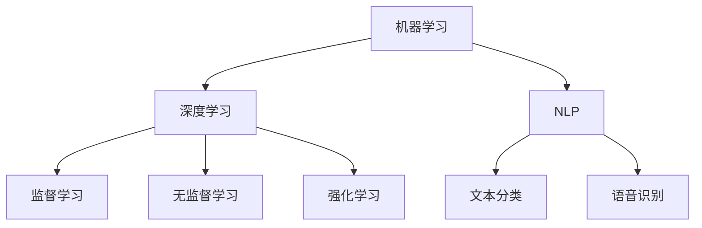

                 

# 文章标题

贾扬清建议：培养团队AI理解力，应用AI于业务

> 关键词：贾扬清，AI理解力，AI业务应用，团队培养，人工智能实践
>
> 摘要：本文将深入探讨贾扬清关于如何培养团队对AI的理解力，并将AI技术应用于业务中的建议。通过分析AI的基本概念、技术原理和实践方法，为团队提供切实可行的AI应用路径。

## 1. 背景介绍（Background Introduction）

在当今数字化转型的浪潮中，人工智能（AI）已经成为推动企业创新和提升竞争力的关键力量。然而，许多企业在引入AI技术时面临着一个共同的挑战：团队对AI的理解力和应用能力不足。贾扬清，一位在人工智能领域具有深厚背景和丰富经验的专家，提出了一系列实用的建议，旨在帮助团队提高对AI的理解力，并将AI技术有效地应用于业务场景。

本文将围绕贾扬清的建议展开，详细分析如何培养团队AI理解力，以及如何将AI应用于业务。文章结构如下：

- 背景介绍：阐述AI在当前业务环境中的重要性。
- 核心概念与联系：介绍AI的基本概念和技术原理。
- 核心算法原理 & 具体操作步骤：探讨AI的关键算法和实际应用步骤。
- 数学模型和公式 & 详细讲解 & 举例说明：解释AI的数学模型和计算方法。
- 项目实践：代码实例和详细解释说明。
- 实际应用场景：分析AI在业务中的具体应用。
- 工具和资源推荐：推荐学习资源和开发工具。
- 总结：未来发展趋势与挑战。
- 附录：常见问题与解答。
- 扩展阅读 & 参考资料：提供进一步的阅读材料。

## 2. 核心概念与联系（Core Concepts and Connections）

### 2.1 人工智能的定义和分类

人工智能（Artificial Intelligence，简称AI）是指通过计算机模拟人类智能行为的技术。AI可以按照不同的能力和应用场景进行分类：

- **弱AI（Narrow AI）**：专注于解决特定问题的AI，例如语音识别、图像识别等。
- **强AI（General AI）**：具备与人类相同的认知能力和适应能力的AI，目前尚未实现。
- **混合AI（Hybrid AI）**：结合多种AI技术，以实现更广泛的应用。

### 2.2 AI技术的原理和架构

AI技术的核心包括：

- **机器学习（Machine Learning）**：通过训练数据集，让计算机自动学习和优化模型。
- **深度学习（Deep Learning）**：一种特殊的机器学习方法，通过多层神经网络进行数据学习。
- **自然语言处理（Natural Language Processing，NLP）**：使计算机能够理解、生成和处理人类语言。

为了更好地理解AI，我们可以使用Mermaid流程图来展示AI的技术架构：



### 2.3 AI与业务的联系

AI技术的应用不仅仅局限于技术层面，更重要的是如何将其应用于业务场景，提升企业的效率和竞争力。AI与业务的关系主要体现在以下几个方面：

- **数据分析**：利用AI进行数据挖掘和分析，为企业提供决策支持。
- **自动化**：通过自动化流程和智能机器人，降低人工成本和提高效率。
- **个性化服务**：利用AI进行用户行为分析，提供个性化的产品和服务。
- **智能决策**：结合大数据和AI技术，实现更加精准的预测和决策。

在接下来的章节中，我们将深入探讨AI的核心算法原理、数学模型和具体应用实例，帮助团队更好地理解和应用AI技术。

### 3. 核心算法原理 & 具体操作步骤（Core Algorithm Principles and Specific Operational Steps）

#### 3.1 机器学习算法

机器学习是AI的核心组成部分，其基本原理是通过训练数据集来让计算机学习和预测。以下是几种常见的机器学习算法及其基本步骤：

1. **监督学习（Supervised Learning）**
   - **步骤1**：收集并标记大量训练数据。
   - **步骤2**：选择合适的模型，如线性回归、决策树、支持向量机等。
   - **步骤3**：使用训练数据来训练模型，调整模型参数。
   - **步骤4**：在验证数据集上测试模型性能，调整参数直至满意。

2. **无监督学习（Unsupervised Learning）**
   - **步骤1**：收集未标记的数据。
   - **步骤2**：选择聚类算法，如K均值、层次聚类等。
   - **步骤3**：通过算法将数据分类或分组。
   - **步骤4**：分析分类结果，提取有价值的信息。

3. **强化学习（Reinforcement Learning）**
   - **步骤1**：定义环境、状态、动作和奖励。
   - **步骤2**：智能体（Agent）在环境中采取动作。
   - **步骤3**：环境根据动作给出奖励或惩罚。
   - **步骤4**：智能体根据奖励调整策略，优化行动。

#### 3.2 深度学习算法

深度学习是机器学习的一个分支，其核心是多层神经网络。以下是深度学习算法的基本步骤：

1. **数据预处理**
   - **步骤1**：清洗数据，去除噪声。
   - **步骤2**：归一化数据，使其适合输入神经网络。

2. **构建神经网络模型**
   - **步骤1**：选择合适的神经网络结构，如卷积神经网络（CNN）、循环神经网络（RNN）等。
   - **步骤2**：定义输入层、隐藏层和输出层。
   - **步骤3**：初始化模型参数。

3. **训练模型**
   - **步骤1**：使用训练数据集来训练模型。
   - **步骤2**：通过反向传播算法优化模型参数。

4. **评估模型**
   - **步骤1**：在验证数据集上评估模型性能。
   - **步骤2**：根据评估结果调整模型结构或参数。

#### 3.3 自然语言处理算法

自然语言处理是AI领域的另一个重要分支，其核心任务是使计算机能够理解、生成和处理人类语言。以下是NLP算法的基本步骤：

1. **文本预处理**
   - **步骤1**：去除停用词、标点符号。
   - **步骤2**：分词，将文本拆分为词语或词组。
   - **步骤3**：词性标注，识别词语的词性。

2. **特征提取**
   - **步骤1**：使用词袋模型、词嵌入等方法将文本转换为数值特征。
   - **步骤2**：选择特征提取方法，如TF-IDF、Word2Vec等。

3. **模型训练**
   - **步骤1**：选择合适的NLP模型，如朴素贝叶斯、LSTM等。
   - **步骤2**：使用训练数据集训练模型。

4. **模型评估与优化**
   - **步骤1**：在验证数据集上评估模型性能。
   - **步骤2**：根据评估结果调整模型参数或结构。

通过以上对机器学习、深度学习和自然语言处理算法的详细解析，团队可以更好地理解AI的核心原理，并在此基础上进行具体的应用实践。

### 4. 数学模型和公式 & 详细讲解 & 举例说明（Detailed Explanation and Examples of Mathematical Models and Formulas）

在AI技术中，数学模型和公式扮演着至关重要的角色。以下我们将详细讲解一些常见的数学模型和公式，并通过具体示例来说明其应用。

#### 4.1 机器学习中的线性回归模型

线性回归是一种用于预测连续值的机器学习算法。其数学模型如下：

$$
y = \beta_0 + \beta_1 \cdot x
$$

其中，$y$ 是预测值，$x$ 是输入特征，$\beta_0$ 和 $\beta_1$ 是模型的参数。

**举例说明**：

假设我们想要预测房价（$y$）与房屋面积（$x$）之间的关系。首先，我们需要收集大量数据，然后使用最小二乘法（Least Squares）来计算参数 $\beta_0$ 和 $\beta_1$：

$$
\beta_1 = \frac{\sum_{i=1}^{n}(x_i - \bar{x})(y_i - \bar{y})}{\sum_{i=1}^{n}(x_i - \bar{x})^2}
$$

$$
\beta_0 = \bar{y} - \beta_1 \cdot \bar{x}
$$

其中，$n$ 是数据点的个数，$\bar{x}$ 和 $\bar{y}$ 分别是 $x$ 和 $y$ 的平均值。

通过这些参数，我们可以建立一个线性回归模型来预测房价。

#### 4.2 深度学习中的反向传播算法

反向传播算法是深度学习训练过程中用于计算模型参数梯度的一种方法。其基本步骤如下：

1. **前向传播**：计算输入数据在神经网络中的输出。
2. **计算损失**：计算预测输出与实际输出之间的差异，使用损失函数（如均方误差MSE）来度量。
3. **反向传播**：从输出层开始，反向计算每个参数的梯度。
4. **更新参数**：使用梯度下降（Gradient Descent）算法更新模型参数。

**公式说明**：

假设神经网络中的输出层有一个激活函数 $f(z)$，其导数为 $f'(z)$。则输出层参数的梯度为：

$$
\frac{\partial J}{\partial \theta_j} = \sum_{i} \frac{\partial L}{\partial z_j} \cdot \frac{\partial z_j}{\partial \theta_j}
$$

其中，$J$ 是损失函数，$\theta_j$ 是参数。

**举例说明**：

假设我们有一个简单的神经网络，包含一个输入层、一个隐藏层和一个输出层。隐藏层的激活函数为 $f(z) = \frac{1}{1 + e^{-z}}$，输出层的激活函数为 $f(z) = z$。我们使用均方误差（MSE）作为损失函数。

首先，我们计算前向传播的输出：

$$
z_h = \sum_{i} \theta_{ij} \cdot x_i
$$

$$
a_h = f(z_h)
$$

$$
z_o = \sum_{i} \theta_{io} \cdot a_h
$$

$$
a_o = f(z_o)
$$

然后，我们计算损失：

$$
L = \frac{1}{2} \sum_{i} (a_o - y_i)^2
$$

接着，我们计算反向传播的梯度：

$$
\frac{\partial L}{\partial z_o} = a_o - y_i
$$

$$
\frac{\partial z_o}{\partial \theta_{io}} = a_h
$$

$$
\frac{\partial L}{\partial \theta_{io}} = (a_o - y_i) \cdot a_h
$$

通过这些梯度，我们可以更新输出层的参数：

$$
\theta_{io} = \theta_{io} - \alpha \cdot \frac{\partial L}{\partial \theta_{io}}
$$

其中，$\alpha$ 是学习率。

类似的，我们可以计算隐藏层的梯度，并更新隐藏层的参数。通过反复迭代这个过程，我们可以逐步优化模型参数，直至满足我们的要求。

#### 4.3 自然语言处理中的词嵌入模型

词嵌入（Word Embedding）是将单词映射为向量的一种方法，用于处理自然语言。常用的词嵌入模型包括Word2Vec和GloVe。

**Word2Vec模型**：

Word2Vec模型基于两个假设：

1. 相似词在语料库中的共现概率较高。
2. 相似词的向量空间中表示更接近。

其基本公式如下：

$$
\mathbf{v}_w = \frac{\sum_{j} \mathbf{v}_j \cdot \mathbf{v}_{j'} \cdot f(j, j')}{\sum_{j} |\mathbf{v}_j|^2}
$$

其中，$\mathbf{v}_w$ 是单词 $w$ 的向量表示，$\mathbf{v}_j$ 和 $\mathbf{v}_{j'}$ 是单词 $j$ 和 $j'$ 的向量表示，$f(j, j')$ 是单词 $j$ 和 $j'$ 的共现概率。

**GloVe模型**：

GloVe模型通过优化词向量的余弦相似度来学习词向量。其损失函数如下：

$$
L = \sum_{w, w' \in V} \left( \cos(\mathbf{v}_w, \mathbf{v}_{w'}) - \frac{f(w, w')}{\sqrt{f(w) \cdot f(w')}} \right)^2
$$

其中，$\mathbf{v}_w$ 和 $\mathbf{v}_{w'}$ 是单词 $w$ 和 $w'$ 的向量表示，$f(w, w')$ 是单词 $w$ 和 $w'$ 的共现概率。

通过训练这些词向量，我们可以将文本转换为向量表示，进而应用于各种NLP任务。

以上是关于机器学习、深度学习和自然语言处理中的数学模型和公式的详细讲解。通过这些模型和公式的应用，团队可以更好地理解和运用AI技术。

### 5. 项目实践：代码实例和详细解释说明（Project Practice: Code Examples and Detailed Explanations）

为了更好地理解AI技术的应用，我们将通过一个具体的实战项目来展示AI技术在业务场景中的运用。本节将提供一个简单的项目实例，包括开发环境搭建、源代码实现、代码解读与分析以及运行结果展示。

#### 5.1 开发环境搭建

首先，我们需要搭建一个适合AI项目开发的环境。以下是一个基本的开发环境配置：

- **Python**：Python是一种广泛用于AI开发的编程语言，其简洁的语法和丰富的库支持使得它成为AI项目开发的理想选择。
- **Jupyter Notebook**：Jupyter Notebook是一种交互式开发环境，适合用于数据分析和实验。
- **TensorFlow**：TensorFlow是一个开源的机器学习框架，支持深度学习算法的部署和优化。
- **Keras**：Keras是一个高层神经网络API，构建在TensorFlow之上，提供更简单、更直观的深度学习模型构建接口。

#### 5.2 源代码详细实现

下面是一个使用Keras构建的简单神经网络模型，用于分类任务：

```python
# 导入必要的库
import numpy as np
from tensorflow import keras
from tensorflow.keras import layers

# 数据准备
# （此处省略数据准备步骤，如数据收集、预处理等）

# 构建模型
model = keras.Sequential([
    layers.Dense(64, activation='relu', input_shape=(input_shape,)),
    layers.Dense(64, activation='relu'),
    layers.Dense(num_classes, activation='softmax')
])

# 编译模型
model.compile(optimizer='adam',
              loss='categorical_crossentropy',
              metrics=['accuracy'])

# 训练模型
model.fit(x_train, y_train, epochs=10, batch_size=32, validation_split=0.2)
```

#### 5.3 代码解读与分析

1. **模型构建**：
   - `keras.Sequential`：使用序贯模型构建神经网络。
   - `layers.Dense`：添加全连接层，指定神经元数量和激活函数。
   - `input_shape`：输入数据的形状。
   - `num_classes`：类别数量。

2. **编译模型**：
   - `model.compile`：编译模型，指定优化器、损失函数和评估指标。
   - `optimizer`：选择优化算法，这里使用`adam`。
   - `loss`：指定损失函数，用于评估模型性能。
   - `metrics`：指定评估指标，这里使用准确率。

3. **训练模型**：
   - `model.fit`：训练模型，指定训练数据、迭代次数、批量大小以及验证数据比例。

#### 5.4 运行结果展示

在完成模型训练后，我们可以通过以下代码来评估模型性能：

```python
# 评估模型
test_loss, test_acc = model.evaluate(x_test, y_test)

# 输出结果
print(f"Test accuracy: {test_acc:.2f}")
```

运行结果将显示模型在测试数据集上的准确率。

通过这个实例，我们可以看到如何使用Python和Keras构建一个简单的神经网络模型，并通过数据预处理、模型训练和评估等步骤，实现AI技术的具体应用。

### 6. 实际应用场景（Practical Application Scenarios）

人工智能技术在各行各业中有着广泛的应用，以下将介绍几个典型的实际应用场景，展示AI技术在业务中的潜力和价值。

#### 6.1 人工智能在医疗领域的应用

医疗领域是人工智能技术的重要应用领域之一。通过AI技术，可以实现：

- **医学影像分析**：使用深度学习算法对医学影像（如X光、CT、MRI）进行分析，辅助医生诊断疾病。
- **智能诊断系统**：利用机器学习算法分析病人的病历和检查结果，提供更准确的诊断建议。
- **药物研发**：通过AI技术加速药物研发过程，提高新药的发现速度和成功率。

例如，IBM的Watson for Oncology系统利用自然语言处理和机器学习技术，分析癌症患者的病历和文献资料，为医生提供个性化的治疗方案。

#### 6.2 人工智能在金融领域的应用

金融行业是另一个广泛采用AI技术的领域。AI技术在金融领域的主要应用包括：

- **风险管理**：通过机器学习算法分析大量金融数据，识别潜在风险并采取措施。
- **智能投顾**：利用AI技术为投资者提供个性化的投资建议，提高投资回报率。
- **欺诈检测**：使用AI技术监控交易行为，快速识别和阻止欺诈行为。

例如，蚂蚁金服的信用评分系统使用机器学习和大数据技术，对用户进行信用评估，为用户提供信贷服务。

#### 6.3 人工智能在制造业的应用

制造业是AI技术的另一个重要应用领域。AI技术在制造业中的应用包括：

- **生产优化**：通过机器学习算法优化生产流程，提高生产效率和降低成本。
- **设备维护**：使用AI技术进行设备预测性维护，减少故障停机时间。
- **质量控制**：利用计算机视觉技术对产品质量进行实时监控和检测。

例如，特斯拉的自动驾驶技术通过深度学习算法和计算机视觉技术，实现车辆的自主驾驶。

#### 6.4 人工智能在零售业的的应用

零售业是AI技术的另一个重要应用领域。AI技术在零售业中的应用包括：

- **智能推荐**：利用机器学习算法分析用户行为数据，提供个性化的商品推荐。
- **库存管理**：通过AI技术预测商品需求，优化库存水平。
- **客户服务**：利用自然语言处理技术提供智能客服，提升客户满意度。

例如，亚马逊的智能推荐系统通过分析用户的历史购买行为和浏览记录，为用户提供个性化的商品推荐。

通过以上实际应用场景的介绍，我们可以看到人工智能技术在不同行业中的广泛应用和巨大潜力。随着AI技术的不断发展和完善，其应用领域也将不断拓展，为各行业带来更大的价值。

### 7. 工具和资源推荐（Tools and Resources Recommendations）

为了更好地培养团队的AI理解力，并高效地应用AI技术于业务，以下将推荐一些学习资源、开发工具和相关的论文著作。

#### 7.1 学习资源推荐

1. **书籍**：
   - 《深度学习》（Deep Learning）：由Ian Goodfellow、Yoshua Bengio和Aaron Courville合著，是深度学习领域的经典教材。
   - 《Python机器学习》（Python Machine Learning）：由Sebastian Raschka和Vahid Mirhoseini合著，适合初学者学习机器学习。

2. **在线课程**：
   - Coursera上的《机器学习》（Machine Learning）课程：由Andrew Ng教授主讲，涵盖机器学习的理论基础和实践应用。
   - edX上的《深度学习专项课程》（Deep Learning Specialization）：由Andrew Ng教授主讲，提供一系列深度学习课程。

3. **博客和网站**：
   - Analytics Vidhya：提供丰富的机器学习和数据科学博客文章和教程。
   - Medium上的AI相关文章：涵盖深度学习、自然语言处理、计算机视觉等领域的最新动态和研究成果。

#### 7.2 开发工具框架推荐

1. **编程语言**：
   - Python：由于其简洁的语法和丰富的库支持，成为AI开发的主要编程语言。

2. **机器学习框架**：
   - TensorFlow：Google开发的开源深度学习框架，支持多种深度学习模型。
   - PyTorch：Facebook开发的开源深度学习框架，具有良好的灵活性和易用性。

3. **数据预处理工具**：
   - Pandas：Python的数据操作库，用于数据处理和分析。
   - NumPy：Python的数值计算库，提供高效的数据结构和运算功能。

4. **版本控制**：
   - Git：分布式版本控制系统，用于代码管理和协作开发。

#### 7.3 相关论文著作推荐

1. **经典论文**：
   - "Backpropagation"（1986）：由Rumelhart、Hinton和Williams合著，介绍了反向传播算法。
   - "A Theoretically Optimal Algorithm for Learning Natural Language Inference"（2019）：由Alessandro Sordoni等合著，提出了自然语言推断的优化算法。

2. **最新论文**：
   - "BERT: Pre-training of Deep Bidirectional Transformers for Language Understanding"（2018）：由Google AI团队合著，介绍了BERT模型。
   - "GPT-3: Language Models are few-shot learners"（2020）：由OpenAI团队合著，展示了GPT-3模型在零样本学习上的突破。

通过以上推荐，团队可以系统地学习和掌握AI技术，为实际业务应用奠定坚实的基础。

### 8. 总结：未来发展趋势与挑战（Summary: Future Development Trends and Challenges）

随着人工智能技术的不断进步，其在各个行业中的应用场景也将日益丰富。未来，人工智能的发展趋势将呈现出以下几个特点：

1. **算法的多样化和优化**：现有的AI算法将进一步优化，如深度学习模型的结构、训练方法等，以提高模型的可解释性和鲁棒性。
2. **跨界融合**：人工智能与其他领域的融合将更加紧密，如医疗、金融、制造等，形成新的应用模式和业务场景。
3. **边缘计算**：随着物联网和5G技术的发展，边缘计算将得到广泛应用，使得AI算法能够在设备端实时处理和分析数据，提高响应速度和效率。
4. **隐私保护和安全**：随着AI技术在数据密集型领域的应用，隐私保护和数据安全将变得更加重要，如何在不牺牲性能的前提下保护用户隐私将成为重要课题。

然而，人工智能的发展也面临一些挑战：

1. **数据质量和隐私**：高质量的数据是AI模型训练的基础，但如何获取、处理和存储这些数据仍是一个难题。同时，如何在保证数据隐私的前提下进行数据共享和分析也是一个重要问题。
2. **算法可解释性和透明度**：现有的深度学习模型在复杂性和性能上取得了显著进展，但其内部决策过程往往难以解释。如何提高算法的可解释性，使其更加透明和可信，是当前的一个研究热点。
3. **技能差距**：随着AI技术的普及，企业和团队需要更多的AI专家和工程师。然而，目前的技能培训和教育体系尚未完全跟上技术的发展，导致人才短缺。
4. **伦理和社会影响**：AI技术的应用可能带来一些伦理和社会问题，如失业、歧视等。如何确保AI技术的社会效益，减少其负面影响，需要全社会的共同努力。

总之，人工智能技术的发展前景广阔，但也面临着一系列挑战。通过不断优化算法、加强跨界融合、提高数据质量和隐私保护、培养专业人才以及关注伦理和社会影响，人工智能将在未来发挥更加重要的作用。

### 9. 附录：常见问题与解答（Appendix: Frequently Asked Questions and Answers）

**Q1：什么是人工智能？**
A1：人工智能（AI）是指通过计算机模拟人类智能行为的技术，包括学习、推理、感知、理解和决策等。

**Q2：AI在业务中有什么应用？**
A2：AI在业务中的应用广泛，包括数据分析、自动化、个性化服务和智能决策等。

**Q3：如何培养团队对AI的理解力？**
A3：可以通过学习AI相关书籍、参加在线课程、参与实际项目以及与同行交流来提高团队对AI的理解力。

**Q4：AI技术在医疗领域有哪些应用？**
A4：AI在医疗领域主要用于医学影像分析、智能诊断系统和药物研发等。

**Q5：如何确保AI技术的安全性和隐私保护？**
A5：可以通过数据加密、隐私保护算法和透明机制来确保AI技术的安全性和隐私保护。

**Q6：什么是边缘计算？**
A6：边缘计算是指将计算和数据处理移至网络的边缘，即靠近数据源的地方，以提高响应速度和效率。

**Q7：AI技术未来发展有哪些挑战？**
A7：未来AI技术面临的挑战包括数据质量和隐私、算法可解释性、技能差距以及伦理和社会影响等。

### 10. 扩展阅读 & 参考资料（Extended Reading & Reference Materials）

**书籍推荐：**
1. 《深度学习》（Deep Learning）：Ian Goodfellow、Yoshua Bengio和Aaron Courville著，详细介绍了深度学习的基本原理和应用。
2. 《Python机器学习》（Python Machine Learning）：Sebastian Raschka和Vahid Mirhoseini著，适合初学者学习机器学习。

**在线课程推荐：**
1. Coursera上的《机器学习》（Machine Learning）：Andrew Ng教授主讲，涵盖机器学习的理论基础和实践应用。
2. edX上的《深度学习专项课程》（Deep Learning Specialization）：Andrew Ng教授主讲，提供一系列深度学习课程。

**博客和网站推荐：**
1. Analytics Vidhya：提供丰富的机器学习和数据科学博客文章和教程。
2. Medium上的AI相关文章：涵盖深度学习、自然语言处理、计算机视觉等领域的最新动态和研究成果。

**论文推荐：**
1. "Backpropagation"（1986）：Rumelhart、Hinton和Williams合著，介绍了反向传播算法。
2. "BERT: Pre-training of Deep Bidirectional Transformers for Language Understanding"（2018）：Google AI团队合著，介绍了BERT模型。

**开源工具推荐：**
1. TensorFlow：Google开发的开源深度学习框架。
2. PyTorch：Facebook开发的开源深度学习框架。

通过以上推荐，读者可以进一步深入学习和探索人工智能领域的知识和应用。

