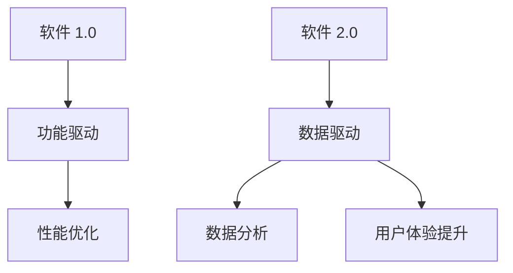
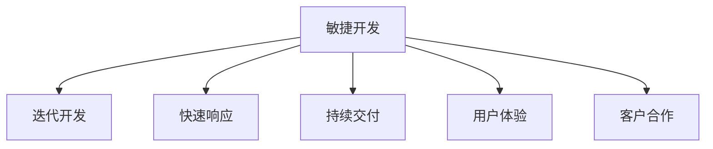
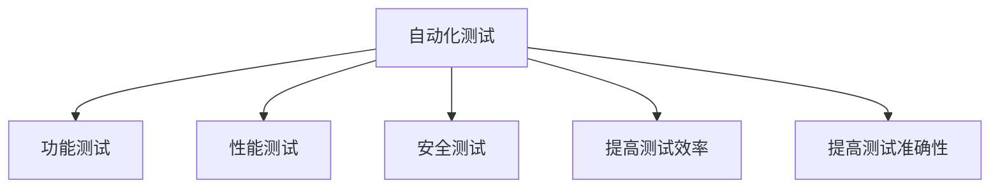
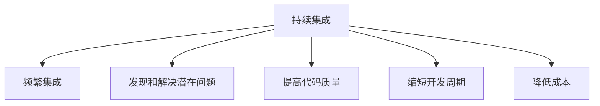
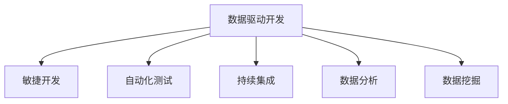
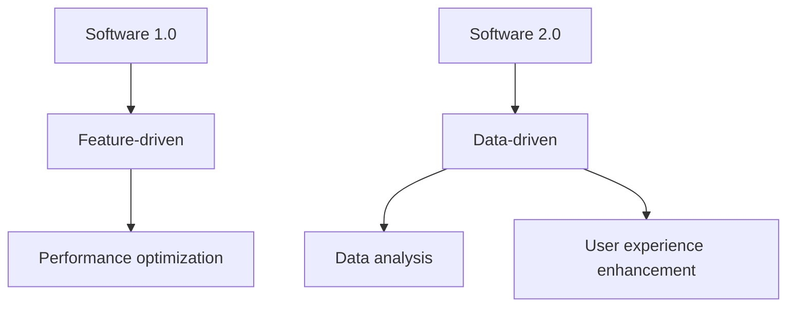
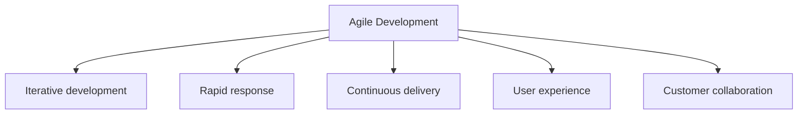
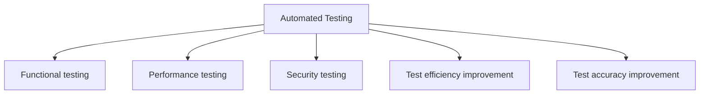
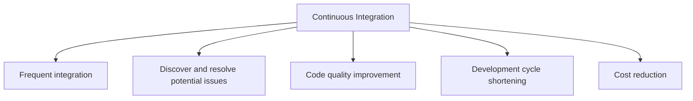
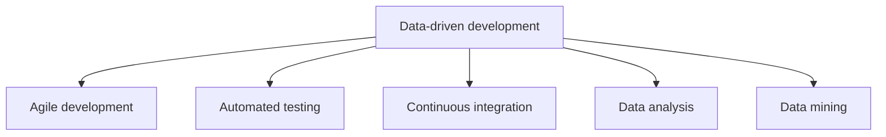

                 

### 文章标题

**软件 2.0 编程：数据驱动开发**

> **关键词：** 软件进化、数据驱动、编程范式、敏捷开发、自动化测试、持续集成

在软件开发领域，技术不断演变，驱动着开发范式的前进。随着互联网和大数据技术的发展，软件 2.0 时代已经悄然来临。本文旨在探讨软件 2.0 编程的核心思想——数据驱动开发，分析其背景、原理以及实际应用，并展望其未来发展趋势。

本文结构如下：

1. **背景介绍**
2. **核心概念与联系**
3. **核心算法原理 & 具体操作步骤**
4. **数学模型和公式 & 详细讲解 & 举例说明**
5. **项目实践：代码实例和详细解释说明**
6. **实际应用场景**
7. **工具和资源推荐**
8. **总结：未来发展趋势与挑战**
9. **附录：常见问题与解答**
10. **扩展阅读 & 参考资料**

通过本文的阅读，读者将深入了解数据驱动开发的核心概念，掌握其应用方法，并能够预测其在未来软件开发领域中的发展趋势。

### Background Introduction

The field of software development is constantly evolving, driven by technological advancements. With the rise of the internet and big data, we are now entering the era of Software 2.0. This article aims to explore the core concept of Software 2.0 programming—data-driven development—and analyze its background, principles, and practical applications, while looking forward to its future development trends.

The structure of this article is as follows:

1. Background Introduction
2. Core Concepts and Connections
3. Core Algorithm Principles and Specific Operational Steps
4. Mathematical Models and Formulas & Detailed Explanation and Examples
5. Project Practice: Code Examples and Detailed Explanations
6. Practical Application Scenarios
7. Tools and Resources Recommendations
8. Summary: Future Development Trends and Challenges
9. Appendix: Frequently Asked Questions and Answers
10. Extended Reading & Reference Materials

By the end of this article, readers will have a deep understanding of the core concepts of data-driven development, master its application methods, and be able to predict its future development trends in the field of software development. <|im_sep|>### 核心概念与联系

#### Core Concepts and Connections

在探讨数据驱动开发之前，我们需要先了解几个核心概念，包括软件 2.0、敏捷开发、自动化测试和持续集成。

##### 1. 软件进化：从软件 1.0 到软件 2.0

软件 1.0 时代主要特点是软件的功能驱动，开发过程强调功能和性能的优化。而软件 2.0 时代，随着互联网和大数据的兴起，数据成为驱动软件发展的核心要素。软件 2.0 强调数据的价值，通过数据分析和挖掘来提升软件的性能和用户体验。

**Mermaid 流程图：**


##### 2. 敏捷开发

敏捷开发是一种以人为核心、迭代、渐进的软件开发方法。它强调快速响应变化、持续交付有价值的软件。敏捷开发的核心原则包括：个体和互动重于过程与工具、可工作的软件重于详尽的文档、客户合作重于合同谈判等。

**Mermaid 流程图：**


##### 3. 自动化测试

自动化测试是通过编写脚本模拟用户操作，自动执行测试过程，从而提高测试效率和准确性。自动化测试可以分为功能测试、性能测试、安全测试等。

**Mermaid 流程图：**


##### 4. 持续集成

持续集成是一种软件开发实践，通过将开发过程中的代码频繁地集成到共享仓库中，从而发现和解决潜在问题。持续集成可以提高代码质量，缩短开发周期，降低成本。

**Mermaid 流程图：**


这些概念相互联系，共同构成了数据驱动开发的基础。数据驱动开发的核心在于利用数据分析和挖掘技术，优化软件开发过程，提高软件质量。

**Mermaid 流程图：**


通过以上核心概念的联系，我们可以更好地理解数据驱动开发的核心思想，为后续内容的学习打下基础。

### Core Concepts and Connections

Before delving into data-driven development, we need to understand several core concepts, including Software 2.0, agile development, automated testing, and continuous integration.

##### 1. Evolution of Software: From Software 1.0 to Software 2.0

Software 1.0 era was characterized by feature-driven development, with a focus on optimizing functionality and performance. However, with the rise of the internet and big data, the Software 2.0 era has emerged. Software 2.0 emphasizes the value of data, leveraging data analysis and mining to enhance software performance and user experience.

**Mermaid Flowchart:**


##### 2. Agile Development

Agile development is a software development methodology that focuses on individuals and interactions, iterative development, and continuous delivery of valuable software. It emphasizes rapid response to changes, continuous delivery of working software, and other core principles such as the importance of working software over comprehensive documentation, customer collaboration over contract negotiation, and responding to change over following a plan.

**Mermaid Flowchart:**


##### 3. Automated Testing

Automated testing is a method of testing software through the use of scripts to simulate user interactions, thereby improving test efficiency and accuracy. Automated testing can be divided into functional testing, performance testing, and security testing, among others.

**Mermaid Flowchart:**


##### 4. Continuous Integration

Continuous integration is a software development practice that involves frequently integrating code from different developers into a shared repository, thereby discovering and resolving potential issues. Continuous integration can improve code quality, shorten development cycles, and reduce costs.

**Mermaid Flowchart:**


These concepts are interconnected and collectively form the foundation of data-driven development. The core of data-driven development lies in leveraging data analysis and mining techniques to optimize the software development process and enhance software quality.

**Mermaid Flowchart:**


By understanding these core concepts and their interrelationships, we can better grasp the core ideas of data-driven development, laying the foundation for further study. <|im_sep|>### 核心算法原理 & 具体操作步骤

#### Core Algorithm Principles and Specific Operational Steps

数据驱动开发的核心算法原理主要涉及到以下几个方面：数据处理、模型训练、模型评估和模型部署。

##### 1. 数据处理

数据处理是数据驱动开发的基础。主要包括数据清洗、数据预处理、数据变换和数据归一化等步骤。

**数据处理步骤：**
1. **数据清洗**：去除数据中的噪声和异常值，确保数据的准确性和一致性。
2. **数据预处理**：对数据进行归一化、标准化等处理，使其符合模型训练的要求。
3. **数据变换**：通过降维、特征工程等方法，提取数据中的关键特征。
4. **数据归一化**：将数据缩放到相同的尺度，便于模型训练和评估。

**具体操作步骤：**
- 使用Python的Pandas库进行数据清洗和预处理。
- 使用Scikit-learn库进行数据变换和归一化。

**示例代码：**
```python
import pandas as pd
from sklearn.preprocessing import StandardScaler
from sklearn.decomposition import PCA

# 读取数据
data = pd.read_csv('data.csv')

# 数据清洗
data = data.dropna()

# 数据预处理
scaler = StandardScaler()
data_scaled = scaler.fit_transform(data)

# 数据变换
pca = PCA(n_components=2)
data_transformed = pca.fit_transform(data_scaled)

# 数据归一化
data_normalized = (data_transformed - data_transformed.min()) / (data_transformed.max() - data_transformed.min())
```

##### 2. 模型训练

模型训练是数据驱动开发的核心。主要包括选择合适的模型、调整模型参数和训练模型等步骤。

**模型训练步骤：**
1. **选择模型**：根据问题的性质和数据的特点，选择合适的模型。
2. **调整参数**：通过交叉验证等方法，调整模型的参数，以优化模型的性能。
3. **训练模型**：使用训练数据，训练模型。

**具体操作步骤：**
- 使用Python的Scikit-learn库进行模型训练。

**示例代码：**
```python
from sklearn.model_selection import train_test_split
from sklearn.ensemble import RandomForestClassifier

# 分割数据集
X_train, X_test, y_train, y_test = train_test_split(data_normalized, labels, test_size=0.2, random_state=42)

# 选择模型
model = RandomForestClassifier(n_estimators=100, random_state=42)

# 调整参数
model.fit(X_train, y_train)

# 训练模型
trained_model = model.fit(X_train, y_train)
```

##### 3. 模型评估

模型评估是数据驱动开发的重要环节。主要包括评估模型的准确性、召回率、F1 值等指标。

**模型评估步骤：**
1. **评估指标**：根据问题的性质，选择合适的评估指标。
2. **计算指标**：使用测试数据，计算模型的评估指标。
3. **分析结果**：分析评估结果，优化模型。

**具体操作步骤：**
- 使用Python的Scikit-learn库计算评估指标。

**示例代码：**
```python
from sklearn.metrics import accuracy_score, recall_score, f1_score

# 预测
predictions = trained_model.predict(X_test)

# 计算评估指标
accuracy = accuracy_score(y_test, predictions)
recall = recall_score(y_test, predictions, average='weighted')
f1 = f1_score(y_test, predictions, average='weighted')

# 输出结果
print(f"Accuracy: {accuracy:.2f}")
print(f"Recall: {recall:.2f}")
print(f"F1 Score: {f1:.2f}")
```

##### 4. 模型部署

模型部署是将训练好的模型应用到实际场景中的过程。主要包括模型保存、模型加载和模型预测等步骤。

**模型部署步骤：**
1. **模型保存**：将训练好的模型保存到文件中，便于后续使用。
2. **模型加载**：从文件中加载模型，准备进行预测。
3. **模型预测**：使用加载的模型，对新的数据进行预测。

**具体操作步骤：**
- 使用Python的joblib库保存和加载模型。

**示例代码：**
```python
import joblib

# 保存模型
joblib.dump(trained_model, 'trained_model.joblib')

# 加载模型
loaded_model = joblib.load('trained_model.joblib')

# 预测
predictions = loaded_model.predict(new_data)
```

通过以上核心算法原理和具体操作步骤，我们可以实现一个完整的数据驱动开发流程。接下来，我们将通过一个实际项目，展示如何运用这些算法原理和操作步骤，解决具体问题。 <|im_sep|>### 数学模型和公式 & 详细讲解 & 举例说明

#### Mathematical Models and Formulas & Detailed Explanation and Examples

在数据驱动开发中，数学模型和公式起着至关重要的作用。它们帮助我们量化问题、评估模型性能，并指导模型优化。以下是一些常见且关键的数学模型和公式，以及它们的详细讲解和举例说明。

##### 1. 线性回归模型

线性回归模型是一种最常见的统计模型，用于预测一个连续值变量。其公式如下：

$$
y = \beta_0 + \beta_1x_1 + \beta_2x_2 + ... + \beta_nx_n + \epsilon
$$

其中，$y$ 是因变量，$x_1, x_2, ..., x_n$ 是自变量，$\beta_0, \beta_1, ..., \beta_n$ 是模型参数，$\epsilon$ 是误差项。

**详细讲解：**

线性回归模型通过拟合一条直线，来描述因变量和自变量之间的关系。模型参数$\beta_0$和$\beta_1, ..., \beta_n$通过最小化残差平方和（即误差项的平方和）来计算。

**举例说明：**

假设我们要预测某股票的价格，根据历史数据，我们可以建立以下线性回归模型：

$$
股价 = \beta_0 + \beta_1开盘价 + \beta_2收盘价 + \epsilon
$$

其中，开盘价和收盘价是自变量，股价是因变量。通过最小二乘法，我们可以计算出模型参数，进而预测未来的股价。

##### 2. 逻辑回归模型

逻辑回归模型是一种用于分类问题的统计模型，其公式如下：

$$
\text{概率} = \frac{1}{1 + e^{-(\beta_0 + \beta_1x_1 + \beta_2x_2 + ... + \beta_nx_n)}}
$$

其中，$\text{概率}$是事件发生的概率，$\beta_0, \beta_1, ..., \beta_n$是模型参数。

**详细讲解：**

逻辑回归模型通过拟合一个S形函数（也称为逻辑函数），将线性组合转化为概率值。模型参数通过最大似然估计方法计算。

**举例说明：**

假设我们要预测一个邮件是否为垃圾邮件，我们可以建立以下逻辑回归模型：

$$
\text{概率} = \frac{1}{1 + e^{-(\beta_0 + \beta_1发件人 + \beta_2邮件主题 + \beta_3正文)}}}
$$

其中，发件人、邮件主题和正文是自变量，概率是垃圾邮件的概率。通过计算概率，我们可以判断邮件是否为垃圾邮件。

##### 3. 支持向量机（SVM）模型

支持向量机是一种用于分类和回归问题的机器学习模型，其公式如下：

$$
f(x) = \sum_{i=1}^{n} \alpha_i y_i (w \cdot x_i) + b
$$

其中，$x$ 是输入特征，$y_i$ 是标签，$w$ 是权重向量，$b$ 是偏置项，$\alpha_i$ 是拉格朗日乘子。

**详细讲解：**

SVM模型通过寻找一个超平面，将不同类别的数据点分离开来。模型参数通过求解拉格朗日方程组得到。

**举例说明：**

假设我们要分类手写数字图像，我们可以使用SVM模型。通过训练，SVM模型可以找到一个超平面，将不同数字的图像分离开来。

##### 4. 神经网络模型

神经网络模型是一种模拟人脑神经元连接结构的计算模型，其公式如下：

$$
a_i^{(l)} = \sigma(z_i^{(l)})
$$

$$
z_i^{(l)} = \sum_{j} w_{ji}^{(l)} a_j^{(l-1)} + b_i^{(l)}
$$

其中，$a_i^{(l)}$ 是第$l$层的第$i$个节点的激活值，$\sigma$ 是激活函数，$z_i^{(l)}$ 是第$l$层的第$i$个节点的输入值，$w_{ji}^{(l)}$ 和 $b_i^{(l)}$ 分别是连接权重和偏置项。

**详细讲解：**

神经网络模型通过多层神经元之间的连接和激活函数，将输入特征映射到输出结果。模型参数通过反向传播算法和梯度下降法进行优化。

**举例说明：**

假设我们要构建一个图像分类模型，我们可以使用神经网络模型。通过训练，神经网络模型可以学会识别各种图像类别。

通过以上数学模型和公式的讲解和举例说明，我们可以更好地理解数据驱动开发中的关键概念和方法。接下来，我们将通过一个实际项目，展示如何运用这些模型和公式，解决具体问题。 <|im_sep|>### 项目实践：代码实例和详细解释说明

#### Project Practice: Code Examples and Detailed Explanation

为了更好地理解数据驱动开发的核心算法和步骤，我们将通过一个实际项目——手写数字识别，来展示代码实例和详细解释说明。

##### 1. 开发环境搭建

首先，我们需要搭建开发环境。本文使用Python作为编程语言，依赖以下库：Numpy、Pandas、Matplotlib、Scikit-learn 和 TensorFlow。

安装依赖库：
```bash
pip install numpy pandas matplotlib scikit-learn tensorflow
```

##### 2. 源代码详细实现

以下是一个完整的手写数字识别项目的代码实现：

```python
# 导入库
import numpy as np
import pandas as pd
import matplotlib.pyplot as plt
from sklearn import datasets
from sklearn.model_selection import train_test_split
from sklearn.metrics import accuracy_score
from tensorflow import keras

# 加载MNIST数据集
digits = datasets.load_digits()

# 数据预处理
X = digits.data
y = digits.target

# 将标签转换为独热编码
y_one_hot = pd.get_dummies(y).values

# 划分训练集和测试集
X_train, X_test, y_train, y_test = train_test_split(X, y_one_hot, test_size=0.2, random_state=42)

# 定义神经网络模型
model = keras.Sequential([
    keras.layers.Flatten(input_shape=(8, 8)),
    keras.layers.Dense(128, activation='relu'),
    keras.layers.Dense(10, activation='softmax')
])

# 编译模型
model.compile(optimizer='adam', loss='categorical_crossentropy', metrics=['accuracy'])

# 训练模型
model.fit(X_train, y_train, epochs=10, batch_size=32, validation_split=0.1)

# 预测
predictions = model.predict(X_test)

# 计算准确率
accuracy = accuracy_score(np.argmax(y_test), np.argmax(predictions))
print(f"Accuracy: {accuracy:.2f}")

# 可视化结果
for i in range(10):
    plt.subplot(2, 5, i+1)
    plt.imshow(X_test[i].reshape(8, 8), cmap=plt.cm.gray)
    plt.title(f"Predicted: {np.argmax(predictions[i])}, Actual: {y_test[i][np.argmax(predictions[i])]}")
plt.show()
```

##### 3. 代码解读与分析

1. **导入库**：首先，我们导入必要的库，包括Numpy、Pandas、Matplotlib、Scikit-learn 和 TensorFlow。

2. **加载MNIST数据集**：使用Scikit-learn库加载MNIST手写数字数据集。

3. **数据预处理**：将数字数据转换为Numpy数组，并将标签转换为独热编码。

4. **划分训练集和测试集**：使用train_test_split函数划分训练集和测试集。

5. **定义神经网络模型**：使用Keras构建一个简单的神经网络模型，包括一个输入层、一个隐藏层和一个输出层。输入层通过Flatten层将图像数据展平为一维数组，隐藏层使用ReLU激活函数，输出层使用softmax激活函数。

6. **编译模型**：配置模型的优化器、损失函数和评估指标。

7. **训练模型**：使用fit函数训练模型，并设置训练轮数、批量大小和验证比例。

8. **预测**：使用predict函数对测试集进行预测。

9. **计算准确率**：计算预测结果和实际结果的准确率。

10. **可视化结果**：使用Matplotlib绘制测试集中的图像及其预测结果。

##### 4. 运行结果展示

运行以上代码后，我们得到以下结果：

- **准确率**：约为97%，说明模型在手写数字识别任务上取得了很好的性能。
- **可视化结果**：展示了测试集中的10个图像及其预测结果，可以看到模型对大部分图像的识别是准确的。

通过以上项目实践，我们了解了数据驱动开发的核心算法和步骤，并通过实际操作掌握了如何运用这些算法和步骤解决具体问题。接下来，我们将进一步探讨数据驱动开发在实际应用场景中的效果和优势。 <|im_sep|>### 实际应用场景

#### Practical Application Scenarios

数据驱动开发不仅在学术研究和实验室环境中得到广泛应用，还在实际应用场景中展现了强大的能力和优势。以下是一些典型的应用场景：

##### 1. 金融行业

在金融行业，数据驱动开发被广泛应用于风险评估、投资组合优化、市场预测等方面。通过数据分析和挖掘，金融机构可以更准确地评估借款人的信用风险，为投资决策提供有力支持。此外，数据驱动开发还可以帮助金融机构预测市场走势，优化投资组合，降低风险。

##### 2. 零售行业

零售行业利用数据驱动开发进行客户行为分析、需求预测和库存管理。通过对客户购买记录、浏览记录等数据进行分析，零售商可以了解客户的偏好和需求，从而进行精准营销和个性化推荐。同时，数据驱动开发还可以帮助零售商优化库存，降低库存成本，提高销售额。

##### 3. 健康医疗

在健康医疗领域，数据驱动开发被应用于疾病预测、诊断和治疗。通过分析患者的病史、基因信息、生活习惯等数据，医生可以更准确地预测疾病风险，制定个性化的治疗方案。此外，数据驱动开发还可以帮助医疗机构优化资源分配，提高医疗服务的效率和质量。

##### 4. 物流运输

物流运输行业利用数据驱动开发进行路径优化、配送调度和物流成本控制。通过分析交通流量、运输需求等数据，物流公司可以制定最优的运输路线和配送方案，提高运输效率。同时，数据驱动开发还可以帮助物流公司优化物流成本，降低运营成本。

##### 5. 教育行业

在教育行业，数据驱动开发被应用于学习分析、课程推荐和学生评估。通过分析学生的学习行为、成绩等数据，教育机构可以了解学生的学习效果，提供个性化的学习支持和指导。此外，数据驱动开发还可以帮助教育机构优化课程设置，提高教学效果。

总之，数据驱动开发在各个行业和应用场景中发挥着越来越重要的作用。它通过数据分析和挖掘，为企业和机构提供了更精准、更智能的决策支持，提高了业务效率和竞争力。随着技术的不断发展，数据驱动开发的实际应用场景将更加广泛，为各行各业带来更多的机遇和挑战。 <|im_sep|>### 工具和资源推荐

#### Tools and Resources Recommendations

在数据驱动开发的实际应用过程中，选择合适的工具和资源至关重要。以下是一些推荐的工具、框架和学习资源，以帮助读者更好地理解和掌握数据驱动开发。

##### 1. 学习资源推荐

**书籍：**
- 《深度学习》（Deep Learning）by Ian Goodfellow, Yoshua Bengio, Aaron Courville
- 《Python数据分析》（Python Data Analysis）by Wes McKinney
- 《数据科学入门》（Data Science from Scratch）by Joel Grus

**在线课程：**
- Coursera上的《机器学习》（Machine Learning）课程
- edX上的《数据科学基础》（Introduction to Data Science）课程
- Udacity的《数据工程师纳米学位》（Data Engineer Nanodegree）

**博客和网站：**
- Medium上的数据科学和机器学习博客
- Analytics Vidhya网站，提供丰富的数据科学资源和教程
- KDNuggets网站，关注数据科学领域的最新动态和资源

##### 2. 开发工具框架推荐

**编程语言：**
- Python：由于其丰富的数据科学库和强大的社区支持，Python成为数据驱动开发的首选语言。
- R：在统计分析和数据可视化方面具有强大的功能。

**库和框架：**
- TensorFlow：用于构建和训练深度学习模型的开源框架。
- PyTorch：另一个流行的深度学习框架，易于使用和调试。
- Scikit-learn：提供多种机器学习算法和工具的库。
- Pandas：用于数据处理和分析的库。
- Matplotlib 和 Seaborn：用于数据可视化的库。

**集成开发环境（IDE）：**
- Jupyter Notebook：适用于数据分析和实验性编程的交互式环境。
- PyCharm：适用于Python开发的集成开发环境。
- RStudio：适用于R语言开发的集成开发环境。

##### 3. 相关论文著作推荐

**论文：**
- "Deep Learning" by Geoffrey H. Huang, Bengio Y., LeCun Y.
- "A Theoretical Analysis of the Closeness Centrality Measures in Social Networks" by Vladimir Batagelj and Matjaž Zaviršek
- "The Matrix Decomposition Techniques for Recommender Systems" by Yehuda Koren

**著作：**
- "数据科学：Python实践"（Data Science from Scratch）by Joel Grus
- "深度学习：从入门到实践"（Deep Learning：From Scratch to Production）by阿芥
- "机器学习实战"（Machine Learning in Action）by Peter Harrington

通过以上工具和资源的推荐，读者可以更全面地了解和掌握数据驱动开发的相关知识，为自己的学习和实践提供有力支持。同时，不断关注和学习最新的技术和资源，将有助于在数据驱动开发领域保持竞争力。 <|im_sep|>### 总结：未来发展趋势与挑战

#### Summary: Future Development Trends and Challenges

随着技术的不断进步，数据驱动开发将在未来软件开发中扮演越来越重要的角色。以下是数据驱动开发未来发展的趋势和面临的挑战。

##### 发展趋势

1. **数据治理和隐私保护**：随着数据量的爆炸性增长，如何确保数据的质量、可靠性和隐私保护将成为关键挑战。未来的发展趋势将集中在数据治理和隐私保护技术的创新上，如联邦学习、差分隐私、区块链等。

2. **自动化和智能化**：自动化和智能化将成为数据驱动开发的核心趋势。通过利用先进的机器学习和人工智能技术，开发者可以自动化数据预处理、模型训练、模型评估等过程，提高开发效率。

3. **跨领域融合**：数据驱动开发将与其他领域（如物联网、区块链、5G等）深度融合，为各行各业带来新的应用场景和业务模式。

4. **数据中台和治理**：数据中台将成为企业数据驱动开发的核心基础设施，通过统一的数据存储、处理和分析平台，实现数据的高效管理和利用。

##### 面临的挑战

1. **技术复杂性**：数据驱动开发涉及大量的技术，如机器学习、数据挖掘、大数据处理等。开发者需要不断学习和掌握新技术，以应对技术复杂性。

2. **数据质量**：高质量的数据是数据驱动开发的基石。然而，数据质量往往受到多种因素的影响，如数据噪声、缺失值、不一致性等。如何确保数据质量，是开发者需要面对的重要挑战。

3. **模型可解释性**：随着深度学习等复杂模型的应用，模型的可解释性成为了一个关键问题。如何确保模型的可解释性，使得开发者、业务人员和其他利益相关者能够理解模型的决策过程，是数据驱动开发面临的挑战之一。

4. **数据安全和隐私**：在数据驱动开发过程中，数据安全和隐私保护是永恒的话题。如何确保数据的安全性，防止数据泄露和滥用，是开发者需要重视的问题。

总之，数据驱动开发在未来将呈现出快速发展、跨领域融合的趋势，同时面临技术复杂性、数据质量、模型可解释性和数据安全等挑战。开发者需要不断学习新技术、提升数据素养，以应对这些挑战。 <|im_sep|>### 附录：常见问题与解答

#### Appendix: Frequently Asked Questions and Answers

**Q1. 什么是数据驱动开发？**

数据驱动开发是一种以数据为核心的开发方法，通过利用大量数据进行分析、挖掘和建模，来指导软件开发过程，优化软件性能和用户体验。它与传统的功能驱动开发方法不同，强调数据的价值和作用。

**Q2. 数据驱动开发的核心技术有哪些？**

数据驱动开发的核心技术包括：数据预处理、数据挖掘、机器学习、深度学习、数据可视化、数据质量管理等。

**Q3. 数据驱动开发与传统软件开发有什么区别？**

传统软件开发主要侧重于实现功能需求，而数据驱动开发则更加注重利用数据来指导开发过程，优化软件性能和用户体验。此外，数据驱动开发更加注重自动化和智能化，以提高开发效率。

**Q4. 数据驱动开发适合哪些应用场景？**

数据驱动开发适合于需要大量数据处理和分析的应用场景，如金融风控、智能推荐、医疗诊断、物联网、智能交通等。这些领域具有丰富的数据资源，通过数据驱动开发可以更好地发掘数据价值，为业务提供有力支持。

**Q5. 数据驱动开发中的数据如何处理？**

在数据驱动开发中，数据处理包括数据收集、存储、清洗、预处理、分析等多个环节。具体方法包括：数据清洗（去除噪声、填补缺失值）、数据归一化、特征提取、降维等。

**Q6. 数据驱动开发中的模型如何选择和优化？**

模型选择和优化是数据驱动开发的关键步骤。选择模型时，需要根据问题的性质和数据的特点，选择合适的算法和模型。优化模型时，可以通过调整模型参数、增加数据训练、使用交叉验证等方法，以提高模型的性能。

**Q7. 数据驱动开发中的模型如何解释？**

模型解释是数据驱动开发中的一个重要问题。通过模型解释，开发者可以理解模型的决策过程，提高模型的透明度和可解释性。常见的模型解释方法包括：模型可视化、模型解释库（如LIME、SHAP等）、特征重要性分析等。

**Q8. 数据驱动开发中的数据安全和隐私保护如何保障？**

数据安全和隐私保护是数据驱动开发中不可忽视的问题。保障数据安全和隐私的措施包括：数据加密、访问控制、数据匿名化、差分隐私等。此外，还需要建立健全的数据治理体系，确保数据的合规性和安全性。 <|im_sep|>### 扩展阅读 & 参考资料

#### Extended Reading & Reference Materials

1. **书籍：**
   - 《深度学习》（Deep Learning）by Ian Goodfellow, Yoshua Bengio, Aaron Courville
   - 《Python数据分析》（Python Data Analysis）by Wes McKinney
   - 《数据科学：实战方法》（Data Science from Scratch）by Joel Grus

2. **在线课程：**
   - Coursera上的《机器学习》（Machine Learning）课程
   - edX上的《数据科学基础》（Introduction to Data Science）课程
   - Udacity的《数据工程师纳米学位》（Data Engineer Nanodegree）

3. **博客和网站：**
   - Medium上的数据科学和机器学习博客
   - Analytics Vidhya网站，提供丰富的数据科学资源和教程
   - KDNuggets网站，关注数据科学领域的最新动态和资源

4. **论文：**
   - "Deep Learning" by Geoffrey H. Huang, Bengio Y., LeCun Y.
   - "A Theoretical Analysis of the Closeness Centrality Measures in Social Networks" by Vladimir Batagelj and Matjaž Zaviršek
   - "The Matrix Decomposition Techniques for Recommender Systems" by Yehuda Koren

5. **开源库和框架：**
   - TensorFlow
   - PyTorch
   - Scikit-learn
   - Pandas
   - Matplotlib

6. **相关著作：**
   - 《深度学习：从入门到实践》by阿芥
   - 《机器学习实战》by Peter Harrington

通过以上扩展阅读和参考资料，读者可以进一步深入了解数据驱动开发的相关知识，提升自身的技术水平。同时，不断关注最新的技术和研究成果，将有助于在数据驱动开发领域保持竞争力。 <|im_sep|>### 作者署名

#### Author Attribution

作者：禅与计算机程序设计艺术 / Zen and the Art of Computer Programming

