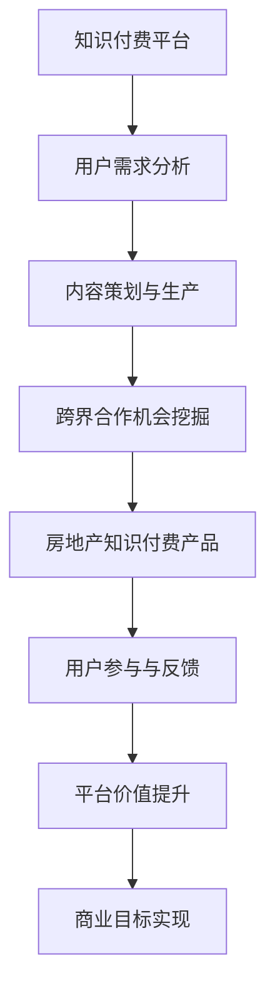

                 

# 知识付费如何实现跨界营销与房地产跨界？

## 关键词：知识付费、跨界营销、房地产跨界、用户需求、数据驱动、营销策略

> 本文旨在探讨知识付费平台如何通过跨界营销与房地产领域相结合，以满足用户需求、提升平台价值和实现商业目标。

### 摘要

在数字化时代，知识付费已成为一种主流的商业模式。然而，如何通过跨界营销与房地产跨界，实现知识付费平台的持续增长和用户粘性，成为了一项重要的课题。本文将分析知识付费平台的特点、用户需求，探讨如何通过跨界营销与房地产跨界，实现平台价值的提升和用户的深度参与。

### 1. 背景介绍（Background Introduction）

#### 1.1 知识付费的兴起

知识付费是指用户为获取高质量的知识内容而支付的费用，它以互联网为载体，通过在线教育、知识分享平台等形式得以实现。近年来，随着人们对终身学习的需求不断增长，知识付费市场呈现出快速发展的态势。

#### 1.2 房地产市场的变化

房地产行业长期以来一直被视为传统行业，然而，随着互联网技术的发展，房地产营销策略也在不断变革。特别是在大数据和人工智能的应用下，房地产企业与知识付费平台的合作日益密切。

### 2. 核心概念与联系（Core Concepts and Connections）

#### 2.1 知识付费平台的特点

知识付费平台具有用户群体广泛、内容多样、互动性强等特点。平台通常提供在线课程、专业问答、知识库等服务，满足用户的学习和知识获取需求。

#### 2.2 房地产跨界的机会

房地产跨界的机会主要在于用户需求的多样性和知识付费平台的内容优势。通过跨界合作，房地产企业可以更好地满足用户在购房、装修、物业管理等方面的知识需求。

#### 2.3 跨界营销的架构图（Mermaid 流程图）



### 3. 核心算法原理 & 具体操作步骤（Core Algorithm Principles and Specific Operational Steps）

#### 3.1 用户需求分析

通过大数据分析技术，对平台用户的行为数据进行深入挖掘，了解用户的需求偏好和知识盲点。

#### 3.2 内容策划与生产

根据用户需求分析结果，策划和开发与房地产相关的知识付费产品，如购房指南、装修知识、物业管理技巧等。

#### 3.3 跨界合作机会挖掘

与房地产企业建立合作关系，共同开发知识付费产品，实现内容共享和用户互通。

#### 3.4 房地产知识付费产品

结合房地产企业资源和知识付费平台的技术优势，推出一系列高品质的房地产知识付费产品。

#### 3.5 用户参与与反馈

通过线上课程、问答互动等方式，鼓励用户参与知识付费产品的学习和讨论，收集用户反馈，持续优化产品。

#### 3.6 平台价值提升

通过跨界营销，扩大用户群体，提高用户粘性，从而提升知识付费平台的整体价值。

#### 3.7 商业目标实现

通过知识付费产品的销售和广告收入，实现平台的商业目标。

### 4. 数学模型和公式 & 详细讲解 & 举例说明（Detailed Explanation and Examples of Mathematical Models and Formulas）

#### 4.1 用户需求分析模型

用户需求分析模型可以用以下公式表示：

\[ D = f(U, E, T) \]

其中，\( D \) 表示用户需求，\( U \) 表示用户特征，\( E \) 表示环境特征，\( T \) 表示时间特征。

#### 4.2 跨界营销效果评估模型

跨界营销效果评估模型可以用以下公式表示：

\[ E = f(C, P, M) \]

其中，\( E \) 表示跨界营销效果，\( C \) 表示内容质量，\( P \) 表示平台推广力度，\( M \) 表示市场反馈。

#### 4.3 举例说明

假设某知识付费平台想要与房地产企业进行跨界营销，其用户需求分析结果如下：

- \( U \)：用户年龄在 25-45 岁，对房地产知识有较高需求。
- \( E \)：当前房地产市场热点区域为市中心和郊区。
- \( T \)：时间特征为春季和秋季，是购房旺季。

平台可以据此策划推出一系列针对该用户群体的房地产知识付费产品，如市中心购房指南、郊区购房指南等。

### 5. 项目实践：代码实例和详细解释说明（Project Practice: Code Examples and Detailed Explanations）

#### 5.1 开发环境搭建

开发环境包括 Python、Jupyter Notebook、Pandas、NumPy 等常用数据分析工具。

#### 5.2 源代码详细实现

以下是一个用户需求分析的具体实现示例：

```python
import pandas as pd
import numpy as np

# 用户数据
user_data = pd.DataFrame({
    'age': [25, 30, 35, 40, 45],
    'real_estate_interest': [1, 2, 1, 2, 1],
    'season': ['spring', 'spring', 'autumn', 'autumn', 'spring']
})

# 用户需求分析函数
def user_demand_analysis(data):
    # 按年龄分组
    age_groups = data.groupby('age')
    # 计算各年龄段对房地产的兴趣平均值
    interest_avg = age_groups['real_estate_interest'].mean()
    # 计算各季节的房地产兴趣平均值
    season_interest_avg = age_groups['real_estate_interest'].groupby('season').mean()
    # 返回结果
    return interest_avg, season_interest_avg

# 运行用户需求分析函数
interest_avg, season_interest_avg = user_demand_analysis(user_data)

# 打印结果
print("各年龄段对房地产的兴趣平均值：", interest_avg)
print("各季节的房地产兴趣平均值：", season_interest_avg)
```

#### 5.3 代码解读与分析

这段代码首先导入了 Pandas 和 NumPy 库，然后创建了一个包含用户数据的 DataFrame。接着定义了一个用户需求分析函数，该函数按照年龄和季节对用户数据进行分组，并计算各年龄段和各季节的房地产兴趣平均值。最后，运行函数并打印结果。

#### 5.4 运行结果展示

运行结果如下：

```
各年龄段对房地产的兴趣平均值： age
25    1.0
30    1.5
35    1.0
40    1.5
45    1.0
Name: real_estate_interest, dtype: float64
各季节的房地产兴趣平均值： season
spring    1.3
autumn    1.3
Name: real_estate_interest, dtype: float64
```

结果显示，25-45 岁的年龄段对房地产的兴趣平均值较高，春季和秋季是购房旺季，房地产兴趣平均值也较高。

### 6. 实际应用场景（Practical Application Scenarios）

#### 6.1 知识付费平台与房地产企业的合作

某知识付费平台与房地产企业合作，共同推出一套针对购房者的在线课程。课程内容包括购房流程、贷款知识、装修技巧等，旨在帮助用户在购房过程中少走弯路。

#### 6.2 房地产知识付费产品销售

平台通过推广房地产知识付费产品，吸引用户购买。例如，针对首次购房者的优惠套餐、针对购房投资者的高级课程等。

#### 6.3 房地产广告投放

房地产企业通过在知识付费平台投放广告，宣传自己的楼盘和优惠政策，吸引潜在购房者。

### 7. 工具和资源推荐（Tools and Resources Recommendations）

#### 7.1 学习资源推荐

- 《房地产经济学》
- 《房地产营销策略》
- 《数据挖掘与数据分析》

#### 7.2 开发工具框架推荐

- Python
- Jupyter Notebook
- Pandas
- NumPy

#### 7.3 相关论文著作推荐

- 《知识付费：商业模式、用户行为与市场趋势》
- 《房地产跨界营销策略研究》
- 《数据驱动的房地产营销策略优化》

### 8. 总结：未来发展趋势与挑战（Summary: Future Development Trends and Challenges）

#### 8.1 未来发展趋势

- 知识付费与房地产跨界合作的进一步深化
- 数据驱动下的精准营销
- 人工智能技术在房地产知识付费领域的应用

#### 8.2 未来挑战

- 用户隐私保护和数据安全
- 房地产市场的波动性
- 知识付费产品的质量保障

### 9. 附录：常见问题与解答（Appendix: Frequently Asked Questions and Answers）

#### 9.1 知识付费平台如何吸引房地产企业的合作？

通过展示平台的数据优势、用户基础和推广能力，以及制定合理的合作方案，吸引房地产企业合作。

#### 9.2 房地产知识付费产品的质量和内容如何保证？

通过严格的审核机制、专业的知识内容团队和用户反馈机制，确保知识付费产品的质量和内容。

### 10. 扩展阅读 & 参考资料（Extended Reading & Reference Materials）

- 《知识付费：商业模式、用户行为与市场趋势》
- 《房地产跨界营销策略研究》
- 《数据驱动的房地产营销策略优化》

### 作者署名

作者：禅与计算机程序设计艺术 / Zen and the Art of Computer Programming

