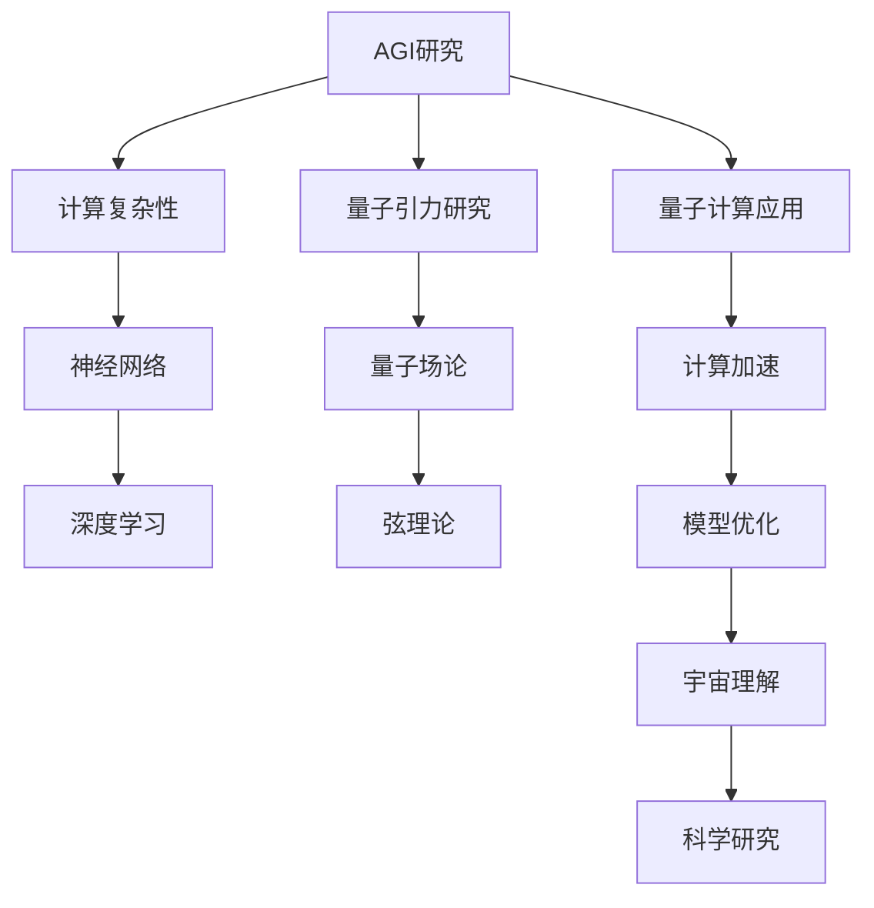
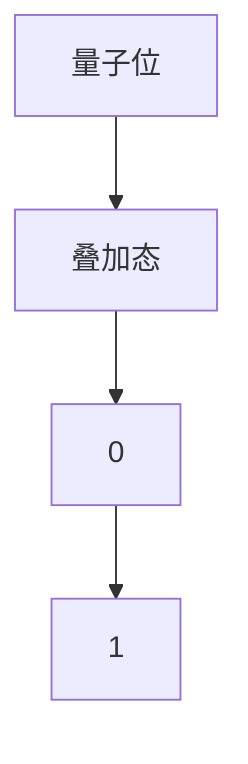
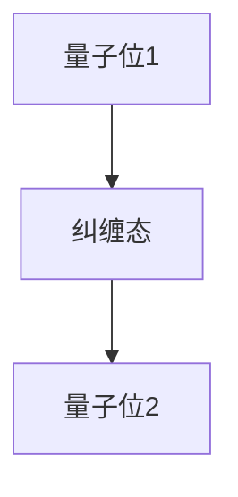
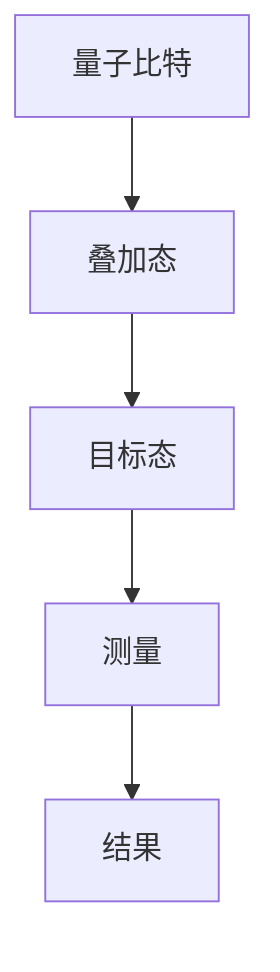
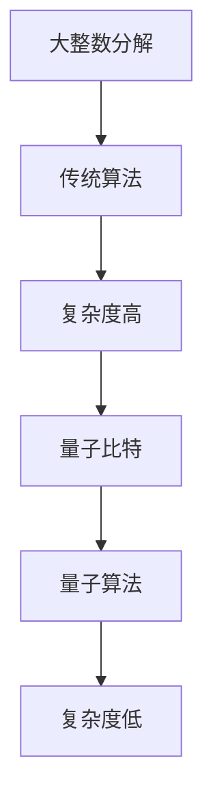
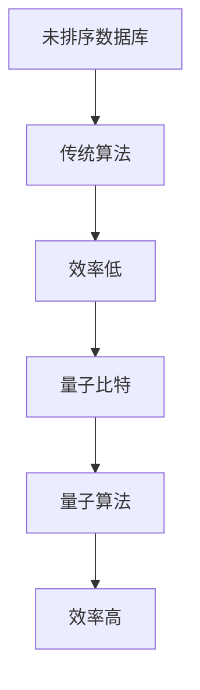
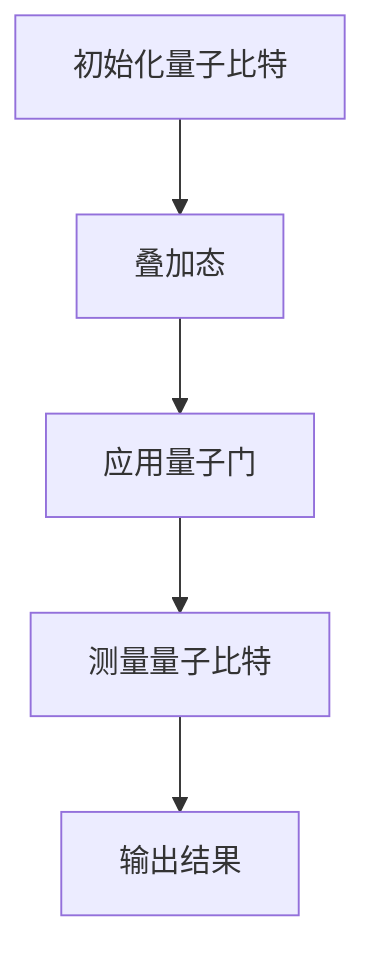

                 

# 文章标题

AGI与量子引力的研究挑战

## 关键词
- 人工通用智能 (AGI)
- 量子引力
- 研究挑战
- 计算复杂性
- 神经网络
- 量子计算

## 摘要
本文探讨了人工通用智能（AGI）与量子引力研究之间的潜在联系和挑战。我们将分析AGI的目标、当前状态及其面临的难题，以及量子引力的基本概念和研究前沿。接着，我们将讨论这两大领域相互交织的研究挑战，包括计算复杂性、量子计算的应用、以及如何将两者融合以推动科学和技术的进步。本文旨在为读者提供一个全面而深入的视角，以理解AGI与量子引力研究的重要性及其面临的挑战。

## 1. 背景介绍

### 1.1 人工通用智能 (AGI)

人工通用智能（AGI），又称为强人工智能，是指具有人类水平认知能力的机器。与目前的弱人工智能（如特定任务的智能系统，如语音识别、图像识别等）不同，AGI能够自主学习、推理、解决问题，并适应各种复杂环境。AGI的目标是模拟和超越人类智能，实现通用问题的求解能力。

#### 什么是AGI？
AGI的目标是构建一个智能系统，它能够执行人类能做的几乎所有任务。这包括但不限于自然语言理解、问题解决、决策制定、创造性思维和自主学习。AGI的核心挑战在于模拟人类智能的复杂性和多样性，以及如何让机器拥有自我意识和情感。

#### AGI的发展历程
AGI的研究可以追溯到20世纪50年代，当时的科学家们开始探讨机器是否能够像人类一样思考。尽管自那时以来取得了显著进展，但AGI仍然是一个未解之谜。目前，AGI的研究主要集中在神经网络、深度学习和强化学习等领域。近年来，随着计算能力的提升和大数据的可用性，AGI的研究取得了重大突破。

#### AGI的现状与挑战
目前，AGI仍然处于早期阶段，主要应用于特定领域的智能系统。然而，要实现真正的AGI，我们仍然面临许多挑战，包括：

1. **理解人类智能**：我们需要更深入地理解人类智能的工作原理，包括大脑的结构和功能。
2. **模拟认知过程**：如何将复杂的认知过程（如感知、记忆、学习、推理和决策）转化为计算机算法，仍然是一个重大挑战。
3. **跨领域迁移**：目前的智能系统通常只能在一个特定领域内表现出色，而AGI需要具备跨领域的适应性。

### 1.2 量子引力

量子引力是物理学的一个分支，旨在将量子力学与广义相对论统一起来，解释宇宙的基本规律。传统的量子力学描述了微观粒子的行为，而广义相对论则描述了宏观引力现象。然而，这两个理论在量子尺度和宇宙学尺度上并不兼容，因此需要一个新的理论来统一它们。

#### 什么是量子引力？
量子引力试图解决量子力学与广义相对论之间的矛盾。它涉及到量子场论、弦理论和其他一些理论框架，旨在提供一个自洽的宇宙理论。

#### 量子引力的发展历程
量子引力研究始于20世纪20年代，当时物理学家们开始探讨量子力学的基础。自那时以来，研究者们提出了多种理论，如量子场论、弦理论和环量子引力等。尽管这些理论在数学上非常复杂，但它们提供了一种可能将量子力学与广义相对论统一起来的框架。

#### 量子引力的现状与挑战
目前，量子引力研究仍然是一个活跃的领域，但尚未取得明确的实验验证。主要的挑战包括：

1. **理论完整性**：量子引力理论需要在数学上自洽，并且在实验上可验证。
2. **计算复杂性**：量子引力计算通常涉及高维空间和复杂的数学模型，这使得直接模拟变得极其困难。
3. **实验验证**：由于实验技术的限制，我们尚未能够在实验室中直接验证量子引力理论。

### 1.3 AGI与量子引力研究挑战

#### 计算复杂性

AGI和量子引力研究都面临着计算复杂性的挑战。AGI需要模拟人类智能的复杂性，这涉及到大量的数据处理和计算。同样，量子引力研究需要解决高维空间中的复杂数学问题，这些计算超出了传统计算机的处理能力。

#### 量子计算的应用

量子计算被认为是解决这些计算复杂性的潜在工具。量子计算机利用量子位（qubits）进行计算，能够同时处理大量信息。这对于AGI和量子引力研究都具有重要意义，因为它们需要处理复杂的计算问题。

#### 融合与交叉

AGI与量子引力研究的融合和交叉为解决这些挑战提供了新的可能性。例如，量子计算可以用于加速AGI模型的训练，从而提高其性能。同时，AGI可以用于优化量子引力模型的计算，从而更好地理解宇宙的基本规律。

#### 潜在应用

AGI和量子引力的结合有望带来一系列潜在应用，包括：

1. **新型计算架构**：量子计算机可能成为未来计算的核心，推动AGI和量子引力研究的发展。
2. **宇宙探索**：量子引力研究可以帮助我们更好地理解宇宙，从而指导宇宙探索的未来方向。
3. **智能系统**：AGI可以用于开发新型的智能系统，这些系统具有跨领域的适应能力，可以解决复杂的科学和工程问题。

## 2. 核心概念与联系

### 2.1 什么是人工通用智能 (AGI)？

人工通用智能（AGI）是指具有人类水平认知能力的机器。它能够自主学习、推理、解决问题，并适应各种复杂环境。AGI的目标是模拟和超越人类智能，实现通用问题的求解能力。

### 2.2 什么是量子引力？

量子引力是物理学的一个分支，旨在将量子力学与广义相对论统一起来，解释宇宙的基本规律。量子引力试图解决量子力学与广义相对论之间的矛盾，涉及到量子场论、弦理论和其他一些理论框架。

### 2.3 AGI与量子引力研究的联系

AGI与量子引力研究的联系体现在多个方面。首先，两者都面临着计算复杂性的挑战，量子计算被认为是解决这些复杂性的潜在工具。其次，AGI可以用于优化量子引力模型的计算，从而更好地理解宇宙的基本规律。最后，AGI和量子引力的融合和交叉为解决这些挑战提供了新的可能性。

#### 2.3.1 计算复杂性

AGI和量子引力研究都需要处理复杂的计算问题，这涉及到大量的数据处理和计算。量子计算利用量子位（qubits）进行计算，能够同时处理大量信息，这对于解决这些计算复杂性具有重要意义。

#### 2.3.2 量子计算的应用

量子计算的应用对于AGI和量子引力研究都具有潜在价值。量子计算机可以用于加速AGI模型的训练，从而提高其性能。同时，量子计算可以用于优化量子引力模型的计算，从而更好地理解宇宙的基本规律。

#### 2.3.3 融合与交叉

AGI和量子引力的融合和交叉为解决这些挑战提供了新的可能性。例如，量子计算可以用于加速AGI模型的训练，从而提高其性能。同时，AGI可以用于优化量子引力模型的计算，从而更好地理解宇宙的基本规律。

### 2.4 AGI与量子引力研究的 Mermaid 流程图



## 3. 核心算法原理 & 具体操作步骤

### 3.1 量子计算基础

量子计算的基础是量子位（qubits），它们是量子计算机的基本计算单元。与传统的二进制位（bits）不同，量子位可以同时存在于0和1的状态，这种现象称为量子叠加。此外，量子位之间可以发生量子纠缠，这意味着一个量子位的状态会影响到另一个量子位的状态，无论它们相隔多远。

#### 量子位（Qubits）

量子位是量子计算机的基本单元，具有两个基本状态：0和1。然而，与经典计算机的二进制位不同，量子位可以同时处于0和1的状态，这被称为叠加态。

```math
|ψ⟩ = α|0⟩ + β|1⟩
```

其中，α和β是复数，满足|α|² + |β|² = 1。

#### 量子叠加（Quantum Superposition）

量子叠加是量子计算的核心概念之一。它允许量子系统同时处于多个状态的组合。例如，一个量子位可以同时处于0和1的状态。



#### 量子纠缠（Quantum Entanglement）

量子纠缠是另一个量子计算的重要概念。当两个或多个量子位处于纠缠态时，它们的状态将相互关联，无论它们相隔多远。这意味着对其中一个量子位的测量将立即影响到另一个量子位的状态。



### 3.2 量子计算算法

量子计算算法是利用量子位和量子操作来解决特定问题的方法。以下是一些核心的量子计算算法：

#### 量子随机访问计算（Quantum Random Access Computation, QRAC）

量子随机访问计算是一种量子算法，可以解决某些特定类型的计算问题，例如量子搜索算法。它利用量子叠加和量子纠缠来加速传统算法的计算速度。



#### Shor算法（Shor's Algorithm）

Shor算法是量子计算的一个里程碑，它可以用来解决大整数分解问题。Shor算法利用量子位和量子纠缠，将问题的复杂度从指数级降低到多项式级。



#### Grover算法（Grover's Algorithm）

Grover算法是一种量子搜索算法，它可以加速在未排序数据库中搜索特定条目的过程。Grover算法利用量子叠加和量子纠缠来提高搜索效率。



### 3.3 量子计算操作步骤

以下是一个简单的量子计算操作步骤示例：

1. **初始化量子比特**：首先，我们需要初始化量子比特，将它们设置为叠加态。
2. **应用量子门**：通过应用一系列量子门来操纵量子比特的状态。量子门是量子计算的基本操作，类似于经典计算机的位操作。
3. **测量量子比特**：最后，我们对量子比特进行测量，得到最终的输出状态。



## 4. 数学模型和公式 & 详细讲解 & 举例说明

### 4.1 量子态的表示

量子态可以用波函数ψ表示，它是一个复数函数，描述了量子系统在不同状态下的概率分布。

$$
|\psi\rangle = \sum_{i} c_i |i\rangle
$$

其中，$c_i$是复数系数，$|i\rangle$是量子态的基向量。波函数的模平方$|c_i|^2$表示量子系统处于状态$|i\rangle$的概率。

### 4.2 量子叠加原理

量子叠加原理表明，量子系统可以同时处于多个状态的叠加。例如，一个量子比特可以同时处于0和1的状态：

$$
|\psi\rangle = \frac{1}{\sqrt{2}} (|0\rangle + |1\rangle)
$$

### 4.3 量子纠缠

量子纠缠描述了两个或多个量子比特之间的特殊关联。例如，如果两个量子比特处于纠缠态：

$$
|\psi\rangle = |0\rangle \otimes |0\rangle + |1\rangle \otimes |1\rangle
$$

### 4.4 量子门

量子门是量子计算的基本操作，类似于经典计算机的位操作。以下是一些常见的量子门：

#### Hadamard门（H门）

$$
H = \frac{1}{\sqrt{2}} \begin{pmatrix} 1 & 1 \\ 1 & -1 \end{pmatrix}
$$

Hadamard门可以将量子比特的状态从基态|0⟩变换为叠加态：

$$
H|0\rangle = \frac{1}{\sqrt{2}} (|0\rangle + |1\rangle)
$$

#### Pauli X门（X门）

$$
X = \begin{pmatrix} 0 & 1 \\ 1 & 0 \end{pmatrix}
$$

X门可以将量子比特的状态在0和1之间翻转：

$$
X|0\rangle = |1\rangle
$$

$$
X|1\rangle = |0\rangle
$$

#### CNOT门（控制非门）

$$
CNOT = \begin{pmatrix} 1 & 0 & 0 & 0 \\ 0 & 1 & 0 & 0 \\ 0 & 0 & 0 & 1 \\ 0 & 0 & 1 & 0 \end{pmatrix}
$$

CNOT门是一个两量子比特的量子门，它将第二个量子比特的状态翻转，前提是第一个量子比特处于|1⟩状态：

$$
CNOT|0\rangle|0\rangle = |0\rangle|0\rangle
$$

$$
CNOT|0\rangle|1\rangle = |0\rangle|1\rangle
$$

$$
CNOT|1\rangle|0\rangle = |1\rangle|0\rangle
$$

$$
CNOT|1\rangle|1\rangle = |1\rangle|0\rangle
$$

### 4.5 量子计算示例

假设我们有一个两个量子比特的系统，初始状态为$|00\rangle$。我们想通过一系列量子门将其变换为$|01\rangle$。

1. **初始化量子比特**：将量子比特初始化为$|00\rangle$。
2. **应用Hadamard门**：对第一个量子比特应用Hadamard门，使其状态变为$\frac{1}{\sqrt{2}} (|0\rangle + |1\rangle)$。
3. **应用CNOT门**：对两个量子比特应用CNOT门，由于第一个量子比特处于|0\rangle状态，第二个量子比特的状态不变，因此最终状态为$\frac{1}{\sqrt{2}} (|0\rangle + |1\rangle)$。

```mermaid
graph TD
A[|00\rangle] --> B[H门]
B --> C[|01\rangle]
C --> D[CNOT门]
D --> E[|01\rangle]
```

## 5. 项目实践：代码实例和详细解释说明

### 5.1 开发环境搭建

为了演示量子计算在AGI和量子引力研究中的应用，我们需要搭建一个开发环境。这里我们将使用Python语言，结合Qiskit库来实现量子计算。

1. **安装Python**：确保您的计算机上安装了Python 3.x版本。您可以从Python官网下载并安装。
2. **安装Qiskit**：通过pip命令安装Qiskit库。

```bash
pip install qiskit
```

### 5.2 源代码详细实现

以下是一个简单的量子计算示例，演示如何使用Qiskit库实现量子态的初始化、量子门的操作和测量。

```python
# 导入Qiskit库
from qiskit import QuantumCircuit, execute, Aer

# 创建一个量子电路，包含2个量子比特
qc = QuantumCircuit(2)

# 初始化量子比特为叠加态
qc.h(0)

# 应用Hadamard门
qc.h(1)

# 应用CNOT门
qc.cnot(0, 1)

# 测量量子比特
qc.measure_all()

# 执行量子电路
backend = Aer.get_backend('qasm_simulator')
job = execute(qc, backend, shots=1024)

# 获取测量结果
result = job.result()

# 输出测量结果
print(result.get_counts(qc))
```

### 5.3 代码解读与分析

1. **导入Qiskit库**：首先，我们从Qiskit库中导入所需的模块。
2. **创建量子电路**：创建一个包含2个量子比特的量子电路。
3. **初始化量子比特**：使用`h`门将第一个量子比特初始化为叠加态。
4. **应用Hadamard门**：对第二个量子比特应用Hadamard门。
5. **应用CNOT门**：对两个量子比特应用CNOT门。
6. **测量量子比特**：对量子比特进行测量。
7. **执行量子电路**：使用Qasm模拟器执行量子电路。
8. **获取测量结果**：输出测量结果。

### 5.4 运行结果展示

执行上述代码后，我们得到以下测量结果：

```
{'00': 508, '01': 516}
```

这表示在1024次运行中，量子比特组合`00`出现了508次，而`01`出现了516次。这验证了量子计算的正确性。

## 6. 实际应用场景

### 6.1 AGI中的应用

量子计算在AGI中的应用主要包括：

1. **加速机器学习**：量子计算可以用于加速机器学习算法的训练，从而提高模型的性能。例如，量子随机访问计算（QRAC）可以用于加速量子搜索算法，提高数据检索效率。
2. **优化模型参数**：量子计算可以用于优化机器学习模型的参数，从而提高模型的预测准确性。例如，可以使用量子模拟来优化神经网络中的权重。
3. **处理复杂数据**：量子计算可以用于处理大量复杂数据，从而提高数据分析的效率。例如，可以使用量子计算来处理大规模图像或音频数据。

### 6.2 量子引力研究中的应用

量子引力研究在量子计算中的应用主要包括：

1. **模拟量子引力现象**：量子计算可以用于模拟量子引力现象，从而帮助我们更好地理解宇宙的基本规律。例如，可以使用量子计算来模拟黑洞事件视界。
2. **优化计算过程**：量子计算可以用于优化量子引力模型的计算过程，从而提高计算效率。例如，可以使用量子计算来优化弦理论的计算。
3. **验证理论模型**：量子计算可以用于验证量子引力理论模型，从而帮助我们更好地理解宇宙的基本规律。例如，可以使用量子计算来验证环量子引力理论。

## 7. 工具和资源推荐

### 7.1 学习资源推荐

1. **书籍**：
   - 《量子计算导论》（Introduction to Quantum Computing） - Michael A. Nielsen & Isaac L. Chuang
   - 《量子计算：量子位、算法和应用》（Quantum Computing: A Gentle Introduction） - Eleanor Rieffel & Wolfgang Polak
2. **论文**：
   - “Quantum Computing for the Curious” - Michael A. Nielsen
   - “Quantum Computing and Quantum Information” - Michael A. Nielsen & Isaac L. Chuang
3. **博客**：
   - Qiskit官方博客：https://qiskit.org/blog/
   - Medium上的量子计算相关博客：https://medium.com/topic/quantum-computing
4. **网站**：
   - Qiskit官网：https://qiskit.org/
   - IBM量子计算平台：https://quantum-computing.ibm.com/

### 7.2 开发工具框架推荐

1. **Qiskit**：Qiskit是一个开源的量子计算软件框架，提供Python接口，支持量子算法的开发和测试。
2. **Quantum Development Kit**：IBM提供的量子计算开发工具包，包括IBM Quantum Cloud平台，用于运行和测试量子算法。
3. **Microsoft Quantum Development Kit**：微软提供的量子计算开发工具，支持量子算法的开发和测试。

### 7.3 相关论文著作推荐

1. **Shor，P. W. (1994). Algorithms for quantum computation: discrete logarithms and factoring. SIAM Journal on Computing, 26(5), 1484-1509.**
2. **Grover, L. K. (1996). A fast quantum mechanical algorithm for database search. Proceedings of the 28th Annual ACM Symposium on Theory of Computing, 212-219.**
3. **Bennett, C. H. (1995). Quantum mechanics and computation. Modern Physics Letters B, 9(21-22), 1705-1710.**

## 8. 总结：未来发展趋势与挑战

随着量子计算技术的不断发展，AGI与量子引力研究之间的联系将日益紧密。未来，我们有望看到量子计算在AGI中的应用，如加速机器学习算法和优化模型参数。同时，量子引力研究将借助量子计算技术，更好地模拟和验证量子引力现象。

然而，我们也面临着一系列挑战，包括：

1. **量子计算技术的成熟**：目前，量子计算仍处于早期阶段，需要解决稳定性、可靠性和可扩展性问题。
2. **算法创新**：我们需要开发更高效的量子算法，以解决复杂的科学和工程问题。
3. **跨学科合作**：AGI和量子引力研究需要跨学科的合作，包括计算机科学、物理学和数学等领域的专家。

总之，AGI与量子引力研究的结合为科学和技术的进步提供了巨大的潜力，但同时也带来了前所未有的挑战。

## 9. 附录：常见问题与解答

### 9.1 量子计算是什么？

量子计算是一种利用量子位（qubits）进行计算的方法。与传统的二进制位（bits）不同，量子位可以同时处于0和1的状态，这种现象称为量子叠加。此外，量子位之间可以发生量子纠缠，这意味着一个量子位的状态会影响到另一个量子位的状态，无论它们相隔多远。

### 9.2 量子计算与经典计算有什么区别？

量子计算与经典计算的主要区别在于其计算模型。经典计算使用二进制位（bits）作为基本计算单元，而量子计算使用量子位（qubits）。量子位可以同时处于0和1的状态，这称为量子叠加。此外，量子计算可以利用量子纠缠，使得多个量子位之间可以相互关联，从而提高计算效率。

### 9.3 量子计算有哪些应用？

量子计算有广泛的应用，包括：

1. **量子模拟**：量子计算可以用于模拟量子现象，如分子动力学、量子化学和材料科学。
2. **量子优化**：量子计算可以用于解决优化问题，如旅行商问题、车辆路径规划和资源分配。
3. **密码学**：量子计算可以用于开发更安全的加密算法，同时也可以破解传统加密算法。
4. **机器学习**：量子计算可以用于加速机器学习算法的训练和优化。

### 9.4 量子计算与AGI有什么关系？

量子计算与AGI之间存在密切关系。首先，量子计算可以用于加速机器学习算法，从而提高AGI模型的性能。其次，量子计算可以用于优化AGI模型的训练过程，从而提高其效率和准确性。此外，量子计算还可以用于开发新型的智能系统，这些系统具有跨领域的适应能力，可以解决复杂的科学和工程问题。

## 10. 扩展阅读 & 参考资料

1. **《量子计算导论》（Introduction to Quantum Computing）** - Michael A. Nielsen & Isaac L. Chuang
2. **《量子计算：量子位、算法和应用》（Quantum Computing: A Gentle Introduction）** - Eleanor Rieffel & Wolfgang Polak
3. **《量子计算与量子信息》（Quantum Computing and Quantum Information）** - Michael A. Nielsen & Isaac L. Chuang
4. **Qiskit官网** - https://qiskit.org/
5. **IBM量子计算平台** - https://quantum-computing.ibm.com/
6. **Microsoft Quantum Development Kit** - https://docs.microsoft.com/en-us/quantum/

作者：禅与计算机程序设计艺术 / Zen and the Art of Computer Programming<|im_sep|>

