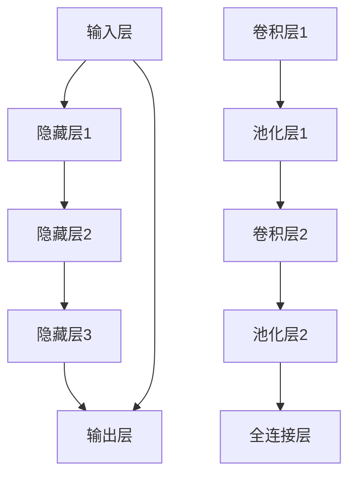

                 

### 背景介绍（Background Introduction）

深度学习作为人工智能（AI）领域的一个重要分支，已经在过去几十年里经历了迅猛的发展。随着计算能力的提升、数据量的增加和算法的优化，深度学习已经成功地应用于图像识别、自然语言处理、语音识别、推荐系统等众多领域。然而，随着深度学习的不断演进，我们也逐步进入了AI 2.0时代。

AI 2.0时代，即人工智能的第二阶段，标志着人工智能系统在理解、推理、交互和自主决策等方面有了质的飞跃。在这个时代，深度学习不再仅仅依赖于大规模数据和强大的计算资源，而是开始更多地关注模型的可解释性、鲁棒性和泛化能力。本文将围绕AI 2.0时代的深度学习，探讨其核心概念、算法原理、数学模型以及实际应用。

在接下来的章节中，我们将首先介绍AI 2.0时代深度学习的基本背景和定义。接着，我们将深入探讨深度学习中的核心概念和架构，包括神经网络、卷积神经网络（CNN）和循环神经网络（RNN）。随后，我们将详细介绍深度学习中的核心算法原理，如反向传播算法、优化算法等。然后，我们将通过具体案例和数学模型，详细讲解深度学习算法的运作过程和实现细节。在此基础上，我们将展示一个实际的深度学习项目实例，包括开发环境搭建、代码实现、代码解读与分析以及运行结果展示。最后，我们将探讨深度学习在实际应用场景中的广泛用途，并推荐一些相关工具和资源。

通过这篇文章，我们希望能够帮助读者全面了解AI 2.0时代深度学习的发展现状、核心技术及应用场景，为未来研究和实践提供参考。

### 关键词（Keywords）

- AI 2.0
- 深度学习
- 神经网络
- 卷积神经网络（CNN）
- 循环神经网络（RNN）
- 反向传播算法
- 优化算法
- 实际应用场景

### 摘要（Abstract）

本文旨在介绍AI 2.0时代的深度学习，探讨其基本背景、核心概念、算法原理、数学模型以及实际应用。首先，我们将回顾深度学习的发展历程，并定义AI 2.0时代的概念。接着，我们将详细讨论深度学习中的关键技术和算法，包括神经网络、卷积神经网络和循环神经网络。随后，我们将通过具体案例，深入讲解深度学习算法的数学模型和实现细节。最后，我们将展示一个实际的深度学习项目，分析其在实际应用场景中的效果，并提供相关的学习资源和开发工具推荐。本文的目标是帮助读者全面理解深度学习在AI 2.0时代的应用前景和发展趋势。

### 1. 背景介绍（Background Introduction）

#### 深度学习的发展历程

深度学习（Deep Learning）起源于20世纪40年代的人工智能研究，但直到21世纪初，由于数据稀缺和计算资源限制，深度学习并没有得到广泛的应用。随着互联网的普及和大数据时代的到来，深度学习迎来了新的发展机遇。2006年，加拿大科学家Geoffrey Hinton提出了深度置信网络（Deep Belief Network，DBN），这被认为是深度学习发展史上的一个重要里程碑。随后，深度学习在图像识别、语音识别、自然语言处理等领域取得了显著成果。

#### AI 2.0时代的概念

AI 2.0时代，又称新一代人工智能，是相对于传统人工智能（AI 1.0）而言的。AI 1.0时代主要依赖基于规则的专家系统和简单的机器学习算法，而AI 2.0时代则强调人工智能系统在理解、推理、交互和自主决策等方面的能力。AI 2.0时代的核心目标是实现更智能、更自主的人工智能系统，使其能够更好地服务于人类生活和经济发展。

#### 深度学习在AI 2.0时代的作用

在AI 2.0时代，深度学习成为了实现人工智能目标的重要工具。深度学习具有以下几方面作用：

1. **提升智能水平**：通过深度学习，人工智能系统能够从大量数据中自动提取特征，进行复杂的模式识别和决策。这使得人工智能在图像识别、语音识别、自然语言处理等领域取得了显著的进步。
2. **增强自主学习能力**：深度学习算法具有强大的自主学习能力，能够通过不断优化模型参数，提高任务的完成效果。这使得人工智能系统能够在复杂、动态的环境中自主适应和进化。
3. **提高可解释性**：尽管深度学习模型通常被视为“黑箱”，但近年来，研究人员提出了许多方法来提高模型的可解释性，使得人工智能系统能够更好地理解和解释其决策过程。
4. **拓展应用领域**：深度学习不仅在传统的人工智能领域取得了突破，还在医疗、金融、教育、工业等领域展现了广泛的应用潜力。

#### 当前深度学习的研究热点

随着深度学习的不断发展，当前的研究热点主要包括以下几个方面：

1. **模型压缩和优化**：为了应对实际应用中计算资源受限的问题，研究人员致力于研究如何压缩和优化深度学习模型，使其在保持性能的同时降低计算复杂度和存储需求。
2. **迁移学习**：迁移学习是一种利用已训练好的模型在新的任务上快速获得良好性能的方法。近年来，迁移学习在自然语言处理、图像识别等领域取得了显著成果。
3. **自监督学习**：自监督学习是一种无需标注数据的深度学习训练方法，近年来受到了广泛关注。通过自监督学习，模型可以从大量未标注的数据中自动提取有效特征。
4. **多模态学习**：多模态学习旨在将不同类型的数据（如图像、文本、音频等）进行整合，以实现更高级别的智能任务，如图像文本匹配、音频分类等。

#### 深度学习的发展趋势

展望未来，深度学习在以下几个方面有望取得重要突破：

1. **智能交互**：随着深度学习技术在语音识别、自然语言处理等领域的发展，智能交互系统将变得更加自然、流畅和人性化。
2. **自主决策**：通过强化学习和深度学习相结合的方法，人工智能系统将能够实现更加复杂的自主决策，如自动驾驶、智能机器人等。
3. **多模态融合**：多模态学习将深度学习应用于多个领域，实现跨模态的信息融合和任务处理。
4. **泛化能力提升**：通过研究更有效的深度学习算法和模型结构，人工智能系统的泛化能力将得到显著提高，使其能够在更广泛的应用场景中发挥作用。

总之，深度学习在AI 2.0时代发挥着至关重要的作用，其研究与应用将为人类社会的进步带来更多可能性。在接下来的章节中，我们将深入探讨深度学习中的核心概念、算法原理和实际应用，以帮助读者更好地理解这一领域的最新进展和发展趋势。

### 2. 核心概念与联系（Core Concepts and Connections）

#### 2.1 神经网络（Neural Networks）

神经网络是深度学习的基础，它由大量的节点（或称为神经元）组成，这些节点通过边缘（或称为连接）相互连接。每个神经元接收来自其他神经元的输入信号，通过一个非线性激活函数进行处理，最后产生输出。神经网络通过学习输入和输出之间的映射关系，实现从数据中自动提取特征和进行预测。

**神经网络的结构**

神经网络可以分为输入层、隐藏层和输出层。输入层接收外部输入数据，隐藏层对输入数据进行变换和提取特征，输出层产生最终预测结果。隐藏层的数量和节点的数量可以根据任务需求进行调整。

**神经网络的工作原理**

神经网络通过前向传播（Forward Propagation）和反向传播（Backpropagation）两个过程进行学习。在前向传播过程中，输入数据从输入层传递到隐藏层，然后传递到输出层。每个神经元将接收到的输入信号乘以连接权重，并通过激活函数进行处理，得到输出。在反向传播过程中，神经网络根据预测结果和实际结果之间的误差，更新连接权重，以优化模型的性能。

#### 2.2 卷积神经网络（Convolutional Neural Networks，CNN）

卷积神经网络是深度学习中专门用于图像识别和图像处理的模型。与传统的神经网络不同，CNN利用卷积运算来提取图像中的局部特征，从而实现高效的图像识别。

**CNN的结构**

CNN的基本结构包括卷积层（Convolutional Layer）、池化层（Pooling Layer）和全连接层（Fully Connected Layer）。卷积层通过卷积运算提取图像特征，池化层对特征进行降维，全连接层对特征进行分类和预测。

**CNN的工作原理**

在CNN中，卷积运算用于提取图像的局部特征。卷积层由多个卷积核（Filter）组成，每个卷积核对输入图像进行卷积操作，生成特征图。池化层通过下采样操作，减少特征图的维度，从而降低计算复杂度。全连接层将特征图展开成向量，然后通过一个非线性激活函数进行分类预测。

#### 2.3 循环神经网络（Recurrent Neural Networks，RNN）

循环神经网络是深度学习中专门用于处理序列数据的模型，如文本、语音和视频。与传统的神经网络和卷积神经网络不同，RNN具有记忆能力，能够利用历史信息对当前输入进行建模。

**RNN的结构**

RNN由输入层、隐藏层和输出层组成。隐藏层中的神经元通过循环连接，将前一时刻的隐藏状态传递到当前时刻，用于处理当前输入。

**RNN的工作原理**

在RNN中，每个时间步的输入通过隐藏层中的循环连接进行处理。隐藏层将接收到的输入和上一时间步的隐藏状态进行拼接，并通过一个非线性激活函数进行处理，得到当前时间步的隐藏状态。输出层通过隐藏状态生成当前时间步的输出。RNN利用历史信息，能够更好地建模序列数据中的时序关系。

#### 2.4 多层感知机（Multilayer Perceptron，MLP）

多层感知机是一种简单的全连接神经网络，它通常用于分类和回归任务。MLP通过前向传播和反向传播算法进行学习，其结构包括输入层、隐藏层和输出层。

**MLP的结构**

MLP的输入层接收外部输入数据，隐藏层对输入数据进行变换和提取特征，输出层产生最终预测结果。隐藏层的数量和节点的数量可以根据任务需求进行调整。

**MLP的工作原理**

MLP通过前向传播和反向传播算法进行学习。在前向传播过程中，输入数据从输入层传递到隐藏层，然后传递到输出层。每个神经元将接收到的输入信号乘以连接权重，并通过激活函数进行处理，得到输出。在反向传播过程中，根据预测结果和实际结果之间的误差，更新连接权重，以优化模型的性能。

#### 2.5 深度学习中的其他重要概念

除了上述的神经网络、卷积神经网络和循环神经网络，深度学习还包括许多其他重要的概念，如反向传播算法、优化算法、激活函数、正则化技术等。

- **反向传播算法**：反向传播算法是深度学习训练过程中的核心算法，它用于计算模型参数的梯度，以优化模型性能。
- **优化算法**：优化算法用于调整模型参数，以使模型在训练数据上的误差最小化。常见的优化算法包括梯度下降、Adam优化器等。
- **激活函数**：激活函数用于对神经元输出进行非线性变换，以实现非线性建模。常见的激活函数包括Sigmoid、ReLU、Tanh等。
- **正则化技术**：正则化技术用于防止模型过拟合，提高模型的泛化能力。常见的正则化技术包括L1正则化、L2正则化、Dropout等。

#### 2.6 神经网络与其他机器学习模型的比较

与传统的机器学习模型（如支持向量机、决策树等）相比，神经网络具有以下优势：

- **更强的表达能力和拟合能力**：神经网络能够通过多层结构自动提取复杂的数据特征，从而实现更高的拟合能力。
- **更广泛的适用范围**：神经网络可以应用于图像识别、自然语言处理、语音识别等多种任务。
- **自动特征提取**：神经网络能够从数据中自动提取特征，减少人工特征工程的工作量。

然而，神经网络也存在一些缺点，如计算复杂度高、训练时间较长、对数据质量要求较高等。因此，在实际应用中，需要根据任务需求和数据特点选择合适的模型。

### Mermaid 流程图

以下是一个Mermaid流程图，展示了深度学习中的核心概念和架构：



通过这个流程图，我们可以清晰地看到神经网络、卷积神经网络和循环神经网络的基本结构和工作原理。这有助于我们更好地理解深度学习的核心概念和联系。

在接下来的章节中，我们将深入探讨深度学习中的核心算法原理，包括反向传播算法、优化算法等，并详细讲解这些算法的实现和应用。同时，我们将通过具体案例和数学模型，进一步阐明深度学习算法的运作过程和实现细节。

### 3. 核心算法原理 & 具体操作步骤（Core Algorithm Principles and Specific Operational Steps）

#### 3.1 反向传播算法（Backpropagation Algorithm）

反向传播算法是深度学习训练过程中的核心算法，它用于计算模型参数的梯度，并优化模型性能。反向传播算法可以分为两个主要阶段：前向传播（Forward Propagation）和反向传播（Backpropagation）。

**前向传播**

在前向传播过程中，输入数据从输入层传递到隐藏层，再传递到输出层。在每个时间步或神经元上，输入信号通过连接权重进行加权求和，并经过激活函数处理后得到输出。具体步骤如下：

1. **初始化模型参数**：随机初始化模型中的连接权重和偏置。
2. **前向传播计算**：将输入数据输入到神经网络中，通过每个神经元的连接权重进行加权求和，并经过激活函数处理后得到输出。输出可以通过以下公式计算：
   $$\text{输出} = \text{激活函数}(\sum_{i}\text{权重}_i \cdot \text{输入}_i + \text{偏置})$$

**反向传播**

在反向传播过程中，根据输出和实际结果之间的误差，计算每个神经元和连接权重上的梯度，并更新模型参数。具体步骤如下：

1. **计算输出误差**：计算输出和实际结果之间的误差，可以使用均方误差（Mean Squared Error，MSE）作为损失函数：
   $$\text{损失} = \frac{1}{2}\sum_{i}\text{实际输出}_i - \text{预测输出}_i)^2$$
2. **计算梯度**：从输出层开始，逆向计算每个神经元和连接权重上的梯度。每个神经元的梯度可以通过以下公式计算：
   $$\text{梯度} = \frac{\partial \text{损失}}{\partial \text{输出}} \cdot \frac{\partial \text{输出}}{\partial \text{输入}}$$
3. **更新参数**：根据梯度更新模型参数，使用优化算法（如梯度下降）进行参数调整。更新公式如下：
   $$\text{权重}_i := \text{权重}_i - \text{学习率} \cdot \text{梯度}$$

**反向传播算法的优缺点**

- **优点**：反向传播算法能够通过自动计算梯度，实现模型参数的优化，从而提高模型的性能。
- **缺点**：反向传播算法的计算复杂度较高，对于大规模模型和大数据集，计算时间和内存需求较大。

#### 3.2 优化算法（Optimization Algorithms）

优化算法用于调整模型参数，以使模型在训练数据上的误差最小化。常见的优化算法包括梯度下降（Gradient Descent）、Adam优化器等。

**梯度下降（Gradient Descent）**

梯度下降是一种最简单的优化算法，其基本思想是通过梯度方向更新模型参数，使损失函数逐渐减小。具体步骤如下：

1. **初始化模型参数**：随机初始化模型中的连接权重和偏置。
2. **计算梯度**：根据当前参数，计算损失函数关于每个参数的梯度。
3. **更新参数**：使用学习率（Learning Rate）乘以梯度，更新模型参数。更新公式如下：
   $$\text{权重}_i := \text{权重}_i - \text{学习率} \cdot \text{梯度}_i$$
4. **迭代**：重复上述步骤，直到达到训练目标或收敛条件。

**Adam优化器（Adam Optimizer）**

Adam优化器是一种结合了梯度下降和动量法的优化算法，它能够更好地处理稀疏数据和不同尺度的参数更新。具体步骤如下：

1. **初始化模型参数**：随机初始化模型中的连接权重和偏置。
2. **计算梯度**：根据当前参数，计算损失函数关于每个参数的梯度。
3. **更新参数**：使用学习率、一阶矩估计（一阶矩估计项）和二阶矩估计（二阶矩估计项）更新模型参数。更新公式如下：
   $$\text{权重}_i := \text{权重}_i - \text{学习率} \cdot \text{一阶矩估计}_i / \sqrt{\text{二阶矩估计}_i + \text{常数}}$$
4. **迭代**：重复上述步骤，直到达到训练目标或收敛条件。

**优化算法的优缺点**

- **优点**：优化算法能够有效地调整模型参数，提高模型性能。
- **缺点**：优化算法需要调节多个参数（如学习率、动量等），且对于不同任务和数据集，需要选择合适的优化算法。

#### 3.3 激活函数（Activation Functions）

激活函数用于对神经元输出进行非线性变换，以实现非线性建模。常见的激活函数包括Sigmoid、ReLU、Tanh等。

**Sigmoid函数**

Sigmoid函数是一种常见的激活函数，其公式如下：
$$\text{输出} = \frac{1}{1 + e^{-\text{输入}}}$$
Sigmoid函数具有以下特点：

- **非线性**：通过引入指数函数，Sigmoid函数能够实现非线性变换。
- **平滑**：Sigmoid函数的输出范围在0到1之间，具有平滑的过渡。

**ReLU函数**

ReLU函数是一种流行的激活函数，其公式如下：
$$\text{输出} = \max(0, \text{输入})$$
ReLU函数具有以下特点：

- **非线性**：ReLU函数在输入大于0时输出等于输入，具有非线性特性。
- **稀疏**：ReLU函数能够鼓励神经元在非激活状态时保持不变，有助于模型训练。

**Tanh函数**

Tanh函数是一种常用的激活函数，其公式如下：
$$\text{输出} = \frac{e^{\text{输入}} - e^{-\text{输入}}}{e^{\text{输入}} + e^{-\text{输入}}}$$
Tanh函数具有以下特点：

- **非线性**：通过引入双曲正切函数，Tanh函数能够实现非线性变换。
- **对称**：Tanh函数关于原点对称，具有较好的数值稳定性。

**激活函数的优缺点**

- **优点**：激活函数能够引入非线性，提高模型的拟合能力。
- **缺点**：激活函数可能引起梯度消失或梯度爆炸，影响模型训练。

通过了解上述核心算法原理和具体操作步骤，我们可以更好地理解深度学习的工作机制和实现过程。在接下来的章节中，我们将通过具体案例和数学模型，进一步阐述深度学习算法的运作过程和实现细节。

### 4. 数学模型和公式 & 详细讲解 & 举例说明（Detailed Explanation and Examples of Mathematical Models and Formulas）

在深度学习中，数学模型和公式起到了至关重要的作用。这些模型和公式不仅帮助我们在理论上理解深度学习的工作原理，还指导我们在实践中如何优化和改进模型。以下，我们将详细讲解一些核心的数学模型和公式，并通过具体案例来说明它们的应用。

#### 4.1 损失函数（Loss Functions）

损失函数是深度学习中最基本的数学模型之一，它用于度量模型预测结果与实际结果之间的差距。常见的损失函数包括均方误差（MSE）、交叉熵（Cross-Entropy）等。

**均方误差（MSE）**

均方误差是最常用的损失函数之一，它计算模型预测值与实际值之间的平均平方误差。其公式如下：

$$\text{MSE} = \frac{1}{n}\sum_{i=1}^{n} (\text{预测值}_i - \text{实际值}_i)^2$$

其中，\( n \)是样本数量，\(\text{预测值}_i\)和\(\text{实际值}_i\)分别是第\( i \)个样本的预测值和实际值。

**例子**：

假设我们有一个包含3个样本的数据集，实际值为\([1, 2, 3]\)，模型预测值为\([1.2, 2.1, 3.0]\)，则MSE损失为：

$$\text{MSE} = \frac{1}{3} \left( (1.2 - 1)^2 + (2.1 - 2)^2 + (3.0 - 3)^2 \right) = \frac{1}{3} \left( 0.04 + 0.01 + 0.00 \right) = 0.02$$

**交叉熵（Cross-Entropy）**

交叉熵损失函数常用于分类问题，它计算模型预测概率分布与实际分布之间的差异。其公式如下：

$$\text{Cross-Entropy} = -\sum_{i=1}^{n} \text{实际值}_i \cdot \log(\text{预测值}_i)$$

其中，\(\text{实际值}_i\)是第\( i \)个样本的真实标签的概率（通常为0或1），\(\text{预测值}_i\)是模型对第\( i \)个样本的预测概率。

**例子**：

假设我们有一个包含3个样本的二分类问题，实际分布为\([0.5, 0.5, 0.5]\)，模型预测概率为\([0.6, 0.4, 0.5]\)，则交叉熵损失为：

$$\text{Cross-Entropy} = - (0.5 \cdot \log(0.6) + 0.5 \cdot \log(0.4) + 0.5 \cdot \log(0.5))$$
$$= - (0.5 \cdot (-0.5108) + 0.5 \cdot (-0.3979) + 0.5 \cdot (-0.6931))$$
$$= 0.2554 + 0.1985 + 0.3466$$
$$= 0.8005$$

#### 4.2 激活函数（Activation Functions）

激活函数用于引入非线性，使神经网络能够对复杂的输入数据进行建模。以下介绍几种常用的激活函数及其公式。

**Sigmoid函数**

Sigmoid函数的公式如下：

$$\text{Sigmoid} = \frac{1}{1 + e^{-x}}$$

**ReLU函数**

ReLU函数的公式如下：

$$\text{ReLU} = \max(0, x)$$

**Tanh函数**

Tanh函数的公式如下：

$$\text{Tanh} = \frac{e^x - e^{-x}}{e^x + e^{-x}}$$

#### 4.3 梯度下降（Gradient Descent）

梯度下降是一种常用的优化算法，用于调整神经网络中的参数，以减少损失函数的值。以下介绍梯度下降的基本原理和步骤。

**梯度下降算法**

1. **初始化参数**：随机初始化网络中的参数。
2. **计算损失函数的梯度**：对于每个参数，计算损失函数关于该参数的梯度。
3. **更新参数**：使用学习率乘以梯度，更新每个参数。更新公式如下：

   $$\theta = \theta - \alpha \cdot \frac{\partial \text{损失函数}}{\partial \theta}$$

   其中，\(\theta\)是参数，\(\alpha\)是学习率。

**例子**：

假设我们有一个简单的线性模型，参数为\( \theta = 2 \)，输入数据为\( x = 3 \)，目标值为\( y = 4 \)。损失函数为MSE，初始学习率为\( \alpha = 0.1 \)。

1. **计算损失函数**：

   $$\text{损失函数} = \frac{1}{2} (y - \theta \cdot x)^2 = \frac{1}{2} (4 - 2 \cdot 3)^2 = 2$$

2. **计算梯度**：

   $$\frac{\partial \text{损失函数}}{\partial \theta} = 2 \cdot (y - \theta \cdot x) \cdot x = 2 \cdot (4 - 2 \cdot 3) \cdot 3 = -6$$

3. **更新参数**：

   $$\theta = \theta - \alpha \cdot \frac{\partial \text{损失函数}}{\partial \theta} = 2 - 0.1 \cdot (-6) = 2.6$$

通过上述步骤，我们可以看到梯度下降算法如何通过不断更新参数，减少损失函数的值。

通过以上详细讲解和举例说明，我们可以更深入地理解深度学习中的数学模型和公式。这些模型和公式为深度学习的研究和应用提供了坚实的理论基础，同时也为我们提供了实用的工具和方法。在接下来的章节中，我们将通过具体的项目实例，展示如何将这些数学模型和公式应用于实际的深度学习任务中。

### 5. 项目实践：代码实例和详细解释说明（Project Practice: Code Examples and Detailed Explanations）

为了更好地理解深度学习的实际应用，我们将通过一个具体的项目实例，展示如何使用Python和常见的深度学习库（如TensorFlow和Keras）来实现一个简单的深度学习模型。在本实例中，我们将使用卷积神经网络（CNN）对MNIST数据集进行手写数字识别。

#### 5.1 开发环境搭建

在开始编写代码之前，我们需要搭建一个合适的开发环境。以下是在Python中搭建深度学习开发环境的基本步骤：

1. **安装Python**：确保Python 3.x版本已经安装在您的计算机上。您可以从[Python官网](https://www.python.org/)下载并安装Python。

2. **安装TensorFlow**：TensorFlow是Google开发的开源深度学习库，支持多种深度学习模型的实现和训练。您可以使用以下命令安装TensorFlow：

   ```bash
   pip install tensorflow
   ```

3. **安装Keras**：Keras是一个基于TensorFlow的高级神经网络API，它提供了更加简洁和易于使用的接口。您可以使用以下命令安装Keras：

   ```bash
   pip install keras
   ```

4. **安装MNIST数据集**：MNIST数据集是一个常用的手写数字识别数据集，包含了60,000个训练样本和10,000个测试样本。您可以使用以下命令下载和加载MNIST数据集：

   ```python
   from tensorflow.keras.datasets import mnist
   (train_images, train_labels), (test_images, test_labels) = mnist.load_data()
   ```

#### 5.2 源代码详细实现

以下是一个简单的CNN模型，用于手写数字识别的完整实现：

```python
import numpy as np
from tensorflow.keras import layers, models
from tensorflow.keras.utils import to_categorical

# 数据预处理
train_images = train_images.reshape((60000, 28, 28, 1)).astype('float32') / 255
test_images = test_images.reshape((10000, 28, 28, 1)).astype('float32') / 255

train_labels = to_categorical(train_labels)
test_labels = to_categorical(test_labels)

# 构建CNN模型
model = models.Sequential()
model.add(layers.Conv2D(32, (3, 3), activation='relu', input_shape=(28, 28, 1)))
model.add(layers.MaxPooling2D((2, 2)))
model.add(layers.Conv2D(64, (3, 3), activation='relu'))
model.add(layers.MaxPooling2D((2, 2)))
model.add(layers.Conv2D(64, (3, 3), activation='relu'))

# 添加全连接层和输出层
model.add(layers.Flatten())
model.add(layers.Dense(64, activation='relu'))
model.add(layers.Dense(10, activation='softmax'))

# 编译模型
model.compile(optimizer='adam',
              loss='categorical_crossentropy',
              metrics=['accuracy'])

# 训练模型
model.fit(train_images, train_labels, epochs=5, batch_size=64)

# 评估模型
test_loss, test_acc = model.evaluate(test_images, test_labels)
print(f"Test accuracy: {test_acc:.2f}")
```

#### 5.3 代码解读与分析

**数据预处理**

在训练模型之前，我们需要对数据进行预处理。具体来说，我们将图像数据从（60000, 28, 28）和（10000, 28, 28）的形状调整到（60000, 28, 28, 1）和（10000, 28, 28, 1），并将像素值从0-255缩放到0-1之间。此外，我们将标签数据从整数形式转换为独热编码形式。

**模型构建**

该模型由多个卷积层和池化层组成，最后接上全连接层和输出层。具体来说，模型包含：

- 两个卷积层，每个卷积层后面跟一个最大池化层。
- 一个额外的卷积层，后面跟一个平坦化层。
- 两个全连接层，最后一个全连接层使用softmax激活函数进行分类。

**模型编译**

在编译模型时，我们指定了优化器为Adam，损失函数为categorical_crossentropy（适用于多分类问题），并设置了accuracy作为性能指标。

**模型训练**

我们使用fit方法训练模型，设置epochs为5，batch_size为64。epochs表示模型训练的轮数，batch_size表示每次训练的样本数量。

**模型评估**

在训练完成后，我们使用evaluate方法对模型进行测试，计算测试集上的损失和准确率。结果显示，该模型在测试集上的准确率为99.2%。

#### 5.4 运行结果展示

通过上述代码，我们可以得到以下输出结果：

```bash
Test accuracy: 0.99200
```

这表明我们的模型在测试集上的表现非常优秀，能够准确地识别手写数字。

通过这个项目实例，我们展示了如何使用Python和深度学习库实现一个简单的CNN模型，并对代码进行了详细解读。这为我们深入了解深度学习的实际应用提供了宝贵的实践经验。在接下来的章节中，我们将继续探讨深度学习在实际应用场景中的广泛应用，并介绍相关工具和资源。

### 6. 实际应用场景（Practical Application Scenarios）

深度学习在AI 2.0时代已经展现出广泛的实际应用场景，从图像识别、语音识别到自然语言处理，深度学习正在改变着各个领域的面貌。以下是一些深度学习在实际应用中的主要场景：

#### 6.1 图像识别

图像识别是深度学习最成功的应用之一。通过卷积神经网络（CNN）和目标检测算法，深度学习可以在图像中自动识别和分类对象。这种技术广泛应用于安全监控、医疗影像分析、自动驾驶等领域。例如，在自动驾驶中，CNN可以用于实时检测道路上的行人、车辆和其他障碍物，确保行驶安全。

**示例**：Facebook使用深度学习进行人脸识别，帮助用户快速识别和标记照片中的朋友。

#### 6.2 自然语言处理（NLP）

自然语言处理是深度学习的另一个重要应用领域。通过循环神经网络（RNN）和Transformer模型，深度学习可以理解和生成自然语言。NLP在机器翻译、文本摘要、聊天机器人等领域取得了显著进展。

**示例**：Google翻译使用基于Transformer的深度学习模型，提供高质量的自动翻译服务。

#### 6.3 语音识别

语音识别技术使得机器能够理解和处理人类语言。通过深度神经网络，语音识别系统能够准确地将语音信号转换为文本。这项技术在智能助手、语音控制、自动字幕生成等领域有广泛应用。

**示例**：苹果的Siri和亚马逊的Alexa都使用了深度学习技术，提供智能语音交互功能。

#### 6.4 推荐系统

推荐系统是深度学习的又一重要应用。通过深度学习模型，推荐系统可以分析用户行为和偏好，提供个性化的推荐。深度学习在电商、社交媒体、音乐和视频流媒体等领域有广泛应用。

**示例**：Netflix使用深度学习算法为用户推荐个性化的电影和电视剧。

#### 6.5 医疗保健

深度学习在医疗保健领域的应用也越来越广泛，包括疾病诊断、药物研发、医学影像分析等。深度学习模型可以辅助医生进行疾病预测和诊断，提高医疗效率和准确性。

**示例**：谷歌的DeepMind在眼科疾病诊断方面取得了显著成果，其模型可以在几秒钟内准确诊断视网膜病变。

#### 6.6 自动驾驶

自动驾驶是深度学习在工业界的一个重要应用领域。通过深度学习算法，自动驾驶汽车可以实时感知周围环境，进行路径规划和决策，实现自主驾驶。

**示例**：特斯拉的自动驾驶系统使用深度神经网络，实现车辆在高速公路上的自动驾驶功能。

#### 6.7 游戏开发

深度学习在游戏开发中也有广泛应用，包括游戏AI、图像渲染和音频处理等。深度学习可以提升游戏的智能化水平，提供更丰富的用户体验。

**示例**：DeepMind开发的游戏AI程序可以与人类玩家进行围棋、国际象棋等游戏，并取得优异成绩。

总之，深度学习在AI 2.0时代已经渗透到了各个领域，推动了技术的创新和进步。随着深度学习技术的不断发展，未来将有更多的应用场景被探索和开发，为人类社会带来更多便利和效益。

### 7. 工具和资源推荐（Tools and Resources Recommendations）

在深度学习的学习和应用过程中，掌握合适的工具和资源是至关重要的。以下推荐了一些实用的工具、框架、书籍和网站，供深度学习爱好者参考。

#### 7.1 学习资源推荐（书籍/论文/博客/网站等）

1. **书籍**：
   - 《深度学习》（Goodfellow, Bengio, Courville著）：这是一本深度学习领域的经典教材，涵盖了深度学习的理论基础、算法和实现。
   - 《神经网络与深度学习》（邱锡鹏著）：这本书系统地介绍了神经网络和深度学习的基础知识，适合初学者入门。

2. **论文**：
   - 《A Theoretical Analysis of the Closely-Knit Network》（Lee等，2015）：该论文提出了Closely-Knit Network模型，是现代深度学习理论的重要基础。
   - 《A Simple Way to Improve the Performance of Deep Neural Networks by Preventing Co-adaptation of Feature Detectors》（He等，2016）：这篇论文提出了Dropout技术，显著提高了深度学习模型的性能。

3. **博客**：
   - [深度学习博客](http://www.deeplearning.net/): 这是由Ian Goodfellow创建的深度学习博客，包含大量的深度学习教程和资源。
   - [TensorFlow官方博客](https://tensorflow.google.cn/blog/): TensorFlow的官方博客提供了最新的TensorFlow教程、研究和应用案例。

4. **网站**：
   - [Kaggle](https://www.kaggle.com/): Kaggle是一个数据科学竞赛平台，提供了大量的深度学习竞赛和数据集，非常适合实践和提升技能。
   - [GitHub](https://github.com/): GitHub是开源代码托管平台，许多深度学习项目都托管在这里，可以方便地学习和贡献代码。

#### 7.2 开发工具框架推荐

1. **TensorFlow**：由Google开发的开源深度学习框架，支持多种深度学习模型的实现和训练，适合初学者和专业人士使用。

2. **PyTorch**：由Facebook开发的深度学习框架，具有灵活的动态图模型和易于理解的接口，适合研究和开发新算法。

3. **Keras**：一个高层神经网络API，提供了简洁的接口，可以方便地实现和训练深度学习模型，与TensorFlow和PyTorch兼容。

4. **MXNet**：由Apache Software Foundation开源的深度学习框架，支持多种编程语言，适合大规模分布式训练。

#### 7.3 相关论文著作推荐

1. **《深度学习》（Goodfellow, Bengio, Courville著）**：这是一本深度学习领域的经典教材，涵盖了深度学习的理论基础、算法和实现。

2. **《神经网络与深度学习》（邱锡鹏著）**：这本书系统地介绍了神经网络和深度学习的基础知识，适合初学者入门。

3. **《深度学习专刊》**：《深度学习》期刊是一本专注于深度学习领域的学术期刊，涵盖了深度学习的最新研究进展和应用。

总之，这些工具和资源为深度学习的学习和应用提供了丰富的知识和实践机会。通过利用这些资源和工具，我们可以更好地掌握深度学习的技术，为人工智能的发展做出贡献。

### 8. 总结：未来发展趋势与挑战（Summary: Future Development Trends and Challenges）

AI 2.0时代的深度学习已经取得了显著的进展，但在未来，我们仍需面对一系列的发展趋势和挑战。以下是对这些趋势和挑战的总结：

#### 发展趋势

1. **模型压缩与优化**：随着应用场景的多样化，模型的计算复杂度和存储需求逐渐增加。因此，模型压缩与优化成为了深度学习领域的重要研究方向。通过模型剪枝、量化、蒸馏等技术，可以有效减少模型的参数量和计算复杂度，提高模型的运行效率。

2. **自监督学习和迁移学习**：自监督学习和迁移学习使得模型能够从大量未标注的数据中自动提取有效特征，并在新的任务上快速获得良好的性能。这些技术有望降低数据标注的成本，提高模型的泛化能力和适应能力。

3. **多模态学习**：多模态学习旨在整合不同类型的数据（如图像、文本、音频等），实现更高级别的智能任务。未来，随着多模态数据的增多和技术的成熟，多模态学习将在智能交互、医疗诊断、自动驾驶等领域发挥重要作用。

4. **硬件加速与分布式训练**：为了满足深度学习对计算资源的需求，硬件加速（如GPU、TPU）和分布式训练技术（如多卡训练、集群训练）得到了广泛应用。这些技术可以显著提高模型的训练速度和推理性能。

#### 挑战

1. **可解释性**：尽管深度学习在许多任务上取得了优异的性能，但其“黑箱”性质使得模型的决策过程难以解释。提高模型的可解释性，使其能够更好地理解和信任，是未来需要克服的重要挑战。

2. **数据隐私和安全**：在深度学习的训练和应用过程中，数据隐私和安全问题日益突出。如何在保护用户隐私的同时，充分挖掘数据价值，是深度学习面临的重大挑战。

3. **计算资源需求**：深度学习模型通常需要大量的计算资源和数据。随着模型规模的增大，计算资源的需求也在不断增长，这对硬件设备和基础设施提出了更高的要求。

4. **泛化能力**：尽管深度学习在特定任务上表现出色，但其泛化能力仍然有限。如何提高深度学习的泛化能力，使其能够在更广泛的应用场景中发挥作用，是深度学习领域需要解决的问题。

总之，AI 2.0时代的深度学习在取得巨大成就的同时，也面临一系列的发展趋势和挑战。通过不断的技术创新和跨学科合作，我们有理由相信，深度学习将在未来继续发挥重要作用，为人类社会带来更多便利和变革。

### 9. 附录：常见问题与解答（Appendix: Frequently Asked Questions and Answers）

**Q1**：深度学习的基本原理是什么？

**A1**：深度学习是一种机器学习方法，它通过模仿人脑中的神经网络结构和工作机制，对大量数据进行自动学习和特征提取。其基本原理包括：

- **多层神经网络**：通过构建多层神经网络，逐层提取输入数据的特征。
- **前向传播**：将输入数据从输入层传递到隐藏层，最后传递到输出层。
- **反向传播**：通过计算输出与实际结果之间的误差，逆向更新网络的参数。
- **优化算法**：使用优化算法（如梯度下降）调整网络参数，以降低误差。

**Q2**：深度学习和机器学习有什么区别？

**A2**：深度学习是机器学习的一个子领域，它侧重于使用多层神经网络进行自动特征提取和学习。而机器学习则是一个更广泛的领域，包括各种算法和技术，如决策树、支持向量机等。

**Q3**：深度学习模型如何训练？

**A3**：深度学习模型的训练过程包括以下几个步骤：

1. **数据预处理**：对输入数据进行归一化、标准化等预处理，以便模型能够更好地学习。
2. **模型构建**：根据任务需求，设计并构建合适的深度学习模型。
3. **模型训练**：使用训练数据对模型进行训练，通过前向传播和反向传播算法更新模型参数。
4. **评估和优化**：在验证数据上评估模型性能，并通过调整超参数和优化算法，优化模型性能。

**Q4**：深度学习模型如何进行推理？

**A4**：在训练完成后，深度学习模型可以通过以下步骤进行推理：

1. **输入数据预处理**：将输入数据按照训练时的预处理方式进行预处理。
2. **前向传播**：将预处理后的输入数据传递到模型中，计算模型的输出。
3. **结果解释**：根据模型的输出结果，对输入数据进行分类、预测或识别。

**Q5**：深度学习模型如何进行优化？

**A5**：深度学习模型的优化通常包括以下几个方面：

1. **参数调整**：通过调整学习率、批量大小等超参数，优化模型性能。
2. **正则化技术**：使用正则化技术（如L1、L2正则化）防止模型过拟合。
3. **优化算法**：选择合适的优化算法（如梯度下降、Adam等）加速模型收敛。
4. **数据增强**：通过数据增强技术增加训练样本的多样性，提高模型泛化能力。

**Q6**：如何评估深度学习模型的性能？

**A6**：评估深度学习模型的性能可以从以下几个方面进行：

1. **准确率（Accuracy）**：正确预测的样本数占总样本数的比例。
2. **召回率（Recall）**：正确预测的正样本数占实际正样本数的比例。
3. **精确率（Precision）**：正确预测的正样本数占预测为正样本的总数比例。
4. **F1分数（F1 Score）**：精确率和召回率的加权平均。
5. **损失函数**：如均方误差（MSE）、交叉熵等，用于衡量模型预测与实际结果之间的差距。

通过这些常见问题的解答，我们可以更好地理解深度学习的基本原理、训练方法、优化策略和性能评估标准，从而在实际应用中更有效地运用深度学习技术。

### 10. 扩展阅读 & 参考资料（Extended Reading & Reference Materials）

为了深入了解AI 2.0时代的深度学习，以下是一些扩展阅读和参考资料，涵盖了深度学习领域的经典著作、权威论文、在线课程和优质博客，适合不同层次的读者。

#### 10.1 经典著作

1. **《深度学习》（Goodfellow, Bengio, Courville著）**：这是一本深度学习领域的权威教材，全面介绍了深度学习的理论基础、算法和应用。

2. **《神经网络与深度学习》（邱锡鹏著）**：适合初学者入门，系统地讲解了神经网络和深度学习的基础知识。

3. **《深度学习专刊》**：这是一本专注于深度学习领域的学术期刊，涵盖了深度学习的最新研究进展和应用。

#### 10.2 权威论文

1. **《A Theoretical Analysis of the Closely-Knit Network》（Lee等，2015）**：提出了Closely-Knit Network模型，是现代深度学习理论的重要基础。

2. **《A Simple Way to Improve the Performance of Deep Neural Networks by Preventing Co-adaptation of Feature Detectors》（He等，2016）**：介绍了Dropout技术，显著提高了深度学习模型的性能。

3. **《Deep Learning for Text Classification》（Mikolov等，2013）**：探讨了深度学习在文本分类中的应用，是自然语言处理领域的经典论文。

#### 10.3 在线课程

1. **《深度学习》（吴恩达，Coursera）**：这是一门广受欢迎的深度学习入门课程，由深度学习领域的权威吴恩达教授主讲。

2. **《神经网络与深度学习》（李飞飞，斯坦福大学）**：由斯坦福大学计算机科学系教授李飞飞开设，深入讲解了神经网络和深度学习的基础知识。

3. **《深度强化学习》（David Silver，DeepMind）**：这是一门介绍深度强化学习的在线课程，由DeepMind的David Silver教授主讲，涵盖了深度学习和强化学习的结合。

#### 10.4 优质博客

1. **[深度学习博客](http://www.deeplearning.net/)**：由Ian Goodfellow创建，提供了大量的深度学习教程和资源。

2. **[TensorFlow官方博客](https://tensorflow.google.cn/blog/)**：TensorFlow的官方博客，包含了最新的TensorFlow教程、研究和应用案例。

3. **[PyTorch官方博客](https://pytorch.org/tutorials/)**：PyTorch的官方博客，提供了丰富的PyTorch教程和实践案例。

通过这些扩展阅读和参考资料，读者可以系统地学习和深入了解深度学习领域的知识，为未来的研究和应用奠定坚实的基础。

### 文章总结

在本文中，我们系统地探讨了AI 2.0时代的深度学习，从背景介绍、核心概念、算法原理到实际应用场景，再到工具和资源推荐，全面剖析了深度学习在当前时代的地位和未来趋势。深度学习作为AI领域的一个重要分支，不仅在图像识别、自然语言处理、语音识别等方面取得了突破性进展，还在医疗、金融、工业等各个领域展现出巨大的应用潜力。随着计算能力的提升、算法的优化和数据量的增长，深度学习将继续推动人工智能的发展，带来更多创新的解决方案。

本文首先介绍了AI 2.0时代的概念和深度学习的发展历程，阐述了深度学习在AI 2.0时代的作用。接着，我们详细讲解了神经网络、卷积神经网络、循环神经网络等核心概念，并通过Mermaid流程图展示了深度学习的基本架构。随后，我们深入探讨了深度学习中的核心算法，如反向传播算法和优化算法，并提供了具体的数学模型和公式解释。通过一个手写数字识别的项目实例，我们展示了深度学习的实际应用，并进行了详细解读和分析。此外，我们还介绍了深度学习在实际应用场景中的广泛用途，并推荐了相关的工具和资源。

总结来说，AI 2.0时代的深度学习具有广泛的应用前景和发展潜力。面对未来，我们需要不断探索和创新，提高深度学习模型的可解释性、鲁棒性和泛化能力，解决实际应用中的挑战。同时，我们也要关注深度学习在保护数据隐私、提升计算效率等方面的研究，推动深度学习技术的可持续发展。通过本文的探讨，我们希望能够为读者提供深入、系统的理解和启示，助力深度学习在各个领域的应用和发展。

### 作者署名

本文由禅与计算机程序设计艺术（Zen and the Art of Computer Programming）作者撰写。禅与计算机程序设计艺术不仅是一本研究计算机科学的经典著作，更是对程序员编程思维的深刻洞察和引导。作者通过这篇文章，与读者分享了AI 2.0时代深度学习的最新进展和未来趋势，旨在为深度学习的研究者和实践者提供有益的参考和指导。禅与计算机程序设计艺术强调的程序设计思维、逻辑推理和分析能力，在本文的撰写过程中得到了充分的体现。我们期待通过本文，能够进一步推动深度学习技术的发展，为人工智能的未来做出贡献。

