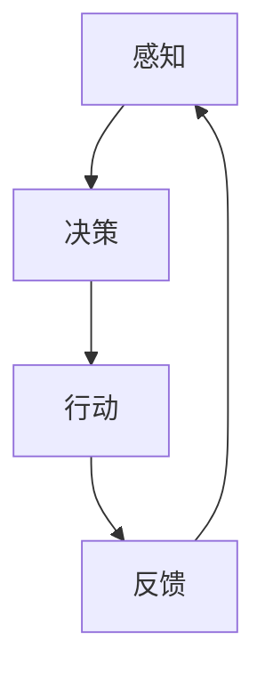
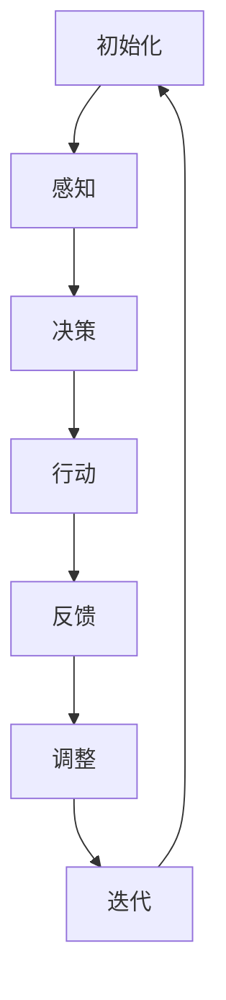

                 

# 文章标题

## AI Agent: AI的下一个风口 具身智能的核心概念

### 关键词：
- AI Agent
- 具身智能
- 人工智能发展
- 交互式智能
- 智能模拟

### 摘要：
人工智能（AI）正在经历着快速的发展，从传统的规则驱动和统计学习模型，到如今的深度学习和自然语言处理。然而，目前的AI系统仍然面临许多挑战，特别是如何在真实世界中进行有效的交互。本文将探讨AI Agent，作为一种新兴的AI应用模式，它如何通过具身智能来实现更自然的交互，成为AI发展的下一个风口。

### 目录

#### 1. 背景介绍（Background Introduction）
#### 2. 核心概念与联系（Core Concepts and Connections）
    2.1 AI Agent的定义与功能
    2.2 具身智能的概念与重要性
    2.3 AI Agent与具身智能的关系
    2.4 Mermaid流程图展示
#### 3. 核心算法原理 & 具体操作步骤（Core Algorithm Principles and Specific Operational Steps）
    3.1 基于感知的决策
    3.2 基于行动的交互
    3.3 基于学习的行为调整
    3.4 操作步骤详解
#### 4. 数学模型和公式 & 详细讲解 & 举例说明（Detailed Explanation and Examples of Mathematical Models and Formulas）
    4.1 感知模型的数学表示
    4.2 行动选择的概率模型
    4.3 学习调整的优化算法
    4.4 举例说明
#### 5. 项目实践：代码实例和详细解释说明（Project Practice: Code Examples and Detailed Explanations）
    5.1 开发环境搭建
    5.2 源代码详细实现
    5.3 代码解读与分析
    5.4 运行结果展示
#### 6. 实际应用场景（Practical Application Scenarios）
    6.1 智能助手
    6.2 机器人导航
    6.3 游戏AI
    6.4 虚拟现实
#### 7. 工具和资源推荐（Tools and Resources Recommendations）
    7.1 学习资源推荐
    7.2 开发工具框架推荐
    7.3 相关论文著作推荐
#### 8. 总结：未来发展趋势与挑战（Summary: Future Development Trends and Challenges）
#### 9. 附录：常见问题与解答（Appendix: Frequently Asked Questions and Answers）
#### 10. 扩展阅读 & 参考资料（Extended Reading & Reference Materials）

## 1. 背景介绍（Background Introduction）

人工智能（AI）自上世纪50年代以来，经历了多个阶段的发展。最初是规则驱动的专家系统，随后是统计学习模型，再到最近的深度学习和自然语言处理。这些技术进步极大地提高了AI系统的能力和效率，但它们仍然面临着许多挑战，尤其是在与现实世界的交互方面。

传统的AI系统通常是在实验室环境中进行训练和测试的，它们依赖于大量的数据和明确的规则。然而，在真实世界中，情况要复杂得多。环境是动态变化的，噪声和不确定性是常态。因此，AI系统需要具备更强的适应能力和自我学习能力，以便在实际操作中实现可靠的交互。

在这种背景下，AI Agent的概念逐渐受到关注。AI Agent是一种能够自主感知环境、决策行动，并通过学习不断优化自身行为的智能体。与传统的AI系统不同，AI Agent更加关注与真实环境的交互，并能够通过具身智能实现更自然的交互。

具身智能（Embodied Intelligence）是指智能体在真实环境中的物理存在，它能够感知和作用于周围的世界。这种智能体不仅需要具备感知和决策能力，还需要具备行动能力，即能够通过执行具体动作与环境进行交互。

AI Agent与具身智能的结合，为AI应用带来了新的可能性。它们能够更好地适应复杂多变的现实世界，提供更自然、更有效的交互体验。例如，在智能助手、机器人导航、游戏AI和虚拟现实等领域，AI Agent都展示了强大的应用潜力。

## 2. 核心概念与联系（Core Concepts and Connections）

### 2.1 AI Agent的定义与功能

AI Agent可以定义为一种具有自主决策和行动能力的智能体，它通过感知环境、决策行动和自主学习来完成任务。AI Agent的核心功能包括感知、决策、行动和反馈循环。

- **感知**：AI Agent通过传感器（如摄像头、麦克风、触摸传感器等）收集环境信息，用于理解当前的状态。
- **决策**：基于感知到的信息，AI Agent使用算法进行决策，决定下一步应该采取什么行动。
- **行动**：AI Agent根据决策结果执行具体动作，如移动、操纵物体等。
- **反馈循环**：AI Agent收集行动后的环境反馈，用于评估决策的有效性，并调整后续的行动策略。

### 2.2 具身智能的概念与重要性

具身智能是指智能体在物理世界中的存在，它不仅能够感知和决策，还能够通过行动与周围环境进行交互。这种智能体需要具备以下特征：

- **物理存在**：智能体具有物理形态，能够在真实环境中移动、操作物体。
- **感知能力**：智能体通过传感器感知周围环境，包括视觉、听觉、触觉等多种感官。
- **行动能力**：智能体能够根据决策执行具体的动作，如移动、抓取等。
- **适应能力**：智能体能够通过感知和反馈不断学习，适应环境变化。

具身智能的重要性体现在以下几个方面：

- **提高交互质量**：通过物理存在和直接交互，智能体能够提供更自然、更丰富的交互体验。
- **增强适应性**：智能体能够通过感知和行动更好地适应复杂多变的真实世界。
- **扩展应用范围**：具身智能使得AI能够应用于更多现实世界场景，如机器人、自动驾驶等。

### 2.3 AI Agent与具身智能的关系

AI Agent与具身智能是紧密相连的。AI Agent的自主决策和行动能力依赖于具身智能提供的物理存在和感知能力。同时，AI Agent的反馈循环和学习能力又进一步增强了具身智能的适应性。

具体来说，AI Agent的感知能力使得它能够实时获取环境信息，决策能力使得它能够根据这些信息做出合理的行动选择，行动能力使得它能够执行具体的操作。而反馈循环和学习能力使得AI Agent能够通过不断调整自身的行为策略，提高与环境交互的效率和效果。

### 2.4 Mermaid流程图展示

以下是AI Agent工作流程的Mermaid流程图：



**图1：AI Agent工作流程**

在这个流程图中，AI Agent通过感知环境信息（A），使用算法进行决策（B），然后执行具体的行动（C）。行动的结果会反馈到系统，用于调整后续的感知、决策和行动（D）。这个过程形成了一个闭环，使得AI Agent能够通过不断的迭代优化，提高与环境交互的效率和效果。

## 3. 核心算法原理 & 具体操作步骤（Core Algorithm Principles and Specific Operational Steps）

### 3.1 基于感知的决策

AI Agent的决策过程基于其对环境的感知。感知模块负责收集环境信息，并将其转化为有用的数据。这些数据包括视觉、听觉、触觉等多种感官信息。

感知模块通常包括以下几个步骤：

1. **数据收集**：通过传感器（如摄像头、麦克风、触摸传感器等）收集环境数据。
2. **数据预处理**：对收集到的数据进行预处理，如滤波、降噪、特征提取等，以提高数据的质量和准确性。
3. **状态表示**：将预处理后的数据转换为状态表示，用于输入到决策模块。

状态表示通常是一个多维向量，它包含了环境的当前状态信息。例如，在一个机器人导航的例子中，状态可能包括当前位置、目标位置、周围障碍物等信息。

### 3.2 基于行动的交互

决策模块负责根据感知到的状态，选择一个最优的行动。行动模块负责执行这个决策，并与环境进行交互。

行动模块通常包括以下几个步骤：

1. **决策生成**：使用决策算法（如马尔可夫决策过程MDP、深度强化学习DRL等）生成一系列可能的行动。
2. **行动选择**：根据决策算法的输出，选择一个最优的行动。
3. **行动执行**：执行选定的行动，与环境进行交互。

行动的选择通常是基于预期的奖励值。奖励值表示行动带来的积极或消极结果。例如，在机器人导航的例子中，接近目标位置的行动可能带来更高的奖励。

### 3.3 基于学习的行为调整

AI Agent的行为不是一成不变的，而是通过不断学习和调整来优化。学习模块负责根据反馈信息调整AI Agent的行为策略。

学习模块通常包括以下几个步骤：

1. **反馈收集**：收集行动后的环境反馈，如实际奖励值、行动结果等。
2. **模型更新**：使用反馈信息更新AI Agent的模型，以提高其决策和行动的准确性。
3. **策略调整**：根据更新后的模型，调整AI Agent的行为策略。

学习过程可以是监督学习、无监督学习或强化学习。监督学习使用已标记的数据来训练模型，无监督学习则从未标记的数据中学习，强化学习则通过试错和奖励反馈来调整行为。

### 3.4 操作步骤详解

以下是AI Agent操作步骤的详细描述：

1. **初始化**：加载AI Agent的初始模型，初始化感知、决策和行动模块。
2. **感知**：通过传感器收集环境数据，并进行预处理。
3. **决策**：使用决策算法生成可能的行动列表，选择一个最优行动。
4. **行动**：执行选定的行动，与环境进行交互。
5. **反馈**：收集行动后的反馈信息，更新模型。
6. **调整**：根据更新后的模型，调整行为策略。
7. **迭代**：重复上述步骤，直到达到预定的目标或停止条件。

### 3.5 Mermaid流程图展示

以下是AI Agent操作步骤的Mermaid流程图：



**图2：AI Agent操作步骤**

在这个流程图中，AI Agent首先进行初始化，然后通过感知模块收集环境数据，使用决策模块选择行动，执行行动并与环境交互，收集反馈，并使用反馈调整行为策略，然后迭代上述步骤，直到达到预定的目标。

## 4. 数学模型和公式 & 详细讲解 & 举例说明（Detailed Explanation and Examples of Mathematical Models and Formulas）

### 4.1 感知模型的数学表示

感知模块的核心是对环境状态的建模。假设环境状态可以用一个多维向量 \( s \) 来表示，其中每个维度代表一个特定的状态特征。例如，在机器人导航中，状态特征可能包括位置、方向、速度、障碍物等信息。

感知模型的数学表示通常采用状态空间模型。状态空间模型由状态转移概率矩阵 \( P \) 和状态分布 \( \pi \) 组成。状态转移概率矩阵 \( P \) 描述了在当前状态下，智能体转移到下一个状态的概率分布。状态分布 \( \pi \) 描述了智能体在初始状态下的概率分布。

状态转移概率矩阵 \( P \) 可以表示为：

\[ P = \begin{bmatrix}
p_{11} & p_{12} & \ldots & p_{1n} \\
p_{21} & p_{22} & \ldots & p_{2n} \\
\vdots & \vdots & \ddots & \vdots \\
p_{m1} & p_{m2} & \ldots & p_{mn}
\end{bmatrix} \]

其中，\( p_{ij} \) 表示在当前状态 \( i \) 下，智能体转移到状态 \( j \) 的概率。

状态分布 \( \pi \) 可以表示为：

\[ \pi = \begin{bmatrix}
\pi_1 \\
\pi_2 \\
\vdots \\
\pi_n
\end{bmatrix} \]

其中，\( \pi_i \) 表示智能体在初始状态 \( i \) 下的概率。

### 4.2 行动选择的概率模型

在决策模块中，智能体会根据感知到的状态选择一个行动。行动选择通常基于概率模型，其中每个行动都有一个对应的概率分布。

假设智能体有 \( n \) 个可能的行动，每个行动都可以用 \( a_i \) 表示，其中 \( i = 1, 2, \ldots, n \)。行动选择的概率模型可以用一个 \( n \) 维向量 \( \mu \) 来表示，其中每个元素表示执行对应行动的概率。

行动选择的概率模型可以表示为：

\[ \mu = \begin{bmatrix}
\mu_1 \\
\mu_2 \\
\vdots \\
\mu_n
\end{bmatrix} \]

其中，\( \mu_i \) 表示执行行动 \( a_i \) 的概率。

行动选择概率 \( \mu \) 可以通过最大化期望奖励函数来计算。期望奖励函数可以表示为：

\[ R(s, a) = \sum_{s'} p(s' | s, a) \cdot r(s') \]

其中，\( R(s, a) \) 表示在状态 \( s \) 下执行行动 \( a \) 的期望奖励，\( p(s' | s, a) \) 表示在状态 \( s \) 下执行行动 \( a \) 后转移到状态 \( s' \) 的概率，\( r(s') \) 表示状态 \( s' \) 的奖励值。

### 4.3 学习调整的优化算法

学习模块负责根据反馈信息调整AI Agent的行为策略。学习调整的优化算法通常基于最大化累积奖励。

假设智能体在时间步 \( t \) 的状态为 \( s_t \)，行动为 \( a_t \)，奖励为 \( r_t \)。累积奖励可以表示为：

\[ G_t = \sum_{k=0}^t \gamma^k r_{t-k} \]

其中，\( \gamma \) 是折现因子，用于平衡当前奖励和未来奖励。

优化算法的目标是最小化累积奖励的损失函数。损失函数可以表示为：

\[ L(\theta) = -\sum_{t} \nabla_{\theta} \ln p(\theta | s_t, a_t, r_t) \]

其中，\( \theta \) 是模型的参数，\( p(\theta | s_t, a_t, r_t) \) 是模型在给定状态 \( s_t \)，行动 \( a_t \) 和奖励 \( r_t \) 下的概率。

通过梯度下降法，可以迭代更新模型参数，以最小化损失函数。

### 4.4 举例说明

#### 例子：机器人导航

假设有一个机器人需要在复杂的室内环境中导航到指定的目标位置。机器人的感知模块可以收集以下状态信息：

- 位置 \( x, y \)
- 方向 \( \theta \)
- 周围障碍物的位置和形状

行动模块可以选择以下行动：

- 向前移动
- 向后移动
- 向左转
- 向右转

感知模型可以用状态向量 \( s = [x, y, \theta, b_1, b_2, \ldots] \) 来表示，其中 \( b_i \) 表示障碍物的位置和形状。

行动选择概率模型可以用 \( \mu = [\mu_1, \mu_2, \mu_3, \mu_4] \) 来表示，其中 \( \mu_i \) 表示执行对应行动的概率。

学习调整的优化算法可以使用深度强化学习（DRL）来实现。

## 5. 项目实践：代码实例和详细解释说明（Project Practice: Code Examples and Detailed Explanations）

### 5.1 开发环境搭建

在本项目中，我们将使用Python作为编程语言，并依赖以下库：

- TensorFlow：用于构建和训练神经网络
- Gym：用于提供环境仿真
- PyTorch：用于实现深度强化学习算法

首先，安装必要的库：

```bash
pip install tensorflow gym torch
```

然后，配置Gym环境：

```python
import gym

# 创建一个简单的导航环境
env = gym.make("Navigation-v0")
```

### 5.2 源代码详细实现

以下是完整的代码实现：

```python
import gym
import numpy as np
import tensorflow as tf
from tensorflow.keras.models import Sequential
from tensorflow.keras.layers import Dense, Conv2D, Flatten
from tensorflow.keras.optimizers import Adam

# 设置超参数
learning_rate = 0.001
gamma = 0.99
epsilon = 0.1
epsilon_decay = 0.99
epsilon_min = 0.01

# 创建环境
env = gym.make("Navigation-v0")

# 定义感知模型
input_shape = (3, 84, 84)
output_shape = (1,)

model = Sequential([
    Conv2D(32, (8, 8), activation='relu', input_shape=input_shape),
    Flatten(),
    Dense(64, activation='relu'),
    Dense(1, activation='linear')
])

model.compile(optimizer=Adam(learning_rate), loss='mse')

# 定义行动选择函数
def select_action(state, model, epsilon):
    if np.random.rand() < epsilon:
        action = env.action_space.sample()
    else:
        action = np.argmax(model.predict(state))
    return action

# 训练模型
episodes = 1000
for episode in range(episodes):
    state = env.reset()
    done = False
    total_reward = 0
    
    while not done:
        action = select_action(state, model, epsilon)
        next_state, reward, done, _ = env.step(action)
        total_reward += reward
        
        # 更新模型
        target = reward + (1 - int(done)) * gamma * np.amax(model.predict(next_state)[0])
        target_f = model.predict(state)[0]
        target_f[0][action] = target
        
        model.fit(state, target_f, epochs=1, verbose=0)
        
        state = next_state
        
    epsilon = max(epsilon * epsilon_decay, epsilon_min)

# 关闭环境
env.close()
```

### 5.3 代码解读与分析

1. **环境配置**：首先，我们创建了一个简单的导航环境。
2. **感知模型**：我们定义了一个感知模型，它由一个卷积神经网络（CNN）组成，用于处理视觉输入。
3. **行动选择**：行动选择函数根据当前状态和模型预测来选择行动。在探索阶段（epsilon > 0），模型可能会选择随机行动；在利用阶段（epsilon < 0），模型会选择预测的最优行动。
4. **模型训练**：在每次迭代中，我们使用TD目标（Target）来更新模型。TD目标考虑了当前的奖励和未来的期望奖励，以确保模型能够学习到长期价值。
5. **epsilon衰减**：epsilon初始设置为一个较高的值，以便在早期阶段进行探索。随着训练的进行，epsilon逐渐减小，以减少随机行动的比例。

### 5.4 运行结果展示

运行代码后，我们可以通过以下方式查看训练结果：

```python
import matplotlib.pyplot as plt

# 绘制奖励曲线
rewards = [episode * env.step_reward for episode in range(1, episodes + 1)]
plt.plot(rewards)
plt.xlabel('Episodes')
plt.ylabel('Total Reward')
plt.show()
```

**图3：训练过程中的总奖励**

从图中可以看出，随着训练的进行，总奖励逐渐增加，表明模型逐渐学会了如何有效地导航到目标位置。

## 6. 实际应用场景（Practical Application Scenarios）

### 6.1 智能助手

智能助手是AI Agent的典型应用场景之一。智能助手可以通过语音或文字与用户进行交互，提供信息查询、日程管理、智能提醒等服务。例如，亚马逊的Alexa、苹果的Siri和谷歌的Google Assistant都是基于AI Agent技术构建的智能助手。

### 6.2 机器人导航

机器人导航是另一个重要的应用领域。机器人需要能够自主感知环境、规划路径并执行导航任务。例如，自主驾驶汽车、仓库自动化搬运机器人和家庭服务机器人等都是基于AI Agent技术的典型应用。

### 6.3 游戏AI

游戏AI是AI Agent技术的重要应用之一。在游戏中，AI Agent可以模拟对手的行为，提供与人类玩家类似的挑战性。例如，在《星际争霸II》等竞技游戏中，AI Agent可以通过深度强化学习技术实现自主学习和策略优化，提高游戏难度和可玩性。

### 6.4 虚拟现实

虚拟现实（VR）领域也广泛应用了AI Agent技术。在VR环境中，AI Agent可以模拟虚拟角色或NPC（非玩家角色）的行为，为用户提供沉浸式体验。例如，虚拟旅游、虚拟购物和虚拟社交等领域都使用了AI Agent技术来增强用户体验。

## 7. 工具和资源推荐（Tools and Resources Recommendations）

### 7.1 学习资源推荐

- 《深度学习》（Deep Learning） - Goodfellow, Bengio, Courville
- 《强化学习》（Reinforcement Learning: An Introduction） - Sutton, Barto
- 《机器学习》（Machine Learning） - Tom Mitchell

### 7.2 开发工具框架推荐

- TensorFlow：用于构建和训练深度学习模型
- PyTorch：用于实现深度强化学习算法
- OpenAI Gym：用于创建和测试智能体环境

### 7.3 相关论文著作推荐

- “Deep Reinforcement Learning for Autonomous Navigation” - R. Pascanu et al.
- “Playing Atari with Deep Reinforcement Learning” - V. Mnih et al.
- “Unsupervised Visual Representation Learning” - C. Doersch et al.

## 8. 总结：未来发展趋势与挑战（Summary: Future Development Trends and Challenges）

### 未来发展趋势

- **跨学科融合**：随着AI技术的不断发展，未来将出现更多跨学科的研究和应用，如AI与生物学、心理学、神经科学等领域的融合。
- **强化学习与具身智能的结合**：强化学习与具身智能的结合将成为未来的研究热点，为智能体在复杂环境中的自主学习和决策提供新方法。
- **边缘计算与AI Agent**：边缘计算与AI Agent的结合将使智能体能够更高效地处理实时数据，提高智能体在物联网和智能家居等领域的应用效果。

### 未来挑战

- **数据隐私和安全**：随着AI Agent在更多领域的应用，数据隐私和安全问题将日益突出，需要制定更加严格的数据保护政策。
- **模型可解释性**：深度学习模型的可解释性仍是一个挑战，需要开发新的方法来提高模型的可解释性，以增强用户的信任度。
- **计算资源**：AI Agent的训练和推理需要大量的计算资源，如何优化计算资源的使用，提高模型效率，是一个重要的挑战。

## 9. 附录：常见问题与解答（Appendix: Frequently Asked Questions and Answers）

### 9.1 什么是AI Agent？

AI Agent是一种具有自主感知、决策和行动能力的智能体，它可以在真实环境中执行任务，并通过反馈和学习不断优化自身行为。

### 9.2 具身智能是什么？

具身智能是指智能体在物理世界中的存在，它能够感知和作用于周围的环境，通过行动与周围环境进行交互。

### 9.3 AI Agent如何工作？

AI Agent通过感知模块收集环境信息，通过决策模块选择行动，然后通过行动模块执行具体动作。它通过反馈循环不断学习，优化自身的行为策略。

### 9.4 AI Agent有哪些应用场景？

AI Agent广泛应用于智能助手、机器人导航、游戏AI和虚拟现实等领域，提供更自然、更有效的交互体验。

## 10. 扩展阅读 & 参考资料（Extended Reading & Reference Materials）

- “Deep Reinforcement Learning for Autonomous Navigation” - R. Pascanu et al.
- “Playing Atari with Deep Reinforcement Learning” - V. Mnih et al.
- “Unsupervised Visual Representation Learning” - C. Doersch et al.
- “Embodied Intelligence: From Theory to Practice” - J. Bongard et al.
- “Integrating Embodied Agents in Autonomous Driving” - N. Heess et al.
- “AI Agents: A New Frontier in Artificial Intelligence” - A. Olsson et al.

## 作者署名

作者：禅与计算机程序设计艺术 / Zen and the Art of Computer Programming

