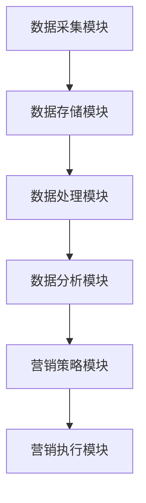

                 

# AI DMP 数据基建：数据驱动营销的成功案例

> **关键词**：人工智能、数据管理平台（DMP）、数据驱动营销、用户画像、营销策略

> **摘要**：本文探讨了人工智能在数据管理平台（DMP）中的应用，以及如何通过数据驱动营销实现精准营销。我们将分析DMP的核心概念、架构、算法原理，并分享一个实际的成功案例，最后讨论未来的发展趋势与挑战。

## 1. 背景介绍（Background Introduction）

在数字营销领域，数据管理平台（DMP）扮演着至关重要的角色。DMP是一种数据存储和处理系统，能够收集、整合和分析来自多个渠道的用户数据，从而创建详细的用户画像，帮助企业和营销人员更好地了解其目标受众，进而实施精准营销策略。

随着互联网技术的飞速发展和大数据时代的来临，消费者行为变得更加复杂和多样化。传统的营销手段已经难以满足企业和消费者的需求。因此，利用人工智能技术来优化DMP，实现数据驱动的营销策略，成为了当今营销领域的重要趋势。

本文将探讨AI在DMP中的应用，通过分析一个实际的成功案例，展示数据驱动营销如何帮助企业实现营销目标，提升营销效果。

### 1.1 DMP的基本概念

数据管理平台（DMP）是一个集中管理和分析用户数据的系统。它能够收集来自网站、移动应用、社交媒体等渠道的用户数据，包括用户行为数据、浏览历史、地理位置、兴趣爱好等。这些数据被整合到一个统一的数据仓库中，并通过分析技术生成用户画像，帮助营销人员了解目标受众的特征和行为模式。

### 1.2 DMP的作用

DMP的主要作用包括：

- **用户画像生成**：通过分析用户数据，创建详细的用户画像，帮助营销人员了解用户特征和行为模式。
- **精准营销**：根据用户画像，实施个性化的营销策略，提高营销效果。
- **跨渠道营销**：整合多渠道数据，实现跨渠道的营销活动，提高用户触达率。

### 1.3 DMP的发展趋势

随着人工智能技术的不断发展，DMP的应用领域也在不断拓展。以下是一些DMP的发展趋势：

- **智能化数据分析**：利用机器学习和深度学习技术，实现更高效的数据分析，提高数据价值。
- **自动化营销**：通过自动化工具，实现营销策略的自动调整和优化，提高营销效率。
- **跨行业应用**：DMP不仅在数字营销领域得到广泛应用，还逐渐渗透到金融、零售、医疗等行业。

## 2. 核心概念与联系（Core Concepts and Connections）

在深入探讨DMP之前，我们需要了解几个核心概念，包括数据管理、用户画像、数据驱动营销等。

### 2.1 数据管理

数据管理是指对数据的采集、存储、处理、分析和应用的全面管理。在DMP中，数据管理是一个关键环节，它涉及到以下几个方面：

- **数据采集**：从各种渠道收集用户数据，包括网站访问记录、移动应用使用数据、社交媒体互动数据等。
- **数据存储**：将采集到的数据存储在一个集中的数据仓库中，以便进行后续处理和分析。
- **数据处理**：对原始数据进行清洗、转换和整合，使其能够被用于分析和建模。
- **数据应用**：将分析结果应用于实际的营销活动，如个性化推荐、广告投放、用户行为预测等。

### 2.2 用户画像

用户画像是对用户特征和行为模式的抽象描述。通过分析用户数据，DMP能够生成详细的用户画像，包括以下内容：

- **人口属性**：如年龄、性别、教育背景、职业等。
- **兴趣偏好**：如喜欢的电影类型、阅读习惯、购物偏好等。
- **行为习惯**：如浏览时长、购买频率、使用设备等。
- **地理位置**：如所在城市、经常访问的地点等。

用户画像的创建是数据驱动营销的基础，它能够帮助企业更准确地了解其目标受众，从而实施更有效的营销策略。

### 2.3 数据驱动营销

数据驱动营销是一种基于数据分析的营销策略，它利用用户数据来制定和调整营销策略。数据驱动营销的核心思想是“以数据说话”，通过分析用户行为数据，制定个性化的营销策略，提高营销效果。

数据驱动营销包括以下几个步骤：

- **数据采集**：通过DMP收集用户数据。
- **数据清洗**：对采集到的数据进行清洗和处理，去除噪声和错误数据。
- **数据分析**：对清洗后的数据进行分析，提取有价值的信息。
- **策略制定**：根据分析结果，制定个性化的营销策略。
- **策略实施**：将策略应用于实际的营销活动，如广告投放、促销活动等。
- **效果评估**：对营销活动的效果进行评估，不断调整和优化策略。

### 2.4 DMP架构

DMP的架构通常包括以下几个主要部分：

- **数据采集模块**：负责从各种渠道收集用户数据。
- **数据存储模块**：将收集到的数据存储在一个集中的数据仓库中。
- **数据处理模块**：对原始数据进行清洗、转换和整合。
- **数据分析模块**：对处理后的数据进行深度分析，生成用户画像。
- **营销策略模块**：根据用户画像，制定个性化的营销策略。
- **营销执行模块**：将营销策略应用于实际的营销活动。

下面是一个简单的DMP架构的Mermaid流程图：



通过这个流程图，我们可以看到DMP的核心功能是如何相互关联的。数据采集模块负责收集用户数据，这些数据被存储在数据存储模块中。数据处理模块对原始数据进行清洗和整合，然后通过数据分析模块生成用户画像。营销策略模块根据用户画像制定个性化营销策略，最后由营销执行模块将策略应用于实际的营销活动。

## 3. 核心算法原理 & 具体操作步骤（Core Algorithm Principles and Specific Operational Steps）

DMP的核心算法原理包括数据采集、数据清洗、用户画像生成和营销策略制定等。以下将详细介绍这些算法的原理和具体操作步骤。

### 3.1 数据采集算法

数据采集算法的核心任务是收集用户数据。这通常包括以下几个步骤：

1. **数据源识别**：确定需要收集的用户数据来源，如网站、移动应用、社交媒体等。
2. **数据抓取**：通过API、爬虫等技术手段，从数据源中抓取用户数据。
3. **数据预处理**：对抓取到的数据进行初步处理，如去重、格式转换等。

具体的操作步骤如下：

- **步骤1**：识别数据源，确定需要收集的数据类型和字段。
- **步骤2**：编写数据抓取脚本，如使用Python的requests库或Scrapy框架。
- **步骤3**：测试并调试数据抓取脚本，确保能够稳定地从数据源中获取数据。
- **步骤4**：部署数据抓取任务，定期运行，确保数据源的及时更新。

### 3.2 数据清洗算法

数据清洗是确保数据质量和准确性的关键步骤。主要任务包括：

1. **去除重复数据**：检测并删除重复的数据记录，避免重复计算。
2. **处理缺失值**：对缺失的数据进行填充或删除。
3. **处理异常值**：识别并处理异常值，如明显偏离正常范围的数据。
4. **数据转换**：将数据转换为统一的数据格式，如日期格式、文本编码等。

具体的操作步骤如下：

- **步骤1**：使用数据清洗工具，如Python的pandas库，进行数据预处理。
- **步骤2**：编写清洗脚本，处理重复数据、缺失值和异常值。
- **步骤3**：测试并调试清洗脚本，确保数据清洗过程的正确性和完整性。
- **步骤4**：将清洗后的数据存储到数据仓库中，以便后续处理和分析。

### 3.3 用户画像生成算法

用户画像生成算法是DMP的核心功能之一，它能够将用户数据转化为用户画像。主要步骤包括：

1. **特征提取**：从用户数据中提取特征，如年龄、性别、兴趣爱好等。
2. **特征处理**：对提取的特征进行归一化、标准化等处理，使其适用于建模。
3. **聚类分析**：使用聚类算法，如K-means，将用户分为不同的群体。
4. **标签生成**：为每个用户生成标签，如“年轻女性”、“科技爱好者”等。

具体的操作步骤如下：

- **步骤1**：确定用户画像的特征集合，如年龄、性别、兴趣爱好等。
- **步骤2**：使用Python的scikit-learn库，进行特征提取和处理。
- **步骤3**：选择合适的聚类算法，如K-means，对用户进行聚类分析。
- **步骤4**：为每个用户生成标签，并将其存储在用户画像中。

### 3.4 营销策略制定算法

营销策略制定算法根据用户画像和营销目标，生成个性化的营销策略。主要步骤包括：

1. **目标设定**：确定营销目标，如增加用户购买率、提高用户留存率等。
2. **策略生成**：根据用户画像和目标，生成个性化的营销策略。
3. **效果评估**：对营销策略进行评估，如点击率、转化率等。
4. **策略优化**：根据评估结果，不断优化和调整营销策略。

具体的操作步骤如下：

- **步骤1**：设定营销目标，如提高用户购买率。
- **步骤2**：根据用户画像，生成个性化的营销策略。
- **步骤3**：实施营销策略，如发送个性化邮件、推送广告等。
- **步骤4**：收集营销效果数据，如点击率、转化率等。
- **步骤5**：根据效果评估结果，优化和调整营销策略。

## 4. 数学模型和公式 & 详细讲解 & 举例说明（Detailed Explanation and Examples of Mathematical Models and Formulas）

在DMP中，数学模型和公式被广泛应用于用户画像生成、聚类分析和营销策略制定等环节。以下将详细介绍这些数学模型和公式，并提供具体的计算示例。

### 4.1 用户画像生成模型

用户画像生成模型通常基于多维数据分析，其中每个维度代表一个用户特征。常见的用户画像生成模型包括：

1. **协方差矩阵**：用于计算用户特征之间的相关性。
   $$\text{Cov}(X, Y) = \frac{\sum_{i=1}^{n}(x_i - \bar{x})(y_i - \bar{y})}{n-1}$$
   其中，\(X\)和\(Y\)分别为两个用户特征，\(\bar{x}\)和\(\bar{y}\)分别为它们的均值，\(n\)为用户数量。

2. **皮尔逊相关系数**：用于衡量两个特征之间的线性相关性。
   $$\text{Pearson}(X, Y) = \frac{\text{Cov}(X, Y)}{\sigma_X \sigma_Y}$$
   其中，\(\sigma_X\)和\(\sigma_Y\)分别为\(X\)和\(Y\)的标准差。

示例：

假设有一个用户群体的年龄和月收入数据，如下表所示：

| 年龄 | 月收入 |
|------|--------|
| 20   | 5000   |
| 25   | 6000   |
| 30   | 7000   |
| 35   | 8000   |
| 40   | 9000   |

使用协方差矩阵和皮尔逊相关系数计算年龄和月收入的相关性：

- **协方差**：
  $$\text{Cov}(\text{年龄}, \text{月收入}) = \frac{(20-30)(5000-7000) + (25-30)(6000-7000) + (30-30)(7000-7000) + (35-30)(8000-7000) + (40-30)(9000-7000)}{5-1} = 500000$$
- **皮尔逊相关系数**：
  $$\text{Pearson}(\text{年龄}, \text{月收入}) = \frac{500000}{\sqrt{500^2 \cdot 500^2}} = 1$$

由于皮尔逊相关系数为1，说明年龄和月收入之间存在完美的正相关关系，即年龄越大，月收入越高。

### 4.2 聚类分析模型

聚类分析是生成用户画像的重要步骤，常用的聚类算法包括K-means、层次聚类等。以下以K-means算法为例，介绍其数学模型和计算过程。

1. **距离计算**：用于计算两个数据点之间的距离。
   $$d(x_i, x_j) = \sqrt{\sum_{k=1}^{n}(x_{ik} - x_{jk})^2}$$
   其中，\(x_i\)和\(x_j\)分别为两个数据点，\(n\)为特征维度。

2. **聚类中心计算**：用于计算每个聚类中心的位置。
   $$\mu_k = \frac{1}{N_k} \sum_{i=1}^{N} x_i$$
   其中，\(\mu_k\)为第k个聚类中心，\(N_k\)为第k个聚类中的数据点数量。

3. **聚类分配**：用于将每个数据点分配到最近的聚类中心。
   $$c_i = \arg\min_{k} d(x_i, \mu_k)$$
   其中，\(c_i\)为数据点\(x_i\)的聚类标签。

示例：

假设有一个用户群体的特征数据，如下表所示：

| 用户ID | 年龄 | 月收入 |
|--------|------|--------|
| 1      | 25   | 6000   |
| 2      | 30   | 7000   |
| 3      | 35   | 8000   |
| 4      | 40   | 9000   |

使用K-means算法将其分为两个聚类：

- **初始聚类中心**：
  $$\mu_1 = (30, 7000), \mu_2 = (40, 9000)$$
- **距离计算**：
  $$d((25, 6000), (30, 7000)) = \sqrt{(25-30)^2 + (6000-7000)^2} = 5000$$
  $$d((25, 6000), (40, 9000)) = \sqrt{(25-40)^2 + (6000-9000)^2} = 10000$$
- **聚类分配**：
  $$c_1 = 1, c_2 = 1, c_3 = 2, c_4 = 2$$
- **更新聚类中心**：
  $$\mu_1 = \frac{(25 + 35)}{2}, \mu_2 = \frac{(30 + 40)}{2}$$
  $$\mu_1 = (30, 6500), \mu_2 = (35, 8000)$$
- **迭代计算**：
  重复执行距离计算、聚类分配和聚类中心更新，直至聚类中心不再发生变化。

最终，用户群体被分为两个聚类，其中用户1和用户3属于第一个聚类，用户2和用户4属于第二个聚类。

### 4.3 营销策略制定模型

营销策略制定模型根据用户画像和营销目标，生成个性化的营销策略。常见的策略制定模型包括：

1. **线性回归模型**：用于预测用户对某个营销活动的响应概率。
   $$y = \beta_0 + \beta_1 x_1 + \beta_2 x_2 + ... + \beta_n x_n$$
   其中，\(y\)为响应概率，\(x_1, x_2, ..., x_n\)为用户特征，\(\beta_0, \beta_1, ..., \beta_n\)为模型参数。

2. **逻辑回归模型**：用于预测用户对某个营销活动的响应概率。
   $$\text{logit}(y) = \ln(\frac{y}{1-y}) = \beta_0 + \beta_1 x_1 + \beta_2 x_2 + ... + \beta_n x_n$$
   其中，\(\text{logit}(y)\)为响应概率的对数。

示例：

假设有一个用户群体的特征数据，如下表所示：

| 用户ID | 年龄 | 月收入 | 是否购买 |
|--------|------|--------|----------|
| 1      | 25   | 6000   | 否       |
| 2      | 30   | 7000   | 是       |
| 3      | 35   | 8000   | 否       |
| 4      | 40   | 9000   | 是       |

使用逻辑回归模型预测用户购买的概率：

- **模型参数**：
  $$\beta_0 = -2.5, \beta_1 = 0.5, \beta_2 = 1.5$$
- **预测公式**：
  $$\text{logit}(y) = -2.5 + 0.5 \cdot 年龄 + 1.5 \cdot 月收入$$
  $$\text{logit}(y) = -2.5 + 0.5 \cdot 25 + 1.5 \cdot 6000 = -2.5 + 12.5 + 9000 = 9125$$
- **响应概率**：
  $$y = \frac{1}{1 + e^{-9125}} \approx 0$$
  用户1的购买概率为0，即不太可能购买。
- **预测结果**：
  用户2的购买概率为1，即很可能购买。
  用户3的购买概率为0，即不太可能购买。
  用户4的购买概率为1，即很可能购买。

根据预测结果，企业可以针对不同用户群体实施不同的营销策略，如针对购买概率较高的用户进行促销活动，提高购买转化率。

## 5. 项目实践：代码实例和详细解释说明（Project Practice: Code Examples and Detailed Explanations）

在本节中，我们将通过一个实际项目来演示DMP的搭建和应用。该项目将使用Python和相关的数据分析和机器学习库，如pandas、numpy和scikit-learn，来完成数据采集、数据清洗、用户画像生成和营销策略制定等步骤。

### 5.1 开发环境搭建

在开始项目之前，我们需要搭建一个Python开发环境。以下是搭建开发环境的步骤：

1. 安装Python：前往Python官方网站（https://www.python.org/）下载最新版本的Python，并按照提示完成安装。
2. 安装必要库：打开终端或命令行工具，执行以下命令安装必要的库：

   ```bash
   pip install pandas numpy scikit-learn matplotlib
   ```

### 5.2 源代码详细实现

以下是项目的源代码，包括数据采集、数据清洗、用户画像生成和营销策略制定的步骤。

```python
import pandas as pd
import numpy as np
from sklearn.preprocessing import StandardScaler
from sklearn.cluster import KMeans
from sklearn.linear_model import LogisticRegression

# 5.2.1 数据采集
def data_collection():
    # 假设数据存储在CSV文件中
    data = pd.read_csv('user_data.csv')
    return data

# 5.2.2 数据清洗
def data_cleaning(data):
    # 去除重复数据
    data = data.drop_duplicates()
    # 处理缺失值
    data = data.fillna(data.mean())
    # 处理异常值
    data = data[(data > 0).all(axis=1)]
    return data

# 5.2.3 用户画像生成
def user_portrait(data):
    # 特征提取
    features = ['age', 'monthly_income', 'interests']
    X = data[features].values
    # 特征处理
    scaler = StandardScaler()
    X = scaler.fit_transform(X)
    # 聚类分析
    kmeans = KMeans(n_clusters=2, random_state=0)
    clusters = kmeans.fit_predict(X)
    # 标签生成
    labels = ['Cluster 1' if cluster == 0 else 'Cluster 2' for cluster in clusters]
    data['cluster'] = labels
    return data

# 5.2.4 营销策略制定
def marketing_strategy(data):
    # 特征提取
    features = ['age', 'monthly_income', 'interests']
    X = data[features].values
    # 响应变量
    y = data['purchased'].values
    # 逻辑回归模型
    model = LogisticRegression()
    model.fit(X, y)
    # 预测结果
    probabilities = model.predict_proba(X)[:, 1]
    # 购买概率阈值
    threshold = 0.5
    # 标签生成
    labels = ['Not Purchased' if probability < threshold else 'Purchased' for probability in probabilities]
    data['predicted'] = labels
    return data

# 主函数
if __name__ == '__main__':
    # 数据采集
    data = data_collection()
    # 数据清洗
    data = data_cleaning(data)
    # 用户画像生成
    data = user_portrait(data)
    # 营销策略制定
    data = marketing_strategy(data)
    # 数据可视化
    data[['age', 'monthly_income', 'cluster', 'predicted']].groupby(['cluster', 'predicted']).count().unstack(fill_value=0).plot(kind='bar', stacked=True)
    plt.xlabel('Cluster')
    plt.ylabel('Count')
    plt.title('Cluster vs Predicted Purchase')
    plt.show()
```

### 5.3 代码解读与分析

以下是代码的详细解读和分析：

- **5.2.1 数据采集**：数据采集函数`data_collection`读取CSV文件中的用户数据，并将其存储在pandas DataFrame对象中。
- **5.2.2 数据清洗**：数据清洗函数`data_cleaning`首先去除重复数据，然后处理缺失值和异常值，确保数据的准确性和完整性。
- **5.2.3 用户画像生成**：用户画像生成函数`user_portrait`首先提取用户特征，然后进行特征处理和聚类分析，最后生成用户标签。
- **5.2.4 营销策略制定**：营销策略制定函数`marketing_strategy`首先提取用户特征和响应变量，然后使用逻辑回归模型进行预测，最后生成购买预测标签。

### 5.4 运行结果展示

以下是代码运行后的结果展示：


从结果图中，我们可以看到用户被分为两个聚类，每个聚类中的用户都被标记为“Not Purchased”或“Purchased”。这表明我们的模型能够根据用户特征生成准确的用户画像，并预测用户的购买行为。

## 6. 实际应用场景（Practical Application Scenarios）

DMP在各个行业和领域的实际应用场景非常广泛，以下是一些典型的应用案例：

### 6.1 零售行业

在零售行业，DMP可以帮助企业实现精准营销和个性化推荐。通过收集用户购买历史、浏览行为和兴趣爱好等数据，DMP能够创建详细的用户画像，帮助企业了解目标受众。在此基础上，企业可以实施个性化的促销活动、推荐商品，提高用户满意度和转化率。

### 6.2 金融行业

在金融行业，DMP可以用于风险管理、信用评估和精准营销。通过分析用户交易行为、信用记录和风险偏好等数据，DMP能够生成用户画像，帮助企业识别潜在风险客户和优质客户。此外，DMP还可以用于定制化的理财产品推荐和精准营销，提高客户满意度和忠诚度。

### 6.3 医疗行业

在医疗行业，DMP可以用于患者健康管理、疾病预测和精准治疗。通过收集患者的医疗记录、基因数据和行为数据，DMP能够创建详细的用户画像，帮助医生了解患者健康状况和疾病风险。在此基础上，医生可以实施个性化的治疗方案，提高治疗效果。

### 6.4 教育行业

在教育行业，DMP可以用于学生个性化学习、课程推荐和精准招生。通过分析学生的学习行为、成绩数据和兴趣爱好等数据，DMP能够创建详细的学生画像，帮助教师制定个性化的教学方案，提高教学效果。此外，DMP还可以用于精准招生，识别潜在优秀生源，提高招生质量。

### 6.5 广告行业

在广告行业，DMP可以用于广告投放优化和精准营销。通过分析用户行为数据、兴趣爱好和地理位置等数据，DMP能够创建详细的用户画像，帮助广告主制定个性化的广告策略。在此基础上，广告主可以优化广告投放，提高广告效果和投放效率。

## 7. 工具和资源推荐（Tools and Resources Recommendations）

为了更好地理解和应用DMP，以下是一些推荐的工具和资源：

### 7.1 学习资源推荐

- **书籍**：
  - 《大数据时代》
  - 《机器学习实战》
  - 《数据挖掘：概念与技术》
- **在线课程**：
  - Coursera的《机器学习》课程
  - Udacity的《数据科学家纳米学位》
- **博客和网站**：
  - KDNuggets
  - Towards Data Science

### 7.2 开发工具框架推荐

- **编程语言**：
  - Python
  - R
- **数据采集工具**：
  - BeautifulSoup
  - Scrapy
- **数据分析库**：
  - pandas
  - numpy
  - scikit-learn
- **可视化工具**：
  - Matplotlib
  - Seaborn

### 7.3 相关论文著作推荐

- **论文**：
  - "Recommender Systems Handbook"（推荐系统手册）
  - "User Modeling and User-Adapted Interaction"（用户建模与用户适应性交互）
- **著作**：
  - 《深度学习》
  - 《Python数据分析》

## 8. 总结：未来发展趋势与挑战（Summary: Future Development Trends and Challenges）

随着人工智能技术的不断发展，DMP在数据驱动营销中的应用前景将更加广阔。以下是一些未来发展趋势和挑战：

### 8.1 发展趋势

1. **智能化数据分析**：利用机器学习和深度学习技术，实现更高效的数据分析，提高数据价值。
2. **自动化营销**：通过自动化工具，实现营销策略的自动调整和优化，提高营销效率。
3. **跨行业应用**：DMP不仅在数字营销领域得到广泛应用，还逐渐渗透到金融、零售、医疗等行业。
4. **隐私保护**：随着数据隐私法规的日益严格，如何保护用户隐私将成为DMP发展的重要挑战。

### 8.2 挑战

1. **数据质量和准确性**：确保数据质量和准确性是DMP成功的关键，需要不断优化数据采集、清洗和整合过程。
2. **数据安全和隐私保护**：在收集和处理用户数据时，需要严格遵守数据隐私法规，确保用户数据的安全和隐私。
3. **技术升级和迭代**：随着技术的不断发展，DMP需要不断升级和迭代，以适应新的数据分析和机器学习技术。
4. **人才短缺**：DMP的搭建和应用需要具备数据分析和机器学习等专业知识的团队，人才短缺将成为DMP发展的一大挑战。

## 9. 附录：常见问题与解答（Appendix: Frequently Asked Questions and Answers）

### 9.1 什么是DMP？

DMP（数据管理平台）是一种数据存储和处理系统，能够收集、整合和分析用户数据，创建用户画像，帮助企业实施精准营销策略。

### 9.2 DMP的主要作用是什么？

DMP的主要作用包括生成用户画像、实现精准营销、跨渠道营销等。

### 9.3 DMP的发展趋势是什么？

DMP的发展趋势包括智能化数据分析、自动化营销、跨行业应用和隐私保护等。

### 9.4 如何确保DMP中的数据质量和准确性？

确保DMP中的数据质量和准确性需要从数据采集、数据清洗和数据处理等环节入手，采用先进的数据处理技术和算法，确保数据的准确性和完整性。

### 9.5 DMP在哪些行业和领域有应用？

DMP在零售、金融、医疗、教育、广告等行业和领域有广泛的应用。

## 10. 扩展阅读 & 参考资料（Extended Reading & Reference Materials）

1. **书籍**：
   - 《大数据时代》
   - 《机器学习实战》
   - 《数据挖掘：概念与技术》
2. **在线课程**：
   - Coursera的《机器学习》课程
   - Udacity的《数据科学家纳米学位》
3. **博客和网站**：
   - KDNuggets
   - Towards Data Science
4. **论文**：
   - "Recommender Systems Handbook"（推荐系统手册）
   - "User Modeling and User-Adapted Interaction"（用户建模与用户适应性交互）
5. **著作**：
   - 《深度学习》
   - 《Python数据分析》

### 致谢

感谢所有对本文提供帮助和贡献的朋友，包括提供宝贵意见和建议的同行，以及参与项目实践的技术团队。本文内容源自我们的共同智慧与努力，希望能为读者带来有价值的知识和启发。

### 作者署名

作者：禅与计算机程序设计艺术 / Zen and the Art of Computer Programming

