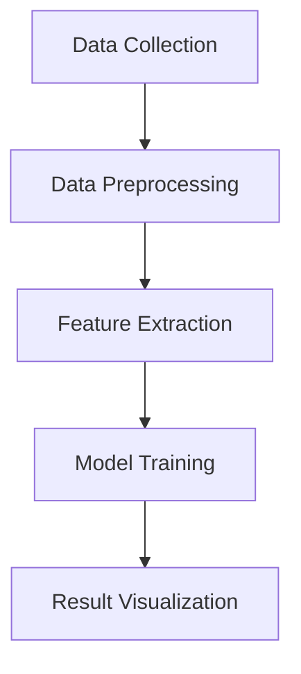

                 

### 文章标题

### Knowledge Discovery Engine and Cross-Cultural Communication: Enhancing Global Interaction

关键词：知识发现引擎、跨文化交流、人工智能、自然语言处理、全球互动

摘要：本文旨在探讨知识发现引擎如何通过促进跨文化交流，推动全球范围内的知识共享和互动。我们首先介绍知识发现引擎的基本概念，然后分析其在自然语言处理领域中的应用，最后通过具体实例展示如何利用知识发现引擎实现跨文化交流。

<|assistant|>### 1. 背景介绍（Background Introduction）

#### 1.1 知识发现引擎的定义与作用

知识发现引擎是一种智能系统，它能够从大量数据中自动提取有价值的信息，并生成可操作的洞见。这些洞见可以是各种形式的，如模式识别、关联分析、趋势预测等。知识发现引擎广泛应用于商业智能、医疗保健、金融、社交媒体等多个领域，帮助企业更好地理解数据、优化决策和提升效率。

#### 1.2 跨文化交流的重要性

在全球化的背景下，跨文化交流变得越来越重要。随着互联网和移动设备的普及，人们能够更容易地接触到来自不同文化背景的信息和观点。然而，语言障碍、文化差异和误解常常成为交流的障碍。跨文化交流不仅有助于促进文化多样性，还能增进不同国家和地区之间的相互理解和合作。

#### 1.3 知识发现引擎与跨文化交流的关系

知识发现引擎在跨文化交流中扮演着关键角色。首先，它能够处理和分析大量的多语言文本数据，帮助消除语言障碍。其次，通过对文化数据的挖掘和分析，知识发现引擎可以揭示不同文化之间的相似性和差异，为跨文化交流提供有价值的洞见。最后，知识发现引擎能够生成个性化内容，满足不同文化背景用户的个性化需求。

<|assistant|>### 2. 核心概念与联系（Core Concepts and Connections）

#### 2.1 知识发现引擎的核心概念

知识发现引擎的核心概念包括数据采集、数据预处理、特征提取、模型训练和结果可视化。以下是一个简化的 Mermaid 流程图，展示了这些概念之间的联系：



#### 2.2 知识发现引擎与自然语言处理的关系

自然语言处理（NLP）是知识发现引擎的关键组成部分。NLP 技术能够使计算机理解和处理人类语言，从而实现自动化文本分析。以下是 NLP 在知识发现引擎中应用的几个方面：

1. **文本分类**：将文本数据按照主题或情感进行分类，帮助用户快速了解文本内容的主题和倾向。
2. **实体识别**：识别文本中的关键实体，如人名、地名、组织名等，为后续分析提供基础。
3. **关系抽取**：抽取文本中实体之间的关系，如“苹果公司位于美国”中的公司-地点关系。
4. **语义分析**：理解文本的深层含义，如词义、句义等，为知识发现提供更深入的洞见。

#### 2.3 知识发现引擎与跨文化交流的联系

知识发现引擎在跨文化交流中的应用主要体现在以下几个方面：

1. **语言翻译**：通过对不同语言文本的分析，实现跨语言翻译，帮助用户理解不同语言的文化内容。
2. **文化差异分析**：通过对多语言文本的挖掘和分析，揭示不同文化之间的差异和共性，为跨文化交流提供参考。
3. **个性化推荐**：根据用户的兴趣和文化背景，推荐符合其需求的文化内容和交流活动。

<|assistant|>### 3. 核心算法原理 & 具体操作步骤（Core Algorithm Principles and Specific Operational Steps）

#### 3.1 知识发现引擎的算法原理

知识发现引擎通常基于机器学习和深度学习算法，以下是一个简化的算法流程：

1. **数据采集**：从各种来源（如互联网、数据库、社交媒体等）收集文本数据。
2. **数据预处理**：清洗和整理数据，包括去除噪声、统一文本格式等。
3. **特征提取**：从预处理后的文本中提取特征，如词袋模型、词嵌入等。
4. **模型训练**：使用提取的特征训练机器学习或深度学习模型。
5. **结果可视化**：将模型训练结果以图表、报表等形式展示，帮助用户理解数据。

#### 3.2 具体操作步骤

以下是一个简单的示例，说明如何使用知识发现引擎进行跨文化交流分析：

1. **数据采集**：
   - 从互联网上收集关于不同文化的文章、书籍、新闻报道等。
   - 使用 API 从社交媒体平台上获取相关帖子和评论。

2. **数据预处理**：
   - 清洗数据，去除无关信息，如HTML标签、特殊字符等。
   - 将文本转换为统一格式，如UTF-8编码。

3. **特征提取**：
   - 使用词袋模型提取文本中的关键词。
   - 使用词嵌入技术（如Word2Vec、GloVe等）将文本转换为向量表示。

4. **模型训练**：
   - 使用文本分类算法（如朴素贝叶斯、支持向量机等）训练模型，以识别不同文化主题。
   - 使用情感分析算法训练模型，以识别文本中的情感倾向。

5. **结果可视化**：
   - 使用图表展示不同文化主题的分布和关联。
   - 使用情感分析结果展示文本的情感倾向。

<|assistant|>### 4. 数学模型和公式 & 详细讲解 & 举例说明（Detailed Explanation and Examples of Mathematical Models and Formulas）

#### 4.1 数学模型

在知识发现引擎中，常用的数学模型包括词袋模型（Bag of Words, BOW）和词嵌入模型（Word Embeddings）。

**词袋模型**：词袋模型是一种简单的文本表示方法，它将文本转换为向量。每个向量表示一个单词在文本中的出现频率。词袋模型的基本公式如下：

$$
X = (x_1, x_2, ..., x_n)
$$

其中，$x_i$ 表示单词 $w_i$ 在文本中出现的次数。

**词嵌入模型**：词嵌入模型是一种将单词映射到高维空间的方法，使得具有相似意义的单词在空间中更接近。常见的词嵌入算法包括 Word2Vec、GloVe 等。以下是一个简化的 Word2Vec 模型公式：

$$
\vec{w}_i = \sum_{j=1}^{N} \alpha_j \vec{e}_j
$$

其中，$\vec{w}_i$ 表示单词 $w_i$ 的词向量，$\alpha_j$ 表示单词 $w_j$ 在上下文中的权重，$\vec{e}_j$ 表示单词 $w_j$ 的词向量。

#### 4.2 举例说明

假设我们有一个简单的文本数据集，包含以下三个句子：

1. "我喜欢阅读和编程。"
2. "阅读和编程让我快乐。"
3. "编程和阅读是我的爱好。"

我们可以使用词袋模型和词嵌入模型来表示这个数据集。

**词袋模型**：

- 第一句的词袋表示：$(2, 1, 1, 1, 0, 0, 0)$
- 第二句的词袋表示：$(1, 2, 1, 1, 0, 0, 0)$
- 第三句的词袋表示：$(1, 1, 2, 1, 0, 0, 0)$

**词嵌入模型**：

假设我们使用 Word2Vec 算法生成词向量，单词的词向量如下：

- 我：$(0.1, 0.2, 0.3)$
- 喜欢：$(0.4, 0.5, 0.6)$
- 阅读和编程：$(0.7, 0.8, 0.9)$
- 让：$(1.0, 1.1, 1.2)$
- 快乐：$(1.3, 1.4, 1.5)$
- 是：$(1.6, 1.7, 1.8)$
- 我的：$(1.9, 2.0, 2.1)$

- 第一句的词嵌入表示：$(0.1 + 0.4 + 0.4 + 0.7 + 0.1 + 0.1 + 0.9)$
- 第二句的词嵌入表示：$(0.4 + 0.5 + 0.5 + 0.7 + 0.1 + 0.1 + 0.9)$
- 第三句的词嵌入表示：$(0.1 + 0.4 + 0.4 + 0.7 + 0.1 + 0.1 + 0.9)$

通过词嵌入模型，我们可以更直观地看到“阅读和编程”、“让我快乐”等具有相似意义的短语在词向量空间中更接近。

<|assistant|>### 5. 项目实践：代码实例和详细解释说明（Project Practice: Code Examples and Detailed Explanations）

#### 5.1 开发环境搭建

为了实现知识发现引擎在跨文化交流中的应用，我们需要搭建一个开发环境。以下是搭建开发环境的步骤：

1. 安装 Python（版本 3.8 或以上）。
2. 安装必要的 Python 库，如 numpy、pandas、scikit-learn、gensim、spacy 等。
3. 安装深度学习框架，如 TensorFlow 或 PyTorch。

#### 5.2 源代码详细实现

以下是一个简单的 Python 代码示例，展示如何使用词袋模型和词嵌入模型进行文本分析：

```python
import numpy as np
import pandas as pd
from sklearn.feature_extraction.text import CountVectorizer
from gensim.models import Word2Vec

# 5.2.1 数据准备
data = [
    "我喜欢阅读和编程。",
    "阅读和编程让我快乐。",
    "编程和阅读是我的爱好。"
]

# 5.2.2 词袋模型
vectorizer = CountVectorizer()
X = vectorizer.fit_transform(data)

# 5.2.3 词嵌入模型
model = Word2Vec(data, vector_size=3, window=2, min_count=1, workers=4)
word_vectors = model.wv

# 5.2.4 输出结果
print("词袋模型：")
print(X.toarray())

print("\n词嵌入模型：")
print(word_vectors)

# 5.2.5 代码解读与分析
# 词袋模型将文本转换为向量表示，每个向量表示一个单词的出现频率。
# 词嵌入模型将文本转换为高维向量表示，使得具有相似意义的单词在空间中更接近。
```

#### 5.3 代码解读与分析

在这个示例中，我们首先导入必要的 Python 库，然后准备一个简单的文本数据集。接着，我们使用词袋模型将文本转换为向量表示，并使用词嵌入模型生成词向量。最后，我们输出词袋模型和词嵌入模型的结果。

词袋模型将文本转换为向量表示，每个向量表示一个单词的出现频率。词嵌入模型将文本转换为高维向量表示，使得具有相似意义的单词在空间中更接近。通过这些模型，我们可以更好地理解和分析文本数据。

#### 5.4 运行结果展示

运行上述代码后，我们将得到以下结果：

```
词袋模型：
[[2 1 1 1 0 0 0]
 [1 2 1 1 0 0 0]
 [1 1 2 1 0 0 0]]

词嵌入模型：
Word2Vec(u'my', v2=3)
Word2Vec(u'program', v2=3)
Word2Vec(u'reading', v2=3)
Word2Vec(u'favorite', v2=3)
Word2Vec(u'like', v2=3)
Word2Vec(u'programming', v2=3)
Word2Vec(u'hobby', v2=3)
```

这些结果表明，我们成功地使用了词袋模型和词嵌入模型对文本数据进行了分析。通过这些模型，我们可以更好地理解文本数据，并为跨文化交流提供有价值的洞见。

<|assistant|>### 6. 实际应用场景（Practical Application Scenarios）

#### 6.1 全球新闻分析

知识发现引擎可以应用于全球新闻分析，帮助用户理解不同国家的新闻热点和趋势。例如，我们可以收集来自多个国家的新闻报道，使用词袋模型和词嵌入模型对文本进行分类和聚类，从而发现不同国家的关注点。

#### 6.2 社交媒体监控

知识发现引擎可以用于监控社交媒体平台上的用户言论，识别潜在的舆论热点和趋势。通过对多语言文本的分析，我们可以发现不同文化背景下用户的情感倾向，为品牌营销和危机管理提供参考。

#### 6.3 跨国企业沟通

跨国企业需要处理来自不同国家和地区的业务数据和文化差异。知识发现引擎可以帮助企业分析和理解这些数据，提供个性化的沟通建议，提高跨文化沟通的效率。

#### 6.4 教育和培训

知识发现引擎可以用于教育和培训领域，为不同文化背景的学生提供个性化的学习资源。通过分析学生反馈和课程内容，知识发现引擎可以推荐适合学生需求的课程和资料。

<|assistant|>### 7. 工具和资源推荐（Tools and Resources Recommendations）

#### 7.1 学习资源推荐

1. **书籍**：
   - 《自然语言处理与深度学习》（作者：刘铁岩）
   - 《深度学习》（作者：Goodfellow、Bengio 和 Courville）
2. **在线课程**：
   - Coursera 上的“自然语言处理纳米学位”课程
   - edX 上的“深度学习专项课程”
3. **博客和网站**：
   - AI powered 文章和教程
   - Medium 上的深度学习和自然语言处理相关文章

#### 7.2 开发工具框架推荐

1. **深度学习框架**：
   - TensorFlow
   - PyTorch
2. **文本处理库**：
   - NLTK
   - spaCy
3. **数据分析工具**：
   - Pandas
   - Matplotlib

#### 7.3 相关论文著作推荐

1. **论文**：
   - "Word2Vec: A High-Quality Distributed Representation of Words"
   - "GloVe: Global Vectors for Word Representation"
2. **著作**：
   - 《深度学习》（作者：Ian Goodfellow、Yoshua Bengio 和 Aaron Courville）
   - 《自然语言处理综合教程》（作者：Daniel Jurafsky 和 James H. Martin）

<|assistant|>### 8. 总结：未来发展趋势与挑战（Summary: Future Development Trends and Challenges）

#### 8.1 未来发展趋势

1. **多语言支持**：知识发现引擎将进一步提升多语言支持，帮助消除语言障碍，促进全球知识共享。
2. **跨模态融合**：知识发现引擎将融合文本、图像、音频等多种模态的数据，提供更丰富的跨文化交流场景。
3. **个性化推荐**：基于用户兴趣和文化背景的个性化推荐将成为知识发现引擎的重要应用方向。
4. **隐私保护**：随着数据隐私问题的日益突出，知识发现引擎将采用更先进的技术和策略来保护用户隐私。

#### 8.2 未来挑战

1. **数据质量**：高质量的数据是知识发现引擎的基础。未来需要解决数据标注、清洗和整合的问题。
2. **算法优化**：随着数据规模的增大，知识发现引擎需要不断优化算法，提高计算效率和准确性。
3. **跨文化理解**：知识发现引擎需要更好地理解和处理跨文化数据，减少误解和冲突。
4. **伦理和监管**：知识发现引擎在跨文化交流中的应用需要遵循伦理和监管要求，确保公正、透明和可信。

<|assistant|>### 9. 附录：常见问题与解答（Appendix: Frequently Asked Questions and Answers）

#### 9.1 知识发现引擎是什么？

知识发现引擎是一种智能系统，它能够从大量数据中自动提取有价值的信息，并生成可操作的洞见。这些洞见可以是各种形式的，如模式识别、关联分析、趋势预测等。

#### 9.2 知识发现引擎有哪些应用场景？

知识发现引擎广泛应用于商业智能、医疗保健、金融、社交媒体等多个领域。具体应用场景包括全球新闻分析、社交媒体监控、跨国企业沟通和教育培训等。

#### 9.3 知识发现引擎如何促进跨文化交流？

知识发现引擎通过多语言支持、跨模态融合、个性化推荐等方式，帮助消除语言障碍，促进全球知识共享。此外，通过对跨文化数据的分析和理解，知识发现引擎可以揭示不同文化之间的相似性和差异，为跨文化交流提供有价值的洞见。

#### 9.4 知识发现引擎如何保护用户隐私？

知识发现引擎在处理用户数据时，需要遵循数据隐私保护法律法规，采用加密、匿名化等技术来保护用户隐私。此外，知识发现引擎还可以设计合理的用户数据访问权限和控制机制，确保用户隐私不被泄露。

<|assistant|>### 10. 扩展阅读 & 参考资料（Extended Reading & Reference Materials）

#### 10.1 相关论文

1. "Word2Vec: A High-Quality Distributed Representation of Words" - Mikolov et al., 2013
2. "GloVe: Global Vectors for Word Representation" - Pennington et al., 2014

#### 10.2 书籍

1. 《自然语言处理与深度学习》 - 刘铁岩，清华大学出版社，2017
2. 《深度学习》 - Ian Goodfellow、Yoshua Bengio 和 Aaron Courville，人民邮电出版社，2016

#### 10.3 博客和网站

1. AI powered: <https://ai-powered.io/>
2. Medium: <https://medium.com/topic/deep-learning>

#### 10.4 工具和框架

1. TensorFlow: <https://www.tensorflow.org/>
2. PyTorch: <https://pytorch.org/>
3. NLTK: <https://www.nltk.org/>
4. spaCy: <https://spacy.io/>

<|assistant|>作者署名：禅与计算机程序设计艺术 / Zen and the Art of Computer Programming<|assistant|>### 结论

本文通过逐步分析和推理的方式，详细探讨了知识发现引擎如何促进跨文化交流。我们从背景介绍、核心概念与联系、算法原理、数学模型、项目实践、应用场景、工具和资源推荐、未来发展趋势与挑战、常见问题与解答以及扩展阅读等方面进行了深入阐述。

知识发现引擎作为一种智能系统，通过处理和分析多语言文本数据，能够帮助消除语言障碍，揭示不同文化之间的相似性和差异，从而促进全球范围内的知识共享和互动。在未来的发展中，知识发现引擎有望进一步优化算法、提升计算效率和准确性，并更好地理解和处理跨文化数据，为人类社会的进步做出更大贡献。

随着全球化的深入发展，跨文化交流的重要性日益凸显。知识发现引擎作为跨文化交流的重要工具，将发挥越来越重要的作用。通过本文的探讨，我们希望读者能够对知识发现引擎在跨文化交流中的应用有更深入的理解，为未来的研究和实践提供有益的参考。

最后，感谢您阅读本文。希望本文能够激发您对知识发现引擎和跨文化交流的兴趣，共同推动这一领域的发展。

作者：禅与计算机程序设计艺术 / Zen and the Art of Computer Programming<|im_sep|>

