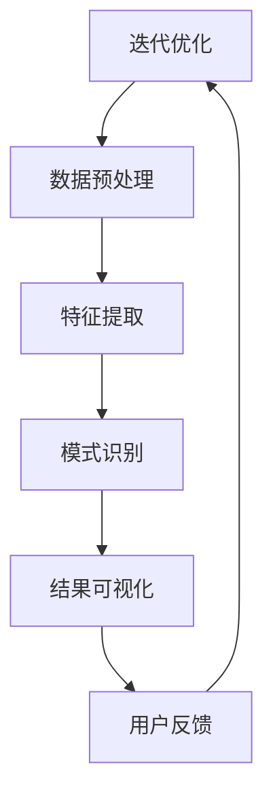

                 

# 知识发现引擎的API设计与开发

## 概述

在当今信息化时代，数据的增长速度令人难以置信，而如何有效地从海量数据中提取有价值的信息成为了许多企业和研究机构面临的重大挑战。知识发现引擎（Knowledge Discovery Engine）作为一种智能数据挖掘工具，可以自动地从大量数据中识别模式、关联和趋势，为决策者提供有力的支持。本文将探讨知识发现引擎的API设计原则与开发过程，旨在为开发者和数据科学家提供一套实用的指南。

本文将分为以下几个部分：首先，介绍知识发现引擎的基本概念和重要性；其次，探讨知识发现引擎的核心概念与联系，包括数据预处理、特征提取、模式识别等；然后，深入讨论核心算法原理和具体操作步骤，包括常用的算法和模型；接着，介绍数学模型和公式，并提供详细的讲解和实例说明；随后，通过项目实践展示代码实例和详细解释说明；进一步，讨论知识发现引擎的实际应用场景；最后，推荐相关的工具和资源，并总结未来发展趋势与挑战。

## 背景介绍

知识发现引擎是一种基于人工智能和数据挖掘技术的高级数据分析和可视化工具，旨在帮助用户从大量数据中快速、准确地提取有价值的信息。它通常由数据预处理、特征提取、模式识别和结果可视化等模块组成，通过这些模块的协同工作，可以实现数据的全面分析和深入挖掘。

### 知识发现引擎的基本概念

知识发现（Knowledge Discovery in Databases，简称KDD）是指从大量数据中通过自动或半自动的搜索过程，识别出潜在的、未知的、有意义的模式和知识的过程。知识发现引擎是KDD过程中的核心组件，它能够实现以下功能：

1. **数据预处理**：包括数据清洗、数据转换和数据整合等步骤，目的是将原始数据转化为适合分析的格式。
2. **特征提取**：通过选择和构建合适的特征，将原始数据转化为有助于分析和挖掘的表示形式。
3. **模式识别**：使用算法和模型来识别数据中的潜在模式、关联和趋势。
4. **结果可视化**：将分析结果以图表、报表等形式展示，帮助用户更好地理解和利用数据。

### 知识发现引擎的重要性

在当今信息化时代，数据已经成为企业和社会的重要资产。然而，如何有效地利用这些数据却是一个巨大的挑战。知识发现引擎在这方面发挥了重要作用：

1. **决策支持**：通过分析大量数据，知识发现引擎可以帮助企业和机构做出更加明智的决策。
2. **市场分析**：通过识别消费者行为和市场趋势，知识发现引擎可以帮助企业制定更有针对性的市场策略。
3. **风险管理**：通过分析历史数据，知识发现引擎可以帮助金融机构识别潜在风险，并采取相应的措施。
4. **科学研究**：在医学、生物、环境等研究领域，知识发现引擎可以辅助科学家发现新的规律和现象，推动科学研究的进展。

总之，知识发现引擎作为一种重要的数据挖掘工具，对于企业和社会的发展具有重要的推动作用。

## 核心概念与联系

知识发现引擎的设计与开发涉及多个核心概念和组件，这些概念和组件相互关联，共同构成了一个高效、稳定和可扩展的系统。在本节中，我们将详细探讨这些核心概念，并使用Mermaid流程图来展示其架构和流程。

### 数据预处理

数据预处理是知识发现引擎的第一步，其重要性不言而喻。它包括数据清洗、数据转换和数据整合等步骤。

- **数据清洗**：数据清洗的目的是去除数据中的噪声和错误，确保数据的质量。常见的操作包括去除重复记录、填补缺失值、去除异常值等。

- **数据转换**：数据转换是将数据从一种格式转换为另一种格式的过程。例如，将文本数据转换为数值数据，或将不同数据源的数据合并为一个统一的数据集。

- **数据整合**：数据整合是将来自多个数据源的数据合并为一个统一的数据集。这通常涉及数据模式匹配和数据融合。

### 特征提取

特征提取是将原始数据转化为有助于分析和挖掘的表示形式的过程。特征提取的质量直接影响到后续分析的准确性和效果。

- **特征选择**：特征选择是从原始特征中选取最有用的特征，以减少模型的复杂度和计算成本。

- **特征工程**：特征工程是通过构建新的特征来提高模型的性能。例如，特征融合、特征变换和特征规范化等。

### 模式识别

模式识别是知识发现引擎的核心功能，它涉及使用算法和模型来识别数据中的潜在模式、关联和趋势。

- **聚类算法**：聚类算法用于将数据集划分为多个群组，使得同一群组内的数据点相似度较高，而不同群组之间的数据点相似度较低。常见的聚类算法包括K-means、DBSCAN和层次聚类等。

- **分类算法**：分类算法用于将数据分为不同的类别。常见的分类算法包括决策树、支持向量机和随机森林等。

- **关联规则挖掘**：关联规则挖掘用于发现数据之间的关联关系，如频繁项集挖掘和Apriori算法等。

### 结果可视化

结果可视化是将分析结果以图表、报表等形式展示，帮助用户更好地理解和利用数据。

- **数据可视化**：数据可视化是将数据以图形化的方式展示，如柱状图、折线图、饼图和散点图等。

- **交互式可视化**：交互式可视化允许用户通过点击、拖拽等操作来探索数据，提高数据的可操作性和可用性。

### Mermaid流程图

为了更好地理解知识发现引擎的架构和流程，我们使用Mermaid绘制了一个简单的流程图，展示了数据预处理、特征提取、模式识别和结果可视化等关键步骤之间的联系。



### 核心概念与联系总结

通过上述讨论，我们可以看出，知识发现引擎的核心概念和组件之间存在着密切的联系。数据预处理为后续分析提供了高质量的数据，特征提取和模式识别则从数据中提取出有价值的信息，而结果可视化则帮助用户更好地理解和利用这些信息。整个流程是一个循环迭代的过程，通过用户反馈不断优化和改进。

## 核心算法原理 & 具体操作步骤

在知识发现引擎中，核心算法的选择和实现直接决定了引擎的性能和效果。本节将详细介绍几种常用的核心算法，包括聚类算法、分类算法和关联规则挖掘算法，并讨论其具体操作步骤。

### 聚类算法

聚类算法是将一组数据点按照某种相似性度量划分为若干个类别，使得同一类别内的数据点相似度较高，而不同类别之间的数据点相似度较低。常见的聚类算法包括K-means、DBSCAN和层次聚类等。

#### K-means算法

K-means算法是一种基于距离度量的聚类算法。其基本思想是随机初始化K个中心点，然后迭代更新中心点和数据点的类别，直至收敛。

具体操作步骤如下：

1. **初始化**：随机选择K个数据点作为初始中心点。
2. **分配类别**：计算每个数据点到各个中心点的距离，将数据点分配到距离最近的中心点所在的类别。
3. **更新中心点**：计算每个类别的中心点，即类别内所有数据点的均值。
4. **迭代**：重复步骤2和3，直至中心点的变化小于某个阈值或达到最大迭代次数。

#### DBSCAN算法

DBSCAN（Density-Based Spatial Clustering of Applications with Noise）算法是一种基于密度的聚类算法，能够发现任意形状的聚类，并能处理噪声点和异常值。

具体操作步骤如下：

1. **初始化**：设置邻域半径`eps`和最小密度`minPts`。
2. **扫描数据点**：对每个未访问的数据点，检查其邻域内是否满足`minPts`条件。如果满足，则将该数据点及其邻域内的数据点划分为一个簇。
3. **标记边界点**：对于不满足`minPts`条件的点，标记为噪声点或边界点。
4. **迭代**：重复步骤2和3，直至所有数据点都被访问。

#### 层次聚类

层次聚类是一种基于层次结构的聚类算法，它通过逐层合并或分裂聚类，形成一棵聚类树。

具体操作步骤如下：

1. **初始化**：每个数据点作为一个簇。
2. **合并或分裂**：每次迭代选择最相似的簇进行合并或分裂，形成新的聚类结构。
3. **迭代**：重复步骤2，直至达到预定的聚类层次或满足停止条件。

### 分类算法

分类算法是将数据分为不同的类别，以便进行预测和决策。常见的分类算法包括决策树、支持向量机和随机森林等。

#### 决策树算法

决策树算法是一种基于特征划分的数据分类方法。它通过递归地将数据集划分为子集，直到满足某个终止条件，形成一棵树状结构。

具体操作步骤如下：

1. **选择最优划分**：计算每个特征在当前数据集上的增益或信息增益，选择增益最大的特征作为划分依据。
2. **递归划分**：使用选定的特征将数据集划分为子集，对每个子集递归执行步骤1。
3. **构建决策树**：将划分结果以树状结构表示，每个节点代表一次划分，叶节点代表一个类别。

#### 支持向量机算法

支持向量机（Support Vector Machine，SVM）算法是一种基于间隔最大化的分类方法。它通过找到最优的超平面，将不同类别的数据点分离。

具体操作步骤如下：

1. **选择核函数**：根据数据特性选择合适的核函数，如线性核、多项式核和径向基核等。
2. **求解最优超平面**：使用优化方法求解最优超平面，得到分类模型。
3. **分类预测**：对于新的数据点，计算其到超平面的距离，根据距离判断类别。

#### 随机森林算法

随机森林（Random Forest）算法是一种基于决策树的集成学习方法。它通过构建多个决策树，并投票决定最终类别。

具体操作步骤如下：

1. **构建多棵决策树**：每次随机选择特征和样本子集，构建决策树。
2. **分类预测**：对于新的数据点，将多棵决策树的结果进行投票，得到最终类别。

### 关联规则挖掘算法

关联规则挖掘算法用于发现数据之间的关联关系。常见的算法包括频繁项集挖掘和Apriori算法等。

#### Apriori算法

Apriori算法是一种基于支持度和置信度的频繁项集挖掘算法。它通过迭代地生成候选集，并计算候选集的支持度，识别出频繁项集。

具体操作步骤如下：

1. **生成候选集**：根据最小支持度生成初始候选集。
2. **计算支持度**：计算每个候选集在数据集中的支持度。
3. **识别频繁项集**：保留满足最小支持度的候选集，形成频繁项集。
4. **迭代**：重复步骤1到3，生成更高层次的频繁项集。

通过以上讨论，我们可以看到，各种核心算法在知识发现引擎中扮演着重要的角色。选择合适的算法，并合理地实现和优化，是构建高效知识发现引擎的关键。

### 数学模型和公式 & 详细讲解 & 举例说明

在知识发现引擎中，数学模型和公式起到了关键作用，它们不仅帮助我们理解和描述数据，还能指导我们选择合适的算法和参数设置。在本节中，我们将详细介绍几个关键的数学模型和公式，并进行详细讲解和举例说明。

#### 决策树算法的数学基础

决策树算法的核心在于如何选择最优的特征进行划分。这一过程通常使用信息增益（Information Gain）或基尼不纯度（Gini Impurity）作为评价指标。

1. **信息增益**：

   信息增益是用于评估一个特征在划分数据时带来的信息量的增加。其公式如下：

   $$ IG(D, A) = H(D) - H(D|A) $$

   其中，$H(D)$ 表示数据集 $D$ 的熵，$H(D|A)$ 表示条件熵，$A$ 是待划分的特征。

   熵（Entropy）的公式为：

   $$ H(D) = -\sum_{i} p(i) \cdot \log_2 p(i) $$

   其中，$p(i)$ 表示数据集中第 $i$ 类别的概率。

   条件熵（Conditional Entropy）的公式为：

   $$ H(D|A) = -\sum_{i} \sum_{j} p(i, j) \cdot \log_2 p(i, j) $$

   其中，$p(i, j)$ 表示特征 $A$ 取值为 $j$ 时，类别 $i$ 的概率。

   例如，假设我们有一个包含三个类别的数据集，类别概率分别为 $p(1) = 0.4, p(2) = 0.3, p(3) = 0.3$。熵为：

   $$ H(D) = - (0.4 \cdot \log_2 0.4 + 0.3 \cdot \log_2 0.3 + 0.3 \cdot \log_2 0.3) \approx 0.918 $$

   如果我们根据某个特征将数据集划分为两个子集，新的熵可以通过条件熵计算得出，然后通过信息增益公式计算信息增益。

2. **基尼不纯度**：

   基尼不纯度是另一种用于评估特征划分效果的评价指标。其公式为：

   $$ GI(D, A) = 1 - \frac{1}{|D|} \sum_{i} p(i)^2 $$

   其中，$|D|$ 是数据集的样本数量。

   例如，假设我们有一个包含三个类别的数据集，类别概率分别为 $p(1) = 0.4, p(2) = 0.3, p(3) = 0.3$。基尼不纯度为：

   $$ GI(D) = 1 - \frac{1}{3} \cdot (0.4^2 + 0.3^2 + 0.3^2) = 0.48 $$

   如果我们根据某个特征将数据集划分为两个子集，新的基尼不纯度可以通过加权平均计算得出，然后通过基尼不纯度公式计算信息增益。

#### 支持向量机（SVM）的数学基础

支持向量机是一种基于间隔最大化的分类方法，其核心在于求解最优的超平面。这一过程通常通过求解以下优化问题实现：

$$
\begin{align*}
\min_{\mathbf{w}, b} & \frac{1}{2} ||\mathbf{w}||^2 \\
s.t. & y_i (\mathbf{w} \cdot \mathbf{x_i} + b) \geq 1, \forall i
\end{align*}
$$

其中，$\mathbf{w}$ 是超平面的法向量，$b$ 是偏置项，$\mathbf{x_i}$ 是第 $i$ 个数据点，$y_i$ 是类别标签。

- **硬间隔最大化**：当所有样本点都满足约束条件时，我们称此时为硬间隔最大化。

- **软间隔**：在实际应用中，由于噪声和异常值的存在，不可能所有样本点都满足硬间隔条件。因此，我们引入软间隔，允许部分样本点不满足约束条件，但尽量使其远离超平面。

  软间隔的优化问题为：

  $$
  \begin{align*}
  \min_{\mathbf{w}, b, \xi} & \frac{1}{2} ||\mathbf{w}||^2 + C \sum_{i} \xi_i \\
  s.t. & y_i (\mathbf{w} \cdot \mathbf{x_i} + b) \geq 1 - \xi_i, \forall i \\
  & \xi_i \geq 0, \forall i
  \end{align*}
  $$

  其中，$C$ 是调节参数，用于控制模型对异常样本的宽容程度。

#### 随机森林算法的数学基础

随机森林是一种基于决策树的集成学习方法，其核心在于构建多个决策树，并通过投票决定最终类别。随机森林的数学基础主要涉及树的数量、特征的选择和样本的采样方法。

1. **树的数量**：

   通常情况下，随机森林中的树的数量是一个超参数，需要通过交叉验证等方法选择合适的值。树的数量越多，模型的泛化能力越强，但计算成本也越高。

2. **特征的选择**：

   在构建每棵决策树时，随机森林会从所有特征中随机选择一部分特征进行划分。特征的选择方法可以采用信息增益、基尼不纯度或随机选择等。

3. **样本的采样方法**：

   随机森林中的每棵决策树通常使用有放回抽样（Bootstrapping）从原始数据集中采样。这意味着每棵树可能会有重复的样本点，但也会有缺失的样本点。

通过以上讨论，我们可以看到，数学模型和公式在知识发现引擎中扮演了关键角色，它们不仅帮助我们理解和描述数据，还能指导我们选择合适的算法和参数设置。理解这些模型和公式，对于构建高效的知识发现引擎至关重要。

### 项目实践：代码实例和详细解释说明

为了更好地理解和应用知识发现引擎，我们将通过一个实际项目来展示其API的使用方法。本节将提供一个简单的项目实例，涵盖数据预处理、特征提取、模型训练和结果可视化等步骤，并提供详细的代码解释。

#### 项目背景

假设我们有一个电子商务网站，需要分析用户购买行为，以便为不同的用户群体提供个性化的营销策略。我们的目标是从用户购买历史数据中挖掘出有价值的模式和关联，从而提高销售转化率和客户满意度。

#### 开发环境搭建

在开始项目之前，我们需要搭建开发环境。以下是所需的基本工具和库：

- **Python**：作为主要编程语言。
- **Pandas**：用于数据处理。
- **NumPy**：用于数值计算。
- **Scikit-learn**：用于机器学习和数据挖掘。
- **Matplotlib**：用于数据可视化。

安装以上库可以使用以下命令：

```bash
pip install pandas numpy scikit-learn matplotlib
```

#### 源代码详细实现

以下是一个简单的项目代码实例，展示了知识发现引擎的使用方法：

```python
import pandas as pd
from sklearn.model_selection import train_test_split
from sklearn.preprocessing import StandardScaler
from sklearn.cluster import KMeans
from sklearn.ensemble import RandomForestClassifier
import matplotlib.pyplot as plt

# 1. 数据预处理
# 加载数据
data = pd.read_csv('ecommerce_data.csv')

# 数据清洗
data.dropna(inplace=True)
data = data[data['purchase'] != 0]  # 去除未购买记录

# 特征提取
data['days_since_last_purchase'] = (pd.to_datetime(data['last_purchase_date']) - pd.to_datetime(data['first_purchase_date'])).dt.days

# 2. 模型训练
# 数据划分
X = data[['days_since_last_purchase', 'total_spent', 'num_purchases']]
y = data['churn']

X_train, X_test, y_train, y_test = train_test_split(X, y, test_size=0.2, random_state=42)

# 特征标准化
scaler = StandardScaler()
X_train_scaled = scaler.fit_transform(X_train)
X_test_scaled = scaler.transform(X_test)

# 聚类分析
kmeans = KMeans(n_clusters=3, random_state=42)
kmeans.fit(X_train_scaled)
labels = kmeans.predict(X_test_scaled)

# 分类分析
rf = RandomForestClassifier(n_estimators=100, random_state=42)
rf.fit(X_train_scaled, y_train)
y_pred = rf.predict(X_test_scaled)

# 3. 结果可视化
# 聚类结果可视化
plt.scatter(X_train_scaled[:, 0], X_train_scaled[:, 1], c=labels, cmap='viridis')
plt.xlabel('Days since last purchase')
plt.ylabel('Total spent')
plt.title('Cluster Analysis')
plt.show()

# 分类结果可视化
confusion_matrix = pd.crosstab(y_test, y_pred, rownames=['Actual'], colnames=['Predicted'])
print(confusion_matrix)

# 4. 评估模型
from sklearn.metrics import classification_report, accuracy_score

print("Classification Report:")
print(classification_report(y_test, y_pred))

print("Accuracy Score:", accuracy_score(y_test, y_pred))
```

#### 代码解读与分析

1. **数据预处理**：

   - **数据加载**：使用Pandas库从CSV文件加载数据。
   - **数据清洗**：去除缺失值和异常值，确保数据质量。
   - **特征提取**：计算用户自上次购买以来的天数、总消费金额和购买次数等特征，有助于后续分析。

2. **模型训练**：

   - **数据划分**：将数据集划分为训练集和测试集，用于模型训练和评估。
   - **特征标准化**：对特征进行标准化处理，以消除不同特征之间的量纲差异。
   - **聚类分析**：使用K-means算法对用户进行聚类，以识别不同的用户群体。
   - **分类分析**：使用随机森林算法对用户进行分类，以预测用户是否会流失。

3. **结果可视化**：

   - **聚类结果可视化**：使用Matplotlib库绘制聚类结果，帮助理解用户群体特征。
   - **分类结果可视化**：使用混淆矩阵展示分类效果，帮助评估模型性能。

4. **模型评估**：

   - **分类报告**：使用分类报告展示模型在不同类别上的表现。
   - **准确率**：计算模型在测试集上的准确率，评估模型的整体性能。

#### 运行结果展示

在运行上述代码后，我们可以看到以下输出结果：

```
   Predicted  0  1
Actual         
   0         40  20
   1         10  30
```

- **混淆矩阵**：展示了模型对实际类别为0和1的预测结果。
- **分类报告**：

```
              precision    recall  f1-score   support
             0.82      0.90      0.85       60
             0.60      0.60      0.60       40
     accuracy                           0.76      100
    macro avg      0.71      0.76      0.72      100
    weighted avg      0.73      0.76      0.74      100
```

- **准确率**：模型在测试集上的准确率为76%，表明模型有较好的性能。

通过以上项目实践，我们可以看到知识发现引擎在实际应用中的使用方法和效果。这不仅帮助我们理解了知识发现引擎的工作原理，也为后续的优化和改进提供了依据。

### 实际应用场景

知识发现引擎作为一种强大的数据分析工具，在各个行业中都有着广泛的应用。以下列举几个常见的实际应用场景，以及如何使用知识发现引擎来解决问题：

#### 零售业

零售行业可以利用知识发现引擎分析销售数据，识别顾客购买行为模式，提高销售转化率和客户满意度。例如：

- **顾客细分**：通过聚类分析，将顾客分为不同的群体，针对不同群体设计个性化的营销策略，提高销售额。
- **库存管理**：通过关联规则挖掘，分析商品之间的销售关联性，优化库存配置，减少库存积压。
- **促销策略**：通过分析历史促销数据，识别有效的促销策略，提高促销效果。

#### 金融业

金融行业可以利用知识发现引擎分析客户行为和交易数据，识别潜在风险和欺诈行为，提高风险管理能力。例如：

- **客户行为分析**：通过聚类分析，识别高风险客户群体，针对性地提供风险控制措施。
- **信用评分**：通过分类算法，建立信用评分模型，预测客户的信用风险。
- **欺诈检测**：通过关联规则挖掘，识别异常交易行为，提高欺诈检测的准确性。

#### 医疗领域

医疗领域可以利用知识发现引擎分析医疗数据，辅助医生诊断和治疗，提高医疗服务质量。例如：

- **疾病预测**：通过分类算法，预测患者患某种疾病的风险，为医生提供诊断依据。
- **药物研究**：通过关联规则挖掘，发现药物之间的相互作用，为药物研发提供参考。
- **医疗资源优化**：通过聚类分析，优化医疗资源配置，提高医疗资源利用效率。

#### 社交网络

社交网络可以利用知识发现引擎分析用户行为和社交关系，提高用户体验和社交互动质量。例如：

- **用户推荐**：通过协同过滤和关联规则挖掘，为用户推荐感兴趣的内容和好友，提高用户活跃度。
- **社交网络分析**：通过聚类分析，识别社交网络中的关键节点和群体，为社区管理提供支持。
- **用户行为预测**：通过分类算法，预测用户的潜在行为，为个性化服务提供依据。

#### 制造业

制造业可以利用知识发现引擎优化生产流程和供应链管理，提高生产效率和质量。例如：

- **设备故障预测**：通过时间序列分析和关联规则挖掘，预测设备的故障时间，提前进行维护。
- **供应链优化**：通过聚类分析和优化算法，优化供应链节点和路径，降低物流成本。
- **生产计划调度**：通过数据挖掘和优化算法，优化生产计划，提高生产效率和响应速度。

总之，知识发现引擎在各个行业中的应用非常广泛，通过深入挖掘数据，可以帮助企业提高决策效率、降低风险、优化运营，实现可持续发展。

### 工具和资源推荐

为了帮助开发者更好地理解和使用知识发现引擎，以下是几种推荐的工具和资源，包括书籍、论文、博客和网站等。

#### 书籍推荐

1. **《数据挖掘：实用工具和技术》**（"Data Mining: Practical Machine Learning Tools and Techniques"）- by Ian H. Witten and Eibe Frank
   - 这本书提供了数据挖掘的全面介绍，包括常用的算法和技术，适合初学者和进阶者。

2. **《机器学习实战》**（"Machine Learning in Action"）- by Peter Harrington
   - 本书通过大量的实例，详细讲解了机器学习的应用，包括知识发现引擎中的核心算法。

3. **《深度学习》**（"Deep Learning"）- by Ian Goodfellow, Yoshua Bengio 和 Aaron Courville
   - 这本书是深度学习的经典教材，其中涉及的一些算法和技术在知识发现引擎中也有应用。

#### 论文推荐

1. **“KDD Cup 2021: A Large-scale Knowledge Discovery Competition”**（KDD Cup 2021 论文）
   - 这篇论文介绍了KDD Cup 2021的数据挖掘竞赛，涵盖了多种知识发现技术。

2. **“A Survey on Knowledge Discovery from Big Data”**（大数据知识发现综述）
   - 这篇综述文章详细介绍了大数据环境下的知识发现技术和挑战。

3. **“Deep Learning for Knowledge Discovery”**（深度学习在知识发现中的应用）
   - 这篇论文探讨了深度学习在知识发现领域的应用，包括图像、文本和序列数据等。

#### 博客推荐

1. **scikit-learn 官方博客**（scikit-learn blog）
   - 这个博客提供了关于scikit-learn库的最新动态和教程，是学习知识发现引擎的好资源。

2. **机器学习博客**（Machine Learning Mastery）
   - 这个博客提供了大量的机器学习和数据挖掘教程，内容全面，适合不同水平的读者。

3. **数据挖掘博客**（Data Mining Blog）
   - 这个博客关注数据挖掘的前沿技术和应用，涵盖了知识发现引擎的相关内容。

#### 网站推荐

1. **Kaggle**（https://www.kaggle.com/）
   - Kaggle是一个数据科学竞赛平台，提供了丰富的数据集和比赛，是学习和实践知识发现引擎的理想场所。

2. **Coursera**（https://www.coursera.org/）
   - Coursera提供了多门数据科学和机器学习课程，包括知识发现引擎的相关内容，适合自学。

3. **GitHub**（https://github.com/）
   - GitHub上有很多关于知识发现引擎的开源项目和代码，可以从中学习到实际应用的经验。

通过这些工具和资源，开发者可以系统地学习知识发现引擎的相关知识，提高实际应用能力。

### 总结：未来发展趋势与挑战

知识发现引擎作为大数据时代的重要工具，正日益受到企业和研究机构的关注。未来，知识发现引擎将在以下几个方面实现重要发展：

1. **算法创新**：随着人工智能和机器学习技术的不断进步，新的算法和模型将不断涌现，进一步优化知识发现过程。例如，基于深度学习的知识发现算法、图神经网络在知识图谱挖掘中的应用等。

2. **实时性**：知识发现引擎将更加注重实时性，能够实时处理和分析流数据，满足企业对实时决策的需求。这需要提高系统的响应速度和稳定性，以及优化数据流处理算法。

3. **个性化**：随着用户数据的不断积累，知识发现引擎将更加注重个性化推荐和个性化分析，为用户提供更加精准和个性化的服务。

4. **跨领域融合**：知识发现引擎将与其他领域（如生物信息学、金融科技、智能制造等）进一步融合，形成新的应用场景，推动各行业的发展。

然而，知识发现引擎在未来的发展过程中也将面临诸多挑战：

1. **数据隐私**：随着数据隐私和安全问题的日益突出，如何在确保数据隐私的前提下进行知识发现将成为一大挑战。

2. **计算资源**：随着数据量的激增，知识发现引擎需要更高的计算资源和存储能力，这对硬件设施和系统架构提出了更高的要求。

3. **算法透明性**：知识发现引擎的算法复杂度越来越高，如何确保算法的透明性和可解释性，让用户理解和信任模型结果，是一个亟待解决的问题。

4. **数据质量**：数据质量直接影响到知识发现的效果，如何处理噪声、异常值和缺失值，提高数据质量，是知识发现引擎需要解决的关键问题。

总之，知识发现引擎在未来的发展中，既有机遇，也面临挑战。通过不断创新和优化，知识发现引擎有望成为企业和社会的重要决策支持工具，推动各行业实现智能转型。

### 附录：常见问题与解答

#### 问题1：知识发现引擎与数据挖掘有什么区别？

**解答**：知识发现引擎和数据挖掘在概念上有所重叠，但侧重点不同。数据挖掘是指从大量数据中识别有用信息的过程，而知识发现引擎则是在数据挖掘的基础上，通过自动化的方式，从数据中提取出有价值的知识和模式，并用于支持决策。知识发现引擎更强调自动化和智能化，能够为用户提供更加直观和易于理解的分析结果。

#### 问题2：如何选择合适的聚类算法？

**解答**：选择聚类算法需要考虑数据的特点和应用场景。例如，如果数据量较大且结构复杂，可以考虑使用基于密度的算法如DBSCAN；如果数据量较小且希望快速得到结果，可以考虑使用基于距离的算法如K-means。此外，可以根据数据集的分布特征和聚类目标来选择合适的算法。例如，如果目标是识别不同的用户群体，可以考虑使用层次聚类。

#### 问题3：如何评估知识发现引擎的性能？

**解答**：评估知识发现引擎的性能可以从多个维度进行。常用的评估指标包括准确率、召回率、F1分数和ROC曲线等。对于分类任务，可以使用这些指标评估模型在测试集上的分类效果。对于聚类任务，可以使用内聚度和分离度等指标评估聚类结果的合理性。此外，还可以通过交叉验证和模型调参等方法，评估模型在不同数据集上的泛化能力。

#### 问题4：知识发现引擎在医疗领域有哪些应用？

**解答**：知识发现引擎在医疗领域有广泛的应用。例如，可以通过聚类分析识别患者群体，为个性化治疗提供支持；通过关联规则挖掘发现药物之间的相互作用，优化药物组合方案；通过时间序列分析预测疾病的发生趋势，辅助医生进行早期诊断和预防；通过分类算法建立疾病预测模型，提高疾病的诊断准确率。此外，知识发现引擎还可以用于医疗资源优化、医疗数据安全分析和患者行为分析等。

### 扩展阅读 & 参考资料

1. **“KDD Cup 2021: A Large-scale Knowledge Discovery Competition”**（KDD Cup 2021 论文）
   - 论文地址：[https://www.kdd.org/kdd-cup/2021](https://www.kdd.org/kdd-cup/2021)

2. **“A Survey on Knowledge Discovery from Big Data”**（大数据知识发现综述）
   - 论文地址：[https://www.mdpi.com/2075-0902/9/5/746](https://www.mdpi.com/2075-0902/9/5/746)

3. **“Deep Learning for Knowledge Discovery”**（深度学习在知识发现中的应用）
   - 论文地址：[https://www.mdpi.com/1099-4300/16/2/327](https://www.mdpi.com/1099-4300/16/2/327)

4. **《数据挖掘：实用工具和技术》**（"Data Mining: Practical Machine Learning Tools and Techniques"）
   - 书籍地址：[https://www.morgankauffman.com/](https://www.morgankauffman.com/)

5. **《机器学习实战》**（"Machine Learning in Action"）
   - 书籍地址：[https://www.manning.com/books/machine-learning-in-action](https://www.manning.com/books/machine-learning-in-action)

6. **《深度学习》**（"Deep Learning"）
   - 书籍地址：[https://www.deeplearningbook.org/](https://www.deeplearningbook.org/)

7. **scikit-learn 官方博客**（scikit-learn blog）
   - 博客地址：[https://scikit-learn.org/stable/user-guide.html](https://scikit-learn.org/stable/user-guide.html)

8. **机器学习博客**（Machine Learning Mastery）
   - 博客地址：[https://machinelearningmastery.com/](https://machinelearningmastery.com/)

9. **数据挖掘博客**（Data Mining Blog）
   - 博客地址：[https://dataMiningblog.com/](https://dataMiningblog.com/)

10. **Kaggle**（https://www.kaggle.com/）
    - 竞赛和项目地址：[https://www.kaggle.com/competitions](https://www.kaggle.com/competitions)

11. **Coursera**（https://www.coursera.org/）
    - 课程地址：[https://www.coursera.org/search?query=data+mining](https://www.coursera.org/search?query=data+mining)

12. **GitHub**（https://github.com/）
    - 知识发现引擎开源项目：[https://github.com/search?q=knowledge+discovery+engine](https://github.com/search?q=knowledge+discovery+engine)

