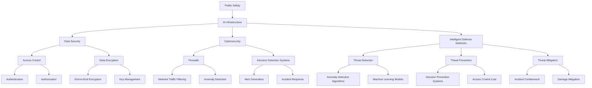

                 

### 文章标题

AI 基础设施的公共安全：构建智能防控网络

关键词：AI基础设施、公共安全、智能防控网络、网络安全、人工智能技术

摘要：随着人工智能技术的快速发展，AI基础设施在现代社会中扮演着越来越重要的角色。然而，随之而来的安全问题也日益凸显。本文将探讨AI基础设施的公共安全，重点分析构建智能防控网络的方法和策略，以保障AI基础设施的安全可靠运行。

### Background Introduction

Artificial intelligence (AI) has experienced tremendous growth in recent years, transforming various industries and becoming an integral part of our daily lives. As a result, AI infrastructure has emerged as a crucial component in modern society. This infrastructure encompasses the hardware, software, and networks required to support AI applications and services.

With the increasing reliance on AI, the importance of ensuring the security and reliability of AI infrastructure cannot be overstated. Public safety is a paramount concern, as vulnerabilities and threats in AI systems can have far-reaching consequences. For instance, cyber attacks targeting AI systems can lead to data breaches, financial losses, and even physical harm. Additionally, the lack of security measures in AI infrastructure can expose individuals and organizations to various types of fraud, identity theft, and other malicious activities.

To address these challenges, it is essential to build intelligent defense networks that can detect, prevent, and mitigate potential threats to AI infrastructure. This article aims to explore the concept of public safety in AI infrastructure and provide insights into the strategies and techniques for constructing intelligent defense networks. By understanding the importance of public safety and the potential risks associated with AI infrastructure, we can better appreciate the need for robust security measures and proactive defense mechanisms.

In the following sections, we will delve into the core concepts and principles underlying AI infrastructure, examine the key algorithms and operational steps for constructing intelligent defense networks, and discuss practical application scenarios and recommended tools and resources. Through this comprehensive analysis, we hope to shed light on the future development trends and challenges in ensuring the public safety of AI infrastructure.

### Core Concepts and Connections

To build a robust and secure AI infrastructure, it is crucial to understand the core concepts and connections that underpin the system. This section will introduce the fundamental concepts and provide a Mermaid flowchart illustrating the key components and their relationships.

#### Core Concepts

1. **Artificial Intelligence (AI) Infrastructure**: AI infrastructure refers to the physical and virtual resources required to develop, deploy, and maintain AI applications and services. This includes hardware such as servers, GPUs, and data centers, as well as software frameworks, libraries, and platforms.

2. **Data Security**: Data security involves protecting AI infrastructure from unauthorized access, data breaches, and other malicious activities. This includes encryption, access control, and secure data storage.

3. **Cybersecurity**: Cybersecurity focuses on protecting AI infrastructure from cyber threats, including malware, phishing attacks, and other types of cybercrime. This involves implementing firewalls, intrusion detection systems, and other security measures.

4. **Intelligent Defense Networks**: Intelligent defense networks are automated systems designed to detect, prevent, and respond to potential threats to AI infrastructure. These networks leverage advanced algorithms, machine learning, and artificial intelligence to identify and mitigate risks.

5. **Public Safety**: Public safety refers to the measures and strategies implemented to ensure the well-being and security of individuals and communities. In the context of AI infrastructure, public safety involves safeguarding the system against threats that could impact society as a whole.

#### Mermaid Flowchart

Below is a Mermaid flowchart illustrating the core concepts and their relationships:

In this flowchart, we can see that AI infrastructure is at the center, connected to data security, cybersecurity, intelligent defense networks, and public safety. Each of these components has its own set of subcomponents, illustrating the complexity of AI infrastructure and the interconnectedness of its various aspects.

Understanding these core concepts and their relationships is essential for building a secure and resilient AI infrastructure. In the following sections, we will delve deeper into each of these components, exploring their principles, algorithms, and operational steps.

### Core Algorithm Principles and Specific Operational Steps

To construct an intelligent defense network for AI infrastructure, we must first understand the core algorithms and specific operational steps involved. This section will outline the key algorithms and provide detailed descriptions of their operational steps.

#### Core Algorithms

1. **Anomaly Detection Algorithms**: Anomaly detection algorithms are used to identify unusual or unexpected patterns in data that may indicate potential threats. These algorithms can be based on statistical models, machine learning, or a combination of both.

2. **Machine Learning Models**: Machine learning models, such as neural networks and decision trees, are used to classify data and make predictions. These models can be trained to recognize patterns and detect anomalies in AI infrastructure.

3. **Intrusion Detection Systems (IDS)**: IDS are designed to detect and respond to unauthorized access attempts and other malicious activities. These systems can be based on network traffic analysis, signature-based detection, or a combination of both.

4. **Intrusion Prevention Systems (IPS)**: IPS are designed to prevent and mitigate the impact of cyber attacks by actively blocking malicious activities. These systems can be integrated with IDS to provide a comprehensive defense mechanism.

5. **Threat Intelligence**: Threat intelligence involves gathering, analyzing, and sharing information about potential threats. This information is used to improve the detection and prevention capabilities of intelligent defense networks.

#### Operational Steps

1. **Data Collection**: The first step in building an intelligent defense network is to collect relevant data from various sources within the AI infrastructure. This data can include network traffic logs, system logs, user activity logs, and more.

2. **Data Preprocessing**: Once the data is collected, it needs to be preprocessed to remove noise, fill missing values, and normalize the data. This step is crucial for ensuring that the data is suitable for analysis and modeling.

3. **Feature Extraction**: In this step, relevant features are extracted from the preprocessed data. These features are used as inputs for the machine learning models and anomaly detection algorithms.

4. **Model Training**: The next step is to train the machine learning models and anomaly detection algorithms using the extracted features. This involves feeding the models with labeled data (i.e., data with known threat labels) and optimizing their parameters to improve their performance.

5. **Model Evaluation**: Once the models are trained, they need to be evaluated using test data to assess their accuracy, precision, and recall. This step helps identify any issues with the models and informs further refinements.

6. **Deployment**: The trained models and algorithms are deployed within the AI infrastructure to provide real-time threat detection and response capabilities. This can involve integrating the models with existing systems, such as IDS and IPS, or deploying them as standalone solutions.

7. **Continuous Monitoring and Updating**: Continuous monitoring and updating of the intelligent defense network are essential to ensure its effectiveness. This involves collecting new data, retraining the models, and updating the threat intelligence database to keep up with emerging threats.

#### Example: Anomaly Detection Algorithm

One commonly used anomaly detection algorithm is the Isolation Forest, which is based on the concept of random forests. Here is a step-by-step description of the algorithm:

1. **Random Subspace Construction**: For each sample in the dataset, construct a random subspace by randomly selecting a subset of features. This step is repeated multiple times to generate multiple random subspaces.

2. **Isolation Process**: For each random subspace, recursively isolate the samples by splitting the data based on the median value of the selected feature. This process is repeated until a predetermined stopping criterion is met (e.g., a maximum depth or a minimum number of samples in a node).

3. **Path Length Calculation**: Calculate the path length for each sample by measuring the number of splits it takes to reach a leaf node. The path length is a measure of how easily the sample can be isolated in the random forest.

4. **Threshold Determination**: Determine a threshold value for the path length that separates normal samples from anomalies. This can be done using techniques such as maximum likelihood estimation or cross-validation.

5. **Anomaly Detection**: Classify each sample as normal or anomalous based on its path length. Samples with a path length below the threshold are classified as anomalies.

6. **Evaluation**: Evaluate the performance of the algorithm using metrics such as accuracy, precision, and recall. This helps assess the effectiveness of the algorithm and identify areas for improvement.

By following these steps, an intelligent defense network can be built to protect AI infrastructure from potential threats. The use of advanced algorithms and continuous monitoring ensures that the network remains adaptive and resilient in the face of evolving threats.

### Mathematical Models and Formulas

In the construction of intelligent defense networks, mathematical models and formulas play a crucial role in the detection, prevention, and mitigation of threats. This section will provide a detailed explanation of some of the key mathematical models and formulas used in the context of AI infrastructure security.

#### Anomaly Detection Models

Anomaly detection is a fundamental component of intelligent defense networks. It involves identifying unusual patterns or behaviors that deviate from the norm. Several mathematical models are used in this context:

1. **Isolation Forest Model**:
   The Isolation Forest algorithm is based on the concept of random forests but uses a different approach to isolation. The mathematical model for Isolation Forest can be expressed as:

   $$path\_length = \frac{\sum_{i=1}^{n}{|x_i - median(x_i)|}}{\sqrt{n}}$$

   Where \( x_i \) represents the value of the \( i^{th} \) feature, and \( median(x_i) \) represents the median value of the feature. The path length is calculated for each sample, and anomalies are detected by comparing the path length to a predefined threshold.

2. **One-Class SVM Model**:
   Support Vector Machines (SVM) can be used for one-class classification, where the goal is to separate the normal samples from the anomalies. The mathematical model for one-class SVM can be expressed as:

   $$\min_w \frac{1}{2} ||w||^2$$

   Subject to:

   $$y_i ( \langle w, x_i \rangle - \mu ) \geq 1$$

   Where \( w \) represents the weight vector, \( x_i \) represents the feature vector, \( y_i \) is the label (1 for normal samples, -1 for anomalies), and \( \mu \) is the mean of the normal samples.

3. **Local Outlier Factor (LOF) Model**:
   LOF is a density-based anomaly detection method that measures the local deviation of a sample with respect to its neighbors. The mathematical model for LOF can be expressed as:

   $$LOF(x) = \frac{1}{\sum_{i=1}^{n} \frac{1}{r_i}}$$

   Where \( r_i \) represents the local reachability distance between sample \( x \) and its neighbors.

#### Intrusion Detection Models

Intrusion detection systems (IDS) are critical for identifying and responding to unauthorized access attempts and other malicious activities. Several mathematical models are used in IDS:

1. **Neural Network Model**:
   Neural networks can be used for intrusion detection by training them to recognize patterns in network traffic. The mathematical model for a simple neural network can be expressed as:

   $$z_i = \sigma(\sum_{j=1}^{n} w_{ji} x_j + b_i)$$

   Where \( z_i \) represents the output of the \( i^{th} \) neuron, \( x_j \) represents the input feature, \( w_{ji} \) represents the weight between the \( j^{th} \) input and the \( i^{th} \) neuron, \( b_i \) represents the bias, and \( \sigma \) is the activation function.

2. **Decision Tree Model**:
   Decision trees are used to classify network traffic based on a series of if-else conditions. The mathematical model for a decision tree can be expressed as:

   $$class = \begin{cases} 
   left & \text{if } condition_1 \\
   right & \text{if } condition_2 \\
   \vdots & \text{...} \\
   leaf & \text{if } condition_n
   \end{cases}$$

   Where \( class \) represents the output class (normal or malicious), and \( condition_1, condition_2, ..., condition_n \) represent the conditions used to split the data.

3. **Support Vector Machine (SVM) Model**:
   SVMs can be used for intrusion detection by training them to classify network traffic into normal and malicious categories. The mathematical model for SVM can be expressed as:

   $$\min_w \frac{1}{2} ||w||^2 + C \sum_{i=1}^{n} \xi_i$$

   Subject to:

   $$y_i ( \langle w, x_i \rangle - \beta ) \geq 1 - \xi_i$$

   Where \( w \) represents the weight vector, \( x_i \) represents the feature vector, \( y_i \) is the label (1 for normal samples, -1 for malicious samples), \( \beta \) is the bias, and \( C \) is the regularization parameter.

#### Threat Intelligence Models

Threat intelligence involves gathering, analyzing, and sharing information about potential threats. Several mathematical models are used in the context of threat intelligence:

1. **Threat Graph Model**:
   Threat graphs are used to represent the relationships between various threat indicators. The mathematical model for a threat graph can be expressed as:

   $$G = (V, E)$$

   Where \( V \) represents the set of vertices (th

