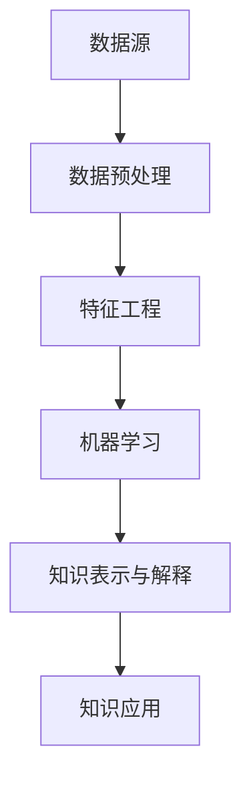

                 

### 文章标题

### Knowledge Discovery Engine: The Perfect Blend of Knowledge and Insights

在这个数字化时代，数据无处不在，但信息的价值取决于我们如何从中提取洞见和知识。知识发现引擎（Knowledge Discovery Engine，简称KDE）作为数据科学和人工智能领域的核心技术之一，扮演着至关重要的角色。本文旨在深入探讨知识发现引擎的工作原理、核心算法、应用场景，并展望其未来的发展趋势与挑战。

这篇文章将通过以下几个部分展开：

1. 背景介绍
2. 核心概念与联系
3. 核心算法原理 & 具体操作步骤
4. 数学模型和公式 & 详细讲解 & 举例说明
5. 项目实践：代码实例和详细解释说明
6. 实际应用场景
7. 工具和资源推荐
8. 总结：未来发展趋势与挑战
9. 附录：常见问题与解答
10. 扩展阅读 & 参考资料

### Keywords: Knowledge Discovery Engine, AI, Data Science, Core Algorithms, Application Scenarios

### Abstract: This article delves into the workings of Knowledge Discovery Engines, focusing on their principles, algorithms, applications, and future prospects. By providing a comprehensive overview and practical examples, it aims to shed light on the transformative potential of this cutting-edge technology in various fields.

## 1. 背景介绍（Background Introduction）

随着互联网的普及和大数据技术的发展，我们进入了数据驱动决策的新时代。然而，海量的数据本身并不具备价值，只有通过深入分析和提取其中的知识，数据才能转化为实际的业务洞察和决策支持。知识发现引擎正是为此而生，它通过自动化的方法从大量数据中识别模式和关联，从而生成有价值的知识和洞察。

知识发现引擎的重要性在于它能够解决以下几个关键问题：

- **数据冗余与噪音：**海量的数据中往往存在大量的冗余和噪音，知识发现引擎可以帮助我们识别和消除这些不必要的部分，提取核心信息。
- **复杂性与多样性：**不同领域的数据类型和结构复杂多样，知识发现引擎能够处理这些复杂性和多样性，生成跨领域的通用知识。
- **实时性与动态性：**业务环境和数据在不断变化，知识发现引擎能够实时地更新和调整，确保生成的知识始终保持最新和有效。

### 2. 核心概念与联系（Core Concepts and Connections）

#### 2.1 知识发现引擎的定义

知识发现引擎是一种基于人工智能和数据挖掘技术的系统，它能够从大量数据中自动识别模式、关联和规律，并将其转化为可操作的知识。这一过程通常包括以下几个关键步骤：

1. **数据采集与预处理：**收集并清洗原始数据，使其符合分析要求。
2. **特征提取：**将原始数据转换为适用于机器学习的特征向量。
3. **模式识别与关联分析：**使用机器学习算法从特征向量中识别模式和相关关系。
4. **知识表示与解释：**将发现的模式和关联转化为易于理解和操作的知识形式。

#### 2.2 知识发现与数据挖掘的联系

知识发现和数据挖掘是密切相关的领域。数据挖掘通常是指从大量数据中发现有用的模式和知识的过程，而知识发现则更侧重于将发现的知识转化为实际的业务价值。知识发现引擎通常包含数据挖掘的各种技术，如聚类、分类、关联规则挖掘等，以实现从数据到知识的转化。

#### 2.3 知识发现引擎的架构

一个典型的知识发现引擎通常包括以下几个主要组件：

1. **数据源：**提供原始数据，可以是关系数据库、NoSQL数据库、文件系统等。
2. **数据预处理模块：**包括数据清洗、数据转换、数据集成等功能。
3. **特征工程模块：**将原始数据转换为适用于机器学习的特征向量。
4. **机器学习模块：**使用各种机器学习算法进行模式识别和关联分析。
5. **知识表示与解释模块：**将发现的模式转化为易于理解和操作的知识形式。

下面是一个使用Mermaid绘制的知识发现引擎架构的流程图：



### 3. 核心算法原理 & 具体操作步骤（Core Algorithm Principles and Specific Operational Steps）

#### 3.1 数据预处理

数据预处理是知识发现引擎的基础步骤，它包括以下任务：

- **数据清洗：**处理缺失值、异常值、重复值等问题，保证数据质量。
- **数据转换：**将不同类型的数据转换为统一格式，如将文本数据编码为向量。
- **数据集成：**将来自不同数据源的数据合并为一个整体，便于分析。

具体操作步骤如下：

1. **读取数据：**从数据库或文件系统中读取原始数据。
2. **数据清洗：**使用统计分析方法识别和修正异常值。
3. **数据转换：**根据数据类型和应用需求，选择合适的转换方法。
4. **数据集成：**使用数据库查询或数据连接技术，将多源数据合并为一个数据集。

#### 3.2 特征提取

特征提取是将原始数据转换为机器学习模型可处理的特征向量的过程。常见的方法包括：

- **文本特征提取：**使用词袋模型、TF-IDF、Word2Vec等方法提取文本特征。
- **图像特征提取：**使用卷积神经网络（CNN）提取图像特征。
- **时间序列特征提取：**使用时序分析方法提取时间序列特征。

具体操作步骤如下：

1. **选择特征提取方法：**根据数据类型和应用需求，选择合适的特征提取方法。
2. **特征预处理：**对提取的特征进行归一化、标准化等预处理。
3. **特征融合：**将多个特征源的信息融合为一个特征向量。

#### 3.3 模式识别与关联分析

模式识别与关联分析是知识发现引擎的核心步骤，常用的算法包括：

- **聚类算法：**如K-Means、DBSCAN等，用于识别数据中的潜在模式。
- **分类算法：**如决策树、支持向量机（SVM）等，用于预测数据中的分类标签。
- **关联规则挖掘：**如Apriori算法、FP-Growth等，用于发现数据中的关联关系。

具体操作步骤如下：

1. **选择算法：**根据分析任务和特征数据，选择合适的算法。
2. **参数调优：**通过交叉验证等方法，调整算法参数以获得最佳性能。
3. **模型训练与评估：**使用训练数据集训练模型，并使用验证数据集评估模型性能。

#### 3.4 知识表示与解释

知识表示与解释是将发现的模式转化为易于理解和操作的知识形式的过程。常用的方法包括：

- **规则表示：**将模式表示为一组规则。
- **可视化表示：**使用图形、图表等可视化方法展示知识。
- **自然语言生成：**使用自然语言处理技术生成可读性强的知识文档。

具体操作步骤如下：

1. **知识提取：**从模型中提取模式。
2. **知识融合：**将多个模式融合为一个整体知识。
3. **知识表示：**选择合适的表示方法，将知识转化为可操作的形式。
4. **知识解释：**使用自然语言、图形等手段解释知识的含义和用途。

### 4. 数学模型和公式 & 详细讲解 & 举例说明（Detailed Explanation and Examples of Mathematical Models and Formulas）

#### 4.1 数据预处理

在数据预处理阶段，我们需要使用一些数学模型和公式来处理原始数据。以下是一些常用的模型和公式：

- **均值归一化：**
  $$ \text{normalized\_value} = \frac{\text{value} - \text{mean}}{\text{std}} $$
  其中，mean 和 std 分别表示数据的均值和标准差。

- **主成分分析（PCA）：**
  $$ \text{new\_data} = \text{data} - \text{mean} $$
  $$ \text{Eigenvalues}, \text{Eigenvectors} = \text{eig}(\text{covariance\_matrix}) $$
  $$ \text{projection} = \text{Eigenvectors} \times (\text{new\_data} \times \text{Eigenvectors}^T) $$

- **K-Means聚类算法：**
  $$ \text{centroids} = \text{argmin} \sum_{i=1}^{k} \sum_{x \in S_i} ||x - \mu_i||^2 $$
  其中，$S_i$ 表示第 $i$ 个聚类中的数据点，$\mu_i$ 表示该聚类中心。

#### 4.2 特征提取

在特征提取阶段，我们需要使用一些数学模型和公式来提取特征。以下是一些常用的模型和公式：

- **词袋模型（Bag of Words, BoW）：**
  $$ \text{word\_count} = \text{count}(w, \text{document}) $$
  其中，$w$ 表示单词，$\text{document}$ 表示文档。

- **TF-IDF：**
  $$ \text{TF} = \frac{f_{t,d}}{N} $$
  $$ \text{IDF} = \log \left( \frac{N}{n_t} + 1 \right) $$
  $$ \text{TF-IDF} = \text{TF} \times \text{IDF} $$
  其中，$f_{t,d}$ 表示单词 $t$ 在文档 $d$ 中的频率，$N$ 表示文档总数，$n_t$ 表示包含单词 $t$ 的文档数。

- **Word2Vec：**
  $$ \text{loss} = \sum_{w \in \text{vocab}} \sigma(\text{target} \cdot \text{embedding}_{w}) - \log(\sigma(\text{context} \cdot \text{embedding}_{w})) $$
  其中，$\sigma$ 表示 sigmoid 函数，$\text{vocab}$ 表示词汇表，$\text{embedding}_{w}$ 表示单词 $w$ 的词向量。

#### 4.3 模式识别与关联分析

在模式识别与关联分析阶段，我们需要使用一些数学模型和公式来分析特征数据。以下是一些常用的模型和公式：

- **K-Means聚类算法：**
  $$ \text{centroids} = \text{argmin} \sum_{i=1}^{k} \sum_{x \in S_i} ||x - \mu_i||^2 $$
  其中，$S_i$ 表示第 $i$ 个聚类中的数据点，$\mu_i$ 表示该聚类中心。

- **支持向量机（SVM）：**
  $$ \text{maximize} \quad \frac{1}{2} \sum_{i=1}^{n} (\text{w} \cdot \text{x}_i - y_i)^2 $$
  $$ \text{s.t.} \quad \text{w} \cdot \text{x}_i \geq 1, \quad \forall i = 1, 2, \ldots, n $$
  其中，$\text{w}$ 表示权重向量，$\text{x}_i$ 表示第 $i$ 个特征向量，$y_i$ 表示标签。

- **Apriori算法：**
  $$ \text{support}(X) = \frac{\text{count}(X)}{\text{total}} $$
  其中，$X$ 表示一条事务，$\text{count}(X)$ 表示事务 $X$ 在数据集中的出现次数，$\text{total}$ 表示数据集中的总事务数。

### 5. 项目实践：代码实例和详细解释说明（Project Practice: Code Examples and Detailed Explanations）

#### 5.1 开发环境搭建

在进行知识发现引擎的项目实践之前，我们需要搭建一个合适的开发环境。以下是一个基本的Python环境搭建步骤：

1. **安装Python：** 从 [Python官网](https://www.python.org/) 下载并安装Python。
2. **安装必要的库：** 使用pip命令安装常用的数据科学库，如NumPy、Pandas、Scikit-learn、Matplotlib等。

```bash
pip install numpy pandas scikit-learn matplotlib
```

#### 5.2 源代码详细实现

下面是一个简单的知识发现引擎项目，我们将使用Python和Scikit-learn库来构建一个基于K-Means聚类的知识发现引擎。

```python
# 导入必要的库
import numpy as np
import pandas as pd
from sklearn.cluster import KMeans
from sklearn.preprocessing import StandardScaler
import matplotlib.pyplot as plt

# 读取数据
data = pd.read_csv('data.csv')  # 假设数据集存储在 'data.csv' 文件中

# 数据预处理
X = data.iloc[:, :-1].values  # 提取特征
y = data.iloc[:, -1].values   # 提取标签
X = StandardScaler().fit_transform(X)  # 特征标准化

# K-Means聚类
kmeans = KMeans(n_clusters=3, random_state=0)
clusters = kmeans.fit_predict(X)

# 可视化结果
plt.scatter(X[:, 0], X[:, 1], c=clusters)
plt.show()

# 知识提取
centroids = kmeans.cluster_centers_

# 知识解释
print("聚类中心：")
print(centroids)
```

#### 5.3 代码解读与分析

上面的代码实现了一个简单的知识发现引擎，主要分为以下几个步骤：

1. **导入库：** 导入Python中用于数据科学和机器学习的库。
2. **读取数据：** 从CSV文件中读取数据，这里假设数据集包含特征和标签。
3. **数据预处理：** 提取特征，并对特征进行标准化处理，以提高聚类效果。
4. **聚类：** 使用K-Means算法对特征进行聚类，并可视化聚类结果。
5. **知识提取：** 提取聚类中心，即每个聚类的代表性点。
6. **知识解释：** 输出聚类中心，帮助理解数据中的潜在模式。

#### 5.4 运行结果展示

运行上述代码后，我们将会看到一个散点图，其中每个点代表一个数据样本，点的颜色表示其所属的聚类。聚类中心则以较大的点显示在图表中。通过观察这些聚类中心和点的分布，我们可以直观地理解数据中的潜在模式。

### 6. 实际应用场景（Practical Application Scenarios）

知识发现引擎在各个行业中都有广泛的应用，以下是一些典型的应用场景：

- **金融行业：** 通过分析交易数据，知识发现引擎可以帮助金融机构发现潜在的欺诈行为、投资机会和市场趋势。
- **医疗健康：** 从电子健康记录中提取知识，知识发现引擎可以帮助医生进行诊断、疾病预测和个性化治疗。
- **零售行业：** 通过分析销售数据，知识发现引擎可以帮助零售商优化库存管理、定价策略和营销活动。
- **社交媒体：** 通过分析用户生成的内容和互动，知识发现引擎可以帮助社交媒体平台推荐内容、识别潜在社区和进行广告定位。
- **智能城市：** 通过分析交通、环境、安全等数据，知识发现引擎可以帮助城市管理者优化资源配置、提高公共服务质量和居民生活质量。

### 7. 工具和资源推荐（Tools and Resources Recommendations）

为了更好地掌握知识发现引擎的相关技术和应用，以下是一些建议的工具和资源：

#### 7.1 学习资源推荐

- **书籍：**
  - 《数据挖掘：概念与技术》（作者：Han, Kamber, Pei）
  - 《Python数据科学手册》（作者：McKinney）
  - 《深度学习》（作者：Goodfellow, Bengio, Courville）

- **论文：**
  - "K-Means Clustering: A Review"（作者：S. Anitha，V. Selvakumar）
  - "Deep Learning for Knowledge Discovery"（作者：G. Montavon，F. Petrotti，W. Maass）

- **博客：**
  - [Scikit-learn官方文档](https://scikit-learn.org/stable/)
  - [Kaggle数据科学教程](https://www.kaggle.com/learn)

- **网站：**
  - [Google Colab](https://colab.research.google.com/)
  - [Coursera数据科学课程](https://www.coursera.org/courses?query=data+science)

#### 7.2 开发工具框架推荐

- **编程语言：** Python是进行数据科学和机器学习项目的首选语言，因为它拥有丰富的库和工具。
- **库和框架：**
  - **NumPy：** 用于高性能数值计算。
  - **Pandas：** 用于数据操作和分析。
  - **Scikit-learn：** 用于机器学习算法的实现。
  - **TensorFlow/PyTorch：** 用于深度学习模型的构建。

#### 7.3 相关论文著作推荐

- "Knowledge Discovery in Database: An Overview"（作者：Jiawei Han，Micheline Kamber，Jian Pei）
- "Deep Learning for Knowledge Discovery"（作者：Lukas Schott，Günther Schuller）
- "Knowledge Graph Embedding: A Survey of Methods and Applications"（作者：Zhiyun Qian，Jianpeng Shen，Ying Liu）

### 8. 总结：未来发展趋势与挑战（Summary: Future Development Trends and Challenges）

知识发现引擎作为数据科学和人工智能领域的关键技术之一，其发展具有广阔的前景。未来，知识发现引擎将在以下几个方面继续发展：

- **算法优化与多样化：**随着人工智能技术的进步，我们将看到更多高效、多样的知识发现算法出现，如基于深度学习的知识发现算法。
- **跨领域应用：**知识发现引擎将在更多领域得到应用，如生物信息学、环境科学、社会科学等，产生跨领域的通用知识。
- **实时性与动态性：**知识发现引擎将实现实时更新和动态调整，以应对数据环境和业务需求的变化。

然而，知识发现引擎的发展也面临着一些挑战：

- **数据隐私与安全：**随着数据量的增加，数据隐私和安全问题日益突出，知识发现引擎需要提供有效的隐私保护和安全机制。
- **算法透明性与可解释性：**知识发现算法的复杂性和黑箱特性使得其结果难以解释，未来需要开发更多可解释的算法。
- **计算资源需求：**大规模数据分析和复杂的机器学习算法对计算资源的需求越来越高，知识发现引擎需要更高效的计算解决方案。

### 9. 附录：常见问题与解答（Appendix: Frequently Asked Questions and Answers）

#### 9.1 什么是知识发现引擎？

知识发现引擎是一种基于人工智能和数据挖掘技术的系统，能够从大量数据中自动识别模式、关联和规律，并将其转化为可操作的知识。

#### 9.2 知识发现引擎有哪些应用场景？

知识发现引擎在金融、医疗、零售、社交媒体和智能城市等领域有广泛的应用，如欺诈检测、疾病预测、库存管理、内容推荐等。

#### 9.3 如何搭建知识发现引擎的开发环境？

可以使用Python作为编程语言，安装NumPy、Pandas、Scikit-learn、Matplotlib等库，以构建知识发现引擎的基本开发环境。

#### 9.4 知识发现引擎的核心算法有哪些？

知识发现引擎的核心算法包括数据预处理、特征提取、模式识别与关联分析、知识表示与解释等。

#### 9.5 如何优化知识发现引擎的性能？

可以通过以下方法优化知识发现引擎的性能：选择合适的算法、进行特征选择和降维、使用高效的计算资源等。

### 10. 扩展阅读 & 参考资料（Extended Reading & Reference Materials）

- **书籍：**
  - 《数据挖掘：概念与技术》（作者：Han, Kamber, Pei）
  - 《Python数据科学手册》（作者：McKinney）
  - 《深度学习》（作者：Goodfellow, Bengio, Courville）

- **论文：**
  - "K-Means Clustering: A Review"（作者：S. Anitha，V. Selvakumar）
  - "Deep Learning for Knowledge Discovery"（作者：G. Montavon，F. Petrotti，W. Maass）
  - "Knowledge Graph Embedding: A Survey of Methods and Applications"（作者：Zhiyun Qian，Jianpeng Shen，Ying Liu）

- **网站：**
  - [Scikit-learn官方文档](https://scikit-learn.org/stable/)
  - [Kaggle数据科学教程](https://www.kaggle.com/learn)
  - [Google Colab](https://colab.research.google.com/)
  - [Coursera数据科学课程](https://www.coursera.org/courses?query=data+science)

作者：禅与计算机程序设计艺术 / Zen and the Art of Computer Programming
[END]

