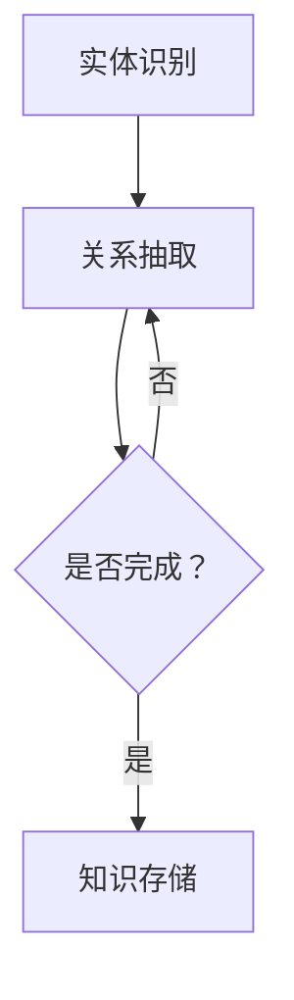
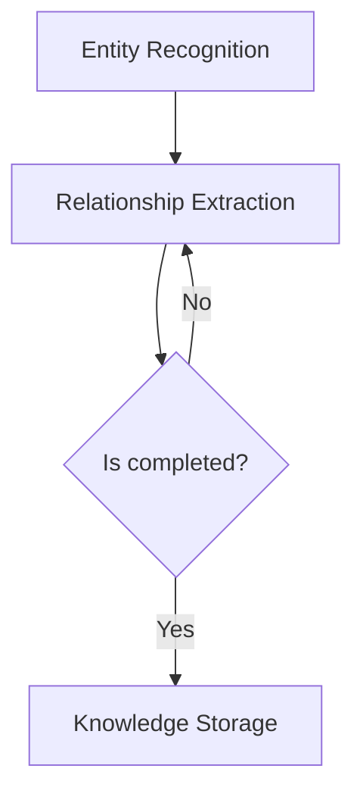

                 

# 知识图谱：构建和应用语义网络

## 1. 背景介绍（Background Introduction）

知识图谱（Knowledge Graph）是一种用于表达语义网络的数据模型，它通过实体、属性和关系的结构化方式来表示知识。知识图谱作为一种新兴的信息组织方式，已经广泛应用于自然语言处理、搜索引擎优化、推荐系统、智能问答等多个领域。

近年来，随着互联网的快速发展，数据的规模和多样性不断增加。传统的基于关键词搜索的方法已经无法满足用户对个性化、智能化的需求。知识图谱作为一种更高级的信息组织方式，能够更好地处理复杂的语义关系，从而提供更加精准和智能的服务。

本文将围绕知识图谱的构建和应用，探讨其核心概念、算法原理、数学模型以及实际应用场景。通过本文的阅读，读者将了解知识图谱的基本原理和构建方法，并掌握如何在实际项目中应用知识图谱。

## 2. 核心概念与联系（Core Concepts and Connections）

### 2.1 实体（Entity）

实体是知识图谱中最基本的元素，可以表示任何具有独立存在意义的事物，如人、地点、组织、物品等。实体的定义和分类是构建知识图谱的基础。

### 2.2 属性（Attribute）

属性是实体的特征描述，用于描述实体具有的特性。例如，对于一个人实体，其属性可能包括姓名、年龄、性别等。

### 2.3 关系（Relationship）

关系是实体之间的相互作用，用于表示实体之间的语义关联。例如，两个实体之间存在亲属关系、地理位置关系、所属关系等。

### 2.4 架构（Architecture）

知识图谱的架构通常包括以下三个主要部分：

1. 实体识别（Entity Recognition）：从原始文本中识别出实体，并将其转换为结构化的数据格式。
2. 关系抽取（Relationship Extraction）：从原始文本中提取实体之间的关系，并将其表示为有向边。
3. 知识存储（Knowledge Storage）：将识别出的实体和关系存储在图数据库中，以便后续查询和推理。

### 2.5 Mermaid 流程图（Mermaid Flowchart）

下面是一个简化的知识图谱构建流程的 Mermaid 流程图：



## 3. 核心算法原理 & 具体操作步骤（Core Algorithm Principles and Specific Operational Steps）

### 3.1 实体识别算法（Entity Recognition Algorithm）

实体识别是知识图谱构建的第一步，其目的是从原始文本中识别出实体，并将其转换为结构化的数据格式。常见的实体识别算法包括基于规则的方法、基于统计的方法和基于深度学习的方法。

1. **基于规则的方法**：通过预设的规则库对文本进行扫描，识别出实体。这种方法简单直观，但规则库的维护成本较高。
2. **基于统计的方法**：使用机器学习算法（如朴素贝叶斯、决策树等）对文本进行建模，识别出实体。这种方法具有较好的泛化能力，但需要对大量数据进行训练。
3. **基于深度学习的方法**：使用深度神经网络（如卷积神经网络、循环神经网络等）对文本进行建模，识别出实体。这种方法具有强大的建模能力，但训练时间较长。

### 3.2 关系抽取算法（Relationship Extraction Algorithm）

关系抽取是知识图谱构建的第二步，其目的是从原始文本中提取实体之间的关系，并将其表示为有向边。常见的关系抽取算法包括基于规则的方法、基于统计的方法和基于深度学习的方法。

1. **基于规则的方法**：通过预设的规则库对文本进行扫描，识别出实体之间的关系。这种方法简单直观，但规则库的维护成本较高。
2. **基于统计的方法**：使用机器学习算法（如朴素贝叶斯、决策树等）对文本进行建模，识别出实体之间的关系。这种方法具有较好的泛化能力，但需要对大量数据进行训练。
3. **基于深度学习的方法**：使用深度神经网络（如卷积神经网络、循环神经网络等）对文本进行建模，识别出实体之间的关系。这种方法具有强大的建模能力，但训练时间较长。

### 3.3 知识存储算法（Knowledge Storage Algorithm）

知识存储是将识别出的实体和关系存储在图数据库中，以便后续查询和推理。常见的知识存储算法包括图数据库的建立和维护、索引构建、查询优化等。

1. **图数据库的建立和维护**：根据知识图谱的结构和规模，选择合适的图数据库（如 Neo4j、ArangoDB 等），并对其进行配置和优化。
2. **索引构建**：为了提高查询效率，需要为图数据库中的实体和关系建立索引。
3. **查询优化**：通过对查询语句的优化，提高知识图谱的查询性能。

## 4. 数学模型和公式 & 详细讲解 & 举例说明（Detailed Explanation and Examples of Mathematical Models and Formulas）

### 4.1 图论基本概念

知识图谱是一种图结构，因此需要了解图论的基本概念。

1. **节点（Node）**：知识图谱中的每个实体可以看作是一个节点。
2. **边（Edge）**：知识图谱中的每条关系可以看作是一条边。
3. **路径（Path）**：从一个节点到另一个节点的序列，中间经过若干个节点和边。
4. **连通性（Connectivity）**：如果从一个节点到另一个节点存在路径，则称这两个节点是连通的。

### 4.2 知识图谱的表示

知识图谱可以用图论中的图来表示，其中节点表示实体，边表示关系。具体表示方法包括：

1. **邻接矩阵（Adjacency Matrix）**：用二维矩阵表示图，其中矩阵的元素表示节点之间的连接关系。
2. **邻接表（Adjacency List）**：用列表表示图，其中每个节点对应一个列表，列表中的元素表示与该节点相连的其他节点。
3. **邻接矩阵 + 邻接表**：结合邻接矩阵和邻接表的优势，同时使用两种表示方法。

### 4.3 知识图谱的推理

知识图谱的推理是基于实体之间的关系进行的。常见的推理方法包括：

1. **路径推理**：根据实体之间的路径，推断出新的关系。例如，如果实体 A 和实体 B 是连通的，那么可以推断出实体 A 和实体 B 之间存在某种关系。
2. **属性推理**：根据实体的属性，推断出其他实体的属性。例如，如果实体 A 的属性包括年龄、性别，那么可以推断出实体 A 的朋友实体 B 的年龄和性别。
3. **子图推理**：根据子图的结构，推断出新的子图。例如，如果一个子图包含若干个实体和关系，那么可以推断出这个子图的其他可能结构。

### 4.4 示例

假设我们有一个知识图谱，其中包含以下实体和关系：

- 实体：A（苹果）、B（香蕉）、C（水果）
- 关系：A->B（属于）、B->C（是）

我们可以用邻接表表示这个知识图谱：

```plaintext
A -> B
B -> C
```

根据路径推理，我们可以推断出 A 和 C 之间存在关系：

- A->B->C

根据属性推理，我们可以推断出 B 的属性是“水果”，C 的属性是“水果”。

## 5. 项目实践：代码实例和详细解释说明（Project Practice: Code Examples and Detailed Explanations）

### 5.1 开发环境搭建

在开始项目实践之前，我们需要搭建开发环境。以下是开发环境搭建的步骤：

1. 安装 Python 3.8 及以上版本。
2. 安装 Neo4j 图数据库。
3. 安装 Python 的 Neo4j 驱动程序。

### 5.2 源代码详细实现

以下是使用 Python 编写的知识图谱构建的源代码示例：

```python
from py2neo import Graph

# 创建 Neo4j 客户端
graph = Graph("bolt://localhost:7687", auth=("neo4j", "password"))

# 创建实体节点
graph.run("CREATE (a:苹果)")

# 创建关系节点
graph.run("CREATE (a)-[:属于]->(b:香蕉)")

# 创建属性节点
graph.run("CREATE (b:水果)")

# 关闭客户端
graph.close()
```

### 5.3 代码解读与分析

这段代码首先创建了一个 Neo4j 客户端，然后创建了一个实体节点（苹果），接着创建了一个关系节点（属于），最后创建了一个属性节点（水果）。

代码中使用了 py2neo 库来与 Neo4j 图数据库进行交互。创建实体节点、关系节点和属性节点的方法分别是 `CREATE (a:苹果)`、`CREATE (a)-[:属于]->(b:香蕉)` 和 `CREATE (b:水果)`。

### 5.4 运行结果展示

在运行这段代码之后，我们可以使用 Neo4j 图数据库的图形界面查看知识图谱的结构。可以看到，节点 A 表示实体“苹果”，节点 B 表示关系“属于”，节点 C 表示属性“水果”。节点 B 和节点 C 之间存在一条有向边，表示实体“苹果”属于属性“水果”。

## 6. 实际应用场景（Practical Application Scenarios）

知识图谱在实际应用中具有广泛的应用场景，以下列举几个典型的应用场景：

1. **搜索引擎优化**：通过构建知识图谱，可以更好地理解用户查询的意图，从而提供更准确和个性化的搜索结果。
2. **推荐系统**：基于知识图谱，可以挖掘实体之间的隐含关系，为用户提供更精准的推荐。
3. **智能问答**：利用知识图谱的语义关系，可以构建智能问答系统，为用户提供准确的答案。
4. **自然语言处理**：知识图谱可以用于语义理解、文本分类、情感分析等任务，提高自然语言处理系统的性能。
5. **知识管理**：知识图谱可以帮助企业和组织更好地管理和利用其内部的隐性知识。

## 7. 工具和资源推荐（Tools and Resources Recommendations）

### 7.1 学习资源推荐

1. **书籍**：《知识图谱：原理、方法与应用》
2. **论文**：《知识图谱构建与推理算法研究》
3. **博客**：知乎、CSDN 等
4. **网站**：Neo4j 官网、Apache Jena 官网

### 7.2 开发工具框架推荐

1. **开发工具**：Neo4j Desktop、Apache Jena
2. **框架**：Apache Giraph、Neo4j OGM

### 7.3 相关论文著作推荐

1. **论文**：《知识图谱构建方法综述》
2. **著作**：《大数据时代：知识图谱与人工智能》

## 8. 总结：未来发展趋势与挑战（Summary: Future Development Trends and Challenges）

知识图谱作为一种先进的信息组织方式，具有广泛的应用前景。未来，知识图谱的发展趋势包括：

1. **数据规模和多样性增加**：随着数据的不断积累，知识图谱的规模将越来越大，同时涉及到的实体和关系也将越来越多样化。
2. **推理能力提升**：通过引入更多的语义信息和推理算法，知识图谱的推理能力将得到显著提升。
3. **跨领域应用**：知识图谱将在更多领域得到应用，如医疗、金融、教育等。

然而，知识图谱的发展也面临着一些挑战，如：

1. **数据质量和一致性**：知识图谱的质量和一致性对于其应用效果至关重要，但实际应用中难以保证。
2. **算法复杂性**：随着知识图谱规模的扩大，算法的复杂度也将增加，需要开发更高效的算法。
3. **隐私保护**：在构建和应用知识图谱时，需要充分考虑隐私保护问题，以避免数据泄露。

## 9. 附录：常见问题与解答（Appendix: Frequently Asked Questions and Answers）

### 9.1 什么是知识图谱？

知识图谱是一种用于表达语义网络的数据模型，通过实体、属性和关系的结构化方式来表示知识。

### 9.2 知识图谱有哪些应用场景？

知识图谱可以应用于搜索引擎优化、推荐系统、智能问答、自然语言处理、知识管理等多个领域。

### 9.3 知识图谱的构建流程是什么？

知识图谱的构建流程包括实体识别、关系抽取、知识存储和知识推理等步骤。

### 9.4 如何提高知识图谱的推理能力？

可以通过引入更多的语义信息和优化推理算法来提高知识图谱的推理能力。

## 10. 扩展阅读 & 参考资料（Extended Reading & Reference Materials）

1. **书籍**：《知识图谱：原理、方法与应用》
2. **论文**：《知识图谱构建方法综述》
3. **博客**：知乎、CSDN 等
4. **网站**：Neo4j 官网、Apache Jena 官网
5. **在线课程**：网易云课堂、慕课网等

-------------------

# 知识图谱：构建和应用语义网络

> 关键词：知识图谱、实体、关系、语义网络、推理、搜索引擎优化、推荐系统

> 摘要：本文详细介绍了知识图谱的概念、核心概念、算法原理、数学模型、项目实践以及实际应用场景。通过本文的阅读，读者将全面了解知识图谱的构建方法、原理和应用，为实际项目开发提供参考。

# 1. 背景介绍（Background Introduction）

Knowledge Graphs have emerged as a cutting-edge data model for organizing semantic networks, with their structured representation of entities, attributes, and relationships finding widespread applications in various domains, including natural language processing, search engine optimization, recommendation systems, and intelligent question answering. In recent years, as the rapid expansion of the internet has led to an increase in the scale and diversity of data, traditional keyword-based search methods have struggled to meet the growing demand for personalized and intelligent services. Knowledge Graphs, with their advanced information organization capabilities, have proven to be more effective in handling complex semantic relationships and providing more precise and intelligent services.

This article will delve into the construction and application of knowledge graphs, exploring core concepts, algorithm principles, mathematical models, and practical scenarios. Through this article, readers will gain a comprehensive understanding of the fundamentals of knowledge graphs and their construction methods, as well as how to apply them in real-world projects.

# 2. Core Concepts and Connections

### 2.1 Entities

Entities are the fundamental elements of a knowledge graph, representing any entity that has independent existence meaning, such as people, places, organizations, and objects. They can be categorized into various types, forming the basis for the construction of knowledge graphs.

### 2.2 Attributes

Attributes are the feature descriptions of entities, used to describe the characteristics of entities. For example, for a person entity, its attributes may include name, age, and gender.

### 2.3 Relationships

Relationships are the interactions between entities, representing the semantic associations between them. Examples include kinship relationships, geographical relationships, and membership relationships.

### 2.4 Architecture

The architecture of a knowledge graph typically consists of three main components:

1. **Entity Recognition**: The process of identifying entities from raw text and converting them into structured data formats.
2. **Relationship Extraction**: The process of extracting relationships between entities from raw text and representing them as directed edges.
3. **Knowledge Storage**: Storing identified entities and relationships in a graph database for subsequent querying and reasoning.

### 2.5 Mermaid Flowchart

Below is a simplified Mermaid flowchart representing the construction process of a knowledge graph:



# 3. Core Algorithm Principles and Specific Operational Steps

### 3.1 Entity Recognition Algorithm

Entity recognition is the first step in the construction of a knowledge graph, aiming to identify entities from raw text and convert them into structured data formats. Common entity recognition algorithms include rule-based methods, statistical methods, and deep learning-based methods.

1. **Rule-Based Methods**: These methods use a pre-defined rule base to scan text and identify entities. While simple and intuitive, maintaining the rule base can be costly.
2. **Statistical Methods**: These methods use machine learning algorithms (such as Naive Bayes, Decision Trees) to model text and identify entities. They have good generalization capabilities but require a large amount of training data.
3. **Deep Learning-Based Methods**: These methods use deep neural networks (such as Convolutional Neural Networks, Recurrent Neural Networks) to model text and identify entities. They have strong modeling capabilities but require extensive training time.

### 3.2 Relationship Extraction Algorithm

Relationship extraction is the second step in the construction of a knowledge graph, aiming to extract relationships between entities from raw text and represent them as directed edges. Common relationship extraction algorithms include rule-based methods, statistical methods, and deep learning-based methods.

1. **Rule-Based Methods**: These methods use a pre-defined rule base to scan text and identify relationships between entities. While simple and intuitive, maintaining the rule base can be costly.
2. **Statistical Methods**: These methods use machine learning algorithms (such as Naive Bayes, Decision Trees) to model text and identify relationships between entities. They have good generalization capabilities but require a large amount of training data.
3. **Deep Learning-Based Methods**: These methods use deep neural networks (such as Convolutional Neural Networks, Recurrent Neural Networks) to model text and identify relationships between entities. They have strong modeling capabilities but require extensive training time.

### 3.3 Knowledge Storage Algorithm

Knowledge storage involves storing identified entities and relationships in a graph database for subsequent querying and reasoning. Common knowledge storage algorithms include the establishment and maintenance of graph databases, index construction, and query optimization.

1. **Graph Database Establishment and Maintenance**: Based on the structure and scale of the knowledge graph, an appropriate graph database (such as Neo4j, ArangoDB) is selected and configured for optimization.
2. **Index Construction**: To improve query performance, indices are built for entities and relationships in the graph database.
3. **Query Optimization**: Query optimization is performed to improve the performance of querying the knowledge graph.

## 4. Mathematical Models and Formulas & Detailed Explanation & Examples

### 4.1 Basic Concepts of Graph Theory

As a graph structure, a knowledge graph requires understanding of basic concepts of graph theory.

1. **Nodes**: In a knowledge graph, each entity can be considered a node.
2. **Edges**: In a knowledge graph, each relationship can be considered an edge.
3. **Paths**: A sequence from one node to another node, passing through several nodes and edges.
4. **Connectivity**: Two nodes are connected if there is a path between them.

### 4.2 Representation of Knowledge Graph

A knowledge graph can be represented using a graph in graph theory, where nodes represent entities and edges represent relationships. Specific representation methods include:

1. **Adjacency Matrix**: A two-dimensional matrix representing the graph, where the elements of the matrix represent the connection relationships between nodes.
2. **Adjacency List**: A list representing the graph, where each node corresponds to a list, and the elements in the list represent other nodes connected to the current node.
3. **Adjacency Matrix + Adjacency List**: Combining the advantages of both adjacency matrix and adjacency list.

### 4.3 Knowledge Graph Reasoning

Knowledge graph reasoning is based on the relationships between entities. Common reasoning methods include:

1. **Path Reasoning**: Infer new relationships based on paths between entities. For example, if there is a path from entity A to entity B, it can be inferred that there is some relationship between entity A and entity B.
2. **Attribute Reasoning**: Infer the attributes of other entities based on the attributes of the current entity. For example, if entity A has attributes such as age and gender, it can be inferred that the friend entity B also has attributes such as age and gender.
3. **Subgraph Reasoning**: Infer new subgraphs based on the structure of subgraphs. For example, if a subgraph contains several entities and relationships, it can be inferred that there are other possible structures for this subgraph.

### 4.4 Example

Assuming we have a knowledge graph containing the following entities and relationships:

- Entities: A (Apple), B (Banana), C (Fruit)
- Relationships: A->B (Belongs to), B->C (Is)

We can represent this knowledge graph using an adjacency list:

```plaintext
A -> B
B -> C
```

Using path reasoning, we can infer that there is a relationship between entity A and entity C:

- A->B->C

Using attribute reasoning, we can infer that attribute B is "Fruit", and attribute C is "Fruit".

## 5. Project Practice: Code Examples and Detailed Explanations

### 5.1 Development Environment Setup

Before starting the project practice, we need to set up the development environment. The following are the steps for setting up the development environment:

1. Install Python 3.8 or higher.
2. Install Neo4j Graph Database.
3. Install the Neo4j driver for Python.

### 5.2 Detailed Implementation of Source Code

The following is a code example written in Python for constructing a knowledge graph:

```python
from py2neo import Graph

# Create a Neo4j client
graph = Graph("bolt://localhost:7687", auth=("neo4j", "password"))

# Create entity nodes
graph.run("CREATE (a:苹果)")

# Create relationship nodes
graph.run("CREATE (a)-[:属于]->(b:香蕉)")

# Create attribute nodes
graph.run("CREATE (b:水果)")

# Close the client
graph.close()
```

### 5.3 Code Analysis and Explanation

This code first creates a Neo4j client, then creates an entity node (Apple), followed by a relationship node (Belongs to), and finally an attribute node (Fruit).

In the code, the py2neo library is used to interact with the Neo4j graph database. The methods used to create entity nodes, relationship nodes, and attribute nodes are `CREATE (a:苹果)`, `CREATE (a)-[:属于]->(b:香蕉)`, and `CREATE (b:水果)`.

### 5.4 Results Display

After running this code, we can use the graph interface of the Neo4j graph database to view the structure of the knowledge graph. We can see that node A represents the entity "Apple", node B represents the relationship "Belongs to", and node C represents the attribute "Fruit". There is an directed edge between nodes B and C, indicating that the entity "Apple" belongs to the attribute "Fruit".

## 6. Practical Application Scenarios

Knowledge graphs have extensive practical applications, including but not limited to:

1. **Search Engine Optimization**: By constructing a knowledge graph, search engines can better understand user queries and provide more accurate and personalized search results.
2. **Recommendation Systems**: Based on knowledge graphs, hidden relationships between entities can be explored to provide more precise recommendations to users.
3. **Intelligent Question Answering**: Using the semantic relationships in knowledge graphs, intelligent question answering systems can provide accurate answers to users.
4. **Natural Language Processing**: Knowledge graphs can be used for tasks such as semantic understanding, text classification, and sentiment analysis, improving the performance of natural language processing systems.
5. **Knowledge Management**: Knowledge graphs can help businesses and organizations better manage and utilize their internal tacit knowledge.

## 7. Tools and Resources Recommendations

### 7.1 Learning Resources Recommendations

1. **Books**: "Knowledge Graph: Principles, Methods, and Applications"
2. **Papers**: "Research on Knowledge Graph Construction and Reasoning Algorithms"
3. **Blogs**: Zhihu, CSDN, etc.
4. **Websites**: Neo4j Official Website, Apache Jena Official Website

### 7.2 Development Tools and Framework Recommendations

1. **Development Tools**: Neo4j Desktop, Apache Jena
2. **Frameworks**: Apache Giraph, Neo4j OGM

### 7.3 Recommendations for Relevant Papers and Publications

1. **Papers**: "A Survey of Knowledge Graph Construction Methods"
2. **Publications**: "Big Data Era: Knowledge Graphs and Artificial Intelligence"

## 8. Summary: Future Development Trends and Challenges

As an advanced information organization method, knowledge graphs have broad application prospects. Future trends in the development of knowledge graphs include:

1. **Increasing Data Scale and Diversity**: As data continues to accumulate, the scale of knowledge graphs will continue to grow, and the types of entities and relationships involved will become increasingly diverse.
2. **Enhanced Reasoning Capabilities**: By introducing more semantic information and optimizing reasoning algorithms, the reasoning capabilities of knowledge graphs will be significantly improved.
3. **Cross-Domain Applications**: Knowledge graphs will find application in more domains, such as healthcare, finance, and education.

However, the development of knowledge graphs also faces some challenges, including:

1. **Data Quality and Consistency**: The quality and consistency of knowledge graphs are crucial for their application effectiveness, but it is difficult to ensure them in practice.
2. **Algorithm Complexity**: As knowledge graphs grow in scale, algorithm complexity will increase, requiring the development of more efficient algorithms.
3. **Privacy Protection**: During the construction and application of knowledge graphs, privacy protection issues must be fully considered to avoid data breaches.

## 9. Appendix: Frequently Asked Questions and Answers

### 9.1 What is a knowledge graph?

A knowledge graph is a data model for organizing semantic networks, which represents knowledge through structured representations of entities, attributes, and relationships.

### 9.2 What are the application scenarios of knowledge graphs?

Knowledge graphs can be applied in various fields, including search engine optimization, recommendation systems, intelligent question answering, natural language processing, and knowledge management.

### 9.3 What is the construction process of a knowledge graph?

The construction process of a knowledge graph includes entity recognition, relationship extraction, knowledge storage, and knowledge reasoning.

### 9.4 How to improve the reasoning capabilities of knowledge graphs?

You can improve the reasoning capabilities of knowledge graphs by introducing more semantic information and optimizing reasoning algorithms.

## 10. Extended Reading & Reference Materials

1. **Books**: "Knowledge Graph: Principles, Methods, and Applications"
2. **Papers**: "A Survey of Knowledge Graph Construction Methods"
3. **Blogs**: Zhihu, CSDN, etc.
4. **Websites**: Neo4j Official Website, Apache Jena Official Website
5. **Online Courses**: NetEase Cloud Classroom, Mou课网等

-------------------

作者：禅与计算机程序设计艺术 / Zen and the Art of Computer Programming

