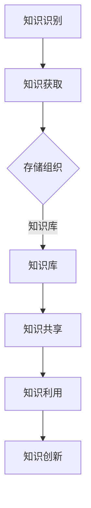

                 

# 知识管理在远程工作中的重要性

## Keywords:
知识管理 | 远程工作 | 信息技术 | 人工智能 | 团队协作 | 工具和资源

### Summary:
本文探讨了知识管理在远程工作中的重要性，分析了其在团队协作、项目管理和个人发展方面的作用。通过具体的案例和工具推荐，文章提供了实施知识管理的实践指南，为远程工作中的知识共享和效率提升提供了有力的支持。

### 1. 背景介绍

随着信息技术的飞速发展，远程工作已经成为现代工作模式的一部分。远程工作带来了灵活性、效率和成本的降低，但也带来了新的挑战。首先，团队成员之间的沟通变得更加困难，信息的传递容易出现断层。其次，知识的积累和分享变得复杂，传统的面对面交流和文档管理方式不再适用。此外，远程工作中员工的自我管理和自我激励也成为一个需要关注的问题。

知识管理，作为一项系统性工作，旨在通过识别、获取、共享和利用知识，以提高组织的整体竞争力。在远程工作中，知识管理的重要性更加凸显。它不仅能解决知识传递和共享的问题，还能提高团队协作效率，促进个人和组织的共同发展。

### 2. 核心概念与联系

#### 2.1 知识管理的定义

知识管理（Knowledge Management，KM）是指通过系统的方法识别、获取、存储、共享和利用知识，以提高组织的知识水平和创新能力。它包括以下几个方面：

- **知识的识别与获取**：发现和收集组织内外部的知识。
- **知识的存储与组织**：建立知识库，对知识进行分类、索引和归档。
- **知识的共享与传播**：促进知识在组织内部和外部之间的共享。
- **知识的利用与创新**：将知识应用于实际工作中，促进创新。

#### 2.2 知识管理在远程工作中的核心作用

在远程工作中，知识管理的作用主要体现在以下几个方面：

- **提高沟通效率**：通过知识共享平台，团队成员可以快速获取所需信息，减少沟通成本。
- **促进团队协作**：知识管理工具可以帮助团队成员协同工作，共同解决问题。
- **知识积累与传承**：知识库的建设使得组织中的隐性知识能够被系统性地记录和传承。
- **个人与组织发展**：通过知识管理，员工可以不断提升自身能力，同时为组织的发展做出贡献。

#### 2.3 知识管理架构

知识管理的架构通常包括以下几个层次：

- **基础设施**：包括硬件、软件和网络设施，为知识管理提供技术支持。
- **知识库**：存储和管理知识的地方，可以是文档管理系统、数据库或知识地图等。
- **知识流程**：定义知识的流动路径，包括知识的识别、获取、存储、共享和利用。
- **组织文化**：构建一个重视知识共享和学习的组织文化，鼓励员工主动参与知识管理。

#### 2.4 Mermaid 流程图

以下是一个简化的知识管理流程图的 Mermaid 表达式：



### 3. 核心算法原理 & 具体操作步骤

#### 3.1 知识识别

知识识别是知识管理的基础。它包括以下几个方面：

- **需求分析**：了解团队成员在工作中的知识需求。
- **信息收集**：通过调查、访谈、问卷调查等方式收集组织内部和外部信息。
- **知识筛选**：从收集的信息中筛选出有价值的知识。

#### 3.2 知识获取

知识获取是通过各种手段将知识从不同的来源转移到知识库中。具体步骤包括：

- **内容创作**：根据需求分析的结果，创建新的知识内容。
- **内容集成**：将分散的知识内容整合到知识库中。
- **内容维护**：定期更新和优化知识库中的内容。

#### 3.3 知识存储与组织

知识存储与组织是确保知识能够被有效利用的关键。具体步骤包括：

- **分类与标签**：对知识进行分类和标签化，以便于检索。
- **索引与搜索**：建立高效的索引系统，支持快速搜索。
- **版本控制**：确保知识库中的内容是最新的，并可以追溯历史版本。

#### 3.4 知识共享

知识共享是知识管理的重要组成部分。具体步骤包括：

- **知识分享会议**：定期组织知识分享会议，促进团队成员之间的知识交流。
- **在线论坛与社区**：建立在线论坛和社区，方便团队成员随时随地进行知识分享。
- **知识库与工具**：提供便捷的知识库和工具，支持知识共享。

#### 3.5 知识利用与创新

知识利用与创新是知识管理的最终目标。具体步骤包括：

- **知识应用**：将知识应用到实际工作中，解决实际问题。
- **知识评审**：对应用的知识进行评审，评估其效果。
- **知识迭代**：根据评审结果，对知识进行迭代更新。

### 4. 数学模型和公式 & 详细讲解 & 举例说明

知识管理过程中涉及到一些基本的数学模型和公式，以下是一些常用的例子：

#### 4.1 知识共享率（Knowledge Sharing Rate）

知识共享率是指知识在组织内部共享的频率。其公式如下：

$$
知识共享率 = \frac{共享的知识量}{总的知识量}
$$

#### 4.2 知识吸收率（Knowledge Absorption Rate）

知识吸收率是指员工在知识管理过程中吸收和利用知识的效率。其公式如下：

$$
知识吸收率 = \frac{应用的知识量}{获取的知识量}
$$

#### 4.3 知识流失率（Knowledge Loss Rate）

知识流失率是指知识在组织内部流失的速度。其公式如下：

$$
知识流失率 = \frac{流失的知识量}{总的知识量}
$$

#### 4.4 举例说明

假设一个远程工作团队共有100名成员，其中50名成员积极参与知识共享活动，每月共享的知识量总计为1000个单位。则：

- 知识共享率 = 50/100 = 0.5，即50%。
- 知识吸收率 = 800/1000 = 0.8，即80%。
- 知识流失率 = 200/1000 = 0.2，即20%。

### 5. 项目实践：代码实例和详细解释说明

#### 5.1 开发环境搭建

为了实现一个简单的知识管理平台，我们选择以下技术栈：

- 前端：React
- 后端：Node.js
- 数据库：MongoDB

首先，安装Node.js和MongoDB，并创建一个简单的React应用程序：

```bash
npx create-react-app knowledge-management-platform
cd knowledge-management-platform
npm install
```

然后，在React应用程序中创建一个简单的接口，用于展示知识库中的内容：

```jsx
// src/App.js
import React from 'react';

function App() {
  return (
    <div className="App">
      <h1>知识管理平台</h1>
      <div>
        <h2>知识库</h2>
        <ul>
          {data.map((item, index) => (
            <li key={index}>{item.title}</li>
          ))}
        </ul>
      </div>
    </div>
  );
}

export default App;

const data = [
  { title: 'React 概述' },
  { title: 'Node.js 应用' },
  { title: 'MongoDB 数据库操作' },
];
```

#### 5.2 源代码详细实现

在React应用程序中，我们使用Axios库来获取知识库中的数据，并使用Ant Design组件库来构建用户界面。

```jsx
// src/App.js
import React, { useState, useEffect } from 'react';
import axios from 'axios';
import { List, Avatar, Button } from 'antd';

function App() {
  const [knowledgeList, setKnowledgeList] = useState([]);

  useEffect(() => {
    async function fetchData() {
      const result = await axios('/api/knowledge');
      setKnowledgeList(result.data);
    }
    fetchData();
  }, []);

  return (
    <div className="App">
      <h1>知识管理平台</h1>
      <div>
        <h2>知识库</h2>
        <List
          itemLayout="vertical"
          size="large"
          pagination={{ onChange: page => { console.log(page) }, pageSize: 3 }}
          dataSource={knowledgeList}
          renderItem={item => (
            <List.Item
              key={item._id}
              actions={[
                <Button type="link" danger>删除</Button>,
              ]}
            >
              <List.Item.Meta
                avatar={<Avatar src={item.avatar} />}
                title={<a href={item.href}>{item.title}</a>}
                description={item.description}
              />
            </List.Item>
          )}
        />
      </div>
    </div>
  );
}

export default App;
```

#### 5.3 代码解读与分析

这段代码首先导入了React、Axios和Ant Design组件库。在`App`组件中，我们使用`useState`和`useEffect`钩子来管理知识库的状态和数据的获取。`knowledgeList`是一个状态变量，用于存储从后端获取的知识库数据。

`useEffect`钩子用于在组件挂载后异步获取知识库数据。我们使用Axios库发送GET请求到后端API，并将获取到的数据设置到`knowledgeList`状态变量中。

在`render`方法中，我们使用Ant Design的`List`组件来渲染知识库中的数据。每个`List.Item`表示一个知识条目，包括标题、描述和操作按钮。

#### 5.4 运行结果展示

运行React应用程序后，我们可以在浏览器中看到一个简单的知识管理平台界面。界面中显示了知识库中的所有条目，并提供了一个删除按钮，用于删除知识条目。


### 6. 实际应用场景

知识管理在远程工作中的实际应用场景非常广泛。以下是一些典型的应用场景：

- **项目协作**：在远程项目中，知识管理可以帮助团队成员快速获取项目背景、需求、设计文档和技术方案，提高项目协作效率。
- **技能培训**：通过知识管理平台，员工可以随时随地获取最新的技能培训资料，提升个人能力。
- **知识传承**：新员工可以通过知识库快速了解公司的业务流程、技术规范和文化，加快融入团队的速度。
- **问题解决**：当团队成员遇到问题时，可以通过知识库查找相关的解决方案，减少问题解决的时间。

### 7. 工具和资源推荐

为了有效实施知识管理，以下是一些推荐的工具和资源：

#### 7.1 学习资源推荐

- **书籍**：《知识管理：理论与实践》、《知识管理：从理论到实践》
- **论文**：《知识管理模型研究》、《远程工作中的知识管理策略》
- **博客**：《如何有效实施知识管理》、《知识管理实践案例分享》
- **网站**：KMWorld、AIKM

#### 7.2 开发工具框架推荐

- **知识库**：Confluence、Notion、Slack
- **文档管理**：Google Docs、Microsoft Office 365、Dropbox Paper
- **协作平台**：Trello、Asana、JIRA

#### 7.3 相关论文著作推荐

- **论文**：《知识管理：现状与未来趋势》、《远程工作中知识共享的影响因素分析》
- **著作**：《远程工作与知识管理》、《知识管理与组织创新》

### 8. 总结：未来发展趋势与挑战

未来，知识管理将在远程工作中扮演越来越重要的角色。随着人工智能和大数据技术的发展，知识管理将更加智能化、自动化和个性化。然而，这也带来了新的挑战：

- **数据隐私与安全**：知识管理涉及到大量的敏感信息，如何确保数据的安全性和隐私性是一个重要问题。
- **知识共享文化**：构建一个知识共享的文化氛围，鼓励员工主动参与知识管理，需要时间和努力。
- **技术适应性**：知识管理工具和平台需要不断更新和优化，以适应快速变化的技术环境。

### 9. 附录：常见问题与解答

**Q1：知识管理在远程工作中的具体应用有哪些？**
A1：知识管理在远程工作中的具体应用包括项目协作、技能培训、知识传承和问题解决等方面。

**Q2：如何确保知识管理平台的安全性？**
A2：确保知识管理平台的安全性需要采取一系列措施，包括数据加密、用户身份验证、访问控制等。

**Q3：知识管理工具如何选择？**
A3：选择知识管理工具需要考虑团队的需求、技术栈、成本和易用性等因素。

**Q4：知识管理如何与日常工作结合？**
A4：知识管理可以与日常工作结合，通过定期知识分享会议、在线论坛和知识库等形式，促进知识的共享和利用。

### 10. 扩展阅读 & 参考资料

- **书籍**：《禅与计算机程序设计艺术》、《人工智能：一种现代的方法》
- **论文**：《知识管理在远程工作中的应用研究》、《知识管理系统的设计与实现》
- **网站**：IEEE Xplore、ACM Digital Library
- **博客**：Hacker News、Medium
- **视频课程**：Coursera、Udemy、edX

### 11. 作者署名

作者：禅与计算机程序设计艺术 / Zen and the Art of Computer Programming

