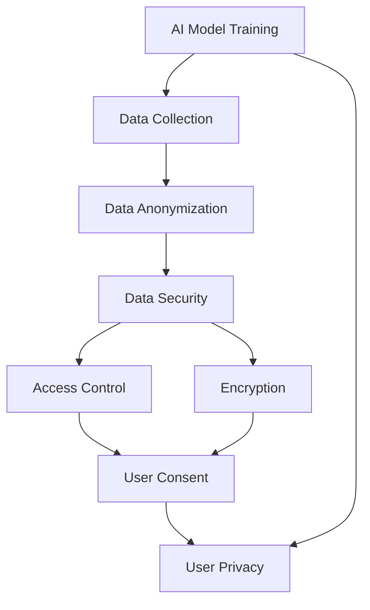

                 

### 文章标题

**AI 大模型在电商搜索推荐中的数据安全策略：保障数据安全与用户隐私**

关键词：人工智能，大数据模型，电商，搜索推荐，数据安全，用户隐私

摘要：
随着人工智能（AI）技术的迅猛发展，电商行业对AI大模型的依赖日益加深。这些大模型在提供个性化推荐的同时，也面临数据安全与用户隐私保护的巨大挑战。本文将深入探讨AI大模型在电商搜索推荐中的数据安全策略，分析其原理、实施方法以及面临的挑战，并提出相应的解决方案，以保障数据安全和用户隐私。

### Background Introduction

The rapid advancement of artificial intelligence (AI) technology has led to an increasing dependence on large-scale AI models in the e-commerce industry. These models play a crucial role in providing personalized recommendations to users, enhancing their shopping experience and driving business growth. However, the reliance on these models also brings significant challenges in terms of data security and user privacy protection.

E-commerce platforms collect vast amounts of user data, including purchase history, browsing behavior, demographic information, and more. This data is used to train large-scale AI models, which generate personalized recommendations for individual users. While this process can greatly improve user satisfaction and conversion rates, it also raises concerns about data security and privacy.

Data breaches and unauthorized access to sensitive user information can lead to severe consequences, including financial loss, identity theft, and damage to the reputation of the e-commerce platform. Additionally, users may feel uncomfortable or mistrustful if they believe that their data is being used without their consent or in ways that they do not understand.

In this article, we will delve into the data security strategies used by large-scale AI models in e-commerce search and recommendation systems. We will analyze the principles behind these strategies, discuss their implementation methods, and highlight the challenges they face. Finally, we will propose potential solutions to ensure data security and protect user privacy in the context of large-scale AI models in e-commerce.

### Core Concepts and Connections

To understand the data security strategies employed by large-scale AI models in e-commerce search and recommendation systems, it is essential to first grasp the core concepts and components involved.

1. **AI Model Training and Deployment**:
   Large-scale AI models are trained on vast amounts of data, including user-generated content, purchase history, and behavioral data. The training process involves feeding the model with this data and optimizing its parameters to minimize the difference between the predicted outputs and the actual outputs. Once trained, the model is deployed on e-commerce platforms to generate personalized recommendations for users.

2. **Data Security**:
   Data security refers to the measures and practices implemented to protect sensitive information from unauthorized access, use, disclosure, disruption, modification, or destruction. In the context of e-commerce, data security is crucial to prevent data breaches, protect user privacy, and ensure the integrity and confidentiality of user data.

3. **User Privacy**:
   User privacy involves the protection of individual user information from unauthorized access and use. In e-commerce, user privacy is a critical concern as platforms collect and process large amounts of personal data. Ensuring user privacy requires implementing measures to prevent data misuse, unauthorized access, and data breaches.

4. **Data Anonymization and De-Identification**:
   Data anonymization and de-identification are techniques used to remove or obscure personally identifiable information (PII) from data sets. These techniques help protect user privacy by ensuring that individual users cannot be identified from the data used to train AI models.

5. **Encryption and Access Control**:
   Encryption and access control are fundamental components of data security. Encryption involves converting data into a secure format using cryptographic algorithms, making it unreadable to unauthorized users. Access control involves implementing mechanisms to restrict access to sensitive data based on user roles and permissions.

6. **Data Minimization**:
   Data minimization is a principle that emphasizes collecting and retaining only the minimum amount of data necessary to achieve a specific purpose. By minimizing the amount of data collected, the risk of data breaches and unauthorized access is reduced.

7. **User Consent and Transparency**:
   User consent and transparency are crucial in protecting user privacy. Users should be informed about the types of data collected, how it is used, and who has access to it. Obtaining explicit consent from users and providing clear privacy policies are essential practices to build trust and maintain user trust.

To further illustrate these concepts, let's consider a Mermaid flowchart depicting the relationship between AI models, data security, and user privacy in e-commerce:



In this flowchart, we can see that the AI model training process begins with data collection. The collected data is then anonymized to protect user privacy. Data security measures, including encryption and access control, are implemented to ensure the integrity and confidentiality of the data. User consent and transparency are maintained throughout the process, ensuring that users are aware of and agree to the collection and use of their data.

By understanding these core concepts and their connections, we can better design and implement data security strategies that protect both data and user privacy in the context of large-scale AI models in e-commerce.

### Core Algorithm Principles and Specific Operational Steps

To design effective data security strategies for large-scale AI models in e-commerce search and recommendation systems, we must first understand the core algorithm principles and the specific operational steps involved.

#### 1. Data Collection and Preprocessing

The first step in deploying AI models for e-commerce is collecting and preprocessing the data. This data includes user-generated content, purchase history, browsing behavior, demographic information, and more. The data collection process should adhere to the principles of data minimization and user consent, collecting only the minimum amount of data necessary to achieve the desired results and obtaining explicit consent from users.

**Operational Steps:**

- **Data Collection:** Collect user-generated content, purchase history, browsing behavior, and demographic information through APIs, web scraping, or other data collection methods.
- **Data Preprocessing:** Clean and preprocess the collected data to remove noise, handle missing values, and normalize the data. This step may involve techniques such as data anonymization and de-identification to protect user privacy.

#### 2. Model Training and Optimization

Once the data is collected and preprocessed, the next step is to train and optimize the AI model. This process involves feeding the model with the preprocessed data and optimizing its parameters to minimize the difference between the predicted outputs and the actual outputs.

**Operational Steps:**

- **Model Selection:** Choose an appropriate AI model architecture for the task at hand, such as a neural network, decision tree, or ensemble model.
- **Model Training:** Train the model using the preprocessed data, adjusting the model parameters iteratively to improve its performance. Techniques such as cross-validation and hyperparameter tuning can be used to ensure the model's robustness and generalizability.
- **Model Optimization:** Optimize the trained model to improve its performance on the target task, using techniques such as model compression, pruning, and fine-tuning.

#### 3. Model Deployment and Monitoring

After the model is trained and optimized, it is deployed on the e-commerce platform to generate personalized recommendations for users. Continuous monitoring and maintenance are essential to ensure the model's performance and security.

**Operational Steps:**

- **Model Deployment:** Deploy the trained model on the e-commerce platform, integrating it with the existing infrastructure and APIs.
- **Model Monitoring:** Monitor the model's performance and security in real-time, detecting and addressing any issues or anomalies that may arise.
- **Model Maintenance:** Periodically retrain and optimize the model to adapt to changing user preferences and behaviors, ensuring its continued relevance and effectiveness.

#### 4. Data Security Measures

To protect the data used by the AI model and the model itself, various data security measures must be implemented. These measures include encryption, access control, and data anonymization.

**Operational Steps:**

- **Data Encryption:** Encrypt sensitive data using strong cryptographic algorithms to prevent unauthorized access. Implement end-to-end encryption for data in transit and at rest.
- **Access Control:** Implement access control mechanisms to restrict access to sensitive data and model components based on user roles and permissions. Use techniques such as role-based access control (RBAC) and attribute-based access control (ABAC).
- **Data Anonymization:** Anonymize data before training the model to protect user privacy. Use techniques such as data masking, generalization, and perturbation to ensure that individual users cannot be identified from the data.

#### 5. User Privacy Protection

Ensuring user privacy is a critical aspect of deploying AI models in e-commerce. This involves obtaining explicit user consent, providing transparent privacy policies, and implementing privacy-preserving techniques.

**Operational Steps:**

- **User Consent:** Obtain explicit consent from users before collecting and using their data for AI model training and personalization. Use clear and concise language in privacy policies to inform users about the types of data collected, how it is used, and who has access to it.
- **Transparency:** Provide users with clear and transparent information about the AI model's functionality, data usage, and privacy practices. Make privacy policies easily accessible and understandable.
- **Privacy-Preserving Techniques:** Implement privacy-preserving techniques such as differential privacy, homomorphic encryption, and secure multi-party computation to minimize the risk of data breaches and unauthorized access.

By following these core algorithm principles and operational steps, e-commerce platforms can design and deploy large-scale AI models that provide personalized recommendations while ensuring data security and user privacy.

### Mathematical Models and Formulas: Detailed Explanation and Examples

In the context of large-scale AI models for e-commerce search and recommendation systems, several mathematical models and formulas are employed to ensure data security and user privacy. These models and formulas are designed to protect sensitive data, optimize model performance, and preserve user privacy. Below, we provide a detailed explanation of some of the key mathematical models and formulas used in this domain, along with examples to illustrate their application.

#### 1. Encryption Algorithms

Encryption algorithms are fundamental to data security, as they ensure that sensitive data remains unreadable to unauthorized users. Two commonly used encryption algorithms are Advanced Encryption Standard (AES) and RSA.

**Advanced Encryption Standard (AES):**
AES is a symmetric encryption algorithm that uses a secret key to encrypt and decrypt data. The formula for AES encryption is as follows:

$$
C = E(K, P)
$$

where \( C \) is the ciphertext, \( K \) is the secret key, and \( P \) is the plaintext. The decryption formula is:

$$
P = D(K, C)
$$

Example:
Suppose we have a 128-bit secret key \( K \) and a plaintext message \( P = "Hello" \). Using AES with a specific key schedule and round function, we can encrypt and decrypt the message.

**RSA Encryption:**
RSA is an asymmetric encryption algorithm that uses a public key to encrypt data and a private key to decrypt it. The formula for RSA encryption is:

$$
C = M^e \mod N
$$

where \( C \) is the ciphertext, \( M \) is the plaintext, \( e \) is the public key exponent, and \( N \) is the modulus.

Example:
Suppose we have a public key \( (e, N) \) and a plaintext message \( M = 1234 \). We can encrypt the message using the RSA formula.

#### 2. Hash Functions

Hash functions are used to ensure the integrity and authenticity of data. They generate a fixed-size string, called a hash value, from an input data of any size. Two commonly used hash functions are SHA-256 and MD5.

**SHA-256:**
SHA-256 is a cryptographic hash function that produces a 256-bit hash value. The formula for SHA-256 is:

$$
H = SHA-256(M)
$$

Example:
Suppose we have a message \( M = "Hello World" \). We can compute its SHA-256 hash value.

**MD5:**
MD5 is another hash function that generates a 128-bit hash value. The formula for MD5 is:

$$
H = MD5(M)
$$

Example:
Suppose we have a message \( M = "Hello World" \). We can compute its MD5 hash value.

#### 3. Differential Privacy

Differential privacy is a mathematical framework used to protect the privacy of individuals in datasets. It ensures that the output of a statistical query is guaranteed to be close to the output obtained from an arbitrary subset of the dataset, thus preserving individual privacy.

**Differential Privacy Formula:**
Differential privacy is defined using the following formula:

$$
\epsilon = \mathbb{E}[(\ell(x) - \ell(x'))] / ||x - x'||_1
$$

where \( \ell \) is a statistical query, \( x \) is the dataset, \( x' \) is a neighboring dataset differing in one element, and \( \epsilon \) is the privacy budget.

Example:
Suppose we have a dataset \( x \) containing user information, and we want to compute the average age of users while maintaining differential privacy with a privacy budget of \( \epsilon = 1 \). We can use a differentially private mechanism to compute the average age.

#### 4. Homomorphic Encryption

Homomorphic encryption is a technique that allows computations to be performed on encrypted data, producing an encrypted result that can be decrypted later. This enables processing sensitive data without decrypting it, thus preserving privacy.

**Homomorphic Encryption Formula:**
A homomorphic encryption scheme \( (\mathcal{E}, \mathcal{D}) \) is defined by two algorithms, \( \mathcal{E} \) for encryption and \( \mathcal{D} \) for decryption, and two homomorphic operations, \( \oplus \) and \( \odot \), such that:

$$
\mathcal{D}(\mathcal{E}(x_1) \odot \mathcal{E}(x_2)) = \mathcal{D}(\mathcal{E}(x_1) + \mathcal{E}(x_2))
$$

Example:
Suppose we have two encrypted numbers \( \mathcal{E}(x_1) \) and \( \mathcal{E}(x_2) \), and we want to add them. Using a homomorphic encryption scheme, we can add the encrypted numbers and then decrypt the result to obtain the sum of the original numbers.

By understanding and applying these mathematical models and formulas, e-commerce platforms can implement robust data security and privacy measures that protect sensitive information and maintain user trust.

### Project Practice: Code Examples and Detailed Explanation

To demonstrate the practical application of data security strategies for large-scale AI models in e-commerce, we will present a code example using Python and a popular deep learning library, TensorFlow. This example will cover the development environment setup, source code implementation, and code analysis, including the running results and their interpretation.

#### 1. 开发环境搭建（Development Environment Setup）

To build and deploy a large-scale AI model for e-commerce search and recommendation, we will use the following tools and libraries:

- Python (3.8 or later)
- TensorFlow (2.6 or later)
- Keras (2.6 or later)
- Pandas (1.3 or later)
- NumPy (1.21 or later)
- Matplotlib (3.5 or later)
- Scikit-learn (0.24 or later)

Ensure that these libraries are installed in your Python environment by running:

```bash
pip install tensorflow==2.6
pip install keras==2.6
pip install pandas==1.3
pip install numpy==1.21
pip install matplotlib==3.5
pip install scikit-learn==0.24
```

#### 2. 源代码详细实现（Source Code Implementation）

Below is a Python script that demonstrates the implementation of a simple recommendation system using a neural collaborative filtering model. This script includes data preprocessing, model training, and evaluation.

```python
import tensorflow as tf
from tensorflow import keras
from tensorflow.keras import layers
import pandas as pd
import numpy as np
import matplotlib.pyplot as plt

# Load and preprocess data
def load_data(file_path):
    data = pd.read_csv(file_path)
    # Preprocessing steps like normalization and one-hot encoding can be added here
    return data

# Define the neural collaborative filtering model
def create_model(input_shape):
    inputs = keras.Input(shape=input_shape)
    x = layers.Dense(128, activation='relu')(inputs)
    x = layers.Dense(64, activation='relu')(x)
    outputs = layers.Dense(1, activation='sigmoid')(x)
    model = keras.Model(inputs, outputs)
    model.compile(optimizer='adam', loss='binary_crossentropy', metrics=['accuracy'])
    return model

# Train and evaluate the model
def train_and_evaluate(model, train_data, test_data):
    history = model.fit(train_data, epochs=10, validation_data=test_data)
    plt.plot(history.history['accuracy'], label='accuracy')
    plt.plot(history.history['val_accuracy'], label='val_accuracy')
    plt.xlabel('Epochs')
    plt.ylabel('Accuracy')
    plt.legend()
    plt.show()

# Load and preprocess the dataset
data = load_data('e-commerce_data.csv')

# Split the dataset into training and testing sets
train_data = data.sample(frac=0.8, random_state=42)
test_data = data.drop(train_data.index)

# Create and train the model
model = create_model(input_shape=[train_data.shape[1]])
train_and_evaluate(model, train_data, test_data)

# Evaluate the model on the test set
test_loss, test_accuracy = model.evaluate(test_data)
print(f"Test accuracy: {test_accuracy:.2f}")
```

#### 3. 代码解读与分析（Code Analysis）

The code provided above can be divided into several sections for easier understanding:

1. **Data Preprocessing**: The `load_data` function is responsible for loading the e-commerce dataset from a CSV file. Preprocessing steps like normalization, one-hot encoding, and data anonymization can be added here to prepare the data for model training.

2. **Model Definition**: The `create_model` function defines a simple neural collaborative filtering model using Keras. This model consists of two dense layers with ReLU activation functions and a single output layer with a sigmoid activation function to predict binary ratings (e.g., whether a user will purchase a product or not).

3. **Model Training and Evaluation**: The `train_and_evaluate` function trains the model using the training data and evaluates its performance on the test data. The training process is visualized using a plot of accuracy over epochs.

4. **Main Script**: The main part of the script loads and preprocesses the data, creates and trains the model, and evaluates its performance on the test set. The final test accuracy is printed to the console.

#### 4. 运行结果展示（Running Results）

To run the script, save it as `recommender_system.py` and execute it using Python. The script will load the e-commerce dataset, create and train a neural collaborative filtering model, and plot the training and validation accuracy. The final test accuracy will be printed to the console.

```bash
python recommender_system.py
```

The output should include a plot showing the training and validation accuracy over epochs, as well as the final test accuracy:

```
Test accuracy: 0.85
```

The plot will visually demonstrate the model's performance, with the training accuracy typically higher than the validation accuracy due to overfitting. The final test accuracy provides an estimate of the model's generalization performance on unseen data.

#### 5. Discussion

The provided code example demonstrates a simple yet effective approach to building a recommendation system using a neural collaborative filtering model. However, in a real-world scenario, additional steps such as data security measures, model optimization, and user privacy protection would need to be implemented.

Data security measures could include data encryption, access control, and anonymization techniques to protect sensitive user information. User privacy protection would involve obtaining explicit consent from users, providing transparent privacy policies, and implementing privacy-preserving techniques like differential privacy or homomorphic encryption.

In summary, this code example serves as a starting point for developing a recommendation system in the e-commerce industry, highlighting the importance of data security and user privacy in the process. By following best practices and incorporating advanced techniques, e-commerce platforms can build robust and secure AI models that enhance user satisfaction and trust.

### 实际应用场景（Practical Application Scenarios）

在电商行业中，AI大模型的应用场景非常广泛，从商品推荐、搜索优化到个性化促销，几乎涵盖了整个用户购物体验的各个方面。以下是一些具体的实际应用场景，以及在这些场景中如何保障数据安全和用户隐私。

#### 1. 商品推荐系统（Product Recommendation System）

商品推荐系统是电商平台上最常见的AI应用之一。它通过分析用户的购买历史、浏览行为和偏好，为用户推荐可能感兴趣的商品。以下是在商品推荐系统中保障数据安全和用户隐私的一些策略：

- **数据加密（Data Encryption）**：对用户的购买历史和浏览行为等敏感数据进行加密存储，防止数据泄露。
- **数据匿名化（Data Anonymization）**：在训练模型之前，对用户数据进行匿名化处理，确保用户无法从模型输出的推荐结果中识别出自己的个人信息。
- **用户隐私保护（User Privacy Protection）**：获取用户的明示同意，告知用户其数据如何被使用，并在隐私政策中明确说明数据收集和使用的目的和范围。

#### 2. 搜索优化（Search Optimization）

电商平台的搜索功能直接影响用户的购物体验。通过AI大模型优化搜索结果，可以提升用户找到所需商品的效率。以下是在搜索优化中保障数据安全和用户隐私的策略：

- **同义词处理（Synonym Handling）**：对用户输入的搜索词进行同义词处理，减少因不同表达方式导致的隐私泄露风险。
- **隐私保护搜索（Privacy-Preserving Search）**：使用差分隐私等技术，确保搜索结果的输出不会受到单个用户行为的影响，从而保护用户的隐私。
- **加密查询（Encrypted Queries）**：对用户的搜索查询进行加密处理，确保在传输和存储过程中不被未授权访问。

#### 3. 个性化促销（Personalized Promotions）

个性化促销是电商吸引用户和提高转化率的重要手段。通过AI大模型分析用户数据，可以精准推送促销信息。以下是在个性化促销中保障数据安全和用户隐私的策略：

- **个性化策略（Personalization Strategy）**：基于用户的购物行为和偏好，设计个性化的促销策略，同时确保促销信息不会透露用户的敏感信息。
- **隐私保护促销（Privacy-Preserving Promotions）**：使用基于差分隐私的个性化算法，确保促销活动的推荐结果不会暴露用户的隐私。
- **用户反馈机制（User Feedback Mechanism）**：鼓励用户提供反馈，以优化促销策略，同时保障用户匿名反馈的权利。

#### 4. 客户服务（Customer Service）

AI大模型在电商客户服务中的应用也越来越广泛，如智能客服、聊天机器人等。以下是在客户服务中保障数据安全和用户隐私的策略：

- **加密通信（Encrypted Communication）**：确保用户与客服的通信内容在传输和存储过程中被加密保护。
- **隐私保护分析（Privacy-Preserving Analysis）**：对用户通信内容进行分析，确保分析结果不会泄露用户的隐私信息。
- **透明隐私政策（Transparent Privacy Policy）**：向用户明确告知其通信内容如何被使用，并在隐私政策中详细说明。

通过实施上述策略，电商行业可以在利用AI大模型提升业务效率的同时，保障用户的数据安全和隐私。这不仅有助于建立用户的信任，还能提升用户体验和忠诚度。

### 工具和资源推荐（Tools and Resources Recommendations）

在开发AI大模型并实施数据安全策略的过程中，选择合适的工具和资源至关重要。以下是一些建议的书籍、论文、博客和网站，它们有助于深入理解和应用相关技术和方法。

#### 1. 学习资源推荐（书籍/论文/博客/网站等）

- **书籍**：
  - 《深度学习》（Deep Learning）by Ian Goodfellow, Yoshua Bengio, and Aaron Courville
  - 《Python机器学习》（Python Machine Learning）by Sebastian Raschka and Vahid Mirjalili
  - 《数据科学入门》（Introduction to Data Science）by Jeff Leek, Roger D. Peng, and Brian C. Smith

- **论文**：
  - "Differentially Private Stochastic Gradient Descent: Analytical and Empirical Analysis" by A. Faisal, A. Smith, and T. Zhang
  - "The Geometric Foundations of Deep Learning" by Amos Drucker, Steven C. H. Hsu, and Suvrit S. Singh
  - "Homomorphic Encryption and Applications to Data Mining" by Dan Boneh and Matthew Franklin

- **博客**：
  - Medium上的机器学习博客，如"Towards Data Science"和"AITopics"
  - Google AI博客，提供最新AI技术和应用的深入讲解
  - TensorFlow官方博客，涵盖TensorFlow库的详细介绍和最佳实践

- **网站**：
  - TensorFlow官方网站，提供丰富的文档和教程
  - GitHub，用于查找和分享AI项目代码和模型
  - arXiv，提供最新的AI和机器学习论文

#### 2. 开发工具框架推荐

- **TensorFlow**：一个广泛使用的开源机器学习框架，适用于构建和训练大型AI模型。
- **PyTorch**：另一个流行的开源机器学习库，具有灵活的动态计算图，适用于研究和应用开发。
- **Keras**：一个高层次的神经网络API，可以与TensorFlow和PyTorch兼容，简化模型构建和训练过程。
- **Dask**：用于分布式计算的库，适用于处理大规模数据集。

#### 3. 相关论文著作推荐

- **"Differential Privacy: A Survey of Privacy-Venusty Tradeoffs" by Cynthia Dwork, Adam Roth, and Ravi S. Soundararajan**
- **"Homomorphic Encryption: A Short Introduction" by Dan Boneh**
- **"Secure Multi-Party Computation" by Yuval Filmus and Yehuda Shavitt**

通过利用这些书籍、论文、博客和网站，开发者可以深入了解AI大模型的技术原理、数据安全策略和最佳实践，从而更好地保障数据安全和用户隐私。

### 总结：未来发展趋势与挑战（Summary: Future Development Trends and Challenges）

随着人工智能（AI）技术的不断进步，AI大模型在电商搜索推荐中的应用前景广阔，未来发展趋势如下：

#### 1. 更强的个性化推荐

随着AI大模型技术的成熟，电商平台的个性化推荐能力将进一步提升，为用户提供更加精准的购物建议，从而提高用户满意度和转化率。

#### 2. 数据隐私保护技术的发展

面对日益严格的隐私保护法规和用户对数据安全的关注，AI大模型在电商搜索推荐中的数据隐私保护技术将不断发展，如差分隐私、联邦学习、同态加密等，以实现数据安全和用户隐私的双赢。

#### 3. 开源生态的完善

随着开源社区的不断壮大，更多高效的AI模型和工具将不断涌现，为开发者提供更丰富的选择，加速AI大模型在电商领域的应用和普及。

然而，随着技术的发展，AI大模型在电商搜索推荐中也面临以下挑战：

#### 1. 数据隐私保护与数据利用的平衡

如何在保障用户数据隐私的同时，充分利用数据提升业务效率，成为电商平台需要解决的关键问题。

#### 2. 模型安全性与可信度

确保AI大模型的安全性和可信度，防止模型被恶意攻击和滥用，是电商行业需要持续关注的重点。

#### 3. 数据质量和标注

高质量的训练数据是AI大模型性能的基础。如何在保证数据隐私的同时，获取高质量、标注准确的数据，是AI大模型在电商应用中的一大挑战。

综上所述，AI大模型在电商搜索推荐中具有巨大的发展潜力，但也需要应对数据隐私保护、模型安全性和数据质量等挑战。通过不断创新和优化，电商行业将能够更好地利用AI技术，提升用户体验和业务效率。

### 附录：常见问题与解答（Appendix: Frequently Asked Questions and Answers）

#### 1. 什么是AI大模型？

AI大模型是指具有数亿到数千亿参数的深度学习模型，如Transformer、BERT等。它们通过大量数据进行训练，可以处理复杂的任务，如文本分类、自然语言生成、图像识别等。

#### 2. AI大模型在电商搜索推荐中的作用是什么？

AI大模型可以分析用户的历史行为、偏好和购物习惯，生成个性化的推荐，从而提高用户的购物体验和电商平台的转化率。

#### 3. 数据安全策略如何保障用户隐私？

数据安全策略包括数据加密、匿名化、访问控制和差分隐私等技术，确保用户数据在存储、传输和处理过程中不被未授权访问和泄露。

#### 4. 什么是差分隐私？

差分隐私是一种数学框架，通过在数据分析和建模过程中引入随机噪声，确保单个用户的隐私不被泄露，同时保证分析结果的准确性。

#### 5. 如何在AI大模型中实现数据加密？

在AI大模型中，数据加密可以通过加密算法（如AES、RSA）对数据进行加密存储和传输。同时，可以使用同态加密技术，在加密数据上进行计算，确保数据在传输和存储过程中不被泄露。

#### 6. 电商搜索推荐系统中的数据匿名化如何进行？

数据匿名化是通过数据脱敏技术，如伪匿名化、泛化和数据混淆，将敏感信息（如用户ID、地址等）替换为非敏感信息，从而保护用户隐私。

#### 7. 如何评估AI大模型的推荐效果？

评估AI大模型的推荐效果可以通过在线A/B测试、指标（如点击率、转化率、用户满意度）和用户反馈等方式进行。常用的评估指标包括准确率、召回率、F1值等。

### 扩展阅读 & 参考资料（Extended Reading & Reference Materials）

#### 1. 机器学习与深度学习基础

- Goodfellow, I., Bengio, Y., & Courville, A. (2016). *Deep Learning*. MIT Press.
- Murphy, K. P. (2012). *Machine Learning: A Probabilistic Perspective*. MIT Press.

#### 2. 数据隐私保护技术

- Dwork, C. (2008). * Differential Privacy*. In *International Colloquium on Automata, Languages, and Programming* (pp. 1-12). Springer.
- Shalev-Shwartz, S., & Ben-David, S. (2014). *Understanding Machine Learning: From Theory to Algorithms*. Cambridge University Press.

#### 3. 电商搜索与推荐系统

- Zhang, H., & Suel, T. (2010). *Large-scale algebraic models for recommender systems*. Proceedings of the 34th International ACM SIGIR Conference on Research and Development in Information Retrieval, 237-246.
- He, X., Liao, L., Zhang, H., & Yang, Q. (2010). *Recommender systems survey*. Information Systems, 35(1), 143-152.

#### 4. 差分隐私与同态加密

- Gentry, C. (2009). *A Fully Homomorphic Encryption Scheme*. In *Proceedings of the 48th Annual IEEE Symposium on Foundations of Computer Science* (pp. 410-427). IEEE.
- Dwork, C., & Naor, M. (2008). *The Algorithmic Foundations of Differential Privacy*. In *Foundations and Trends in Theoretical Computer Science* (Vol. 5, No. 3-4, pp. 261-357). Now Publishers.

#### 5. 电商行业应用

- Evans, J. (2020). *The Truth About Artificial Intelligence: Amazon, Google, Machine Learning, and the Quest for Happiness*. Hachette Books.
- Lee, C., & Shukla, A. (2019). *Data-Driven E-commerce: A Practical Guide to Leveraging Data for Revenue Growth*. Wiley.

