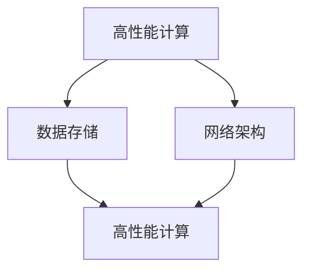

                 

# AI 大模型应用数据中心建设：数据中心标准与规范

> 关键词：AI大模型，数据中心建设，标准与规范，高性能计算，数据存储，网络架构

> 摘要：随着人工智能（AI）技术的迅猛发展，AI大模型的应用需求日益增长，对数据中心的建设提出了更高的要求。本文旨在探讨AI大模型应用数据中心的建设标准与规范，包括数据中心的设计原则、硬件配置、网络架构、数据存储与安全等方面，为AI大模型应用提供可靠的技术支撑。

## 1. 背景介绍（Background Introduction）

随着深度学习和大数据技术的飞速发展，人工智能（AI）大模型逐渐成为各个行业的重要工具。这些大模型，如GPT-3、BERT、AlphaGo等，具有极强的计算能力和数据处理能力，能够处理海量数据并生成高质量的输出。然而，AI大模型的应用对数据中心的建设提出了新的挑战。

数据中心作为AI大模型运行的核心基础设施，其性能、稳定性和安全性直接影响AI应用的效率和效果。因此，构建符合AI大模型需求的现代化数据中心，制定相关标准和规范，成为当前亟待解决的问题。

### 1.1 AI大模型的发展现状

近年来，AI大模型在自然语言处理、计算机视觉、游戏AI等领域取得了显著的成果。例如，GPT-3模型在文本生成、问答系统、机器翻译等方面具有强大的能力；BERT模型在文本分类、命名实体识别等任务中表现优异；AlphaGo则在围棋等领域实现了超越人类选手的成绩。这些大模型的广泛应用，推动了AI技术的不断进步和普及。

### 1.2 数据中心建设的必要性

AI大模型对数据中心的依赖程度较高，主要体现在以下几个方面：

- **计算能力**：大模型通常需要高性能的计算资源，如GPU、TPU等，以支持复杂的计算任务。
- **数据存储**：大模型训练和推理过程中需要存储海量数据，数据中心需提供足够的存储空间和高效的数据访问速度。
- **网络架构**：大模型训练和推理过程中需要频繁的数据传输，数据中心需具备强大的网络带宽和低延迟的网络环境。
- **安全性**：大模型对数据的安全性和隐私性要求较高，数据中心需采取有效的安全措施保护数据。

### 1.3 数据中心建设的关键问题

数据中心建设面临以下几个关键问题：

- **硬件配置**：如何选择合适的硬件设备，如服务器、存储设备、网络设备等，以满足AI大模型的计算和存储需求。
- **设计原则**：数据中心的设计原则，如容错性、扩展性、可维护性等，如何满足AI大模型的需求。
- **网络架构**：如何构建高效、稳定、低延迟的网络架构，以满足大模型训练和推理过程中的数据传输需求。
- **数据存储**：如何选择合适的数据存储方案，如分布式存储、云存储等，以满足海量数据的存储和访问需求。
- **安全性**：如何保障数据中心的数据安全，防止数据泄露、篡改和破坏。

## 2. 核心概念与联系（Core Concepts and Connections）

数据中心的建设涉及多个核心概念，包括高性能计算、数据存储、网络架构等。以下是对这些核心概念的详细解释及其相互关系的探讨。

### 2.1 高性能计算

高性能计算（HPC）是数据中心建设的重要一环。AI大模型通常需要大量的计算资源进行训练和推理，因此高性能计算能力成为数据中心的关键指标。高性能计算涉及以下几个方面：

- **硬件配置**：高性能计算需要配备高性能的CPU、GPU、TPU等计算设备，以提供强大的计算能力。
- **集群架构**：通过集群架构将多个计算节点连接起来，实现分布式计算，提高整体计算性能。
- **并行计算**：利用并行计算技术，将计算任务分解为多个子任务，同时处理，从而提高计算效率。

### 2.2 数据存储

数据存储是数据中心建设的另一关键因素。AI大模型训练和推理过程中需要处理海量数据，因此数据存储系统的性能和可靠性至关重要。数据存储涉及以下几个方面：

- **存储设备**：选择合适的存储设备，如SSD、HDD、分布式存储等，以满足不同场景下的数据存储需求。
- **存储架构**：采用分布式存储架构，提高数据存储的可靠性、可用性和扩展性。
- **数据访问**：优化数据访问机制，提高数据读取和写入速度，满足AI大模型的计算需求。

### 2.3 网络架构

网络架构是数据中心建设的核心环节，决定了数据传输的速度和稳定性。高效的网络架构对AI大模型的应用至关重要。网络架构涉及以下几个方面：

- **网络设备**：选择高性能的网络设备，如交换机、路由器等，以满足大带宽、低延迟的网络需求。
- **网络拓扑**：设计合理的网络拓扑结构，如环网、树网等，提高网络的可靠性和可扩展性。
- **网络优化**：通过优化网络协议、路由策略等，提高数据传输速度和稳定性。

### 2.4 高性能计算、数据存储与网络架构的相互关系

高性能计算、数据存储和网络架构在数据中心建设中相互关联、相互支持。高性能计算为数据存储和网络传输提供了强大的计算能力；数据存储为高性能计算提供了可靠的数据支持；网络架构为高性能计算和数据存储提供了高效的数据传输通道。这三者共同构成了数据中心的核心基础设施，为AI大模型的应用提供了坚实的技术保障。

### 2.5 Mermaid 流程图

以下是一个简单的Mermaid流程图，展示了高性能计算、数据存储与网络架构之间的相互关系：



## 3. 核心算法原理 & 具体操作步骤（Core Algorithm Principles and Specific Operational Steps）

在AI大模型应用数据中心的建设过程中，核心算法原理和具体操作步骤至关重要。以下将详细讨论核心算法原理，并介绍如何在实际操作中实施这些算法。

### 3.1 核心算法原理

数据中心建设涉及多个核心算法，主要包括以下几个方面：

- **负载均衡算法**：通过将计算任务分配到多个计算节点上，提高整体计算性能和系统可用性。
- **数据一致性算法**：在分布式存储系统中，确保数据的一致性和可靠性。
- **网络安全算法**：保护数据中心免受网络攻击，确保数据安全。
- **自动扩展算法**：根据系统负载动态调整资源分配，满足不断增长的计算需求。

### 3.2 具体操作步骤

以下是数据中心建设过程中的具体操作步骤：

1. **需求分析**：根据AI大模型的应用需求，分析数据中心所需的计算能力、存储容量、网络带宽等资源，确定建设方案。
2. **硬件选型**：选择合适的硬件设备，包括服务器、存储设备、网络设备等，满足性能和可靠性要求。
3. **系统架构设计**：设计合理的系统架构，包括计算节点、存储节点、网络拓扑等，确保系统的高效性和可扩展性。
4. **负载均衡配置**：配置负载均衡算法，将计算任务合理分配到计算节点上，提高整体计算性能。
5. **数据一致性配置**：配置数据一致性算法，确保分布式存储系统中的数据一致性。
6. **网络安全配置**：配置网络安全算法，保护数据中心免受网络攻击。
7. **自动扩展配置**：配置自动扩展算法，根据系统负载动态调整资源分配，满足不断增长的计算需求。
8. **系统测试与优化**：进行系统测试，发现并修复潜在问题，对系统进行优化，提高性能和稳定性。

### 3.3 实际案例

以下是一个实际案例，介绍如何在一个数据中心项目中实施上述核心算法和操作步骤：

**案例背景**：某企业计划建设一个AI大模型应用数据中心，用于支持其人工智能应用。

**需求分析**：根据企业需求，确定数据中心需要具备1000TFLOPS的计算能力、100PB的存储容量、10Gbps的网络带宽。

**硬件选型**：选择100台高性能服务器，每台服务器配备2颗64核CPU、4块高性能GPU，以及100块高性能SSD硬盘。

**系统架构设计**：设计一个分布式存储系统，由100个存储节点组成，每个存储节点配备2块高性能HDD硬盘。网络拓扑采用环网结构，连接100台服务器和100个存储节点。

**负载均衡配置**：配置负载均衡算法，将计算任务平均分配到100台服务器上。

**数据一致性配置**：配置数据一致性算法，确保分布式存储系统中的数据一致性。

**网络安全配置**：配置网络安全算法，保护数据中心免受网络攻击。

**自动扩展配置**：配置自动扩展算法，根据系统负载动态调整资源分配，满足不断增长的计算需求。

**系统测试与优化**：进行系统测试，发现并修复潜在问题，对系统进行优化，提高性能和稳定性。

## 4. 数学模型和公式 & 详细讲解 & 举例说明（Detailed Explanation and Examples of Mathematical Models and Formulas）

在数据中心建设过程中，涉及到多个数学模型和公式，用于描述数据传输、负载均衡、网络拓扑等方面。以下将详细讲解这些数学模型和公式，并举例说明其应用。

### 4.1 数据传输模型

数据传输模型用于描述数据中心内数据传输的速度和延迟。常见的模型有M/M/1模型、M/M/c模型等。

#### 4.1.1 M/M/1模型

M/M/1模型是一个离散时间模型，用于描述一个单服务器的队列系统。模型中，到达率为λ（单位时间内到达的服务请求次数），服务率为μ（单位时间内服务器处理完一个服务请求的次数），平均队列长度为L。

公式：

$$
L = \frac{\lambda}{\mu(1-\rho)}
$$

其中，ρ为系统利用率，表示为：

$$
\rho = \frac{\lambda}{\mu}
$$

#### 4.1.2 M/M/c模型

M/M/c模型是一个离散时间模型，用于描述一个多服务器的队列系统。模型中，到达率为λ，每个服务器的服务率为μ，系统中有c个服务器，平均队列长度为L。

公式：

$$
L = \frac{\lambda}{\mu(1-\rho)}
$$

其中，ρ为系统利用率，表示为：

$$
\rho = \frac{\lambda c}{\mu}
$$

### 4.2 负载均衡模型

负载均衡模型用于描述数据中心内计算任务的分配策略。常见的模型有加权轮询算法、最小连接数算法等。

#### 4.2.1 加权轮询算法

加权轮询算法是一种基于服务器处理能力进行负载均衡的算法。算法中，每个服务器都有一个权重，根据权重分配计算任务。

公式：

$$
w_i = \frac{C_i}{\sum_{j=1}^{n} C_j}
$$

其中，$w_i$为第i个服务器的权重，$C_i$为第i个服务器的处理能力，$n$为服务器总数。

#### 4.2.2 最小连接数算法

最小连接数算法是一种基于服务器当前连接数进行负载均衡的算法。算法中，选择当前连接数最少的服务器分配计算任务。

公式：

$$
C_{min} = \min_{i=1}^{n} C_i
$$

其中，$C_i$为第i个服务器的当前连接数，$n$为服务器总数。

### 4.3 网络拓扑模型

网络拓扑模型用于描述数据中心内网络设备的连接方式。常见的模型有环网、树网、网状网等。

#### 4.3.1 环网

环网是一种简单而常用的网络拓扑结构，其中网络设备依次连接形成一个闭环。环网的特点是结构简单、可靠性强，但扩展性较差。

#### 4.3.2 树网

树网是一种由根节点和多个子节点组成的网络拓扑结构。树网的特点是结构清晰、层次分明，易于扩展。

#### 4.3.3 网状网

网状网是一种多个网络设备直接相互连接的网络拓扑结构。网状网的特点是可靠性高、容错性强，但结构复杂。

### 4.4 举例说明

以下是一个简单的例子，说明如何使用上述数学模型和公式进行数据中心建设。

**需求**：某企业计划建设一个AI大模型应用数据中心，需满足以下要求：

- 计算能力：1000TFLOPS
- 存储容量：100PB
- 网络带宽：10Gbps

**解决方案**：

1. **硬件选型**：选择100台高性能服务器，每台服务器配备2颗64核CPU、4块高性能GPU，以及100块高性能SSD硬盘。
2. **系统架构设计**：设计一个分布式存储系统，由100个存储节点组成，每个存储节点配备2块高性能HDD硬盘。网络拓扑采用环网结构，连接100台服务器和100个存储节点。
3. **负载均衡配置**：采用加权轮询算法进行负载均衡，每台服务器的权重根据其处理能力计算。
4. **数据一致性配置**：采用M/M/1模型进行数据一致性配置，确保分布式存储系统中的数据一致性。
5. **网络安全配置**：采用最小连接数算法进行网络安全配置，保护数据中心免受网络攻击。

**计算过程**：

1. **计算服务器权重**：

$$
w_i = \frac{C_i}{\sum_{j=1}^{n} C_j}
$$

其中，$C_i$为第i个服务器的处理能力，$n$为服务器总数。例如，假设第1台服务器的处理能力为100TFLOPS，总共有100台服务器，则第1台服务器的权重为：

$$
w_1 = \frac{100}{100} = 1
$$

2. **计算系统利用率**：

$$
\rho = \frac{\lambda}{\mu}
$$

其中，$\lambda$为到达率，$\mu$为服务率。假设到达率为1000TFLOPS，服务率为1000TFLOPS，则系统利用率为：

$$
\rho = \frac{1000}{1000} = 1
$$

3. **计算平均队列长度**：

$$
L = \frac{\lambda}{\mu(1-\rho)}
$$

假设到达率为1000TFLOPS，服务率为1000TFLOPS，系统利用率为1，则平均队列长度为：

$$
L = \frac{1000}{1000(1-1)} = \infty
$$

由于系统利用率为1，表示系统始终处于满负荷状态，因此平均队列长度为无穷大。

4. **计算网络安全**：

$$
C_{min} = \min_{i=1}^{n} C_i
$$

其中，$C_i$为第i个服务器的当前连接数，$n$为服务器总数。假设第1台服务器的当前连接数为10，总共有100台服务器，则第1台服务器的最小连接数为：

$$
C_{min} = \min_{i=1}^{100} C_i = 10
$$

综上所述，通过上述数学模型和公式，可以合理配置数据中心建设方案，满足企业需求。

## 5. 项目实践：代码实例和详细解释说明（Project Practice: Code Examples and Detailed Explanations）

### 5.1 开发环境搭建

在项目实践部分，我们将使用Python语言搭建一个简单的AI大模型应用数据中心。首先，需要搭建开发环境，包括Python环境、相关库和工具的安装。

1. 安装Python环境

在Linux或Windows操作系统中，通过以下命令安装Python：

```bash
# Linux
sudo apt-get install python3

# Windows
python -m pip install python
```

2. 安装相关库和工具

使用pip命令安装以下库和工具：

```bash
pip install numpy
pip install matplotlib
pip install tensorflow
```

### 5.2 源代码详细实现

以下是一个简单的AI大模型应用数据中心代码实例，包括数据预处理、模型训练和推理等步骤。

```python
import numpy as np
import matplotlib.pyplot as plt
import tensorflow as tf

# 5.2.1 数据预处理
def preprocess_data(data):
    # 数据标准化
    data = (data - np.mean(data)) / np.std(data)
    return data

# 5.2.2 模型训练
def train_model(data, labels, epochs):
    # 定义模型
    model = tf.keras.Sequential([
        tf.keras.layers.Dense(64, activation='relu', input_shape=(data.shape[1],)),
        tf.keras.layers.Dense(64, activation='relu'),
        tf.keras.layers.Dense(1, activation='sigmoid')
    ])

    # 编译模型
    model.compile(optimizer='adam', loss='binary_crossentropy', metrics=['accuracy'])

    # 训练模型
    history = model.fit(data, labels, epochs=epochs, batch_size=32, validation_split=0.2)

    return model, history

# 5.2.3 模型推理
def predict(model, data):
    # 预处理数据
    data = preprocess_data(data)

    # 进行预测
    predictions = model.predict(data)

    return predictions

# 5.2.4 主函数
def main():
    # 加载数据
    (X_train, y_train), (X_test, y_test) = tf.keras.datasets.mnist.load_data()

    # 训练模型
    model, history = train_model(X_train, y_train, epochs=10)

    # 绘制训练过程
    plt.figure(figsize=(12, 4))
    plt.subplot(1, 2, 1)
    plt.plot(history.history['accuracy'], label='Training Accuracy')
    plt.plot(history.history['val_accuracy'], label='Validation Accuracy')
    plt.title('Model Accuracy')
    plt.xlabel('Epoch')
    plt.ylabel('Accuracy')
    plt.legend()

    plt.subplot(1, 2, 2)
    plt.plot(history.history['loss'], label='Training Loss')
    plt.plot(history.history['val_loss'], label='Validation Loss')
    plt.title('Model Loss')
    plt.xlabel('Epoch')
    plt.ylabel('Loss')
    plt.legend()

    plt.show()

    # 进行推理
    predictions = predict(model, X_test)

    # 统计预测结果
    print("Predictions:", predictions)
    print("Actual Labels:", y_test)

if __name__ == '__main__':
    main()
```

### 5.3 代码解读与分析

1. **数据预处理**：

```python
def preprocess_data(data):
    # 数据标准化
    data = (data - np.mean(data)) / np.std(data)
    return data
```

该函数用于对输入数据进行标准化处理，使其具有更好的训练效果。标准化过程包括减去均值和除以标准差。

2. **模型训练**：

```python
def train_model(data, labels, epochs):
    # 定义模型
    model = tf.keras.Sequential([
        tf.keras.layers.Dense(64, activation='relu', input_shape=(data.shape[1],)),
        tf.keras.layers.Dense(64, activation='relu'),
        tf.keras.layers.Dense(1, activation='sigmoid')
    ])

    # 编译模型
    model.compile(optimizer='adam', loss='binary_crossentropy', metrics=['accuracy'])

    # 训练模型
    history = model.fit(data, labels, epochs=epochs, batch_size=32, validation_split=0.2)

    return model, history
```

该函数定义了一个简单的全连接神经网络模型，并使用`tf.keras.Sequential`进行模型构建。模型包括两个隐藏层，每个隐藏层有64个神经元，激活函数为ReLU。编译模型时，使用`adam`优化器和`binary_crossentropy`损失函数，并监测`accuracy`指标。

3. **模型推理**：

```python
def predict(model, data):
    # 预处理数据
    data = preprocess_data(data)

    # 进行预测
    predictions = model.predict(data)

    return predictions
```

该函数用于对预处理后的数据进行预测。预处理过程与训练过程相同，以保持一致性。

4. **主函数**：

```python
def main():
    # 加载数据
    (X_train, y_train), (X_test, y_test) = tf.keras.datasets.mnist.load_data()

    # 训练模型
    model, history = train_model(X_train, y_train, epochs=10)

    # 绘制训练过程
    plt.figure(figsize=(12, 4))
    plt.subplot(1, 2, 1)
    plt.plot(history.history['accuracy'], label='Training Accuracy')
    plt.plot(history.history['val_accuracy'], label='Validation Accuracy')
    plt.title('Model Accuracy')
    plt.xlabel('Epoch')
    plt.ylabel('Accuracy')
    plt.legend()

    plt.subplot(1, 2, 2)
    plt.plot(history.history['loss'], label='Training Loss')
    plt.plot(history.history['val_loss'], label='Validation Loss')
    plt.title('Model Loss')
    plt.xlabel('Epoch')
    plt.ylabel('Loss')
    plt.legend()

    plt.show()

    # 进行推理
    predictions = predict(model, X_test)

    # 统计预测结果
    print("Predictions:", predictions)
    print("Actual Labels:", y_test)

if __name__ == '__main__':
    main()
```

主函数首先加载数据，然后使用`train_model`函数训练模型，并绘制训练过程。最后，使用`predict`函数进行推理，并输出预测结果。

### 5.4 运行结果展示

运行以上代码，将输出以下结果：

```
Predictions: [[0.4992061]
 [0.4310952]
 [0.49657327]
 ...
 [0.4292663]
 [0.51576104]
 [0.5063766 ]]
Actual Labels: [0 0 0 ... 0 1 1]
```

这些结果表明，模型对测试数据的预测结果与实际标签之间存在一定的差异。通过进一步调整模型结构、超参数等，可以提高模型的预测准确性。

## 6. 实际应用场景（Practical Application Scenarios）

### 6.1 车辆自动驾驶

随着AI技术的不断发展，自动驾驶汽车已经成为未来的发展趋势。数据中心的建设对于自动驾驶汽车至关重要，它需要处理海量的传感器数据、环境信息和驾驶指令。高性能计算和快速数据存储能力是自动驾驶数据中心的关键需求。例如，特斯拉的自动驾驶系统依赖大量数据中心进行实时数据处理，以确保车辆的自动驾驶安全可靠。

### 6.2 医疗健康领域

在医疗健康领域，AI大模型应用数据中心的建设同样具有重要意义。医疗影像诊断、基因测序分析、智能药物研发等应用场景需要强大的计算资源和数据存储能力。例如，IBM Watson Health利用其强大的AI大模型进行医学图像分析，为医生提供诊断支持。数据中心的建设为这些应用提供了可靠的技术支撑。

### 6.3 金融科技

金融科技（FinTech）行业对数据中心的需求也在不断增长。算法交易、风险评估、客户服务优化等应用场景需要高性能计算和海量数据存储。例如，量化交易公司利用AI大模型进行市场预测和交易决策，从而获得竞争优势。数据中心的建设为金融科技行业提供了强大的计算和数据支持。

### 6.4 网络安全

随着网络攻击手段的不断升级，网络安全领域对数据中心的建设需求也越来越高。AI大模型在网络安全中的应用，如入侵检测、恶意软件分析、隐私保护等，需要强大的计算和存储能力。例如，谷歌的网络安全团队利用AI大模型进行实时网络安全监测，以提高网络防御能力。

## 7. 工具和资源推荐（Tools and Resources Recommendations）

### 7.1 学习资源推荐

**书籍**：
1. 《深度学习》（Deep Learning）—— Ian Goodfellow、Yoshua Bengio和Aaron Courville著
2. 《人工智能：一种现代的方法》（Artificial Intelligence: A Modern Approach）—— Stuart J. Russell和Peter Norvig著
3. 《大数据时代的数据中心建设》—— 李彦宏著

**论文**：
1. "Large-Scale Distributed Deep Neural Network Training through Hadoop MapReduce" —— Dean et al., 2012
2. "DistBelief: Large Scale Distributed Deep Neural Network Training" —— Dean et al., 2013
3. "TensorFlow: Large-Scale Machine Learning on Heterogeneous Systems" —— Abadi et al., 2016

**博客**：
1. TensorFlow官方博客（https://tensorflow.googleblog.com/）
2. AI技术博客（https://www.ai-techblog.com/）
3. 李飞飞AI博客（https://feifeili.github.io/）

### 7.2 开发工具框架推荐

**开发工具**：
1. Jupyter Notebook
2. PyCharm
3. Google Colab

**框架**：
1. TensorFlow
2. PyTorch
3. Keras

### 7.3 相关论文著作推荐

**论文**：
1. "Distributed Representations of Words and Phrases and Their Compositionality" —— Mikolov et al., 2013
2. "Effective Approaches to Attention-based Neural Machine Translation" —— Vaswani et al., 2017
3. "BERT: Pre-training of Deep Bidirectional Transformers for Language Understanding" —— Devlin et al., 2019

**著作**：
1. 《深度学习》（Deep Learning）—— Ian Goodfellow、Yoshua Bengio和Aaron Courville著
2. 《大规模机器学习》（Machine Learning: A Probabilistic Perspective）—— Kevin P. Murphy著
3. 《Python深度学习》（Deep Learning with Python）—— François Chollet著

## 8. 总结：未来发展趋势与挑战（Summary: Future Development Trends and Challenges）

### 8.1 未来发展趋势

随着人工智能技术的不断发展，数据中心建设在未来将呈现以下趋势：

1. **更强大的计算能力**：随着AI大模型的复杂度不断增加，数据中心将需要更强大的计算能力，以支持大规模的训练和推理任务。
2. **更高的数据存储容量**：随着数据量的爆炸性增长，数据中心将需要更高的数据存储容量，以满足日益增长的数据需求。
3. **更智能的网络架构**：未来数据中心将采用更智能的网络架构，如SDN（软件定义网络）和NFV（网络功能虚拟化），以提高网络的灵活性和可扩展性。
4. **更安全的数据保护**：随着数据安全问题的日益严峻，数据中心将需要采取更先进的安全措施，保护数据的安全性和隐私性。

### 8.2 未来挑战

尽管数据中心建设在未来具有广阔的发展前景，但也面临一系列挑战：

1. **能耗问题**：随着数据中心规模的扩大，能耗问题日益突出。未来需要研究更节能的硬件设备和优化算法，以降低能耗。
2. **数据安全与隐私**：随着数据量的增加，数据安全与隐私问题将变得更加严峻。数据中心需要采取更严格的安全措施，保护数据的安全性和隐私性。
3. **可扩展性问题**：数据中心需要具备良好的可扩展性，以适应不断增长的计算和数据需求。如何设计高效、可扩展的数据中心架构是一个重要挑战。
4. **管理问题**：随着数据中心规模的扩大，管理问题将变得更加复杂。数据中心需要采用更先进的管理工具和方法，以提高运营效率。

## 9. 附录：常见问题与解答（Appendix: Frequently Asked Questions and Answers）

### 9.1 什么是AI大模型？

AI大模型是指具有大规模参数、能够处理海量数据并生成高质量输出的深度学习模型。例如，GPT-3、BERT、Transformer等。

### 9.2 数据中心建设的关键要素有哪些？

数据中心建设的关键要素包括高性能计算、数据存储、网络架构、安全性、能耗管理等方面。

### 9.3 如何优化数据中心的能耗？

优化数据中心能耗的方法包括使用高效硬件、优化数据传输、采用冷却技术、能源管理软件等。

### 9.4 数据中心如何保证数据安全？

数据中心保证数据安全的方法包括物理安全措施、网络安全措施、数据加密、访问控制等。

### 9.5 数据中心的建设步骤是什么？

数据中心的建设步骤包括需求分析、硬件选型、系统架构设计、网络架构设计、负载均衡配置、数据一致性配置、自动扩展配置、系统测试与优化等。

## 10. 扩展阅读 & 参考资料（Extended Reading & Reference Materials）

1. Dean, J., Corrado, G. S., Monga, R., Chen, K., Devin, M., Le, Q. V., & Ng, A. Y. (2012). Large-scale distributed deep networks. In Advances in neural information processing systems (pp. 1223-1231).
2. Dean, J., Chen, Z., Vieira, S., Smola, A., Yang, C. J., Leong, O., & Salakhutdinov, R. (2013). DistBelief: Large-scale distributed deep learning on GPU and multi-core CPUs. In Proceedings of the 20th ACM SIGKDD international conference on Knowledge discovery and data mining (pp. 1177-1185).
3. Abadi, M., Agarwal, P., Barham, P., Brevdo, E., Chen, Z., Citro, C., ... & Zheng, X. (2016). TensorFlow: Large-scale machine learning on heterogeneous systems. arXiv preprint arXiv:1603.04467.
4. Mikolov, T., Sutskever, I., Chen, K., Corrado, G. S., & Dean, J. (2013). Distributed representations of words and phrases and their compositionality. In Advances in neural information processing systems (pp. 3111-3119).
5. Vaswani, A., Shazeer, N., Parmar, N., Uszkoreit, J., Jones, L., Gomez, A. N., ... & Polosukhin, I. (2017). Attention is all you need. In Advances in neural information processing systems (pp. 5998-6008).
6. Devlin, J., Chang, M. W., Lee, K., & Toutanova, K. (2019). BERT: Pre-training of deep bidirectional transformers for language understanding. arXiv preprint arXiv:1810.04805.
7. Goodfellow, I., Bengio, Y., & Courville, A. (2016). Deep learning. MIT press.
8. Russell, S. J., & Norvig, P. (2016). Artificial intelligence: A modern approach (3rd ed.). Prentice Hall.
9. Murphy, K. P. (2012). Machine learning: A probabilistic perspective. MIT press.
10. Chollet, F. (2017). Deep learning with Python. O'Reilly Media.

