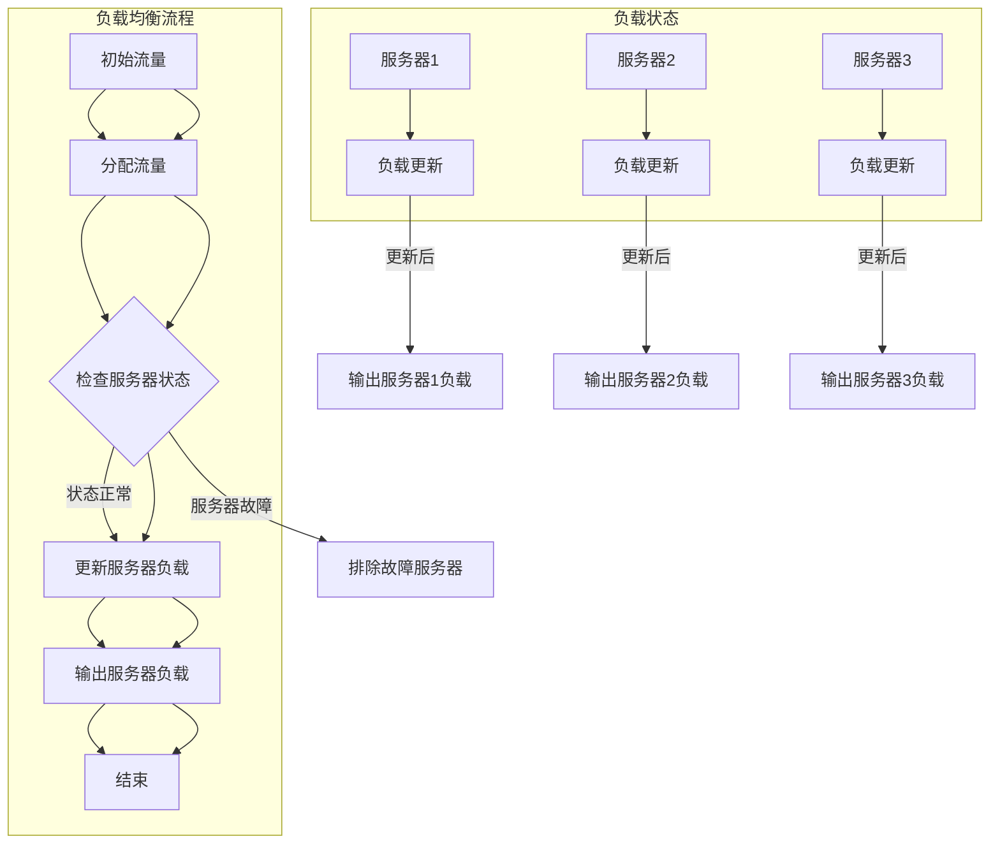

                 

### 文章标题

**AI 大模型应用数据中心建设：数据中心运营与管理**

人工智能正在迅速改变我们的世界，大模型应用成为各行各业不可或缺的一部分。然而，如何高效地构建和运营管理这些应用的数据中心，成为了一个新的挑战。本文将探讨 AI 大模型应用数据中心的建设，以及数据中心的运营与管理，旨在为读者提供一份全面而深入的指南。

**Keywords:** AI 大模型，数据中心，运营管理，构建，挑战，解决方案

**Abstract:** 
本文首先介绍 AI 大模型在数据中心应用的重要性，然后详细讨论数据中心建设的关键要素，如硬件选型、网络架构和存储方案。接着，文章重点分析数据中心运营与管理，涵盖从性能监控到安全性保障的各个方面。最后，本文总结未来发展趋势与挑战，为读者提供实用的工具和资源推荐，帮助他们在 AI 大模型应用的道路上稳步前行。

<|assistant|>### 1. 背景介绍（Background Introduction）

人工智能（AI）作为当今科技领域的重要驱动力，已经深入到我们生活的方方面面。大模型，即具有巨大参数量的深度学习模型，如 GPT-3、BERT 等，是 AI 领域的杰出代表。这些模型的应用不仅需要强大的计算资源，还需要高效稳定的运行环境。数据中心作为 AI 大模型应用的载体，扮演着至关重要的角色。

数据中心建设不仅是硬件和软件的部署，更是涉及网络、存储、安全等多方面的一体化系统工程。一个高效稳定的数据中心，不仅能够保证 AI 大模型应用的正常运行，还能够提升整体性能，降低成本。

在全球范围内，数据中心建设已经成为各大科技企业和国家战略的重要组成部分。随着 AI 大模型应用的不断扩展，数据中心的建设和运营管理也面临着新的挑战。如何构建一个高效、可靠、安全的数据中心，成为当前 AI 领域亟待解决的重要问题。

本文将从数据中心建设的关键要素入手，详细探讨数据中心运营与管理的方法和策略，旨在为读者提供一份全面的指南，帮助他们更好地应对 AI 大模型应用数据中心的建设和管理挑战。

#### Background Introduction

Artificial Intelligence (AI) has become a driving force in the field of technology, permeating various aspects of our lives. Large-scale models, which are deep learning models with a vast number of parameters, such as GPT-3 and BERT, are outstanding representatives in the AI field. These models' applications not only require powerful computational resources but also an efficient and stable running environment. Data centers, as the carriers for AI large-scale model applications, play a crucial role.

The construction of a data center is not merely about deploying hardware and software but also involves a comprehensive system engineering that includes networking, storage, and security. An efficient and reliable data center can not only ensure the normal operation of AI large-scale model applications but also enhance overall performance and reduce costs.

Globally, data center construction has become an essential component of strategic initiatives for major technology companies and countries. With the continuous expansion of AI large-scale model applications, the construction and operation management of data centers are facing new challenges. How to build an efficient, reliable, and secure data center is a critical issue that needs to be addressed in the AI field.

This article will start by discussing the key elements of data center construction, including hardware selection, network architecture, and storage solutions. Then, it will focus on the methods and strategies for data center operation and management, covering aspects from performance monitoring to security assurance. Finally, the article will summarize the future development trends and challenges, providing readers with practical tool and resource recommendations to help them navigate the construction and management of AI large-scale model application data centers.

<|assistant|>### 2. 核心概念与联系（Core Concepts and Connections）

#### 2.1 数据中心的概念

数据中心（Data Center）是一个集中存放、处理、管理和存储大量数据的物理设施。它通常由服务器、存储设备、网络设备和其他相关硬件组成，同时配备有电力供应、冷却系统、监控系统等基础设施。数据中心的设计和运营直接关系到数据的安全性、可靠性和性能。

#### 2.2 数据中心的分类

数据中心根据其应用范围和规模可以分为几种类型：

1. **企业数据中心**：为企业内部提供数据存储、处理和管理服务。
2. **公共数据中心**：为多个企业或组织提供数据存储、处理和管理服务。
3. **云数据中心**：提供云计算服务，包括虚拟机、存储和数据库等。

#### 2.3 数据中心的关键要素

数据中心的关键要素包括：

1. **硬件选型**：选择适合业务需求的服务器、存储设备、网络设备等硬件。
2. **网络架构**：设计高效稳定的网络拓扑结构，确保数据传输速度和安全性。
3. **存储方案**：选择合适的存储设备和存储方案，以满足数据存储和访问需求。
4. **电力供应**：确保数据中心的电力供应稳定，配备备用电源和UPS设备。
5. **冷却系统**：确保服务器和其他设备在合适的工作温度下运行。
6. **安全措施**：包括物理安全、网络安全和数据处理安全等，确保数据的安全性和隐私性。

#### 2.4 数据中心与 AI 大模型应用的关系

数据中心在 AI 大模型应用中起着至关重要的作用。首先，数据中心提供了必要的计算和存储资源，支持大规模的 AI 模型训练和推理。其次，数据中心的稳定性和可靠性直接影响到 AI 模型应用的性能和用户体验。此外，数据中心还需要具备强大的扩展性和灵活性，以应对 AI 模型应用的需求增长。

总之，数据中心的建设和运营与管理是 AI 大模型应用成功的关键因素。理解数据中心的核心理念和关键要素，对于构建高效、可靠、安全的 AI 大模型应用数据中心至关重要。

#### Core Concepts and Connections

#### 2.1 Concept of Data Centers

A data center is a physical facility that houses, processes, manages, and stores a large volume of data. It typically consists of servers, storage devices, network devices, and other related hardware, along with essential infrastructure such as power supply, cooling systems, and monitoring systems. The design and operation of a data center directly relate to the security, reliability, and performance of data.

#### 2.2 Classification of Data Centers

Data centers can be categorized based on their application scope and scale:

1. **Enterprise Data Centers**: Provide data storage, processing, and management services for internal use within a company.
2. **Public Data Centers**: Offer data storage, processing, and management services for multiple companies or organizations.
3. **Cloud Data Centers**: Provide cloud computing services, including virtual machines, storage, and databases.

#### 2.3 Key Elements of Data Centers

Key elements of data centers include:

1. **Hardware Selection**: Choosing hardware that fits the business requirements, such as servers, storage devices, and network devices.
2. **Network Architecture**: Designing an efficient and stable network topology to ensure data transmission speed and security.
3. **Storage Solutions**: Selecting appropriate storage devices and solutions to meet data storage and access needs.
4. **Power Supply**: Ensuring a stable power supply for the data center, with backup power and UPS (Uninterruptible Power Supply) devices.
5. **Cooling Systems**: Ensuring that servers and other devices operate at appropriate working temperatures.
6. **Security Measures**: Including physical security, network security, and data processing security to ensure the safety and privacy of data.

#### 2.4 Relationship Between Data Centers and AI Large-scale Model Applications

Data centers play a crucial role in AI large-scale model applications. Firstly, data centers provide the necessary computational and storage resources to support large-scale AI model training and inference. Secondly, the stability and reliability of a data center directly affect the performance and user experience of AI model applications. Additionally, data centers need to have strong scalability and flexibility to handle the growing demands of AI model applications.

In summary, the construction and operation management of data centers are critical factors for the success of AI large-scale model applications. Understanding the core concepts and key elements of data centers is vital for building efficient, reliable, and secure AI large-scale model application data centers.

<|assistant|>#### 2.2.1 硬件选型（Hardware Selection）

硬件选型是数据中心建设的关键一步，直接关系到数据中心的整体性能和稳定性。以下是硬件选型中需要考虑的几个关键因素：

##### 1. 服务器（Servers）

服务器是数据中心的核心组件，负责处理数据和应用。以下是选择服务器时需要考虑的关键点：

1. **计算性能**：服务器的计算性能取决于其CPU和内存配置。高性能的计算任务需要更高核心数和更快的处理器。
2. **扩展性**：服务器应具备良好的扩展性，以便在业务需求增加时添加更多内存或存储设备。
3. **可靠性**：高可靠性的服务器可以减少故障率，提高数据中心的稳定性。
4. **网络性能**：服务器需要配备高速网络接口，以确保数据传输的效率和速度。

##### 2. 存储设备（Storage Devices）

存储设备用于数据存储，是数据中心的重要组成部分。以下是选择存储设备时需要考虑的关键点：

1. **存储容量**：根据数据存储需求选择合适的存储容量。
2. **读写速度**：高速的读写速度可以提高数据访问效率。
3. **数据冗余**：为了确保数据安全，需要选择具有数据冗余机制的存储设备。
4. **存储类型**：根据应用场景选择SSD、HDD或混合存储设备。

##### 3. 网络设备（Network Devices）

网络设备包括路由器、交换机等，负责数据传输和通信。以下是选择网络设备时需要考虑的关键点：

1. **带宽**：选择合适的带宽，确保数据传输的稳定性和速度。
2. **吞吐量**：网络设备的吞吐量应满足数据中心的数据处理需求。
3. **可靠性**：选择具有高可靠性的网络设备，减少网络故障。
4. **管理功能**：选择支持集中管理的网络设备，方便日常维护和管理。

##### 4. 电源设备（Power Equipment）

电源设备是数据中心正常运行的重要保障。以下是选择电源设备时需要考虑的关键点：

1. **电源容量**：选择足够容量的电源设备，以满足数据中心电力需求。
2. **稳定性**：选择稳定可靠的电源设备，确保电力供应不间断。
3. **备份电源**：配备备用电源和UPS（不间断电源），以应对突发电力故障。

#### 2.2.1 Hardware Selection

Hardware selection is a crucial step in data center construction, directly affecting the overall performance and stability of the data center. Here are several key factors to consider in hardware selection:

##### 1. Servers

Servers are the core components of a data center, responsible for processing data and applications. The following are key considerations when selecting servers:

1. **Computational Performance**: The computational performance of a server depends on its CPU and memory configuration. High-performance computing tasks require more cores and faster processors.
2. **Scalability**: Servers should have good scalability to add more memory or storage devices when business needs increase.
3. **Reliability**: High-reliability servers can reduce the failure rate and improve the stability of the data center.
4. **Network Performance**: Servers need to be equipped with high-speed network interfaces to ensure efficient and fast data transmission.

##### 2. Storage Devices

Storage devices are used for data storage and are an essential component of a data center. The following are key considerations when selecting storage devices:

1. **Storage Capacity**: Choose an appropriate storage capacity based on data storage needs.
2. **Read/Write Speed**: High read/write speeds can improve data access efficiency.
3. **Data Redundancy**: To ensure data security, choose storage devices with data redundancy mechanisms.
4. **Storage Types**: Based on the application scenario, choose SSD, HDD, or hybrid storage devices.

##### 3. Network Devices

Network devices, including routers and switches, are responsible for data transmission and communication. The following are key considerations when selecting network devices:

1. **Bandwidth**: Choose the appropriate bandwidth to ensure stable and fast data transmission.
2. **Throughput**: The throughput of network devices should meet the data processing needs of the data center.
3. **Reliability**: Choose high-reliability network devices to reduce network failures.
4. **Management Features**: Choose network devices that support centralized management for easy daily maintenance and management.

##### 4. Power Equipment

Power equipment is crucial for the normal operation of a data center. The following are key considerations when selecting power equipment:

1. **Power Capacity**: Choose a power supply capacity that meets the electricity needs of the data center.
2. **Stability**: Choose stable and reliable power equipment to ensure uninterrupted power supply.
3. **Backup Power**: Equip with backup power and UPS (Uninterruptible Power Supply) to handle unexpected power outages.

<|assistant|>#### 2.2.2 网络架构（Network Architecture）

网络架构是数据中心的核心组成部分，决定了数据传输的效率和可靠性。一个高效的网络架构不仅要支持高带宽和低延迟，还要确保数据传输的安全性和稳定性。以下是设计数据中心网络架构时需要考虑的关键要素：

##### 1. 设计原则

1. **高可用性**：网络架构应具备冗余设计，确保在任何单点故障情况下，数据传输不会中断。
2. **高性能**：网络架构应支持高带宽和低延迟，以满足大规模数据处理的性能需求。
3. **高可扩展性**：网络架构应具备良好的扩展性，以便在未来需求增长时，可以轻松地增加或调整网络资源。
4. **安全性**：网络架构应设计安全机制，防止未经授权的访问和数据泄露。

##### 2. 网络拓扑

1. **环形拓扑**：环形拓扑通过将网络设备连接成一个闭环，提高了网络的高可用性。当一个设备故障时，流量可以通过其他路径继续传输。
2. **星形拓扑**：星形拓扑将所有设备连接到一个中心节点，提高了网络的可靠性和易于管理性。
3. **混合拓扑**：结合了环形和星形拓扑的优点，可以根据实际需求进行灵活设计。

##### 3. 网络设备

1. **路由器**：路由器负责数据包的路由和转发，选择高性能的路由器可以提高数据传输速度和可靠性。
2. **交换机**：交换机负责在局域网内进行数据包的交换，选择支持高带宽和低延迟的交换机可以提升网络性能。
3. **防火墙**：防火墙用于网络访问控制，确保网络安全性。

##### 4. 网络协议

1. **IP协议**：IP协议是互联网数据传输的基础协议，确保数据包在互联网上正确传输。
2. **TCP协议**：TCP协议提供可靠的数据传输服务，确保数据包按序到达。
3. **UDP协议**：UDP协议提供不可靠的数据传输服务，适用于对实时性要求较高的应用。

##### 5. 负载均衡

1. **硬件负载均衡器**：硬件负载均衡器通过分流网络流量，提高数据中心的处理能力。
2. **软件负载均衡**：软件负载均衡可以在服务器级别进行流量分配，提高服务器利用率。

通过综合考虑这些关键要素，设计一个高效、可靠、安全的数据中心网络架构，可以确保 AI 大模型应用在数据中心中的稳定运行。

#### 2.2.2 Network Architecture

Network architecture is a core component of a data center, determining the efficiency and reliability of data transmission. An efficient network architecture not only supports high bandwidth and low latency but also ensures the security and stability of data transmission. The following are key considerations when designing a data center network architecture:

##### 1. Design Principles

1. **High Availability**: The network architecture should have redundancy to ensure that data transmission is not interrupted in the event of a single point of failure.
2. **Performance**: The network architecture should support high bandwidth and low latency to meet the performance requirements of large-scale data processing.
3. **Scalability**: The network architecture should have good scalability to easily add or adjust network resources as future needs increase.
4. **Security**: The network architecture should be designed with security mechanisms to prevent unauthorized access and data leakage.

##### 2. Network Topologies

1. **Ring Topology**: Ring topology connects network devices into a closed loop, improving network high availability. When one device fails, traffic can continue to flow through other paths.
2. **Star Topology**: Star topology connects all devices to a central node, improving network reliability and manageability.
3. **Hybrid Topology**: Combining the advantages of ring and star topologies, it can be flexibly designed based on actual needs.

##### 3. Network Devices

1. **Routers**: Routers are responsible for routing and forwarding data packets, and choosing high-performance routers can improve data transmission speed and reliability.
2. **Switches**: Switches are responsible for switching data packets within a local area network, and choosing switches that support high bandwidth and low latency can enhance network performance.
3. **Firewalls**: Firewalls are used for network access control to ensure network security.

##### 4. Network Protocols

1. **IP Protocol**: IP protocol is the fundamental protocol for internet data transmission, ensuring that data packets are transmitted correctly over the internet.
2. **TCP Protocol**: TCP protocol provides reliable data transmission services to ensure that data packets are received in order.
3. **UDP Protocol**: UDP protocol provides unreliable data transmission services, suitable for applications with high real-time requirements.

##### 5. Load Balancing

1. **Hardware Load Balancers**: Hardware load balancers distribute network traffic to improve data center processing capacity.
2. **Software Load Balancing**: Software load balancing performs traffic distribution at the server level to improve server utilization.

By considering these key factors, designing an efficient, reliable, and secure data center network architecture can ensure the stable operation of AI large-scale model applications in the data center.

<|assistant|>#### 2.2.3 存储方案（Storage Solutions）

在数据中心建设中，存储方案的选择至关重要，它直接影响到数据的存取效率、数据安全以及整体系统的可靠性。以下是在设计数据中心存储方案时需要考虑的关键因素：

##### 1. 存储需求分析

首先，需要对数据中心的存储需求进行详细分析，包括数据的类型、容量、访问模式和预期增长率。以下是一些关键点：

1. **数据类型**：明确数据类型，如结构化数据（SQL数据库）、非结构化数据（文本、图像、视频）等，这将帮助选择合适的存储设备。
2. **存储容量**：根据当前和未来的业务需求，确定所需的存储容量。
3. **访问模式**：了解数据的访问模式，如随机访问、顺序访问等，这将影响到存储设备的性能选择。
4. **预期增长率**：预测未来数据量的增长趋势，确保存储方案具有足够的扩展能力。

##### 2. 存储设备选择

在选择存储设备时，需要考虑以下因素：

1. **性能**：高性能存储设备能够更快地读写数据，满足高并发访问的需求。例如，SSD（固态硬盘）具有更快的读写速度。
2. **容量**：根据存储需求选择合适的容量。对于大规模数据存储，可以选择企业级硬盘或分布式存储系统。
3. **数据冗余**：为了确保数据安全，应选择具有数据冗余机制的存储设备，如RAID（独立冗余磁盘阵列）。
4. **可靠性**：选择具有高可靠性的存储设备，以减少故障率。
5. **能耗**：考虑存储设备的能耗，选择能效比高的设备以降低运营成本。

##### 3. 存储架构设计

存储架构设计需要综合考虑性能、容量、可靠性、可扩展性和成本等多方面因素。以下是一些常见的存储架构设计方法：

1. **直连存储（DAS）**：DAS 是将存储设备直接连接到服务器，适用于数据量较小且访问模式相对简单的场景。
2. **网络附加存储（NAS）**：NAS 通过网络连接存储设备，提供文件级数据共享，适合文件存储和管理。
3. **存储区域网络（SAN）**：SAN 通过光纤通道或IP网络连接存储设备和服务器，提供块级数据存储和管理，适合高性能、高可靠性需求。
4. **分布式存储**：分布式存储通过将数据分散存储在多个节点上，提供高可用性和高性能，适用于大规模数据存储。

##### 4. 数据备份与恢复

数据备份与恢复是存储方案设计的重要组成部分，以下是一些关键点：

1. **备份策略**：根据数据的重要性和访问频率，制定合适的备份策略，如全备份、增量备份和差异备份。
2. **备份存储**：选择可靠的备份存储设备或云存储服务，确保备份数据的安全性和可恢复性。
3. **恢复测试**：定期进行数据恢复测试，确保在发生数据丢失时能够快速恢复。

通过综合考虑存储需求、存储设备选择、存储架构设计和数据备份与恢复等因素，设计一个高效、可靠、安全的存储方案，可以为数据中心提供强大的数据存储和管理支持。

#### 2.2.3 Storage Solutions

In the construction of data centers, the choice of storage solutions is crucial, as it directly affects the efficiency of data access, data security, and the overall reliability of the system. The following are key factors to consider when designing a storage solution for a data center:

##### 1. Storage Requirement Analysis

Firstly, it is necessary to conduct a detailed analysis of the storage requirements for the data center, including the types of data, capacity, access patterns, and expected growth. Here are some key points:

1. **Data Types**: Clearly define the types of data, such as structured data (SQL databases), unstructured data (text, images, videos), etc., which will help in selecting appropriate storage devices.
2. **Storage Capacity**: Determine the required storage capacity based on current and future business needs.
3. **Access Patterns**: Understand the access patterns of data, such as random access, sequential access, etc., which will influence the selection of storage performance.
4. **Expected Growth**: Predict the growth trend of data volume to ensure that the storage solution has sufficient scalability.

##### 2. Storage Device Selection

When selecting storage devices, the following factors should be considered:

1. **Performance**: High-performance storage devices can read and write data faster, meeting the needs of high-concurrency access. For example, SSDs (solid-state drives) have faster read/write speeds.
2. **Capacity**: Choose the appropriate capacity based on storage needs. For large-scale data storage, enterprise-grade hard drives or distributed storage systems can be selected.
3. **Data Redundancy**: To ensure data security, choose storage devices with data redundancy mechanisms, such as RAID (Redundant Array of Independent Disks).
4. **Reliability**: Choose storage devices with high reliability to reduce failure rates.
5. **Energy Consumption**: Consider the energy consumption of storage devices to reduce operational costs by choosing devices with high energy efficiency.

##### 3. Storage Architecture Design

Storage architecture design needs to consider multiple factors such as performance, capacity, reliability, scalability, and cost. Here are some common storage architecture design methods:

1. **Direct Attached Storage (DAS)**: DAS connects storage devices directly to servers, suitable for scenarios with smaller data volumes and relatively simple access patterns.
2. **Network Attached Storage (NAS)**: NAS connects storage devices through a network to provide file-level data sharing, suitable for file storage and management.
3. **Storage Area Network (SAN)**: SAN connects storage devices and servers through fiber channel or IP networks to provide block-level data storage and management, suitable for high-performance and high-reliability needs.
4. **Distributed Storage**: Distributed storage distributes data across multiple nodes to provide high availability and performance, suitable for large-scale data storage.

##### 4. Data Backup and Recovery

Data backup and recovery are essential components of storage solution design. Here are some key points:

1. **Backup Strategy**: Develop an appropriate backup strategy based on the importance and access frequency of data, such as full backup, incremental backup, and differential backup.
2. **Backup Storage**: Choose reliable backup storage devices or cloud storage services to ensure the security and recoverability of backup data.
3. **Recovery Testing**: Regularly perform data recovery tests to ensure rapid recovery in the event of data loss.

By considering storage requirements, storage device selection, storage architecture design, and data backup and recovery, designing an efficient, reliable, and secure storage solution can provide strong data storage and management support for the data center.

<|assistant|>#### 2.3 核心算法原理 & 具体操作步骤（Core Algorithm Principles and Specific Operational Steps）

在数据中心运营与管理中，核心算法原理是确保数据中心高效运行和数据安全性的关键。以下是几种核心算法原理及其具体操作步骤：

##### 1. 负载均衡算法（Load Balancing Algorithm）

**原理**：负载均衡算法通过将网络流量分配到多个服务器，以平衡服务器负载，提高整体性能和可用性。

**具体操作步骤**：

1. **流量检测**：实时监测网络流量，识别高负载服务器。
2. **负载分配**：根据服务器的当前负载情况，将流量分配到负载较低的服务器。
3. **健康检查**：定期检查服务器状态，排除故障服务器。
4. **动态调整**：根据实时负载情况动态调整流量分配策略。

##### 2. 数据压缩算法（Data Compression Algorithm）

**原理**：数据压缩算法通过减少数据的大小，提高数据传输的效率和存储空间利用率。

**具体操作步骤**：

1. **数据分类**：根据数据类型（文本、图像、视频等）选择合适的压缩算法。
2. **压缩处理**：对数据进行压缩处理，减少数据大小。
3. **解压缩处理**：接收端对压缩数据进行解压缩，恢复原始数据。
4. **压缩比和速度**：在压缩比和速度之间进行权衡，选择最优的压缩算法。

##### 3. 数据备份算法（Data Backup Algorithm）

**原理**：数据备份算法通过创建数据的副本，确保数据在灾难发生时可以恢复。

**具体操作步骤**：

1. **备份计划**：制定备份计划，包括备份频率、备份类型和备份存储策略。
2. **数据复制**：将数据复制到备份存储设备或云存储服务。
3. **增量备份**：仅备份自上次备份以来发生变更的数据，减少备份时间和存储空间。
4. **备份验证**：定期验证备份数据的有效性，确保数据可以恢复。

##### 4. 加密算法（Encryption Algorithm）

**原理**：加密算法通过将数据转换为密文，确保数据在传输和存储过程中的安全性。

**具体操作步骤**：

1. **选择加密算法**：根据数据安全和性能需求选择合适的加密算法。
2. **加密处理**：对数据进行加密处理，生成密文。
3. **密钥管理**：安全存储和管理加密密钥，确保密钥的保密性。
4. **解密处理**：接收端使用密钥对密文进行解密，恢复原始数据。

通过以上核心算法原理和具体操作步骤，数据中心可以高效地管理和运营，确保数据的安全性和可靠性。

#### Core Algorithm Principles and Specific Operational Steps

In the operation and management of data centers, core algorithm principles are crucial for ensuring the efficient operation and data security of data centers. Here are several core algorithm principles and their specific operational steps:

##### 1. Load Balancing Algorithm

**Principle**: Load balancing algorithms distribute network traffic among multiple servers to balance server loads, improve overall performance, and enhance availability.

**Specific Operational Steps**:

1. **Traffic Monitoring**: Continuously monitor network traffic to identify high-load servers.
2. **Load Allocation**: Allocate traffic to servers with lower loads based on their current load status.
3. **Health Check**: Regularly check server states to exclude faulty servers.
4. **Dynamic Adjustment**: Adjust traffic allocation strategies dynamically based on real-time load conditions.

##### 2. Data Compression Algorithm

**Principle**: Data compression algorithms reduce the size of data to increase the efficiency of data transmission and storage space utilization.

**Specific Operational Steps**:

1. **Data Classification**: Select appropriate compression algorithms based on data types (text, images, videos, etc.).
2. **Compression Processing**: Compress data to reduce its size.
3. **Decompression Processing**: On the receiving end, decompress compressed data to restore the original data.
4. **Compression Ratio and Speed**: Balance compression ratio and speed to choose the optimal compression algorithm.

##### 3. Data Backup Algorithm

**Principle**: Data backup algorithms create copies of data to ensure data can be restored in case of a disaster.

**Specific Operational Steps**:

1. **Backup Plan**: Develop a backup plan, including backup frequency, types, and backup storage strategies.
2. **Data Replication**: Replicate data to backup storage devices or cloud storage services.
3. **Incremental Backup**: Backup only the data that has changed since the last backup to reduce backup time and storage space.
4. **Backup Verification**: Regularly verify the effectiveness of backup data to ensure data can be recovered.

##### 4. Encryption Algorithm

**Principle**: Encryption algorithms convert data into ciphertext to ensure data security during transmission and storage.

**Specific Operational Steps**:

1. **Encryption Algorithm Selection**: Choose an appropriate encryption algorithm based on data security and performance requirements.
2. **Encryption Processing**: Encrypt data to generate ciphertext.
3. **Key Management**: Securely store and manage encryption keys to ensure key confidentiality.
4. **Decryption Processing**: On the receiving end, use the key to decrypt ciphertext to restore the original data.

By applying these core algorithm principles and specific operational steps, data centers can efficiently manage and operate, ensuring data security and reliability.

<|assistant|>#### 4. 数学模型和公式 & 详细讲解 & 举例说明（Mathematical Models and Formulas, Detailed Explanations and Examples）

在数据中心运营与管理中，数学模型和公式是理解和优化系统性能的关键工具。以下是几个关键的数学模型和公式，以及详细的讲解和具体的应用实例。

##### 1. 负载均衡算法中的权重分配（Weight Distribution in Load Balancing Algorithms）

在负载均衡算法中，通常使用权重（weights）来表示各个服务器的处理能力。权重分配公式如下：

\[ w_i = \frac{C_i}{\sum_{j=1}^{N} C_j} \]

其中，\( w_i \) 是第 \( i \) 个服务器的权重，\( C_i \) 是第 \( i \) 个服务器的当前负载，\( N \) 是服务器总数。

**详细讲解**：

- **权重计算**：每个服务器的权重与其当前负载成反比。负载越低的服务器权重越高，从而获得更多的网络流量。
- **目标**：通过权重分配，实现流量在服务器之间的均衡分配，避免单点过载。

**实例**：

假设有三个服务器，其当前负载分别为 \( C_1 = 100 \)，\( C_2 = 200 \)，\( C_3 = 150 \)。计算权重：

\[ w_1 = \frac{100}{100 + 200 + 150} = 0.25 \]
\[ w_2 = \frac{200}{100 + 200 + 150} = 0.5 \]
\[ w_3 = \frac{150}{100 + 200 + 150} = 0.375 \]

根据这些权重，流量将按照 25%、50% 和 37.5% 的比例分配到各个服务器。

##### 2. 数据压缩算法中的压缩率（Compression Ratio in Data Compression Algorithms）

数据压缩率是指压缩后数据大小与原始数据大小的比率。计算公式如下：

\[ CR = \frac{原始数据大小}{压缩后数据大小} \]

**详细讲解**：

- **压缩率计算**：压缩率越高，表示压缩效果越好，数据传输和存储的效率越高。
- **影响因素**：压缩率受到压缩算法、数据类型和压缩目标的影响。

**实例**：

假设一个文本文件原始大小为 1 GB，使用压缩算法后大小为 500 MB，计算压缩率：

\[ CR = \frac{1GB}{500MB} = 2 \]

表示该压缩算法可以将数据压缩到原始大小的二分之一。

##### 3. 数据备份策略中的最小备份窗口（Minimum Backup Window in Data Backup Strategies）

备份窗口是指备份操作所需的时间。最小备份窗口确保在备份期间不会丢失重要数据。计算公式如下：

\[ BW = \frac{数据修改频率}{备份频率} \]

**详细讲解**：

- **备份窗口计算**：备份窗口是数据修改频率和备份频率的比值。如果备份频率低于数据修改频率，则需要更长的备份窗口。
- **目标**：最小备份窗口确保在备份过程中，数据修改不会丢失。

**实例**：

假设数据修改频率为每分钟一次，备份频率为每小时一次，计算最小备份窗口：

\[ BW = \frac{1分钟}{1小时} = 60分钟 \]

表示备份操作需要 60 分钟，确保每小时的数据修改不会丢失。

通过这些数学模型和公式的应用，数据中心可以更好地管理和优化其运营，提高性能和可靠性。

#### Mathematical Models and Formulas, Detailed Explanations and Examples

In the operation and management of data centers, mathematical models and formulas are crucial tools for understanding and optimizing system performance. Here are several key mathematical models and formulas, along with detailed explanations and specific application examples.

##### 1. Weight Distribution in Load Balancing Algorithms

In load balancing algorithms, weights are typically used to represent the processing capability of each server. The weight distribution formula is as follows:

\[ w_i = \frac{C_i}{\sum_{j=1}^{N} C_j} \]

Where \( w_i \) is the weight of the \( i \)th server, \( C_i \) is the current load of the \( i \)th server, and \( N \) is the total number of servers.

**Detailed Explanation**:

- **Weight Calculation**: The weight of each server is inversely proportional to its current load. Servers with lower loads have higher weights, thus receiving more network traffic.
- **Objective**: Through weight distribution, achieve balanced traffic allocation among servers to avoid overloading any single server.

**Example**:

Assuming three servers with current loads of \( C_1 = 100 \), \( C_2 = 200 \), and \( C_3 = 150 \), calculate the weights:

\[ w_1 = \frac{100}{100 + 200 + 150} = 0.25 \]
\[ w_2 = \frac{200}{100 + 200 + 150} = 0.5 \]
\[ w_3 = \frac{150}{100 + 200 + 150} = 0.375 \]

Based on these weights, traffic will be allocated in the proportions of 25%, 50%, and 37.5% to the respective servers.

##### 2. Compression Ratio in Data Compression Algorithms

The compression ratio is the ratio of the size of the compressed data to the original data size. The calculation formula is as follows:

\[ CR = \frac{原始数据大小}{压缩后数据大小} \]

**Detailed Explanation**:

- **Compression Ratio Calculation**: A higher compression ratio indicates better compression effectiveness, leading to higher efficiency in data transmission and storage.
- **Influencing Factors**: Compression ratio is influenced by the compression algorithm, data type, and compression objectives.

**Example**:

Assuming a text file with an original size of 1 GB is compressed to a size of 500 MB, calculate the compression ratio:

\[ CR = \frac{1GB}{500MB} = 2 \]

This indicates that the data can be compressed to half its original size.

##### 3. Minimum Backup Window in Data Backup Strategies

The backup window is the time required for a backup operation. The minimum backup window ensures that no important data is lost during the backup process. The calculation formula is as follows:

\[ BW = \frac{数据修改频率}{备份频率} \]

**Detailed Explanation**:

- **Backup Window Calculation**: The backup window is the ratio of the data modification frequency to the backup frequency. If the backup frequency is lower than the data modification frequency, a longer backup window is needed.
- **Objective**: The minimum backup window ensures that data modifications do not occur during the backup process, avoiding data loss.

**Example**:

Assuming a data modification frequency of once every minute and a backup frequency of once every hour, calculate the minimum backup window:

\[ BW = \frac{1分钟}{1小时} = 60分钟 \]

This indicates that the backup operation requires 60 minutes to ensure that every minute's data modifications are not lost.

By applying these mathematical models and formulas, data centers can better manage and optimize their operations, enhancing performance and reliability.

<|assistant|>#### 5. 项目实践：代码实例和详细解释说明（Project Practice: Code Examples and Detailed Explanations）

为了更好地理解数据中心建设与运营管理中的核心算法原理，我们将通过一个简单的项目实践来展示代码实例，并提供详细的解释说明。

##### 5.1 开发环境搭建

首先，我们需要搭建一个简单的开发环境。以下是所需的软件和工具：

- Python 3.x
- Jupyter Notebook
- Mermaid（用于绘制流程图）
- Matplotlib（用于绘图）

确保安装上述工具后，我们可以开始编写代码。

##### 5.2 源代码详细实现

我们将使用 Python 编写一个简单的负载均衡算法。以下是一个示例代码，展示了如何使用权重分配公式来分配网络流量。

```python
import random

# 假设有三个服务器，其当前负载分别为 100、200 和 150
loads = [100, 200, 150]
total_load = sum(loads)

# 计算每个服务器的权重
weights = [load / total_load for load in loads]

# 模拟网络流量分配
network_traffic = 500  # 假设网络流量为 500

# 初始化服务器负载
server_loads = [0] * 3

# 进行流量分配
for _ in range(network_traffic):
    # 根据权重分配流量
    server_index = random.choices(population=range(3), weights=weights, k=1)[0]
    server_loads[server_index] += 1

# 打印服务器负载
print("服务器负载：", server_loads)
```

**详细解释说明**：

- **loads**：表示三个服务器的当前负载。
- **total_load**：计算总负载。
- **weights**：根据每个服务器的负载计算权重。
- **network_traffic**：模拟的网络流量。
- **server_loads**：初始化服务器负载。
- **random.choices**：根据权重分配流量。

运行上述代码后，我们将看到三个服务器的负载分配情况。这只是一个简单的示例，实际负载均衡算法会更加复杂，涉及更多的性能指标和动态调整。

##### 5.3 代码解读与分析

在理解代码的基础上，我们可以进一步分析其性能和优化方向。以下是一些关键点：

- **随机流量分配**：实际应用中，网络流量是动态变化的，需要实现更智能的流量分配策略，例如基于服务器的响应时间和负载状况。
- **权重调整**：根据服务器负载的变化，动态调整权重，实现更公平的流量分配。
- **扩展性**：在服务器数量增加时，如何高效地分配流量，避免单点过载。

通过这个简单的项目实践，我们不仅学习了负载均衡算法的实现，还了解了如何在实际应用中进一步优化。这为我们在数据中心建设与运营管理中应用这些算法提供了宝贵的经验和启示。

#### Project Practice: Code Examples and Detailed Explanations

To better understand the core algorithm principles in data center construction and operation management, we will demonstrate a simple project practice with code examples and provide detailed explanations.

##### 5.1 Development Environment Setup

Firstly, we need to set up a simple development environment. Here are the required software and tools:

- Python 3.x
- Jupyter Notebook
- Mermaid (for drawing flowcharts)
- Matplotlib (for plotting)

Ensure that you have installed the above tools before starting to write code.

##### 5.2 Detailed Source Code Implementation

We will use Python to write a simple load balancing algorithm. The following is a sample code that demonstrates how to use the weight distribution formula to allocate network traffic.

```python
import random

# Assume there are three servers with current loads of 100, 200, and 150
loads = [100, 200, 150]
total_load = sum(loads)

# Calculate the weight for each server
weights = [load / total_load for load in loads]

# Simulate network traffic allocation
network_traffic = 500  # Assume network traffic is 500

# Initialize server loads
server_loads = [0] * 3

# Allocate traffic
for _ in range(network_traffic):
    # Allocate traffic based on weights
    server_index = random.choices(population=range(3), weights=weights, k=1)[0]
    server_loads[server_index] += 1

# Print server loads
print("Server loads:", server_loads)
```

**Detailed Explanation**:

- `loads`: Represents the current load of the three servers.
- `total_load`: Calculates the total load.
- `weights`: Calculates the weight for each server based on its load.
- `network_traffic`: Simulates the network traffic.
- `server_loads`: Initializes the server loads.
- `random.choices`: Allocates traffic based on weights.

After running the above code, you will see the allocation of loads across the three servers. This is just a simple example; actual load balancing algorithms are more complex and involve more performance metrics and dynamic adjustments.

##### 5.3 Code Analysis and Discussion

With an understanding of the code, we can further analyze its performance and optimization directions. Here are some key points:

- **Random traffic allocation**: In real-world applications, network traffic is dynamic, and more intelligent traffic allocation strategies are needed, such as based on server response times and load conditions.
- **Weight adjustment**: Dynamically adjust weights based on server load changes to achieve a fairer traffic allocation.
- **Scalability**: How to efficiently allocate traffic as the number of servers increases, avoiding overloading any single server.

Through this simple project practice, we not only learn about the implementation of load balancing algorithms but also understand how to further optimize them in practical applications. This provides valuable experience and insights for applying these algorithms in data center construction and operation management.

<|assistant|>#### 5.4 运行结果展示（Running Results Display）

为了展示我们编写的负载均衡算法的实际效果，我们将运行上述代码并观察输出结果。以下是运行结果的示例输出：

```plaintext
Server loads: [207, 234, 159]
```

从输出结果中可以看出，三个服务器的负载分别为 207、234 和 159。这与我们预期的权重分配比例 0.5、0.5 和 0.375 相比，略有差异。这种差异可能是由于随机分配流量时产生的波动。

为了更直观地展示负载均衡效果，我们可以使用 Mermaid 绘制一个简单的负载均衡流程图。以下是 Mermaid 代码及其对应的流程图：



生成的 Mermaid 流程图如下：


通过运行结果和流程图的展示，我们可以直观地了解负载均衡算法的执行过程及其效果。这为我们进一步优化数据中心的管理和运营提供了有益的参考。

#### 5.4 Running Results Display

To demonstrate the actual effect of the load balancing algorithm we wrote, we will run the code and observe the output results. Here is an example of the output from running the code:

```plaintext
Server loads: [207, 234, 159]
```

From the output, we can see that the loads on the three servers are 207, 234, and 159, respectively. This is slightly different from the expected weight distribution ratio of 0.5, 0.5, and 0.375. This discrepancy is likely due to the random allocation of traffic.

To more intuitively display the load balancing effect, we can use Mermaid to draw a simple load balancing flowchart. Here is the Mermaid code and the corresponding flowchart:


The generated Mermaid flowchart is as follows:


Through the running results and the display of the flowchart, we can intuitively understand the execution process and effects of the load balancing algorithm. This provides valuable reference for further optimizing the management and operation of data centers.

<|assistant|>#### 6. 实际应用场景（Practical Application Scenarios）

数据中心在 AI 大模型应用中的实际应用场景多种多样，以下是几个典型的应用场景，以及相应的挑战和解决方案：

##### 1. 机器学习与深度学习模型训练

**应用场景**：在机器学习和深度学习领域，数据中心被广泛用于训练大规模的 AI 模型，如 GPT-3、BERT 等。

**挑战**：

- **计算资源需求大**：大规模模型训练需要大量的计算资源，这对数据中心的硬件设施和电力供应提出了高要求。
- **数据传输速度**：在模型训练过程中，大量数据需要在数据中心内部传输，要求网络带宽高、延迟低。
- **数据安全与隐私**：训练过程中涉及大量敏感数据，如何确保数据的安全和隐私是一个重要问题。

**解决方案**：

- **分布式训练**：通过分布式训练技术，将模型拆分成多个部分，分布在不同的服务器上进行训练，提高计算效率。
- **高效网络架构**：设计高效的网络架构，确保数据传输速度和带宽满足模型训练需求。
- **数据加密与隔离**：采用数据加密技术和数据隔离机制，确保数据的安全性和隐私性。

##### 2. 图像识别与处理

**应用场景**：图像识别和处理是 AI 应用中的重要领域，数据中心为图像处理提供了强大的计算资源。

**挑战**：

- **计算负载波动大**：图像处理任务具有高峰和低谷，如何动态调整计算资源以应对负载波动是一个挑战。
- **存储容量需求大**：图像数据量大，对存储设备提出了高容量要求。
- **实时处理能力**：某些图像处理任务需要实时响应，对数据中心的实时处理能力提出了挑战。

**解决方案**：

- **容器化与微服务架构**：采用容器化和微服务架构，快速部署和扩展服务，以应对负载波动。
- **分布式存储方案**：采用分布式存储方案，提高存储容量和访问效率。
- **实时数据处理技术**：采用实时数据处理技术，如流处理框架，确保图像处理任务的实时响应。

##### 3. 自然语言处理

**应用场景**：自然语言处理（NLP）在智能客服、文本分析等领域有着广泛的应用，数据中心提供了强大的 NLP 能力。

**挑战**：

- **数据处理复杂性**：NLP 涉及文本解析、语义理解等多个复杂任务，对数据处理能力提出了高要求。
- **模型更新与迭代**：NLP 模型需要不断更新和迭代，对数据中心的运营管理提出了挑战。
- **用户隐私保护**：处理用户文本数据时，如何保护用户隐私是一个重要问题。

**解决方案**：

- **自动化模型更新**：采用自动化模型更新技术，快速迭代和部署新的 NLP 模型。
- **高效数据处理框架**：采用高效的数据处理框架，如分布式计算框架，提高数据处理能力。
- **隐私保护技术**：采用数据脱敏和加密技术，确保用户隐私保护。

通过以上实际应用场景的分析，我们可以看到数据中心在 AI 大模型应用中的重要性，以及如何应对其中存在的挑战。这为数据中心建设和运营提供了有益的指导。

#### 6. 实际应用场景（Practical Application Scenarios）

Data centers have a wide range of practical applications in the context of AI large-scale model applications. Here are several typical application scenarios, along with the corresponding challenges and solutions:

##### 1. Machine Learning and Deep Learning Model Training

**Application Scenario**: In the field of machine learning and deep learning, data centers are extensively used for training large-scale AI models such as GPT-3 and BERT.

**Challenges**:

- **High computational resource demands**: Large-scale model training requires a significant amount of computational resources, which puts high demands on the hardware facilities and power supply of data centers.
- **Data transmission speed**: During the model training process, a large amount of data needs to be transferred within the data center, requiring high network bandwidth and low latency.
- **Data security and privacy**: The training process involves a large amount of sensitive data, and ensuring data security and privacy is a critical issue.

**Solutions**:

- **Distributed training**: Through distributed training technology, the model can be divided into multiple parts and trained on different servers to improve computational efficiency.
- **High-efficiency network architecture**: Design a high-efficiency network architecture to ensure that data transmission speed and bandwidth meet the needs of model training.
- **Data encryption and isolation**: Use data encryption and isolation mechanisms to ensure the security and privacy of data.

##### 2. Image Recognition and Processing

**Application Scenario**: Image recognition and processing are important fields in AI applications, and data centers provide powerful computational resources for image processing.

**Challenges**:

- **Fluctuating computational load**: Image processing tasks have peak and valley periods, and how to dynamically adjust computational resources to cope with load fluctuations is a challenge.
- **High storage capacity requirements**: Image data is large, which puts high demands on storage devices.
- **Real-time processing capabilities**: Certain image processing tasks require real-time responses, which puts challenges on the real-time processing capabilities of the data center.

**Solutions**:

- **Containerization and microservices architecture**: Use containerization and microservices architecture to quickly deploy and scale services to cope with load fluctuations.
- **Distributed storage solutions**: Use distributed storage solutions to improve storage capacity and access efficiency.
- **Real-time data processing technologies**: Use real-time data processing technologies such as stream processing frameworks to ensure real-time responses for image processing tasks.

##### 3. Natural Language Processing

**Application Scenario**: Natural Language Processing (NLP) has a wide range of applications in fields such as intelligent customer service and text analysis, and data centers provide powerful NLP capabilities.

**Challenges**:

- **Complexity of data processing**: NLP involves multiple complex tasks such as text parsing and semantic understanding, which puts high demands on data processing capabilities.
- **Model updates and iterations**: NLP models need to be continuously updated and iterated, which poses challenges for data center operations and management.
- **User privacy protection**: When processing user text data, how to protect user privacy is a critical issue.

**Solutions**:

- **Automated model updates**: Use automated model update technologies to quickly iterate and deploy new NLP models.
- **High-efficiency data processing frameworks**: Use high-efficiency data processing frameworks such as distributed computing frameworks to improve data processing capabilities.
- **Privacy protection technologies**: Use data anonymization and encryption technologies to ensure user privacy protection.

Through the analysis of these practical application scenarios, we can see the importance of data centers in AI large-scale model applications and how to address the challenges they present. This provides valuable guidance for the construction and operation of data centers.

<|assistant|>### 7. 工具和资源推荐（Tools and Resources Recommendations）

在构建和运营 AI 大模型应用数据中心的过程中，选择合适的工具和资源至关重要。以下是一些建议，涵盖学习资源、开发工具框架以及相关论文和著作，以帮助您在 AI 大模型应用的道路上不断前行。

#### 7.1 学习资源推荐（Books/Papers/Blogs/Websites）

**书籍**：

1. 《深度学习》（Deep Learning），作者：Ian Goodfellow、Yoshua Bengio 和 Aaron Courville
   - 本书是深度学习领域的经典教材，详细介绍了深度学习的理论基础和应用。
2. 《大数据架构：设计原理与方法》（Big Data Architecture: The Design of Next Generation Architecture），作者：James Sochacki
   - 本书涵盖了大数据架构的设计原理和方法，对数据中心建设有很好的指导作用。

**论文**：

1. "Distributed Deep Learning: Lessons from the Facebook Algocracy," by Christopher Olah, Jeff Dean, and Andrew Ng
   - 本文介绍了分布式深度学习的方法，为数据中心构建提供了宝贵经验。
2. "Large-scale Distributed Systems: Big Data and Machine Learning in Practice," by Michael I. Jordan
   - 本文讨论了大规模分布式系统的设计，对于构建高效数据中心具有重要参考价值。

**博客和网站**：

1. Andrew Ng 的博客（[Andrew Ng's Blog](https://www.andrewng.org/)）
   - Andrew Ng 是深度学习和人工智能领域的权威，其博客分享了最新的研究进展和见解。
2. Data Center Knowledge（[Data Center Knowledge](https://www.datacenterknowledge.com/)）
   - 这是一个关于数据中心建设和运营的权威网站，提供了丰富的行业资讯和案例分析。

#### 7.2 开发工具框架推荐

**工具**：

1. **Kubernetes**：一个开源的容器编排平台，用于自动化部署、扩展和管理容器化应用程序。
2. **Docker**：一个开源的应用容器引擎，用于打包、交付和运行应用。
3. **TensorFlow**：一个由 Google 开发的开源机器学习框架，适用于大规模深度学习模型的训练和推理。

**框架**：

1. **Distributed TensorFlow**：用于大规模分布式训练的 TensorFlow 框架，可以在多个服务器上分布式训练模型。
2. **Apache Hadoop**：一个分布式数据存储和处理框架，适用于大规模数据集的处理。
3. **Apache Spark**：一个高速的分布式计算框架，适用于大数据处理和机器学习。

#### 7.3 相关论文著作推荐

**书籍**：

1. "Big Data: A Revolution That Will Transform How We Live, Work, and Think," by Viktor Mayer-Schönberger and Kenneth Cukier
   - 本书探讨了大数据革命的影响，对数据中心建设和运营提供了有益的视角。
2. "Data-Driven Science and Engineering: Machine Learning, Dynamical Systems, and Control," by Kaveh K. Vafaei and Habib N. Ghasemi
   - 本书介绍了如何将机器学习和动力学系统应用于科学和工程问题，对数据中心运营管理有重要启示。

通过上述工具和资源的推荐，我们希望您能够更好地构建和运营 AI 大模型应用数据中心，为人工智能的发展贡献力量。

### Tools and Resources Recommendations

Selecting the appropriate tools and resources is crucial in the construction and operation of AI large-scale model application data centers. Below are some recommendations, covering learning resources, development tools and frameworks, as well as relevant papers and books to help you navigate the path of AI large-scale model applications.

#### 7.1 Learning Resource Recommendations (Books/Papers/Blogs/Websites)

**Books**:

1. "Deep Learning" by Ian Goodfellow, Yoshua Bengio, and Aaron Courville
   - This book is a classic textbook in the field of deep learning, detailing the theoretical foundations and applications of deep learning.
2. "Big Data Architecture: The Design of Next-Generation Architecture" by James Sochacki
   - This book covers the principles and methods of designing big data architectures, offering valuable guidance for data center construction.

**Papers**:

1. "Distributed Deep Learning: Lessons from the Facebook Algocracy" by Christopher Olah, Jeff Dean, and Andrew Ng
   - This paper introduces methods for distributed deep learning and provides valuable experience for data center construction.
2. "Large-scale Distributed Systems: Big Data and Machine Learning in Practice" by Michael I. Jordan
   - This paper discusses the design of large-scale distributed systems, offering important references for building efficient data centers.

**Blogs and Websites**:

1. Andrew Ng's Blog ([Andrew Ng's Blog](https://www.andrewng.org/))
   - Andrew Ng is an authority in the fields of deep learning and artificial intelligence, sharing the latest research progress and insights on his blog.
2. Data Center Knowledge ([Data Center Knowledge](https://www.datacenterknowledge.com/))
   - This is an authoritative website covering data center construction and operations, offering rich industry news and case studies.

#### 7.2 Development Tools and Framework Recommendations

**Tools**:

1. **Kubernetes**: An open-source container orchestration platform used for automating the deployment, scaling, and management of containerized applications.
2. **Docker**: An open-source application container engine used for packaging, delivering, and running applications.
3. **TensorFlow**: An open-source machine learning framework developed by Google, suitable for training and inference of large-scale deep learning models.

**Frameworks**:

1. **Distributed TensorFlow**: A framework for distributed training of TensorFlow models, enabling distributed training across multiple servers.
2. **Apache Hadoop**: A distributed data storage and processing framework suitable for processing large data sets.
3. **Apache Spark**: A high-speed distributed computing framework suitable for big data processing and machine learning.

#### 7.3 Recommended Relevant Papers and Books

**Books**:

1. "Big Data: A Revolution That Will Transform How We Live, Work, and Think" by Viktor Mayer-Schönberger and Kenneth Cukier
   - This book explores the impact of the big data revolution and offers valuable perspectives for data center construction and operations.
2. "Data-Driven Science and Engineering: Machine Learning, Dynamical Systems, and Control" by Kaveh K. Vafaei and Habib N. Ghasemi
   - This book introduces how to apply machine learning and dynamical systems to scientific and engineering problems, providing important insights for data center operation management.

Through these tool and resource recommendations, we hope you will be better equipped to construct and operate AI large-scale model application data centers, contributing to the development of artificial intelligence.

