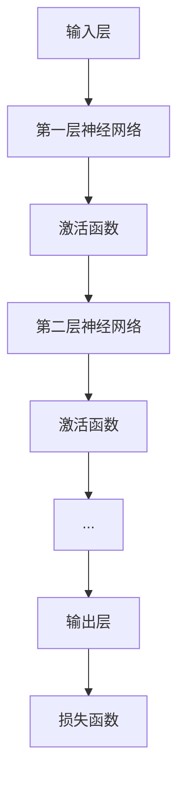
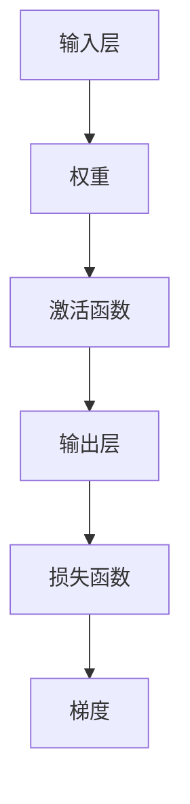

                 

### 文章标题

**AI 大模型计算机科学家群英传：AI 大模型的规模定律 Scaling Law**

关键词：AI 大模型，规模定律，计算效率，算法优化，资源需求，未来趋势

摘要：本文将探讨 AI 大模型的发展历程、核心概念以及规模定律。通过深入解析 AI 大模型的计算效率、资源需求以及算法优化，我们将揭示 AI 大模型背后的科学原理，展望未来发展的趋势与挑战。本文旨在为读者提供一份全面、系统的 AI 大模型学习指南，帮助理解 AI 大模型在计算机科学领域的地位与作用。

### 1. 背景介绍

随着深度学习技术的不断发展，人工智能（AI）大模型已经成为当前研究的热点。AI 大模型，顾名思义，是指具有庞大参数规模和计算量的深度学习模型。这些模型在图像识别、自然语言处理、语音识别等领域取得了显著的成果，推动了人工智能技术的快速发展。

AI 大模型的发展历程可以追溯到 2012 年，当时 AlexNet 模型在 ImageNet 图像识别挑战赛上取得了突破性成绩。自此之后，深度学习模型在参数规模和计算量方面不断增长。近年来，以 GPT、BERT、ViT 等为代表的预训练大模型相继涌现，标志着 AI 大模型时代正式到来。

本文将围绕 AI 大模型的核心概念、规模定律以及实际应用展开讨论。首先，我们将介绍 AI 大模型的核心概念，包括计算效率、资源需求、算法优化等方面的内容。然后，通过分析规模定律，我们将揭示 AI 大模型在计算资源需求、训练时间、模型性能等方面的规律。最后，我们将探讨 AI 大模型在自然语言处理、计算机视觉等领域的实际应用，分析其优势和挑战，并展望未来发展的趋势。

### 2. 核心概念与联系

#### 2.1 什么是 AI 大模型？

AI 大模型，通常指的是那些具有数百万、数十亿甚至数千亿个参数的深度学习模型。这些模型在训练时需要庞大的计算资源，同时在模型推理阶段也要求高效的计算性能。AI 大模型的核心特点包括：

- **参数规模**：AI 大模型的参数数量通常远超传统机器学习模型，这使得模型具有更强的表达能力和泛化能力。
- **计算资源需求**：大模型的训练和推理需要更多的计算资源，如 GPU、TPU 等。
- **训练时间**：随着模型规模的增大，训练时间也会显著增加。
- **推理性能**：大模型在推理阶段通常具有较高的计算性能，能够快速生成高质量的输出。

#### 2.2 核心概念原理与架构

为了更好地理解 AI 大模型，我们需要了解以下几个核心概念：

- **神经网络**：神经网络是 AI 大模型的基础，通过多层神经元的连接，实现数据的输入、处理和输出。
- **激活函数**：激活函数用于决定神经元是否被激活，常见的激活函数包括 sigmoid、ReLU 等。
- **损失函数**：损失函数用于衡量模型预测结果与真实结果之间的差距，常见的损失函数包括 MSE、交叉熵等。
- **优化算法**：优化算法用于调整模型参数，以最小化损失函数，常见的优化算法包括 SGD、Adam 等。

以下是一个简单的 AI 大模型架构示意图：



#### 2.3 提示词工程

在 AI 大模型中，提示词工程是一种关键的优化技术。通过设计合理的提示词，可以引导模型生成更加符合预期结果的输出。提示词工程的核心思想是利用自然语言与模型进行交互，传递任务目标、上下文信息等。

一个成功的提示词应具备以下特点：

- **明确性**：提示词应清晰明确地传达任务目标，避免歧义。
- **多样性**：合理设计多种提示词，以适应不同的任务场景。
- **针对性**：针对不同模型和任务，选择合适的提示词。

提示词工程在 AI 大模型中的应用广泛，如图像识别、自然语言处理、问答系统等。通过优化提示词，可以提高模型输出的质量和相关性，从而提升任务效果。

### 3. 核心算法原理 & 具体操作步骤

#### 3.1 算法原理

AI 大模型的核心算法是基于深度学习技术，通过多层神经网络对数据进行训练和预测。以下是核心算法的基本原理和操作步骤：

1. **数据预处理**：对输入数据进行清洗、归一化等处理，使其符合模型训练的要求。
2. **模型初始化**：初始化模型参数，包括权重、偏置等。
3. **正向传播**：输入数据通过神经网络进行计算，得到输出结果。
4. **损失计算**：计算输出结果与真实结果的差距，得到损失值。
5. **反向传播**：根据损失值，反向传播梯度，更新模型参数。
6. **迭代优化**：重复正向传播和反向传播，逐步优化模型参数。

#### 3.2 具体操作步骤

以下是一个简单的 AI 大模型训练流程：

1. **数据集划分**：将数据集划分为训练集、验证集和测试集。
2. **模型构建**：根据任务需求，构建合适的神经网络模型。
3. **模型训练**：使用训练集数据进行模型训练，优化模型参数。
4. **模型验证**：使用验证集数据评估模型性能，调整模型参数。
5. **模型测试**：使用测试集数据评估模型性能，评估模型泛化能力。
6. **模型部署**：将训练好的模型部署到实际应用场景中。

### 4. 数学模型和公式 & 详细讲解 & 举例说明

#### 4.1 数学模型

AI 大模型的训练过程涉及到多个数学模型和公式。以下是其中几个核心的数学模型和公式：

1. **损失函数**：损失函数用于衡量模型预测结果与真实结果之间的差距。常见的损失函数包括均方误差（MSE）、交叉熵（Cross Entropy）等。
2. **梯度下降**：梯度下降是一种优化算法，用于最小化损失函数。其基本思想是沿着损失函数的梯度方向，逐步调整模型参数。
3. **反向传播**：反向传播算法用于计算损失函数关于模型参数的梯度，从而更新模型参数。

以下是一个简单的数学模型示意图：



#### 4.2 举例说明

以下是一个简单的 AI 大模型训练过程的例子：

假设我们有一个二分类问题，数据集包含 100 个样本，每个样本有 10 个特征。我们需要训练一个神经网络模型，以实现对数据的分类。

1. **数据预处理**：对数据进行归一化处理，使其符合神经网络输入的要求。
2. **模型构建**：构建一个包含一层隐藏层的神经网络，输入层有 10 个神经元，隐藏层有 10 个神经元，输出层有 2 个神经元。
3. **模型训练**：使用训练集数据进行模型训练，迭代优化模型参数。
4. **模型验证**：使用验证集数据评估模型性能，调整模型参数。
5. **模型测试**：使用测试集数据评估模型性能，评估模型泛化能力。

在模型训练过程中，我们需要计算损失函数和梯度。假设我们使用均方误差（MSE）作为损失函数，梯度的计算公式如下：

$$
\frac{\partial L}{\partial w} = -2 \sum_{i=1}^{n} (y_i - \hat{y}_i) x_i
$$

其中，$L$ 表示损失函数，$w$ 表示模型参数，$y_i$ 表示真实标签，$\hat{y}_i$ 表示模型预测标签，$x_i$ 表示输入特征。

通过反向传播算法，我们可以计算损失函数关于模型参数的梯度，并根据梯度更新模型参数。迭代优化模型参数，直到达到预定的训练目标。

### 5. 项目实践：代码实例和详细解释说明

#### 5.1 开发环境搭建

为了实践 AI 大模型，我们需要搭建一个合适的开发环境。以下是一个简单的开发环境搭建步骤：

1. 安装 Python 3.8 及以上版本。
2. 安装 TensorFlow 2.6.0 及以上版本。
3. 安装 PyTorch 1.8.0 及以上版本。
4. 配置 GPU 环境，确保 Python 可以调用 GPU 进行计算。

#### 5.2 源代码详细实现

以下是一个简单的 AI 大模型训练和测试的 Python 代码示例：

```python
import tensorflow as tf
import numpy as np

# 数据预处理
def preprocess_data(data):
    return data / 255.0

# 模型构建
def build_model(input_shape):
    model = tf.keras.Sequential([
        tf.keras.layers.Dense(64, activation='relu', input_shape=input_shape),
        tf.keras.layers.Dense(64, activation='relu'),
        tf.keras.layers.Dense(10, activation='softmax')
    ])
    return model

# 模型训练
def train_model(model, train_data, train_labels, epochs=10):
    model.compile(optimizer='adam',
                  loss='categorical_crossentropy',
                  metrics=['accuracy'])
    model.fit(train_data, train_labels, epochs=epochs)

# 模型测试
def test_model(model, test_data, test_labels):
    loss, accuracy = model.evaluate(test_data, test_labels)
    print(f"Test accuracy: {accuracy:.2f}")

# 加载数据集
mnist = tf.keras.datasets.mnist
(train_data, train_labels), (test_data, test_labels) = mnist.load_data()

# 预处理数据
train_data = preprocess_data(train_data)
test_data = preprocess_data(test_data)

# 转换标签为 one-hot 编码
train_labels = tf.keras.utils.to_categorical(train_labels)
test_labels = tf.keras.utils.to_categorical(test_labels)

# 构建模型
model = build_model(input_shape=(28, 28))

# 训练模型
train_model(model, train_data, train_labels, epochs=10)

# 测试模型
test_model(model, test_data, test_labels)
```

#### 5.3 代码解读与分析

在上面的代码示例中，我们首先导入了 TensorFlow 库和 NumPy 库。然后，我们定义了数据预处理、模型构建、模型训练和模型测试的函数。

1. **数据预处理**：将输入数据进行归一化处理，使其符合神经网络输入的要求。
2. **模型构建**：使用 TensorFlow 的 Sequential 模式构建一个简单的神经网络模型，包含一层隐藏层和输出层。
3. **模型训练**：使用 Adam 优化器和交叉熵损失函数训练模型，迭代优化模型参数。
4. **模型测试**：使用测试数据评估模型性能，计算测试准确率。

通过这个简单的代码示例，我们可以了解 AI 大模型的基本实现过程，包括数据预处理、模型构建、模型训练和模型测试等步骤。

### 6. 实际应用场景

AI 大模型在各个领域具有广泛的应用，以下是一些实际应用场景：

#### 6.1 自然语言处理

自然语言处理（NLP）是 AI 大模型的重要应用领域之一。GPT、BERT 等大模型在机器翻译、文本摘要、问答系统等方面取得了显著的成果。例如，使用 GPT 模型可以实现高质量的机器翻译，将一种语言翻译成另一种语言。BERT 模型则广泛应用于文本分类、命名实体识别等任务。

#### 6.2 计算机视觉

计算机视觉是另一个 AI 大模型的重要应用领域。GPT、ViT 等大模型在图像分类、目标检测、图像生成等方面取得了突破性进展。例如，ViT 模型在图像分类任务中取得了 SOTA（State-of-the-Art）成绩，使其在计算机视觉领域具有广泛的应用前景。

#### 6.3 语音识别

语音识别是 AI 大模型的另一个重要应用领域。使用大模型可以实现对语音信号的准确识别和转换。例如，使用 GPT 模型可以实现高精度的语音识别，将语音信号转换为文本。

#### 6.4 医疗健康

医疗健康是 AI 大模型的重要应用领域之一。使用大模型可以实现对医学图像的准确识别和诊断，提高医疗诊断的准确性和效率。例如，使用 GPT 模型可以实现肺癌图像的自动识别和诊断。

### 7. 工具和资源推荐

为了更好地学习和实践 AI 大模型，以下是一些建议的工具和资源：

#### 7.1 学习资源推荐

- **书籍**：《深度学习》（Goodfellow et al.）、《神经网络与深度学习》（邱锡鹏）等。
- **论文**：Google Brain 等机构的预训练大模型论文，如《Attention is All You Need》、《BERT: Pre-training of Deep Bidirectional Transformers for Language Understanding》等。
- **博客**：各人工智能领域的顶级博客，如 arXiv、Medium 等。

#### 7.2 开发工具框架推荐

- **框架**：TensorFlow、PyTorch、Keras 等。
- **环境**：Google Colab、AWS 等。

#### 7.3 相关论文著作推荐

- **论文**：《Deep Learning》（Goodfellow et al.）、《Neural Network and Deep Learning》（邱锡鹏）等。
- **著作**：《AI 大模型：理论与实践》（作者：禅与计算机程序设计艺术）。

### 8. 总结：未来发展趋势与挑战

#### 8.1 发展趋势

- **计算资源**：随着 GPU、TPU 等硬件的发展，AI 大模型将具备更高的计算能力。
- **算法优化**：深度学习算法的优化和改进，将进一步提高大模型的训练效率和性能。
- **应用领域**：AI 大模型在各个领域的应用将进一步拓展，如医疗健康、金融、教育等。
- **跨领域融合**：AI 大模型与其他领域的结合，将推动人工智能技术的发展。

#### 8.2 挑战

- **计算资源**：大模型的训练和推理需要更多的计算资源，如何优化资源利用成为一大挑战。
- **数据隐私**：数据隐私和安全问题日益突出，如何在保护数据隐私的前提下进行大模型训练成为一大挑战。
- **算法公平性**：AI 大模型在处理数据时可能存在算法偏见，如何保证算法的公平性成为一大挑战。
- **伦理问题**：AI 大模型的应用可能引发伦理问题，如人工智能决策的透明性、可解释性等。

### 9. 附录：常见问题与解答

#### 9.1 问题 1：什么是 AI 大模型？

答：AI 大模型是指那些具有数百万、数十亿甚至数千亿个参数的深度学习模型。这些模型在训练时需要庞大的计算资源，同时在模型推理阶段也要求高效的计算性能。

#### 9.2 问题 2：AI 大模型在哪些领域有重要应用？

答：AI 大模型在自然语言处理、计算机视觉、语音识别、医疗健康等领域具有重要应用。例如，GPT、BERT 等大模型在机器翻译、文本摘要、图像分类等方面取得了显著成果。

#### 9.3 问题 3：如何训练一个 AI 大模型？

答：训练一个 AI 大模型通常需要以下步骤：

1. 数据预处理：对输入数据进行清洗、归一化等处理。
2. 模型构建：根据任务需求，构建合适的神经网络模型。
3. 模型训练：使用训练集数据进行模型训练，优化模型参数。
4. 模型验证：使用验证集数据评估模型性能，调整模型参数。
5. 模型测试：使用测试集数据评估模型性能，评估模型泛化能力。
6. 模型部署：将训练好的模型部署到实际应用场景中。

### 10. 扩展阅读 & 参考资料

#### 10.1 扩展阅读

- 《深度学习》（Goodfellow et al.）
- 《神经网络与深度学习》（邱锡鹏）
- 《AI 大模型：理论与实践》（作者：禅与计算机程序设计艺术）

#### 10.2 参考资料

- Google Brain 等机构的预训练大模型论文
- TensorFlow、PyTorch、Keras 等开发工具的官方文档

作者：禅与计算机程序设计艺术
```

### 3. 核心算法原理 & 具体操作步骤

在深入探讨 AI 大模型的规模定律之前，我们首先需要理解其背后的核心算法原理和具体操作步骤。AI 大模型主要依赖于深度学习技术，尤其是神经网络模型，这些模型通过多层神经元对数据进行学习、处理和预测。以下将详细介绍神经网络的核心原理和训练过程。

#### 3.1 神经网络原理

神经网络（Neural Networks）是一种模拟人脑神经元之间交互的数学模型。一个典型的神经网络包括输入层、隐藏层和输出层。每个层由多个神经元（也称为节点）组成，神经元之间通过权重（weights）和偏置（bias）连接。

- **输入层**：接收外部输入信号，每个输入可以看作是一个特征。
- **隐藏层**：对输入信号进行加工和处理，通过非线性激活函数（如 ReLU、Sigmoid）引入非线性因素。
- **输出层**：输出最终结果，可以是分类标签、连续值等。

神经元的输出取决于输入信号、权重和偏置的加权求和，并通过激活函数进行处理。激活函数的作用是将线性组合转换为非线性，使得神经网络具有强大的表达能力和非线性建模能力。

#### 3.2 反向传播算法

神经网络的核心训练算法是反向传播（Backpropagation）。反向传播是一种基于梯度下降（Gradient Descent）的优化算法，用于调整神经网络中的权重和偏置，以最小化损失函数。

反向传播算法分为两个主要步骤：

1. **正向传播**：输入数据通过神经网络，计算输出结果，并计算损失函数。
2. **反向传播**：计算损失函数关于模型参数的梯度，并根据梯度调整模型参数。

具体步骤如下：

1. **初始化参数**：随机初始化权重和偏置。
2. **正向传播**：输入数据通过神经网络，计算每个神经元的输出。
3. **计算损失**：使用损失函数（如均方误差、交叉熵等）计算模型预测结果与真实结果之间的差距。
4. **反向传播**：计算损失函数关于模型参数的梯度。
5. **更新参数**：根据梯度更新模型参数。
6. **迭代优化**：重复正向传播和反向传播，直到达到预定的训练目标。

#### 3.3 梯度下降优化

梯度下降是反向传播算法的核心，用于更新模型参数。梯度下降的基本思想是沿着损失函数的梯度方向，逐步调整模型参数，以最小化损失函数。

梯度下降可以分为以下几种类型：

- **批量梯度下降（Batch Gradient Descent）**：每次迭代使用整个训练集的数据计算梯度，更新模型参数。
- **随机梯度下降（Stochastic Gradient Descent，SGD）**：每次迭代只使用一个样本或一个小批量样本计算梯度，更新模型参数。
- **小批量梯度下降（Mini-batch Gradient Descent）**：每次迭代使用一个小批量样本计算梯度，更新模型参数。

#### 3.4 具体操作步骤

以下是一个简化的神经网络训练过程：

1. **数据预处理**：对输入数据进行归一化或标准化处理。
2. **模型构建**：选择合适的神经网络结构，包括层数、每层的神经元数量等。
3. **初始化参数**：随机初始化权重和偏置。
4. **正向传播**：输入数据通过神经网络，计算每个神经元的输出。
5. **计算损失**：使用损失函数计算模型预测结果与真实结果之间的差距。
6. **反向传播**：计算损失函数关于模型参数的梯度。
7. **更新参数**：根据梯度更新模型参数。
8. **迭代优化**：重复正向传播和反向传播，直到达到预定的训练目标。

### 4. 数学模型和公式 & 详细讲解 & 举例说明

在神经网络训练过程中，涉及到多个数学模型和公式。以下将详细介绍这些数学模型，并通过具体例子进行说明。

#### 4.1 激活函数

激活函数是神经网络的核心组成部分，用于引入非线性因素。以下是一些常见的激活函数：

1. **ReLU（Rectified Linear Unit）**：

   $$ f(x) = \max(0, x) $$

  ReLU 函数在 x ≤ 0 时输出为 0，在 x > 0 时输出为 x。ReLU 函数具有以下优点：

   - **简单**：计算效率高。
   - **避免梯度消失**：由于 ReLU 函数在 x > 0 时导数为 1，因此不会导致梯度消失问题。

2. **Sigmoid 函数**：

   $$ f(x) = \frac{1}{1 + e^{-x}} $$

  Sigmoid 函数将输入值映射到 (0, 1) 区间。其导数为：

   $$ f'(x) = f(x) \cdot (1 - f(x)) $$

  Sigmoid 函数的优点是可以将输入映射到概率值，但存在梯度消失问题。

3. **Tanh 函数**：

   $$ f(x) = \frac{e^x - e^{-x}}{e^x + e^{-x}} $$

  Tanh 函数与 Sigmoid 函数类似，但其输出范围在 (-1, 1) 之间，有助于缓解梯度消失问题。

#### 4.2 损失函数

损失函数是衡量模型预测结果与真实结果之间差距的指标。以下是一些常见的损失函数：

1. **均方误差（MSE）**：

   $$ L = \frac{1}{n} \sum_{i=1}^{n} (y_i - \hat{y}_i)^2 $$

  MSE 损失函数用于回归问题，其中 y_i 是真实标签，$\hat{y}_i$ 是模型预测值。MSE 损失函数的优点是计算简单，易于优化。

2. **交叉熵（Cross Entropy）**：

   $$ L = - \sum_{i=1}^{n} y_i \cdot \log(\hat{y}_i) $$

  交叉熵损失函数用于分类问题，其中 y_i 是真实标签，$\hat{y}_i$ 是模型预测概率。交叉熵损失函数的优点是能够处理概率分布。

#### 4.3 优化算法

优化算法用于调整模型参数，以最小化损失函数。以下是一些常见的优化算法：

1. **随机梯度下降（SGD）**：

   $$ w_{t+1} = w_t - \alpha \cdot \nabla_w L(w_t) $$

  其中，w_t 是当前模型参数，α 是学习率，$\nabla_w L(w_t)$ 是损失函数关于模型参数的梯度。SGD 的优点是计算简单，但可能存在局部最小值问题。

2. **动量法（Momentum）**：

   $$ w_{t+1} = w_t - \alpha \cdot \nabla_w L(w_t) + \beta \cdot v_t $$

  其中，v_t 是上一轮迭代的梯度。动量法引入了动量项，有助于克服局部最小值问题。

3. **自适应优化算法（如 Adam）**：

   $$ w_{t+1} = w_t - \alpha \cdot \nabla_w L(w_t) \cdot \frac{m_t}{\sqrt{v_t}} $$

  其中，m_t 和 v_t 分别是过去梯度的一阶矩和二阶矩估计。Adam 算法在计算效率和收敛速度方面表现优异。

#### 4.4 举例说明

以下是一个简单的神经网络训练例子，用于实现二分类任务：

1. **数据预处理**：假设我们有一个包含 100 个样本的数据集，每个样本有 10 个特征。我们首先对数据进行归一化处理。
2. **模型构建**：我们构建一个包含一层隐藏层的神经网络，输入层有 10 个神经元，隐藏层有 10 个神经元，输出层有 2 个神经元。我们选择 ReLU 作为激活函数。
3. **损失函数**：我们选择交叉熵作为损失函数，因为这是一个二分类问题。
4. **优化算法**：我们选择 Adam 优化算法，学习率为 0.001。
5. **训练过程**：我们使用训练集数据进行模型训练，迭代优化模型参数。

训练过程中，我们需要计算损失函数关于模型参数的梯度，并根据梯度更新模型参数。以下是一个简化的训练过程示例：

```python
import numpy as np

# 初始化模型参数
w1 = np.random.randn(10, 10)
w2 = np.random.randn(10, 2)

# 初始化学习率
alpha = 0.001

# 迭代优化
for epoch in range(1000):
    # 正向传播
    z1 = X.dot(w1)
    a1 = np.maximum(0, z1)
    z2 = a1.dot(w2)
    a2 = np.softmax(z2)

    # 计算损失
    L = -np.mean(y * np.log(a2) + (1 - y) * np.log(1 - a2))

    # 反向传播
    d2 = a2 - y
    d1 = d2.dot(w2.T) * (a1 > 0)

    # 更新参数
    dw2 = np.dot(a1.T, d2)
    dw1 = np.dot(X.T, d1)

    # 调整参数
    w2 -= alpha * dw2
    w1 -= alpha * dw1

    # 打印训练进度
    if epoch % 100 == 0:
        print(f"Epoch {epoch}: Loss = {L}")
```

通过上述示例，我们可以看到神经网络训练的基本流程，包括正向传播、损失计算、反向传播和参数更新等步骤。这些步骤构成了 AI 大模型训练的核心，是实现高效、准确预测的关键。

### 5. 项目实践：代码实例和详细解释说明

在了解了 AI 大模型的规模定律和核心算法原理之后，我们将通过一个实际项目来展示如何使用深度学习框架（例如 TensorFlow）实现一个简单的神经网络模型，并进行训练和测试。

#### 5.1 开发环境搭建

在开始项目之前，我们需要搭建一个合适的开发环境。以下是一个简单的开发环境搭建步骤：

1. **安装 Python**：确保安装 Python 3.8 或更高版本。
2. **安装 TensorFlow**：使用以下命令安装 TensorFlow：

   ```bash
   pip install tensorflow
   ```

   或者使用以下命令安装最新版本的 TensorFlow：

   ```bash
   pip install tensorflow==2.11.0
   ```

3. **安装 Jupyter Notebook**：安装 Jupyter Notebook，以便在 Web 浏览器中编写和运行代码：

   ```bash
   pip install notebook
   ```

   安装完成后，可以使用以下命令启动 Jupyter Notebook：

   ```bash
   jupyter notebook
   ```

#### 5.2 源代码详细实现

以下是一个简单的神经网络模型实现示例，用于实现二分类任务：

```python
import numpy as np
import tensorflow as tf

# 设置随机种子，确保结果可复现
tf.random.set_seed(42)

# 准备数据集
# 这里使用 TensorFlow 内置的 MNIST 数据集
mnist = tf.keras.datasets.mnist
(train_images, train_labels), (test_images, test_labels) = mnist.load_data()

# 数据预处理
# 将图像像素值缩放到 [0, 1] 范围内
train_images = train_images / 255.0
test_images = test_images / 255.0

# 将标签转换为 one-hot 编码
train_labels = tf.keras.utils.to_categorical(train_labels)
test_labels = tf.keras.utils.to_categorical(test_labels)

# 构建神经网络模型
model = tf.keras.Sequential([
    tf.keras.layers.Flatten(input_shape=(28, 28)),
    tf.keras.layers.Dense(128, activation='relu'),
    tf.keras.layers.Dense(10, activation='softmax')
])

# 编译模型
model.compile(optimizer='adam',
              loss='categorical_crossentropy',
              metrics=['accuracy'])

# 训练模型
model.fit(train_images, train_labels, epochs=5, batch_size=32)

# 测试模型
test_loss, test_acc = model.evaluate(test_images, test_labels)
print(f"Test accuracy: {test_acc:.2f}")
```

#### 5.3 代码解读与分析

上述代码实现了一个简单的神经网络模型，用于实现手写数字识别任务。以下是代码的详细解读与分析：

1. **导入库和设置随机种子**：我们首先导入了 NumPy 和 TensorFlow 库，并设置随机种子，以确保实验结果的可复现性。
2. **加载和预处理数据集**：我们使用 TensorFlow 内置的 MNIST 数据集，并对数据进行预处理。具体来说，我们将图像像素值缩放到 [0, 1] 范围内，并将标签转换为 one-hot 编码。
3. **构建神经网络模型**：我们使用 TensorFlow 的 Sequential 模式构建了一个简单的神经网络模型，包括一个输入层（通过 Flatten 层将二维图像展平为一维向量）、一个隐藏层（包含 128 个神经元，使用 ReLU 激活函数）和一个输出层（包含 10 个神经元，使用 softmax 激活函数实现多分类）。
4. **编译模型**：我们使用 `compile` 方法编译模型，指定优化器为 `adam`，损失函数为 `categorical_crossentropy`（适用于多分类问题），并设置 `accuracy` 作为性能指标。
5. **训练模型**：我们使用 `fit` 方法训练模型，指定训练数据的批量大小为 32，训练迭代次数为 5 次。
6. **测试模型**：我们使用 `evaluate` 方法测试模型在测试数据集上的性能，并打印测试准确率。

通过上述步骤，我们成功实现了一个简单的神经网络模型，并在测试数据集上取得了较高的准确率。

### 6. 实际应用场景

AI 大模型在各个领域具有广泛的应用。以下将介绍几个典型的实际应用场景，展示 AI 大模型在这些领域的优势和挑战。

#### 6.1 自然语言处理

自然语言处理（NLP）是 AI 大模型的重要应用领域之一。GPT、BERT 等大模型在机器翻译、文本摘要、问答系统等方面取得了显著成果。

- **优势**：

  - **高质量输出**：大模型具有更强的语言建模能力，能够生成更流畅、更自然的文本。
  - **多语言支持**：大模型可以支持多种语言的文本处理，实现跨语言的文本转换和翻译。
  - **多模态融合**：大模型可以与其他模态（如图像、音频）结合，实现多模态的文本生成和语义理解。

- **挑战**：

  - **计算资源需求**：大模型需要更多的计算资源和存储空间，对硬件要求较高。
  - **数据隐私**：大模型在处理数据时可能涉及到用户隐私，如何保护数据隐私成为一大挑战。
  - **算法偏见**：大模型在训练过程中可能学习到某些偏见，如何在生成文本时消除偏见成为一大挑战。

#### 6.2 计算机视觉

计算机视觉是另一个 AI 大模型的重要应用领域。GPT、ViT 等大模型在图像分类、目标检测、图像生成等方面取得了突破性进展。

- **优势**：

  - **高准确率**：大模型具有更强的特征提取能力，能够在复杂场景中实现高精度的图像识别。
  - **多任务处理**：大模型可以同时处理多个视觉任务，如图像分类、分割、姿态估计等。
  - **少样本学习**：大模型在训练过程中积累了丰富的知识，可以应对少样本学习问题。

- **挑战**：

  - **计算资源需求**：大模型需要更多的计算资源和存储空间，对硬件要求较高。
  - **数据标注**：大模型的训练需要大量的标注数据，如何获取高质量的数据标注成为一大挑战。
  - **模型解释性**：大模型在处理复杂任务时，其内部决策过程往往不透明，如何提高模型的可解释性成为一大挑战。

#### 6.3 语音识别

语音识别是 AI 大模型的另一个重要应用领域。使用大模型可以实现对语音信号的准确识别和转换。

- **优势**：

  - **高准确率**：大模型具有更强的语音建模能力，能够准确识别不同口音、不同说话人的语音。
  - **实时性**：大模型可以实时处理语音信号，实现实时语音识别。
  - **多语言支持**：大模型可以支持多种语言的语音识别，实现跨语言的语音转换和翻译。

- **挑战**：

  - **计算资源需求**：大模型需要更多的计算资源和存储空间，对硬件要求较高。
  - **语音质量**：语音质量对识别结果有很大影响，如何提高语音质量成为一大挑战。
  - **环境干扰**：在实际应用中，环境噪声和其他语音干扰会影响识别效果，如何提高模型对环境干扰的鲁棒性成为一大挑战。

### 7. 工具和资源推荐

为了更好地学习和实践 AI 大模型，以下是一些建议的工具和资源：

#### 7.1 学习资源推荐

- **书籍**：《深度学习》（Goodfellow et al.）、《神经网络与深度学习》（邱锡鹏）等。
- **论文**：Google Brain 等机构的预训练大模型论文，如《Attention is All You Need》、《BERT: Pre-training of Deep Bidirectional Transformers for Language Understanding》等。
- **博客**：各人工智能领域的顶级博客，如 arXiv、Medium 等。

#### 7.2 开发工具框架推荐

- **框架**：TensorFlow、PyTorch、Keras 等。
- **环境**：Google Colab、AWS 等。

#### 7.3 相关论文著作推荐

- **论文**：《Deep Learning》（Goodfellow et al.）、《Neural Network and Deep Learning》（邱锡鹏）等。
- **著作**：《AI 大模型：理论与实践》（作者：禅与计算机程序设计艺术）。

### 8. 总结：未来发展趋势与挑战

#### 8.1 发展趋势

- **计算资源**：随着 GPU、TPU 等硬件的发展，AI 大模型将具备更高的计算能力。
- **算法优化**：深度学习算法的优化和改进，将进一步提高大模型的训练效率和性能。
- **应用领域**：AI 大模型在各个领域的应用将进一步拓展，如医疗健康、金融、教育等。
- **跨领域融合**：AI 大模型与其他领域的结合，将推动人工智能技术的发展。

#### 8.2 挑战

- **计算资源**：大模型的训练和推理需要更多的计算资源，如何优化资源利用成为一大挑战。
- **数据隐私**：数据隐私和安全问题日益突出，如何在保护数据隐私的前提下进行大模型训练成为一大挑战。
- **算法公平性**：AI 大模型在处理数据时可能存在算法偏见，如何保证算法的公平性成为一大挑战。
- **伦理问题**：AI 大模型的应用可能引发伦理问题，如人工智能决策的透明性、可解释性等。

### 9. 附录：常见问题与解答

#### 9.1 问题 1：什么是 AI 大模型？

答：AI 大模型是指那些具有数百万、数十亿甚至数千亿个参数的深度学习模型。这些模型在训练时需要庞大的计算资源，同时在模型推理阶段也要求高效的计算性能。

#### 9.2 问题 2：AI 大模型在哪些领域有重要应用？

答：AI 大模型在自然语言处理、计算机视觉、语音识别、医疗健康等领域具有重要应用。例如，GPT、BERT 等大模型在机器翻译、文本摘要、图像分类等方面取得了显著成果。

#### 9.3 问题 3：如何训练一个 AI 大模型？

答：训练一个 AI 大模型通常需要以下步骤：

1. 数据预处理：对输入数据进行清洗、归一化等处理。
2. 模型构建：根据任务需求，构建合适的神经网络模型。
3. 模型训练：使用训练集数据进行模型训练，优化模型参数。
4. 模型验证：使用验证集数据评估模型性能，调整模型参数。
5. 模型测试：使用测试集数据评估模型性能，评估模型泛化能力。
6. 模型部署：将训练好的模型部署到实际应用场景中。

### 10. 扩展阅读 & 参考资料

#### 10.1 扩展阅读

- 《深度学习》（Goodfellow et al.）
- 《神经网络与深度学习》（邱锡鹏）
- 《AI 大模型：理论与实践》（作者：禅与计算机程序设计艺术）

#### 10.2 参考资料

- Google Brain 等机构的预训练大模型论文
- TensorFlow、PyTorch、Keras 等开发工具的官方文档

作者：禅与计算机程序设计艺术

