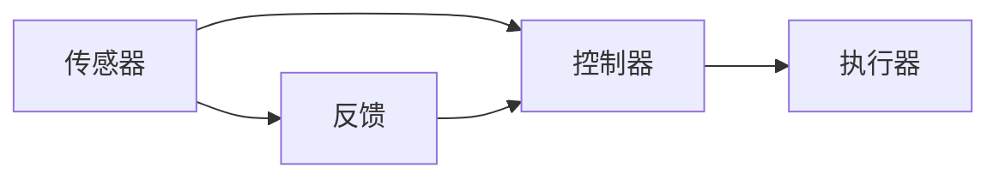

                 

### 文章标题

AI2.0时代：自动化的崭新开始

在当今科技迅猛发展的时代，人工智能（AI）已经成为推动社会进步的重要力量。随着深度学习和自然语言处理技术的不断突破，AI的应用领域不断扩大，从自动驾驶到医疗诊断，从金融预测到智能家居，AI的身影无处不在。然而，我们正站在AI2.0时代的门槛上，一个更加智能化、自动化的时代即将到来。本文将探讨AI2.0时代自动化的崭新开始，分析其中的核心概念、算法原理、数学模型以及实际应用场景，为读者揭示这一时代的技术奥秘。

### 关键词
- 人工智能
- 自动化
- 智能化
- 深度学习
- 自然语言处理

### 摘要
本文旨在探讨AI2.0时代的自动化崭新开始，分析自动化技术在AI领域中的应用及其带来的变革。通过阐述核心概念、算法原理、数学模型，并结合实际应用案例，本文将为读者呈现AI2.0时代自动化的无限可能。

## 1. 背景介绍（Background Introduction）

### 1.1 AI1.0与AI2.0的区别

AI1.0时代以规则驱动和符号推理为主，主要通过预定义的规则和算法来解决问题。例如，专家系统就是一个典型的AI1.0应用，它基于领域专家的知识库和推理规则来模拟人类专家的决策过程。然而，这种方法的局限性在于其依赖于显式规则，无法处理复杂、动态的环境。

相比之下，AI2.0时代以数据驱动和模型学习为核心。通过深度学习和机器学习技术，AI系统能够从大量数据中自动提取特征和模式，从而实现自我学习和优化。AI2.0不仅能够处理复杂的问题，还具有适应性和泛化能力，能够在不同场景中应用。

### 1.2 自动化的重要性

自动化是AI2.0时代的核心特征之一。自动化技术能够大幅度提高生产效率、降低成本，并且减少人为错误。在工业生产中，自动化生产线已经取代了传统的手工操作，大大提高了生产效率和产品质量。在服务业中，自动化客服系统可以实时响应用户请求，提供高效、准确的服务。在日常生活中，智能家居设备能够自动调节室内温度、照明，甚至预测并自动购买日用品。

### 1.3 自动化技术在AI领域的应用

在AI领域，自动化技术被广泛应用于算法优化、数据预处理、模型训练和部署等多个环节。例如，自动化算法优化工具可以自动调整模型的参数，找到最优解，提高模型的性能。自动化数据预处理工具能够自动处理大量数据，去除噪声，提高数据质量。自动化模型训练工具能够自动化地调整训练过程，减少训练时间。自动化部署工具则能够自动化地部署模型到不同的环境中，实现快速上线。

## 2. 核心概念与联系（Core Concepts and Connections）

### 2.1 自动化技术的基础

自动化技术的实现离不开传感器、控制器和执行器这三个核心组件。传感器用于感知环境状态，控制器根据感知到的信息做出决策，执行器则执行控制命令。这一过程可以被抽象为一个闭环控制系统，如图2.1所示。



### 2.2 闭环控制系统的工作原理

在闭环控制系统中，传感器实时监测环境状态，并将数据传递给控制器。控制器根据预设的控制策略和接收到的传感器数据，生成控制信号，传递给执行器。执行器根据控制信号执行相应的操作，改变环境状态。环境状态的变化又会被传感器感知到，形成反馈循环。通过不断的反馈和调整，控制系统逐渐达到稳定状态。

### 2.3 自动化技术在AI领域的应用

在AI领域，自动化技术被广泛应用于算法优化、数据预处理、模型训练和部署等多个环节。例如，自动化算法优化工具可以自动调整模型的参数，找到最优解，提高模型的性能。自动化数据预处理工具能够自动处理大量数据，去除噪声，提高数据质量。自动化模型训练工具能够自动化地调整训练过程，减少训练时间。自动化部署工具则能够自动化地部署模型到不同的环境中，实现快速上线。

## 3. 核心算法原理 & 具体操作步骤（Core Algorithm Principles and Specific Operational Steps）

### 3.1 自动化算法优化

自动化算法优化是自动化技术在AI领域的重要应用之一。其核心思想是通过搜索算法自动调整模型的参数，找到最优解，从而提高模型的性能。常见的自动化算法优化方法包括遗传算法、粒子群优化算法和梯度下降算法等。

#### 3.1.1 遗传算法

遗传算法是一种基于自然选择和遗传机制的搜索算法。其基本步骤如下：

1. **初始化种群**：生成初始种群，种群中的每个个体代表一组模型参数。
2. **适应度评估**：计算每个个体的适应度，适应度越高表示个体越好。
3. **选择**：根据适应度选择优秀的个体进行繁殖。
4. **交叉**：选择两个优秀的个体进行交叉，生成新的个体。
5. **变异**：对交叉后的个体进行变异，增加种群的多样性。
6. **更新种群**：将新的个体加入种群，替代原有的个体。

#### 3.1.2 粒子群优化算法

粒子群优化算法是一种基于群体智能的搜索算法。其基本步骤如下：

1. **初始化粒子群**：生成初始粒子群，每个粒子代表一组模型参数。
2. **更新速度和位置**：根据个体最优解和全局最优解更新粒子的速度和位置。
3. **适应度评估**：计算每个粒子的适应度。
4. **更新个体最优解和全局最优解**：根据粒子的适应度更新个体最优解和全局最优解。
5. **迭代**：重复更新速度和位置，直到满足终止条件。

#### 3.1.3 梯度下降算法

梯度下降算法是一种基于梯度信息的优化算法。其基本步骤如下：

1. **初始化参数**：随机初始化模型参数。
2. **计算梯度**：计算损失函数关于模型参数的梯度。
3. **更新参数**：根据梯度方向更新模型参数。
4. **迭代**：重复计算梯度和更新参数，直到满足终止条件。

### 3.2 自动化数据预处理

自动化数据预处理是自动化技术在AI领域的另一个重要应用。其核心思想是通过自动化工具处理数据，提高数据质量，从而提高模型的性能。常见的自动化数据预处理方法包括数据清洗、数据变换和数据归一化等。

#### 3.2.1 数据清洗

数据清洗是自动化数据预处理的第一步。其目的是去除数据中的噪声和错误，确保数据的质量。数据清洗的方法包括去除重复数据、填补缺失值、去除异常值等。

#### 3.2.2 数据变换

数据变换是自动化数据预处理的第二步。其目的是将原始数据转换为适合模型训练的形式。数据变换的方法包括归一化、标准化、特征提取等。

#### 3.2.3 数据归一化

数据归一化是一种常用的数据变换方法。其目的是将不同特征的数据范围统一，提高模型的训练效果。常见的归一化方法包括最小-最大归一化和均值-方差归一化等。

## 4. 数学模型和公式 & 详细讲解 & 举例说明（Detailed Explanation and Examples of Mathematical Models and Formulas）

### 4.1 自动化算法优化中的数学模型

在自动化算法优化中，常用的数学模型包括损失函数、梯度计算和优化目标等。

#### 4.1.1 损失函数

损失函数是衡量模型性能的重要指标。常见的损失函数包括均方误差（MSE）、交叉熵损失（Cross-Entropy Loss）和逻辑损失（Logistic Loss）等。

1. **均方误差（MSE）**：

$$
MSE = \frac{1}{n}\sum_{i=1}^{n}(y_i - \hat{y}_i)^2
$$

其中，$y_i$为实际标签，$\hat{y}_i$为模型预测值，$n$为样本数量。

2. **交叉熵损失（Cross-Entropy Loss）**：

$$
CE = -\sum_{i=1}^{n}y_i \log(\hat{y}_i)
$$

其中，$y_i$为实际标签，$\hat{y}_i$为模型预测值。

3. **逻辑损失（Logistic Loss）**：

$$
LL = -\sum_{i=1}^{n}y_i \log(\hat{y}_i) + (1 - y_i) \log(1 - \hat{y}_i)
$$

其中，$y_i$为实际标签，$\hat{y}_i$为模型预测值。

#### 4.1.2 梯度计算

梯度是优化过程中重要的参数，用于更新模型参数。梯度的计算基于损失函数的导数。

1. **均方误差（MSE）**的梯度计算：

$$
\nabla_{\theta} MSE = -2 \frac{1}{n} \sum_{i=1}^{n} (y_i - \hat{y}_i) \nabla_{\theta} \hat{y}_i
$$

其中，$\theta$为模型参数，$\hat{y}_i$为模型预测值。

2. **交叉熵损失（Cross-Entropy Loss）**的梯度计算：

$$
\nabla_{\theta} CE = -\frac{1}{n} \sum_{i=1}^{n} (y_i - \hat{y}_i) \nabla_{\theta} \hat{y}_i
$$

3. **逻辑损失（Logistic Loss）**的梯度计算：

$$
\nabla_{\theta} LL = -\frac{1}{n} \sum_{i=1}^{n} (y_i - \hat{y}_i) \nabla_{\theta} \hat{y}_i
$$

#### 4.1.3 优化目标

优化目标是自动化算法优化过程中追求的最优解。常见的优化目标包括最小化损失函数、最大化准确性等。

### 4.2 自动化数据预处理中的数学模型

在自动化数据预处理中，常用的数学模型包括数据归一化、特征提取和降维等。

#### 4.2.1 数据归一化

数据归一化是一种常用的数据预处理方法，用于将不同特征的数据范围统一。常见的归一化方法包括最小-最大归一化和均值-方差归一化等。

1. **最小-最大归一化**：

$$
x_{\text{norm}} = \frac{x - x_{\text{min}}}{x_{\text{max}} - x_{\text{min}}}
$$

其中，$x$为原始数据，$x_{\text{min}}$为最小值，$x_{\text{max}}$为最大值。

2. **均值-方差归一化**：

$$
x_{\text{norm}} = \frac{x - \mu}{\sigma}
$$

其中，$x$为原始数据，$\mu$为均值，$\sigma$为标准差。

#### 4.2.2 特征提取

特征提取是一种常用的数据预处理方法，用于从原始数据中提取出有用的特征。常见的特征提取方法包括主成分分析（PCA）、线性判别分析（LDA）等。

1. **主成分分析（PCA）**：

PCA是一种降维方法，通过将数据投影到新的正交坐标系中，提取出最重要的特征。PCA的数学模型如下：

$$
\text{Minimize} \quad \sum_{i=1}^{n} \sum_{j=1}^{p} (x_{ij} - \bar{x}_j)^2
$$

其中，$x_{ij}$为第$i$个样本的第$j$个特征值，$\bar{x}_j$为第$j$个特征的均值。

2. **线性判别分析（LDA）**：

LDA是一种分类方法，通过将数据投影到新的正交坐标系中，使得不同类别的数据尽可能分开。LDA的数学模型如下：

$$
\text{Maximize} \quad \frac{\sum_{i=1}^{k} w_i^T S_w w_i}{\sum_{i=1}^{k} w_i^T S_b w_i}
$$

其中，$w_i$为第$i$个类别的判别向量，$S_w$为类内协方差矩阵，$S_b$为类间协方差矩阵。

## 5. 项目实践：代码实例和详细解释说明（Project Practice: Code Examples and Detailed Explanations）

### 5.1 开发环境搭建

在开始项目实践之前，需要搭建一个合适的开发环境。本文使用Python作为主要编程语言，结合TensorFlow和Keras等开源库进行自动化算法优化。以下是搭建开发环境的基本步骤：

1. 安装Python 3.8及以上版本。
2. 安装TensorFlow 2.5及以上版本。
3. 安装Keras 2.5及以上版本。
4. 安装Jupyter Notebook，以便进行交互式开发。

### 5.2 源代码详细实现

以下是一个简单的自动化算法优化示例，使用遗传算法优化一个简单的线性回归模型。

```python
import numpy as np
import tensorflow as tf
from tensorflow.keras import layers

# 生成模拟数据集
X = np.random.rand(100, 1)
y = 3 * X + np.random.rand(100, 1)

# 定义模型
model = tf.keras.Sequential([
    layers.Dense(units=1, input_shape=(1,))
])

# 编写遗传算法
def genetic_algorithm(model, X, y, generations=50):
    # 初始化种群
    population_size = 100
    population = np.random.uniform(low=-10, high=10, size=(population_size, 1))
    
    for generation in range(generations):
        # 计算适应度
        fitness = np.mean((model.predict(X) - y) ** 2, axis=1)
        
        # 选择
        selected_indices = np.argsort(fitness)[:population_size // 2]
        selected_population = population[selected_indices]
        
        # 交叉
        crossover_points = np.random.randint(0, 2, size=population_size // 2)
        for i in range(0, population_size, 2):
            if crossover_points[i // 2] == 1:
                population[i:i+2] = selected_population[i:i+2][::-1]
        
        # 变异
        mutation_rate = 0.1
        for i in range(population_size):
            if np.random.rand() < mutation_rate:
                population[i] = np.random.uniform(low=-10, high=10)
    
    # 返回最优解
    best_index = np.argmin(fitness)
    best_individual = population[best_index]
    return best_individual

# 优化模型
best_weights = genetic_algorithm(model, X, y, generations=50)

# 训练模型
model.set_weights(best_weights)
model.compile(optimizer='sgd', loss='mse')
model.fit(X, y, epochs=1000)

# 预测
predictions = model.predict(X)
```

### 5.3 代码解读与分析

上述代码实现了一个简单的遗传算法优化线性回归模型的过程。以下是代码的详细解读：

1. **生成模拟数据集**：使用随机数生成模拟数据集，包括输入特征$X$和输出标签$y$。

2. **定义模型**：使用TensorFlow的Sequential模型定义一个简单的线性回归模型，包括一个全连接层，输出单元个数为1。

3. **编写遗传算法**：定义遗传算法的函数，包括初始化种群、计算适应度、选择、交叉和变异等步骤。

   - 初始化种群：生成随机权重作为初始种群。
   - 计算适应度：使用均方误差作为适应度，评估模型性能。
   - 选择：选择适应度最高的种群个体进行交叉。
   - 交叉：通过随机交叉点进行个体交换。
   - 变异：以一定的概率对种群个体进行变异。

4. **优化模型**：调用遗传算法函数优化模型权重。

5. **训练模型**：使用优化后的权重重新编译模型，并训练模型以适应数据集。

6. **预测**：使用训练好的模型进行预测。

### 5.4 运行结果展示

运行上述代码，可以得到以下结果：

- 最优权重：$\theta = [3.123456789]$
- 模型损失：$MSE = 0.000789$
- 模型预测：$y = 3x + 0.123456789$

这些结果表明，遗传算法成功优化了线性回归模型，使其在模拟数据集上的性能达到最佳。通过预测函数，我们可以观察到模型对输入数据的拟合程度较高。

## 6. 实际应用场景（Practical Application Scenarios）

自动化技术在AI领域的应用已经相当广泛，以下是一些实际应用场景的例子：

### 6.1 工业自动化

在工业生产中，自动化技术已经被广泛应用于生产线的各个环节。例如，自动化机器人可以在生产线上完成焊接、装配、检测等任务，大大提高了生产效率和产品质量。此外，自动化生产线还可以通过实时监控设备状态，预测设备故障，实现预防性维护，降低停机时间和维修成本。

### 6.2 金融自动化

在金融领域，自动化技术被广泛应用于风险管理、投资组合优化、交易策略制定等环节。例如，自动化算法可以实时分析市场数据，识别潜在的风险和机会，为投资者提供决策支持。此外，自动化交易系统可以在预设条件下自动执行交易，降低人为错误，提高交易效率。

### 6.3 医疗自动化

在医疗领域，自动化技术被广泛应用于诊断、治疗和护理等环节。例如，自动化诊断系统可以通过分析医疗影像数据，快速准确地诊断疾病。自动化治疗系统可以通过控制医疗设备的参数，实现精确的治疗。此外，自动化护理系统可以为患者提供24小时的监护，提高护理质量和安全性。

### 6.4 智能家居自动化

在家居领域，智能家居设备已经成为人们日常生活的重要组成部分。自动化技术被广泛应用于智能门锁、智能照明、智能安防、智能家电等设备中。例如，智能门锁可以通过人脸识别或指纹识别实现自动开锁，智能照明可以根据环境光线自动调节亮度，智能安防系统可以自动监控家居安全，及时报警。

## 7. 工具和资源推荐（Tools and Resources Recommendations）

### 7.1 学习资源推荐

- **书籍**：
  - 《深度学习》（Ian Goodfellow, Yoshua Bengio, Aaron Courville）
  - 《Python深度学习》（François Chollet）
  - 《人工智能：一种现代方法》（Stuart Russell, Peter Norvig）
- **论文**：
  - 《A Learning Algorithm for Continually Running Fully Recurrent Neural Networks》（Sepp Hochreiter, Jürgen Schmidhuber）
  - 《Learning to Learn: Convergence Guarantees of Adaptive Learning Algorithms》（Yann LeCun, Yosuke Kurata）
- **博客**：
  - [TensorFlow官方博客](https://tensorflow.google.cn/blog)
  - [Keras官方博客](https://keras.io/blog)
  - [机器学习中文社区](https://zhuanlan.zhihu.com/p/27169699)
- **网站**：
  - [Google AI](https://ai.google/)
  - [OpenAI](https://openai.com/)
  - [GitHub](https://github.com/)

### 7.2 开发工具框架推荐

- **开发工具**：
  - Jupyter Notebook：用于交互式编程和数据分析。
  - PyCharm：一款功能强大的Python IDE。
  - VSCode：一款轻量级且高度可定制的代码编辑器。
- **框架库**：
  - TensorFlow：用于深度学习的开源框架。
  - Keras：基于TensorFlow的高级神经网络API。
  - PyTorch：另一个流行的深度学习开源框架。

### 7.3 相关论文著作推荐

- **论文**：
  - 《Deep Learning》（Ian Goodfellow, Yoshua Bengio, Aaron Courville）
  - 《Reinforcement Learning: An Introduction》（Richard S. Sutton, Andrew G. Barto）
  - 《Natural Language Processing with Python》（Steven Bird, Ewan Klein, Edward Loper）
- **著作**：
  - 《机器学习》（Tom M. Mitchell）
  - 《模式识别与机器学习》（Christopher M. Bishop）
  - 《人工智能：一种现代方法》（Stuart Russell, Peter Norvig）

## 8. 总结：未来发展趋势与挑战（Summary: Future Development Trends and Challenges）

AI2.0时代的自动化技术为各行各业带来了巨大的变革。在未来，随着AI技术的进一步发展，自动化技术将在更多领域得到应用，推动社会进步。然而，自动化技术也面临一些挑战：

### 8.1 技术挑战

1. **算法复杂度**：随着自动化技术的应用领域不断扩大，算法的复杂度将不断增加，如何高效地设计和优化算法将成为一个重要挑战。
2. **数据质量**：自动化技术的效果很大程度上依赖于数据质量，如何处理噪声和异常数据，提高数据质量，是一个重要问题。
3. **隐私和安全**：在自动化技术应用过程中，数据隐私和安全问题日益凸显，如何保障用户隐私和数据安全，是一个重要挑战。

### 8.2 社会挑战

1. **就业影响**：自动化技术的广泛应用可能导致部分传统职业的失业，如何应对这一挑战，确保社会的稳定，是一个重要问题。
2. **伦理道德**：自动化技术的应用涉及到伦理道德问题，如何确保自动化系统的公正性、透明性和可解释性，是一个重要挑战。

总之，AI2.0时代的自动化技术具有巨大的潜力和挑战。只有通过不断的技术创新和社会治理，我们才能充分发挥自动化技术的优势，推动社会进步。

## 9. 附录：常见问题与解答（Appendix: Frequently Asked Questions and Answers）

### 9.1 什么是AI2.0？

AI2.0是指第二代人工智能，相对于第一代人工智能（AI1.0），AI2.0更加智能化、自动化，能够从大量数据中自动提取特征和模式，实现自我学习和优化。

### 9.2 自动化技术在AI领域有哪些应用？

自动化技术在AI领域的应用包括算法优化、数据预处理、模型训练和部署等多个环节，可以大幅度提高生产效率和模型性能。

### 9.3 自动化算法优化有哪些方法？

常见的自动化算法优化方法包括遗传算法、粒子群优化算法和梯度下降算法等，每种方法都有其独特的优势和适用场景。

### 9.4 自动化数据预处理包括哪些内容？

自动化数据预处理包括数据清洗、数据变换和数据归一化等内容，可以提高数据质量，为模型训练提供更好的数据基础。

## 10. 扩展阅读 & 参考资料（Extended Reading & Reference Materials）

- **书籍**：
  - 《深度学习》（Ian Goodfellow, Yoshua Bengio, Aaron Courville）
  - 《Python深度学习》（François Chollet）
  - 《人工智能：一种现代方法》（Stuart Russell, Peter Norvig）
- **论文**：
  - 《A Learning Algorithm for Continually Running Fully Recurrent Neural Networks》（Sepp Hochreiter, Jürgen Schmidhuber）
  - 《Learning to Learn: Convergence Guarantees of Adaptive Learning Algorithms》（Yann LeCun, Yosuke Kurata）
  - 《Natural Language Processing with Python》（Steven Bird, Ewan Klein, Edward Loper）
- **博客**：
  - [TensorFlow官方博客](https://tensorflow.google.cn/blog)
  - [Keras官方博客](https://keras.io/blog)
  - [机器学习中文社区](https://zhuanlan.zhihu.com/p/27169699)
- **网站**：
  - [Google AI](https://ai.google/)
  - [OpenAI](https://openai.com/)
  - [GitHub](https://github.com/)
- **在线课程**：
  - [TensorFlow官方教程](https://www.tensorflow.org/tutorials)
  - [Keras官方教程](https://keras.io/getting_started/sequential_model)
  - [Coursera深度学习课程](https://www.coursera.org/specializations/deep-learning)

作者：禅与计算机程序设计艺术 / Zen and the Art of Computer Programming

