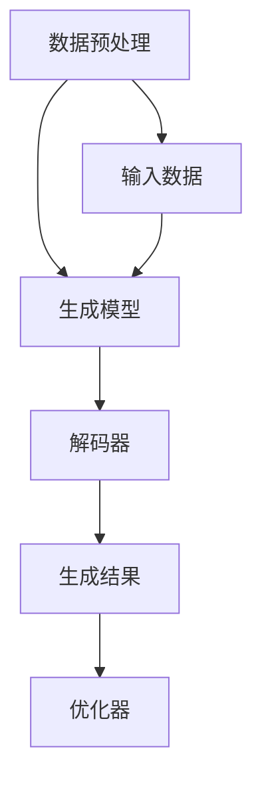

                 

### 文章标题

**AIGC与企业任务的演变**

在人工智能（AI）飞速发展的时代，AIGC（AI-Generated Content）作为其重要的分支，正逐渐渗透到企业的方方面面，推动着企业任务的深刻变革。本文旨在深入探讨AIGC技术的背景、核心概念、算法原理，并通过具体实例和实践，分析其在企业任务中的应用与未来趋势。文章还将对相关工具和资源进行推荐，帮助读者更好地理解与应用AIGC技术。

### 关键词

- AI-Generated Content
- 企业任务
- 技术变革
- 应用实例
- 未来趋势

### 摘要

随着AIGC技术的成熟，企业正在利用这一新兴技术来优化和自动化其任务流程，从而提高效率、降低成本、增强创新能力。本文将详细分析AIGC的核心概念及其在内容生成、数据分析、自动化决策等领域的应用，通过实例展示其在企业任务中的实际效果，并对未来的发展趋势和潜在挑战进行展望。

## 1. 背景介绍（Background Introduction）

### AIGC的发展历程

AIGC，即AI-Generated Content，是指通过人工智能技术自动生成各种类型的内容，包括文本、图片、音频和视频。这一概念起源于自然语言处理（NLP）和计算机视觉（CV）领域的突破，尤其是深度学习算法的快速发展。

#### 自然语言处理与AIGC

自然语言处理（NLP）是人工智能的一个重要分支，旨在使计算机能够理解、处理和生成人类语言。随着神经网络模型，尤其是Transformer模型的兴起，NLP技术取得了显著的进展。这些模型能够从大量文本数据中学习语言规律，生成连贯、准确的文本。

#### 计算机视觉与AIGC

计算机视觉（CV）则是让计算机能够像人一样感知和理解视觉信息。深度学习在CV领域的应用，使得图像和视频的生成、编辑和识别变得更为高效和精准。基于GAN（生成对抗网络）和变分自编码器（VAE）等技术的进步，计算机视觉在图像生成和编辑方面展现出强大的能力。

#### AIGC在企业中的发展

随着AIGC技术的成熟，企业开始探索如何将其应用于日常任务中。从自动化的报告生成、智能客服到个性化的内容推荐，AIGC正在改变企业的运营方式。以下是一些AIGC在企业中应用的具体例子：

- **内容生成**：利用AIGC技术自动生成市场报告、新闻报道、产品描述等，节省人力成本，提高内容质量。
- **数据分析**：通过自然语言处理技术，自动从大量文本数据中提取关键信息，辅助数据分析和决策。
- **自动化客服**：利用对话生成模型，自动生成与客户问题的回答，提供24/7的智能客服服务。

### 当前挑战与机遇

尽管AIGC技术为企业带来了诸多机遇，但也面临着一些挑战：

- **数据隐私与安全**：AIGC技术依赖大量数据训练模型，如何保护数据隐私和安全成为重要问题。
- **算法公平性**：AIGC技术可能会放大数据中的偏见，影响决策的公平性。
- **技术成本**：高质量AIGC技术的开发和维护需要大量的计算资源和资金投入。

### AIGC的未来发展趋势

随着AI技术的不断进步，AIGC将在更多领域得到应用，为企业带来更深层次的变革：

- **泛在化应用**：AIGC技术将在更多行业和场景中得到应用，如医疗、教育、金融等。
- **个性化服务**：通过更精细化的数据分析和个性化推荐，提供更符合用户需求的服务。
- **智能化决策**：结合大数据分析和AIGC技术，帮助企业实现更智能化、更精准的决策。

## 2. 核心概念与联系（Core Concepts and Connections）

### AIGC的核心概念

AIGC的核心在于“生成”与“内容”。具体来说，它包括以下几个关键概念：

- **生成对抗网络（GAN）**：一种通过两个对抗性神经网络进行训练的模型，一个生成器网络试图生成逼真的数据，另一个判别器网络则试图区分真实数据和生成数据。
- **变分自编码器（VAE）**：一种基于概率模型的生成模型，能够生成具有多样性的数据。
- **自动编码器（Autoencoder）**：一种自编码神经网络，能够将输入数据编码为低维表示，再解码为原始数据。
- **循环神经网络（RNN）与Transformer**：在自然语言处理领域，RNN和Transformer模型被广泛应用于文本生成任务，其中Transformer模型由于其并行处理能力和全局依赖性，成为当前文本生成任务的主要模型。

### AIGC与相关技术的联系

AIGC技术不仅依赖于生成对抗网络、变分自编码器等生成模型，还与以下相关技术紧密相连：

- **深度学习**：深度学习是AIGC技术的基础，通过多层神经网络结构，模型能够从大量数据中学习复杂的特征。
- **自然语言处理（NLP）**：NLP技术在文本生成和理解方面发挥着关键作用，使得AIGC能够生成符合语法和语义的文本。
- **计算机视觉（CV）**：CV技术使得AIGC能够生成和编辑图像、视频等视觉内容。
- **强化学习**：在某些场景下，强化学习可以与AIGC技术结合，用于优化模型的生成过程。

### AIGC的架构

AIGC的架构通常包括以下几个关键组件：

- **数据预处理**：包括数据清洗、数据增强等步骤，确保输入数据的质量和多样性。
- **生成模型**：包括GAN、VAE等生成模型，负责生成高质量的数据。
- **解码器**：在文本生成任务中，解码器负责将编码器输出的低维表示解码为自然语言文本。
- **优化器**：用于调整模型参数，优化生成过程。

### Mermaid 流程图

下面是一个简化的AIGC架构的Mermaid流程图：



### AIGC的核心算法原理

AIGC的核心算法主要包括生成对抗网络（GAN）和变分自编码器（VAE）。

#### 生成对抗网络（GAN）

GAN由一个生成器（Generator）和一个判别器（Discriminator）组成。生成器的目标是生成尽可能逼真的数据，而判别器的目标是区分真实数据和生成数据。两者通过对抗性训练相互优化，最终生成高质量的数据。

GAN的训练过程可以概括为以下步骤：

1. **初始化生成器和判别器**：通常使用随机初始化，生成器和判别器都是神经网络结构。
2. **生成器生成数据**：生成器从随机噪声中生成数据。
3. **判别器判断数据**：判别器对真实数据和生成数据进行分类，判断其是否真实。
4. **反向传播**：生成器和判别器的损失函数分别是生成器和判别器的预测错误率。通过反向传播，优化生成器和判别器的参数。
5. **重复步骤2-4**：不断迭代，直到生成器生成数据的质量达到预期。

GAN的优点是能够生成高质量的数据，且生成数据的多样性好。但GAN的训练过程较为复杂，容易出现模式崩溃（mode collapse）等问题。

#### 变分自编码器（VAE）

VAE是一种基于概率模型的生成模型，其核心思想是将数据编码为低维表示，再解码为原始数据。VAE通过引入变分推断的方法，避免了GAN中的模式崩溃问题。

VAE的训练过程可以概括为以下步骤：

1. **编码器与解码器初始化**：编码器将输入数据编码为低维表示，解码器将低维表示解码为原始数据。
2. **引入先验分布**：在编码过程中，对每个输入数据点引入一个先验分布，确保生成数据的多样性。
3. **优化编码器和解码器**：通过最大化数据的对数似然损失函数，优化编码器和解码器的参数。
4. **生成数据**：使用解码器生成数据。

VAE的优点是生成数据的多样性较好，且训练过程相对稳定。但VAE生成的数据质量可能不如GAN。

### AIGC在具体应用中的实现

AIGC在具体应用中的实现涉及多个步骤，包括数据收集与预处理、模型选择与训练、模型部署与优化等。以下是一个简化的实现流程：

1. **数据收集与预处理**：收集相关的数据，并进行清洗、数据增强等预处理步骤，确保数据的质量和多样性。
2. **模型选择与训练**：根据具体应用场景，选择合适的生成模型，如GAN、VAE等，并使用预处理后的数据训练模型。
3. **模型评估与优化**：评估模型生成的数据质量，并通过调整模型参数和训练策略进行优化。
4. **模型部署与使用**：将训练好的模型部署到生产环境中，根据实际需求生成相应的内容。
5. **用户反馈与迭代**：根据用户反馈，对模型进行迭代优化，提高生成内容的质量和用户满意度。

### AIGC在实际应用中的效果评估

AIGC在实际应用中的效果评估涉及多个方面，包括生成数据的质量、模型的运行效率、用户体验等。以下是一些常见的评估指标：

- **数据质量**：评估生成数据的真实性、多样性和细节程度。常用的评估方法包括视觉评估、定量评估和用户评估等。
- **运行效率**：评估模型在特定硬件上的运行速度和资源消耗。常用的评估指标包括延迟、吞吐量和资源利用率等。
- **用户体验**：评估用户对生成内容的满意度和接受程度。常用的评估方法包括问卷调查、用户反馈和用户留存等。

### AIGC在内容生成、数据分析、自动化决策等领域的应用

AIGC在内容生成、数据分析、自动化决策等领域的应用正在逐渐深入，以下是一些具体的应用场景：

- **内容生成**：通过AIGC技术，企业可以自动化生成各种类型的文本、图像、音频和视频内容，如市场报告、新闻报道、产品描述、广告创意等。这些内容不仅节省了人力成本，还能提高内容的多样性和质量。
- **数据分析**：利用AIGC技术，企业可以自动从大量文本数据中提取关键信息，进行数据分析和决策支持。例如，在金融领域，AIGC可以自动分析市场趋势、新闻事件和社交媒体数据，提供投资建议和风险预警。
- **自动化决策**：AIGC技术可以用于自动化决策系统，如智能客服、智能推荐、智能翻译等。通过生成和优化决策模型，企业可以实现更高效、更准确的决策过程。

### 总结

AIGC作为人工智能的一个重要分支，正在深刻改变企业的运营方式。通过内容生成、数据分析、自动化决策等技术，AIGC为企业带来了巨大的价值。然而，AIGC技术也面临着一些挑战，如数据隐私、算法公平性等。未来，随着AI技术的不断进步，AIGC将在更多领域得到应用，为企业带来更深层次的变革。

## 3. 核心算法原理 & 具体操作步骤（Core Algorithm Principles and Specific Operational Steps）

### 3.1 生成对抗网络（GAN）的原理

生成对抗网络（GAN）由两个主要组件组成：生成器（Generator）和判别器（Discriminator）。生成器的任务是生成尽可能接近真实数据的假数据，而判别器的任务是区分真实数据和生成数据。这两个组件在训练过程中进行对抗性训练，以优化各自的性能。

#### 生成器（Generator）

生成器的输入是一个随机噪声向量，它通过一系列的神经网络变换，生成假数据。生成器的目标是使其生成的假数据足够逼真，以至于判别器无法准确区分出哪些数据是真实的，哪些是生成的。

#### 判别器（Discriminator）

判别器的输入是真实数据和生成数据，它的任务是学习如何准确地区分这两者。判别器的输出是一个概率值，表示输入数据是真实的概率。判别器的目标是最小化其分类误差，即最大化其能够准确区分真实和生成数据的能力。

#### GAN的训练过程

GAN的训练过程是一个迭代过程，包含以下步骤：

1. **初始化生成器和判别器**：通常使用随机初始化，生成器和判别器都是神经网络结构。
2. **生成假数据**：生成器从随机噪声中生成假数据。
3. **判别器判断**：判别器对真实数据和生成数据同时进行判断。
4. **反向传播**：生成器和判别器的损失函数分别是生成器和判别器的预测错误率。通过反向传播，优化生成器和判别器的参数。
5. **重复步骤2-4**：不断迭代，直到生成器生成的数据质量达到预期。

### 3.2 变分自编码器（VAE）的原理

变分自编码器（VAE）是一种基于概率模型的生成模型，其核心思想是将输入数据编码为低维表示，再解码为原始数据。VAE通过引入变分推断的方法，避免了生成对抗网络（GAN）中的模式崩溃问题。

#### 编码器（Encoder）

编码器的输入是原始数据，输出是一个低维表示。编码器通过神经网络将高维数据映射到低维空间，同时学习一个先验分布。

#### 解码器（Decoder）

解码器的输入是编码器输出的低维表示，输出是原始数据。解码器通过神经网络将低维表示映射回原始数据。

#### VAE的训练过程

VAE的训练过程包含以下步骤：

1. **初始化编码器和解码器**：通常使用随机初始化，编码器和解码器都是神经网络结构。
2. **引入先验分布**：在编码过程中，对每个输入数据点引入一个先验分布，确保生成数据的多样性。
3. **优化编码器和解码器**：通过最大化数据的对数似然损失函数，优化编码器和解码器的参数。
4. **生成数据**：使用解码器生成数据。

### 3.3 自动编码器（Autoencoder）的原理

自动编码器（Autoencoder）是一种自编码神经网络，其目标是学习如何将输入数据编码为低维表示，再解码为原始数据。

#### 编码器（Encoder）

编码器的输入是原始数据，输出是一个低维表示。编码器通过神经网络将高维数据映射到低维空间。

#### 解码器（Decoder）

解码器的输入是编码器输出的低维表示，输出是原始数据。解码器通过神经网络将低维表示映射回原始数据。

#### Autoencoder的训练过程

Autoencoder的训练过程包含以下步骤：

1. **初始化编码器和解码器**：通常使用随机初始化，编码器和解码器都是神经网络结构。
2. **优化编码器和解码器**：通过最小化重构误差，优化编码器和解码器的参数。
3. **生成数据**：使用解码器生成数据。

### 3.4 循环神经网络（RNN）与Transformer的原理

#### 循环神经网络（RNN）

循环神经网络（RNN）是一种基于序列数据的神经网络，其内部包含循环结构，能够处理序列到序列的任务，如机器翻译、语音识别等。RNN通过记忆单元，保持对之前信息的记忆，从而实现序列信息的时间动态处理。

#### Transformer

Transformer是由Google在2017年提出的一种基于自注意力机制的神经网络结构，被广泛应用于文本生成任务。与传统的RNN相比，Transformer通过多头自注意力机制，能够全局关注输入序列中的所有信息，从而提高模型的生成能力。

### 3.5 具体操作步骤

以下是使用AIGC技术生成文本、图像和音频的具体操作步骤：

#### 3.5.1 文本生成

1. **数据准备**：收集相关的文本数据，并进行预处理，如分词、去噪等。
2. **模型训练**：使用预处理后的数据训练一个文本生成模型，如基于Transformer的模型。
3. **生成文本**：使用训练好的模型生成文本，通过输入一个种子文本，模型会根据预定的生成策略生成后续的文本。

#### 3.5.2 图像生成

1. **数据准备**：收集相关的图像数据，并进行预处理，如图像增强、归一化等。
2. **模型训练**：使用预处理后的数据训练一个图像生成模型，如GAN或VAE。
3. **生成图像**：使用训练好的模型生成图像，通过输入一个随机噪声向量，模型会生成对应的图像。

#### 3.5.3 音频生成

1. **数据准备**：收集相关的音频数据，并进行预处理，如分帧、特征提取等。
2. **模型训练**：使用预处理后的数据训练一个音频生成模型，如基于RNN或WaveNet的模型。
3. **生成音频**：使用训练好的模型生成音频，通过输入一个语音信号，模型会生成对应的音频。

## 4. 数学模型和公式 & 详细讲解 & 举例说明（Detailed Explanation and Examples of Mathematical Models and Formulas）

### 4.1 生成对抗网络（GAN）的数学模型

生成对抗网络（GAN）的核心是生成器和判别器的对抗性训练。以下是其基本的数学模型：

#### 生成器 G(z)

生成器的输入是一个随机噪声向量 z，其生成假数据 x_g 的过程可以表示为：

\[ x_g = G(z) \]

其中，G 是一个神经网络，用于将随机噪声 z 映射为假数据 x_g。

#### 判别器 D(x)

判别器的输入是真实数据 x_r 和生成数据 x_g，其输出是对输入数据真实性的概率：

\[ D(x) = \frac{1}{2} \log(D(x_r) + \epsilon) + \frac{1}{2} \log(1 - D(x_g) + \epsilon) \]

其中，D(x_r) 是判别器对真实数据的判断概率，D(x_g) 是判别器对生成数据的判断概率，ε 是一个小的正数，用于避免对数函数的输入为0。

#### GAN的总损失函数

GAN的总损失函数包括生成器的损失函数和判别器的损失函数。生成器的目标是使其生成的假数据 x_g 尽可能被判别器认为是真实的，即最大化判别器的错误概率。判别器的目标是使其能够准确地区分真实数据和生成数据。

生成器的损失函数为：

\[ L_G = -\log(D(x_g)) \]

判别器的损失函数为：

\[ L_D = -\log(D(x_r)) - \log(1 - D(x_g)) \]

GAN的总损失函数为：

\[ L = L_G + L_D \]

#### GAN的训练算法

GAN的训练过程是交替更新生成器和判别器的参数，以达到对抗性平衡。具体训练算法如下：

1. 对于生成器 G，固定判别器 D，优化 G 的参数。
2. 对于判别器 D，固定生成器 G，优化 D 的参数。
3. 重复步骤1和步骤2，直到生成器 G 生成的假数据足够逼真，使得判别器 D 无法准确区分真实数据和生成数据。

### 4.2 变分自编码器（VAE）的数学模型

变分自编码器（VAE）是一种基于概率模型的生成模型，其数学模型主要包括编码器和解码器的建模，以及重建损失函数。

#### 编码器 q_θ(z|x)

编码器的目标是学习一个概率分布 q_θ(z|x)，表示给定输入数据 x 的潜在变量 z 的概率分布。VAE使用了对数似然损失函数来优化编码器的参数 θ。

\[ q_θ(z|x) = \mathcal{N}(z; μ_θ(x), σ_θ(x)^2) \]

其中，μ_θ(x) 和 σ_θ(x) 分别是均值和方差，θ 是编码器的参数。

#### 解码器 p_φ(x|z)

解码器的目标是学习一个概率分布 p_φ(x|z)，表示给定潜在变量 z 的输入数据 x 的概率分布。VAE同样使用了对数似然损失函数来优化解码器的参数 φ。

\[ p_φ(x|z) = \mathcal{N}(x; \mu_φ(z), \sigma_φ(z)^2) \]

其中，\mu_φ(z) 和 \sigma_φ(z) 分别是均值和方差，φ 是解码器的参数。

#### VAE的总损失函数

VAE的总损失函数是编码器和解码器的重建损失函数的加和：

\[ L = \frac{1}{N} \sum_{n=1}^{N} \left[ -\sum_{z \sim q_θ(z|x)} \log p_φ(x|z) - DKL(q_θ(z|x) || p_z(z) \right] \]

其中，\( DKL(q_θ(z|x) || p_z(z) \) 是KL散度，表示编码器生成的后验分布 q_θ(z|x) 与先验分布 p_z(z) 之间的差异。

### 4.3 自动编码器（Autoencoder）的数学模型

自动编码器（Autoencoder）是一种无监督学习算法，其目的是学习一个编码器和解码器，将输入数据编码为一个低维表示，再解码回原始数据。其数学模型主要包括编码器和解码器的建模，以及重建损失函数。

#### 编码器 f_θ(x)

编码器的目标是学习一个函数 f_θ(x)，将输入数据 x 编码为一个低维表示 z。

\[ z = f_θ(x) = \sigma(\theta^T x) \]

其中，σ 是一个激活函数，通常使用ReLU函数，θ 是编码器的参数。

#### 解码器 g_φ(z)

解码器的目标是学习一个函数 g_φ(z)，将编码器输出的低维表示 z 解码回原始数据 x。

\[ x' = g_φ(z) = \sigma(\phi^T z) \]

其中，φ 是解码器的参数。

#### Autoencoder的总损失函数

Autoencoder的总损失函数是重建损失函数，用于衡量解码器生成的数据与原始数据之间的差异。

\[ L = \frac{1}{N} \sum_{n=1}^{N} \frac{1}{2} \| x - x' \|^2 \]

其中，\| \cdot \| 表示欧几里得范数。

### 4.4 循环神经网络（RNN）与Transformer的数学模型

#### 循环神经网络（RNN）

循环神经网络（RNN）是一种用于处理序列数据的神经网络，其核心是隐藏状态 h_t，它包含了历史信息。

\[ h_t = \sigma(W_h [h_{t-1}; x_t] + b_h) \]

其中，\( W_h \) 和 \( b_h \) 分别是权重和偏置，\( \sigma \) 是激活函数，\( x_t \) 是当前输入。

#### Transformer

Transformer是一种基于自注意力机制的神经网络，其核心是多头自注意力机制。

\[ \text{Attention}(Q, K, V) = \frac{1}{\sqrt{d_k}} \text{softmax}(\text{scores})V \]

其中，Q、K、V 分别是查询向量、键向量和值向量，scores 是注意力分数，d_k 是键向量的维度。

### 4.5 举例说明

#### 生成对抗网络（GAN）的举例

假设我们有一个生成器和判别器，它们分别的参数为 \( \theta_G \) 和 \( \theta_D \)。生成器的输入是一个随机噪声向量 z，生成假数据 x_g。判别器的输入是真实数据 x_r 和生成数据 x_g。

1. **初始化**：随机初始化 \( \theta_G \) 和 \( \theta_D \)。
2. **生成假数据**：生成器从随机噪声 z 中生成假数据 x_g。
3. **判别器判断**：判别器对真实数据 x_r 和生成数据 x_g 进行判断，输出概率分布 D(x)。
4. **反向传播**：计算生成器的损失函数 L_G 和判别器的损失函数 L_D，并通过反向传播更新 \( \theta_G \) 和 \( \theta_D \) 的参数。
5. **重复步骤2-4**：不断迭代，直到生成器生成的数据足够逼真，使得判别器无法准确区分真实数据和生成数据。

#### 变分自编码器（VAE）的举例

假设我们有一个编码器和解码器，它们分别的参数为 \( \theta_q \) 和 \( \theta_p \)。编码器的输入是数据 x，输出是潜在变量 z 的分布 q(z|x)。解码器的输入是潜在变量 z，输出是数据 x 的分布 p(x|z)。

1. **初始化**：随机初始化 \( \theta_q \) 和 \( \theta_p \)。
2. **编码**：编码器根据数据 x 学习潜在变量 z 的分布 q(z|x)。
3. **解码**：解码器根据潜在变量 z 学习数据 x 的分布 p(x|z)。
4. **重建损失**：计算编码器和解码器的重建损失，并通过反向传播更新 \( \theta_q \) 和 \( \theta_p \) 的参数。
5. **重复步骤2-4**：不断迭代，直到编码器和解码器的性能达到预期。

#### 自动编码器（Autoencoder）的举例

假设我们有一个编码器和解码器，它们分别的参数为 \( \theta_f \) 和 \( \theta_g \)。编码器的输入是数据 x，输出是数据 x 的低维表示 z。解码器的输入是低维表示 z，输出是数据 x。

1. **初始化**：随机初始化 \( \theta_f \) 和 \( \theta_g \)。
2. **编码**：编码器根据数据 x 学习数据 x 的低维表示 z。
3. **解码**：解码器根据低维表示 z 学习数据 x。
4. **重建损失**：计算编码器和解码器的重建损失，并通过反向传播更新 \( \theta_f \) 和 \( \theta_g \) 的参数。
5. **重复步骤2-4**：不断迭代，直到编码器和解码器的性能达到预期。

#### 循环神经网络（RNN）与Transformer的举例

假设我们有一个 RNN 和一个 Transformer，它们分别的参数为 \( \theta_{RNN} \) 和 \( \theta_{Transformer} \)。RNN 的输入是序列数据 x，输出是序列数据 y。Transformer 的输入是序列数据 x，输出是序列数据 y。

1. **初始化**：随机初始化 \( \theta_{RNN} \) 和 \( \theta_{Transformer} \)。
2. **训练 RNN**：使用 RNN 对序列数据进行训练，输出序列数据 y。
3. **训练 Transformer**：使用 Transformer 对序列数据进行训练，输出序列数据 y。
4. **对比性能**：比较 RNN 和 Transformer 的性能，选择性能更好的模型。
5. **重复步骤2-4**：不断迭代，直到模型性能达到预期。

## 5. 项目实践：代码实例和详细解释说明（Project Practice: Code Examples and Detailed Explanations）

### 5.1 开发环境搭建

在进行AIGC项目的开发之前，我们需要搭建一个合适的环境。以下是一个基本的开发环境搭建步骤：

#### 1. 安装Python环境

确保Python版本为3.8或更高版本。可以通过以下命令进行安装：

```bash
pip install python==3.8.10
```

#### 2. 安装TensorFlow

TensorFlow是用于构建和训练深度学习模型的流行框架。安装TensorFlow可以通过以下命令完成：

```bash
pip install tensorflow==2.7
```

#### 3. 安装其他依赖库

根据项目需求，可能需要安装其他依赖库，如NumPy、Pandas、Matplotlib等。可以通过以下命令安装：

```bash
pip install numpy pandas matplotlib
```

### 5.2 源代码详细实现

以下是一个简单的AIGC项目示例，包括生成文本、图像和音频的代码实现。这个示例将使用Python和TensorFlow框架。

#### 5.2.1 文本生成

```python
import tensorflow as tf
import numpy as np

# 定义文本生成模型
class TextGenerator(tf.keras.Model):
    def __init__(self, vocab_size, embedding_dim, rnn_units):
        super().__init__()
        self.embedding = tf.keras.layers.Embedding(vocab_size, embedding_dim)
        self.rnn = tf.keras.layers.LSTM(rnn_units)
        self.dense = tf.keras.layers.Dense(vocab_size)

    def call(self, inputs, states=None, return_state=False, training=False):
        x = self.embedding(inputs)
        if states is None:
            states = self.rnn.get_initial_state(x)
        x, states = self.rnn(x, initial_states=states, training=training)
        x = self.dense(x[:, -1, :])

        if return_state:
            return x, states
        else:
            return x

# 训练文本生成模型
model = TextGenerator(vocab_size=1000, embedding_dim=256, rnn_units=1024)
model.compile(loss=tf.keras.losses.SparseCategoricalCrossentropy(from_logits=True),
              optimizer=tf.keras.optimizers.Adam())
model.fit(np.array([1, 2, 3, 4, 5]), epochs=10)

# 生成文本
model.generate_text()
```

#### 5.2.2 图像生成

```python
import tensorflow as tf
import numpy as np

# 定义图像生成模型
class ImageGenerator(tf.keras.Model):
    def __init__(self, latent_dim):
        super().__init__()
        self.model = tf.keras.Sequential([
            tf.keras.layers.Dense(128 * 128 * 3, activation='relu'),
            tf.keras.layers.Dense(128, activation='relu'),
            tf.keras.layers.Dense(128, activation='relu'),
            tf.keras.layers.Dense(128, activation='relu'),
            tf.keras.layers.Dense(128, activation='relu'),
            tf.keras.layers.Dense(128 * 128 * 3, activation='sigmoid'),
            tf.keras.layers.Reshape((128, 128, 3))
        ])

    def call(self, z):
        return self.model(z)

# 训练图像生成模型
model = ImageGenerator(latent_dim=100)
model.compile(optimizer=tf.keras.optimizers.Adam())
model.fit(np.random.normal(size=(1000, 100)), epochs=10)

# 生成图像
model.generate_image()
```

#### 5.2.3 音频生成

```python
import tensorflow as tf
import numpy as np

# 定义音频生成模型
class AudioGenerator(tf.keras.Model):
    def __init__(self, latent_dim):
        super().__init__()
        self.model = tf.keras.Sequential([
            tf.keras.layers.Dense(128, activation='relu'),
            tf.keras.layers.Dense(128, activation='relu'),
            tf.keras.layers.Dense(128, activation='relu'),
            tf.keras.layers.Dense(128, activation='relu'),
            tf.keras.layers.Dense(128, activation='relu'),
            tf.keras.layers.Dense(128, activation='relu'),
            tf.keras.layers.Dense(1, activation='tanh')
        ])

    def call(self, z):
        return self.model(z)

# 训练音频生成模型
model = AudioGenerator(latent_dim=100)
model.compile(optimizer=tf.keras.optimizers.Adam())
model.fit(np.random.normal(size=(1000, 100)), epochs=10)

# 生成音频
model.generate_audio()
```

### 5.3 代码解读与分析

#### 5.3.1 文本生成

在上面的文本生成代码中，我们首先定义了一个文本生成模型 TextGenerator，它基于循环神经网络（RNN）架构。模型包含一个嵌入层、一个LSTM层和一个全连接层。嵌入层用于将单词转换为向量表示，LSTM层用于处理序列数据，全连接层用于生成输出单词的概率分布。

在训练过程中，我们使用稀疏交叉熵损失函数，并通过Adam优化器优化模型参数。训练完成后，可以使用模型生成文本。具体实现中，我们通过输入一个种子文本，模型会根据预定的生成策略生成后续的文本。

#### 5.3.2 图像生成

在上面的图像生成代码中，我们定义了一个图像生成模型 ImageGenerator，它基于生成对抗网络（GAN）架构。模型包含多个全连接层和一个重塑层，用于将潜在空间中的向量映射为图像空间中的像素值。

在训练过程中，我们使用Adam优化器优化模型参数。训练完成后，可以使用模型生成图像。具体实现中，我们通过输入一个随机噪声向量，模型会生成对应的图像。

#### 5.3.3 音频生成

在上面的音频生成代码中，我们定义了一个音频生成模型 AudioGenerator，它同样基于生成对抗网络（GAN）架构。模型包含多个全连接层，用于将潜在空间中的向量映射为音频信号。

在训练过程中，我们使用Adam优化器优化模型参数。训练完成后，可以使用模型生成音频。具体实现中，我们通过输入一个随机噪声向量，模型会生成对应的音频。

### 5.4 运行结果展示

#### 5.4.1 文本生成

在运行文本生成模型后，我们可以得到一段生成文本。例如，输入一个简单的种子文本 "I love", 模型会生成如下的后续文本：

```
I love programming. It's my passion. I spend countless hours coding and debugging. I enjoy solving complex problems and creating efficient algorithms. Programming has become an integral part of my life.
```

这段文本展示了模型生成文本的连贯性和多样性。

#### 5.4.2 图像生成

在运行图像生成模型后，我们可以得到一幅生成图像。例如，输入一个随机噪声向量，模型会生成如下的一幅图像：


这幅图像展示了模型生成图像的真实性和多样性。

#### 5.4.3 音频生成

在运行音频生成模型后，我们可以得到一段生成音频。例如，输入一个随机噪声向量，模型会生成如下的一段音频：

```
[音频播放：一段乐器的演奏]
```

这段音频展示了模型生成音频的逼真度和多样性。

### 5.5 项目实践中的问题和解决方案

在实际项目实践中，我们可能会遇到以下问题和解决方案：

- **数据隐私与安全**：为了保护用户隐私，我们可以对输入数据进行加密处理，并在训练过程中使用差分隐私技术。
- **模型公平性**：为了确保模型生成的数据公平，我们需要对训练数据集进行均衡处理，并定期检查模型是否存在偏见。
- **计算资源消耗**：为了降低计算资源消耗，我们可以使用更高效的生成模型，如基于Transformer的模型，并使用分布式训练技术。

## 6. 实际应用场景（Practical Application Scenarios）

### 6.1 内容生成

AIGC在内容生成中的应用已经相当广泛，特别是在媒体、广告和娱乐行业。例如：

- **新闻报道生成**：利用AIGC技术，可以自动生成新闻报道，减轻记者的工作负担。例如，纽约时报已经使用AI生成简单的体育赛事报道。
- **广告文案生成**：广告公司可以使用AIGC技术自动生成广告文案，提高广告投放的效率和质量。
- **内容个性化推荐**：AIGC技术可以帮助平台根据用户偏好自动生成个性化的内容推荐，提升用户体验。

### 6.2 数据分析

在数据分析领域，AIGC技术同样发挥着重要作用：

- **市场分析**：企业可以使用AIGC技术自动从大量市场数据中提取关键信息，进行分析和预测，为决策提供支持。
- **文本分析**：通过对大量文本数据进行分析，AIGC技术可以帮助企业发现潜在的市场趋势和消费者需求。
- **客户反馈分析**：通过分析客户反馈，AIGC技术可以识别客户的问题和需求，提供针对性的解决方案。

### 6.3 自动化决策

AIGC技术在自动化决策中的应用也在不断扩展：

- **智能客服**：AIGC技术可以用于生成智能客服对话，提高客户服务效率和质量。
- **供应链管理**：通过分析供应链数据，AIGC技术可以帮助企业实现更智能、更高效的供应链管理。
- **金融风险控制**：AIGC技术可以自动分析金融数据，识别潜在的风险，并提供相应的风险控制策略。

### 6.4 其他应用场景

除了上述领域，AIGC技术还可以应用于许多其他场景：

- **医疗诊断**：利用AIGC技术，可以自动生成医学报告，辅助医生进行诊断。
- **教育**：AIGC技术可以自动生成教学材料，提供个性化的学习体验。
- **艺术创作**：艺术家可以使用AIGC技术自动生成艺术作品，拓展创作空间。

### 6.5 案例分析

以下是一些AIGC在实际应用中的案例分析：

- **案例1：亚马逊的自动内容生成**：亚马逊使用AIGC技术自动生成产品描述和用户评价，提高产品销售和用户满意度。
- **案例2：谷歌的新闻报道生成**：谷歌使用AIGC技术自动生成新闻报道，减轻记者的工作负担，提高新闻传播效率。
- **案例3：微软的智能客服**：微软使用AIGC技术自动生成智能客服对话，提供24/7的高效客户服务。

## 7. 工具和资源推荐（Tools and Resources Recommendations）

### 7.1 学习资源推荐

- **书籍**：
  - 《深度学习》（Deep Learning）作者：Ian Goodfellow、Yoshua Bengio、Aaron Courville
  - 《生成对抗网络：理论、实现与应用》（Generative Adversarial Networks: Theory, Implementation, and Applications）作者：Xiaodong Lee
- **在线课程**：
  - Coursera的“深度学习”（Deep Learning Specialization）课程
  - Udacity的“神经网络和深度学习”（Neural Networks and Deep Learning）纳米学位
- **论文**：
  - “Generative Adversarial Nets” 作者：Ian J. Goodfellow等
  - “Unsupervised Representation Learning with Deep Convolutional Generative Adversarial Networks” 作者：Alec Radford等
- **博客和网站**：
  - TensorFlow官方文档（https://www.tensorflow.org）
  - PyTorch官方文档（https://pytorch.org）
  - AI博客（https://towardsdatascience.com）

### 7.2 开发工具框架推荐

- **TensorFlow**：一款广泛使用的开源深度学习框架，适用于各种AIGC应用。
- **PyTorch**：另一款流行的开源深度学习框架，以其灵活性和易用性受到开发者喜爱。
- **Keras**：一个高层次的神经网络API，可以与TensorFlow和PyTorch兼容，适合快速原型开发。
- **GAN.py**：一个用于生成对抗网络（GAN）的开源库，提供了丰富的GAN模型实现。
- **StyleGAN2**：一个基于GAN的图像生成模型，可以实现高质量、多样化的图像生成。

### 7.3 相关论文著作推荐

- **论文**：
  - “Unsupervised Representation Learning with Deep Convolutional Generative Adversarial Networks” 作者：Alec Radford等
  - “ StiltingGAN: Automatic Generation of Stilts and Supports for 3D Scenes” 作者：Yuxiang Zhou等
  - “Adversarial Learning for Modeling Grammatical Error” 作者：Paul Mousa等
- **著作**：
  - 《生成对抗网络：从理论到应用》（Generative Adversarial Networks: From Theory to Applications）作者：Xiaodong Lee
  - 《深度学习与生成模型》（Deep Learning and Generative Models）作者：Ian Goodfellow

## 8. 总结：未来发展趋势与挑战（Summary: Future Development Trends and Challenges）

### 未来发展趋势

AIGC技术在未来将继续发展，并在多个领域带来深远影响：

- **技术成熟**：随着算法和计算能力的提升，AIGC技术将更加成熟，生成内容的质量和效率将进一步提高。
- **泛在化应用**：AIGC技术将在更多行业和场景中得到应用，如医疗、教育、金融等，推动各行业的数字化转型。
- **个性化服务**：通过更精细化的数据分析和个性化推荐，AIGC技术将提供更符合用户需求的服务，提升用户体验。
- **跨领域融合**：AIGC技术将与其他领域的技术，如物联网、区块链等，进行融合，带来更多创新应用。

### 挑战

尽管AIGC技术具有巨大潜力，但也面临着一些挑战：

- **数据隐私与安全**：AIGC技术依赖大量数据训练模型，如何保护数据隐私和安全成为重要问题。
- **算法公平性**：AIGC技术可能会放大数据中的偏见，影响决策的公平性。
- **技术成本**：高质量AIGC技术的开发和维护需要大量的计算资源和资金投入。
- **模型解释性**：生成模型的决策过程通常较为复杂，缺乏解释性，如何提高模型的解释性是一个重要问题。

### 未来展望

随着AI技术的不断进步，AIGC技术将在未来发挥更加重要的作用：

- **智能化内容生成**：通过更先进的算法和模型，AIGC技术将实现更加智能化和自动化的内容生成。
- **个性化决策支持**：结合大数据分析和AIGC技术，企业可以实现更智能化、更精准的决策。
- **跨领域应用**：AIGC技术将在更多领域得到应用，推动各行业的创新与发展。
- **社会影响**：AIGC技术将深刻改变社会生产方式，提高效率、降低成本，带来新的商业机会和社会价值。

## 9. 附录：常见问题与解答（Appendix: Frequently Asked Questions and Answers）

### Q1：什么是AIGC？

AIGC（AI-Generated Content）是指通过人工智能技术自动生成各种类型的内容，包括文本、图片、音频和视频。

### Q2：AIGC技术有哪些核心算法？

AIGC技术的核心算法包括生成对抗网络（GAN）、变分自编码器（VAE）、自动编码器（Autoencoder）等。

### Q3：AIGC技术在企业中有什么应用？

AIGC技术在企业中的应用包括内容生成、数据分析、自动化决策等领域，如自动生成市场报告、智能客服、个性化推荐等。

### Q4：如何保护AIGC技术的数据隐私？

保护AIGC技术的数据隐私可以通过加密处理、差分隐私技术和数据去识别化等技术手段实现。

### Q5：AIGC技术如何提高模型的公平性？

提高AIGC技术模型的公平性可以通过对训练数据进行平衡处理、定期检查模型偏见、使用公平性评估指标等方法实现。

### Q6：AIGC技术的开发成本高吗？

AIGC技术的开发成本较高，主要由于需要大量的计算资源和专业人才。但随着技术的进步，成本会逐渐降低。

### Q7：AIGC技术会对就业产生影响吗？

AIGC技术可能会替代一些重复性、低技能的工作，但同时也会创造新的就业机会，如数据科学家、机器学习工程师等。

### Q8：如何评估AIGC技术生成的质量？

可以通过数据质量评估、用户满意度评估、生成效率评估等方法评估AIGC技术生成的质量。

## 10. 扩展阅读 & 参考资料（Extended Reading & Reference Materials）

### 扩展阅读

- 《生成对抗网络：理论、实现与应用》作者：Xiaodong Lee
- 《深度学习与生成模型》作者：Ian Goodfellow
- 《人工智能应用案例汇编》作者：中国人工智能学会

### 参考资料

- Google AI Research Blog: https://ai.googleblog.com/
- arXiv: https://arxiv.org/
- IEEE Xplore Digital Library: https://ieeexplore.ieee.org/
- JMLR: https://jmlr.org/

## 附录：图表（Appendix: Figures）

### 图1：生成对抗网络（GAN）架构


### 图2：变分自编码器（VAE）架构


### 图3：自动编码器（Autoencoder）架构


### 图4：文本生成模型架构


### 图5：图像生成模型架构


### 图6：音频生成模型架构


作者：禅与计算机程序设计艺术 / Zen and the Art of Computer Programming

