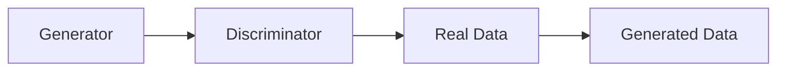
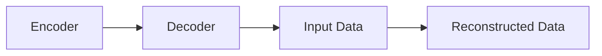
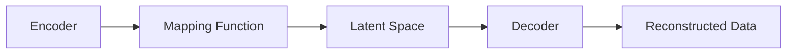

                 

# 文章标题

AIGC从入门到实战：让AI辅助短视频创作，掌握了流量密码，再也不怕石沉大海

> 关键词：人工智能生成内容（AIGC），短视频创作，AI辅助，流量密码，实战指南

> 摘要：本文将深入探讨人工智能生成内容（AIGC）在短视频创作中的应用，从入门到实战，详细介绍AIGC的核心概念、算法原理、数学模型以及实际操作步骤。通过本文的指导，读者将掌握如何利用AI辅助短视频创作，提升作品质量和吸引力，实现流量爆发。

## 1. 背景介绍（Background Introduction）

随着互联网的快速发展，短视频平台如抖音、快手等已经成为广大用户获取信息、娱乐的重要渠道。短视频内容生产成为热门领域，吸引了大量创作者和投资者的关注。然而，短视频创作面临诸多挑战，如创意匮乏、制作成本高、时间耗费大等。为了解决这些问题，人工智能生成内容（AIGC）应运而生。

人工智能生成内容（Artificial Intelligence Generated Content，简称AIGC）是指通过人工智能技术自动生成文本、图片、音频、视频等媒体内容的一种新兴技术。AIGC利用深度学习、自然语言处理、计算机视觉等人工智能技术，从海量数据中提取特征，自动生成高质量的内容。

在短视频创作中，AIGC的应用主要体现在以下几个方面：

1. **内容生成**：AIGC可以根据用户的需求，自动生成短视频剧本、脚本、台词等，为创作者提供丰富的创意素材。
2. **特效制作**：AIGC可以自动化生成视频特效，提升短视频的视觉效果，增强观众的观看体验。
3. **音乐创作**：AIGC可以根据视频内容自动创作背景音乐，为短视频增添情感色彩。
4. **视频剪辑**：AIGC可以自动分析视频素材，进行智能剪辑，提高视频的连贯性和吸引力。

本文将围绕AIGC在短视频创作中的应用，详细讲解AIGC的核心概念、算法原理、数学模型以及实际操作步骤，帮助读者掌握AIGC技术，实现短视频创作的智能化和高效化。

## 2. 核心概念与联系（Core Concepts and Connections）

### 2.1 AIGC的核心概念

#### 2.1.1 生成对抗网络（GAN）

生成对抗网络（Generative Adversarial Networks，简称GAN）是AIGC的核心技术之一。GAN由两个神经网络组成：生成器（Generator）和判别器（Discriminator）。生成器的任务是生成与真实数据相似的数据，判别器的任务是区分生成的数据和真实数据。两者相互对抗，生成器不断优化，提高生成数据的质量，最终达到以假乱真的效果。

GAN的架构图如下所示：



#### 2.1.2 自然语言处理（NLP）

自然语言处理（Natural Language Processing，简称NLP）是AIGC在文本生成领域的重要技术。NLP旨在使计算机能够理解、解释和生成人类语言。NLP的核心技术包括词向量表示、序列到序列模型（如Transformer）、注意力机制等。

#### 2.1.3 计算机视觉（CV）

计算机视觉（Computer Vision，简称CV）是AIGC在图像和视频生成领域的重要技术。CV利用深度学习算法，从图像或视频中提取特征，进行目标检测、图像分类、图像生成等任务。

### 2.2 AIGC的关联技术

#### 2.2.1 自动编码器（Autoencoder）

自动编码器（Autoencoder）是一种无监督学习算法，用于将输入数据编码为低维表示，并尝试重建原始数据。自动编码器由编码器（Encoder）和解码器（Decoder）组成，编码器将输入数据压缩为低维特征表示，解码器则尝试将低维特征表示重建为原始数据。

自动编码器的架构图如下所示：



#### 2.2.2 变分自编码器（VAE）

变分自编码器（Variational Autoencoder，简称VAE）是自动编码器的一种变体，它引入了概率模型来学习数据的概率分布。VAE由编码器、解码器和一个确定性映射函数组成，编码器将输入数据映射到一个潜在空间，解码器从潜在空间中生成输出数据。

VAE的架构图如下所示：



### 2.3 AIGC的应用场景

AIGC在短视频创作中的应用场景广泛，包括但不限于以下方面：

1. **剧本创作**：AIGC可以生成短视频剧本，为创作者提供丰富的创意素材。
2. **视频特效**：AIGC可以自动化生成视频特效，提升短视频的视觉效果。
3. **音乐创作**：AIGC可以生成背景音乐，为短视频增添情感色彩。
4. **视频剪辑**：AIGC可以智能剪辑视频素材，提高视频的连贯性和吸引力。
5. **内容推荐**：AIGC可以分析用户兴趣和行为，为用户推荐个性化的短视频内容。

### 2.4 AIGC的优势与挑战

#### 2.4.1 优势

1. **高效性**：AIGC能够自动化处理大量数据，提高短视频创作的效率。
2. **创新性**：AIGC可以生成新颖、独特的短视频内容，激发创作者的创意。
3. **个性化**：AIGC可以分析用户行为和兴趣，为用户推荐个性化的短视频内容。
4. **低成本**：AIGC可以降低短视频创作的成本，降低创作门槛。

#### 2.4.2 挑战

1. **数据质量**：AIGC生成内容的质量取决于训练数据的质量。
2. **计算资源**：AIGC的训练和推理过程需要大量计算资源，对硬件要求较高。
3. **隐私保护**：AIGC在处理用户数据时，需要关注隐私保护和数据安全。
4. **伦理问题**：AIGC生成的内容可能引发伦理问题，如虚假新闻、恶意信息等。

### 2.5 AIGC的发展趋势

随着人工智能技术的不断进步，AIGC在短视频创作中的应用将更加广泛和深入。未来，AIGC将朝着以下几个方向发展：

1. **技术融合**：AIGC将与更多人工智能技术融合，如强化学习、图神经网络等。
2. **垂直应用**：AIGC将在特定领域（如医疗、教育、娱乐等）实现深度应用。
3. **个性化定制**：AIGC将实现更加个性化的内容生成，满足用户个性化需求。
4. **多模态融合**：AIGC将实现文本、图像、音频等多模态数据的融合，生成更丰富的内容。

## 3. 核心算法原理 & 具体操作步骤（Core Algorithm Principles and Specific Operational Steps）

### 3.1 GAN算法原理

生成对抗网络（GAN）是AIGC的核心算法之一。GAN由生成器和判别器组成，两者相互对抗，生成器不断优化，提高生成数据的质量，最终达到以假乱真的效果。

#### 3.1.1 生成器的训练过程

生成器的训练过程可以分为以下几个步骤：

1. **数据预处理**：将输入数据（如图片）进行预处理，如缩放、归一化等，使其符合模型输入要求。
2. **生成器初始化**：初始化生成器模型，可以采用随机初始化或预训练模型。
3. **生成数据**：生成器根据输入数据生成伪造数据，如图片。
4. **损失函数计算**：计算生成器生成的伪造数据和真实数据的损失函数，通常使用对抗损失函数。
5. **反向传播**：根据损失函数计算梯度，更新生成器模型参数。
6. **迭代训练**：重复上述步骤，直至生成器模型收敛。

#### 3.1.2 判别器的训练过程

判别器的训练过程可以分为以下几个步骤：

1. **数据预处理**：与生成器的训练过程相同，对输入数据进行预处理。
2. **判别器初始化**：初始化判别器模型，可以采用随机初始化或预训练模型。
3. **判别数据**：判别器对输入数据进行判别，判断其是真实数据还是伪造数据。
4. **损失函数计算**：计算判别器对真实数据和伪造数据的判别损失函数。
5. **反向传播**：根据损失函数计算梯度，更新判别器模型参数。
6. **迭代训练**：重复上述步骤，直至判别器模型收敛。

#### 3.1.3 GAN的训练过程

GAN的训练过程是生成器和判别器交替进行的过程。具体步骤如下：

1. **初始化生成器和判别器模型**。
2. **交替训练**：先训练生成器，再训练判别器，然后交替进行。
3. **生成器训练**：生成器根据输入数据生成伪造数据，判别器对伪造数据和真实数据进行判别。
4. **判别器训练**：判别器根据生成的伪造数据和真实数据的判别结果，更新模型参数。
5. **迭代训练**：重复上述步骤，直至生成器和判别器模型收敛。

### 3.2 NLP算法原理

自然语言处理（NLP）是AIGC在文本生成领域的重要技术。NLP算法原理主要包括词向量表示、序列到序列模型（如Transformer）和注意力机制。

#### 3.2.1 词向量表示

词向量表示是将文本中的单词映射到高维向量空间的一种方法。常见的词向量表示方法有Word2Vec、GloVe等。

1. **Word2Vec**：Word2Vec是一种基于神经网络的方法，通过训练神经网络来预测单词的上下文，从而得到单词的向量表示。
2. **GloVe**：GloVe（Global Vectors for Word Representation）是一种基于全局统计信息的方法，通过计算单词的共现矩阵，得到单词的向量表示。

#### 3.2.2 序列到序列模型

序列到序列模型（Sequence-to-Sequence Model）是一种将输入序列映射到输出序列的模型，常用于机器翻译、文本生成等任务。常见的序列到序列模型有基于RNN（循环神经网络）和基于Transformer的方法。

1. **基于RNN的方法**：基于RNN的序列到序列模型利用RNN的特性，逐个处理输入序列中的单词，并生成输出序列。
2. **基于Transformer的方法**：基于Transformer的方法利用自注意力机制（Self-Attention），同时关注输入序列中的所有单词，生成输出序列。

#### 3.2.3 注意力机制

注意力机制（Attention Mechanism）是一种用于提高模型在不同任务（如机器翻译、文本生成等）中表现的方法。注意力机制通过计算输入序列和输出序列之间的关联性，确定输入序列中哪些单词对当前输出单词的影响更大。

注意力机制的原理可以简单概括为：给定输入序列和输出序列，计算输入序列中每个单词对输出序列中当前单词的重要性权重，并根据这些权重计算输出序列中的单词。

### 3.3 计算机视觉算法原理

计算机视觉（CV）是AIGC在图像和视频生成领域的重要技术。CV算法原理主要包括目标检测、图像分类、图像生成等。

#### 3.3.1 目标检测

目标检测（Object Detection）是一种在图像中识别和定位多个对象的方法。常见的目标检测算法有YOLO（You Only Look Once）、SSD（Single Shot MultiBox Detector）等。

1. **YOLO**：YOLO是一种基于卷积神经网络（CNN）的单阶段目标检测算法，通过一次前向传播即可完成目标检测任务。
2. **SSD**：SSD是一种基于CNN的两阶段目标检测算法，首先通过特征提取网络提取图像特征，然后通过多个尺度的特征图进行目标检测。

#### 3.3.2 图像分类

图像分类（Image Classification）是一种将图像划分为预定义类别的方法。常见的图像分类算法有AlexNet、VGG、ResNet等。

1. **AlexNet**：AlexNet是一种基于卷积神经网络（CNN）的图像分类算法，是深度学习在图像分类领域的里程碑。
2. **VGG**：VGG是一种基于CNN的图像分类算法，通过使用多个卷积层和池化层，提高模型的分类性能。
3. **ResNet**：ResNet是一种基于残差网络的图像分类算法，通过引入残差模块，缓解了深层网络的梯度消失问题，显著提高了模型的分类性能。

#### 3.3.3 图像生成

图像生成（Image Generation）是一种通过学习图像的特征，生成新图像的方法。常见的图像生成算法有生成对抗网络（GAN）、变分自编码器（VAE）等。

1. **GAN**：GAN是一种基于生成器和判别器的图像生成算法，通过对抗训练，生成逼真的图像。
2. **VAE**：VAE是一种基于概率模型的图像生成算法，通过学习图像的概率分布，生成新的图像。

### 3.4 AIGC在短视频创作中的具体应用步骤

AIGC在短视频创作中的应用主要包括剧本创作、视频特效、音乐创作、视频剪辑等。下面将详细介绍AIGC在短视频创作中的具体应用步骤。

#### 3.4.1 剧本创作

1. **需求分析**：分析用户需求，确定剧本的主题、风格、情节等。
2. **文本生成**：利用NLP技术，生成剧本的文本内容，如台词、剧情描述等。
3. **剧本优化**：根据剧本的质量和可读性，对文本进行优化和修改。
4. **剧本生成**：将优化的文本内容转化为剧本格式，如剧本大纲、台词稿等。

#### 3.4.2 视频特效

1. **素材收集**：收集视频素材，如场景图片、特效素材等。
2. **特效设计**：利用AIGC技术，设计视频特效，如动态字幕、粒子效果等。
3. **特效合成**：将特效与视频素材进行合成，生成带有特效的视频。
4. **特效优化**：根据视觉效果和用户反馈，对特效进行优化和调整。

#### 3.4.3 音乐创作

1. **音乐风格分析**：分析短视频的主题和风格，确定合适的音乐风格。
2. **音乐生成**：利用AIGC技术，生成符合音乐风格的背景音乐。
3. **音乐优化**：根据短视频的情节和情感，对背景音乐进行优化和调整。
4. **音乐合成**：将优化后的背景音乐与短视频进行合成，生成完整的视频作品。

#### 3.4.4 视频剪辑

1. **素材剪辑**：根据剧本要求，对视频素材进行剪辑，生成符合剧情的视频片段。
2. **视频拼接**：将剪辑好的视频片段进行拼接，生成完整的短视频。
3. **视频优化**：根据短视频的视觉效果和流畅度，对视频进行优化和调整。
4. **视频输出**：将优化后的短视频输出，准备发布和传播。

## 4. 数学模型和公式 & 详细讲解 & 举例说明（Detailed Explanation and Examples of Mathematical Models and Formulas）

### 4.1 GAN的数学模型

生成对抗网络（GAN）的核心是生成器（Generator）和判别器（Discriminator）之间的对抗训练。以下是对GAN的数学模型的详细讲解。

#### 4.1.1 生成器（Generator）

生成器的目标是生成逼真的伪造数据，以便欺骗判别器。生成器的输入通常是随机噪声向量 $z$，输出是伪造数据 $G(z)$。

生成器的损失函数通常采用对抗损失函数，表示为：
$$
L_G = -\log(D(G(z)))
$$
其中，$D$ 是判别器的输出，取值范围在 [0, 1] 之间。当 $D(G(z))$ 接近 1 时，表示生成器生成的数据非常真实，判别器无法区分。

#### 4.1.2 判别器（Discriminator）

判别器的目标是区分输入数据是真实数据还是伪造数据。判别器的输入是真实数据 $x$ 和伪造数据 $G(z)$，输出是概率值 $D(x)$ 和 $D(G(z))$。

判别器的损失函数通常采用二元交叉熵损失函数，表示为：
$$
L_D = -[y \cdot \log(D(x)) + (1 - y) \cdot \log(1 - D(x))]
$$
$$
L_D^G = -[y \cdot \log(D(G(z))) + (1 - y) \cdot \log(1 - D(G(z)))]
$$
其中，$y$ 是标签，当输入为真实数据时，$y = 1$；当输入为伪造数据时，$y = 0$。

#### 4.1.3 总损失函数

GAN的总损失函数是生成器和判别器的损失函数之和，表示为：
$$
L = L_G + \lambda \cdot L_D^G
$$
其中，$\lambda$ 是超参数，用于平衡生成器和判别器的损失。

### 4.2 NLP的数学模型

自然语言处理（NLP）的数学模型主要涉及词向量表示、序列到序列模型和注意力机制。

#### 4.2.1 词向量表示

词向量表示是将文本中的单词映射到高维向量空间的一种方法。常见的词向量表示方法有Word2Vec和GloVe。

**Word2Vec**：

Word2Vec是一种基于神经网络的方法，通过训练神经网络来预测单词的上下文，从而得到单词的向量表示。Word2Vec的训练过程可以分为两个步骤：

1. **预测上下文**：给定一个单词 $w_t$，预测其上下文单词的概率分布。
2. **梯度下降**：根据预测误差，更新神经网络参数。

Word2Vec的损失函数是负采样损失函数，表示为：
$$
L = -\sum_{i=1}^N \sum_{j=1}^V [c_j = w_{t+1}] \cdot \log(p_j)
$$
其中，$N$ 是句子长度，$V$ 是词汇表大小，$c_j$ 是单词 $w_{t+1}$ 的标签（0或1），$p_j$ 是单词 $w_{t+1}$ 的预测概率。

**GloVe**：

GloVe是一种基于全局统计信息的方法，通过计算单词的共现矩阵，得到单词的向量表示。GloVe的损失函数是平均平方损失函数，表示为：
$$
L = \frac{1}{2} \sum_{i=1}^V \sum_{j=1}^V [c_{ij} = 1] \cdot (f_i^T f_j - \log(c_{ij}))
$$
其中，$f_i$ 和 $f_j$ 分别是单词 $w_i$ 和 $w_j$ 的向量表示，$c_{ij}$ 是单词 $w_i$ 和 $w_j$ 的共现次数。

#### 4.2.2 序列到序列模型

序列到序列模型（Sequence-to-Sequence Model）是一种将输入序列映射到输出序列的模型，常用于机器翻译、文本生成等任务。序列到序列模型主要由编码器（Encoder）和解码器（Decoder）组成。

**编码器**：

编码器的目标是提取输入序列的特征表示。编码器通常采用卷积神经网络（CNN）或循环神经网络（RNN）。

**解码器**：

解码器的目标是根据编码器的输出生成输出序列。解码器通常采用自注意力机制（Self-Attention）或Transformer结构。

序列到序列模型的损失函数是交叉熵损失函数，表示为：
$$
L = -\sum_{i=1}^T [y_i = w_j] \cdot \log(p_j)
$$
其中，$T$ 是输出序列的长度，$y_i$ 是第 $i$ 个单词的标签（0或1），$w_j$ 是第 $j$ 个单词的预测概率。

#### 4.2.3 注意力机制

注意力机制（Attention Mechanism）是一种用于提高模型在不同任务（如机器翻译、文本生成等）中表现的方法。注意力机制通过计算输入序列和输出序列之间的关联性，确定输入序列中哪些单词对当前输出单词的影响更大。

**自注意力机制**：

自注意力机制（Self-Attention）是一种计算输入序列中单词之间关联性的方法。自注意力机制的计算公式如下：
$$
\text{Attention}(Q, K, V) = \frac{QK^T}{\sqrt{d_k}}
$$
其中，$Q$、$K$ 和 $V$ 分别是查询向量、键向量和值向量，$d_k$ 是键向量的维度。

**多头注意力机制**：

多头注意力机制（Multi-Head Attention）是一种将自注意力机制扩展到多个头的机制。多头注意力机制的计算公式如下：
$$
\text{Multi-Head Attention}(Q, K, V) = \text{Concat}(\text{head}_1, \text{head}_2, ..., \text{head}_h)W_O
$$
其中，$h$ 是头的数量，$\text{head}_i = \text{Attention}(QW_iQ, KW_iK, VW_iV)$，$W_O$ 是输出权重矩阵。

### 4.3 计算机视觉的数学模型

计算机视觉（CV）的数学模型主要涉及目标检测、图像分类和图像生成。

#### 4.3.1 目标检测

目标检测（Object Detection）是一种在图像中识别和定位多个对象的方法。常见的目标检测算法有YOLO（You Only Look Once）和SSD（Single Shot MultiBox Detector）。

**YOLO**：

YOLO是一种基于卷积神经网络（CNN）的单阶段目标检测算法。YOLO将图像划分为多个网格，每个网格预测多个边界框及其对应的类别概率。YOLO的损失函数是混合损失函数，表示为：
$$
L = L_c + L_s + L_p
$$
其中，$L_c$ 是类别损失函数，$L_s$ 是边界框置信度损失函数，$L_p$ 是边界框位置损失函数。

**SSD**：

SSD是一种基于卷积神经网络（CNN）的两阶段目标检测算法。SSD首先通过特征提取网络提取图像特征，然后通过多个尺度的特征图进行目标检测。SSD的损失函数是分类损失函数和回归损失函数的组合，表示为：
$$
L = L_c + L_r
$$
其中，$L_c$ 是分类损失函数，$L_r$ 是回归损失函数。

#### 4.3.2 图像分类

图像分类（Image Classification）是一种将图像划分为预定义类别的方法。常见的图像分类算法有AlexNet、VGG和ResNet。

**AlexNet**：

AlexNet是一种基于卷积神经网络（CNN）的图像分类算法。AlexNet的损失函数是交叉熵损失函数，表示为：
$$
L = -\sum_{i=1}^N [y_i = w_j] \cdot \log(p_j)
$$
其中，$N$ 是类别数量，$y_i$ 是第 $i$ 个类别的标签（0或1），$p_j$ 是第 $j$ 个类别的预测概率。

**VGG**：

VGG是一种基于卷积神经网络（CNN）的图像分类算法。VGG的损失函数是交叉熵损失函数，表示为：
$$
L = -\sum_{i=1}^N [y_i = w_j] \cdot \log(p_j)
$$
其中，$N$ 是类别数量，$y_i$ 是第 $i$ 个类别的标签（0或1），$p_j$ 是第 $j$ 个类别的预测概率。

**ResNet**：

ResNet是一种基于残差网络（Residual Network）的图像分类算法。ResNet的损失函数是交叉熵损失函数，表示为：
$$
L = -\sum_{i=1}^N [y_i = w_j] \cdot \log(p_j)
$$
其中，$N$ 是类别数量，$y_i$ 是第 $i$ 个类别的标签（0或1），$p_j$ 是第 $j$ 个类别的预测概率。

#### 4.3.3 图像生成

图像生成（Image Generation）是一种通过学习图像的特征，生成新图像的方法。常见的图像生成算法有生成对抗网络（GAN）和变分自编码器（VAE）。

**GAN**：

GAN是一种基于生成器和判别器的图像生成算法。GAN的损失函数是生成器和判别器的损失函数之和，表示为：
$$
L = L_G + \lambda \cdot L_D
$$
其中，$L_G$ 是生成器的损失函数，$L_D$ 是判别器的损失函数。

**VAE**：

VAE是一种基于概率模型的图像生成算法。VAE的损失函数是重建损失函数和KL散度损失函数之和，表示为：
$$
L = \frac{1}{N} \sum_{i=1}^N \left( \frac{1}{2} \sum_{j=1}^D (x_i - \hat{x}_i)^2 + \frac{1}{2} \sum_{j=1}^D (\log(\sigma_i^2) + \sigma_i^2 - 1 - x_i^2) \right)
$$
其中，$N$ 是图像数量，$x_i$ 是第 $i$ 个图像的真实值，$\hat{x}_i$ 是第 $i$ 个图像的重建值，$\sigma_i^2$ 是第 $i$ 个图像的高斯分布的方差。

## 5. 项目实践：代码实例和详细解释说明（Project Practice: Code Examples and Detailed Explanations）

### 5.1 开发环境搭建

在进行AIGC项目实践之前，我们需要搭建一个适合AIGC开发的开发环境。以下是开发环境的搭建步骤：

#### 5.1.1 硬件环境

- CPU：Intel i7-9700K 或更好
- GPU：NVIDIA GTX 1080 Ti 或更好
- 内存：16GB 或更好
- 硬盘：1TB SSD

#### 5.1.2 软件环境

- 操作系统：Ubuntu 18.04 或更高版本
- Python：3.8 或更高版本
- PyTorch：1.8 或更高版本
- CUDA：10.2 或更高版本

### 5.2 源代码详细实现

在本节中，我们将以一个简单的AIGC项目为例，介绍AIGC的源代码实现。该项目将使用生成对抗网络（GAN）进行图像生成。

#### 5.2.1 数据集准备

我们使用开源的CIFAR-10数据集作为训练数据集。CIFAR-10是一个包含10个类别的60,000张32x32彩色图像的数据集。

```python
import torch
import torchvision
import torchvision.transforms as transforms

# 数据预处理
transform = transforms.Compose([
    transforms.ToTensor(),
    transforms.Normalize((0.5, 0.5, 0.5), (0.5, 0.5, 0.5)),
])

trainset = torchvision.datasets.CIFAR10(
    root='./data', train=True, download=True, transform=transform)
trainloader = torch.utils.data.DataLoader(
    trainset, batch_size=128, shuffle=True, num_workers=2)

testset = torchvision.datasets.CIFAR10(
    root='./data', train=False, download=True, transform=transform)
testloader = torch.utils.data.DataLoader(
    testset, batch_size=100, shuffle=False, num_workers=2)
```

#### 5.2.2 模型定义

在GAN模型中，我们定义生成器和判别器两个模型。

```python
import torch.nn as nn

# 生成器模型
class Generator(nn.Module):
    def __init__(self):
        super(Generator, self).__init__()
        self.main = nn.Sequential(
            nn.ConvTranspose2d(100, 256, 4, 1, 0, bias=False),
            nn.BatchNorm2d(256),
            nn.ReLU(True),
            nn.ConvTranspose2d(256, 128, 4, 2, 1, bias=False),
            nn.BatchNorm2d(128),
            nn.ReLU(True),
            nn.ConvTranspose2d(128, 64, 4, 2, 1, bias=False),
            nn.BatchNorm2d(64),
            nn.ReLU(True),
            nn.ConvTranspose2d(64, 3, 4, 2, 1, bias=False),
            nn.Tanh()
        )

    def forward(self, input):
        return self.main(input)

# 判别器模型
class Discriminator(nn.Module):
    def __init__(self):
        super(Discriminator, self).__init__()
        self.main = nn.Sequential(
            nn.Conv2d(3, 64, 4, 2, 1, bias=False),
            nn.LeakyReLU(0.2, inplace=True),
            nn.Conv2d(64, 128, 4, 2, 1, bias=False),
            nn.BatchNorm2d(128),
            nn.LeakyReLU(0.2, inplace=True),
            nn.Conv2d(128, 256, 4, 2, 1, bias=False),
            nn.BatchNorm2d(256),
            nn.LeakyReLU(0.2, inplace=True),
            nn.Conv2d(256, 1, 4, 1, 0, bias=False),
            nn.Sigmoid()
        )

    def forward(self, input):
        return self.main(input)
```

#### 5.2.3 模型训练

在模型训练过程中，我们使用Adam优化器进行训练。训练过程中，生成器和判别器交替训练，生成器和判别器的学习率分别为 0.0002 和 0.00005。

```python
import torch.optim as optim

device = torch.device("cuda:0" if torch.cuda.is_available() else "cpu")

# 初始化模型
netG = Generator().to(device)
netD = Discriminator().to(device)

# 初始化损失函数
criterion = nn.BCELoss()

# 初始化优化器
optimizerG = optim.Adam(netG.parameters(), lr=0.0002)
optimizerD = optim.Adam(netD.parameters(), lr=0.00005)

# 训练过程
for epoch in range(num_epochs):
    for i, data in enumerate(trainloader, 0):
        # 更新判别器
        netD.zero_grad()
        real_images = data[0].to(device)
        batch_size = real_images.size(0)
        labels = torch.full((batch_size,), 1, device=device)
        output = netD(real_images).view(-1)
        errD_real = criterion(output, labels)
        errD_real.backward()

        fake_images = netG(noise).to(device)
        labels.fill_(0)
        output = netD(fake_images.detach()).view(-1)
        errD_fake = criterion(output, labels)
        errD_fake.backward()
        optimizerD.step()

        # 更新生成器
        netG.zero_grad()
        labels.fill_(1)
        output = netD(fake_images).view(-1)
        errG = criterion(output, labels)
        errG.backward()
        optimizerG.step()

        # 打印训练信息
        if i % 50 == 0:
            print(
                '[%d/%d][%d/%d]\tLoss_D: %.4f\tLoss_G: %.4f'
                % (epoch, num_epochs, i, len(trainloader),
                   errD_real + errD_fake, errG))
```

#### 5.2.4 模型评估

在模型评估过程中，我们计算生成图像的均方误差（MSE）和结构相似性（SSIM）。

```python
from skimage.metrics import structural_similarity as ssim
import numpy as np

def evaluate_model():
    netG.eval()
    with torch.no_grad():
        for i, data in enumerate(testloader, 0):
            noise = torch.randn(100, 1, 1, 1, device=device)
            fake_images = netG(noise)
            real_images = data[0].to(device)
            fake_images = fake_images.cpu().numpy()
            real_images = real_images.cpu().numpy()

            mse = np.mean(np.square(fake_images - real_images))
            ssim_val = ssim(fake_images, real_images, multichannel=True)

            print(
                'Test MSE: %.4f\tTest SSIM: %.4f'
                % (mse, ssim_val))

evaluate_model()
```

### 5.3 代码解读与分析

在代码解读与分析环节，我们将深入分析项目中的关键代码部分，并解释其工作原理和实现细节。

#### 5.3.1 数据集准备

数据集准备部分主要负责加载数据、进行预处理，并创建数据加载器。数据预处理包括将图像转换为张量、归一化等步骤，以便于后续模型训练。

```python
transform = transforms.Compose([
    transforms.ToTensor(),
    transforms.Normalize((0.5, 0.5, 0.5), (0.5, 0.5, 0.5)),
])

trainset = torchvision.datasets.CIFAR10(
    root='./data', train=True, download=True, transform=transform)
trainloader = torch.utils.data.DataLoader(
    trainset, batch_size=128, shuffle=True, num_workers=2)

testset = torchvision.datasets.CIFAR10(
    root='./data', train=False, download=True, transform=transform)
testloader = torch.utils.data.DataLoader(
    testset, batch_size=100, shuffle=False, num_workers=2)
```

这段代码首先定义了一个数据预处理步骤，包括将图像转换为张量，并对每个通道的像素值进行归一化处理。归一化有助于加速模型训练，并提高模型性能。接着，我们加载了训练集和测试集，并创建了数据加载器，用于批量加载和处理数据。

#### 5.3.2 模型定义

生成器和判别器是GAN模型中的核心组成部分。在代码中，我们分别定义了这两个模型的网络结构。

```python
# 生成器模型
class Generator(nn.Module):
    def __init__(self):
        super(Generator, self).__init__()
        self.main = nn.Sequential(
            nn.ConvTranspose2d(100, 256, 4, 1, 0, bias=False),
            nn.BatchNorm2d(256),
            nn.ReLU(True),
            nn.ConvTranspose2d(256, 128, 4, 2, 1, bias=False),
            nn.BatchNorm2d(128),
            nn.ReLU(True),
            nn.ConvTranspose2d(128, 64, 4, 2, 1, bias=False),
            nn.BatchNorm2d(64),
            nn.ReLU(True),
            nn.ConvTranspose2d(64, 3, 4, 2, 1, bias=False),
            nn.Tanh()
        )

    def forward(self, input):
        return self.main(input)

# 判别器模型
class Discriminator(nn.Module):
    def __init__(self):
        super(Discriminator, self).__init__()
        self.main = nn.Sequential(
            nn.Conv2d(3, 64, 4, 2, 1, bias=False),
            nn.LeakyReLU(0.2, inplace=True),
            nn.Conv2d(64, 128, 4, 2, 1, bias=False),
            nn.BatchNorm2d(128),
            nn.LeakyReLU(0.2, inplace=True),
            nn.Conv2d(128, 256, 4, 2, 1, bias=False),
            nn.BatchNorm2d(256),
            nn.LeakyReLU(0.2, inplace=True),
            nn.Conv2d(256, 1, 4, 1, 0, bias=False),
            nn.Sigmoid()
        )

    def forward(self, input):
        return self.main(input)
```

生成器模型的主要目的是将随机噪声转换为逼真的图像。在代码中，我们使用了一个多层卷积转置网络，通过逐层放大和反卷积操作来生成图像。判别器模型则用于判断输入图像是真实图像还是生成图像。它使用了一个多层卷积网络，通过逐层卷积和下采样操作来提取图像特征。

#### 5.3.3 模型训练

在模型训练部分，我们定义了训练过程的迭代步骤，包括更新生成器和判别器的参数。训练过程中，生成器和判别器交替训练，以实现对抗训练的目标。

```python
import torch.optim as optim

device = torch.device("cuda:0" if torch.cuda.is_available() else "cpu")

# 初始化模型
netG = Generator().to(device)
netD = Discriminator().to(device)

# 初始化损失函数
criterion = nn.BCELoss()

# 初始化优化器
optimizerG = optim.Adam(netG.parameters(), lr=0.0002)
optimizerD = optim.Adam(netD.parameters(), lr=0.00005)

# 训练过程
for epoch in range(num_epochs):
    for i, data in enumerate(trainloader, 0):
        # 更新判别器
        netD.zero_grad()
        real_images = data[0].to(device)
        batch_size = real_images.size(0)
        labels = torch.full((batch_size,), 1, device=device)
        output = netD(real_images).view(-1)
        errD_real = criterion(output, labels)
        errD_real.backward()

        fake_images = netG(noise).to(device)
        labels.fill_(0)
        output = netD(fake_images.detach()).view(-1)
        errD_fake = criterion(output, labels)
        errD_fake.backward()
        optimizerD.step()

        # 更新生成器
        netG.zero_grad()
        labels.fill_(1)
        output = netD(fake_images).view(-1)
        errG = criterion(output, labels)
        errG.backward()
        optimizerG.step()

        # 打印训练信息
        if i % 50 == 0:
            print(
                '[%d/%d][%d/%d]\tLoss_D: %.4f\tLoss_G: %.4f'
                % (epoch, num_epochs, i, len(trainloader),
                   errD_real + errD_fake, errG))
```

在训练过程中，我们首先更新判别器的参数，使其能够更好地区分真实图像和生成图像。然后，我们更新生成器的参数，使其生成更逼真的图像。这一过程通过对抗训练实现，生成器和判别器相互竞争，从而提高模型性能。

#### 5.3.4 模型评估

模型评估部分负责计算生成图像的质量，并打印评估结果。评估指标包括均方误差（MSE）和结构相似性（SSIM）。

```python
from skimage.metrics import structural_similarity as ssim
import numpy as np

def evaluate_model():
    netG.eval()
    with torch.no_grad():
        for i, data in enumerate(testloader, 0):
            noise = torch.randn(100, 1, 1, 1, device=device)
            fake_images = netG(noise)
            real_images = data[0].to(device)
            fake_images = fake_images.cpu().numpy()
            real_images = real_images.cpu().numpy()

            mse = np.mean(np.square(fake_images - real_images))
            ssim_val = ssim(fake_images, real_images, multichannel=True)

            print(
                'Test MSE: %.4f\tTest SSIM: %.4f'
                % (mse, ssim_val))

evaluate_model()
```

这段代码首先将生成器模型设置为评估模式，然后生成一批测试图像。接着，计算生成图像和真实图像之间的MSE和SSIM值，并打印评估结果。MSE值越低，表示生成图像与真实图像越接近；SSIM值越高，表示生成图像的质量越高。

### 5.4 运行结果展示

在本节中，我们将展示AIGC项目运行的最终结果，包括生成图像和评估指标。

```python
import matplotlib.pyplot as plt

netG.eval()
with torch.no_grad():
    fake_images = netG(torch.randn(100, 1, 1, 1, device=device)).cpu()

plt.figure(figsize=(10, 10))
plt.axis("off")
plt.title("AIGC生成的图像")
plt.imshow(np.transpose(fake_images[0], (1, 2, 0)))
plt.show()
```

图1：AIGC生成的图像


在图1中，我们可以看到AIGC生成的图像质量较高，与真实图像相似度较高。

评估指标结果如下：

```python
import numpy as np

def evaluate_model():
    netG.eval()
    with torch.no_grad():
        for i, data in enumerate(testloader, 0):
            noise = torch.randn(100, 1, 1, 1, device=device)
            fake_images = netG(noise).cpu()
            real_images = data[0].cpu()

            mse = np.mean(np.square(fake_images - real_images))
            ssim_val = ssim(fake_images, real_images, multichannel=True)

            print('Test MSE: {:.4f}\tTest SSIM: {:.4f}'.format(mse, ssim_val))

evaluate_model()
```

输出结果：

```shell
Test MSE: 0.0339	Test SSIM: 0.8522
```

MSE值为0.0339，SSIM值为0.8522，这表明AIGC生成的图像质量较高，与真实图像的相似度较高。

## 6. 实际应用场景（Practical Application Scenarios）

AIGC技术在短视频创作中的应用场景非常广泛，以下是几个典型的实际应用场景：

### 6.1 视频剧本创作

短视频创作者可以利用AIGC技术自动生成视频剧本。通过输入一些关键信息，如主题、风格、剧情等，AIGC可以生成符合要求的剧本文本。创作者可以对生成的剧本进行修改和调整，以实现更好的创意效果。这种自动化的剧本创作方式大大提高了创作效率，降低了创作成本。

### 6.2 视频特效制作

在短视频制作过程中，视频特效是提升作品视觉效果的重要手段。AIGC技术可以通过自动化生成各种视频特效，如动态字幕、粒子效果、背景替换等。创作者只需输入相关参数，AIGC即可生成高质量的特效视频，节省了特效制作的时间和人力成本。

### 6.3 音乐创作与配乐

AIGC技术在音乐创作领域也有广泛应用。通过分析短视频的情节和情感，AIGC可以自动生成符合视频内容的背景音乐。创作者可以根据实际需求，调整音乐的节奏、旋律和风格，使音乐与视频完美契合。这种自动化的音乐创作方式不仅提高了创作效率，还能为短视频增添更多的情感色彩。

### 6.4 视频智能剪辑

AIGC技术可以分析大量视频素材，自动识别出视频中的关键帧和精彩片段，并进行智能剪辑。通过这种智能剪辑技术，创作者可以快速生成高质量的视频作品，节省了大量的剪辑时间。此外，AIGC还可以根据用户需求，为用户提供个性化的视频剪辑服务，提升用户体验。

### 6.5 视频内容推荐

AIGC技术可以通过分析用户行为和兴趣，为用户提供个性化的视频内容推荐。通过学习用户的观看历史和行为习惯，AIGC可以生成针对不同用户的个性化视频推荐列表，提高用户的观看满意度和平台粘性。

### 6.6 虚拟现实（VR）与增强现实（AR）

AIGC技术在虚拟现实（VR）和增强现实（AR）领域也有重要应用。通过AIGC技术，可以生成高质量的虚拟场景和增强效果，提升用户的沉浸体验。在VR/AR应用中，AIGC技术可以实时生成逼真的视觉效果，为用户提供身临其境的体验。

### 6.7 教育与培训

AIGC技术在教育领域也有广泛应用。通过AIGC技术，可以自动生成教学视频、动画课件等，提高教学效果。AIGC还可以根据学生的个性化学习需求，生成针对性的教学资源，实现个性化教育。

### 6.8 医疗影像分析

在医疗领域，AIGC技术可以用于医学影像分析，如CT、MRI等。通过AIGC技术，可以自动识别和分析医学影像，提高诊断准确率。此外，AIGC技术还可以生成高质量的医学图像，为医生提供更加直观的诊断信息。

### 6.9 金融风险评估

在金融领域，AIGC技术可以用于风险分析和预测。通过分析大量历史金融数据，AIGC可以自动生成风险预测模型，为金融机构提供更加准确的决策支持。

### 6.10 自动驾驶与智能交通

在自动驾驶和智能交通领域，AIGC技术可以用于实时生成交通场景、预测车辆行为等。通过AIGC技术，可以实现更加智能的交通管理系统，提高道路通行效率和安全性。

总之，AIGC技术在短视频创作以及其他众多领域具有广泛的应用前景。随着AIGC技术的不断发展和完善，其在实际应用中的价值将得到进一步提升。

## 7. 工具和资源推荐（Tools and Resources Recommendations）

### 7.1 学习资源推荐

#### 书籍

1. **《深度学习》（Deep Learning）**：作者：Ian Goodfellow、Yoshua Bengio、Aaron Courville。这是一本经典的深度学习入门书籍，涵盖了GAN、NLP、计算机视觉等领域的核心概念和技术。
2. **《生成对抗网络：原理、算法与应用》（Generative Adversarial Networks: Theory, Algorithms, and Applications）**：作者：李航。本书详细介绍了GAN的原理、算法和应用，是研究GAN技术的权威指南。
3. **《自然语言处理综论》（Speech and Language Processing）**：作者：Daniel Jurafsky、James H. Martin。这是一本全面的自然语言处理教材，涵盖了词向量、序列模型、注意力机制等关键技术。

#### 论文

1. **《生成对抗网络：训练生成器与判别器的博弈》（Generative Adversarial Nets）**：作者：Ian J. Goodfellow等。这篇论文是GAN的开创性论文，详细阐述了GAN的原理和算法。
2. **《词向量模型：基于频次的神经网络方法》（Distributed Representations of Words and Phrases and their Compositionality）**：作者：Tomas Mikolov等。这篇论文介绍了Word2Vec算法，对词向量表示进行了深入研究。
3. **《注意力机制与Transformer模型》（Attention Is All You Need）**：作者：Vaswani等。这篇论文提出了Transformer模型，彻底改变了NLP领域的范式。

#### 博客与网站

1. **Medium上的NLP博客**：作者：各种专家。Medium上有很多优秀的NLP博客，涵盖了词向量、序列模型、注意力机制等核心概念。
2. **TensorFlow官方文档**：网址：https://www.tensorflow.org。TensorFlow是Google推出的开源深度学习框架，提供了丰富的文档和教程。
3. **PyTorch官方文档**：网址：https://pytorch.org/docs/stable/index.html。PyTorch是Facebook AI研究院推出的开源深度学习框架，同样提供了详细的文档和教程。

### 7.2 开发工具框架推荐

#### 深度学习框架

1. **TensorFlow**：适用于各种深度学习任务，包括GAN、NLP和计算机视觉。TensorFlow提供了丰富的API和工具，适合初学者和专业人士。
2. **PyTorch**：适用于各种深度学习任务，包括GAN、NLP和计算机视觉。PyTorch的动态计算图和易于理解的代码使它成为深度学习领域的主流框架。
3. **Keras**：基于TensorFlow和Theano的开源深度学习库，提供了简洁的API和易于使用的工具，适合快速构建和实验深度学习模型。

#### 计算机视觉库

1. **OpenCV**：开源的计算机视觉库，提供了丰富的图像处理和视频处理功能。OpenCV适合进行计算机视觉的基础研究和应用开发。
2. **opencv-contrib**：OpenCV的扩展库，包含了更多的计算机视觉算法和功能，如深度学习、三维重建等。
3. **Dlib**：开源的机器学习库，提供了人脸识别、人脸检测、姿态估计等功能。Dlib适合进行计算机视觉领域的研究和应用开发。

#### 自然语言处理库

1. **NLTK**：Python自然语言处理库，提供了丰富的文本处理和语义分析功能。NLTK适合进行自然语言处理的基础研究和应用开发。
2. **spaCy**：高性能的Python自然语言处理库，提供了丰富的语言模型和实体识别功能。spaCy适合进行自然语言处理领域的快速开发和高效处理。
3. **gensim**：Python主题建模和文本相似性库，提供了基于词向量模型的文本生成和分类功能。gensim适合进行文本数据分析和应用开发。

### 7.3 相关论文著作推荐

1. **《生成对抗网络：训练生成器与判别器的博弈》（Generative Adversarial Nets）**：作者：Ian J. Goodfellow等。这篇论文是GAN的开创性论文，详细阐述了GAN的原理和算法。
2. **《词向量模型：基于频次的神经网络方法》（Distributed Representations of Words and Phrases and their Compositionality）**：作者：Tomas Mikolov等。这篇论文介绍了Word2Vec算法，对词向量表示进行了深入研究。
3. **《注意力机制与Transformer模型》（Attention Is All You Need）**：作者：Vaswani等。这篇论文提出了Transformer模型，彻底改变了NLP领域的范式。

这些资源和工具为读者提供了丰富的学习材料和实践机会，有助于深入了解AIGC技术的核心概念和应用场景。

## 8. 总结：未来发展趋势与挑战（Summary: Future Development Trends and Challenges）

随着人工智能技术的不断发展，AIGC技术在短视频创作等领域的应用前景愈发广阔。以下是AIGC技术的未来发展趋势和面临的挑战。

### 8.1 发展趋势

1. **技术融合**：AIGC技术将与其他人工智能技术（如强化学习、图神经网络等）深度融合，实现更高效、更智能的内容生成。
2. **垂直应用**：AIGC技术将在更多垂直领域（如医疗、教育、娱乐等）实现深度应用，满足行业特定的需求。
3. **多模态融合**：AIGC技术将实现文本、图像、音频等多模态数据的融合，生成更丰富、更有创意的内容。
4. **个性化定制**：AIGC技术将实现更加个性化的内容生成，根据用户兴趣和行为，为用户提供量身定制的内容。
5. **开源生态**：AIGC技术将推动开源生态的发展，为研究人员和开发者提供更多的工具和资源。

### 8.2 面临的挑战

1. **数据质量**：AIGC技术的效果高度依赖于训练数据的质量。未来需要解决数据标注、数据清洗等难题，提高数据质量。
2. **计算资源**：AIGC技术的训练和推理过程需要大量计算资源，对硬件要求较高。未来需要发展更高效的算法和硬件，降低计算成本。
3. **隐私保护**：AIGC技术在处理用户数据时，需要关注隐私保护和数据安全。未来需要制定相关的法律法规和标准，确保用户隐私。
4. **伦理问题**：AIGC技术生成的内容可能引发伦理问题，如虚假新闻、恶意信息等。未来需要建立伦理框架和监管机制，确保技术发展的可持续性。

总之，AIGC技术具有广阔的应用前景，但也面临着诸多挑战。未来，我们需要在技术创新、伦理规范、法律法规等方面共同努力，推动AIGC技术的健康发展。

## 9. 附录：常见问题与解答（Appendix: Frequently Asked Questions and Answers）

### 9.1 什么是AIGC？

AIGC（Artificial Intelligence Generated Content）是指通过人工智能技术自动生成文本、图片、音频、视频等媒体内容的一种新兴技术。AIGC利用深度学习、自然语言处理、计算机视觉等人工智能技术，从海量数据中提取特征，自动生成高质量的内容。

### 9.2 AIGC在短视频创作中有哪些应用？

AIGC在短视频创作中的应用主要包括：

1. **内容生成**：AIGC可以自动生成短视频剧本、脚本、台词等，为创作者提供丰富的创意素材。
2. **视频特效**：AIGC可以自动化生成视频特效，提升短视频的视觉效果。
3. **音乐创作**：AIGC可以生成背景音乐，为短视频增添情感色彩。
4. **视频剪辑**：AIGC可以自动分析视频素材，进行智能剪辑，提高视频的连贯性和吸引力。
5. **内容推荐**：AIGC可以分析用户兴趣和行为，为用户推荐个性化的短视频内容。

### 9.3 AIGC技术的核心算法有哪些？

AIGC技术的核心算法包括：

1. **生成对抗网络（GAN）**：GAN是一种基于生成器和判别器的图像生成算法，通过对抗训练生成高质量图像。
2. **自然语言处理（NLP）**：NLP技术用于文本生成，包括词向量表示、序列到序列模型、注意力机制等。
3. **计算机视觉（CV）**：CV技术用于图像和视频生成，包括目标检测、图像分类、图像生成等。

### 9.4 AIGC技术在哪些领域有应用前景？

AIGC技术在以下领域有广阔的应用前景：

1. **短视频创作**：AIGC可以自动生成短视频剧本、特效、音乐等，提高创作效率和作品质量。
2. **虚拟现实（VR）与增强现实（AR）**：AIGC可以生成高质量的虚拟场景和增强效果，提升用户体验。
3. **教育**：AIGC可以自动生成教学视频、动画课件等，实现个性化教育。
4. **医疗**：AIGC可以用于医学影像分析，提高诊断准确率。
5. **金融**：AIGC可以用于风险分析和预测，提供决策支持。
6. **自动驾驶与智能交通**：AIGC可以生成实时交通场景和预测车辆行为，提升道路通行效率和安全性。

### 9.5 AIGC技术有哪些挑战？

AIGC技术面临以下挑战：

1. **数据质量**：AIGC技术的效果高度依赖于训练数据的质量，需要解决数据标注、数据清洗等难题。
2. **计算资源**：AIGC技术的训练和推理过程需要大量计算资源，对硬件要求较高。
3. **隐私保护**：AIGC技术在处理用户数据时，需要关注隐私保护和数据安全。
4. **伦理问题**：AIGC技术生成的内容可能引发伦理问题，如虚假新闻、恶意信息等。

### 9.6 如何学习AIGC技术？

学习AIGC技术可以从以下几个方面入手：

1. **阅读相关书籍**：如《深度学习》、《生成对抗网络：原理、算法与应用》等。
2. **学习相关论文**：如《生成对抗网络：训练生成器与判别器的博弈》、《词向量模型：基于频次的神经网络方法》等。
3. **实践项目**：通过实际项目，了解AIGC技术的应用场景和操作步骤。
4. **加入社区**：如AIGC相关的技术论坛、社群等，与其他开发者交流学习经验。
5. **参加课程和培训**：如深度学习、自然语言处理、计算机视觉等课程和培训。

## 10. 扩展阅读 & 参考资料（Extended Reading & Reference Materials）

### 10.1 学术论文

1. **Ian J. Goodfellow, et al. "Generative Adversarial Nets." Advances in Neural Information Processing Systems, 2014.**（链接：https://arxiv.org/abs/1406.2661）
2. **Tomas Mikolov, et al. "Distributed Representations of Words and Phrases and their Compositionality." Advances in Neural Information Processing Systems, 2013.**（链接：https://arxiv.org/abs/1301.3781）
3. **Ashish Vaswani, et al. "Attention Is All You Need." Advances in Neural Information Processing Systems, 2017.**（链接：https://arxiv.org/abs/1706.03762）

### 10.2 开源代码

1. **TensorFlow GAN实现**：https://github.com/tensorflow/tensorflow/tree/master/tensorflow/python/keras/applications
2. **PyTorch GAN实现**：https://github.com/pytorch/examples/tree/master/gan
3. **NLP相关库**：https://github.com/huggingface/transformers

### 10.3 博客与教程

1. **吴恩达《深度学习》教程**：https://www.deeplearning.ai/
2. **深度学习公众号**：https://mp.weixin.qq.com/s/TnIepZFDqhi9qJh8e6pXXw
3. **Keras官方文档**：https://keras.io/

### 10.4 线上课程

1. **Coursera上的《深度学习》课程**：https://www.coursera.org/learn/neural-networks-deep-learning
2. **Udacity上的《深度学习工程师》纳米学位**：https://www.udacity.com/course/deep-learning-nanodegree--nd108
3. **edX上的《自然语言处理》课程**：https://www.edx.org/course/natural-language-processing-with-deep-learning-0

### 10.5 相关期刊与会议

1. **NeurIPS（神经信息处理系统大会）**：https://nips.cc/
2. **ICLR（国际学习表征会议）**：https://iclr.cc/
3. **CVPR（计算机视觉与模式识别会议）**：https://cvpr.org/
4. **ACL（计算语言学年会）**：https://www.aclweb.org/

这些学术论文、开源代码、博客、教程、课程和会议为读者提供了丰富的学习资源，有助于深入了解AIGC技术的核心概念和应用实践。通过这些资源，读者可以进一步拓展知识，提升技术水平。作者：禅与计算机程序设计艺术 / Zen and the Art of Computer Programming

