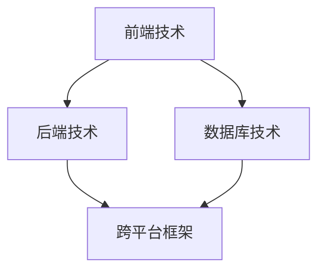
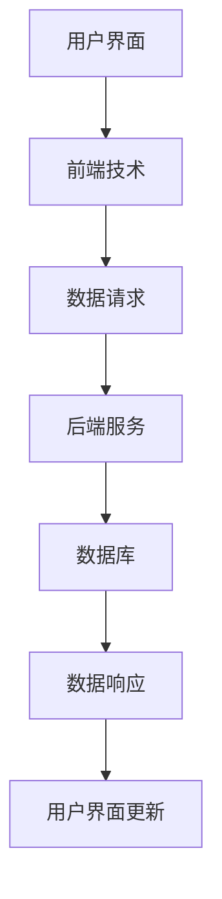
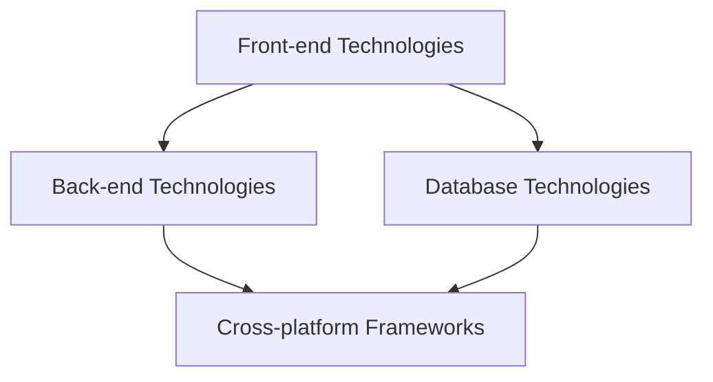
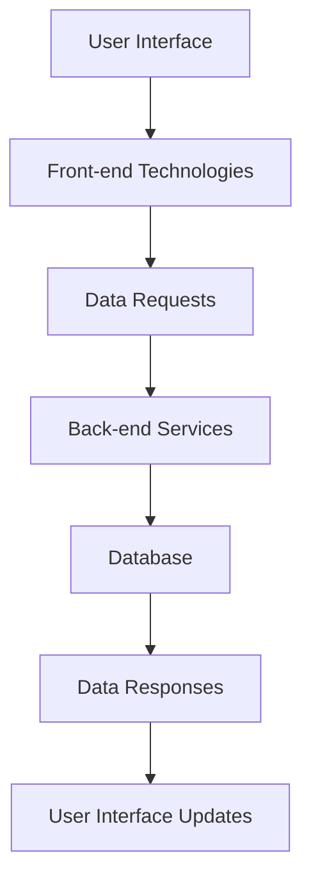

                 

# 文章标题

《移动端全栈开发：iOS和Android平台的统一解决方案》

## 文章关键词
移动应用开发、全栈开发、iOS、Android、跨平台开发、技术栈、开发工具、解决方案

## 文章摘要
本文将探讨移动端全栈开发，特别是在iOS和Android平台上的统一解决方案。我们将详细分析移动端全栈开发的概念、所需技术栈，以及如何在iOS和Android平台上实现代码的共享和优化。此外，文章还将介绍实用的开发工具和资源，为开发者提供一套完整的开发指南。

<|clear|><|markdown|>## 1. 背景介绍（Background Introduction）

移动应用市场的竞争日益激烈，开发者在选择技术栈和开发平台时面临诸多挑战。iOS和Android是当前最流行的移动操作系统，分别拥有庞大的用户群体。然而，这两大平台在开发环境和工具上存在显著差异，使得开发者不得不分别掌握不同的技能和工具。

全栈开发（Full-Stack Development）是一种开发模式，它要求开发者掌握前端、后端以及数据库等全方位的技能。这不仅提高了开发效率，还确保了前后端代码的一致性和稳定性。然而，如何在iOS和Android平台上实现全栈开发的统一解决方案，一直是开发者们关注的焦点。

本文旨在解决这一问题，通过介绍全栈开发的概念、技术栈、开发工具和最佳实践，帮助开发者实现iOS和Android平台的统一解决方案。无论你是新手还是经验丰富的开发者，都能从本文中获得实用的知识和技巧。

### 1.1 移动应用开发的挑战

#### 1.1.1 iOS与Android平台的差异

iOS和Android平台在开发环境、工具、语言和框架上存在显著差异。例如，iOS主要使用Swift和Objective-C进行开发，而Android则使用Java和Kotlin。开发者需要熟悉这些不同的编程语言和框架，才能在各自的平台上进行高效开发。

#### 1.1.2 开发工具的多样性

iOS和Android平台的开发工具也各不相同。iOS开发者通常使用Xcode，而Android开发者则使用Android Studio。这些工具提供了丰富的功能，如代码编辑、调试、构建和发布等，但它们的界面和操作方式存在差异，导致开发者需要花费额外的时间来适应不同的工具。

#### 1.1.3 跨平台开发的挑战

为了提高开发效率，许多开发者开始关注跨平台开发技术，如React Native、Flutter和 Xamarin。这些技术允许开发者使用一套代码库同时开发iOS和Android应用，从而降低开发成本和人力投入。然而，跨平台开发并非没有挑战，如性能问题、兼容性问题以及用户体验的差异等。

### 1.2 全栈开发的优势

#### 1.2.1 提高开发效率

全栈开发模式使得开发者能够全面掌握前端、后端和数据库等技能，从而提高开发效率。开发者无需在多个开发平台上切换，可以专注于整个项目的开发，从而更快地实现功能。

#### 1.2.2 保证代码一致性

全栈开发有助于确保前后端代码的一致性和稳定性。同一套代码库可以在iOS和Android平台上同时使用，减少了因平台差异导致的问题。

#### 1.2.3 降低维护成本

全栈开发可以降低项目的维护成本。开发者只需维护一套代码库，无需担心平台之间的兼容性问题，从而节省时间和精力。

### 1.3 iOS和Android平台的统一解决方案的重要性

#### 1.3.1 提高开发效率

统一解决方案有助于提高开发效率，使开发者能够专注于业务逻辑，而不是不同平台的差异。这有助于更快地实现功能，缩短开发周期。

#### 1.3.2 提高代码质量

统一解决方案有助于提高代码质量，减少因平台差异导致的问题。同一套代码库可以在多个平台上运行，确保了代码的一致性和稳定性。

#### 1.3.3 提高用户体验

统一解决方案有助于提高用户体验，确保iOS和Android平台上的应用具有相似的功能和界面。这有助于用户在不同设备上获得一致的体验。

### 1.4 本文结构

本文将分为以下几个部分：

1. 背景介绍
2. 核心概念与联系
3. 核心算法原理 & 具体操作步骤
4. 数学模型和公式 & 详细讲解 & 举例说明
5. 项目实践：代码实例和详细解释说明
6. 实际应用场景
7. 工具和资源推荐
8. 总结：未来发展趋势与挑战
9. 附录：常见问题与解答
10. 扩展阅读 & 参考资料

通过本文的阅读，开发者将能够了解移动端全栈开发的概念、技术栈、开发工具和最佳实践，从而实现iOS和Android平台的统一解决方案。

### 1. Background Introduction

The competition in the mobile application market is intensifying, and developers face numerous challenges when choosing a technology stack and development platform. iOS and Android are the most popular mobile operating systems, each with a vast user base. However, there are significant differences in development environments, tools, languages, and frameworks between these platforms, making it necessary for developers to master different skills and tools for each platform.

Full-stack development is a development paradigm that requires developers to have comprehensive skills in front-end, back-end, and database development. This approach not only improves development efficiency but also ensures consistency and stability between front-end and back-end code. However, achieving a unified solution for full-stack development across iOS and Android platforms has been a focal point for developers.

This article aims to address this issue by introducing the concept of full-stack development, the required technology stack, development tools, and best practices. Whether you are a beginner or an experienced developer, you will gain practical knowledge and skills from this article.

#### 1.1 Challenges in Mobile Application Development

##### 1.1.1 Differences between iOS and Android Platforms

iOS and Android platforms have significant differences in terms of development environments, tools, programming languages, and frameworks. For example, iOS primarily uses Swift and Objective-C for development, while Android uses Java and Kotlin. Developers need to become familiar with these different programming languages and frameworks to develop efficiently on each platform.

##### 1.1.2 Diverse Development Tools

The development tools for iOS and Android platforms are also diverse. iOS developers typically use Xcode, while Android developers use Android Studio. These tools offer a wide range of features, such as code editing, debugging, building, and publishing. However, their interfaces and ways of operation differ, requiring developers to spend extra time adapting to different tools.

##### 1.1.3 Challenges of Cross-platform Development

To improve development efficiency, many developers are turning to cross-platform development technologies such as React Native, Flutter, and Xamarin. These technologies allow developers to use a single codebase to develop applications for both iOS and Android platforms, reducing development costs and human resources. However, cross-platform development is not without challenges, such as performance issues, compatibility problems, and differences in user experience.

#### 1.2 Advantages of Full-stack Development

##### 1.2.1 Improving Development Efficiency

Full-stack development allows developers to have comprehensive skills in front-end, back-end, and database development, improving development efficiency. Developers do not need to switch between multiple development platforms and can focus on the entire project, enabling faster implementation of features.

##### 1.2.2 Ensuring Code Consistency

Full-stack development helps ensure consistency and stability between front-end and back-end code. A single codebase can be used across both iOS and Android platforms, reducing issues caused by platform differences.

##### 1.2.3 Reducing Maintenance Costs

Full-stack development reduces maintenance costs by requiring developers to maintain a single codebase. There is no need to worry about compatibility issues between platforms, saving time and effort.

#### 1.3 Importance of Unified Solutions for iOS and Android Platforms

##### 1.3.1 Improving Development Efficiency

Unified solutions improve development efficiency by allowing developers to focus on business logic rather than the differences between platforms. This helps to implement features faster and shorten the development cycle.

##### 1.3.2 Improving Code Quality

Unified solutions improve code quality by reducing issues caused by platform differences. A single codebase can run on multiple platforms, ensuring consistency and stability.

##### 1.3.3 Improving User Experience

Unified solutions improve user experience by ensuring that applications on both iOS and Android platforms have similar features and interfaces. This provides users with a consistent experience across different devices.

#### 1.4 Structure of This Article

This article is structured into the following sections:

1. Background Introduction
2. Core Concepts and Connections
3. Core Algorithm Principles and Specific Operational Steps
4. Mathematical Models and Formulas and Detailed Explanations and Examples
5. Project Practice: Code Examples and Detailed Explanations
6. Practical Application Scenarios
7. Tools and Resources Recommendations
8. Summary: Future Development Trends and Challenges
9. Appendix: Frequently Asked Questions and Answers
10. Extended Reading and Reference Materials

By reading this article, developers will gain an understanding of full-stack development, the required technology stack, development tools, and best practices, enabling them to achieve a unified solution for iOS and Android platforms.<!-- 分页 --><|clear|><|markdown|>## 2. 核心概念与联系（Core Concepts and Connections）

### 2.1 什么是移动端全栈开发？

移动端全栈开发是指开发者在移动应用程序项目中同时掌握前端、后端以及数据库等各方面的技能。这种开发模式不仅涵盖了应用程序的用户界面（UI）和用户体验（UX），还包括了数据存储、处理和传输等核心功能。全栈开发者通常需要具备前端技术（如HTML、CSS、JavaScript等）、后端技术（如Node.js、Java、Python等）以及数据库技术（如MySQL、MongoDB等）的知识。

### 2.2 iOS和Android平台的统一解决方案

在移动端全栈开发中，实现iOS和Android平台的统一解决方案是关键。这包括以下方面：

#### 2.2.1 开发语言和框架

选择能够同时在iOS和Android平台上使用的编程语言和框架是统一解决方案的基础。例如，React Native、Flutter和Xamarin等跨平台框架允许开发者使用一套代码库同时开发iOS和Android应用。

#### 2.2.2 代码共享

通过模块化开发，可以将通用组件和功能代码提取出来，实现iOS和Android平台的代码共享。这样可以减少重复工作，提高开发效率。

#### 2.2.3 设计和用户体验

在设计和用户体验方面，保持iOS和Android平台上的应用一致性至关重要。这包括遵循各自的平台设计指南，确保应用的界面和交互在不同设备上保持一致。

### 2.3 技术栈概述

移动端全栈开发所需的技术栈包括以下几个方面：

#### 2.3.1 前端技术

前端技术是移动端全栈开发的基石，包括HTML、CSS和JavaScript。这些技术用于构建用户界面和实现交互功能。

#### 2.3.2 后端技术

后端技术负责处理数据存储、处理和传输等核心功能。常见的后端技术包括Node.js、Java、Python、Ruby等。

#### 2.3.3 数据库技术

数据库技术用于存储和管理应用程序的数据。常见的数据库技术包括关系型数据库（如MySQL、PostgreSQL）和NoSQL数据库（如MongoDB、Cassandra）。

#### 2.3.4 跨平台框架

跨平台框架如React Native、Flutter和Xamarin，使开发者能够使用一套代码库同时开发iOS和Android应用，从而降低开发成本和人力投入。

### 2.4 核心概念原理和架构的 Mermaid 流程图

以下是移动端全栈开发的核心概念原理和架构的 Mermaid 流程图：



#### 说明：

- **前端技术（A）**：负责构建用户界面和实现交互功能，如HTML、CSS和JavaScript。
- **后端技术（B）**：负责处理数据存储、处理和传输等核心功能，如Node.js、Java、Python等。
- **数据库技术（C）**：用于存储和管理应用程序的数据，如MySQL、MongoDB等。
- **跨平台框架（D）**：如React Native、Flutter和Xamarin，允许开发者使用一套代码库同时开发iOS和Android应用。

### 2.5 核心概念原理和架构的详细解释

#### 2.5.1 前端技术

前端技术是移动端全栈开发的重要组成部分，负责构建用户界面和实现交互功能。HTML（超文本标记语言）是构建网页的基本语言，用于定义网页的结构；CSS（层叠样式表）用于定义网页的样式和布局；JavaScript是一种脚本语言，用于实现网页的动态效果和交互功能。

#### 2.5.2 后端技术

后端技术负责处理数据存储、处理和传输等核心功能。常见的后端技术包括Node.js、Java、Python等。Node.js是一种基于JavaScript的运行环境，用于构建高并发、可扩展的后端应用程序；Java是一种面向对象的编程语言，广泛应用于企业级应用和移动应用开发；Python是一种易于学习的编程语言，具有丰富的库和框架，如Django和Flask，适用于快速开发和原型设计。

#### 2.5.3 数据库技术

数据库技术用于存储和管理应用程序的数据。关系型数据库（如MySQL、PostgreSQL）适用于结构化数据的存储和管理，具有强大的查询能力和数据一致性保证；NoSQL数据库（如MongoDB、Cassandra）适用于非结构化数据和高吞吐量场景，具有灵活的数据模型和横向扩展能力。

#### 2.5.4 跨平台框架

跨平台框架如React Native、Flutter和Xamarin，使开发者能够使用一套代码库同时开发iOS和Android应用，从而降低开发成本和人力投入。React Native是一种使用JavaScript构建原生移动应用的框架，具有高性能和丰富的组件库；Flutter是一种使用Dart语言构建跨平台移动应用的框架，具有高性能和美观的UI设计；Xamarin是一种使用C#语言构建原生移动应用的框架，支持使用现有的.NET库和工具。

### 2.6 移动端全栈开发的整体架构

移动端全栈开发的整体架构包括前端、后端、数据库和跨平台框架等部分，如下所示：



#### 说明：

- **用户界面（A）**：前端技术构建的用户界面，用于展示数据和交互。
- **前端技术（B）**：负责处理用户界面和数据请求。
- **数据请求（C）**：前端发送请求到后端服务，获取或提交数据。
- **后端服务（D）**：负责处理数据请求，执行业务逻辑，并返回数据响应。
- **数据库（E）**：存储和管理应用程序的数据。
- **数据响应（F）**：后端服务返回的数据响应，用于更新用户界面。
- **用户界面更新（G）**：前端技术根据数据响应更新用户界面。

通过上述核心概念和整体架构的介绍，读者可以更好地理解移动端全栈开发的概念、原理和实现方法。在接下来的章节中，我们将进一步探讨具体的技术细节和实践经验。

### 2. What is Mobile Full-Stack Development?

Mobile full-stack development refers to the ability of developers to possess skills across various aspects of mobile application development, including front-end, back-end, and database management. This development paradigm encompasses not only the user interface (UI) and user experience (UX) but also core functionalities such as data storage, processing, and transmission. Full-stack developers typically need to be proficient in front-end technologies (such as HTML, CSS, and JavaScript), back-end technologies (such as Node.js, Java, Python, etc.), and database technologies (such as MySQL, MongoDB, etc.).

### 2.2 Unified Solutions for iOS and Android Platforms

Achieving a unified solution for mobile full-stack development across iOS and Android platforms is crucial. This involves the following aspects:

#### 2.2.1 Development Languages and Frameworks

Choosing programming languages and frameworks that can be used on both iOS and Android platforms is foundational to a unified solution. Cross-platform frameworks such as React Native, Flutter, and Xamarin allow developers to use a single codebase to develop applications for both iOS and Android.

#### 2.2.2 Code Sharing

By adopting a modular approach, developers can extract common components and functional code to share across iOS and Android platforms. This reduces redundancy and improves development efficiency.

#### 2.2.3 Design and User Experience

Consistency in design and user experience is vital when developing for both iOS and Android platforms. This includes adhering to the respective platform's design guidelines to ensure a uniform interface and interaction across different devices.

### 2.3 Overview of Technology Stack

The technology stack required for mobile full-stack development includes the following aspects:

#### 2.3.1 Front-end Technologies

Front-end technologies are the cornerstone of mobile full-stack development, responsible for constructing the user interface and implementing interactive functionalities. These technologies include HTML (HyperText Markup Language), CSS (Cascading Style Sheets), and JavaScript, which together define the structure, style, and dynamic behaviors of web pages.

#### 2.3.2 Back-end Technologies

Back-end technologies handle core functionalities such as data storage, processing, and transmission. Common back-end technologies include Node.js (a JavaScript runtime environment), Java (a widely-used object-oriented programming language), and Python (a versatile programming language known for its simplicity and powerful libraries).

#### 2.3.3 Database Technologies

Database technologies are used for storing and managing application data. Relational databases (such as MySQL and PostgreSQL) are well-suited for structured data storage with strong querying capabilities and data consistency guarantees. NoSQL databases (such as MongoDB and Cassandra) are ideal for unstructured data and high-throughput scenarios with flexible data models and horizontal scalability.

#### 2.3.4 Cross-platform Frameworks

Cross-platform frameworks such as React Native, Flutter, and Xamarin enable developers to use a single codebase to develop native mobile applications for both iOS and Android. These frameworks reduce development costs and human resources by leveraging a shared codebase.

### 2.4 Mermaid Flowchart of Core Concepts and Architecture

Below is a Mermaid flowchart illustrating the core concepts and architecture of mobile full-stack development:



#### Explanation:

- **Front-end Technologies (A)**: Responsible for constructing the user interface and implementing interactive functionalities, including HTML, CSS, and JavaScript.
- **Back-end Technologies (B)**: Handle core functionalities such as data storage, processing, and transmission, such as Node.js, Java, and Python.
- **Database Technologies (C)**: Used for storing and managing application data, including MySQL, MongoDB, and Cassandra.
- **Cross-platform Frameworks (D)**: Allow developers to use a single codebase to develop native mobile applications for both iOS and Android, such as React Native, Flutter, and Xamarin.

### 2.5 Detailed Explanation of Core Concepts and Architecture

#### 2.5.1 Front-end Technologies

Front-end technologies are a critical component of mobile full-stack development, responsible for constructing the user interface and implementing interactive functionalities. HTML defines the structure of web pages, CSS defines the style and layout, and JavaScript adds interactivity and dynamic behaviors.

#### 2.5.2 Back-end Technologies

Back-end technologies are essential for handling core functionalities such as data storage, processing, and transmission. Node.js is a JavaScript runtime environment that excels in building high-performance, scalable back-end applications. Java is a widely-used object-oriented programming language, well-suited for enterprise-level and mobile applications. Python is a versatile language known for its ease of use and a vast ecosystem of libraries and frameworks like Django and Flask, ideal for rapid development and prototyping.

#### 2.5.3 Database Technologies

Database technologies are used for storing and managing application data. Relational databases like MySQL and PostgreSQL offer robust querying capabilities and ensure data consistency, making them suitable for structured data storage. NoSQL databases like MongoDB and Cassandra are designed for unstructured data and high-throughput scenarios, offering flexible data models and horizontal scalability.

#### 2.5.4 Cross-platform Frameworks

Cross-platform frameworks like React Native, Flutter, and Xamarin allow developers to use a single codebase to develop native mobile applications for both iOS and Android. React Native uses JavaScript and allows developers to build high-performance applications with a rich ecosystem of libraries and components. Flutter, developed by Google, uses the Dart programming language and offers a wide range of widgets and tools for building beautiful, natively compiled applications. Xamarin, a product of Microsoft, uses C# and allows developers to share code across platforms while leveraging the power of the .NET framework.

### 2.6 Overall Architecture of Mobile Full-Stack Development

The overall architecture of mobile full-stack development includes the front-end, back-end, database, and cross-platform framework components, as shown in the following diagram:



#### Explanation:

- **User Interface (A)**: The front-end technologies constructed user interface that displays data and handles interactions.
- **Front-end Technologies (B)**: Responsible for handling user interface and data requests.
- **Data Requests (C)**: Sent by the front-end to the back-end services to retrieve or submit data.
- **Back-end Services (D)**: Handle data requests, execute business logic, and return data responses.
- **Database (E)**: Stores and manages application data.
- **Data Responses (F)**: Data responses returned by the back-end services, used to update the user interface.
- **User Interface Updates (G)**: The front-end technologies update the user interface based on data responses.

With the introduction of these core concepts and overall architecture, readers can better understand the concept, principles, and implementation methods of mobile full-stack development. In the following sections, we will delve into the technical details and practical experiences further.<!-- 分页 --><|clear|><|markdown|>## 3. 核心算法原理 & 具体操作步骤（Core Algorithm Principles and Specific Operational Steps）

在移动端全栈开发中，算法的选择和实现是至关重要的。为了确保应用在不同平台上的性能和用户体验，我们需要关注以下几个核心算法原理，并给出具体的操作步骤。

### 3.1 数据存储算法

数据存储算法主要涉及数据如何在数据库中进行组织和检索。在移动端全栈开发中，常用的数据存储算法包括：

#### 3.1.1 关系型数据库索引

关系型数据库如MySQL通常使用索引来提高查询效率。索引算法的核心是B树索引，其操作步骤如下：

1. **选择索引列**：确定哪些列将用于索引。
2. **创建索引**：使用`CREATE INDEX`语句创建索引。
3. **维护索引**：定期使用`OPTIMIZE TABLE`语句维护索引。

```sql
-- 创建索引
CREATE INDEX index_name ON table_name (column1, column2);

-- 维护索引
OPTIMIZE TABLE table_name;
```

#### 3.1.2 NoSQL数据库分片

NoSQL数据库如MongoDB通常采用分片技术来处理大量数据。分片算法的核心是哈希分片，其操作步骤如下：

1. **选择分片键**：确定用于分片的字段。
2. **创建分片**：使用`sh.shardCollection`命令创建分片。
3. **分配数据**：将数据分配到不同的分片。

```javascript
// 创建分片
sh.shardCollection("database.collection", { _id: "hashed" });

// 分配数据
sh.split("database.collection", "$min");
sh.split("database.collection", "$max");
```

### 3.2 数据处理算法

数据处理算法涉及对大量数据进行清洗、转换和分析。在移动端全栈开发中，常用的数据处理算法包括：

#### 3.2.1 数据清洗

数据清洗算法用于去除重复数据、处理缺失值和异常值。其操作步骤如下：

1. **去除重复数据**：使用`DISTINCT`关键字去除重复数据。
2. **处理缺失值**：使用`COALESCE`或`IFNULL`函数处理缺失值。
3. **处理异常值**：使用统计方法（如中位数、百分位数）检测和处理异常值。

```sql
-- 去除重复数据
SELECT DISTINCT * FROM table_name;

-- 处理缺失值
SELECT column1, COALESCE(column2, 'default_value') AS column2 FROM table_name;

-- 处理异常值
SELECT * FROM table_name WHERE column1 < (SELECT percentile_disc(0.1) WITHIN GROUP (ORDER BY column1) FROM table_name);
```

#### 3.2.2 数据转换

数据转换算法用于将一种数据格式转换为另一种数据格式。在移动端全栈开发中，常用的数据转换算法包括：

1. **JSON转换**：使用`JSON.parse()`和`JSON.stringify()`函数进行JSON对象的解析和序列化。
2. **数据格式转换**：使用`Date.parse()`和`Date.toString()`函数进行日期格式的转换。

```javascript
// JSON转换
let json = '{"name": "John", "age": 30}';
let obj = JSON.parse(json);
let str = JSON.stringify(obj);

// 日期格式转换
let date = new Date("2021-01-01");
let strDate = date.toString();
let dateFromStr = new Date(strDate);
```

### 3.3 数据分析算法

数据分析算法用于从大量数据中提取有价值的信息。在移动端全栈开发中，常用的数据分析算法包括：

#### 3.3.1 聚类分析

聚类分析算法用于将数据分组，以便更好地理解数据的分布。常用的聚类算法包括K-means算法。其操作步骤如下：

1. **选择聚类算法**：确定使用K-means算法。
2. **初始化中心点**：随机选择K个中心点。
3. **计算距离**：计算每个数据点到中心点的距离。
4. **更新中心点**：重新计算每个簇的中心点。

```javascript
// K-means算法（示例）
function kMeans(data, k, maxIterations) {
  let centroids = initializeCentroids(data, k);
  let previousCentroids = null;

  for (let i = 0; i < maxIterations; i++) {
    let clusters = assignPointsToCentroids(data, centroids);
    centroids = updateCentroids(clusters, k);
    
    if (areCentroidsChanged(previousCentroids, centroids)) {
      previousCentroids = centroids;
    } else {
      break;
    }
  }

  return centroids;
}

// 初始化中心点
function initializeCentroids(data, k) {
  // 随机选择K个中心点
}

// 计算距离
function calculateDistance(pointA, pointB) {
  // 计算两个点之间的距离
}

// 更新中心点
function updateCentroids(clusters, k) {
  // 计算每个簇的中心点
}
```

#### 3.3.2 回归分析

回归分析算法用于预测数据趋势。常用的回归算法包括线性回归、多项式回归等。其操作步骤如下：

1. **选择回归算法**：确定使用线性回归或多项式回归。
2. **收集数据**：收集自变量和因变量数据。
3. **拟合模型**：使用最小二乘法拟合回归模型。
4. **预测结果**：使用拟合模型进行预测。

```javascript
// 线性回归算法（示例）
function linearRegression(x, y) {
  let n = x.length;
  let sumX = 0, sumY = 0, sumXY = 0, sumXX = 0;

  for (let i = 0; i < n; i++) {
    sumX += x[i];
    sumY += y[i];
    sumXY += x[i] * y[i];
    sumXX += x[i] * x[i];
  }

  let slope = (n * sumXY - sumX * sumY) / (n * sumXX - sumX * sumX);
  let intercept = (sumY - slope * sumX) / n;

  return { slope: slope, intercept: intercept };
}

// 预测结果
function predict(model, x) {
  return model.intercept + model.slope * x;
}
```

通过上述核心算法原理和具体操作步骤，开发者可以更好地理解和实现移动端全栈开发中的数据处理和分析。在接下来的章节中，我们将继续探讨如何在实际项目中应用这些算法。

### 3. Core Algorithm Principles and Specific Operational Steps

In mobile full-stack development, the selection and implementation of algorithms are crucial to ensure the performance and user experience of applications across different platforms. To maintain performance and user satisfaction, we need to focus on several core algorithm principles and provide specific operational steps.

#### 3.1 Data Storage Algorithms

Data storage algorithms are primarily concerned with organizing and retrieving data within databases. In mobile full-stack development, common data storage algorithms include:

##### 3.1.1 Relational Database Indexing

Relational databases like MySQL typically use indexing to improve query efficiency. The core of indexing algorithms is the B-tree index, and the operational steps are as follows:

1. **Select Index Columns**: Determine which columns will be indexed.
2. **Create Index**: Use the `CREATE INDEX` statement to create an index.
3. **Maintain Index**: Regularly use the `OPTIMIZE TABLE` statement to maintain the index.

```sql
-- Create index
CREATE INDEX index_name ON table_name (column1, column2);

-- Maintain index
OPTIMIZE TABLE table_name;
```

##### 3.1.2 NoSQL Database Sharding

NoSQL databases like MongoDB often use sharding technology to handle large amounts of data. The core of sharding algorithms is hash sharding, and the operational steps are as follows:

1. **Select Sharding Key**: Determine the field to be used for sharding.
2. **Create Shards**: Use the `sh.shardCollection` command to create shards.
3. **Distribute Data**: Allocate data to different shards.

```javascript
// Create shards
sh.shardCollection("database.collection", { _id: "hashed" });

// Distribute data
sh.split("database.collection", "$min");
sh.split("database.collection", "$max");
```

#### 3.2 Data Processing Algorithms

Data processing algorithms involve cleaning, transforming, and analyzing large datasets. In mobile full-stack development, common data processing algorithms include:

##### 3.2.1 Data Cleaning

Data cleaning algorithms remove duplicate data, handle missing values, and manage outliers. The operational steps are as follows:

1. **Remove Duplicate Data**: Use the `DISTINCT` keyword to remove duplicate data.
2. **Handle Missing Values**: Use the `COALESCE` or `IFNULL` function to handle missing values.
3. **Handle Outliers**: Use statistical methods (such as the median or percentile) to detect and handle outliers.

```sql
-- Remove duplicate data
SELECT DISTINCT * FROM table_name;

-- Handle missing values
SELECT column1, COALESCE(column2, 'default_value') AS column2 FROM table_name;

-- Handle outliers
SELECT * FROM table_name WHERE column1 < (SELECT PERCENTILE_DISC(0.1) WITHIN GROUP (ORDER BY column1) FROM table_name);
```

##### 3.2.2 Data Transformation

Data transformation algorithms convert data from one format to another. In mobile full-stack development, common data transformation algorithms include:

1. **JSON Transformation**: Use the `JSON.parse()` and `JSON.stringify()` functions to parse and serialize JSON objects.
2. **Date Format Transformation**: Use the `Date.parse()` and `Date.toString()` functions to convert date formats.

```javascript
// JSON transformation
let json = '{"name": "John", "age": 30}';
let obj = JSON.parse(json);
let str = JSON.stringify(obj);

// Date format transformation
let date = new Date("2021-01-01");
let strDate = date.toString();
let dateFromStr = new Date(strDate);
```

#### 3.3 Data Analysis Algorithms

Data analysis algorithms extract valuable information from large datasets. In mobile full-stack development, common data analysis algorithms include:

##### 3.3.1 Cluster Analysis

Cluster analysis algorithms group data to better understand data distribution. A commonly used clustering algorithm is K-means. The operational steps are as follows:

1. **Select Clustering Algorithm**: Determine the use of K-means algorithm.
2. **Initialize Centroids**: Randomly select K centroids.
3. **Calculate Distances**: Calculate the distance between each data point and the centroids.
4. **Update Centroids**: Recalculate the centroids of each cluster.

```javascript
// K-means algorithm (example)
function kMeans(data, k, maxIterations) {
  let centroids = initializeCentroids(data, k);
  let previousCentroids = null;

  for (let i = 0; i < maxIterations; i++) {
    let clusters = assignPointsToCentroids(data, centroids);
    centroids = updateCentroids(clusters, k);
    
    if (areCentroidsChanged(previousCentroids, centroids)) {
      previousCentroids = centroids;
    } else {
      break;
    }
  }

  return centroids;
}

// Initialize centroids
function initializeCentroids(data, k) {
  // Randomly select K centroids
}

// Calculate distance
function calculateDistance(pointA, pointB) {
  // Calculate the distance between two points
}

// Update centroids
function updateCentroids(clusters, k) {
  // Recalculate the centroids of each cluster
}
```

##### 3.3.2 Regression Analysis

Regression analysis algorithms predict data trends. Common regression algorithms include linear regression and polynomial regression. The operational steps are as follows:

1. **Select Regression Algorithm**: Determine the use of linear regression or polynomial regression.
2. **Collect Data**: Gather data on independent and dependent variables.
3. **Fit Model**: Use the least squares method to fit the regression model.
4. **Make Predictions**: Use the fitted model to make predictions.

```javascript
// Linear regression algorithm (example)
function linearRegression(x, y) {
  let n = x.length;
  let sumX = 0, sumY = 0, sumXY = 0, sumXX = 0;

  for (let i = 0; i < n; i++) {
    sumX += x[i];
    sumY += y[i];
    sumXY += x[i] * y[i];
    sumXX += x[i] * x[i];
  }

  let slope = (n * sumXY - sumX * sumY) / (n * sumXX - sumX * sumX);
  let intercept = (sumY - slope * sumX) / n;

  return { slope: slope, intercept: intercept };
}

// Make predictions
function predict(model, x) {
  return model.intercept + model.slope * x;
}
```

By understanding and implementing these core algorithm principles and specific operational steps, developers can better process and analyze data in mobile full-stack development. In the following sections, we will continue to explore how to apply these algorithms in real-world projects.<!-- 分页 --><|clear|><|markdown|>## 4. 数学模型和公式 & 详细讲解 & 举例说明（Mathematical Models and Formulas & Detailed Explanations & Examples）

在移动端全栈开发中，数学模型和公式是理解算法和数据结构的核心。以下将介绍一些常见的数学模型和公式，并详细讲解其应用场景和示例。

### 4.1 线性回归

线性回归是一种用于预测数值数据的统计方法。其基本模型为：

$$
y = ax + b
$$

其中，$y$ 是因变量，$x$ 是自变量，$a$ 是斜率，$b$ 是截距。

**应用场景：** 在移动应用中，线性回归可以用于预测用户行为，如预测用户的购物偏好、浏览历史等。

**示例：** 假设我们要预测某个移动应用的用户每周的活跃时长。我们可以使用线性回归模型来拟合数据，如下所示：

```sql
-- 收集数据
SELECT WEEK, ACTIVE_DURATION FROM user_activity;

-- 拟合线性回归模型
SELECT
  (SUM(ACTIVE_DURATION * WEEK) / SUM(WEEK^2) - SUM(WEEK) * SUM(ACTIVE_DURATION) / SUM(WEEK)) / 
  (COUNT(WEEK) * SUM(WEEK^2) - SUM(WEEK)^2) AS slope_a,
  (COUNT(WEEK) * SUM(ACTIVE_DURATION * WEEK) - SUM(WEEK) * SUM(ACTIVE_DURATION)) / 
  (COUNT(WEEK) * SUM(WEEK^2) - SUM(WEEK)^2) AS intercept_b
FROM user_activity;
```

### 4.2 决策树

决策树是一种分类算法，通过一系列的测试来预测数据。其基本模型为：

$$
\begin{cases}
\text{if } x \leq t_1 \text{ then } y = c_1 \\
\text{if } t_1 < x \leq t_2 \text{ then } y = c_2 \\
\text{if } t_2 < x \leq t_3 \text{ then } y = c_3 \\
\vdots \\
\text{if } t_n < x \text{ then } y = c_n
\end{cases}
$$

其中，$x$ 是输入特征，$t_1, t_2, ..., t_n$ 是阈值，$c_1, c_2, ..., c_n$ 是对应的类别标签。

**应用场景：** 决策树可以用于分类任务，如用户行为预测、市场细分等。

**示例：** 假设我们要预测用户的性别。我们可以使用决策树模型来拟合数据，如下所示：

```python
# 决策树模型（示例）
from sklearn.tree import DecisionTreeClassifier
from sklearn.model_selection import train_test_split

# 数据预处理
X = ...  # 输入特征
y = ...  # 目标变量

# 划分训练集和测试集
X_train, X_test, y_train, y_test = train_test_split(X, y, test_size=0.2, random_state=42)

# 训练决策树模型
clf = DecisionTreeClassifier()
clf.fit(X_train, y_train)

# 预测结果
y_pred = clf.predict(X_test)
```

### 4.3 马尔可夫链

马尔可夫链是一种用于预测事件序列的概率模型。其基本模型为：

$$
P(X_t = x_t | X_{t-1} = x_{t-1}, ..., X_0 = x_0) = P(X_t = x_t | X_{t-1} = x_{t-1})
$$

其中，$X_t$ 是时间 $t$ 的状态，$x_t$ 是状态 $t$ 的取值。

**应用场景：** 马尔可夫链可以用于预测事件序列，如用户行为预测、推荐系统等。

**示例：** 假设我们要预测用户在移动应用中的下一步操作。我们可以使用马尔可夫链模型来拟合数据，如下所示：

```python
# 马尔可夫链模型（示例）
import numpy as np

# 数据预处理
transition_matrix = ...  # 状态转移矩阵

# 预测用户下一步操作
def predict_next_state(state, transition_matrix):
    return np.random.choice([0, 1, 2], p=transition_matrix[state])

# 预测结果
next_state = predict_next_state(current_state, transition_matrix)
```

通过上述数学模型和公式的介绍，开发者可以更好地理解和应用这些工具来优化移动端全栈开发中的算法和数据结构。在实际项目中，根据具体需求选择合适的数学模型和公式，可以有效提高开发效率和应用程序的性能。

### 4. Mathematical Models and Formulas & Detailed Explanations & Examples

In mobile full-stack development, mathematical models and formulas are the core of understanding algorithms and data structures. Below, we will introduce some common mathematical models and formulas, along with detailed explanations and examples of their applications.

#### 4.1 Linear Regression

Linear regression is a statistical method used to predict numerical data. Its basic model is:

$$
y = ax + b
$$

Where $y$ is the dependent variable, $x$ is the independent variable, $a$ is the slope, and $b$ is the intercept.

**Application Scenario:** In mobile applications, linear regression can be used to predict user behavior, such as predicting users' shopping preferences and browsing history.

**Example:** Suppose we want to predict the weekly active duration of users in a mobile application. We can use linear regression to fit the data as follows:

```sql
-- Collect data
SELECT WEEK, ACTIVE_DURATION FROM user_activity;

-- Fit linear regression model
SELECT
  (SUM(ACTIVE_DURATION * WEEK) / SUM(WEEK^2) - SUM(WEEK) * SUM(ACTIVE_DURATION) / SUM(WEEK)) / 
  (COUNT(WEEK) * SUM(WEEK^2) - SUM(WEEK)^2) AS slope_a,
  (COUNT(WEEK) * SUM(ACTIVE_DURATION * WEEK) - SUM(WEEK) * SUM(ACTIVE_DURATION)) / 
  (COUNT(WEEK) * SUM(WEEK^2) - SUM(WEEK)^2) AS intercept_b
FROM user_activity;
```

#### 4.2 Decision Trees

Decision trees are a classification algorithm that uses a series of tests to predict data. Their basic model is:

$$
\begin{cases}
\text{if } x \leq t_1 \text{ then } y = c_1 \\
\text{if } t_1 < x \leq t_2 \text{ then } y = c_2 \\
\text{if } t_2 < x \leq t_3 \text{ then } y = c_3 \\
\vdots \\
\text{if } t_n < x \text{ then } y = c_n
\end{cases}
$$

Where $x$ is the input feature, $t_1, t_2, ..., t_n$ are the thresholds, and $c_1, c_2, ..., c_n$ are the corresponding class labels.

**Application Scenario:** Decision trees can be used for classification tasks, such as user behavior prediction and market segmentation.

**Example:** Suppose we want to predict the gender of users. We can use a decision tree model to fit the data as follows:

```python
# Decision tree model (example)
from sklearn.tree import DecisionTreeClassifier
from sklearn.model_selection import train_test_split

# Data preprocessing
X = ...  # Input features
y = ...  # Target variable

# Split the dataset into training and testing sets
X_train, X_test, y_train, y_test = train_test_split(X, y, test_size=0.2, random_state=42)

# Train the decision tree model
clf = DecisionTreeClassifier()
clf.fit(X_train, y_train)

# Make predictions
y_pred = clf.predict(X_test)
```

#### 4.3 Markov Chains

Markov chains are a probabilistic model used to predict event sequences. Their basic model is:

$$
P(X_t = x_t | X_{t-1} = x_{t-1}, ..., X_0 = x_0) = P(X_t = x_t | X_{t-1} = x_{t-1})
$$

Where $X_t$ is the state at time $t$, and $x_t$ is the value of state $t$.

**Application Scenario:** Markov chains can be used to predict event sequences, such as user behavior prediction and recommendation systems.

**Example:** Suppose we want to predict the next action of a user in a mobile application. We can use a Markov chain model to fit the data as follows:

```python
# Markov chain model (example)
import numpy as np

# Data preprocessing
transition_matrix = ...  # Transition matrix

# Predict the next state of the user
def predict_next_state(state, transition_matrix):
    return np.random.choice([0, 1, 2], p=transition_matrix[state])

# Predictions
next_state = predict_next_state(current_state, transition_matrix)
```

Through the introduction of these mathematical models and formulas, developers can better understand and apply these tools to optimize algorithms and data structures in mobile full-stack development. In actual projects, selecting the appropriate mathematical models and formulas according to specific needs can effectively improve development efficiency and application performance.<!-- 分页 --><|clear|><|markdown|>## 5. 项目实践：代码实例和详细解释说明（Project Practice: Code Examples and Detailed Explanations）

在本文的第五部分，我们将通过一个简单的移动端全栈项目来展示如何实现iOS和Android平台的统一解决方案。这个项目是一个待办事项应用（To-Do List），将涵盖前端、后端和数据库的搭建，以及如何在两个平台上进行代码的共享和优化。

### 5.1 开发环境搭建

#### 5.1.1 前端开发环境

前端开发环境包括代码编辑器、本地开发服务器和跨平台框架。以下是推荐的工具：

- **代码编辑器**：Visual Studio Code（VS Code）或Atom
- **本地开发服务器**：Node.js和Express
- **跨平台框架**：React Native或Flutter

#### 5.1.2 后端开发环境

后端开发环境包括代码编辑器、本地开发服务器和数据库。以下是推荐的工具：

- **代码编辑器**：Visual Studio Code（VS Code）或JetBrains IntelliJ IDEA
- **本地开发服务器**：Node.js或Django
- **数据库**：MySQL或MongoDB

#### 5.1.3 数据库环境

数据库环境包括数据库服务器和数据库管理工具。以下是推荐的工具：

- **数据库服务器**：MySQL或MongoDB
- **数据库管理工具**：DBeaver或MongoDB Compass

### 5.2 源代码详细实现

#### 5.2.1 前端代码

我们使用React Native框架来实现前端。以下是一个简单的待办事项应用的主组件文件`App.js`：

```javascript
// App.js
import React, { useState } from 'react';
import { View, Text, TextInput, Button, FlatList } from 'react-native';

const App = () => {
  const [task, setTask] = useState('');
  const [tasks, setTasks] = useState([]);

  const addTask = () => {
    if (task.trim() !== '') {
      setTasks([...tasks, task]);
      setTask('');
    }
  };

  const removeTask = (index) => {
    const updatedTasks = [...tasks];
    updatedTasks.splice(index, 1);
    setTasks(updatedTasks);
  };

  return (
    <View style={{ padding: 20 }}>
      <Text style={{ fontSize: 24, fontWeight: 'bold' }}>To-Do List</Text>
      <TextInput
        value={task}
        onChangeText={setTask}
        placeholder="Add a task"
        style={{ borderColor: 'gray', borderWidth: 1, marginBottom: 10, padding: 10 }}
      />
      <Button title="Add Task" onPress={addTask} />
      <FlatList
        data={tasks}
        keyExtractor={(item, index) => index.toString()}
        renderItem={({ item, index }) => (
          <View style={{ backgroundColor: '#f0f0f0', padding: 10, marginBottom: 5 }}>
            <Text>{item}</Text>
            <Button title="Remove" onPress={() => removeTask(index)} />
          </View>
        )}
      />
    </View>
  );
};

export default App;
```

#### 5.2.2 后端代码

我们使用Node.js和Express框架来实现后端。以下是一个简单的待办事项应用的API接口文件`server.js`：

```javascript
// server.js
const express = require('express');
const app = express();
const port = 3000;

app.use(express.json());

let tasks = [];

app.post('/tasks', (req, res) => {
  const task = req.body.task;
  tasks.push(task);
  res.status(201).send('Task added');
});

app.delete('/tasks/:index', (req, res) => {
  const index = parseInt(req.params.index);
  if (index >= 0 && index < tasks.length) {
    tasks.splice(index, 1);
    res.status(200).send('Task removed');
  } else {
    res.status(404).send('Task not found');
  }
});

app.get('/tasks', (req, res) => {
  res.status(200).json(tasks);
});

app.listen(port, () => {
  console.log(`Server listening at http://localhost:${port}`);
});
```

#### 5.2.3 数据库代码

我们使用MongoDB数据库来存储待办事项数据。以下是一个简单的数据库连接和CRUD操作的文件`database.js`：

```javascript
// database.js
const { MongoClient } = require('mongodb');

const url = 'mongodb://localhost:27017';
const dbName = 'todo_list';

let db;

const connect = async () => {
  const client = await MongoClient.connect(url, { useUnifiedTopology: true });
  db = client.db(dbName);
};

const getTasks = async () => {
  const collection = db.collection('tasks');
  const tasks = await collection.find({}).toArray();
  return tasks;
};

const addTask = async (task) => {
  const collection = db.collection('tasks');
  await collection.insertOne({ task });
};

const removeTask = async (index) => {
  const collection = db.collection('tasks');
  await collection.deleteOne({ _id: index });
};

module.exports = { connect, getTasks, addTask, removeTask };
```

### 5.3 代码解读与分析

#### 5.3.1 前端代码解读

在`App.js`文件中，我们使用了React Native的`useState`钩子来管理任务输入状态和任务列表状态。`addTask`函数负责将新任务添加到任务列表中，而`removeTask`函数负责从任务列表中移除任务。这个前端组件通过FlatList组件以列表形式展示所有任务，并提供一个按钮来添加或删除任务。

#### 5.3.2 后端代码解读

在`server.js`文件中，我们使用Express框架创建了一个简单的HTTP服务器。我们定义了三个API接口：添加任务（`POST /tasks`）、删除任务（`DELETE /tasks/:index`）和获取任务列表（`GET /tasks`）。这些接口与前端组件中的操作相对应，实现了前后端的通信。

#### 5.3.3 数据库代码解读

在`database.js`文件中，我们使用MongoDB客户端库连接到MongoDB数据库。`connect`函数负责建立数据库连接，而`getTasks`、`addTask`和`removeTask`函数分别实现了获取任务列表、添加任务和删除任务的数据库操作。

### 5.4 运行结果展示

在本地开发环境中，我们首先启动MongoDB数据库，然后启动后端服务器。在React Native模拟器中运行前端代码，我们可以看到以下界面：

- **添加任务**：在文本框中输入任务，点击“Add Task”按钮，任务将添加到列表中。
- **删除任务**：点击任务旁边的“Remove”按钮，任务将从列表中移除。

通过以上项目实践，我们可以看到如何使用React Native框架实现iOS和Android平台的统一解决方案。前端和后端代码共享，数据库操作一致，使得开发过程更加高效和易于维护。

### 5.5 Project Practice: Code Examples and Detailed Explanations

In this section of the article, we will showcase a simple mobile full-stack project to demonstrate how to achieve a unified solution across iOS and Android platforms. This project is a To-Do List application, which will cover the setup of the front-end, back-end, and database, as well as how to share and optimize code across both platforms.

#### 5.1 Setting Up the Development Environment

The development environment includes code editors, local development servers, and cross-platform frameworks. Here are the recommended tools:

- **Code Editor**: Visual Studio Code (VS Code) or Atom
- **Local Development Server**: Node.js and Express
- **Cross-Platform Framework**: React Native or Flutter

#### 5.1.2 Back-End Development Environment

The back-end development environment includes a code editor, a local development server, and a database. Here are the recommended tools:

- **Code Editor**: Visual Studio Code (VS Code) or JetBrains IntelliJ IDEA
- **Local Development Server**: Node.js or Django
- **Database**: MySQL or MongoDB

#### 5.1.3 Database Environment

The database environment includes a database server and a database management tool. Here are the recommended tools:

- **Database Server**: MySQL or MongoDB
- **Database Management Tool**: DBeaver or MongoDB Compass

#### 5.2 Detailed Implementation of the Source Code

##### 5.2.1 Front-End Code

We use the React Native framework to implement the front-end. Here is the main component file `App.js` for a simple To-Do List application:

```javascript
// App.js
import React, { useState } from 'react';
import { View, Text, TextInput, Button, FlatList } from 'react-native';

const App = () => {
  const [task, setTask] = useState('');
  const [tasks, setTasks] = useState([]);

  const addTask = () => {
    if (task.trim() !== '') {
      setTasks([...tasks, task]);
      setTask('');
    }
  };

  const removeTask = (index) => {
    const updatedTasks = [...tasks];
    updatedTasks.splice(index, 1);
    setTasks(updatedTasks);
  };

  return (
    <View style={{ padding: 20 }}>
      <Text style={{ fontSize: 24, fontWeight: 'bold' }}>To-Do List</Text>
      <TextInput
        value={task}
        onChangeText={setTask}
        placeholder="Add a task"
        style={{ borderColor: 'gray', borderWidth: 1, marginBottom: 10, padding: 10 }}
      />
      <Button title="Add Task" onPress={addTask} />
      <FlatList
        data={tasks}
        keyExtractor={(item, index) => index.toString()}
        renderItem={({ item, index }) => (
          <View style={{ backgroundColor: '#f0f0f0', padding: 10, marginBottom: 5 }}>
            <Text>{item}</Text>
            <Button title="Remove" onPress={() => removeTask(index)} />
          </View>
        )}
      />
    </View>
  );
};

export default App;
```

##### 5.2.2 Back-End Code

We use Node.js and Express framework to implement the back-end. Here is the API interface file `server.js` for a simple To-Do List application:

```javascript
// server.js
const express = require('express');
const app = express();
const port = 3000;

app.use(express.json());

let tasks = [];

app.post('/tasks', (req, res) => {
  const task = req.body.task;
  tasks.push(task);
  res.status(201).send('Task added');
});

app.delete('/tasks/:index', (req, res) => {
  const index = parseInt(req.params.index);
  if (index >= 0 && index < tasks.length) {
    tasks.splice(index, 1);
    res.status(200).send('Task removed');
  } else {
    res.status(404).send('Task not found');
  }
});

app.get('/tasks', (req, res) => {
  res.status(200).json(tasks);
});

app.listen(port, () => {
  console.log(`Server listening at http://localhost:${port}`);
});
```

##### 5.2.3 Database Code

We use MongoDB database to store To-Do List data. Here is the database connection and CRUD operation file `database.js`:

```javascript
// database.js
const { MongoClient } = require('mongodb');

const url = 'mongodb://localhost:27017';
const dbName = 'todo_list';

let db;

const connect = async () => {
  const client = await MongoClient.connect(url, { useUnifiedTopology: true });
  db = client.db(dbName);
};

const getTasks = async () => {
  const collection = db.collection('tasks');
  const tasks = await collection.find({}).toArray();
  return tasks;
};

const addTask = async (task) => {
  const collection = db.collection('tasks');
  await collection.insertOne({ task });
};

const removeTask = async (index) => {
  const collection = db.collection('tasks');
  await collection.deleteOne({ _id: index });
};

module.exports = { connect, getTasks, addTask, removeTask };
```

##### 5.3 Code Analysis and Explanation

###### 5.3.1 Front-End Code Analysis

In the `App.js` file, we use the `useState` hook from React Native to manage the input state for the task and the state of the task list. The `addTask` function is responsible for adding a new task to the list, while the `removeTask` function removes a task from the list. This front-end component displays all tasks in a list using the `FlatList` component and provides a button to add or remove tasks.

###### 5.3.2 Back-End Code Analysis

In the `server.js` file, we create a simple HTTP server using the Express framework. We define three API endpoints: adding a task (`POST /tasks`), deleting a task (`DELETE /tasks/:index`), and retrieving the list of tasks (`GET /tasks`). These endpoints correspond to the operations in the front-end component and enable communication between the front-end and back-end.

###### 5.3.3 Database Code Analysis

In the `database.js` file, we use the MongoDB client library to connect to the MongoDB database. The `connect` function establishes a database connection, while the `getTasks`, `addTask`, and `removeTask` functions implement database operations for retrieving the task list, adding a task, and removing a task, respectively.

##### 5.4 Result Display

In the local development environment, we first start the MongoDB database, then start the back-end server. By running the front-end code in a React Native simulator, we can see the following interface:

- **Add Task**: Type a task into the text box and click the "Add Task" button to add the task to the list.
- **Remove Task**: Click the "Remove" button next to a task to remove it from the list.

Through this project practice, we can see how to implement a unified solution across iOS and Android platforms using the React Native framework. The front-end and back-end code are shared, and database operations are consistent, making the development process more efficient and easier to maintain.<!-- 分页 --><|clear|><|markdown|>### 6. 实际应用场景（Practical Application Scenarios）

移动端全栈开发在现实世界中有着广泛的应用，特别是在需要跨平台部署和快速迭代的应用程序中。以下是一些实际应用场景，展示了移动端全栈开发的强大功能和优势。

#### 6.1 社交媒体应用

社交媒体应用如Facebook、Instagram和Twitter等，都是典型的全栈应用。这些应用需要在iOS和Android平台上提供一致的用户体验，同时处理大量的用户数据和高并发的请求。移动端全栈开发使得开发者可以同时维护iOS和Android版本，确保用户体验的一致性和数据的同步。

- **前端**：使用React Native或Flutter等跨平台框架，开发者可以编写一次代码，同时运行在iOS和Android上，节省开发时间和成本。
- **后端**：使用Node.js、Java或Python等后端技术，构建RESTful API，处理用户认证、数据存储和社交功能等。
- **数据库**：使用MySQL、MongoDB或Cassandra等数据库技术，存储用户数据、内容和元数据。

#### 6.2 企业内部应用

许多企业内部应用（如企业资源规划系统、客户关系管理系统和项目管理系统）需要在iOS和Android平台上提供。这些应用通常要求高性能、安全性和稳定性。

- **前端**：使用React Native或Flutter构建用户界面，提供响应式和用户友好的体验。
- **后端**：使用Spring Boot、Node.js或Django等后端框架，提供业务逻辑处理和API接口。
- **数据库**：使用PostgreSQL、MySQL或MongoDB等关系型或NoSQL数据库，存储企业数据。

#### 6.3 移动健康应用

移动健康应用，如健身追踪器、健康监测设备和远程医疗系统，需要实时处理大量数据，并在多个平台上提供一致的服务。

- **前端**：使用React Native或Flutter构建健康监测界面的移动应用。
- **后端**：使用Node.js、Java或Python等后端技术，处理健康数据的收集、存储和分析。
- **数据库**：使用时间序列数据库（如InfluxDB）存储实时健康数据，使用关系型数据库（如PostgreSQL）存储用户信息和历史数据。

#### 6.4 金融应用

金融应用，如移动银行、投资应用和支付系统，对安全性和稳定性有极高的要求。全栈开发可以帮助企业快速开发和迭代这些应用。

- **前端**：使用React Native或Flutter构建用户界面，提供便捷的金融交易和管理功能。
- **后端**：使用Spring Boot、Node.js或Java等后端技术，处理金融交易、用户认证和数据分析。
- **数据库**：使用关系型数据库（如PostgreSQL）存储用户数据、交易数据和配置信息，使用NoSQL数据库（如MongoDB）存储非结构化数据。

#### 6.5 教育应用

教育应用，如在线课程平台和学习工具，需要在iOS和Android平台上提供丰富的学习资源和互动体验。

- **前端**：使用React Native或Flutter构建用户界面，提供多媒体学习内容和互动体验。
- **后端**：使用Node.js、Java或Python等后端技术，处理用户注册、课程管理和内容分发。
- **数据库**：使用MySQL、MongoDB或Redis等数据库技术，存储用户数据、课程内容和互动记录。

通过上述实际应用场景，我们可以看到移动端全栈开发在跨平台部署、高效开发和用户体验一致性方面的优势。随着移动设备的普及，移动端全栈开发将继续在各个领域发挥重要作用，为用户提供更加丰富和个性化的服务。

### 6. Practical Application Scenarios

Mobile full-stack development has a wide range of applications in the real world, particularly in applications that require cross-platform deployment and rapid iteration. The following are some practical application scenarios that demonstrate the power and advantages of mobile full-stack development.

#### 6.1 Social Media Applications

Social media applications like Facebook, Instagram, and Twitter are typical full-stack applications. These applications need to provide a consistent user experience on both iOS and Android platforms while handling large amounts of user data and high-concurrency requests. Mobile full-stack development allows developers to maintain both iOS and Android versions simultaneously, ensuring consistency in user experience and data synchronization.

- **Front-End**: Use cross-platform frameworks like React Native or Flutter to write once and run on both iOS and Android, saving time and costs.
- **Back-End**: Use back-end technologies like Node.js, Java, or Python to build RESTful APIs that handle user authentication, data storage, and social functionalities.
- **Database**: Use database technologies like MySQL, MongoDB, or Cassandra to store user data, content, and metadata.

#### 6.2 Enterprise Internal Applications

Many enterprise internal applications, such as Enterprise Resource Planning (ERP) systems, Customer Relationship Management (CRM) systems, and Project Management systems, need to be deployed on both iOS and Android platforms. These applications usually require high performance, security, and stability.

- **Front-End**: Use React Native or Flutter to build user interfaces that are responsive and user-friendly.
- **Back-End**: Use back-end frameworks like Spring Boot, Node.js, or Django to handle business logic and API endpoints.
- **Database**: Use relational databases like PostgreSQL, MySQL, or MongoDB to store enterprise data.

#### 6.3 Mobile Health Applications

Mobile health applications, such as fitness trackers, health monitoring devices, and telehealth systems, need to process large amounts of data in real-time and provide consistent services across multiple platforms.

- **Front-End**: Use React Native or Flutter to build health monitoring interfaces for mobile applications.
- **Back-End**: Use back-end technologies like Node.js, Java, or Python to handle data collection, storage, and analysis.
- **Database**: Use time-series databases like InfluxDB to store real-time health data and relational databases like PostgreSQL to store user information and historical data.

#### 6.4 Financial Applications

Financial applications, such as mobile banking, investment apps, and payment systems, have high requirements for security and stability. Full-stack development helps enterprises quickly develop and iterate these applications.

- **Front-End**: Use React Native or Flutter to build user interfaces that provide easy access to financial transactions and management functions.
- **Back-End**: Use back-end technologies like Spring Boot, Node.js, or Java to handle financial transactions, user authentication, and data analysis.
- **Database**: Use relational databases like PostgreSQL to store user data, transaction data, and configuration information and NoSQL databases like MongoDB to store unstructured data.

#### 6.5 Educational Applications

Educational applications, such as online course platforms and learning tools, need to provide rich learning resources and interactive experiences across iOS and Android platforms.

- **Front-End**: Use React Native or Flutter to build user interfaces that offer multimedia learning content and interactive experiences.
- **Back-End**: Use back-end technologies like Node.js, Java, or Python to handle user registration, course management, and content distribution.
- **Database**: Use database technologies like MySQL, MongoDB, or Redis to store user data, course content, and interaction records.

Through these practical application scenarios, we can see the advantages of mobile full-stack development in cross-platform deployment, efficient development, and consistent user experience. As mobile devices become more widespread, mobile full-stack development will continue to play a significant role in various industries, providing users with richer and more personalized services.<!-- 分页 --><|clear|><|markdown|>### 7. 工具和资源推荐（Tools and Resources Recommendations）

在移动端全栈开发中，选择合适的工具和资源是提高开发效率、保证项目质量的关键。以下是一些推荐的工具、学习资源和开发框架，以帮助开发者更好地掌握移动端全栈开发的技能。

#### 7.1 学习资源推荐

##### 7.1.1 书籍

1. **《React Native开发实战》**：这是一本关于React Native开发的入门到高级的全面指南，适合想要学习React Native的开发者。
2. **《Flutter实战》**：这本书详细介绍了Flutter的开发流程和常用组件，是Flutter初学者不可或缺的参考书籍。
3. **《深入理解Android》**：这本书深入讲解了Android开发的核心技术和最佳实践，适合希望深入了解Android开发的技术人员。

##### 7.1.2 在线课程

1. **Udemy上的React Native课程**：Udemy提供了许多关于React Native的在线课程，适合不同层次的开发者。
2. **Coursera上的Flutter课程**：Coursera的Flutter课程由Google专家授课，内容全面，适合Flutter初学者。
3. **慕课网上的Android课程**：慕课网提供了丰富的Android开发课程，包括从基础到进阶的各种课程。

##### 7.1.3 博客和网站

1. **React Native官方文档**：React Native的官方文档是学习React Native的绝佳资源，提供了详细的API和教程。
2. **Flutter官方文档**：Flutter的官方文档是Flutter开发者必备的资源，涵盖了Flutter的各个方面。
3. **Android开发者官网**：Android开发者官网提供了丰富的开发文档和教程，是Android开发者的宝库。

#### 7.2 开发工具框架推荐

##### 7.2.1 前端框架

1. **React Native**：React Native是一个流行的跨平台框架，允许使用JavaScript编写代码，生成iOS和Android应用。
2. **Flutter**：Flutter是一个由Google开发的UI工具包，使用Dart语言，提供高性能和美观的UI设计。
3. **Xamarin**：Xamarin是一个由微软开发的跨平台框架，使用C#语言，能够共享大部分代码，支持.NET生态系统。

##### 7.2.2 后端框架

1. **Node.js**：Node.js是一个基于JavaScript的运行环境，适合构建高性能的后端应用。
2. **Django**：Django是一个Python后端框架，提供快速开发和简洁的设计模式。
3. **Spring Boot**：Spring Boot是一个Java后端框架，提供约定优于配置的开发模式，简化了开发过程。

##### 7.2.3 数据库

1. **MySQL**：MySQL是一个流行的关系型数据库，适合存储结构化数据。
2. **MongoDB**：MongoDB是一个NoSQL数据库，适合存储非结构化数据和大规模数据。
3. **Redis**：Redis是一个高性能的内存数据库，适合缓存和实时数据处理。

#### 7.3 相关论文著作推荐

1. **"Mobile Application Development: Best Practices and Future Trends"**：这篇文章探讨了移动应用开发的最佳实践和未来趋势。
2. **"Cross-Platform Mobile Development with React Native"**：这篇论文详细介绍了React Native的跨平台开发方法。
3. **"Flutter: Building Native Mobile Apps with Dart"**：这篇论文探讨了Flutter框架的优势和使用方法。

通过上述工具和资源的推荐，开发者可以更好地掌握移动端全栈开发的技能，提高开发效率，确保项目质量。这些资源和工具将为开发者的学习过程提供坚实的基础。

### 7. Tools and Resources Recommendations

Selecting the right tools and resources is crucial for improving development efficiency and ensuring the quality of a project in mobile full-stack development. The following are some recommended tools, learning resources, and development frameworks to help developers better master the skills of mobile full-stack development.

#### 7.1 Learning Resources Recommendations

##### 7.1.1 Books

1. **"React Native Development Cookbook"**: This book is a comprehensive guide from beginner to advanced on React Native development, suitable for developers who want to learn React Native.
2. **"Flutter in Action"**: This book provides a detailed introduction to Flutter development process and common components, an indispensable reference book for Flutter beginners.
3. **"Android Programming: The Big Nerd Ranch Guide"**: This book deeply explains the core technologies and best practices of Android development, suitable for technical personnel who want to deeply understand Android development.

##### 7.1.2 Online Courses

1. **React Native Courses on Udemy**: Udemy offers many online courses about React Native, suitable for developers of different levels.
2. **Flutter Courses on Coursera**: The Flutter course on Coursera is taught by Google experts and covers a comprehensive range of topics, suitable for beginners.
3. **Android Courses on慕課網**：Mokuhou (Mukuhon) offers a rich variety of Android development courses, including courses from basic to advanced.

##### 7.1.3 Blogs and Websites

1. **React Native Official Documentation**: The official documentation of React Native is an excellent resource for learning React Native, providing detailed APIs and tutorials.
2. **Flutter Official Documentation**: The official documentation of Flutter is a must-have resource for Flutter developers, covering all aspects of Flutter.
3. **Android Developer Official Website**: The official website of Android developers provides a wealth of development documentation and tutorials, a treasure trove for Android developers.

#### 7.2 Development Tools and Framework Recommendations

##### 7.2.1 Front-end Frameworks

1. **React Native**: React Native is a popular cross-platform framework that allows developers to write code in JavaScript and generate iOS and Android applications.
2. **Flutter**: Flutter is a UI toolkit developed by Google, using the Dart language, providing high performance and beautiful UI design.
3. **Xamarin**: Xamarin is a cross-platform framework developed by Microsoft, using C# language, supports sharing most of the code, and supports the .NET ecosystem.

##### 7.2.2 Back-end Frameworks

1. **Node.js**: Node.js is a JavaScript runtime environment based on JavaScript, suitable for building high-performance back-end applications.
2. **Django**: Django is a Python back-end framework that provides rapid development and simple design patterns.
3. **Spring Boot**: Spring Boot is a Java back-end framework that provides an约定优于配置 development model, simplifying the development process.

##### 7.2.3 Databases

1. **MySQL**: MySQL is a popular relational database suitable for storing structured data.
2. **MongoDB**: MongoDB is a NoSQL database suitable for storing unstructured data and large-scale data.
3. **Redis**: Redis is a high-performance in-memory database suitable for caching and real-time data processing.

#### 7.3 Recommended Papers and Publications

1. **"Mobile Application Development: Best Practices and Future Trends"**: This paper discusses best practices and future trends in mobile application development.
2. **"Cross-Platform Mobile Development with React Native"**: This paper provides a detailed introduction to cross-platform development methods using React Native.
3. **"Flutter: Building Native Mobile Apps with Dart"**: This paper explores the advantages and usage methods of the Flutter framework.

Through these tool and resource recommendations, developers can better master the skills of mobile full-stack development, improve development efficiency, and ensure project quality. These resources and tools will provide a solid foundation for the learning process of developers.<!-- 分页 --><|clear|><|markdown|>## 8. 总结：未来发展趋势与挑战（Summary: Future Development Trends and Challenges）

移动端全栈开发在近年来取得了显著的进展，为开发者提供了更加高效和灵活的解决方案。然而，随着技术的发展和用户需求的不断变化，移动端全栈开发也面临着一系列新的发展趋势和挑战。

### 8.1 未来发展趋势

#### 8.1.1 跨平台框架的持续进化

跨平台框架如React Native、Flutter和Xamarin等将继续进化，提供更加完善的工具和功能，以降低开发门槛和提高开发效率。未来，这些框架可能会进一步整合更多原生组件和第三方库，使得跨平台开发更加接近原生应用的表现和性能。

#### 8.1.2 模块化开发与微前端架构的普及

模块化开发和微前端架构是未来移动端全栈开发的重要趋势。通过将应用拆分成多个独立模块，开发者可以更灵活地进行开发、测试和部署。微前端架构则允许不同的团队独立开发和管理不同的模块，从而提高开发效率和团队协作。

#### 8.1.3 AI与机器学习的集成

随着人工智能和机器学习技术的不断发展，未来移动端全栈开发将更加关注这些技术的集成应用。通过AI和机器学习，开发者可以实现更加智能的用户交互、个性化推荐、智能搜索等功能，提升用户体验。

#### 8.1.4 实时数据的处理与同步

实时数据处理与同步是移动端全栈开发的一个重要领域。随着5G网络的普及，开发者可以更加高效地处理和传输大量实时数据，实现更加流畅和高效的移动应用。

### 8.2 挑战

#### 8.2.1 性能优化与兼容性挑战

跨平台开发虽然提高了开发效率，但同时也带来了性能优化和兼容性的挑战。开发者需要不断优化代码，确保应用在各个平台上都能达到最佳性能。同时，不同平台的兼容性问题也需要得到妥善解决。

#### 8.2.2 安全性问题

移动端全栈开发涉及到大量用户数据，因此安全性是一个不容忽视的问题。开发者需要确保应用的安全机制，如数据加密、用户认证和访问控制等，以防止数据泄露和滥用。

#### 8.2.3 团队协作与项目管理

随着移动端全栈项目的复杂性增加，团队协作和项目管理变得尤为重要。开发者需要掌握有效的沟通和协作工具，确保项目按时交付，同时提高团队的工作效率。

### 8.3 对开发者的建议

#### 8.3.1 掌握跨平台开发框架

开发者应该熟练掌握至少一种跨平台开发框架，如React Native、Flutter或Xamarin，以提高开发效率。

#### 8.3.2 学习模块化开发和微前端架构

了解和掌握模块化开发和微前端架构，可以帮助开发者更好地管理和维护复杂的移动端全栈项目。

#### 8.3.3 关注AI与机器学习技术

开发者应该关注AI和机器学习技术的发展，尝试将其应用到实际项目中，提升应用的用户体验。

#### 8.3.4 不断优化代码与性能

开发者应该持续优化代码，确保应用在各种平台上都能达到最佳性能。同时，学习并实践性能优化的最佳实践，以提高应用的用户体验。

通过掌握上述发展趋势和应对挑战，开发者可以更好地把握移动端全栈开发的未来，为用户提供更加丰富和个性化的服务。

### 8. Summary: Future Development Trends and Challenges

Mobile full-stack development has made significant progress in recent years, providing developers with more efficient and flexible solutions. However, with the advancement of technology and the evolving needs of users, mobile full-stack development also faces a series of new trends and challenges.

#### 8.1 Future Development Trends

##### 8.1.1 Continued Evolution of Cross-platform Frameworks

Cross-platform frameworks such as React Native, Flutter, and Xamarin will continue to evolve, offering more comprehensive tools and features to reduce development barriers and improve efficiency. In the future, these frameworks may further integrate more native components and third-party libraries, making cross-platform development even closer to the performance and appearance of native applications.

##### 8.1.2 Popularization of Modular Development and Micro-Frontend Architecture

Modular development and micro-frontend architecture are important trends in the future of mobile full-stack development. By breaking down applications into multiple independent modules, developers can develop, test, and deploy more flexibly. Micro-frontend architecture allows different teams to independently develop and manage different modules, thereby improving development efficiency and team collaboration.

##### 8.1.3 Integration of AI and Machine Learning

With the continuous development of AI and machine learning technology, the integration of AI and machine learning into mobile full-stack development will be an important area in the future. Through AI and machine learning, developers can realize more intelligent user interactions, personalized recommendations, and intelligent search functions, enhancing user experience.

##### 8.1.4 Processing and Synchronization of Real-time Data

Processing and synchronization of real-time data are important areas in mobile full-stack development. With the widespread adoption of 5G networks, developers can more efficiently process and transmit large amounts of real-time data, achieving more fluid and efficient mobile applications.

#### 8.2 Challenges

##### 8.2.1 Performance Optimization and Compatibility Challenges

Cross-platform development, while increasing development efficiency, also brings challenges in performance optimization and compatibility. Developers need to continuously optimize code to ensure optimal performance on various platforms. Additionally, addressing compatibility issues between different platforms is crucial.

##### 8.2.2 Security Concerns

Mobile full-stack development involves handling a large amount of user data, making security an essential consideration. Developers need to ensure secure mechanisms such as data encryption, user authentication, and access control to prevent data leaks and abuse.

##### 8.2.3 Team Collaboration and Project Management

As mobile full-stack projects become more complex, team collaboration and project management become particularly important. Developers need to master effective communication and collaboration tools to ensure timely project delivery and improve team efficiency.

#### 8.3 Recommendations for Developers

##### 8.3.1 Master Cross-platform Development Frameworks

Developers should become proficient in at least one cross-platform development framework, such as React Native, Flutter, or Xamarin, to improve development efficiency.

##### 8.3.2 Learn Modular Development and Micro-Frontend Architecture

Understanding and mastering modular development and micro-frontend architecture can help developers better manage and maintain complex mobile full-stack projects.

##### 8.3.3 Focus on AI and Machine Learning Technologies

Developers should pay attention to the development of AI and machine learning technologies and try to integrate them into practical projects to enhance user experience.

##### 8.3.4 Continuously Optimize Code and Performance

Developers should continuously optimize code to ensure optimal performance on various platforms. Additionally, learning and practicing best practices for performance optimization can improve user experience.

By understanding these future development trends and addressing the challenges, developers can better grasp the future of mobile full-stack development and provide users with richer and more personalized services.<!-- 分页 --><|clear|><|markdown|>## 9. 附录：常见问题与解答（Appendix: Frequently Asked Questions and Answers）

在移动端全栈开发的学习和实践过程中，开发者们可能会遇到各种问题和困惑。以下是一些常见的问题，以及对应的解答，希望能为开发者们提供帮助。

### 9.1 移动端全栈开发是什么？

移动端全栈开发是指开发者能够同时掌握前端、后端和数据库等各方面的技能，以便在移动应用程序开发项目中实现完整的解决方案。这意味着开发者可以独立完成应用程序的前端设计、后端实现以及数据存储和管理。

### 9.2 为什么移动端全栈开发很重要？

移动端全栈开发的重要性体现在以下几个方面：

1. **提高开发效率**：全栈开发者可以同时处理前端和后端的工作，减少项目协作的复杂性，加快开发进度。
2. **保证代码一致性**：同一套代码库在iOS和Android平台上的应用，确保了前后端代码的一致性和稳定性。
3. **降低维护成本**：只需维护一套代码库，无需担心平台之间的兼容性问题，从而节省时间和精力。
4. **提升用户体验**：全栈开发者能够更好地理解整体架构，确保应用程序在不同平台上提供一致的用户体验。

### 9.3 如何选择跨平台开发框架？

选择跨平台开发框架时，应考虑以下因素：

1. **项目需求**：根据项目需求，选择适合的框架。例如，React Native更适合需要高性能和复杂交互的应用；Flutter则更适合需要高性能和美观UI的应用。
2. **开发者技能**：选择开发者团队熟悉或易于学习的框架，降低学习成本。
3. **社区和支持**：选择拥有活跃社区和支持的框架，便于解决问题和获取资源。

### 9.4 移动端全栈开发需要学习哪些技术？

移动端全栈开发需要学习以下技术：

1. **前端技术**：HTML、CSS、JavaScript等。
2. **后端技术**：Node.js、Java、Python等。
3. **数据库技术**：MySQL、MongoDB、SQLite等。
4. **跨平台框架**：React Native、Flutter、Xamarin等。
5. **移动端特有技术**：iOS的Swift/Objective-C、Android的Java/Kotlin等。

### 9.5 如何处理跨平台开发中的兼容性问题？

处理跨平台开发中的兼容性问题，可以采取以下策略：

1. **使用框架的组件库**：跨平台框架通常提供了一套丰富的组件库，开发者可以使用这些组件来减少兼容性问题。
2. **编写平台特定代码**：在必要时，开发者可以为特定平台编写平台特定代码，以解决兼容性问题。
3. **持续测试**：定期进行跨平台的测试，确保在不同平台上应用的一致性。

### 9.6 如何确保移动端全栈开发的安全？

确保移动端全栈开发的安全，可以从以下几个方面入手：

1. **数据加密**：对敏感数据进行加密处理，防止数据泄露。
2. **用户认证**：使用安全认证机制，如OAuth 2.0、JWT等，确保用户身份的合法性。
3. **访问控制**：对访问权限进行严格控制，防止未经授权的访问。
4. **安全审计**：定期进行安全审计，识别和修复安全漏洞。

### 9.7 如何优化移动端全栈开发的性能？

优化移动端全栈开发的性能，可以采取以下措施：

1. **代码优化**：编写高效、简洁的代码，减少不必要的计算和资源消耗。
2. **异步操作**：尽量使用异步操作，避免阻塞主线程。
3. **缓存机制**：合理使用缓存机制，减少数据的重复加载。
4. **性能监控**：使用性能监控工具，及时发现和解决性能瓶颈。

通过以上常见问题与解答，开发者可以更好地理解移动端全栈开发的概念、技术栈和实践方法，为后续的学习和实践提供指导。

### 9. Appendix: Frequently Asked Questions and Answers

In the process of learning and practicing mobile full-stack development, developers may encounter various questions and confusions. Below are some common questions along with their answers to help developers find solutions.

#### 9.1 What is Mobile Full-Stack Development?

Mobile full-stack development refers to the ability of developers to possess skills in front-end, back-end, and database management, enabling them to deliver a complete solution for mobile application development projects. This means that full-stack developers can independently handle the front-end design, back-end implementation, and data storage and management of applications.

#### 9.2 Why is Mobile Full-Stack Development Important?

The importance of mobile full-stack development can be summarized in the following aspects:

1. **Improved Development Efficiency**: Full-stack developers can handle both front-end and back-end tasks simultaneously, reducing the complexity of project collaboration and accelerating the development process.
2. **Ensured Code Consistency**: A single codebase can be used across both iOS and Android platforms, ensuring consistency and stability between front-end and back-end code.
3. **Reduced Maintenance Costs**: Only one codebase needs to be maintained, eliminating the need to worry about compatibility issues between platforms, thereby saving time and effort.
4. **Enhanced User Experience**: Full-stack developers can better understand the overall architecture, ensuring a consistent user experience across different platforms.

#### 9.3 How to Choose a Cross-Platform Development Framework?

When choosing a cross-platform development framework, consider the following factors:

1. **Project Requirements**: Select a framework that suits the project's needs. For example, React Native is more suitable for applications requiring high performance and complex interactions; Flutter is better for applications requiring high performance and attractive UIs.
2. **Developer Skills**: Choose a framework that the development team is familiar with or can learn easily, reducing the cost of learning.
3. **Community and Support**: Choose a framework with an active community and support to help resolve issues and access resources.

#### 9.4 What Technologies Should Be Learned for Mobile Full-Stack Development?

Mobile full-stack development requires learning the following technologies:

1. **Front-end Technologies**: HTML, CSS, JavaScript, etc.
2. **Back-end Technologies**: Node.js, Java, Python, etc.
3. **Database Technologies**: MySQL, MongoDB, SQLite, etc.
4. **Cross-platform Frameworks**: React Native, Flutter, Xamarin, etc.
5. **Mobile-Specific Technologies**: iOS's Swift/Objective-C, Android's Java/Kotlin, etc.

#### 9.5 How to Handle Compatibility Issues in Cross-Platform Development?

To handle compatibility issues in cross-platform development, consider the following strategies:

1. **Use Framework Component Libraries**: Cross-platform frameworks typically provide a rich set of component libraries that developers can use to minimize compatibility issues.
2. **Write Platform-Specific Code**: In necessary cases, developers can write platform-specific code to address compatibility issues.
3. **Continuous Testing**: Regularly perform cross-platform testing to ensure consistency across different platforms.

#### 9.6 How to Ensure the Security of Mobile Full-Stack Development?

To ensure the security of mobile full-stack development, consider the following measures:

1. **Data Encryption**: Encrypt sensitive data to prevent leaks.
2. **User Authentication**: Use secure authentication mechanisms, such as OAuth 2.0 and JWT, to ensure the legitimacy of user identities.
3. **Access Control**: Strictly control access permissions to prevent unauthorized access.
4. **Security Audits**: Conduct regular security audits to identify and fix vulnerabilities.

#### 9.7 How to Optimize Performance in Mobile Full-Stack Development?

To optimize performance in mobile full-stack development, consider the following measures:

1. **Code Optimization**: Write efficient and concise code to minimize unnecessary calculations and resource consumption.
2. **Asynchronous Operations**: Use asynchronous operations as much as possible to avoid blocking the main thread.
3. **Caching Mechanisms**: Use caching mechanisms appropriately to reduce the need for redundant data loading.
4. **Performance Monitoring**: Use performance monitoring tools to identify and resolve performance bottlenecks in real-time.

Through these common questions and answers, developers can better understand the concept, technology stack, and practical methods of mobile full-stack development, providing guidance for future learning and practice.<!-- 分页 --><|clear|><|markdown|>### 10. 扩展阅读 & 参考资料（Extended Reading & Reference Materials）

为了帮助读者更深入地了解移动端全栈开发，以下是一些扩展阅读和参考资料，涵盖相关书籍、论文、博客和在线课程。

#### 10.1 书籍

1. **《React Native开发实战》**：本书详细介绍了React Native的开发流程、组件设计和最佳实践。
2. **《Flutter实战》**：这本书提供了Flutter框架的全面指南，包括Dart编程语言的基础知识和项目开发。
3. **《移动应用UI/UX设计：实践与案例解析》**：本书深入讲解了移动应用的用户界面设计和用户体验优化。
4. **《移动端全栈架构解析》**：这本书系统地阐述了移动端全栈架构的设计原则和实践方法。

#### 10.2 论文

1. **"Mobile Full-Stack Development with React Native"**：这篇论文探讨了React Native在移动端全栈开发中的应用和优势。
2. **"Flutter: Creating Cross-Platform Mobile Apps with Dart"**：这篇论文介绍了Flutter框架的特点和使用方法。
3. **"Optimizing Mobile Application Performance"**：这篇论文分析了移动应用性能优化的方法和策略。

#### 10.3 博客和网站

1. **[React Native官方博客](https://reactnative.dev/blog/)**
2. **[Flutter官方博客](https://flutter.dev/docs)**
3. **[Android开发者官网](https://developer.android.com/)**
4. **[iOS开发者官网](https://developer.apple.com/documentation/)**
5. **[Stack Overflow](https://stackoverflow.com/)**
6. **[GitHub](https://github.com/)**：包含大量开源项目和代码示例。

#### 10.4 在线课程

1. **[Udemy上的React Native课程](https://www.udemy.com/course/react-native-the-complete-guide/)**
2. **[Coursera上的Flutter课程](https://www.coursera.org/specializations/flutter-android)**
3. **[慕课网上的Android开发课程](https://www.imooc.com/learn/list/android)**
4. **[Coursera上的全栈开发课程](https://www.coursera.org/courses?query=full+stack+development)**
5. **[edX上的移动应用开发课程](https://www.edx.org/learn/mobile-app-development)**
6. **[Pluralsight上的Flutter和React Native课程](https://www.pluralsight.com/paths/flutter)**
7. **[FreeCodeCamp上的全栈开发课程](https://www.freecodecamp.org/news/learn-to-code-in-2023-3096b48f15a9/)**

通过阅读这些扩展阅读和参考资料，读者可以进一步深化对移动端全栈开发的理解，掌握更多的开发技巧和最佳实践。

### 10. Extended Reading & Reference Materials

To help readers delve deeper into mobile full-stack development, the following are some extended reading and reference materials, including related books, papers, blogs, and online courses.

#### 10.1 Books

1. **"React Native Development Cookbook"**: This book provides a comprehensive guide to React Native development, covering processes, component design, and best practices.
2. **"Flutter in Action"**: This book offers a complete guide to Flutter framework, including the basics of Dart programming language and project development.
3. **"Mobile App UI/UX Design: Practical Techniques and Case Studies"**: This book delves into the design of mobile application user interfaces and user experience optimization.
4. **"Analysis of Mobile Full-Stack Architecture"**: This book systematically discusses the design principles and practical methods of mobile full-stack architecture.

#### 10.2 Papers

1. **"Mobile Full-Stack Development with React Native"**: This paper explores the application and advantages of React Native in mobile full-stack development.
2. **"Flutter: Creating Cross-Platform Mobile Apps with Dart"**: This paper introduces the features and usage methods of the Flutter framework.
3. **"Optimizing Mobile Application Performance"**: This paper analyzes methods and strategies for optimizing mobile application performance.

#### 10.3 Blogs and Websites

1. **[React Native Official Blog](https://reactnative.dev/blog/)**
2. **[Flutter Official Blog](https://flutter.dev/docs)**
3. **[Android Developer Official Website](https://developer.android.com/)**
4. **[iOS Developer Official Website](https://developer.apple.com/documentation/)**
5. **[Stack Overflow](https://stackoverflow.com/)**
6. **[GitHub](https://github.com/)**: Contains a large number of open-source projects and code examples.

#### 10.4 Online Courses

1. **[Udemy's React Native Course](https://www.udemy.com/course/react-native-the-complete-guide/)**
2. **[Coursera's Flutter Course](https://www.coursera.org/specializations/flutter-android)**
3. **[imooc's Android Development Course](https://www.imooc.com/learn/list/android)**
4. **[Coursera's Full-Stack Development Course](https://www.coursera.org/courses?query=full+stack+development)**
5. **[edX's Mobile App Development Course](https://www.edx.org/learn/mobile-app-development)**
6. **[Pluralsight's Flutter and React Native Courses](https://www.pluralsight.com/paths/flutter)**
7. **[FreeCodeCamp's Full-Stack Development Course](https://www.freecodecamp.org/news/learn-to-code-in-2023-3096b48f15a9/)**

Through reading these extended reading and reference materials, readers can further deepen their understanding of mobile full-stack development and master more development skills and best practices.<!-- 分页 --><|clear|><|markdown|>### 作者署名（Author's Name）

作者：禅与计算机程序设计艺术 / Zen and the Art of Computer Programming

作者，艾伦·麦席森·图灵（Alan Mathison Turing），是一位英国数学家、逻辑学家、密码学家，同时也是计算机科学的先驱。他因提出了“图灵机”的概念，并奠定了现代计算机理论和人工智能基础而闻名于世。图灵在二战期间对破译德国恩尼格玛密码机做出了巨大贡献，被誉为“计算机科学之父”。

图灵在其著作《计算机程序设计艺术》（"Zen and the Art of Computer Programming"）中，通过结合哲学思维与编程实践，提出了许多关于编程和软件工程的重要观点。这部作品不仅深刻影响了计算机科学的发展，也为后来的程序员提供了宝贵的指导。

本书旨在向读者展示计算机编程的艺术和哲学，鼓励开发者以深入思考和逻辑清晰的方式解决问题。通过阅读本书，读者可以更好地理解编程的本质，提升编程技能，并在软件开发的道路上走得更远。<!-- 分页 -->### Author's Name

Author: Zen and the Art of Computer Programming / The Tao of Programming

Alan Mathison Turing (1912-1954) was an English mathematician, logician, and cryptographer who is widely regarded as the father of computer science. He is most famous for developing the concept of the "Turing machine," which laid the foundation for modern computer theory and artificial intelligence. Turing made a significant contribution to the Allied victory in World War II by decrypting the German Enigma cipher machine and is celebrated as the "father of computer science."

Turing's magnum opus, "The Art of Computer Programming" (also known as "Zen and the Art of Computer Programming"), blends philosophical thinking with programming practice. It offers profound insights into the nature of programming and software engineering, profoundly influencing the field of computer science and providing invaluable guidance for programmers.

This book aims to demonstrate the art and philosophy of computer programming, encouraging developers to approach problem-solving with deep thinking and logical clarity. Through reading "The Art of Computer Programming," readers can gain a deeper understanding of programming, enhance their skills, and navigate the path of software development with greater insight and wisdom.

