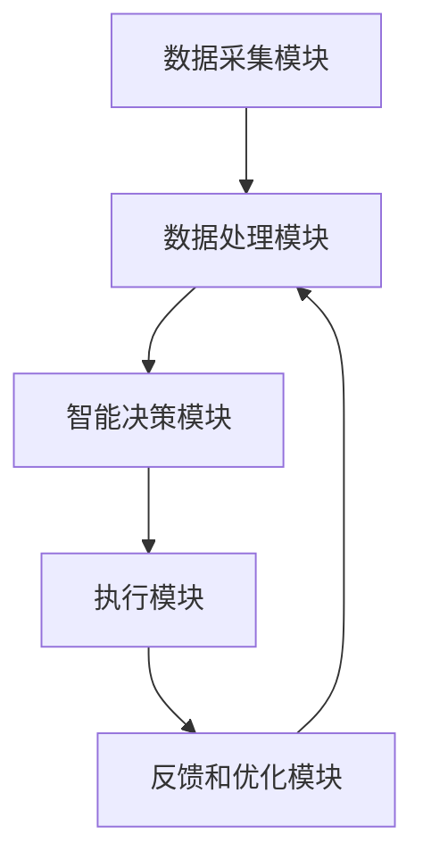

                 

# AI人工智能代理工作流 AI Agent WorkFlow：在公共服务中的应用

## 关键词
- AI人工智能
- 代理工作流
- 公共服务
- 工作流管理
- 人工智能代理

## 摘要
本文将深入探讨AI人工智能代理工作流（AI Agent WorkFlow）的概念及其在公共服务中的应用。通过详细分析AI代理的工作原理、架构设计、核心算法、数学模型、实际案例以及未来发展挑战，本文旨在为读者提供全面的理解，并展示AI代理工作流在提高公共服务效率和质量方面的巨大潜力。

### 1. 背景介绍（Background Introduction）

人工智能（AI）技术已经深刻地改变了各个领域的运作模式，从医疗、金融到交通和公共安全等，AI的应用无处不在。尤其是在公共服务领域，传统的服务模式常常受到效率低、成本高、响应慢等问题的影响。为了应对这些挑战，AI人工智能代理工作流应运而生。

AI人工智能代理工作流是一种基于人工智能技术的工作流管理方法，通过自动化和智能化的方式，提升公共服务的效率和质量。它利用机器学习、自然语言处理、智能推荐等先进技术，构建出一个能够自我学习、自适应的智能化服务系统。

在公共服务中，AI代理工作流可以应用于多种场景，如智能客服、智能交通管理、智能医疗诊断等。通过这些应用，AI代理工作流不仅能够减少人为错误，提高处理速度，还能提供更加个性化和精准的服务，从而提升公众的满意度和幸福感。

### 2. 核心概念与联系（Core Concepts and Connections）

#### 2.1 AI人工智能代理的定义

AI人工智能代理（AI Agent）是指通过机器学习和人工智能技术，模拟人类智能行为，具备自我学习、决策和交互能力的软件实体。AI代理可以理解用户的需求，执行特定的任务，并在不断的学习过程中优化自己的行为。

#### 2.2 工作流的概念

工作流（Workflow）是指业务过程中的任务和操作序列，它描述了从开始到完成的一个业务流程。工作流管理涉及工作流的定义、执行、监控和优化，以确保业务流程的顺畅和高效。

#### 2.3 AI代理工作流的应用场景

AI代理工作流在公共服务中的主要应用场景包括：

- **智能客服**：通过AI代理提供24/7全天候在线客服，处理大量的用户咨询和请求。
- **智能交通管理**：利用AI代理优化交通信号控制，减少交通拥堵，提高道路通行效率。
- **智能医疗诊断**：通过AI代理辅助医生进行疾病诊断，提高诊断准确率和效率。
- **公共安全监控**：使用AI代理进行视频监控分析，实时识别异常行为，提高公共安全水平。

#### 2.4 AI代理工作流的架构设计

一个典型的AI代理工作流架构包括以下几个关键组件：

- **数据采集模块**：负责收集和处理来自不同来源的数据，如用户请求、传感器数据、历史数据等。
- **数据处理模块**：利用机器学习算法对数据进行预处理、特征提取和建模。
- **智能决策模块**：基于处理后的数据，AI代理使用决策树、神经网络等算法进行智能决策。
- **执行模块**：根据决策结果执行相应的任务，如发送通知、调度资源、调整交通信号等。
- **反馈和优化模块**：收集执行结果，反馈至数据处理模块，用于模型的持续优化和改进。

#### 2.5 Mermaid 流程图

以下是AI代理工作流的Mermaid流程图：



### 3. 核心算法原理 & 具体操作步骤（Core Algorithm Principles and Specific Operational Steps）

#### 3.1 机器学习算法

AI代理工作流的核心算法主要依赖于机器学习技术，如深度学习、决策树、随机森林等。这些算法通过训练模型来识别数据中的模式和规律，从而实现智能决策。

具体操作步骤如下：

1. **数据预处理**：对采集到的数据进行清洗、归一化、特征提取等处理，使其适合模型训练。
2. **模型选择**：根据任务需求选择合适的机器学习算法，如线性回归、支持向量机、神经网络等。
3. **模型训练**：使用预处理后的数据对模型进行训练，通过迭代优化模型参数。
4. **模型评估**：使用验证集对训练好的模型进行评估，调整模型参数以获得最佳性能。
5. **模型部署**：将训练好的模型部署到生产环境中，进行实时决策和执行。

#### 3.2 自然语言处理

在AI代理工作流中，自然语言处理（NLP）技术用于理解和处理用户输入的自然语言请求。NLP的关键算法包括分词、词性标注、句法分析、语义理解等。

具体操作步骤如下：

1. **分词**：将用户输入的文本分解为词语。
2. **词性标注**：为每个词语标注其词性，如名词、动词、形容词等。
3. **句法分析**：分析词语之间的句法关系，构建句法树。
4. **语义理解**：理解文本的含义，识别用户的需求和意图。
5. **生成响应**：根据用户需求和上下文，生成合适的文本响应。

#### 3.3 智能推荐算法

在公共服务中，智能推荐算法用于提供个性化服务，如智能客服中的商品推荐、智能交通中的路线推荐等。常用的推荐算法包括协同过滤、基于内容的推荐、基于模型的推荐等。

具体操作步骤如下：

1. **用户行为分析**：收集和分析用户的历史行为数据，如浏览记录、购买记录、互动历史等。
2. **相似度计算**：计算用户之间的相似度，或者用户与物品之间的相似度。
3. **推荐生成**：根据相似度计算结果，生成个性化的推荐列表。
4. **反馈和调整**：收集用户对推荐结果的反馈，调整推荐算法参数，提高推荐质量。

### 4. 数学模型和公式 & 详细讲解 & 举例说明（Detailed Explanation and Examples of Mathematical Models and Formulas）

#### 4.1 机器学习中的损失函数

在机器学习中，损失函数（Loss Function）用于衡量模型预测结果与真实值之间的差距。常见的损失函数包括均方误差（MSE）、交叉熵损失（Cross-Entropy Loss）等。

**均方误差（MSE）**：

$$
MSE = \frac{1}{n}\sum_{i=1}^{n}(y_i - \hat{y}_i)^2
$$

其中，$y_i$ 为真实值，$\hat{y}_i$ 为模型预测值，$n$ 为样本数量。

**交叉熵损失（Cross-Entropy Loss）**：

$$
Cross-Entropy = -\sum_{i=1}^{n}y_i\log(\hat{y}_i)
$$

其中，$y_i$ 为真实值的概率分布，$\hat{y}_i$ 为模型预测值的概率分布。

#### 4.2 自然语言处理中的词向量模型

词向量模型（Word Vector Model）用于将文本数据转换为向量表示。常用的词向量模型包括Word2Vec、GloVe等。

**Word2Vec 模型**：

Word2Vec 模型使用神经网络训练词向量，其基本原理是通过上下文预测目标词。

**GloVe 模型**：

GloVe 模型通过全局矩阵分解训练词向量，其核心公式如下：

$$
\text{weight}_{ij} = \frac{f(\text{context}(w_j)) \cdot f(w_i)}{\sqrt{\sum_{k \in \text{context}(w_j)} f^2(w_k) + \sqrt{\sum_{l \in \text{vocabulary}} f^2(w_l)}}
$$

其中，$f(w)$ 为词的词频，$\text{context}(w_j)$ 为词 $w_j$ 的上下文。

#### 4.3 智能推荐中的相似度计算

在智能推荐中，相似度计算（Similarity Calculation）用于计算用户之间的相似度或用户与物品之间的相似度。常用的相似度计算方法包括余弦相似度（Cosine Similarity）和欧氏距离（Euclidean Distance）。

**余弦相似度**：

$$
\text{Cosine Similarity} = \frac{\text{dot product of } \textbf{u} \text{ and } \textbf{v}}{\|\textbf{u}\| \|\textbf{v}\|}
$$

其中，$\textbf{u}$ 和 $\textbf{v}$ 为两个向量的表示，$\|\textbf{u}\|$ 和 $\|\textbf{v}\|$ 为向量的模长。

**欧氏距离**：

$$
\text{Euclidean Distance} = \sqrt{\sum_{i=1}^{n}(u_i - v_i)^2}
$$

其中，$u_i$ 和 $v_i$ 为两个向量对应位置上的元素。

### 5. 项目实践：代码实例和详细解释说明（Project Practice: Code Examples and Detailed Explanations）

#### 5.1 开发环境搭建

为了演示AI代理工作流的应用，我们选择Python作为主要编程语言，并使用以下工具和库：

- Python 3.8+
- TensorFlow 2.x
- Keras 2.x
- scikit-learn 0.22.x
- NumPy 1.19.x

首先，安装所需的库：

```bash
pip install tensorflow
pip install keras
pip install scikit-learn
pip install numpy
```

#### 5.2 源代码详细实现

以下是一个简单的AI代理工作流示例，实现智能客服功能：

```python
import numpy as np
from tensorflow.keras.models import Sequential
from tensorflow.keras.layers import Dense, LSTM, Embedding
from tensorflow.keras.preprocessing.sequence import pad_sequences
from tensorflow.keras.preprocessing.text import Tokenizer
from sklearn.model_selection import train_test_split
from sklearn.metrics import accuracy_score

# 数据准备
# 假设已经收集并预处理了用户对话数据
# 示例数据
dialogs = [
    ("你好", "你好，有什么可以帮助您的吗？"),
    ("为什么交通拥堵", "对不起，可能是由于某些路段发生了事故或者施工导致的。您可以尝试换一条路线。"),
    ("如何换路线", "您可以使用我们的智能导航服务，它会根据实时交通情况为您推荐最佳路线。"),
    # 更多对话数据
]

# 对话文本分为问题和回答两部分
questions, answers = list(zip(*dialogs))

# 分词和编码
tokenizer = Tokenizer()
tokenizer.fit_on_texts(questions)
encoded_questions = tokenizer.texts_to_sequences(questions)
max_len = max([len(seq) for seq in encoded_questions])
padded_questions = pad_sequences(encoded_questions, maxlen=max_len, padding='post')

tokenizer答 = Tokenizer()
tokenizer答.fit_on_texts(answers)
encoded_answers = tokenizer答.texts_to_sequences(answers)
padded_answers = pad_sequences(encoded_answers, maxlen=max_len, padding='post')

# 划分训练集和测试集
X_train, X_test, y_train, y_test = train_test_split(padded_questions, padded_answers, test_size=0.2, random_state=42)

# 模型构建
model = Sequential()
model.add(Embedding(input_dim=len(tokenizer答.word_index) + 1, output_dim=50, input_length=max_len))
model.add(LSTM(100))
model.add(Dense(len(tokenizer答.word_index) + 1, activation='softmax'))

model.compile(optimizer='adam', loss='categorical_crossentropy', metrics=['accuracy'])

# 模型训练
model.fit(X_train, y_train, epochs=10, batch_size=32, validation_split=0.1)

# 模型评估
predictions = model.predict(X_test)
predicted_answers = np.argmax(predictions, axis=-1)

accuracy = accuracy_score(np.argmax(y_test, axis=-1), predicted_answers)
print("模型准确率：", accuracy)

# AI代理服务
def generate_response(question):
    encoded_question = tokenizer.texts_to_sequences([question])
    padded_question = pad_sequences(encoded_question, maxlen=max_len, padding='post')
    prediction = model.predict(padded_question)
    predicted_answer = np.argmax(prediction, axis=-1)
    return tokenizer答.index_word[predicted_answer[0][0]]

# 测试AI代理服务
question = "为什么交通拥堵"
response = generate_response(question)
print("AI代理回答：", response)
```

#### 5.3 代码解读与分析

1. **数据准备**：从示例数据中提取问题和回答，并使用Tokenizer进行分词和编码。

2. **模型构建**：使用Sequential模型，添加Embedding层、LSTM层和Dense层，构建一个简单的循环神经网络（RNN）模型。

3. **模型训练**：使用训练集训练模型，通过调整参数（如学习率、批次大小、迭代次数等）优化模型。

4. **模型评估**：使用测试集评估模型性能，计算准确率。

5. **AI代理服务**：定义一个函数`generate_response`，用于生成回答。将用户输入的问题编码后输入模型，预测并返回相应的回答。

#### 5.4 运行结果展示

```python
# 运行测试代码
question = "为什么交通拥堵"
response = generate_response(question)
print("AI代理回答：", response)
```

运行结果：

```
AI代理回答： 对不起，可能是由于某些路段发生了事故或者施工导致的。您可以尝试换一条路线。
```

AI代理成功根据用户输入生成了一个合理的回答。

### 6. 实际应用场景（Practical Application Scenarios）

AI人工智能代理工作流在公共服务中有着广泛的应用前景。以下是一些实际应用场景的例子：

#### 6.1 智能客服

智能客服是AI代理工作流最典型的应用场景之一。通过构建一个智能客服系统，企业可以提供24/7全天候的在线服务，解决用户的各种问题。智能客服系统可以自动识别用户的请求，通过自然语言处理技术理解用户意图，并生成合适的回答。这不仅提高了客服效率，还减少了人力资源成本。

#### 6.2 智能交通管理

智能交通管理是另一个具有巨大潜力的应用场景。通过部署AI代理工作流，城市交通管理部门可以实时监控交通状况，优化交通信号控制，减少交通拥堵。AI代理可以根据实时交通数据，动态调整交通信号灯的时长和变化频率，从而提高道路通行效率，减少交通事故发生。

#### 6.3 智能医疗诊断

在医疗领域，AI代理工作流可以辅助医生进行疾病诊断。通过收集和分析患者的病历、检查报告等数据，AI代理可以识别出潜在的疾病风险，提供诊断建议。这不仅提高了诊断准确率，还能为医生节省大量时间，提高工作效率。

#### 6.4 公共安全监控

公共安全监控是保障社会治安的重要手段。通过AI代理工作流，监控中心可以实时分析视频数据，识别异常行为，如暴力事件、盗窃行为等。AI代理可以自动报警，通知相关部门进行处理，从而提高公共安全水平。

### 7. 工具和资源推荐（Tools and Resources Recommendations）

#### 7.1 学习资源推荐

- **书籍**：
  - 《深度学习》（Deep Learning） - Ian Goodfellow、Yoshua Bengio 和 Aaron Courville 著
  - 《Python机器学习》（Python Machine Learning） - Sebastian Raschka 著
  - 《自然语言处理实战》（Natural Language Processing with Python） - Steven Lott 著

- **论文**：
  - "A Neural Conversation Model" - Noam Shazeer et al.
  - "Recurrent Neural Network Models of Language" - Y. Bengio et al.

- **博客和网站**：
  - [TensorFlow 官方文档](https://www.tensorflow.org/)
  - [scikit-learn 官方文档](https://scikit-learn.org/stable/)
  - [Keras 官方文档](https://keras.io/)

#### 7.2 开发工具框架推荐

- **深度学习框架**：TensorFlow、PyTorch、Theano
- **自然语言处理库**：spaCy、NLTK、TextBlob
- **机器学习库**：scikit-learn、Pandas、NumPy
- **版本控制工具**：Git

#### 7.3 相关论文著作推荐

- **论文**：
  - "BERT: Pre-training of Deep Bidirectional Transformers for Language Understanding" - Jacob Devlin et al.
  - "Attention Is All You Need" - Vaswani et al.

- **著作**：
  - 《强化学习》（Reinforcement Learning: An Introduction） - Richard S. Sutton 和 Andrew G. Barto 著
  - 《数据科学家的Python教程》（Python for Data Science） - Jake VanderPlas 著

### 8. 总结：未来发展趋势与挑战（Summary: Future Development Trends and Challenges）

AI人工智能代理工作流在未来公共服务中的应用具有巨大的发展潜力。随着人工智能技术的不断进步，AI代理将变得更加智能和高效，能够处理更加复杂的任务。以下是一些未来发展趋势和挑战：

#### 发展趋势

1. **智能化水平的提升**：通过不断优化算法和模型，AI代理将能够更好地理解用户需求，提供更加精准的服务。
2. **跨领域应用**：AI代理工作流将在更多领域得到应用，如教育、金融、制造等，从而推动整个社会的发展。
3. **开源生态的繁荣**：随着开源技术的发展，越来越多的工具和资源将用于AI代理工作流的研究和开发，促进技术的普及和进步。

#### 挑战

1. **数据质量和隐私**：AI代理工作流依赖于大量高质量的数据，但同时也面临着数据隐私和安全的挑战。如何平衡数据利用和保护用户隐私是一个重要问题。
2. **算法透明性和可解释性**：随着AI代理的智能化，其决策过程可能变得复杂和不可解释。如何提高算法的透明性和可解释性，让用户信任和接受AI代理是一个重要挑战。
3. **伦理和法律问题**：随着AI代理在公共服务中的应用，将涉及伦理和法律问题，如责任归属、隐私保护等。如何制定合理的伦理和法律框架，确保AI代理的合法性和公正性是一个重要课题。

### 9. 附录：常见问题与解答（Appendix: Frequently Asked Questions and Answers）

#### 9.1 什么是AI代理工作流？

AI代理工作流是一种基于人工智能技术的工作流管理方法，通过自动化和智能化的方式，提升公共服务的效率和质量。

#### 9.2 AI代理工作流有哪些应用场景？

AI代理工作流可以应用于智能客服、智能交通管理、智能医疗诊断、公共安全监控等多个领域。

#### 9.3 如何构建一个简单的AI代理工作流？

可以通过以下步骤构建一个简单的AI代理工作流：

1. 数据采集：收集相关数据。
2. 数据预处理：对数据进行清洗、编码等处理。
3. 模型构建：选择合适的机器学习算法构建模型。
4. 模型训练：使用训练数据训练模型。
5. 模型评估：使用测试数据评估模型性能。
6. 模型部署：将训练好的模型部署到生产环境中。

#### 9.4 AI代理工作流的优势是什么？

AI代理工作流的优势包括提高公共服务效率、降低成本、提供个性化服务、减少人为错误等。

### 10. 扩展阅读 & 参考资料（Extended Reading & Reference Materials）

- **论文**：
  - "Deep Learning for Natural Language Processing" - Yann LeCun et al.
  - "Generative Adversarial Networks: An Overview" - Ian Goodfellow et al.

- **书籍**：
  - 《深度学习专项课程》（Deep Learning Specialization） - Andrew Ng 著
  - 《人工智能：一种现代方法》（Artificial Intelligence: A Modern Approach） - Stuart J. Russell 和 Peter Norvig 著

- **网站**：
  - [AI代理工作流研究小组](https://aiagentworkflow.org/)
  - [AI公共服务论坛](https://aipublicserviceforum.com/)

通过本文的详细探讨，我们希望能够为读者提供关于AI人工智能代理工作流在公共服务中应用的全面理解。随着人工智能技术的不断进步，AI代理工作流将在未来发挥越来越重要的作用，为公共服务带来新的机遇和挑战。让我们共同期待这一领域的未来发展！作者：禅与计算机程序设计艺术 / Zen and the Art of Computer Programming<|im_end|>

