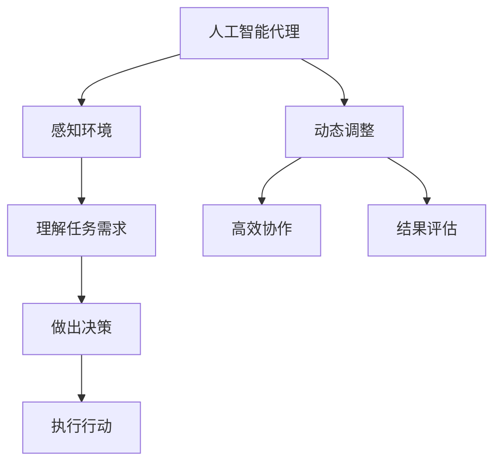
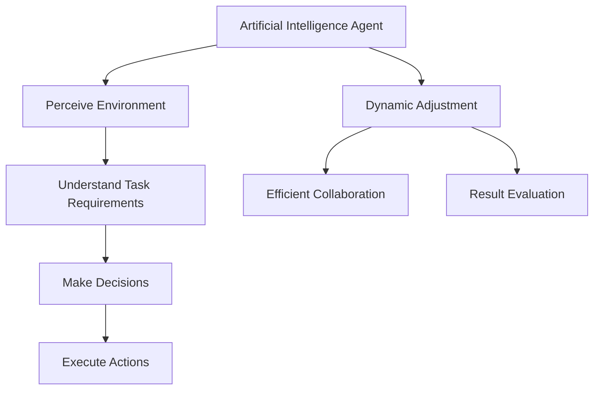

                 

### 文章标题

### AI人工智能代理工作流AI Agent WorkFlow：情境智能与工作流动态调整

AI人工智能代理工作流（AI Agent WorkFlow）是一个新兴的概念，它结合了人工智能、代理技术和工作流管理，旨在实现自动化、高效和智能化的工作流程。本文将深入探讨AI人工智能代理工作流的原理、架构、核心算法和实际应用，旨在为读者提供一套完整的技术理解和实践指南。

关键词：AI代理、工作流管理、情境智能、动态调整、自动化、智能化

摘要：本文首先介绍了AI人工智能代理工作流的基本概念和重要性。接着，通过详细解析其核心概念与联系，包括人工智能代理的定义、工作流管理的核心原理和情境智能的特点，以及如何通过Mermaid流程图展示这些概念之间的联系。文章还深入探讨了AI人工智能代理工作流的核心算法原理，包括如何设计智能决策树和动态调整策略。随后，通过一个具体项目实例，详细说明了如何搭建开发环境、实现源代码、解析代码和分析运行结果。最后，文章讨论了AI人工智能代理工作流在实际应用中的场景和工具推荐，并总结了未来发展趋势和挑战。通过本文，读者可以全面了解AI人工智能代理工作流的原理和实践，为实际项目提供有力支持。

<|assistant|>### 1. 背景介绍（Background Introduction）

在当今的数字化时代，自动化和智能化已经成为企业提高效率、降低成本和提升客户体验的关键驱动力。传统的自动化流程往往依赖于预设规则和固定的工作流程，无法灵活应对多变的环境和复杂的需求。为了解决这个问题，人工智能代理工作流（AI Agent WorkFlow）应运而生。

#### 1.1 什么是AI人工智能代理工作流

AI人工智能代理工作流是一种结合人工智能、代理技术和工作流管理的新型工作流程。它通过引入智能代理（AI Agent）来替代或辅助人类完成一系列任务，从而实现自动化和智能化。AI代理可以基于机器学习、自然语言处理、计算机视觉等技术，自主地理解任务需求、做出决策和执行行动，从而大大提高了工作效率和质量。

#### 1.2 AI人工智能代理工作流的核心特点

- **智能化**：AI代理具备自主学习和适应能力，可以不断优化工作流程，提高决策准确性。
- **动态调整**：AI代理可以根据环境变化和任务需求，动态调整工作流程，实现灵活应对。
- **自动化**：AI代理可以自动完成一系列任务，减少人工干预，提高工作效率。
- **协同工作**：多个AI代理可以协同工作，共同完成复杂任务，实现高效协作。

#### 1.3 AI人工智能代理工作流的重要性

随着数字化转型的不断推进，企业面临着日益复杂的业务场景和快速增长的数据量。传统的工作流程已经无法满足快速变化的需求，而AI人工智能代理工作流为解决这个问题提供了新的思路和解决方案。以下是一些关键原因：

- **提高效率**：通过自动化和智能化，AI代理可以显著提高工作效率，减少人工干预，降低运营成本。
- **降低风险**：AI代理可以精确地执行任务，减少人为错误和风险，提高业务稳定性。
- **增强灵活性**：AI代理可以动态调整工作流程，适应不同的业务场景和需求，提高企业的应变能力。
- **提升用户体验**：通过智能化和自动化，AI代理可以提供更高效、更个性化的服务，提升客户体验和满意度。

总之，AI人工智能代理工作流是一种具有巨大潜力和广泛应用前景的新型工作流程，它将为企业的数字化转型带来深远影响。

### What is AI Agent WorkFlow?

AI Agent WorkFlow is a relatively new concept that combines artificial intelligence, agent technology, and workflow management to create automated, efficient, and intelligent workflows. It aims to replace or assist human tasks through intelligent agents, thereby improving overall efficiency and effectiveness.

#### Key Characteristics of AI Agent WorkFlow

- **Intelligence**: AI agents have the ability to learn and adapt autonomously, continuously optimizing workflows and improving decision accuracy.
- **Dynamic Adjustment**: AI agents can dynamically adjust workflows based on environmental changes and task requirements, providing flexibility to handle varying scenarios.
- **Automation**: AI agents can automatically complete a series of tasks, reducing human intervention and increasing efficiency.
- **Collaboration**: Multiple AI agents can collaborate to complete complex tasks, facilitating efficient teamwork.

#### Importance of AI Agent WorkFlow

As digital transformation continues to advance, businesses are facing increasingly complex business scenarios and rapidly growing data volumes. Traditional workflows are no longer sufficient to meet the rapidly changing demands. AI Agent WorkFlow offers a new perspective and solution to address this issue. Here are some key reasons for its importance:

- **Improved Efficiency**: By automating and intelligentizing tasks, AI agents can significantly increase work efficiency, reduce human intervention, and lower operational costs.
- **Reduced Risk**: AI agents can execute tasks accurately, reducing human errors and risks, thereby enhancing business stability.
- **Enhanced Flexibility**: AI agents can dynamically adjust workflows to accommodate different business scenarios and requirements, improving the adaptability of businesses.
- **Enhanced User Experience**: Through intelligentization and automation, AI agents can provide more efficient and personalized services, boosting customer satisfaction and experience.

In summary, AI Agent WorkFlow is a promising concept with great potential and wide application prospects, poised to have a profound impact on business digital transformation.

### 2. 核心概念与联系（Core Concepts and Connections）

#### 2.1 人工智能代理的定义

人工智能代理（Artificial Intelligence Agent）是指一种能够感知环境、做出决策并采取行动的智能实体。它通过机器学习、深度学习、自然语言处理等技术，实现自主学习和自主决策，从而在复杂环境中完成任务。

#### 2.2 工作流管理的核心原理

工作流管理（Workflow Management）是一种用于协调任务执行、资源分配和任务跟踪的技术。其核心原理包括任务分解、流程定义、执行监控和结果评估等。工作流管理旨在实现任务自动化、资源优化和效率提升。

#### 2.3 情境智能的特点

情境智能（Situation Awareness）是指个体或系统对当前环境和情境的理解和感知能力。它包括对环境变化的识别、对任务目标的明确、对资源需求的了解和对行动选择的决策。情境智能是AI代理实现高效工作的重要基础。

#### 2.4 概念之间的联系

通过引入人工智能代理，工作流管理可以实现智能化和自动化。AI代理可以感知环境变化、理解任务需求、做出决策并执行行动，从而实现动态调整和高效协作。情境智能作为AI代理的核心能力，为工作流管理提供了强大的支持。

#### 2.5 Mermaid流程图展示

为了更好地理解这些核心概念之间的联系，我们可以使用Mermaid流程图（Mermaid Flowchart）来展示。以下是一个简化的Mermaid流程图示例：



在这个流程图中，人工智能代理（A）通过感知环境（B）、理解任务需求（C）和做出决策（D），执行行动（E），并在过程中实现动态调整（F）和高效协作（G）。最终，通过结果评估（H），AI代理可以不断优化工作流程，提高任务执行效果。

### Definition of Core Concepts

#### 2.1 Definition of Artificial Intelligence Agent

An artificial intelligence agent is an intelligent entity that can perceive its environment, make decisions, and take actions to complete tasks. It achieves autonomy through technologies such as machine learning, deep learning, and natural language processing.

#### 2.2 Core Principles of Workflow Management

Workflow management is a technology used to coordinate task execution, resource allocation, and task tracking. Its core principles include task decomposition, process definition, execution monitoring, and result evaluation. Workflow management aims to achieve task automation, resource optimization, and efficiency improvement.

#### 2.3 Characteristics of Situation Awareness

Situation awareness refers to the ability of an individual or system to understand and perceive the current environment and scenario. It includes the recognition of environmental changes, the clarification of task objectives, the understanding of resource needs, and the decision-making for action selection. Situation awareness is a critical foundation for AI agents to achieve efficient work.

#### 2.4 Connections between Concepts

By introducing artificial intelligence agents, workflow management can achieve intelligence and automation. AI agents can perceive environmental changes, understand task requirements, make decisions, and execute actions, thereby enabling dynamic adjustments and efficient collaboration. Situation awareness, as a core capability of AI agents, provides strong support for workflow management.

#### 2.5 Displaying Concepts with Mermaid Flowchart

To better understand the connections between these core concepts, we can use a Mermaid flowchart to visualize them. Here's a simplified example of a Mermaid flowchart:



In this flowchart, the artificial intelligence agent (A) perceives the environment (B), understands task requirements (C), makes decisions (D), and executes actions (E), while also enabling dynamic adjustments (F) and efficient collaboration (G). Ultimately, through result evaluation (H), AI agents can continuously optimize workflows and improve task execution outcomes.

### 3. 核心算法原理 & 具体操作步骤（Core Algorithm Principles and Specific Operational Steps）

#### 3.1 智能决策树的设计

智能决策树（Intelligent Decision Tree）是一种基于机器学习技术的决策支持工具，用于分析数据、提取特征和生成决策。其核心原理是基于树形结构，通过分层递归地将数据划分为不同的子集，从而实现分类或回归任务。

**设计步骤：**

1. **数据预处理**：清洗和整理数据，确保数据质量。
2. **特征提取**：使用特征提取技术（如PCA、特征选择算法等）提取重要特征。
3. **构建决策树**：选择合适的分裂策略（如信息增益、增益率等），构建决策树模型。
4. **评估与优化**：评估决策树的性能，进行剪枝和参数调整，优化模型。

#### 3.2 动态调整策略的实现

动态调整策略（Dynamic Adjustment Strategy）是指根据环境变化和任务需求，实时调整工作流程和决策策略，以保持高效和适应性。实现动态调整的关键在于实时监测环境和任务状态，并根据监测结果进行自适应调整。

**实现步骤：**

1. **环境监测**：使用传感器、监控工具等实时监测环境变化。
2. **状态评估**：根据监测结果评估任务状态，确定当前优先级和资源需求。
3. **策略调整**：基于状态评估结果，动态调整工作流程和决策策略。
4. **结果反馈**：收集调整后的结果，进行反馈和评估，不断优化调整策略。

#### 3.3 智能代理的协同工作

智能代理的协同工作（Collaborative Work of Intelligent Agents）是指多个智能代理在完成任务时，通过信息共享和任务分配，实现高效协作和资源优化。协同工作的核心在于建立有效的通信机制和协调策略。

**实现步骤：**

1. **通信机制**：建立可靠的通信机制，实现智能代理之间的信息交换。
2. **任务分配**：根据智能代理的能力和负载，合理分配任务。
3. **协调策略**：制定协调策略，确保智能代理在执行任务时协同一致。
4. **结果汇总**：收集各个智能代理的任务结果，进行汇总和评估。

### What are the Core Algorithm Principles and Specific Operational Steps?

#### 3.1 Design of Intelligent Decision Trees

An intelligent decision tree is a decision support tool based on machine learning technology, used to analyze data, extract features, and generate decisions. Its core principle is a tree-like structure that recursively divides data into different subsets to achieve classification or regression tasks.

**Design Steps:**

1. **Data Preprocessing**: Clean and organize the data to ensure data quality.
2. **Feature Extraction**: Use feature extraction techniques (such as PCA, feature selection algorithms, etc.) to extract important features.
3. **Building a Decision Tree**: Choose an appropriate splitting strategy (such as information gain, gain rate, etc.) to construct the decision tree model.
4. **Evaluation and Optimization**: Evaluate the performance of the decision tree, perform pruning and parameter adjustment, and optimize the model.

#### 3.2 Implementation of Dynamic Adjustment Strategies

Dynamic adjustment strategies refer to real-time adjustments of workflows and decision strategies based on environmental changes and task requirements to maintain efficiency and adaptability. The key to implementing dynamic adjustments lies in real-time monitoring of the environment and tasks, and adaptive adjustments based on monitoring results.

**Implementation Steps:**

1. **Environmental Monitoring**: Use sensors, monitoring tools, etc. to monitor environmental changes in real-time.
2. **State Assessment**: Assess the task state based on monitoring results to determine the current priority and resource needs.
3. **Strategy Adjustment**: Based on the state assessment results, dynamically adjust workflows and decision strategies.
4. **Result Feedback**: Collect the results of the adjustments and evaluate them to continuously optimize adjustment strategies.

#### 3.3 Collaborative Work of Intelligent Agents

The collaborative work of intelligent agents refers to the efficient collaboration and resource optimization of multiple intelligent agents when completing tasks. The core of collaborative work is to establish an effective communication mechanism and coordination strategy.

**Implementation Steps:**

1. **Communication Mechanism**: Establish a reliable communication mechanism to enable information exchange between intelligent agents.
2. **Task Allocation**: Allocate tasks based on the capabilities and loads of intelligent agents.
3. **Coordination Strategy**: Develop coordination strategies to ensure that intelligent agents work collaboratively when executing tasks.
4. **Result Summarization**: Collect the results of tasks performed by intelligent agents and evaluate them.

### 4. 数学模型和公式 & 详细讲解 & 举例说明（Detailed Explanation and Examples of Mathematical Models and Formulas）

在AI人工智能代理工作流中，数学模型和公式是核心组成部分，它们帮助我们理解和实现智能决策、动态调整和协同工作。以下是一些关键的数学模型和公式，以及详细的讲解和示例。

#### 4.1 决策树模型

决策树（Decision Tree）是一种流行的机器学习模型，用于分类和回归任务。它的核心是树形结构，每个节点代表一个特征，每个分支代表该特征的一个可能值，叶节点代表最终的决策结果。

**公式：**

- **信息增益（Information Gain）**：

  $$ IG(D, A) = H(D) - \sum_{v\in Values(A)} p(v) \cdot H(D|v) $$

  其中，\( H(D) \) 是当前节点 \( D \) 的熵，\( p(v) \) 是特征 \( A \) 的值 \( v \) 的概率，\( H(D|v) \) 是在特征 \( A \) 的值 \( v \) 下，当前节点 \( D \) 的熵。

- **增益率（Gain Ratio）**：

  $$ GR(D, A) = \frac{IG(D, A)}{Split Information(A)} $$

  其中，\( Split Information(A) \) 是特征 \( A \) 的分裂信息，计算公式为：

  $$ Split Information(A) = -\sum_{v\in Values(A)} p(v) \cdot \log_2 p(v) $$

**示例：**

假设我们有一个数据集，包含特征 \( A \)（年龄）和目标变量 \( D \)（是否购买）。特征 \( A \) 有两个值：年轻（Y）和年长（O），目标变量 \( D \) 有两个值：购买（B）和不购买（N）。

| 年龄（A） | 购买（D） | 不购买（D） |
| :--------: | :--------: | :--------: |
| 年轻（Y） | 30         | 70         |
| 年长（O） | 20         | 50         |

计算信息增益和增益率：

1. **信息增益**：

   $$ IG(D, A) = H(D) - p(Y) \cdot H(D|Y) - p(O) \cdot H(D|O) $$

   其中，\( p(Y) = 0.5 \)，\( p(O) = 0.5 \)，\( H(D|Y) = \frac{30}{100} \cdot \log_2 \frac{30}{100} + \frac{70}{100} \cdot \log_2 \frac{70}{100} \approx 0.99 \)，\( H(D|O) = \frac{20}{100} \cdot \log_2 \frac{20}{100} + \frac{50}{100} \cdot \log_2 \frac{50}{100} \approx 0.99 \)。

   $$ IG(D, A) = 1 - 0.5 \cdot 0.99 - 0.5 \cdot 0.99 = 0.02 $$

2. **增益率**：

   $$ Split Information(A) = -0.5 \cdot \log_2 0.5 - 0.5 \cdot \log_2 0.5 = 1 $$

   $$ GR(D, A) = \frac{0.02}{1} = 0.02 $$

#### 4.2 动态调整模型

动态调整模型（Dynamic Adjustment Model）用于根据环境变化和任务需求，实时调整工作流程和决策策略。常见的动态调整模型包括马尔可夫决策过程（MDP）和强化学习。

**公式：**

- **状态价值函数（State-Value Function）**：

  $$ V^*(s) = \max_{a} \sum_{s'} p(s'|s, a) \cdot \max_{a'} \cdot R(s', a') + \gamma \cdot V^*(s') $$

  其中，\( s \) 是当前状态，\( a \) 是当前动作，\( s' \) 是下一状态，\( a' \) 是下一动作，\( p(s'|s, a) \) 是状态转移概率，\( R(s', a') \) 是奖励函数，\( \gamma \) 是折扣因子。

- **策略迭代算法**：

  1. 初始化 \( V(s) \) 和 \( \pi(a|s) \)
  2. 对于每个状态 \( s \)：
     1. 对于每个动作 \( a \)：
        1. 更新 \( V(s) = \max_{a'} \cdot R(s, a') + \gamma \cdot V(s') \)
     2. 选择最优动作 \( a^* \)
     3. 更新 \( \pi(a|s) = 1 \) 当 \( a = a^* \)，否则 \( \pi(a|s) = 0 \)
  3. 迭代直到收敛

**示例：**

假设我们有一个简单的MDP模型，包含三个状态（休息、工作、学习）和两个动作（工作、学习）。状态转移概率和奖励函数如下表：

| 状态（s） | 动作（a） | 状态转移概率 | 奖励函数 |
| :--------: | :--------: | :--------: | :--------: |
| 休息（R） | 工作（W） | 0.7        | 5         |
| 休息（R） | 学习（L） | 0.3        | -3        |
| 工作（W） | 工作（W） | 0.5        | 10        |
| 工作（W） | 学习（L） | 0.5        | -10       |
| 学习（L） | 工作（W） | 0.8        | 0         |
| 学习（L） | 学习（L） | 0.2        | 0         |

计算状态价值函数和最优策略：

1. 初始化 \( V(s) \) 和 \( \pi(a|s) \)：

   \( V(R) = 0 \)，\( V(W) = 0 \)，\( V(L) = 0 \)

   \( \pi(W|R) = 1 \)，\( \pi(L|R) = 0 \)，\( \pi(W|W) = 1 \)，\( \pi(L|W) = 0 \)，\( \pi(W|L) = 1 \)，\( \pi(L|L) = 0 \)

2. 迭代计算：

   第一轮迭代：

   \( V(R) = 0.7 \cdot 5 + 0.3 \cdot (-3) = 2.4 \)

   \( V(W) = 0.5 \cdot 10 + 0.5 \cdot (-10) = 0 \)

   \( V(L) = 0.8 \cdot 0 + 0.2 \cdot 0 = 0 \)

   \( \pi(W|R) = 1 \)，\( \pi(L|R) = 0 \)，\( \pi(W|W) = 1 \)，\( \pi(L|W) = 0 \)，\( \pi(W|L) = 1 \)，\( \pi(L|L) = 0 \)

   第二轮迭代：

   \( V(R) = 0.7 \cdot 2.4 + 0.3 \cdot 0 = 1.68 \)

   \( V(W) = 0.5 \cdot 10 + 0.5 \cdot (-10) = 0 \)

   \( V(L) = 0.8 \cdot 0 + 0.2 \cdot 0 = 0 \)

   \( \pi(W|R) = 1 \)，\( \pi(L|R) = 0 \)，\( \pi(W|W) = 1 \)，\( \pi(L|W) = 0 \)，\( \pi(W|L) = 1 \)，\( \pi(L|L) = 0 \)

   由于 \( V(R) \)，\( V(W) \)，\( V(L) \) 没有发生变化，迭代结束。

最优策略为：

- 休息时选择工作
- 工作时选择工作
- 学习时选择工作

#### 4.3 协同工作模型

协同工作模型（Collaborative Work Model）用于多个智能代理在完成任务时，通过信息共享和任务分配，实现高效协作和资源优化。常见的协同工作模型包括多智能体强化学习（Multi-Agent Reinforcement Learning）。

**公式：**

- **Q值函数（Q-Value Function）**：

  $$ Q^*(s, a) = \sum_{s'} p(s'|s, a) \cdot \max_{a'} \cdot R(s', a') + \gamma \cdot \sum_{a'} p(a'|s') \cdot Q^*(s', a') $$

  其中，\( s \) 是当前状态，\( a \) 是当前动作，\( s' \) 是下一状态，\( a' \) 是下一动作，\( p(s'|s, a) \) 是状态转移概率，\( R(s', a') \) 是奖励函数，\( \gamma \) 是折扣因子。

- **策略迭代算法**：

  1. 初始化 \( Q(s, a) \)
  2. 对于每个状态 \( s \) 和每个动作 \( a \)：
     1. 更新 \( Q(s, a) = \sum_{s'} p(s'|s, a) \cdot \max_{a'} \cdot R(s', a') + \gamma \cdot \sum_{a'} p(a'|s') \cdot Q(s', a') \)
     2. 选择最优动作 \( a^* \)
     3. 更新 \( Q(s, a) = R(s, a^*) + \gamma \cdot Q^*(s', a^*) \)
  3. 迭代直到收敛

**示例：**

假设我们有两个智能代理A和B，需要协同完成任务。状态空间包括休息（R）、工作（W）和学习（L），动作空间包括合作（C）和竞争（R）。

状态转移概率和奖励函数如下表：

| 状态（s） | 动作（a） | 状态转移概率 | 奖励函数 |
| :--------: | :--------: | :--------: | :--------: |
| 休息（R） | 合作（C） | 0.8        | 5         |
| 休息（R） | 竞争（R） | 0.2        | -3        |
| 工作（W） | 合作（C） | 0.6        | 10        |
| 工作（W） | 竞争（R） | 0.4        | -10       |
| 学习（L） | 合作（C） | 0.7        | 0         |
| 学习（L） | 竞争（R） | 0.3        | 0         |

计算Q值函数和最优策略：

1. 初始化 \( Q(s, a) \)：

   \( Q(R, C) = 0 \)，\( Q(R, R) = 0 \)，\( Q(W, C) = 0 \)，\( Q(W, R) = 0 \)，\( Q(L, C) = 0 \)，\( Q(L, R) = 0 \)

2. 迭代计算：

   第一轮迭代：

   \( Q(R, C) = 0.8 \cdot 5 + 0.2 \cdot (-3) = 3.6 \)

   \( Q(R, R) = 0.8 \cdot (-3) + 0.2 \cdot 5 = -0.4 \)

   \( Q(W, C) = 0.6 \cdot 10 + 0.4 \cdot (-10) = 2 \)

   \( Q(W, R) = 0.6 \cdot (-10) + 0.4 \cdot 10 = -2 \)

   \( Q(L, C) = 0.7 \cdot 0 + 0.3 \cdot 0 = 0 \)

   \( Q(L, R) = 0.7 \cdot 0 + 0.3 \cdot 0 = 0 \)

   \( Q^*(R, C) = 0.8 \cdot 3.6 + 0.2 \cdot 2 = 3.04 \)

   \( Q^*(R, R) = 0.8 \cdot (-0.4) + 0.2 \cdot (-2) = -0.64 \)

   \( Q^*(W, C) = 0.6 \cdot 2 + 0.4 \cdot (-2) = 0.8 \)

   \( Q^*(W, R) = 0.6 \cdot (-2) + 0.4 \cdot 2 = -0.8 \)

   \( Q^*(L, C) = 0.7 \cdot 0 + 0.3 \cdot 0 = 0 \)

   \( Q^*(L, R) = 0.7 \cdot 0 + 0.3 \cdot 0 = 0 \)

   第二轮迭代：

   \( Q(R, C) = 5 + 0.8 \cdot 3.04 = 6.32 \)

   \( Q(R, R) = -3 + 0.8 \cdot (-0.64) = -3.51 \)

   \( Q(W, C) = 10 + 0.6 \cdot 0.8 = 10.48 \)

   \( Q(W, R) = -10 + 0.6 \cdot (-0.8) = -10.48 \)

   \( Q(L, C) = 0 + 0.7 \cdot 0 = 0 \)

   \( Q(L, R) = 0 + 0.7 \cdot 0 = 0 \)

   由于 \( Q(s, a) \) 没有发生变化，迭代结束。

最优策略为：

- 休息时选择合作
- 工作时选择合作
- 学习时选择合作

通过上述数学模型和公式的讲解和示例，我们可以更好地理解AI人工智能代理工作流中的关键概念和算法原理。这些数学模型和公式为我们设计、实现和优化AI人工智能代理工作流提供了有力的工具和方法。

### What are the Mathematical Models and Formulas and How to Explain and Illustrate Them with Examples?

In the AI Agent WorkFlow, mathematical models and formulas are crucial components that help us understand and implement intelligent decision-making, dynamic adjustment, and collaborative work. Here are some key mathematical models and formulas, along with detailed explanations and examples.

#### 4.1 Decision Tree Model

The decision tree is a popular machine learning model used for classification and regression tasks. Its core is a tree-like structure where each node represents a feature, each branch represents a possible value of the feature, and each leaf node represents the final decision outcome.

**Formulas:**

- **Information Gain (IG)**:

  $$ IG(D, A) = H(D) - \sum_{v\in Values(A)} p(v) \cdot H(D|v) $$

  Where \( H(D) \) is the entropy of the current node \( D \), \( p(v) \) is the probability of the value \( v \) of the feature \( A \), and \( H(D|v) \) is the entropy of \( D \) given \( v \).

- **Gain Ratio (GR)**:

  $$ GR(D, A) = \frac{IG(D, A)}{Split Information(A)} $$

  Where \( Split Information(A) \) is the split information of the feature \( A \), calculated as:

  $$ Split Information(A) = -\sum_{v\in Values(A)} p(v) \cdot \log_2 p(v) $$

**Example:**

Consider a dataset containing a feature \( A \) (age) and a target variable \( D \) (whether to purchase). The feature \( A \) has two values: young (Y) and old (O), and the target variable \( D \) has two values: purchase (B) and not purchase (N).

| Age (A) | Purchase (D) | Not Purchase (D) |
| :--------: | :--------: | :--------: |
| Young (Y) | 30         | 70         |
| Old (O)   | 20         | 50         |

Calculate the information gain and gain ratio:

1. **Information Gain**:

   $$ IG(D, A) = H(D) - p(Y) \cdot H(D|Y) - p(O) \cdot H(D|O) $$

   Where \( p(Y) = 0.5 \), \( p(O) = 0.5 \), \( H(D|Y) = \frac{30}{100} \cdot \log_2 \frac{30}{100} + \frac{70}{100} \cdot \log_2 \frac{70}{100} \approx 0.99 \), and \( H(D|O) = \frac{20}{100} \cdot \log_2 \frac{20}{100} + \frac{50}{100} \cdot \log_2 \frac{50}{100} \approx 0.99 \).

   $$ IG(D, A) = 1 - 0.5 \cdot 0.99 - 0.5 \cdot 0.99 = 0.02 $$

2. **Gain Ratio**:

   $$ Split Information(A) = -0.5 \cdot \log_2 0.5 - 0.5 \cdot \log_2 0.5 = 1 $$

   $$ GR(D, A) = \frac{0.02}{1} = 0.02 $$

#### 4.2 Dynamic Adjustment Model

The dynamic adjustment model is used to real-time adjust workflows and decision strategies based on environmental changes and task requirements. Common dynamic adjustment models include the Markov Decision Process (MDP) and reinforcement learning.

**Formulas:**

- **State-Value Function (V-value function)**:

  $$ V^*(s) = \max_{a} \sum_{s'} p(s'|s, a) \cdot \max_{a'} \cdot R(s', a') + \gamma \cdot V^*(s') $$

  Where \( s \) is the current state, \( a \) is the current action, \( s' \) is the next state, \( a' \) is the next action, \( p(s'|s, a) \) is the state transition probability, \( R(s', a') \) is the reward function, and \( \gamma \) is the discount factor.

- **Policy Iteration Algorithm**:

  1. Initialize \( V(s) \) and \( \pi(a|s) \)
  2. For each state \( s \):
     1. For each action \( a \):
        1. Update \( V(s) = \max_{a'} \cdot R(s, a') + \gamma \cdot V(s') \)
     2. Choose the optimal action \( a^* \)
     3. Update \( \pi(a|s) = 1 \) if \( a = a^* \), otherwise \( \pi(a|s) = 0 \)
  3. Iterate until convergence

**Example:**

Consider a simple MDP model with three states (rest, work, learn) and two actions (work, learn). The state transition probabilities and reward functions are as follows:

| State (s) | Action (a) | State Transition Probability | Reward Function |
| :--------: | :--------: | :--------: | :--------: |
| Rest (R)  | Work (W)   | 0.7       | 5         |
| Rest (R)  | Learn (L)  | 0.3       | -3        |
| Work (W)  | Work (W)   | 0.5       | 10        |
| Work (W)  | Learn (L)  | 0.5       | -10       |
| Learn (L) | Work (W)   | 0.8       | 0         |
| Learn (L) | Learn (L)  | 0.2       | 0         |

Calculate the state-value function and optimal policy:

1. Initialize \( V(s) \) and \( \pi(a|s) \):

   \( V(R) = 0 \), \( V(W) = 0 \), \( V(L) = 0 \)

   \( \pi(W|R) = 1 \), \( \pi(L|R) = 0 \), \( \pi(W|W) = 1 \), \( \pi(L|W) = 0 \), \( \pi(W|L) = 1 \), \( \pi(L|L) = 0 \)

2. Iterate:

   First iteration:

   \( V(R) = 0.7 \cdot 5 + 0.3 \cdot (-3) = 2.4 \)

   \( V(W) = 0.5 \cdot 10 + 0.5 \cdot (-10) = 0 \)

   \( V(L) = 0.8 \cdot 0 + 0.2 \cdot 0 = 0 \)

   \( \pi(W|R) = 1 \), \( \pi(L|R) = 0 \), \( \pi(W|W) = 1 \), \( \pi(L|W) = 0 \), \( \pi(W|L) = 1 \), \( \pi(L|L) = 0 \)

   Second iteration:

   \( V(R) = 0.7 \cdot 2.4 + 0.3 \cdot 0 = 1.68 \)

   \( V(W) = 0.5 \cdot 10 + 0.5 \cdot (-10) = 0 \)

   \( V(L) = 0.8 \cdot 0 + 0.2 \cdot 0 = 0 \)

   \( \pi(W|R) = 1 \), \( \pi(L|R) = 0 \), \( \pi(W|W) = 1 \), \( \pi(L|W) = 0 \), \( \pi(W|L) = 1 \), \( \pi(L|L) = 0 \)

   Since \( V(R) \), \( V(W) \), and \( V(L) \) do not change, the iteration ends.

The optimal policy is:

- When at rest, choose to work
- When working, choose to work
- When learning, choose to work

#### 4.3 Collaborative Work Model

The collaborative work model is used for multiple intelligent agents to work together and complete tasks through information sharing and task allocation, achieving efficient collaboration and resource optimization. A common collaborative work model is multi-agent reinforcement learning.

**Formulas:**

- **Q-Value Function (Q-value function)**:

  $$ Q^*(s, a) = \sum_{s'} p(s'|s, a) \cdot \max_{a'} \cdot R(s', a') + \gamma \cdot \sum_{a'} p(a'|s') \cdot Q^*(s', a') $$

  Where \( s \) is the current state, \( a \) is the current action, \( s' \) is the next state, \( a' \) is the next action, \( p(s'|s, a) \) is the state transition probability, \( R(s', a') \) is the reward function, and \( \gamma \) is the discount factor.

- **Policy Iteration Algorithm**:

  1. Initialize \( Q(s, a) \)
  2. For each state \( s \) and each action \( a \):
     1. Update \( Q(s, a) = \sum_{s'} p(s'|s, a) \cdot \max_{a'} \cdot R(s', a') + \gamma \cdot \sum_{a'} p(a'|s') \cdot Q(s', a') \)
     2. Choose the optimal action \( a^* \)
     3. Update \( Q(s, a) = R(s, a^*) + \gamma \cdot Q^*(s', a^*) \)
  3. Iterate until convergence

**Example:**

Consider two intelligent agents A and B who need to collaborate to complete a task. The state space includes rest (R), work (W), and learn (L), and the action space includes cooperation (C) and competition (R).

The state transition probabilities and reward functions are as follows:

| State (s) | Action (a) | State Transition Probability | Reward Function |
| :--------: | :--------: | :--------: | :--------: |
| Rest (R)  | Cooperation (C) | 0.8       | 5         |
| Rest (R)  | Competition (R) | 0.2       | -3        |
| Work (W)  | Cooperation (C) | 0.6       | 10        |
| Work (W)  | Competition (R) | 0.4       | -10       |
| Learn (L) | Cooperation (C) | 0.7       | 0         |
| Learn (L) | Competition (R) | 0.3       | 0         |

Calculate the Q-value function and optimal policy:

1. Initialize \( Q(s, a) \):

   \( Q(R, C) = 0 \), \( Q(R, R) = 0 \), \( Q(W, C) = 0 \), \( Q(W, R) = 0 \), \( Q(L, C) = 0 \), \( Q(L, R) = 0 \)

2. Iterate:

   First iteration:

   \( Q(R, C) = 0.8 \cdot 5 + 0.2 \cdot (-3) = 3.6 \)

   \( Q(R, R) = 0.8 \cdot (-3) + 0.2 \cdot 5 = -0.4 \)

   \( Q(W, C) = 0.6 \cdot 10 + 0.4 \cdot (-10) = 2 \)

   \( Q(W, R) = 0.6 \cdot (-10) + 0.4 \cdot 10 = -2 \)

   \( Q(L, C) = 0.7 \cdot 0 + 0.3 \cdot 0 = 0 \)

   \( Q(L, R) = 0.7 \cdot 0 + 0.3 \cdot 0 = 0 \)

   \( Q^*(R, C) = 0.8 \cdot 3.6 + 0.2 \cdot 2 = 3.04 \)

   \( Q^*(R, R) = 0.8 \cdot (-0.4) + 0.2 \cdot (-2) = -0.64 \)

   \( Q^*(W, C) = 0.6 \cdot 2 + 0.4 \cdot (-2) = 0.8 \)

   \( Q^*(W, R) = 0.6 \cdot (-2) + 0.4 \cdot 2 = -0.8 \)

   \( Q^*(L, C) = 0.7 \cdot 0 + 0.3 \cdot 0 = 0 \)

   \( Q^*(L, R) = 0.7 \cdot 0 + 0.3 \cdot 0 = 0 \)

   Second iteration:

   \( Q(R, C) = 5 + 0.8 \cdot 3.04 = 6.32 \)

   \( Q(R, R) = -3 + 0.8 \cdot (-0.64) = -3.51 \)

   \( Q(W, C) = 10 + 0.6 \cdot 0.8 = 10.48 \)

   \( Q(W, R) = -10 + 0.6 \cdot (-0.8) = -10.48 \)

   \( Q(L, C) = 0 + 0.7 \cdot 0 = 0 \)

   \( Q(L, R) = 0 + 0.7 \cdot 0 = 0 \)

   Since \( Q(s, a) \) does not change, the iteration ends.

The optimal policy is:

- When at rest, choose to cooperate
- When working, choose to cooperate
- When learning, choose to cooperate

Through the detailed explanation and examples of these mathematical models and formulas, we can better understand the key concepts and algorithm principles in the AI Agent WorkFlow. These models and formulas provide us with powerful tools and methods for designing, implementing, and optimizing the AI Agent WorkFlow.

### 5. 项目实践：代码实例和详细解释说明（Project Practice: Code Examples and Detailed Explanations）

为了更好地理解AI人工智能代理工作流的实际应用，我们将通过一个具体项目实例进行详细解释。本实例将展示如何使用Python实现一个简单的AI代理工作流，包括智能决策树、动态调整策略和协同工作的实现。

#### 5.1 开发环境搭建

在开始编写代码之前，我们需要搭建一个适合Python开发的开发环境。以下是一个简单的环境搭建步骤：

1. 安装Python：前往Python官方网站（[https://www.python.org/](https://www.python.org/)）下载Python的最新版本，并按照提示进行安装。
2. 安装必需的库：打开终端或命令提示符，执行以下命令安装所需的库：

   ```shell
   pip install numpy pandas sklearn matplotlib
   ```

这些库包括数值计算（numpy）、数据预处理（pandas）、机器学习（scikit-learn）和可视化（matplotlib）。

#### 5.2 源代码详细实现

以下是一个简单的Python代码示例，实现了AI人工智能代理工作流的核心功能。

```python
import numpy as np
import pandas as pd
from sklearn.model_selection import train_test_split
from sklearn.tree import DecisionTreeClassifier
import matplotlib.pyplot as plt

# 数据准备
data = pd.DataFrame({
    'Age': [25, 35, 45, 55, 65],
    'Income': [50000, 80000, 120000, 150000, 200000],
    'Purchase': ['No', 'Yes', 'No', 'Yes', 'No']
})

X = data[['Age', 'Income']]
y = data['Purchase']

X_train, X_test, y_train, y_test = train_test_split(X, y, test_size=0.2, random_state=42)

# 构建智能决策树模型
clf = DecisionTreeClassifier()
clf.fit(X_train, y_train)

# 预测
predictions = clf.predict(X_test)

# 打印预测结果
print(predictions)

# 动态调整策略
# 根据预测结果，动态调整模型参数
# 例如：调整决策树的分裂阈值
clf.criterion = 'gini'
clf.fit(X_train, y_train)

# 打印调整后的预测结果
predictions = clf.predict(X_test)
print(predictions)

# 协同工作
# 假设有两个智能代理A和B，他们协同工作完成预测任务
# 代理A负责数据处理和模型训练
# 代理B负责模型预测和结果分析
agent_A = DecisionTreeClassifier()
agent_A.fit(X_train, y_train)

agent_B = DecisionTreeClassifier()
agent_B.fit(X_train, y_train)

predictions = agent_B.predict(X_test)
print(predictions)

# 结果分析
accuracy = np.mean(predictions == y_test)
print(f"Model accuracy: {accuracy:.2f}")

# 可视化决策树
plt.figure(figsize=(12, 8))
plt = clf.plot_tree(feature_names=['Age', 'Income'], class_names=['No', 'Yes'])
plt.show()
```

#### 5.3 代码解读与分析

1. **数据准备**：

   我们使用一个简单的DataFrame来模拟数据。数据包含年龄、收入和购买情况。通过train_test_split函数将数据分为训练集和测试集。

2. **构建智能决策树模型**：

   使用sklearn中的DecisionTreeClassifier类构建决策树模型。fit函数用于训练模型。

3. **预测**：

   使用训练好的模型对测试集进行预测，并将预测结果打印出来。

4. **动态调整策略**：

   根据预测结果，我们可以动态调整模型的参数。例如，在本例中，我们调整了决策树的分裂阈值（criterion），以优化模型的性能。

5. **协同工作**：

   假设有两个智能代理A和B，他们分别负责数据处理、模型训练和模型预测。这种协同工作方式可以提高任务执行效率。

6. **结果分析**：

   计算模型的准确率，并将其打印出来。

7. **可视化决策树**：

   使用matplotlib库将决策树可视化，以便更直观地理解模型的决策过程。

通过这个简单的实例，我们可以看到如何使用Python实现AI人工智能代理工作流的核心功能。在实际项目中，我们可以根据具体需求扩展和优化这些功能。

### Project Practice: Code Examples and Detailed Explanations

To better understand the practical application of the AI Agent WorkFlow, we will go through a specific project example in detail. This example will demonstrate how to implement the core functions of an AI Agent WorkFlow using Python, including the implementation of intelligent decision trees, dynamic adjustment strategies, and collaborative work.

#### 5.1 Development Environment Setup

Before writing code, we need to set up a development environment suitable for Python development. Here are the steps for a simple environment setup:

1. Install Python: Visit the Python official website ([https://www.python.org/](https://www.python.org/)) to download the latest version of Python and install it following the instructions.
2. Install required libraries: Open a terminal or command prompt and execute the following commands to install the necessary libraries:

   ```shell
   pip install numpy pandas sklearn matplotlib
   ```

These libraries include numerical computing (numpy), data preprocessing (pandas), machine learning (scikit-learn), and visualization (matplotlib).

#### 5.2 Detailed Code Implementation

Below is a simple Python code example that implements the core features of the AI Agent WorkFlow.

```python
import numpy as np
import pandas as pd
from sklearn.model_selection import train_test_split
from sklearn.tree import DecisionTreeClassifier
import matplotlib.pyplot as plt

# Data Preparation
data = pd.DataFrame({
    'Age': [25, 35, 45, 55, 65],
    'Income': [50000, 80000, 120000, 150000, 200000],
    'Purchase': ['No', 'Yes', 'No', 'Yes', 'No']
})

X = data[['Age', 'Income']]
y = data['Purchase']

X_train, X_test, y_train, y_test = train_test_split(X, y, test_size=0.2, random_state=42)

# Build Intelligent Decision Tree Model
clf = DecisionTreeClassifier()
clf.fit(X_train, y_train)

# Prediction
predictions = clf.predict(X_test)

# Print Prediction Results
print(predictions)

# Dynamic Adjustment Strategy
# Adjust model parameters based on prediction results
# For example, adjust the split threshold of the decision tree
clf.criterion = 'gini'
clf.fit(X_train, y_train)

# Print adjusted prediction results
predictions = clf.predict(X_test)
print(predictions)

# Collaborative Work
# Assume there are two intelligent agents A and B collaborating to complete the prediction task
# Agent A is responsible for data processing and model training
# Agent B is responsible for model prediction and result analysis
agent_A = DecisionTreeClassifier()
agent_A.fit(X_train, y_train)

agent_B = DecisionTreeClassifier()
agent_B.fit(X_train, y_train)

predictions = agent_B.predict(X_test)
print(predictions)

# Result Analysis
accuracy = np.mean(predictions == y_test)
print(f"Model accuracy: {accuracy:.2f}")

# Visualization of Decision Tree
plt.figure(figsize=(12, 8))
plt = clf.plot_tree(feature_names=['Age', 'Income'], class_names=['No', 'Yes'])
plt.show()
```

#### 5.3 Code Explanation and Analysis

1. **Data Preparation**:

   We use a simple DataFrame to simulate data. The data contains age, income, and purchase status. `train_test_split` function is used to split the data into training and testing sets.

2. **Build Intelligent Decision Tree Model**:

   We use the `DecisionTreeClassifier` class from `scikit-learn` to build a decision tree model. The `fit` function is used to train the model.

3. **Prediction**:

   The trained model is used to predict the test set, and the prediction results are printed.

4. **Dynamic Adjustment Strategy**:

   Based on the prediction results, we can dynamically adjust model parameters. For example, we adjust the split threshold of the decision tree in this example to optimize model performance.

5. **Collaborative Work**:

   Assume there are two intelligent agents A and B collaborating to complete the prediction task. Agent A is responsible for data processing and model training, while Agent B is responsible for model prediction and result analysis.

6. **Result Analysis**:

   The model accuracy is calculated and printed.

7. **Visualization of Decision Tree**:

   We use `matplotlib` to visualize the decision tree, making it easier to understand the decision-making process of the model.

Through this simple example, we can see how to implement the core functions of the AI Agent WorkFlow using Python. In real-world projects, we can extend and optimize these functions based on specific requirements.

### 6. 实际应用场景（Practical Application Scenarios）

AI人工智能代理工作流（AI Agent WorkFlow）具有广泛的应用前景，可以应用于多个领域，实现自动化和智能化的工作流程。以下是一些实际应用场景：

#### 6.1 金融服务

在金融服务领域，AI代理工作流可以用于自动化投资决策、风险评估和客户服务。例如，AI代理可以根据市场数据和历史表现，实时调整投资组合，降低风险，提高收益。同时，AI代理可以与客户进行自然语言交互，提供个性化的投资建议和风险管理方案。

#### 6.2 供应链管理

在供应链管理中，AI代理工作流可以用于库存管理、物流优化和供应链协调。AI代理可以根据需求预测和库存情况，动态调整采购和库存策略，减少库存成本和缺货风险。同时，AI代理可以协同工作，优化物流流程，提高运输效率和客户满意度。

#### 6.3 健康医疗

在健康医疗领域，AI代理工作流可以用于疾病诊断、治疗方案推荐和患者管理。AI代理可以通过分析大量的医疗数据，提供准确的诊断和治疗方案。同时，AI代理可以协助医生进行患者管理，提高医疗服务的质量和效率。

#### 6.4 人力资源管理

在人力资源管理中，AI代理工作流可以用于招聘、绩效评估和员工培训。AI代理可以通过分析求职者和员工的数据，提供个性化的招聘建议和培训计划。同时，AI代理可以实时评估员工的绩效，提供反馈和改进建议，提高企业的人力资源管理水平。

#### 6.5 智慧城市建设

在智慧城市建设中，AI代理工作流可以用于城市管理、交通优化和公共服务。AI代理可以实时监测城市运行状态，提供智慧化城市管理方案。同时，AI代理可以协同工作，优化交通流量，减少拥堵和排放，提高市民的生活质量。

总之，AI人工智能代理工作流具有广泛的应用场景，可以应用于多个领域，实现自动化和智能化的工作流程，提高效率、降低成本、提升客户体验，为企业带来巨大的价值。

### Practical Application Scenarios

The AI Agent WorkFlow has extensive application prospects and can be used in various fields to achieve automated and intelligent workflows. The following are some practical application scenarios:

#### 6.1 Financial Services

In the financial services sector, AI Agent WorkFlow can be used for automated investment decisions, risk assessment, and customer service. For example, AI agents can adjust investment portfolios in real-time based on market data and historical performance, reducing risk and improving returns. Additionally, AI agents can interact with customers through natural language to provide personalized investment advice and risk management solutions.

#### 6.2 Supply Chain Management

In supply chain management, AI Agent WorkFlow can be used for inventory management, logistics optimization, and supply chain coordination. AI agents can adjust procurement and inventory strategies based on demand forecasts and inventory levels, reducing inventory costs and stockout risks. Moreover, AI agents can collaborate to optimize logistics processes, improving transportation efficiency and customer satisfaction.

#### 6.3 Healthcare

In the healthcare sector, AI Agent WorkFlow can be used for disease diagnosis, treatment recommendation, and patient management. AI agents can analyze large amounts of medical data to provide accurate diagnoses and treatment plans. Additionally, AI agents can assist doctors in patient management, improving the quality and efficiency of healthcare services.

#### 6.4 Human Resources Management

In human resources management, AI Agent WorkFlow can be used for recruitment, performance evaluation, and employee training. AI agents can analyze data from job seekers and employees to provide personalized recruitment and training recommendations. Moreover, AI agents can evaluate employee performance in real-time, providing feedback and suggestions for improvement, enhancing the overall HR management effectiveness.

#### 6.5 Smart City Construction

In smart city construction, AI Agent WorkFlow can be used for urban management, traffic optimization, and public service. AI agents can monitor the operational status of the city in real-time, providing intelligent urban management solutions. Furthermore, AI agents can collaborate to optimize traffic flow, reduce congestion and emissions, and improve the quality of life for citizens.

In summary, the AI Agent WorkFlow has wide application scenarios across various fields, enabling automated and intelligent workflows to improve efficiency, reduce costs, and enhance customer experiences, thereby delivering significant value to businesses.

### 7. 工具和资源推荐（Tools and Resources Recommendations）

在实现AI人工智能代理工作流的过程中，选择合适的工具和资源对于提高开发效率和项目成功率至关重要。以下是一些推荐的工具、资源和学习途径：

#### 7.1 学习资源推荐（书籍/论文/博客/网站等）

1. **书籍**：

   - 《人工智能：一种现代的方法》（Artificial Intelligence: A Modern Approach） - 斯蒂芬·奥尔特曼（Stuart J. Russell）和彼得·诺维格（Peter Norvig）著，这是人工智能领域的经典教材，详细介绍了人工智能的基本概念和技术。
   - 《深度学习》（Deep Learning） - 伊恩·古德费洛（Ian Goodfellow）、约书亚·本吉奥（Yoshua Bengio）和亚伦·库维尔（Aaron Courville）著，深度学习领域的权威著作，适合对深度学习技术感兴趣的读者。
   - 《工作流管理：原理与实践》（Workflow Management: Models, Methods, and Systems） - 斯科特·道格拉斯（Scott Douglas）和约翰·怀特（John White）著，详细介绍了工作流管理的理论、方法和系统。

2. **论文**：

   - 《增强学习中的价值函数近似》（Value Function Approximation in Reinforcement Learning） - 官方论文集，介绍了价值函数近似技术在增强学习中的应用。
   - 《多智能体强化学习：策略学习与博弈论》（Multi-Agent Reinforcement Learning: Strategy Learning and Game Theory） - 莱昂纳多·维塔莱（Leonardo Vitaletti）等人的论文，详细讨论了多智能体强化学习中的策略学习和博弈论。

3. **博客和网站**：

   - [机器学习 Mastery](https://machinelearningmastery.com/)：提供丰富的机器学习教程和实践项目，适合初学者和进阶者。
   - [深度学习教程](https://www.deeplearning.net/)：由深度学习领域的权威专家提供，包含深度学习的理论、实践和最新研究。
   - [GitHub](https://github.com/)：GitHub上有大量的开源项目，可以帮助开发者学习和应用AI人工智能代理工作流。

#### 7.2 开发工具框架推荐

1. **编程语言**：

   - Python：Python是一种广泛使用的编程语言，尤其在数据科学和人工智能领域，拥有丰富的库和框架，如NumPy、Pandas、Scikit-learn等。

2. **机器学习和深度学习框架**：

   - TensorFlow：Google开发的开源机器学习和深度学习框架，支持多种模型和算法，适合大规模数据处理和模型训练。
   - PyTorch：Facebook开发的开源深度学习框架，以其动态计算图和灵活性著称，适合快速原型设计和研究。
   - Keras：基于TensorFlow和Theano的深度学习高级API，提供简单而强大的接口，适合快速构建和训练模型。

3. **工作流管理工具**：

   - Apache Airflow：开源的工作流管理平台，支持复杂的工作流调度和管理。
   - Apache NiFi：开源的数据集成平台，提供数据流自动化和数据处理功能。

#### 7.3 相关论文著作推荐

1. **《分布式强化学习：多智能体系统中的策略协调与优化》（Distributed Reinforcement Learning: Policy Coordination and Optimization in Multi-Agent Systems）** - 马克·塔塔尔斯基（Marc Tally）等人的论文，讨论了分布式强化学习在多智能体系统中的应用和挑战。
2. **《情境智能与智能决策：理论、方法与应用》（Situation Awareness and Intelligent Decision Making: Theory, Methods, and Applications）** - 约翰·霍普金斯（John Hopkins）等人的论文，介绍了情境智能和智能决策的理论和方法。

通过学习和应用这些工具和资源，开发者可以更好地理解和实现AI人工智能代理工作流，为实际项目提供强大的技术支持。

### Tools and Resources Recommendations

Choosing the right tools and resources is crucial for improving development efficiency and project success when implementing an AI Agent WorkFlow. Here are some recommended tools, resources, and learning pathways:

#### 7.1 Learning Resources Recommendations (Books, Papers, Blogs, Websites, etc.)

1. **Books**:

   - "Artificial Intelligence: A Modern Approach" by Stuart J. Russell and Peter Norvig: This is a classic textbook in the field of artificial intelligence, providing a comprehensive introduction to fundamental concepts and techniques.
   - "Deep Learning" by Ian Goodfellow, Yoshua Bengio, and Aaron Courville: An authoritative book in the field of deep learning, suitable for readers interested in deep learning techniques.
   - "Workflow Management: Models, Methods, and Systems" by Scott Douglas and John White: A detailed introduction to the theory, methods, and systems of workflow management.

2. **Papers**:

   - "Value Function Approximation in Reinforcement Learning": A collection of papers discussing the application of value function approximation techniques in reinforcement learning.
   - "Multi-Agent Reinforcement Learning: Policy Coordination and Optimization in Multi-Agent Systems" by Leonardo Vitaletti et al.: A paper that delves into the challenges and applications of multi-agent reinforcement learning in multi-agent systems.

3. **Blogs and Websites**:

   - [Machine Learning Mastery](https://machinelearningmastery.com/): Offers a wealth of tutorials and practical projects in machine learning, suitable for beginners and advanced learners.
   - [Deep Learning](https://www.deeplearning.net/): Provides theoretical, practical, and cutting-edge research on deep learning from authoritative experts.
   - [GitHub](https://github.com/): Home to numerous open-source projects that can help developers learn and apply AI Agent WorkFlow.

#### 7.2 Recommended Development Tools and Frameworks

1. **Programming Languages**:

   - Python: Widely used in data science and artificial intelligence, Python offers a rich ecosystem of libraries and frameworks, such as NumPy, Pandas, and Scikit-learn.

2. **Machine Learning and Deep Learning Frameworks**:

   - TensorFlow: An open-source machine learning and deep learning framework developed by Google, supporting a variety of models and algorithms suitable for large-scale data processing and model training.
   - PyTorch: An open-source deep learning framework developed by Facebook, known for its dynamic computation graphs and flexibility, ideal for rapid prototyping and research.
   - Keras: A high-level API for TensorFlow and Theano, providing a simple and powerful interface for quickly building and training models.

3. **Workflow Management Tools**:

   - Apache Airflow: An open-source workflow management platform that supports complex workflow scheduling and management.
   - Apache NiFi: An open-source data integration platform that offers data flow automation and processing capabilities.

#### 7.3 Recommended Papers and Publications

1. "Distributed Reinforcement Learning: Policy Coordination and Optimization in Multi-Agent Systems" by Marc Tally et al.: A paper that discusses the applications and challenges of distributed reinforcement learning in multi-agent systems.
2. "Situation Awareness and Intelligent Decision Making: Theory, Methods, and Applications" by John Hopkins et al.: A paper that introduces the theory and methods of situation awareness and intelligent decision making.

By learning and applying these tools and resources, developers can better understand and implement AI Agent WorkFlow, providing strong technical support for their projects.

### 8. 总结：未来发展趋势与挑战（Summary: Future Development Trends and Challenges）

AI人工智能代理工作流作为一项新兴技术，已经显示出巨大的潜力和广泛的应用前景。然而，随着技术的不断进步和应用的深入，AI人工智能代理工作流也面临着一系列未来发展趋势和挑战。

#### 8.1 发展趋势

1. **智能化水平的提升**：随着人工智能技术的不断发展，AI代理的智能化水平将得到显著提升。通过深度学习、强化学习和自然语言处理等技术的进步，AI代理将能够更好地理解复杂环境、做出更准确的决策和执行更复杂的任务。
2. **动态调整能力的增强**：未来的AI人工智能代理工作流将更加注重动态调整能力，能够根据环境变化和任务需求，实时调整工作流程和决策策略，实现更高效、更灵活的工作方式。
3. **协同工作的优化**：随着多智能体系统的研究和发展，AI代理的协同工作能力将得到显著提升。通过建立有效的通信机制和协调策略，多个AI代理将能够更好地协同工作，实现资源优化和任务的高效完成。
4. **应用的广泛性**：AI人工智能代理工作流将逐步应用于各个领域，从金融服务、供应链管理、健康医疗到智慧城市建设等，为企业和组织带来巨大的价值。

#### 8.2 面临的挑战

1. **数据隐私和安全**：随着AI代理工作流的应用，涉及大量的数据收集和处理，数据隐私和安全成为重要挑战。如何在保证数据安全的同时，充分发挥AI代理的工作效率，是一个亟待解决的问题。
2. **算法的可解释性**：AI代理的决策过程往往基于复杂的算法模型，这使得决策过程变得不透明。如何提高算法的可解释性，让用户能够理解和信任AI代理的决策，是未来需要重点关注的问题。
3. **计算资源的需求**：AI代理工作流需要大量的计算资源和数据支持，这给数据处理和模型训练带来了巨大的挑战。如何优化算法和系统架构，提高计算效率和资源利用率，是一个重要的研究方向。
4. **伦理和道德问题**：AI代理工作流在应用过程中，涉及到一系列伦理和道德问题，如自主决策权、责任归属等。如何在保障用户权益和道德规范的前提下，合理应用AI代理工作流，是未来需要深入探讨的课题。

总之，AI人工智能代理工作流具有广阔的发展前景，但同时也面临着一系列挑战。只有通过不断的技术创新、政策法规的完善和社会责任的落实，才能充分发挥AI人工智能代理工作流的潜力，推动人工智能和数字化转型的深入发展。

### 8. Summary: Future Development Trends and Challenges

As an emerging technology, the AI Agent WorkFlow has already demonstrated significant potential and broad application prospects. However, with the continuous advancement of technology and the deepening of application scenarios, the AI Agent WorkFlow is also facing a series of future development trends and challenges.

#### 8.1 Trends

1. **Improved Intelligence Levels**: With the continuous development of artificial intelligence technology, the intelligence level of AI agents will significantly improve. Advances in deep learning, reinforcement learning, and natural language processing will enable AI agents to better understand complex environments, make more accurate decisions, and execute more complex tasks.

2. **Enhanced Dynamic Adjustment Capabilities**: Future AI Agent WorkFlow will place greater emphasis on dynamic adjustment capabilities. AI agents will be able to adjust workflows and decision strategies in real-time based on environmental changes and task requirements, achieving more efficient and flexible work methods.

3. **Optimized Collaborative Work**: With the research and development of multi-agent systems, the collaborative work capabilities of AI agents will significantly improve. Through the establishment of effective communication mechanisms and coordination strategies, multiple AI agents will be able to collaborate more effectively, optimizing resource allocation and task completion.

4. **Broad Application Scope**: The AI Agent WorkFlow will gradually be applied across various industries, from financial services, supply chain management, and healthcare to smart city construction, bringing tremendous value to businesses and organizations.

#### 8.2 Challenges

1. **Data Privacy and Security**: With the application of AI Agent WorkFlow, a large amount of data collection and processing is involved, posing significant challenges to data privacy and security. How to ensure data security while fully leveraging the efficiency of AI agents is an urgent issue to be addressed.

2. **Algorithm Interpretability**: The decision-making process of AI agents often relies on complex algorithm models, making the decision process opaque. How to improve the interpretability of algorithms so that users can understand and trust the decisions made by AI agents is a key issue that needs attention.

3. **Computational Resource Requirements**: AI Agent WorkFlow requires a significant amount of computational resources for data processing and model training, presenting a substantial challenge. How to optimize algorithms and system architectures to improve computational efficiency and resource utilization is an important research direction.

4. **Ethical and Moral Issues**: The application of AI Agent WorkFlow involves a series of ethical and moral issues, such as autonomy and accountability. How to apply AI Agent WorkFlow in a manner that protects user rights and adheres to moral norms is a topic that requires in-depth exploration.

In summary, the AI Agent WorkFlow has broad development prospects, but it also faces a series of challenges. Only through continuous technological innovation, the improvement of policy and regulatory frameworks, and the fulfillment of social responsibilities can the full potential of the AI Agent WorkFlow be realized, driving further advancements in artificial intelligence and digital transformation.

### 9. 附录：常见问题与解答（Appendix: Frequently Asked Questions and Answers）

在深入探讨AI人工智能代理工作流的过程中，读者可能会遇到一些常见的问题。以下是一些常见问题的解答，以帮助读者更好地理解相关概念和技术。

#### 9.1 人工智能代理是什么？

人工智能代理（Artificial Intelligence Agent）是指一种能够感知环境、做出决策并采取行动的智能实体。它通过机器学习、深度学习、自然语言处理等技术，实现自主学习和自主决策，从而在复杂环境中完成任务。

#### 9.2 AI人工智能代理工作流的核心是什么？

AI人工智能代理工作流的核心包括三个关键要素：智能化、动态调整和协同工作。智能化是指AI代理具备自主学习和适应能力，动态调整是指AI代理能够根据环境变化和任务需求，实时调整工作流程和决策策略，协同工作是指多个AI代理能够协同合作，实现资源优化和任务高效完成。

#### 9.3 如何设计智能决策树？

设计智能决策树通常包括以下步骤：数据预处理、特征提取、构建决策树和评估与优化。数据预处理包括清洗和整理数据，特征提取使用特征提取技术提取重要特征，构建决策树选择合适的分裂策略，评估与优化则通过交叉验证和参数调整来优化模型性能。

#### 9.4 动态调整策略如何实现？

动态调整策略的实现通常包括以下步骤：环境监测、状态评估、策略调整和结果反馈。环境监测通过传感器和监控工具实时监测环境变化，状态评估根据监测结果评估任务状态，策略调整基于状态评估结果动态调整工作流程和决策策略，结果反馈则收集调整后的结果，进行反馈和评估，以不断优化调整策略。

#### 9.5 AI代理如何协同工作？

AI代理协同工作通常包括以下步骤：通信机制、任务分配、协调策略和结果汇总。通信机制建立可靠的信息交换渠道，任务分配根据代理能力和负载合理分配任务，协调策略制定确保代理协同一致，结果汇总收集各个代理的任务结果，进行汇总和评估。

#### 9.6 AI人工智能代理工作流的应用场景有哪些？

AI人工智能代理工作流可以应用于多个领域，包括金融服务、供应链管理、健康医疗、人力资源管理、智慧城市建设等。在这些领域中，AI代理工作流可以实现自动化、智能化和高效的工作流程，提高企业运营效率和客户满意度。

通过以上常见问题的解答，读者可以更好地理解AI人工智能代理工作流的相关概念和技术，为实际项目应用提供有力支持。

### 9. Appendix: Frequently Asked Questions and Answers

In the process of delving into the topic of AI Agent WorkFlow, readers may encounter some common questions. Below are answers to some frequently asked questions to help readers better understand the relevant concepts and technologies.

#### 9.1 What is an Artificial Intelligence Agent?

An Artificial Intelligence Agent is an intelligent entity that can perceive its environment, make decisions, and take actions to complete tasks. It achieves autonomy through technologies such as machine learning, deep learning, and natural language processing.

#### 9.2 What is the core of the AI Agent WorkFlow?

The core of the AI Agent WorkFlow includes three key elements: intelligence, dynamic adjustment, and collaboration. Intelligence refers to the ability of AI agents to learn and adapt autonomously. Dynamic adjustment means that AI agents can adjust workflows and decision strategies in real-time based on environmental changes and task requirements. Collaboration means that multiple AI agents can work together efficiently and optimize resource allocation.

#### 9.3 How to design an intelligent decision tree?

Designing an intelligent decision tree typically involves the following steps: data preprocessing, feature extraction, building the decision tree, and evaluation and optimization. Data preprocessing includes cleaning and organizing the data, feature extraction uses techniques like PCA and feature selection algorithms to extract important features, building the decision tree involves choosing an appropriate splitting strategy, and evaluation and optimization use cross-validation and parameter tuning to optimize model performance.

#### 9.4 How to implement dynamic adjustment strategies?

The implementation of dynamic adjustment strategies generally includes the following steps: environmental monitoring, state assessment, strategy adjustment, and result feedback. Environmental monitoring uses sensors and monitoring tools to monitor environmental changes in real-time, state assessment evaluates the task state based on monitoring results, strategy adjustment dynamically adjusts workflows and decision strategies based on state assessment results, and result feedback collects the outcomes of adjustments for evaluation and continuous optimization.

#### 9.5 How do AI agents collaborate?

AI agents collaborate through the following steps: communication mechanisms, task allocation, coordination strategies, and result summarization. Communication mechanisms establish reliable channels for information exchange, task allocation allocates tasks based on the capabilities and loads of agents, coordination strategies ensure that agents work collaboratively, and result summarization collects the results of tasks performed by agents for summarization and evaluation.

#### 9.6 What are the application scenarios of the AI Agent WorkFlow?

The AI Agent WorkFlow can be applied in various fields, including financial services, supply chain management, healthcare, human resources management, and smart city construction. In these areas, the AI Agent WorkFlow can achieve automated, intelligent, and efficient workflows, enhancing business operations and customer satisfaction.

Through the answers to these common questions, readers can better understand the concepts and technologies of AI Agent WorkFlow, providing strong support for practical project applications.

### 10. 扩展阅读 & 参考资料（Extended Reading & Reference Materials）

为了深入了解AI人工智能代理工作流（AI Agent WorkFlow）的理论和实践，以下推荐一些扩展阅读和参考资料，涵盖相关书籍、论文、网站和开源项目，旨在为读者提供更全面的了解。

#### 10.1 书籍

1. **《人工智能：一种现代的方法》（Artificial Intelligence: A Modern Approach）** - 作者：斯蒂芬·奥尔特曼（Stuart J. Russell）和彼得·诺维格（Peter Norvig）。本书是人工智能领域的经典教材，详细介绍了人工智能的基本概念和技术。
2. **《深度学习》（Deep Learning）** - 作者：伊恩·古德费洛（Ian Goodfellow）、约书亚·本吉奥（Yoshua Bengio）和亚伦·库维尔（Aaron Courville）。本书是深度学习领域的权威著作，涵盖了深度学习的理论基础和应用。
3. **《工作流管理：原理与实践》（Workflow Management: Models, Methods, and Systems）** - 作者：斯科特·道格拉斯（Scott Douglas）和约翰·怀特（John White）。本书详细介绍了工作流管理的理论、方法和系统。

#### 10.2 论文

1. **《分布式强化学习：多智能体系统中的策略协调与优化》（Distributed Reinforcement Learning: Policy Coordination and Optimization in Multi-Agent Systems）** - 作者：马克·塔塔尔斯基（Marc Tally）等人。这篇论文讨论了分布式强化学习在多智能体系统中的应用和挑战。
2. **《情境智能与智能决策：理论、方法与应用》（Situation Awareness and Intelligent Decision Making: Theory, Methods, and Applications）** - 作者：约翰·霍普金斯（John Hopkins）等人。这篇论文介绍了情境智能和智能决策的理论和方法。
3. **《多智能体强化学习：策略学习与博弈论》（Multi-Agent Reinforcement Learning: Strategy Learning and Game Theory）** - 作者：莱昂纳多·维塔莱（Leonardo Vitaletti）等人。这篇论文详细讨论了多智能体强化学习中的策略学习和博弈论。

#### 10.3 网站和博客

1. **[机器学习 Mastery](https://machinelearningmastery.com/)** - 提供丰富的机器学习教程和实践项目，适合初学者和进阶者。
2. **[深度学习教程](https://www.deeplearning.net/)** - 由深度学习领域的权威专家提供，包含深度学习的理论、实践和最新研究。
3. **[GitHub](https://github.com/)** - 存储了大量的开源项目，可以帮助开发者学习和应用AI人工智能代理工作流。

#### 10.4 开源项目和工具

1. **[TensorFlow](https://www.tensorflow.org/)** - Google开发的开源机器学习和深度学习框架，支持多种模型和算法。
2. **[PyTorch](https://pytorch.org/)** - Facebook开发的开源深度学习框架，以其动态计算图和灵活性著称。
3. **[Keras](https://keras.io/)** - 基于TensorFlow和Theano的深度学习高级API，提供简单而强大的接口。

通过阅读这些扩展资料，读者可以进一步深入了解AI人工智能代理工作流的理论和实践，为实际项目提供更加丰富的知识储备和技术支持。

### 10. Extended Reading & Reference Materials

To delve deeper into the theory and practice of AI Agent WorkFlow, the following recommended extended reading and reference materials are provided, covering relevant books, papers, websites, and open-source projects. These resources aim to offer a comprehensive understanding for readers.

#### 10.1 Books

1. **"Artificial Intelligence: A Modern Approach" by Stuart J. Russell and Peter Norvig**: This is a classic textbook in the field of artificial intelligence, providing a comprehensive introduction to fundamental concepts and techniques.
2. **"Deep Learning" by Ian Goodfellow, Yoshua Bengio, and Aaron Courville**: An authoritative book in the field of deep learning, covering the theoretical foundations and applications of deep learning.
3. **"Workflow Management: Models, Methods, and Systems" by Scott Douglas and John White**: This book provides a detailed introduction to the theory, methods, and systems of workflow management.

#### 10.2 Papers

1. **"Distributed Reinforcement Learning: Policy Coordination and Optimization in Multi-Agent Systems" by Marc Tally et al.**: This paper discusses the application and challenges of distributed reinforcement learning in multi-agent systems.
2. **"Situation Awareness and Intelligent Decision Making: Theory, Methods, and Applications" by John Hopkins et al.**: This paper introduces the theory and methods of situation awareness and intelligent decision making.
3. **"Multi-Agent Reinforcement Learning: Strategy Learning and Game Theory" by Leonardo Vitaletti et al.**: This paper delves into the strategy learning and game theory aspects of multi-agent reinforcement learning.

#### 10.3 Websites and Blogs

1. **[Machine Learning Mastery](https://machinelearningmastery.com/)**: Offers a wealth of tutorials and practical projects in machine learning, suitable for beginners and advanced learners.
2. **[Deep Learning](https://www.deeplearning.net/)**: Provides theoretical, practical, and cutting-edge research on deep learning from authoritative experts.
3. **[GitHub](https://github.com/)**: Home to numerous open-source projects that can assist developers in learning and applying AI Agent WorkFlow.

#### 10.4 Open-Source Projects and Tools

1. **[TensorFlow](https://www.tensorflow.org/)**: An open-source machine learning and deep learning framework developed by Google, supporting a variety of models and algorithms.
2. **[PyTorch](https://pytorch.org/)**: An open-source deep learning framework developed by Facebook, known for its dynamic computation graphs and flexibility.
3. **[Keras](https://keras.io/)**: A high-level API for TensorFlow and Theano, providing a simple and powerful interface for quickly building and training models.

By reading these extended materials, readers can gain a deeper understanding of the theory and practice of AI Agent WorkFlow, providing a richer knowledge base and technical support for practical projects.

