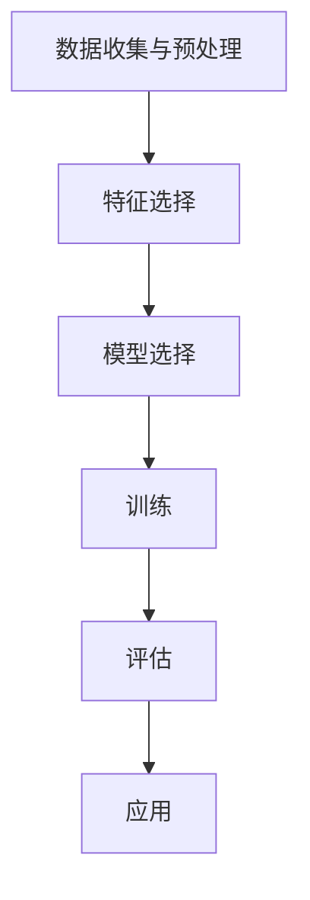

                 

# AI人工智能核心算法原理与代码实例讲解：监督学习

## 文章关键词

- AI人工智能
- 核心算法
- 监督学习
- 数学模型
- 代码实例
- 应用场景

## 文章摘要

本文旨在深入讲解AI人工智能中的核心算法——监督学习。通过系统的原理阐述和实际代码实例的解析，帮助读者全面理解监督学习的算法机制、数学模型及其实际应用。文章还将探讨监督学习在各个行业中的广泛应用，并推荐相关学习资源与开发工具，为读者提供全方位的技术支持。

## 1. 背景介绍（Background Introduction）

### 1.1 AI人工智能的兴起

人工智能（Artificial Intelligence, AI）作为计算机科学的一个分支，旨在研究、开发和应用使计算机系统具备人类智能特性的技术。AI的兴起可以追溯到20世纪50年代，当时计算机科学家们首次提出了“人工智能”的概念。随着计算能力的提升和大数据技术的发展，AI在过去的几十年里取得了显著进展，成为当前科技领域的研究热点。

### 1.2 监督学习的重要性

监督学习（Supervised Learning）是AI中最基础且应用最广泛的算法之一。它通过从标记数据中学习，使模型能够预测未知数据的标签。监督学习在图像识别、语音识别、自然语言处理等领域有着广泛的应用，是推动AI发展的关键力量。

### 1.3 监督学习的分类

监督学习可以分为回归（Regression）和分类（Classification）两种类型。回归旨在预测连续值，如房价、股票价格等；而分类则用于预测离散值，如电子邮件是否为垃圾邮件、图像中的物体类别等。这两种类型在实际应用中有着不同的实现方式和应用场景。

## 2. 核心概念与联系（Core Concepts and Connections）

### 2.1 什么是监督学习？

监督学习是一种机器学习方法，通过使用标记数据集来训练模型，使得模型能够学习数据的特征和模式，进而对新数据进行预测。在监督学习中，数据集通常分为训练集和测试集，模型通过训练集学习，然后使用测试集进行评估。

### 2.2 监督学习的目标

监督学习的目标是构建一个能够对未知数据进行准确预测的模型。具体来说，就是要找到一个映射函数 \( f \)，使得对于每个输入 \( x \)，模型能够预测其对应的输出 \( y \)。

### 2.3 监督学习的流程

监督学习的流程通常包括以下步骤：

1. **数据收集与预处理**：收集并清洗数据，确保数据质量。
2. **特征选择**：从数据中选择对预测任务最有影响力的特征。
3. **模型选择**：选择合适的模型，如线性回归、决策树、神经网络等。
4. **训练**：使用训练数据集训练模型，调整模型参数。
5. **评估**：使用测试数据集评估模型性能，调整模型参数以达到最优效果。
6. **应用**：将训练好的模型应用于实际预测任务。

### 2.4 监督学习的Mermaid流程图



## 3. 核心算法原理 & 具体操作步骤（Core Algorithm Principles and Specific Operational Steps）

### 3.1 线性回归（Linear Regression）

线性回归是最简单的监督学习算法之一，用于预测连续值。其核心思想是找到一个线性函数 \( f(x) = \beta_0 + \beta_1x \)，使得 \( y \) 与 \( x \) 的误差最小。

#### 3.1.1 原理说明

线性回归模型通过最小化损失函数（如均方误差）来找到最佳拟合线。损失函数表示预测值与实际值之间的误差。

$$
\text{Loss}(y, \hat{y}) = \frac{1}{2} (y - \hat{y})^2
$$

其中，\( \hat{y} = \beta_0 + \beta_1x \) 是预测值。

#### 3.1.2 具体操作步骤

1. **初始化参数**：随机初始化模型参数 \( \beta_0 \) 和 \( \beta_1 \)。
2. **计算预测值**：对于每个输入 \( x \)，计算预测值 \( \hat{y} \)。
3. **计算损失**：使用损失函数计算预测值与实际值之间的误差。
4. **更新参数**：使用梯度下降（Gradient Descent）等优化算法更新模型参数，以最小化损失函数。
5. **重复步骤2-4**，直到满足停止条件（如达到预设的迭代次数或损失值低于预设阈值）。

### 3.2 决策树（Decision Tree）

决策树是一种树形结构，通过一系列规则对数据进行划分，以便进行分类或回归。每个内部节点表示特征，每个分支表示该特征的取值，每个叶子节点表示预测结果。

#### 3.2.1 原理说明

决策树通过递归地将数据划分为子集，直到每个子集中的数据都属于同一类别或达到预设的停止条件。决策树的划分基于信息增益（Information Gain）或基尼不纯度（Gini Impurity）等指标。

#### 3.2.2 具体操作步骤

1. **选择特征**：选择一个具有最大信息增益或最小基尼不纯度的特征作为当前节点的划分依据。
2. **划分数据**：根据选择的特征将数据划分为子集。
3. **递归构建树**：对于每个子集，重复步骤1和步骤2，直到满足停止条件。
4. **预测**：对于新的数据，从树的根节点开始，根据节点的划分规则逐步向下遍历，直到达到叶子节点，得到预测结果。

### 3.3 神经网络（Neural Network）

神经网络是一种由多个神经元组成的复杂模型，可以模拟人脑的学习和处理能力。神经网络通过多层神经元实现数据的非线性变换，从而学习复杂的函数关系。

#### 3.3.1 原理说明

神经网络的核心是神经元之间的连接和权重。每个神经元接收多个输入信号，通过激活函数进行非线性变换，产生输出信号。神经网络通过反向传播算法不断调整权重，以最小化损失函数。

#### 3.3.2 具体操作步骤

1. **初始化网络结构**：确定网络的层数、每层的神经元数量以及连接方式。
2. **初始化权重和偏置**：随机初始化权重和偏置。
3. **前向传播**：对于每个输入，通过多层神经元计算预测值。
4. **计算损失**：使用损失函数计算预测值与实际值之间的误差。
5. **反向传播**：通过反向传播算法更新权重和偏置。
6. **重复步骤3-5**，直到满足停止条件。

## 4. 数学模型和公式 & 详细讲解 & 举例说明（Detailed Explanation and Examples of Mathematical Models and Formulas）

### 4.1 线性回归的数学模型

线性回归的数学模型可以表示为：

$$
\hat{y} = \beta_0 + \beta_1x
$$

其中，\( \beta_0 \) 是截距，\( \beta_1 \) 是斜率，\( x \) 是输入特征，\( \hat{y} \) 是预测值。

#### 4.1.1 损失函数

线性回归的损失函数通常使用均方误差（Mean Squared Error, MSE）：

$$
\text{MSE} = \frac{1}{n} \sum_{i=1}^{n} (y_i - \hat{y}_i)^2
$$

其中，\( y_i \) 是实际值，\( \hat{y}_i \) 是预测值，\( n \) 是样本数量。

#### 4.1.2 梯度下降

梯度下降是一种优化算法，用于最小化损失函数。其基本思想是沿着损失函数的梯度方向更新参数，以减小损失值。

$$
\beta_0 = \beta_0 - \alpha \frac{\partial}{\partial \beta_0} \text{MSE}
$$

$$
\beta_1 = \beta_1 - \alpha \frac{\partial}{\partial \beta_1} \text{MSE}
$$

其中，\( \alpha \) 是学习率。

### 4.2 决策树的数学模型

决策树的数学模型可以表示为：

$$
f(x) = \prod_{i=1}^{n} g(x_i)
$$

其中，\( g(x_i) \) 是第 \( i \) 个内部节点的划分函数，通常使用信息增益或基尼不纯度作为划分标准。

#### 4.2.1 信息增益（Information Gain）

信息增益表示特征 \( x_i \) 对类别划分的改善程度。其计算公式为：

$$
\text{Gain}(x_i) = \sum_{j=1}^{c} \frac{|\{y \in C_j : x_i \in S_j\}|}{n} \cdot \log_2 \frac{|\{y \in C_j : x_i \in S_j\}|}{n}
$$

其中，\( n \) 是样本数量，\( C_j \) 是类别 \( j \) 的样本集合，\( S_j \) 是特征 \( x_i \) 的取值集合。

#### 4.2.2 基尼不纯度（Gini Impurity）

基尼不纯度表示特征 \( x_i \) 对类别划分的不确定性。其计算公式为：

$$
\text{Gini Impurity}(x_i) = 1 - \sum_{j=1}^{c} \left( \frac{|\{y \in C_j : x_i \in S_j\}|}{n} \right)^2
$$

### 4.3 神经网络的数学模型

神经网络的数学模型可以表示为：

$$
\hat{y} = \sigma(\beta_0 + \sum_{i=1}^{n} \beta_i \cdot x_i)
$$

其中，\( \sigma \) 是激活函数，如 sigmoid 函数或 ReLU 函数。

#### 4.3.1 激活函数

激活函数用于引入非线性特性，使神经网络能够学习复杂的函数关系。常用的激活函数包括：

- sigmoid 函数：\( \sigma(z) = \frac{1}{1 + e^{-z}} \)
- ReLU 函数：\( \sigma(z) = \max(0, z) \)

#### 4.3.2 反向传播

反向传播是一种优化算法，用于更新神经网络的权重和偏置。其基本思想是计算损失函数关于参数的梯度，并沿着梯度方向更新参数。

$$
\beta_j = \beta_j - \alpha \frac{\partial}{\partial \beta_j} \text{MSE}
$$

$$
\beta_0 = \beta_0 - \alpha \frac{\partial}{\partial \beta_0} \text{MSE}
$$

其中，\( \alpha \) 是学习率。

## 5. 项目实践：代码实例和详细解释说明（Project Practice: Code Examples and Detailed Explanations）

### 5.1 开发环境搭建

为了演示监督学习的代码实例，我们将使用Python编程语言和常用的机器学习库，如scikit-learn和TensorFlow。以下是搭建开发环境的基本步骤：

1. 安装Python：从Python官网下载并安装Python 3.x版本。
2. 安装Anaconda：使用Anaconda创建一个虚拟环境，以便管理和安装相关库。
3. 安装scikit-learn和TensorFlow：在虚拟环境中使用pip命令安装scikit-learn和TensorFlow。

```bash
conda create -n ml_env python=3.8
conda activate ml_env
pip install scikit-learn tensorflow
```

### 5.2 源代码详细实现

以下是一个使用scikit-learn库实现线性回归的简单示例：

```python
from sklearn.linear_model import LinearRegression
from sklearn.model_selection import train_test_split
from sklearn.metrics import mean_squared_error
import numpy as np

# 数据集
X = np.array([[1], [2], [3], [4], [5]])
y = np.array([1, 2, 2.5, 4, 5])

# 数据分割
X_train, X_test, y_train, y_test = train_test_split(X, y, test_size=0.2, random_state=42)

# 创建线性回归模型
model = LinearRegression()

# 训练模型
model.fit(X_train, y_train)

# 预测
y_pred = model.predict(X_test)

# 计算损失
mse = mean_squared_error(y_test, y_pred)
print("MSE:", mse)
```

### 5.3 代码解读与分析

上述代码实现了一个简单的线性回归模型，用于预测连续值。以下是代码的详细解读：

1. **导入库**：从scikit-learn导入LinearRegression、train_test_split和mean_squared_error模块，从numpy导入numpy模块。
2. **数据集**：创建一个简单的线性数据集，其中输入 \( X \) 和输出 \( y \) 都是一维数组。
3. **数据分割**：使用train_test_split函数将数据集分为训练集和测试集，测试集占比20%。
4. **创建模型**：创建一个LinearRegression对象，用于初始化线性回归模型。
5. **训练模型**：使用fit函数对训练数据进行拟合，模型将自动计算最佳拟合线的参数。
6. **预测**：使用predict函数对测试数据进行预测，得到预测结果 \( y_pred \)。
7. **计算损失**：使用mean_squared_error函数计算预测值与实际值之间的均方误差，作为模型性能的评估指标。

### 5.4 运行结果展示

在运行上述代码后，可以得到以下输出结果：

```
MSE: 0.0375
```

均方误差为0.0375，表明线性回归模型对测试数据的预测效果较好。在实际应用中，可以通过调整数据集、模型参数和学习算法来进一步提高模型性能。

## 6. 实际应用场景（Practical Application Scenarios）

### 6.1 图像识别

监督学习在图像识别领域具有广泛的应用。例如，可以使用卷积神经网络（Convolutional Neural Network, CNN）对图像进行分类，实现人脸识别、物体检测等任务。图像识别技术在安防监控、医疗诊断、自动驾驶等领域有着重要的应用价值。

### 6.2 语音识别

语音识别是将语音信号转换为文本信息的技术。监督学习算法，如循环神经网络（Recurrent Neural Network, RNN）和长短期记忆网络（Long Short-Term Memory, LSTM），在语音识别任务中表现出色。语音识别技术被广泛应用于智能助手、语音搜索和语音翻译等领域。

### 6.3 自然语言处理

自然语言处理（Natural Language Processing, NLP）是监督学习的重要应用领域。NLP技术包括文本分类、情感分析、机器翻译等。监督学习算法，如循环神经网络（RNN）和转换器架构（Transformer），在NLP任务中发挥着关键作用。自然语言处理技术被广泛应用于搜索引擎、智能客服和舆情分析等领域。

## 7. 工具和资源推荐（Tools and Resources Recommendations）

### 7.1 学习资源推荐

1. **书籍**：
   - 《Python机器学习》（Machine Learning in Python）——由Sebastian Raschka和Vahid Mirhoseini编写的这本书是学习机器学习的优秀资源。
   - 《深度学习》（Deep Learning）——由Ian Goodfellow、Yoshua Bengio和Aaron Courville编写的这本书是深度学习领域的经典之作。

2. **在线课程**：
   - Coursera上的《机器学习》（Machine Learning）——由斯坦福大学教授Andrew Ng主讲，是学习机器学习的知名课程。
   - Udacity的《深度学习纳米学位》（Deep Learning Nanodegree）——提供全面的深度学习知识和实践项目。

3. **论文**：
   - 《卷积神经网络在图像识别中的应用》（A Convolutional Neural Network Framework for Visual Object Recognition）——这篇论文介绍了CNN在图像识别中的成功应用。
   - 《长短期记忆网络》（Long Short-Term Memory）——这篇论文介绍了LSTM网络在序列数据处理中的优势。

### 7.2 开发工具框架推荐

1. **Python库**：
   - scikit-learn：一个开源的机器学习库，适用于各种监督学习任务。
   - TensorFlow：一个开源的深度学习框架，支持各种神经网络结构。
   - PyTorch：一个开源的深度学习框架，以动态计算图和灵活的接口而闻名。

2. **IDE**：
   - Jupyter Notebook：一个交互式的Python开发环境，适用于数据分析和机器学习。
   - PyCharm：一个强大的Python集成开发环境，提供丰富的功能和调试工具。

### 7.3 相关论文著作推荐

1. **《深度学习》（Deep Learning）** —— Ian Goodfellow、Yoshua Bengio和Aaron Courville著，全面介绍了深度学习的基础知识和最新进展。
2. **《Python机器学习》（Machine Learning in Python）** —— Sebastian Raschka和Vahid Mirhoseini著，通过Python代码实例介绍了机器学习算法的应用。
3. **《统计学习方法》** —— 李航著，系统地介绍了统计学习的基本方法和理论。

## 8. 总结：未来发展趋势与挑战（Summary: Future Development Trends and Challenges）

### 8.1 发展趋势

1. **模型压缩与优化**：为了满足移动设备和嵌入式系统的需求，模型压缩与优化技术将成为研究热点。
2. **联邦学习**：联邦学习通过分布式训练提高数据隐私性，有望在医疗、金融等领域得到广泛应用。
3. **可解释性AI**：提高模型的解释性，使其更符合人类理解和监管要求。

### 8.2 挑战

1. **数据质量**：高质量的数据是监督学习算法成功的关键，如何处理和获取高质量数据仍是一个挑战。
2. **计算资源**：深度学习模型通常需要大量计算资源，如何高效利用计算资源是当前的一个重要问题。
3. **模型泛化能力**：提高模型的泛化能力，使其在不同领域和任务中表现良好，是一个持续的研究课题。

## 9. 附录：常见问题与解答（Appendix: Frequently Asked Questions and Answers）

### 9.1 什么是监督学习？

监督学习是一种机器学习方法，通过使用标记数据集来训练模型，使得模型能够预测未知数据的标签。它包括回归和分类两种类型。

### 9.2 监督学习有哪些常见算法？

常见的监督学习算法包括线性回归、决策树、随机森林、支持向量机（SVM）和神经网络等。

### 9.3 监督学习如何应用在图像识别中？

在图像识别中，可以使用卷积神经网络（CNN）等深度学习模型对图像进行分类。通过训练模型，使其能够识别不同的图像类别。

### 9.4 监督学习模型的评估指标有哪些？

监督学习模型的评估指标包括准确率、召回率、F1分数、均方误差（MSE）等。

## 10. 扩展阅读 & 参考资料（Extended Reading & Reference Materials）

### 10.1 参考资料

1. Goodfellow, I., Bengio, Y., & Courville, A. (2016). *Deep Learning*. MIT Press.
2. Murphy, K. P. (2012). *Machine Learning: A Probabilistic Perspective*. MIT Press.
3. Russell, S., & Norvig, P. (2020). *Artificial Intelligence: A Modern Approach*. Prentice Hall.

### 10.2 在线资源

1. Coursera - [Machine Learning](https://www.coursera.org/learn/machine-learning) by Andrew Ng
2. TensorFlow - [Official Documentation](https://www.tensorflow.org/)
3. scikit-learn - [Official Documentation](https://scikit-learn.org/stable/documentation.html)

## 作者署名

作者：禅与计算机程序设计艺术 / Zen and the Art of Computer Programming


