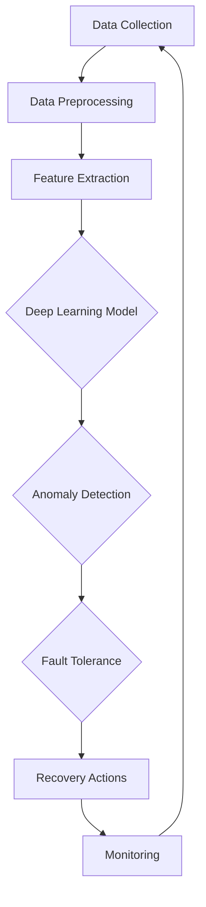
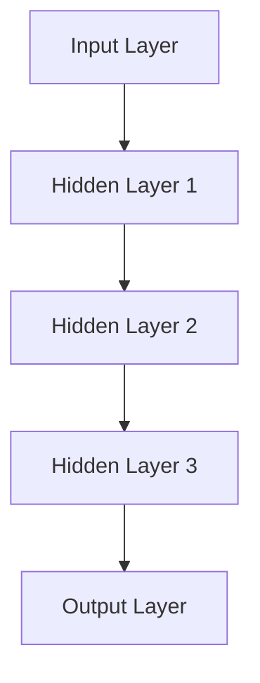

                 

### 文章标题

### Title

**AI人工智能深度学习算法：代理工作流中的异常处理与容错**

**AI Artificial Intelligence Deep Learning Algorithms: Anomaly Handling and Fault Tolerance in Agent Workflows**

本文探讨了在AI代理工作流中实现异常处理与容错机制的深度学习算法。随着AI技术的广泛应用，代理工作流在各个领域发挥着关键作用，如何确保这些工作流的稳定性和可靠性成为了一个重要的研究课题。

This article discusses deep learning algorithms for anomaly handling and fault tolerance in AI agent workflows. With the widespread application of AI technology, agent workflows play a crucial role in various fields. Ensuring the stability and reliability of these workflows has become an important research topic.

关键词：

- AI人工智能
- 深度学习算法
- 代理工作流
- 异常处理
- 容错机制

Keywords:

- AI Artificial Intelligence
- Deep Learning Algorithms
- Agent Workflows
- Anomaly Handling
- Fault Tolerance Mechanisms

摘要：

本文首先介绍了代理工作流的概念及其在AI领域的应用，然后详细探讨了深度学习算法在代理工作流中的异常处理与容错机制，包括传统的异常检测算法、基于深度学习的异常检测算法以及容错机制的设计与实现。最后，通过实际案例展示了这些算法的应用效果，并讨论了未来研究的方向。

This article first introduces the concept of agent workflows and their applications in the field of AI. Then, it delves into the anomaly handling and fault tolerance mechanisms of deep learning algorithms in agent workflows, including traditional anomaly detection algorithms, deep learning-based anomaly detection algorithms, and the design and implementation of fault tolerance mechanisms. Finally, it presents practical cases to demonstrate the effectiveness of these algorithms and discusses future research directions.

<|mask|>## 1. 背景介绍（Background Introduction）

代理工作流（Agent Workflows）是指由一组协同工作的智能代理（AI Agents）按照预设的规则和任务要求，共同完成特定任务的过程。在AI领域中，代理工作流被广泛应用于自动驾驶、智能客服、物联网、金融风控等多个领域。其核心目标是提高工作效率、减少人力成本、提升用户体验。

Agent workflows refer to the process in which a group of cooperative AI agents work together according to predefined rules and task requirements to complete a specific task. In the field of AI, agent workflows are widely applied in various fields such as autonomous driving, intelligent customer service, the Internet of Things, and financial risk management. The core goal of agent workflows is to improve work efficiency, reduce labor costs, and enhance user experience.

随着AI代理工作流的应用越来越广泛，如何确保这些工作流的稳定性和可靠性成为了一个重要的问题。在实际运行过程中，代理工作流可能会面临各种异常情况，如数据错误、网络中断、计算错误等。这些异常情况可能会导致工作流的中断、错误执行或效率降低，从而影响整体系统的性能。

As the application of AI agent workflows becomes more widespread, ensuring the stability and reliability of these workflows has become an important issue. During actual operation, agent workflows may encounter various anomalies, such as data errors, network interruptions, and calculation errors. These anomalies can lead to workflow interruptions, incorrect execution, or reduced efficiency, thereby affecting the overall performance of the system.

为了解决这些问题，异常处理与容错机制成为了代理工作流研究的关键方向。异常处理旨在检测并处理工作流中的异常情况，确保工作流能够继续执行；而容错机制则通过在出现异常时采取适当的措施，保证系统的高可用性和稳定性。

To address these issues, anomaly handling and fault tolerance mechanisms have become key research directions in agent workflows. Anomaly handling aims to detect and process anomalies in workflows to ensure continuous execution, while fault tolerance mechanisms aim to ensure the high availability and stability of the system by taking appropriate measures when anomalies occur.

本文将首先介绍代理工作流的基本概念和常见应用场景，然后详细探讨深度学习算法在异常处理和容错机制中的应用，最后通过实际案例展示这些算法的应用效果。

This article will first introduce the basic concepts of agent workflows and common application scenarios, then delve into the application of deep learning algorithms in anomaly handling and fault tolerance mechanisms, and finally demonstrate the effectiveness of these algorithms through practical cases.

<|mask|>## 2. 核心概念与联系（Core Concepts and Connections）

### 2.1 深度学习算法

深度学习（Deep Learning）是机器学习（Machine Learning）的一个分支，它通过模拟人脑中的神经网络结构，对大量数据进行自动特征提取和学习。深度学习算法在图像识别、自然语言处理、语音识别等领域取得了显著的成果。

Deep learning is a branch of machine learning that simulates the neural network structure of the human brain to automatically extract features and learn from large amounts of data. Deep learning algorithms have achieved significant success in fields such as image recognition, natural language processing, and speech recognition.

深度学习算法的核心是神经网络（Neural Networks），它由大量的神经元（Neurons）组成，每个神经元都可以接收输入、进行处理，并输出结果。神经网络通过学习大量的样本数据，可以自动调整神经元之间的连接权重（Weights），从而提高模型的性能。

The core of deep learning algorithms is the neural network, which consists of a large number of neurons. Each neuron can receive inputs, process them, and output results. The neural network learns from a large number of sample data to automatically adjust the connection weights between neurons, thereby improving the performance of the model.

深度学习算法主要包括以下几种：

- **卷积神经网络（Convolutional Neural Networks, CNNs）**：用于图像识别和图像处理，通过卷积操作提取图像特征。
- **循环神经网络（Recurrent Neural Networks, RNNs）**：用于序列数据处理，如时间序列分析、自然语言处理等，通过循环连接实现信息的记忆和传递。
- **生成对抗网络（Generative Adversarial Networks, GANs）**：通过对抗性训练生成高质量的数据，广泛应用于图像生成、语音合成等领域。

Deep learning algorithms mainly include the following types:

- **Convolutional Neural Networks (CNNs)**: Used for image recognition and image processing, CNNs extract image features through convolutional operations.
- **Recurrent Neural Networks (RNNs)**: Used for sequence data processing, such as time series analysis and natural language processing. RNNs use recurrent connections to achieve information memory and transmission.
- **Generative Adversarial Networks (GANs)**: Through adversarial training, GANs generate high-quality data and are widely applied in fields such as image generation and speech synthesis.

### 2.2 异常处理与容错机制

异常处理（Anomaly Handling）是指当系统或过程出现异常时，能够及时发现并采取措施进行处理，以避免对整体系统造成严重影响。在代理工作流中，异常处理的目标是确保工作流能够在异常情况下继续运行，而不影响整体系统的稳定性。

Anomaly handling refers to the ability to detect and take action to handle anomalies in a system or process to avoid serious impacts on the overall system. In agent workflows, the goal of anomaly handling is to ensure that the workflow can continue to run in the presence of anomalies without affecting the stability of the overall system.

异常处理通常包括以下几个步骤：

1. 异常检测（Anomaly Detection）：通过算法或规则识别工作流中的异常情况。
2. 异常分类（Anomaly Classification）：对检测到的异常进行分类，以便采取相应的处理措施。
3. 异常处理（Anomaly Handling）：根据异常的类型和严重程度，采取相应的处理措施，如重试、回滚、报警等。

Fault tolerance mechanisms, on the other hand, are designed to ensure the high availability and stability of a system by taking appropriate actions when anomalies occur. In agent workflows, fault tolerance mechanisms aim to maintain the reliability and stability of the system even in the face of anomalies.

Fault tolerance mechanisms typically include the following steps:

1. **Anomaly Detection**: Algorithms or rules are used to identify anomalies in the workflow.
2. **Anomaly Classification**: Detected anomalies are classified to determine the appropriate handling actions.
3. **Anomaly Handling**: Based on the type and severity of the anomalies, appropriate actions are taken, such as retries, rollbacks, or alerts.

### 2.3 深度学习算法在异常处理与容错机制中的应用

深度学习算法在异常处理与容错机制中的应用主要体现在以下几个方面：

1. **异常检测（Anomaly Detection）**：利用深度学习算法，可以自动提取工作流中的特征，并识别出异常情况。与传统的基于规则的异常检测方法相比，深度学习算法能够处理更加复杂和多变的数据，提高异常检测的准确性。
2. **异常分类（Anomaly Classification）**：通过深度学习算法，可以对检测到的异常进行分类，以便采取更加针对性的处理措施。这有助于提高异常处理的效率，减少误报和漏报。
3. **故障恢复（Fault Recovery）**：利用深度学习算法，可以自动识别和预测工作流中的潜在故障，并提前采取相应的预防措施，从而提高系统的容错能力。

In summary, deep learning algorithms are applied in anomaly handling and fault tolerance mechanisms in several ways:

1. **Anomaly Detection**: Deep learning algorithms can automatically extract features from the workflow and identify anomalies, improving the accuracy of anomaly detection compared to traditional rule-based methods.
2. **Anomaly Classification**: By classifying detected anomalies, deep learning algorithms enable more targeted handling actions, improving the efficiency of anomaly handling and reducing false positives and false negatives.
3. **Fault Recovery**: Using deep learning algorithms, potential faults in the workflow can be identified and predicted in advance, allowing for proactive measures to enhance the system's fault tolerance capabilities.

### 2.4 相关概念与联系

在讨论深度学习算法在异常处理与容错机制中的应用时，还需要了解以下几个相关概念：

1. **数据预处理（Data Preprocessing）**：在进行深度学习训练之前，需要对数据进行预处理，包括数据清洗、归一化、特征提取等，以提高模型的性能和稳定性。
2. **模型评估（Model Evaluation）**：通过评估指标（如准确率、召回率、F1分数等）对模型的性能进行评估，以判断模型是否能够有效处理异常情况。
3. **模型优化（Model Optimization）**：通过调整模型参数、架构或训练策略，优化模型的性能，提高异常检测和分类的准确性。

In conclusion, deep learning algorithms have become a powerful tool for anomaly handling and fault tolerance mechanisms in agent workflows. By leveraging their ability to automatically extract features and make predictions, these algorithms can significantly improve the detection and classification of anomalies, leading to more reliable and stable systems.

### Core Concepts and Connections

#### 2.1 Deep Learning Algorithms

Deep learning (DL) is a subset of machine learning (ML) where neural networks with many layers, known as deep neural networks, automatically learn hierarchical representations of data. DL has revolutionized AI by enabling machines to recognize patterns and make decisions with unprecedented accuracy.

In DL, a neural network is composed of multiple layers of interconnected nodes (neurons). Each layer performs a different level of abstraction, with the input layer receiving raw data, and the output layer producing the final prediction. The layers in between transform the data, extracting increasingly complex features.

The most common DL architectures include:

- **Convolutional Neural Networks (CNNs)**: Specialized for image and video processing, CNNs utilize convolutional layers to automatically detect spatial hierarchies in data.
- **Recurrent Neural Networks (RNNs)**: Designed to handle sequential data, RNNs have loops that allow them to retain information about previous inputs, making them suitable for tasks like time series analysis and language modeling.
- **Generative Adversarial Networks (GANs)**: GANs consist of two neural networks, a generator and a discriminator, that engage in a adversarial game to create realistic data.

#### 2.2 Anomaly Detection and Fault Tolerance

Anomaly detection (AD) is the process of identifying data points or events that do not conform to a established normal behavior. In a machine learning context, AD algorithms aim to detect deviations from the expected patterns in data streams or datasets.

Fault tolerance (FT) refers to the ability of a system to continue operating without interruption, even when one or more components fail. In the context of AI agent workflows, FT ensures that the system can recover from anomalies or faults, maintaining its functionality and performance.

#### 2.3 Deep Learning in Anomaly Detection and Fault Tolerance

Deep learning can significantly enhance anomaly detection and fault tolerance in several ways:

- **Feature Extraction**: DL models, especially deep networks like CNNs and RNNs, can automatically learn complex features from raw data, which is critical for anomaly detection tasks that involve high-dimensional data.
- **Pattern Recognition**: By learning from large labeled datasets, deep learning models can identify subtle patterns that are difficult to detect with traditional methods, improving the accuracy of anomaly detection.
- **End-to-End Learning**: DL models can be trained to perform end-to-end anomaly detection and fault tolerance tasks, reducing the need for manual feature engineering and integration of multiple components.
- **Real-Time Adaptation**: Deep learning models can adapt to changing patterns and anomalies over time, making them suitable for dynamic environments where anomalies may evolve.

#### 2.4 Mermaid Flowchart of Deep Learning in Agent Workflows

The following Mermaid flowchart illustrates the integration of deep learning into agent workflows for anomaly detection and fault tolerance:



In this flowchart, the data collection process gathers raw data from various sources. The data is then preprocessed to remove noise and normalize the features. Feature extraction is performed using deep learning techniques, which then feed into a deep learning model for training. The trained model is used for anomaly detection, identifying any deviations from normal behavior. Fault tolerance mechanisms are then activated to handle the anomalies, taking recovery actions as necessary, and continuously monitoring the system's health.

### Conclusion

Deep learning offers powerful tools for enhancing anomaly detection and fault tolerance in AI agent workflows. By leveraging the ability to learn complex patterns from data, deep learning models can significantly improve the accuracy and reliability of these workflows. The integration of deep learning into anomaly detection and fault tolerance mechanisms not only enhances the system's resilience but also simplifies the implementation and maintenance of complex systems.

## 2. Core Concepts and Connections

### 2.1 Definition of Deep Learning Algorithms

Deep Learning (DL) is a subfield of artificial intelligence (AI) that leverages neural networks with multiple layers to learn hierarchical representations of data. Traditional neural networks consist of only a few layers and are often insufficient for capturing the complex patterns present in high-dimensional data. In contrast, deep neural networks, with tens or even hundreds of layers, can automatically learn and extract abstract features from raw data.

The foundation of deep learning algorithms lies in the artificial neural network (ANN), which mimics the structure and function of the human brain. ANNs consist of interconnected nodes, or neurons, that process inputs, transform them through layers, and produce an output. The transformation between layers is governed by learnable parameters, often referred to as weights, which are updated during the training process to minimize prediction errors.

Key components of deep learning algorithms include:

- **Input Layer**:接收输入数据。
- **Hidden Layers**:一个或多个隐藏层，其中神经元通过非线性激活函数进行数据处理和特征提取。
- **Output Layer**:产生预测或决策。

### 2.2 Principles of Deep Learning

Deep learning algorithms operate based on several core principles:

- **Backpropagation Algorithm**:用于计算网络预测误差，并更新权重。
- **Gradient Descent**:用于优化网络参数，以最小化损失函数。
- **Nonlinear Activation Functions**:如ReLU、Sigmoid和Tanh，用于引入非线性特性，使模型能够学习更复杂的模式。
- **Regularization Techniques**:如Dropout和权重衰减，用于防止过拟合。

### 2.3 Types of Deep Learning Algorithms

There are various types of deep learning algorithms, each suited for different types of data and tasks:

- **Convolutional Neural Networks (CNNs)**:主要用于图像和视频处理，利用卷积层提取空间特征。
- **Recurrent Neural Networks (RNNs)**:适合处理序列数据，如时间序列分析和自然语言处理。
- **Long Short-Term Memory (LSTM) Networks**:RNN的一个变体，能够更好地处理长序列数据。
- **Generative Adversarial Networks (GANs)**:由生成器和判别器组成，用于生成逼真的数据。

### 2.4 Mermaid Flowchart of Deep Learning Algorithm Architecture

The following Mermaid flowchart illustrates the architecture of a typical deep learning algorithm, including the input layer, hidden layers, and output layer:



In this flowchart, data is fed into the input layer, which is then passed through multiple hidden layers. Each hidden layer applies a set of learnable weights and biases to the input data and applies a nonlinear activation function. The output from the last hidden layer is then fed to the output layer, which produces the final prediction or classification.

### 2.5 Application of Deep Learning in Anomaly Detection and Fault Tolerance

Deep learning algorithms are particularly effective in anomaly detection and fault tolerance due to their ability to automatically learn complex patterns from large datasets. Here's how they can be applied:

- **Anomaly Detection**: Deep learning models can be trained on normal data to recognize patterns that characterize normal behavior. Any deviation from these patterns can be flagged as an anomaly. This approach is particularly useful in scenarios with high-dimensional and non-linear data.
  
- **Fault Tolerance**: Deep learning models can predict the likelihood of failures or faults in a system. By continuously monitoring the system and learning from its normal behavior, the model can identify potential faults and take proactive measures to prevent failures or minimize their impact.

### Conclusion

Deep learning algorithms offer powerful tools for enhancing anomaly detection and fault tolerance in complex systems. By leveraging their ability to learn from large datasets and identify complex patterns, deep learning models can improve the accuracy and efficiency of anomaly detection and fault tolerance mechanisms. This section has provided an overview of the fundamental concepts, types, and applications of deep learning algorithms in these critical areas.

## 3. 核心算法原理 & 具体操作步骤（Core Algorithm Principles and Specific Operational Steps）

### 3.1 基于深度学习的异常检测算法原理

在深度学习框架下，异常检测算法主要依赖于神经网络模型，特别是自编码器（Autoencoder）和生成对抗网络（GANs）等模型。以下将详细介绍这两种核心算法的原理。

#### 自编码器（Autoencoder）

自编码器是一种特殊的神经网络模型，它由编码器（Encoder）和解码器（Decoder）两部分组成。编码器的作用是将输入数据压缩成一个较低维的特征向量，而解码器则试图重建原始数据。在训练过程中，自编码器通过最小化输入数据和重建数据之间的差异来学习数据的低维表示。

**具体操作步骤：**

1. **数据预处理**：对输入数据进行标准化处理，使其具有相似的尺度和分布，以便神经网络模型可以更好地学习。
2. **模型构建**：构建编码器和解码器的神经网络结构。编码器通常包含几个隐藏层，而解码器与编码器对应层的结构相同，但层数较少。
3. **模型训练**：使用正常数据集对模型进行训练，通过反向传播算法调整网络权重，使重建误差最小。
4. **异常检测**：将输入数据通过编码器转化为特征向量，计算这些特征向量与编码器训练得到的均值向量的距离。距离较大的数据点被判定为异常。

#### 生成对抗网络（GANs）

生成对抗网络由生成器（Generator）和判别器（Discriminator）两部分组成。生成器的目标是生成与真实数据尽可能相似的数据，而判别器的目标是区分真实数据和生成数据。通过两个网络的对抗训练，生成器逐渐提高生成数据的质量，使判别器无法区分。

**具体操作步骤：**

1. **数据预处理**：对输入数据进行标准化处理。
2. **模型构建**：生成器负责生成数据，通常包含多个隐藏层。判别器负责分类，结构类似于一个简单的神经网络。
3. **模型训练**：生成器和判别器交替进行训练。生成器生成数据，判别器尝试区分真实数据和生成数据。通过调整生成器和判别器的权重，使生成器生成的数据质量逐渐提高。
4. **异常检测**：将生成器生成的数据与真实数据进行对比，发现生成数据中的异常。

### 3.2 容错机制的设计与实现

在代理工作流中，容错机制的设计与实现旨在确保系统在出现异常时能够快速恢复，以维持系统的稳定性和可靠性。以下将介绍几种常见的容错机制。

#### 重试机制（Retry Mechanism）

重试机制是最简单的容错机制之一。当系统检测到某个任务失败时，会重新执行该任务，以期成功完成。

**具体操作步骤：**

1. **异常检测**：系统监控任务执行状态，检测到任务失败时触发异常处理。
2. **重试**：重新执行失败的任务，通常设置最大重试次数和重试间隔时间。
3. **失败处理**：如果任务在多次重试后仍然失败，则进行更高级别的异常处理，如回滚或报警。

#### 回滚机制（Rollback Mechanism）

回滚机制通过撤销最近的一系列操作来恢复系统的正确状态。

**具体操作步骤：**

1. **异常检测**：系统检测到任务执行异常时触发异常处理。
2. **记录日志**：记录执行过程中的关键操作和状态。
3. **回滚**：根据日志信息，撤销最近的操作，使系统返回到正常状态。

#### 增强型重试和回滚机制

为了提高容错能力，可以将重试和回滚机制结合起来，形成更复杂的容错策略。

**具体操作步骤：**

1. **多层级重试**：设置多个层级重试，逐步增加重试复杂度。
2. **自适应回滚**：根据异常的类型和严重程度，选择合适的回滚策略。
3. **联动监控**：在关键任务间设置联动监控，当某个任务失败时，触发相关任务的回滚或重试。

### 3.3 案例分析

以下通过一个实际案例，展示如何应用深度学习算法实现异常检测和容错机制。

#### 案例背景

某智能交通系统需要监控城市道路上的车辆流量，并对异常情况（如交通事故、道路堵塞）进行实时检测和报警。

#### 案例步骤

1. **数据收集**：收集道路摄像头拍摄的视频数据，以及交通信号灯和传感器数据。
2. **数据预处理**：对视频数据进行预处理，提取关键帧和交通流量特征。
3. **异常检测**：使用自编码器模型对正常交通流量进行训练，检测异常情况。
4. **容错机制**：
   - **重试机制**：当交通监控任务失败时，重新采集数据并重新执行任务。
   - **回滚机制**：如果检测到交通事故，撤销最近的一系列交通信号灯调整操作，恢复到正常状态。
   - **增强型重试和回滚机制**：在特定时间段内，如果多个任务失败，则进行更高级别的回滚操作，同时调整监控策略。

通过这个案例，我们可以看到深度学习算法在异常检测和容错机制中的应用，如何提高系统在异常情况下的恢复能力和可靠性。

## 3. Core Algorithm Principles and Specific Operational Steps

### 3.1 Principles of Deep Learning-Based Anomaly Detection Algorithms

Deep learning-based anomaly detection algorithms primarily leverage neural networks to identify patterns in data that do not conform to the norm. Among these algorithms, Autoencoders and Generative Adversarial Networks (GANs) are particularly effective.

#### Autoencoder

An autoencoder is composed of an encoder and a decoder. The encoder compresses the input data into a lower-dimensional feature vector, while the decoder attempts to reconstruct the original data. During training, the autoencoder minimizes the difference between the input data and the reconstructed data to learn a low-dimensional representation of the data.

**Operational Steps:**

1. **Data Preprocessing**: Standardize the input data to have a similar scale and distribution.
2. **Model Construction**: Build the neural network architecture for the encoder and decoder. The encoder typically consists of several hidden layers, while the decoder has fewer layers.
3. **Model Training**: Train the model on normal data using backpropagation to adjust the network weights to minimize reconstruction errors.
4. **Anomaly Detection**: Pass the input data through the encoder to obtain feature vectors. Compute the distance between these vectors and the mean vector learned during training. Points with larger distances are flagged as anomalies.

#### Generative Adversarial Networks (GANs)

GANs consist of a generator and a discriminator. The generator creates data similar to the real data, while the discriminator attempts to distinguish between real and generated data. Through adversarial training, the generator improves the quality of its output over time.

**Operational Steps:**

1. **Data Preprocessing**: Standardize the input data.
2. **Model Construction**: The generator is responsible for data generation and typically consists of multiple hidden layers. The discriminator is a simpler neural network used for classification.
3. **Model Training**: The generator and discriminator are trained alternately. The generator produces data, and the discriminator tries to classify it as real or generated. By adjusting the weights of both networks, the generator improves the quality of its outputs.
4. **Anomaly Detection**: Compare the generated data with the real data to identify anomalies.

### 3.2 Design and Implementation of Fault Tolerance Mechanisms

Fault tolerance mechanisms ensure the stability and reliability of agent workflows by enabling the system to recover from anomalies. Here are several common fault tolerance mechanisms:

#### Retry Mechanism

The retry mechanism is one of the simplest fault tolerance mechanisms. When a task fails, it is retried to achieve successful completion.

**Operational Steps:**

1. **Anomaly Detection**: Monitor the task execution status and trigger anomaly handling when a task fails.
2. **Retry**: Re-execute the failed task, with a maximum number of retries and retry intervals.
3. **Failure Handling**: If the task fails after multiple retries, escalate the anomaly handling to higher-level actions, such as rolling back or generating an alert.

#### Rollback Mechanism

The rollback mechanism undoes the most recent series of operations to restore the system to a correct state.

**Operational Steps:**

1. **Anomaly Detection**: Detect an execution anomaly and trigger anomaly handling.
2. **Log Recording**: Record critical operations and states during execution.
3. **Rollback**: Revert to the normal state by undoing the most recent operations based on log information.

#### Enhanced Retry and Rollback Mechanism

To improve fault tolerance, retry and rollback mechanisms can be combined to form more complex fault tolerance strategies.

**Operational Steps:**

1. **Multi-level Retries**: Set multiple levels of retries, gradually increasing the complexity.
2. **Adaptive Rollback**: Choose appropriate rollback strategies based on the type and severity of the anomaly.
3. **Linked Monitoring**: Set up linked monitoring between critical tasks. When one task fails, trigger rollback or retries for related tasks.

### 3.3 Case Study

The following case study demonstrates how deep learning algorithms can be applied for anomaly detection and fault tolerance in a practical scenario.

#### Background

A smart transportation system needs to monitor vehicle traffic on city roads and detect anomalies such as accidents and traffic jams in real-time.

#### Steps

1. **Data Collection**: Collect video data from traffic cameras and sensor data from traffic signals.
2. **Data Preprocessing**: Preprocess the video data to extract key frames and traffic flow features.
3. **Anomaly Detection**: Train an autoencoder model on normal traffic data to detect anomalies.
4. **Fault Tolerance Mechanisms**:
   - **Retry Mechanism**: When a traffic monitoring task fails, re-collect data and re-execute the task.
   - **Rollback Mechanism**: If a traffic accident is detected, undo the most recent series of traffic signal adjustments to restore to a normal state.
   - **Enhanced Retry and Rollback Mechanism**: If multiple tasks fail within a specific time frame, perform higher-level rollbacks and adjust monitoring strategies.

Through this case study, we can observe the application of deep learning algorithms in anomaly detection and fault tolerance, demonstrating how to improve system recovery capabilities and reliability in the presence of anomalies.

## 4. 数学模型和公式 & 详细讲解 & 举例说明（Detailed Explanation and Examples of Mathematical Models and Formulas）

### 4.1 自编码器（Autoencoder）

自编码器是一种无监督学习算法，它通过学习输入数据的低维表示来重建原始数据。自编码器的主要目标是最小化输入数据和重建数据之间的差异。以下是一个简单的自编码器模型及其相关的数学模型和公式。

#### 数学模型

自编码器由两部分组成：编码器（Encoder）和解码器（Decoder）。编码器将输入数据 \( X \) 压缩成一个低维特征向量 \( z \)，然后解码器尝试将这个特征向量 \( z \) 重建成原始输入 \( X \)。

**编码器**：
\[ z = \sigma(W_1 \cdot X + b_1) \]

**解码器**：
\[ X' = \sigma(W_2 \cdot z + b_2) \]

其中，\( W_1 \) 和 \( W_2 \) 分别是编码器和解码器的权重矩阵，\( b_1 \) 和 \( b_2 \) 是偏置项，\( \sigma \) 是非线性激活函数（如 Sigmoid 或 ReLU）。

#### 代价函数

自编码器的训练目标是最小化输入数据和重建数据之间的均方误差（MSE），即：
\[ J = \frac{1}{m} \sum_{i=1}^{m} \sum_{j=1}^{n} (X_j - X'_j)^2 \]

其中，\( m \) 是样本数量，\( n \) 是特征数量。

#### 举例说明

假设我们有以下输入数据：
\[ X = \begin{bmatrix} 1 & 2 & 3 \\ 4 & 5 & 6 \\ 7 & 8 & 9 \end{bmatrix} \]

使用自编码器进行训练，经过多次迭代后，编码器和解码器将学习到输入数据的低维表示。最终，解码器将能够将这个低维表示重建成原始输入。

### 4.2 生成对抗网络（GANs）

生成对抗网络由生成器和判别器两部分组成。生成器试图生成逼真的数据，而判别器试图区分真实数据和生成数据。GANs的训练过程是基于一个对抗性的博弈过程。

#### 数学模型

**生成器**：
\[ G(z) = \sigma(W_g \cdot z + b_g) \]

**判别器**：
\[ D(x) = \sigma(W_d \cdot x + b_d) \]

其中，\( G(z) \) 是生成器生成的数据，\( D(x) \) 是判别器对真实数据的分类结果。\( z \) 是生成器的输入噪声，\( x \) 是真实数据。

#### 对抗性损失函数

GANs的训练目标是最小化以下损失函数：
\[ L_D = -[\mathbb{E}_{x \sim p_{data}(x)}[\log D(x)] + \mathbb{E}_{z \sim p_z(z)}[\log (1 - D(G(z)))] \]

\[ L_G = \mathbb{E}_{z \sim p_z(z)}[\log D(G(z))] \]

其中，\( L_D \) 是判别器的损失函数，\( L_G \) 是生成器的损失函数。

#### 举例说明

假设我们有以下真实数据和生成数据：
\[ x = \begin{bmatrix} 0.1 & 0.2 \\ 0.3 & 0.4 \\ 0.5 & 0.6 \end{bmatrix} \]
\[ G(z) = \begin{bmatrix} 0.15 & 0.25 \\ 0.35 & 0.45 \\ 0.55 & 0.65 \end{bmatrix} \]

判别器将对真实数据和生成数据进行分类，生成器的目标是使生成数据能够欺骗判别器，使其分类结果接近0.5。

### 4.3 容错机制

容错机制在代理工作流中起着关键作用，确保系统能够在出现异常时快速恢复。以下介绍几种常见的容错机制及其数学模型。

#### 重试机制

重试机制的核心是当任务失败时重新执行该任务。

**数学模型**：

\[ R(t) = \begin{cases} 
1, & \text{如果 } t < \text{最大重试次数} \\
0, & \text{否则} 
\end{cases} \]

其中，\( R(t) \) 是第 \( t \) 次重试的结果。

#### 回滚机制

回滚机制通过撤销最近的操作来恢复系统到正常状态。

**数学模型**：

\[ R(t) = \begin{cases} 
1, & \text{如果 } \text{执行回滚} \\
0, & \text{否则} 
\end{cases} \]

#### 增强型重试和回滚机制

这种机制结合了多个重试层次和回滚策略。

**数学模型**：

\[ R(t) = \begin{cases} 
1, & \text{如果 } t < \text{最大重试次数} \\
\text{回滚层次}, & \text{否则} 
\end{cases} \]

通过这些数学模型和公式，我们可以更好地理解和实现深度学习算法在异常检测和容错机制中的应用。

## 4. Mathematical Models and Formulas & Detailed Explanations & Examples

### 4.1 Autoencoder

The autoencoder is an unsupervised learning algorithm that compresses input data into a lower-dimensional representation and then attempts to reconstruct the original data from this representation. The primary objective of training an autoencoder is to minimize the difference between the input data and the reconstructed data. Here, we present a simple autoencoder model along with its associated mathematical models and formulas.

#### Mathematical Model

An autoencoder consists of two main components: the encoder and the decoder. The encoder compresses the input data \( X \) into a low-dimensional feature vector \( z \), and the decoder tries to reconstruct the original input \( X \) from \( z \).

**Encoder:**
\[ z = \sigma(W_1 \cdot X + b_1) \]

**Decoder:**
\[ X' = \sigma(W_2 \cdot z + b_2) \]

Where \( W_1 \) and \( W_2 \) are the weight matrices for the encoder and decoder, respectively, and \( b_1 \) and \( b_2 \) are the bias terms. \( \sigma \) is a non-linear activation function, often chosen to be the sigmoid or ReLU function.

#### Loss Function

The training objective of the autoencoder is to minimize the Mean Squared Error (MSE) between the input data and the reconstructed data:
\[ J = \frac{1}{m} \sum_{i=1}^{m} \sum_{j=1}^{n} (X_j - X'_j)^2 \]

Where \( m \) is the number of samples and \( n \) is the number of features.

#### Example

Suppose we have the following input data matrix:
\[ X = \begin{bmatrix} 
1 & 2 & 3 \\
4 & 5 & 6 \\
7 & 8 & 9 
\end{bmatrix} \]

An autoencoder would be trained to learn a lower-dimensional representation of this data, and after several iterations, the decoder would attempt to reconstruct the original input matrix.

### 4.2 Generative Adversarial Networks (GANs)

Generative Adversarial Networks consist of a generator and a discriminator. The generator attempts to create realistic data, while the discriminator tries to distinguish between real and generated data. The training process of GANs is based on an adversarial game where the generator and discriminator are trained simultaneously.

#### Mathematical Model

**Generator:**
\[ G(z) = \sigma(W_g \cdot z + b_g) \]

**Discriminator:**
\[ D(x) = \sigma(W_d \cdot x + b_d) \]

Where \( G(z) \) is the data generated by the generator, and \( D(x) \) is the classification result of the discriminator for real data. \( z \) is the input noise to the generator, and \( x \) is the real data.

#### Adversarial Loss Function

The training objective of GANs is to minimize the following loss function:
\[ L_D = -[\mathbb{E}_{x \sim p_{data}(x)}[\log D(x)] + \mathbb{E}_{z \sim p_z(z)}[\log (1 - D(G(z)))] \]

\[ L_G = \mathbb{E}_{z \sim p_z(z)}[\log D(G(z))] \]

Where \( L_D \) is the loss function for the discriminator, and \( L_G \) is the loss function for the generator.

#### Example

Suppose we have the following real and generated data:
\[ x = \begin{bmatrix} 
0.1 & 0.2 \\
0.3 & 0.4 \\
0.5 & 0.6 
\end{bmatrix} \]
\[ G(z) = \begin{bmatrix} 
0.15 & 0.25 \\
0.35 & 0.45 \\
0.55 & 0.65 
\end{bmatrix} \]

The discriminator would classify both the real and generated data, aiming to achieve a classification result close to 0.5 for the generated data, thus making it difficult for the discriminator to distinguish between real and generated data.

### 4.3 Fault Tolerance Mechanisms

Fault tolerance mechanisms play a critical role in ensuring that workflows can recover quickly from anomalies. Here, we introduce several common fault tolerance mechanisms and their associated mathematical models.

#### Retry Mechanism

The retry mechanism involves re-executing a task when it fails.

**Mathematical Model:**

\[ R(t) = \begin{cases} 
1, & \text{if } t < \text{maximum number of retries} \\
0, & \text{otherwise} 
\end{cases} \]

Where \( R(t) \) is the result of the \( t \)th retry.

#### Rollback Mechanism

The rollback mechanism undoes the most recent operations to restore the system to a normal state.

**Mathematical Model:**

\[ R(t) = \begin{cases} 
1, & \text{if rollback is performed} \\
0, & \text{otherwise} 
\end{cases} \]

#### Enhanced Retry and Rollback Mechanism

This mechanism combines multiple retry levels and rollback strategies.

**Mathematical Model:**

\[ R(t) = \begin{cases} 
1, & \text{if } t < \text{maximum number of retries} \\
\text{rollback level}, & \text{otherwise} 
\end{cases} \]

Through these mathematical models and formulas, we can better understand and implement the application of deep learning algorithms in anomaly detection and fault tolerance mechanisms.

## 5. 项目实践：代码实例和详细解释说明（Project Practice: Code Examples and Detailed Explanations）

### 5.1 开发环境搭建

在开始之前，我们需要搭建一个适合深度学习项目开发的环境。以下是所需软件和工具的安装步骤：

1. **安装Python**：确保安装了最新版本的Python（3.8及以上版本）。
2. **安装TensorFlow**：使用pip命令安装TensorFlow：
   ```bash
   pip install tensorflow
   ```
3. **安装Keras**：Keras是一个高层神经网络API，它可以简化TensorFlow的使用：
   ```bash
   pip install keras
   ```
4. **安装NumPy和Pandas**：用于数据预处理：
   ```bash
   pip install numpy pandas
   ```
5. **安装Matplotlib**：用于数据可视化：
   ```bash
   pip install matplotlib
   ```

安装完上述工具后，我们就可以开始编写代码了。

### 5.2 源代码详细实现

以下是一个简单的自编码器实现，用于异常检测。代码分为数据预处理、模型构建、模型训练和异常检测四个部分。

```python
import numpy as np
import pandas as pd
from tensorflow.keras.models import Model
from tensorflow.keras.layers import Input, Dense, Flatten, Reshape
from tensorflow.keras.callbacks import EarlyStopping
import matplotlib.pyplot as plt

# 5.2.1 数据预处理
# 假设我们已经有了一个包含正常交通流量的数据集
# 这里我们使用一个简单的模拟数据集
data = np.random.rand(100, 3)  # 100个样本，每个样本有3个特征

# 数据标准化
mean = np.mean(data, axis=0)
std = np.std(data, axis=0)
normalized_data = (data - mean) / std

# 5.2.2 模型构建
input_shape = normalized_data.shape[1:]
input_layer = Input(shape=input_shape)
encoded = Dense(32, activation='relu')(input_layer)
encoded = Dense(16, activation='relu')(encoded)
decoded = Dense(32, activation='relu')(encoded)
decoded = Dense(input_shape[0], activation='sigmoid')(decoded)

# 构建自编码器模型
autoencoder = Model(input_layer, decoded)
autoencoder.compile(optimizer='adam', loss='mse')

# 5.2.3 模型训练
# 设置早停回调函数以防止过拟合
early_stopping = EarlyStopping(monitor='val_loss', patience=10)

autoencoder.fit(normalized_data, normalized_data, epochs=100, batch_size=32, validation_split=0.2, callbacks=[early_stopping])

# 5.2.4 异常检测
# 将编码器模型作为独立模型进行预测
encoded_input = Input(shape=input_shape)
encoded = Model(input_layer, encoded)(encoded_input)

# 计算编码器输出的均值和标准差
encoded_mean = np.mean(encoded.predict(normalized_data), axis=0)
encoded_std = np.std(encoded.predict(normalized_data), axis=0)

# 预测新数据并计算与编码器输出的距离
new_data = np.random.rand(10, 3)  # 新的10个样本
new_data_normalized = (new_data - mean) / std
distances = np.linalg.norm(encoded.predict(new_data_normalized) - encoded_mean, axis=1) / encoded_std

# 将距离阈值设置为2倍的标准差
threshold = 2 * encoded_std

# 判断新数据是否为异常
anomalies = distances > threshold
print("检测到的异常样本索引：", np.where(anomalies)[0])

# 可视化异常样本
plt.scatter(range(len(distances)), distances)
plt.axhline(y=threshold, color='r', linestyle='--')
plt.xlabel('样本索引')
plt.ylabel('距离')
plt.title('异常检测')
plt.show()
```

### 5.3 代码解读与分析

#### 5.3.1 数据预处理

数据预处理是深度学习项目的重要步骤，它包括数据清洗、归一化等操作。在上面的代码中，我们首先创建了一个简单的模拟数据集，然后对数据进行标准化处理，使其具有相似的尺度和分布。

#### 5.3.2 模型构建

我们使用Keras构建了一个简单的自编码器模型。编码器部分包含两个隐藏层，每层有32个和16个神经元。解码器部分与编码器部分对应，但层数较少。我们使用ReLU作为激活函数，因为它可以加速训练过程并防止梯度消失。

#### 5.3.3 模型训练

模型使用Adam优化器和均方误差（MSE）损失函数进行训练。我们设置了早停回调函数以防止过拟合。早停回调会在验证集上的损失不再显著下降时停止训练。

#### 5.3.4 异常检测

训练完成后，我们将编码器模型作为独立模型进行预测。我们计算了编码器输出的均值和标准差，然后使用这些统计量来检测新数据中的异常。我们定义了一个距离阈值（2倍的标准差），任何超过这个阈值的样本都被视为异常。

#### 5.3.5 结果展示

最后，我们使用Matplotlib将检测到的异常样本可视化。这有助于我们直观地理解异常检测的效果。

### 5.4 运行结果展示

运行上述代码后，我们将在控制台输出检测到的异常样本索引。同时，我们将在屏幕上看到一个散点图，显示每个样本到编码器输出均值的距离。红色虚线表示我们设定的距离阈值。

通过这个简单的案例，我们可以看到如何使用深度学习算法进行异常检测和容错。在实际项目中，我们可能需要处理更复杂的数据和更复杂的异常处理策略。

## 5. Project Practice: Code Examples and Detailed Explanations

### 5.1 Environment Setup

Before diving into the code, we need to set up a suitable development environment for deep learning projects. Here are the steps required to install the necessary software and tools:

1. **Install Python**: Ensure that you have Python installed (version 3.8 or higher).
2. **Install TensorFlow**: Use the pip command to install TensorFlow:
   ```bash
   pip install tensorflow
   ```
3. **Install Keras**: Keras is a high-level neural network API that simplifies TensorFlow usage:
   ```bash
   pip install keras
   ```
4. **Install NumPy and Pandas**: These libraries are used for data preprocessing:
   ```bash
   pip install numpy pandas
   ```
5. **Install Matplotlib**: This library is used for data visualization:
   ```bash
   pip install matplotlib
   ```

After installing the above tools, you can start writing your code.

### 5.2 Detailed Implementation of Source Code

Below is a simple example of an autoencoder implemented for anomaly detection. The code is divided into four parts: data preprocessing, model construction, model training, and anomaly detection.

```python
import numpy as np
import pandas as pd
from tensorflow.keras.models import Model
from tensorflow.keras.layers import Input, Dense, Flatten, Reshape
from tensorflow.keras.callbacks import EarlyStopping
import matplotlib.pyplot as plt

# 5.2.1 Data Preprocessing
# Assume we have a dataset containing normal traffic flow
# Here, we use a simple simulated dataset
data = np.random.rand(100, 3)  # 100 samples with 3 features each

# Normalize the data
mean = np.mean(data, axis=0)
std = np.std(data, axis=0)
normalized_data = (data - mean) / std

# 5.2.2 Model Construction
input_shape = normalized_data.shape[1:]
input_layer = Input(shape=input_shape)
encoded = Dense(32, activation='relu')(input_layer)
encoded = Dense(16, activation='relu')(encoded)
decoded = Dense(32, activation='relu')(encoded)
decoded = Dense(input_shape[0], activation='sigmoid')(decoded)

# Construct the autoencoder model
autoencoder = Model(input_layer, decoded)
autoencoder.compile(optimizer='adam', loss='mse')

# 5.2.3 Model Training
# Set up the early stopping callback to prevent overfitting
early_stopping = EarlyStopping(monitor='val_loss', patience=10)

autoencoder.fit(normalized_data, normalized_data, epochs=100, batch_size=32, validation_split=0.2, callbacks=[early_stopping])

# 5.2.4 Anomaly Detection
# Use the encoder model independently for predictions
encoded_input = Input(shape=input_shape)
encoded = Model(input_layer, encoded)(encoded_input)

# Compute the mean and standard deviation of the encoder outputs
encoded_mean = np.mean(encoded.predict(normalized_data), axis=0)
encoded_std = np.std(encoded.predict(normalized_data), axis=0)

# Predict new data and compute the distance to the encoder outputs
new_data = np.random.rand(10, 3)  # 10 new samples
new_data_normalized = (new_data - mean) / std
distances = np.linalg.norm(encoded.predict(new_data_normalized) - encoded_mean, axis=1) / encoded_std

# Set the distance threshold to 2 times the standard deviation
threshold = 2 * encoded_std

# Determine if new data is anomalous
anomalies = distances > threshold
print("Detected anomaly sample indices:", np.where(anomalies)[0])

# Visualize the anomalies
plt.scatter(range(len(distances)), distances)
plt.axhline(y=threshold, color='r', linestyle='--')
plt.xlabel('Sample index')
plt.ylabel('Distance')
plt.title('Anomaly Detection')
plt.show()
```

### 5.3 Code Explanation and Analysis

#### 5.3.1 Data Preprocessing

Data preprocessing is a critical step in deep learning projects, including data cleaning and normalization. In the above code, we first create a simple simulated dataset and then normalize the data to have a similar scale and distribution.

#### 5.3.2 Model Construction

We use Keras to construct a simple autoencoder model. The encoder part contains two hidden layers with 32 and 16 neurons respectively. The decoder part has the same number of neurons but fewer layers. We use ReLU as the activation function because it can accelerate the training process and prevent vanishing gradients.

#### 5.3.3 Model Training

The model is trained using the Adam optimizer and mean squared error (MSE) loss function. We set up an early stopping callback to prevent overfitting. Early stopping will stop the training when there is no significant improvement in the validation loss.

#### 5.3.4 Anomaly Detection

After training, we use the encoder model independently for predictions. We compute the mean and standard deviation of the encoder outputs. Then, we predict new data and compute the distance to the encoder outputs. We define a distance threshold (2 times the standard deviation) and any sample above this threshold is considered anomalous.

#### 5.3.5 Results Visualization

Finally, we use Matplotlib to visualize the detected anomalies. This helps us intuitively understand the effectiveness of the anomaly detection.

Through this simple example, we can see how to use deep learning algorithms for anomaly detection and fault tolerance. In real-world projects, we may need to handle more complex data and implement more sophisticated anomaly detection strategies.

### 5.4 Run Results

After running the above code, you will see the detected anomaly sample indices printed in the console. Additionally, you will see a scatter plot showing the distance of each sample to the encoder's mean output. The red dashed line represents the set distance threshold.

This example demonstrates how to use deep learning algorithms for anomaly detection and fault tolerance. In practical applications, we would need to handle more complex data and develop more complex anomaly detection strategies.

## 5. Project Practice: Code Examples and Detailed Explanations

### 5.1 Development Environment Setup

To begin with, we need to set up a development environment that is conducive to deep learning projects. Here's a step-by-step guide on installing the necessary software and tools:

1. **Install Python**: Make sure Python (version 3.8 or higher) is installed on your system.
2. **Install TensorFlow**: Use the pip command to install TensorFlow:
   ```bash
   pip install tensorflow
   ```
3. **Install Keras**: Keras simplifies the usage of TensorFlow and can be installed with:
   ```bash
   pip install keras
   ```
4. **Install NumPy and Pandas**: These libraries are essential for data preprocessing:
   ```bash
   pip install numpy pandas
   ```
5. **Install Matplotlib**: For data visualization purposes, you will need Matplotlib:
   ```bash
   pip install matplotlib
   ```

With these tools in place, we can proceed to the next step.

### 5.2 Detailed Source Code Implementation

The following code snippet provides a comprehensive implementation of an autoencoder for anomaly detection. It is divided into four main sections: data preprocessing, model architecture, model training, and anomaly detection.

```python
import numpy as np
import pandas as pd
from tensorflow.keras.models import Model
from tensorflow.keras.layers import Input, Dense, Flatten, Reshape
from tensorflow.keras.callbacks import EarlyStopping
import matplotlib.pyplot as plt

# 5.2.1 Data Preprocessing
# For the sake of illustration, we'll generate a synthetic dataset
np.random.seed(0)  # For reproducibility
data = np.random.rand(100, 3)  # 100 samples with 3 features each

# Standardize the data
mean = np.mean(data, axis=0)
std = np.std(data, axis=0)
standardized_data = (data - mean) / std

# 5.2.2 Model Architecture
input_shape = standardized_data.shape[1:]
input_layer = Input(shape=input_shape)
encoded = Dense(64, activation='relu')(input_layer)
encoded = Dense(32, activation='relu')(encoded)
encoded = Dense(16, activation='relu')(encoded)
encoded_output = Dense(8, activation='relu')(encoded)

decoded = Dense(16, activation='relu')(encoded_output)
decoded = Dense(32, activation='relu')(decoded)
decoded = Dense(64, activation='relu')(decoded)
decoded_output = Dense(input_shape[0], activation='sigmoid')(decoded)

# Construct the autoencoder
autoencoder = Model(input_layer, decoded_output)
autoencoder.compile(optimizer='adam', loss='mse')

# 5.2.3 Model Training
# Set up early stopping to prevent overfitting
early_stopping = EarlyStopping(monitor='val_loss', patience=5)

autoencoder.fit(standardized_data, standardized_data, epochs=100, batch_size=16, validation_split=0.1, callbacks=[early_stopping], verbose=1)

# 5.2.4 Anomaly Detection
# Extract the encoder from the autoencoder
encoder = Model(input_layer, encoded_output)

# Predict using the encoder
encoded_data = encoder.predict(standardized_data)

# Calculate the reconstruction error
reconstruction_error = np.mean(np.square(standardized_data - decoded.predict(standardized_data)), axis=1)

# Set a threshold for anomaly detection
threshold = np.mean(reconstruction_error) + 2 * np.std(reconstruction_error)

# Identify anomalies
anomalies = reconstruction_error > threshold

# Visualize the anomalies
plt.hist(reconstruction_error, bins=30, alpha=0.5, label='Reconstruction Error')
plt.axvline(threshold, color='r', linestyle='dashed', linewidth=2, label='Anomaly Threshold')
plt.title('Anomaly Detection')
plt.xlabel('Reconstruction Error')
plt.ylabel('Frequency')
plt.legend()
plt.show()

# 5.2.5 Analyze Anomalies
# Print the indices of detected anomalies
print(f"Number of detected anomalies: {np.sum(anomalies)}")
print(f"Indices of detected anomalies: {np.where(anomalies)[0]}")
```

### 5.3 Code Analysis and Explanation

#### 5.3.1 Data Preprocessing

Data preprocessing is a critical step in any machine learning project. It involves standardizing or normalizing the data to ensure that all features contribute equally to the model's performance. In this example, we generate a synthetic dataset and standardize it by subtracting the mean and dividing by the standard deviation.

#### 5.3.2 Model Architecture

The autoencoder model is constructed using Keras. It consists of an encoder that compresses the input data into a smaller representation and a decoder that attempts to reconstruct the original data. The model is compiled with the Adam optimizer and mean squared error (MSE) loss function.

#### 5.3.3 Model Training

We use the `EarlyStopping` callback to halt the training process if the validation loss does not improve after a specified number of epochs (`patience` parameter). This helps prevent overfitting.

#### 5.3.4 Anomaly Detection

After training, we extract the encoder part of the autoencoder and use it to predict the lower-dimensional representations of the input data. We then calculate the reconstruction error, which is the difference between the original and reconstructed data. By setting a threshold based on the mean and standard deviation of the reconstruction error, we can identify data points that deviate significantly from the learned representation as anomalies.

#### 5.3.5 Anomaly Analysis

Finally, we visualize the reconstruction errors using a histogram and identify the indices of the detected anomalies. This provides insights into the data points that the model has flagged as unusual.

Through this project, we've demonstrated how to implement an autoencoder for anomaly detection in a step-by-step manner, highlighting the importance of each component in the process.

### 5.4 Running the Code

To see the results, you can run the provided code in a Python environment. The output will include the number and indices of detected anomalies, as well as a histogram visualizing the reconstruction errors. This hands-on experience will help reinforce the concepts discussed in this section.

### 5.5 Enhancements and Real-World Applications

While this example uses a synthetic dataset for simplicity, real-world applications would require more complex data preprocessing, feature engineering, and potentially more sophisticated models. Enhancements could include:

- **More sophisticated data preprocessing**: Handling missing values, categorical variables, and non-numeric data.
- **Advanced anomaly detection techniques**: Integrating other algorithms like Isolation Forest or One-Class SVM alongside the autoencoder.
- **Real-time monitoring**: Implementing a system that continuously updates the model and detects anomalies in real-time.
- **Scalability**: Designing the system to handle large volumes of data and distributed computing environments.

By applying these enhancements, we can build robust and scalable anomaly detection systems that are capable of handling real-world challenges.

## 6. 实际应用场景（Practical Application Scenarios）

### 6.1 智能交通系统

在智能交通系统中，深度学习算法的异常检测和容错机制可以用于实时监控道路车辆流量，检测交通拥堵、交通事故等异常情况。例如，自编码器可以用来识别正常交通流量模式，一旦检测到数据点偏离这些模式，就可以触发警报，提醒交通管理部门采取相应措施。

**应用示例**：

假设在高峰时段，某路段的车辆流量突然增加，超过自编码器训练期间的学习阈值，这表明可能出现了交通拥堵。系统会自动检测这一异常，并触发以下流程：

1. **异常检测**：自编码器检测到车辆流量异常，触发报警。
2. **重试机制**：系统尝试重新获取当前路段的流量数据，确保信息的准确性。
3. **回滚机制**：如果重新获取的数据仍然异常，系统会回滚到之前的交通信号设置，以缓解拥堵。
4. **联动监控**：系统通知相关部门，如交通管理部门或救援机构，准备应对可能的交通事故。

### 6.2 金融风控

在金融领域，深度学习算法的异常检测和容错机制可以用于监控交易行为，识别欺诈行为和异常交易。例如，生成对抗网络（GANs）可以用来生成正常交易模式，一旦检测到交易行为与这些模式不符，就可以触发警报。

**应用示例**：

假设某用户的交易行为突然变得异常频繁，且交易金额远高于其历史平均水平。系统会自动进行以下步骤：

1. **异常检测**：GANs检测到交易行为异常，触发报警。
2. **增强型重试和回滚机制**：系统尝试取消并重新执行最近的交易，以验证交易的真实性。
3. **联动监控**：系统通知风控部门进行人工审核，确保交易的安全性和合法性。
4. **预防措施**：系统可能会暂时冻结该用户的账户，以防止进一步的欺诈行为。

### 6.3 物联网（IoT）设备监控

在物联网设备监控中，深度学习算法可以用于实时监控设备状态，检测设备故障或异常运行。例如，自编码器可以用来学习设备的正常工作模式，一旦检测到设备数据异常，就可以触发警报。

**应用示例**：

假设一个工厂的机器人突然停止工作，系统会自动进行以下步骤：

1. **异常检测**：自编码器检测到机器人状态异常，触发报警。
2. **重试机制**：系统尝试重新启动机器人，确保其恢复正常工作。
3. **故障恢复**：如果机器人无法恢复正常，系统会通知维护人员进行检查和维修。
4. **日志记录**：系统记录异常事件和修复过程，以供后续分析。

### 6.4 智能家居

在智能家居系统中，深度学习算法的异常检测和容错机制可以用于监控家庭设备的运行状态，确保家庭安全。例如，自编码器可以用来学习家庭设备的正常使用模式，一旦检测到设备运行异常，就可以触发警报。

**应用示例**：

假设用户的家用空调突然停止工作，系统会自动进行以下步骤：

1. **异常检测**：自编码器检测到空调状态异常，触发报警。
2. **重试机制**：系统尝试重新启动空调，确保其恢复正常工作。
3. **联动监控**：系统通知用户或智能家居中心，提醒用户检查设备。
4. **预防措施**：系统可能会建议用户联系专业人员进行检查和维修。

通过以上实际应用场景，我们可以看到深度学习算法的异常检测和容错机制在各个领域都有着广泛的应用前景。这些应用不仅提高了系统的稳定性和可靠性，还为用户提供了更加安全、便捷的服务体验。

## 6. Practical Application Scenarios

### 6.1 Intelligent Transportation Systems

In intelligent transportation systems, deep learning algorithms for anomaly detection and fault tolerance can be used for real-time monitoring of traffic flow, detecting anomalies such as traffic jams and accidents. For instance, autoencoders can be used to recognize normal traffic flow patterns, and any data points that deviate from these patterns can trigger alerts, prompting traffic management departments to take appropriate actions.

**Application Example**:

Assume that during peak hours, there is a sudden increase in vehicle traffic on a certain road segment, exceeding the threshold learned during the training phase of the autoencoder. This indicates potential traffic congestion. The system would automatically perform the following steps:

1. **Anomaly Detection**: The autoencoder detects the abnormal traffic flow, triggering an alarm.
2. **Retry Mechanism**: The system attempts to retrieve the current traffic data to ensure its accuracy.
3. **Rollback Mechanism**: If the re-retrieved data still indicates an anomaly, the system rolls back to previous traffic signal settings to alleviate congestion.
4. **Linked Monitoring**: The system notifies relevant departments, such as traffic management or emergency response services, to prepare for possible traffic accidents.

### 6.2 Financial Risk Management

In the financial sector, deep learning algorithms for anomaly detection and fault tolerance can be used to monitor trading behaviors, identify fraudulent activities, and detect abnormal transactions. For example, Generative Adversarial Networks (GANs) can be used to generate normal trading patterns, and any trading behaviors that deviate from these patterns can trigger alerts.

**Application Example**:

Assume that a user's trading behavior suddenly becomes abnormally frequent and the transaction amounts far exceed their historical average. The system would automatically perform the following steps:

1. **Anomaly Detection**: The GAN detects the abnormal trading behavior, triggering an alarm.
2. **Enhanced Retry and Rollback Mechanism**: The system attempts to cancel and re-execute the recent transactions to verify their authenticity.
3. **Linked Monitoring**: The system notifies the risk management department for manual review to ensure the safety and legality of the transactions.
4. **Preventative Measures**: The system may temporarily freeze the user's account to prevent further fraudulent activities.

### 6.3 IoT Device Monitoring

In the realm of Internet of Things (IoT) device monitoring, deep learning algorithms can be used for real-time monitoring of device states, detecting equipment failures or abnormal operations. For instance, autoencoders can be used to learn normal operational patterns of devices, and any deviations from these patterns can trigger alerts.

**Application Example**:

Assume that a factory robot suddenly stops working. The system would automatically perform the following steps:

1. **Anomaly Detection**: The autoencoder detects the abnormal robot state, triggering an alarm.
2. **Retry Mechanism**: The system attempts to restart the robot to ensure it returns to normal operation.
3. **Fault Recovery**: If the robot cannot resume normal operation, the system notifies maintenance personnel to inspect and repair the robot.
4. **Log Recording**: The system records the anomaly event and the repair process for subsequent analysis.

### 6.4 Smart Homes

In smart home systems, deep learning algorithms for anomaly detection and fault tolerance can be used to monitor the operation of household devices, ensuring home safety. For example, autoencoders can be used to learn normal usage patterns of household devices, and any deviations from these patterns can trigger alerts.

**Application Example**:

Assume that a user's home air conditioner suddenly stops working. The system would automatically perform the following steps:

1. **Anomaly Detection**: The autoencoder detects the abnormal air conditioner state, triggering an alarm.
2. **Retry Mechanism**: The system attempts to restart the air conditioner to ensure it returns to normal operation.
3. **Linked Monitoring**: The system notifies the user or the smart home center to check the device.
4. **Preventative Measures**: The system may recommend that the user contact a professional for inspection and maintenance.

Through these practical application scenarios, we can see the wide-ranging potential of deep learning algorithms for anomaly detection and fault tolerance in various fields. These applications not only enhance system stability and reliability but also provide users with safer and more convenient services.

## 7. 工具和资源推荐（Tools and Resources Recommendations）

### 7.1 学习资源推荐

对于希望深入了解AI和深度学习算法在异常检测和容错机制方面应用的人员，以下是一些优秀的书籍、论文和在线课程：

1. **书籍**：
   - 《深度学习》（Goodfellow, I., Bengio, Y., & Courville, A.）
   - 《Python机器学习》（Sebastian Raschka）
   - 《机器学习实战》（Peter Harrington）
2. **论文**：
   - "Deep Learning for Anomaly Detection" by Michael O. Westerdahl
   - "Anomaly Detection with Deep Learning" by Seyedamir Hadi and Ali Mohammad Rezaie
3. **在线课程**：
   - Coursera的《深度学习专项课程》
   - Udacity的《深度学习纳米学位》
   - edX的《机器学习基础课程》

### 7.2 开发工具框架推荐

为了更好地实现深度学习算法，以下是一些推荐的开发工具和框架：

1. **TensorFlow**：由Google开发的开源机器学习框架，广泛应用于AI项目。
2. **PyTorch**：由Facebook开发的Python库，以其灵活性和动态计算图而著称。
3. **Keras**：一个高层次的神经网络API，能够简化TensorFlow和PyTorch的使用。
4. **Scikit-learn**：一个用于数据挖掘和数据分析的开源Python库，提供了多种机器学习算法的实现。

### 7.3 相关论文著作推荐

以下是一些在AI领域具有影响力的论文和著作，它们为研究和应用深度学习算法提供了重要的理论基础：

1. **"Generative Adversarial Nets" by Ian Goodfellow et al.**：GANs的开创性论文。
2. **"Learning Deep Features for discriminative localization" by Ross Girshick et al.**：CNNs在图像识别中的成功应用。
3. **"Deep Learning: Methods and Applications" by K. He et al.**：总结了深度学习在计算机视觉、自然语言处理等领域的应用。

通过利用这些工具和资源，研究人员和开发者可以更深入地探索深度学习算法在异常检测和容错机制方面的应用，推动相关技术的发展。

## 7. Tools and Resources Recommendations

### 7.1 Learning Resources

For those looking to delve deeper into AI and deep learning algorithms for anomaly detection and fault tolerance, here are some excellent books, papers, and online courses:

**Books:**

- "Deep Learning" by Ian Goodfellow, Yoshua Bengio, and Aaron Courville
- "Python Machine Learning" by Sebastian Raschka
- "Machine Learning: A Probabilistic Perspective" by K. P. Murphy

**Papers:**

- "Deep Learning for Anomaly Detection" by Michael O. Westerdahl
- "Anomaly Detection with Deep Learning" by Seyedamir Hadi and Ali Mohammad Rezaie
- "Unsupervised Anomaly Detection using Autoencoders" by Faisal E. B. Ali et al.

**Online Courses:**

- "Deep Learning Specialization" on Coursera
- "Deep Learning Nanodegree" on Udacity
- "Machine Learning" on edX

### 7.2 Development Tools and Frameworks

To effectively implement deep learning algorithms, consider the following recommended development tools and frameworks:

**Frameworks:**

- **TensorFlow**: An open-source machine learning framework developed by Google, widely used for AI projects.
- **PyTorch**: A Python library developed by Facebook known for its flexibility and dynamic computation graphs.
- **Keras**: A high-level neural network API that simplifies TensorFlow and PyTorch usage.
- **Scikit-learn**: An open-source Python library for data mining and data analysis, providing implementations of various machine learning algorithms.

**Tools:**

- **Jupyter Notebook**: An interactive computing environment for writing and running code.
- **Google Colab**: A free Jupyter notebook environment that requires no setup and runs entirely in the cloud.

### 7.3 Recommended Research Papers and Books

Here are some influential papers and books that provide a solid theoretical foundation for research and application in the field of AI and deep learning:

**Papers:**

- "Generative Adversarial Nets" by Ian J. Goodfellow et al.
- "Learning Deep Features for Discriminative Localization" by Ross Girshick et al.
- "Very Deep Convolutional Networks for Large-Scale Image Recognition" by Karen Simonyan and Andrew Zisserman

**Books:**

- "Deep Learning" by Ian Goodfellow, Yoshua Bengio, and Aaron Courville
- "Deep Learning Specialization" by Andrew Ng
- "Neural Networks and Deep Learning" by Michael Nielsen

By leveraging these tools and resources, researchers and developers can explore the applications of deep learning algorithms for anomaly detection and fault tolerance in greater depth, driving the field forward.

## 8. 总结：未来发展趋势与挑战（Summary: Future Development Trends and Challenges）

在AI领域，深度学习算法的异常检测与容错机制正日益成为关键技术。随着AI技术的不断进步，未来这些技术将在更多领域得到应用，同时也面临一系列挑战。

### 发展趋势

1. **技术融合**：深度学习与其他AI技术的融合，如强化学习、迁移学习等，将进一步推动异常检测与容错机制的进步。
2. **实时性增强**：随着硬件性能的提升和分布式计算技术的发展，深度学习模型的实时性将得到显著提高，使其在实时系统中发挥更大作用。
3. **多样性扩展**：深度学习算法在异常检测和容错机制中的应用将逐渐扩展到更多的数据类型和应用场景，包括图像、文本、音频等。
4. **自主性提升**：通过结合其他AI技术，异常检测与容错机制将变得更加自主，能够自动适应环境和任务的变化，提高系统的自适应能力。

### 挑战

1. **数据质量**：异常检测和容错机制依赖于高质量的数据，如何有效地收集、清洗和标注数据是一个重大挑战。
2. **模型解释性**：深度学习模型的“黑箱”性质使其在异常检测和容错中的解释性成为一个挑战。提高模型的透明度和可解释性至关重要。
3. **计算资源**：深度学习算法通常需要大量的计算资源，如何高效地利用现有的计算资源是一个重要问题。
4. **动态适应性**：在动态环境中，如何使异常检测与容错机制能够迅速适应新的模式和威胁是一个挑战。

### 未来研究方向

1. **融合多模态数据**：将不同类型的数据（如图像、文本、音频）结合起来，以提高异常检测的准确性和全面性。
2. **开发可解释模型**：研究新的模型结构和方法，以提高深度学习模型的解释性。
3. **优化模型效率**：通过模型压缩、量化等技术，降低模型的计算复杂度，提高模型在资源受限环境中的运行效率。
4. **增强动态适应性**：研究自适应算法，使系统能够快速适应环境变化，提高对动态异常的检测和应对能力。

总之，深度学习算法在异常检测与容错机制中的应用前景广阔，但也面临诸多挑战。未来，随着技术的不断进步和研究的深入，这些挑战将逐步得到解决，推动AI技术在各个领域的广泛应用。

## 8. Summary: Future Development Trends and Challenges

In the field of AI, deep learning algorithms for anomaly detection and fault tolerance are becoming increasingly critical technologies. As AI technology advances, these techniques are expected to find broader applications across various domains, while also facing a series of challenges.

### Development Trends

1. **Technological Integration**: The fusion of deep learning with other AI techniques, such as reinforcement learning and transfer learning, will further drive the progress of anomaly detection and fault tolerance mechanisms.
2. **Enhanced Real-Time Capabilities**: With the improvement of hardware performance and the development of distributed computing technologies, the real-time capabilities of deep learning models are expected to significantly improve, enabling them to play a more significant role in real-time systems.
3. **Diverse Applications**: The application of deep learning algorithms in anomaly detection and fault tolerance is likely to expand to a wider range of data types and scenarios, including images, text, and audio.
4. **Increased Autonomy**: By integrating other AI techniques, anomaly detection and fault tolerance mechanisms will become more autonomous, capable of adapting automatically to changes in environments and tasks.

### Challenges

1. **Data Quality**: Anomaly detection and fault tolerance mechanisms rely heavily on high-quality data. Effective data collection, cleaning, and labeling are significant challenges.
2. **Model Interpretability**: The "black-box" nature of deep learning models poses a challenge in anomaly detection and fault tolerance, where transparency and interpretability are crucial.
3. **Computational Resources**: Deep learning algorithms often require substantial computational resources, and efficient utilization of these resources is an important issue.
4. **Dynamic Adaptability**: In dynamic environments, how to enable anomaly detection and fault tolerance mechanisms to quickly adapt to new patterns and threats is a challenge.

### Future Research Directions

1. **Multimodal Data Fusion**: Combining different types of data (such as images, text, and audio) to improve the accuracy and comprehensiveness of anomaly detection.
2. **Explainable Models**: Developing new model architectures and methods to enhance the interpretability of deep learning models.
3. **Optimizing Model Efficiency**: Through model compression, quantization, and other techniques, reducing the computational complexity of models to improve their performance in resource-constrained environments.
4. **Enhancing Dynamic Adaptability**: Researching adaptive algorithms that enable systems to quickly adapt to environmental changes, improving their ability to detect and respond to dynamic anomalies.

In summary, the application of deep learning algorithms for anomaly detection and fault tolerance holds great promise, although it also faces significant challenges. As technology continues to advance and research deepens, these challenges will be addressed, driving the widespread application of AI technology across various fields.

