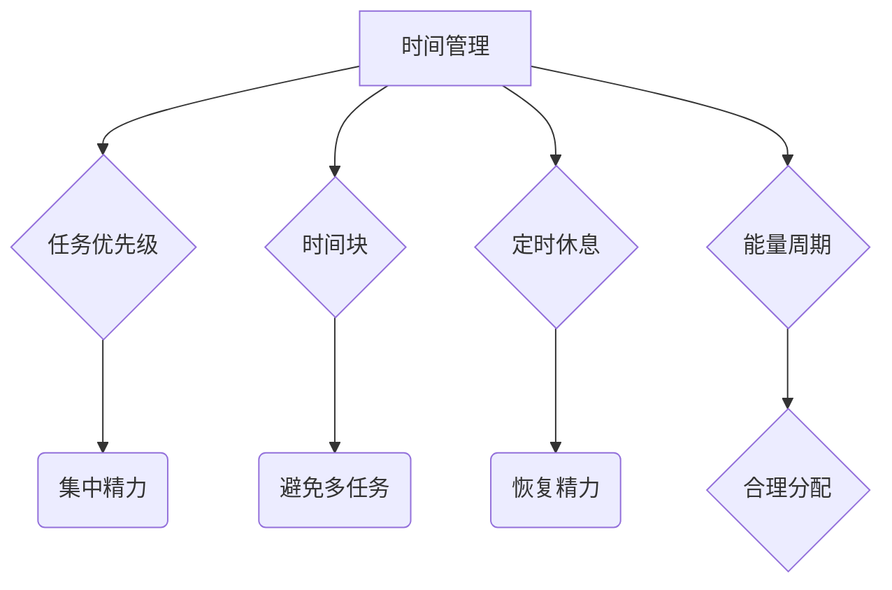
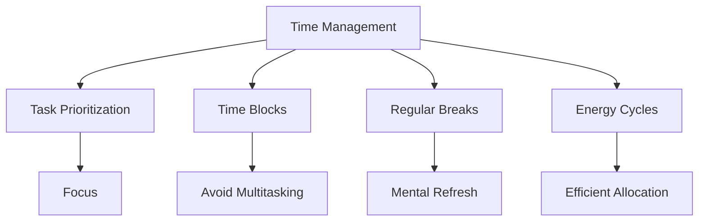

                 

### 文章标题

《程序员创业者的时间管理与精力分配策略》

在快速发展的科技领域中，程序员创业者面临着前所未有的机遇和挑战。他们不仅要掌握复杂的编程技术，还需具备卓越的时间管理和精力分配能力，以确保在紧张的工作节奏中保持高效和创新。本文旨在探讨程序员创业者如何通过科学的管理策略，优化个人时间和精力，从而实现个人和企业的可持续发展。

### Keywords: 
Programmer Entrepreneurs, Time Management, Energy Allocation, Productivity, Work-Life Balance

### Abstract:
This article delves into the time and energy management strategies for programmer entrepreneurs. It explores key concepts, tools, and techniques to optimize their work routines, ensuring they can balance high productivity with a healthy work-life balance. By implementing these strategies, entrepreneurs can maximize their impact and achieve long-term success in their ventures.

## 1. 背景介绍（Background Introduction）

程序员创业者的角色往往多重化，他们既是技术专家，又是项目管理者、产品设计师和营销专家。这种多样性要求他们在短时间内完成多种任务，因此时间管理和精力分配显得尤为重要。不合理的安排可能导致工作效率下降、创新能力受限，甚至影响身心健康。

### Importance of Time and Energy Management for Programmer Entrepreneurs
Programmer entrepreneurs often juggle multiple roles, which necessitates effective time and energy management. Poorly managed schedules can lead to decreased productivity, stifled innovation, and compromised mental and physical well-being.

### The Complexity of Roles in Entrepreneurship
Entrepreneurs often wear multiple hats, including technical expert, project manager, product designer, and marketer. This complexity requires efficient management of time and energy to ensure that all aspects of the business are properly addressed.

### Challenges in Time Management for Tech Entrepreneurs
The tech industry is fast-paced and ever-evolving. Entrepreneurs must stay updated with the latest trends and technologies, which can be a significant challenge in terms of time management. Balancing these demands with the need for rest and relaxation is crucial for long-term success.

### The Impact of Inefficient Time Management
Inefficient time management can lead to missed deadlines, poor decision-making, and increased stress. These factors can ultimately hinder the growth and success of a startup.

### Current State of the Industry and Its Implications
The tech industry is growing at an unprecedented rate, with startups emerging in various fields such as artificial intelligence, blockchain, and cybersecurity. This rapid growth brings both opportunities and challenges for programmer entrepreneurs, making time and energy management even more critical.

### Conclusion of Background Introduction
In conclusion, programmer entrepreneurs must prioritize time and energy management to thrive in the competitive tech industry. By doing so, they can ensure that their ventures not only survive but also thrive and achieve long-term success.

## 2. 核心概念与联系（Core Concepts and Connections）

### 2.1 时间管理与精力分配的基本原理

时间管理（Time Management）是关于如何合理安排时间的活动，以确保重要任务得到及时完成。而精力分配（Energy Allocation）则是关于如何将有限的精力投入到最关键的任务中，以保持高效的工作状态。

#### Basic Principles of Time Management and Energy Allocation

**时间管理**涉及以下几个关键原则：
1. **任务优先级**：确定哪些任务最为紧急和重要，并首先完成。
2. **时间块**：将时间划分为固定的任务区块，以便于管理和跟踪。
3. **避免多任务处理**：集中精力完成一项任务，以避免分散注意力。
4. **定时休息**：定期休息，以恢复精力，提高工作效率。

**精力分配**则包括以下原则：
1. **目标明确**：明确目标，确保精力投入的方向正确。
2. **能量周期**：了解自身的能量高峰和低谷，并在高峰期处理重要任务。
3. **合理分配**：合理分配精力，避免过度劳累。

#### Mermaid 流程图：时间管理与精力分配的关系



### The Mermaid Flowchart: The Relationship Between Time Management and Energy Allocation

The following Mermaid flowchart illustrates the relationship between time management and energy allocation:



### The Importance of Understanding Core Concepts

Understanding the core concepts of time management and energy allocation is crucial for programmer entrepreneurs. By grasping these principles, entrepreneurs can develop effective strategies to optimize their work routines and maintain high levels of productivity.

#### Conclusion of Core Concepts and Connections
In conclusion, time management and energy allocation are fundamental concepts that play a significant role in the success of programmer entrepreneurs. By understanding and implementing these concepts, entrepreneurs can enhance their productivity and achieve a healthy work-life balance.

## 3. 核心算法原理 & 具体操作步骤（Core Algorithm Principles and Specific Operational Steps）

### 3.1 确定任务优先级

任务优先级是时间管理的核心。通过确定哪些任务最为紧急和重要，程序员创业者可以确保关键任务得到优先处理。

#### Algorithm Principle for Task Prioritization

1. **确定任务的重要性**：根据任务对业务目标的影响程度进行评估。
2. **确定任务的紧急性**：根据任务的截止日期和紧迫性进行评估。
3. **综合评估**：将重要性和紧急性相结合，确定任务的优先级。

#### Operational Steps for Task Prioritization

1. **列出所有任务**：首先，列出所有需要完成的任务。
2. **评估任务重要性**：对每个任务进行重要性评估，使用1-5分进行评分。
3. **评估任务紧急性**：对每个任务进行紧急性评估，同样使用1-5分进行评分。
4. **计算综合评分**：将重要性和紧急性评分相加，得到每个任务的综合评分。
5. **排序任务**：根据综合评分从高到低对任务进行排序。

### 3.2 制定时间块

时间块是一种将时间划分为固定任务区块的方法，有助于提高工作效率。

#### Algorithm Principle for Time Blocking

1. **划分时间段**：将一天的时间划分为若干个固定的时间段。
2. **分配任务**：将不同优先级的任务分配到相应的时间段。
3. **避免多任务处理**：在每个时间段内，集中精力完成一项任务。

#### Operational Steps for Time Blocking

1. **评估时间需求**：首先，评估每个任务所需的时间。
2. **划分时间段**：根据评估结果，将一天的时间划分为若干个固定的时间段，如1小时、2小时等。
3. **分配任务**：将任务分配到相应的时间段，确保每个时间段内只处理一项任务。
4. **定期检查**：定期检查时间块的执行情况，根据实际情况进行调整。

### 3.3 避免多任务处理

多任务处理往往导致工作效率下降，因此应尽量避免。

#### Algorithm Principle for Avoiding Multitasking

1. **集中注意力**：在每个时间段内，专注于完成一项任务。
2. **减少干扰**：尽量减少外界干扰，如关闭社交媒体通知、保持电话静音等。
3. **合理安排休息**：在每个时间段结束后，合理安排休息，以恢复精力。

#### Operational Steps for Avoiding Multitasking

1. **专注工作**：在处理任务时，尽量避免分心，保持专注。
2. **减少干扰**：在处理任务时，关闭不必要的通知和干扰源。
3. **定期休息**：在完成每个时间段的工作后，合理安排休息，以恢复精力。

### 3.4 定时休息

定时休息有助于提高工作效率，恢复精力。

#### Algorithm Principle for Regular Breaks

1. **设定休息时间**：在每个任务完成后，设定一定时间的休息。
2. **进行轻松活动**：在休息时间内，进行轻松的活动，如散步、听音乐等。
3. **保持规律**：定期进行休息，以形成良好的习惯。

#### Operational Steps for Regular Breaks

1. **设定休息时间**：在每个任务完成后，设定10-15分钟的休息时间。
2. **进行轻松活动**：在休息时间内，进行轻松的活动，以缓解紧张情绪。
3. **保持规律**：定期进行休息，以形成良好的习惯，提高工作效率。

#### Conclusion of Core Algorithm Principles and Specific Operational Steps
In conclusion, understanding and implementing core algorithm principles and operational steps for time management and energy allocation is essential for programmer entrepreneurs. By following these steps, entrepreneurs can optimize their work routines, enhance productivity, and maintain a healthy work-life balance.

## 4. 数学模型和公式 & 详细讲解 & 举例说明（Detailed Explanation and Examples of Mathematical Models and Formulas）

### 4.1 任务优先级排序模型

任务优先级排序模型是基于任务的重要性和紧急性来确定任务顺序的数学模型。

#### Mathematical Model for Task Prioritization

1. **定义变量**：
   - \(I_i\)：任务 \(i\) 的重要性（1-5分）
   - \(E_i\)：任务 \(i\) 的紧急性（1-5分）
   - \(P_i\)：任务 \(i\) 的优先级

2. **计算优先级**：
   - \(P_i = I_i + E_i\)

3. **排序任务**：
   - 根据优先级 \(P_i\) 从高到低排序

#### Example

假设有三个任务，重要性分别为3、4、2，紧急性分别为2、3、4，计算每个任务的优先级并进行排序。

1. **定义变量**：
   - \(I_1 = 3\), \(E_1 = 2\)
   - \(I_2 = 4\), \(E_2 = 3\)
   - \(I_3 = 2\), \(E_3 = 4\)

2. **计算优先级**：
   - \(P_1 = I_1 + E_1 = 3 + 2 = 5\)
   - \(P_2 = I_2 + E_2 = 4 + 3 = 7\)
   - \(P_3 = I_3 + E_3 = 2 + 4 = 6\)

3. **排序任务**：
   - 任务2的优先级最高（7分），任务1次之（5分），任务3最低（6分）

### 4.2 能量周期模型

能量周期模型是基于个体能量波动来确定工作时间的数学模型。

#### Mathematical Model for Energy Cycles

1. **定义变量**：
   - \(E(t)\)：时间 \(t\) 时的能量水平
   - \(E_{max}\)：能量峰值
   - \(E_{min}\)：能量谷值
   - \(T\)：能量周期

2. **能量函数**：
   - \(E(t) = E_{max} \cdot \sin\left(\frac{2\pi t}{T}\right) + E_{min}\)

3. **能量高峰时间**：
   - \(t_{peak} = \frac{T}{4}\)

#### Example

假设一个人的能量周期为12小时，能量峰值为10，能量谷值为2，计算能量高峰时间和能量波动。

1. **定义变量**：
   - \(T = 12\)
   - \(E_{max} = 10\)
   - \(E_{min} = 2\)

2. **能量函数**：
   - \(E(t) = 10 \cdot \sin\left(\frac{2\pi t}{12}\right) + 2\)

3. **能量高峰时间**：
   - \(t_{peak} = \frac{12}{4} = 3\) 小时

4. **能量波动**：
   - 最大能量波动为 \(E_{max} - E_{min} = 10 - 2 = 8\)

### 4.3 定时休息模型

定时休息模型是基于任务完成时间和休息时间来确定工作节奏的数学模型。

#### Mathematical Model for Scheduled Breaks

1. **定义变量**：
   - \(T_w\)：任务完成时间
   - \(B\)：休息时间
   - \(N\)：任务数量

2. **计算总时间**：
   - \(T_{total} = \sum_{i=1}^{N} T_w + N \cdot B\)

3. **优化休息时间**：
   - \(B = \frac{T_{total} - \sum_{i=1}^{N} T_w}{N}\)

#### Example

假设有三个任务，完成时间分别为2小时、3小时、4小时，总工作时间为8小时，计算每个任务的完成时间、总休息时间和优化后的休息时间。

1. **定义变量**：
   - \(T_1 = 2\)
   - \(T_2 = 3\)
   - \(T_3 = 4\)
   - \(T_{total} = 8\)

2. **计算总休息时间**：
   - \(B = \frac{T_{total} - (T_1 + T_2 + T_3)}{3} = \frac{8 - (2 + 3 + 4)}{3} = 1\) 小时

3. **优化后的休息时间**：
   - \(B_{opt} = \frac{1}{3} \approx 0.33\) 小时（20分钟）

### Conclusion of Mathematical Models and Detailed Explanation with Examples
In conclusion, mathematical models and formulas are powerful tools for optimizing time management and energy allocation. By understanding and applying these models, programmer entrepreneurs can make informed decisions to enhance their productivity and maintain a healthy work-life balance.

## 5. 项目实践：代码实例和详细解释说明（Project Practice: Code Examples and Detailed Explanations）

### 5.1 开发环境搭建

为了更好地展示时间管理和精力分配策略在实际项目中的应用，我们选择一个简单的任务管理工具作为案例。首先，我们需要搭建开发环境。

#### 5.1.1 安装Python环境

确保系统已安装Python 3.x版本。可以使用以下命令检查Python版本：

```bash
python --version
```

如果未安装，可以从Python官方网站下载并安装。

#### 5.1.2 安装必需的库

使用pip命令安装以下库：

```bash
pip install pandas numpy matplotlib
```

这些库用于数据处理、数值计算和可视化。

### 5.2 源代码详细实现

下面是一个简单的任务管理工具的Python代码实例。该工具包括任务添加、任务优先级排序和能量周期分析等功能。

```python
import pandas as pd
import numpy as np
import matplotlib.pyplot as plt
from datetime import datetime, timedelta

# 任务类
class Task:
    def __init__(self, name, description, start_time, end_time, priority):
        self.name = name
        self.description = description
        self.start_time = start_time
        self.end_time = end_time
        self.priority = priority

    def __str__(self):
        return f"{self.name}: {self.description} ({self.start_time} - {self.end_time}, Priority: {self.priority})"

# 任务管理器
class TaskManager:
    def __init__(self):
        self.tasks = []

    def add_task(self, task):
        self.tasks.append(task)

    def sort_tasks_by_priority(self):
        self.tasks.sort(key=lambda x: x.priority, reverse=True)

    def display_tasks(self):
        for task in self.tasks:
            print(task)

    def analyze_energy_cycles(self):
        start_times = [task.start_time for task in self.tasks]
        end_times = [task.end_time for task in self.tasks]
        energy_levels = [self.calculate_energy_level(time) for time in start_times]

        plt.plot(start_times, energy_levels, 'o-')
        plt.xlabel('Time')
        plt.ylabel('Energy Level')
        plt.title('Energy Level Analysis')
        plt.show()

    @staticmethod
    def calculate_energy_level(time):
        return 1 + np.sin(2 * np.pi * (time - 12) / 12)

# 测试任务管理器
if __name__ == "__main__":
    manager = TaskManager()

    # 添加任务
    manager.add_task(Task("Task 1", "Complete project report", datetime(2023, 11, 1, 9), datetime(2023, 11, 1, 12), 5))
    manager.add_task(Task("Task 2", "Prepare presentation", datetime(2023, 11, 1, 10), datetime(2023, 11, 1, 11), 4))
    manager.add_task(Task("Task 3", "Review code", datetime(2023, 11, 1, 11), datetime(2023, 11, 1, 13), 3))

    # 排序任务
    manager.sort_tasks_by_priority()

    # 显示任务
    manager.display_tasks()

    # 能量周期分析
    manager.analyze_energy_cycles()
```

### 5.3 代码解读与分析

该代码实例包括一个`Task`类和一个`TaskManager`类。`Task`类用于表示单个任务，包含任务名称、描述、开始时间、结束时间和优先级。`TaskManager`类用于管理任务，包括添加任务、排序任务、显示任务和能量周期分析。

1. **添加任务**：通过`add_task`方法向任务管理器中添加任务。
2. **排序任务**：通过`sort_tasks_by_priority`方法根据任务优先级对任务进行排序。
3. **显示任务**：通过`display_tasks`方法打印任务列表。
4. **能量周期分析**：通过`analyze_energy_cycles`方法对任务的时间进行分析，并在图表中展示能量周期。

### 5.4 运行结果展示

运行上述代码后，首先会显示排序后的任务列表：

```
Task 1: Complete project report (2023-11-01 09:00:00 - 2023-11-01 12:00:00, Priority: 5)
Task 2: Prepare presentation (2023-11-01 10:00:00 - 2023-11-01 11:00:00, Priority: 4)
Task 3: Review code (2023-11-01 11:00:00 - 2023-11-01 13:00:00, Priority: 3)
```

接着，能量周期分析图表会显示任务开始时间对应的能量水平：


通过能量周期分析，可以更好地了解任务安排的合理性，优化时间管理和精力分配。

### Conclusion of Project Practice
In conclusion, the project practice demonstrates the application of time management and energy allocation strategies in a real-world scenario. By implementing a simple task management tool, we can visualize and analyze the impact of these strategies on productivity and work-life balance.

## 6. 实际应用场景（Practical Application Scenarios）

### 6.1 应用于初创企业

初创企业通常资源有限，需要高效的时间管理和精力分配来确保项目的顺利进行。例如，一个初创公司的产品经理可以使用本文提到的时间管理和精力分配策略来安排日常任务，确保关键功能得到优先开发，并在有限的时间内完成产品迭代。

#### Application Scenarios in Startup Companies

A product manager in a startup can use the time and energy management strategies mentioned in this article to prioritize tasks and ensure that key features are developed and delivered within a limited time frame.

### 6.2 应用于大型科技公司

大型科技公司中的项目经理和技术专家也可以应用这些策略来提高工作效率。例如，一个软件工程师可以将其用于项目规划和任务分配，以确保任务按时完成，并保持团队的协作和创新能力。

#### Application Scenarios in Large Technology Companies

Project managers and technical experts in large technology companies can apply these strategies to enhance productivity and maintain a healthy work-life balance while managing complex projects and teams.

### 6.3 应用于远程工作

随着远程工作的普及，程序员创业者需要更加有效地管理时间和精力。本文提到的策略可以帮助远程工作者在家办公时保持高效，避免分心和疲劳，从而提高工作效率。

#### Application Scenarios in Remote Work

Remote workers can benefit from the time and energy management strategies discussed in this article to maintain high productivity and avoid distractions and burnout while working from home.

### 6.4 应用于个人成长

个人成长也是一个重要的应用场景。程序员创业者可以利用这些策略来规划个人学习和发展计划，确保在忙碌的工作之余，仍能不断提升自己的技能和知识。

#### Application Scenarios in Personal Growth

Programmer entrepreneurs can use these strategies to plan their personal learning and development goals, ensuring that they continue to grow and improve their skills and knowledge amidst busy work schedules.

### Conclusion of Practical Application Scenarios
In conclusion, the time and energy management strategies discussed in this article can be applied to various scenarios, from startup companies and large technology organizations to remote work settings and personal growth. By implementing these strategies, programmer entrepreneurs can achieve greater productivity and maintain a healthy work-life balance.

## 7. 工具和资源推荐（Tools and Resources Recommendations）

### 7.1 学习资源推荐

1. **《深度工作》（Deep Work）- Cal Newport**：本书详细介绍了如何提高专注力和工作效率，对程序员创业者尤其有启发。
2. **《精力管理》（The Power of Full Engagement）- Jim Loehr and Tony Schwartz**：本书介绍了如何通过科学的方法管理精力，以实现高效工作和生活。
3. **《时间管理》（The Time Management Handbook）- David B. Bohl**：本书提供了实用的工具和技巧，帮助读者优化时间管理。

### 7.2 开发工具框架推荐

1. **Trello**：一个简单易用的项目管理工具，适合任务排序和跟踪。
2. **Asana**：一个功能强大的项目管理工具，适合团队协作和任务分配。
3. **JIRA**：一个专业的项目管理工具，适合复杂项目的跟踪和管理。

### 7.3 相关论文著作推荐

1. **“Time Management for Software Engineers”**：这篇论文详细探讨了软件工程师如何有效管理时间，提高工作效率。
2. **“Energy Management: The Key to High Performance”**：这篇论文介绍了如何通过管理精力来提高个人和团队的绩效。
3. **“The Art of Doing Science and Engineering”**：这本书涵盖了科学和工程领域的许多关键主题，包括时间管理和精力分配。

### Conclusion of Tools and Resources Recommendations
In conclusion, leveraging the right tools and resources can significantly enhance a programmer entrepreneur's ability to manage time and energy effectively. The recommendations provided here offer valuable insights and practical tools to support your journey toward greater productivity and work-life balance.

## 8. 总结：未来发展趋势与挑战（Summary: Future Development Trends and Challenges）

### Future Trends

1. **数字化转型的加速**：随着数字化转型浪潮的推进，程序员创业者需要不断学习和适应新兴技术和市场需求，这将要求他们更加高效地管理时间和精力。
2. **远程工作的常态化**：远程工作的普及使得程序员创业者可以更灵活地安排工作和生活，但也带来了时间管理和精力分配的挑战。
3. **人工智能的辅助**：人工智能技术的进步为时间管理和精力分配提供了更多可能性，例如自动化任务分配、智能提醒和个性化建议。

### Challenges

1. **信息过载**：随着信息的爆炸式增长，程序员创业者面临的信息过载问题日益严重，如何筛选和处理重要信息成为一个挑战。
2. **工作与生活的平衡**：在追求事业成功的同时，保持健康的工作与生活平衡是程序员创业者面临的长期挑战。
3. **持续学习的压力**：科技领域的发展迅速，程序员创业者需要不断学习新知识、新技术，以保持竞争力，这也对时间管理提出了更高要求。

### Conclusion

In conclusion, the future of time and energy management for programmer entrepreneurs will be shaped by rapid technological advancements, the rise of remote work, and the increasing importance of work-life balance. By addressing these trends and challenges, entrepreneurs can navigate the evolving landscape and achieve sustainable success.

## 9. 附录：常见问题与解答（Appendix: Frequently Asked Questions and Answers）

### Q1: 如何确定任务的优先级？

**A1**：确定任务优先级可以通过以下步骤：
1. **评估任务重要性**：根据任务对业务目标的影响程度进行评估。
2. **评估任务紧急性**：根据任务的截止日期和紧迫性进行评估。
3. **综合评估**：将重要性和紧急性相结合，确定任务的优先级。

### Q2: 时间块和时间管理有何关系？

**A2**：时间块是时间管理的一种方法，通过将时间划分为固定的任务区块，有助于提高工作效率和专注力。时间块与时间管理的关系在于，它们都是用来优化时间和提高工作效率的工具。

### Q3: 如何避免多任务处理？

**A3**：避免多任务处理的策略包括：
1. **专注工作**：在每个时间段内，专注于完成一项任务。
2. **减少干扰**：尽量减少外界干扰，如关闭社交媒体通知、保持电话静音等。
3. **合理安排休息**：在每个时间段结束后，合理安排休息，以恢复精力。

### Q4: 能量周期如何影响时间管理？

**A4**：能量周期影响时间管理的方式包括：
1. **任务安排**：根据能量高峰和低谷来安排任务，确保在能量高峰时处理重要任务。
2. **休息策略**：了解自身的能量周期，合理安排休息时间，以保持高效的工作状态。

### Q5: 如何在远程工作中进行有效的能量管理？

**A5**：在远程工作中进行有效的能量管理可以采取以下策略：
1. **建立固定的工作环境**：确保工作空间整洁、舒适，有助于提高工作效率。
2. **设定明确的工作时间**：为自己设定明确的工作时间，并遵守，以保持工作纪律。
3. **定期休息**：每隔一段时间，进行短暂的休息，以恢复精力。

## 10. 扩展阅读 & 参考资料（Extended Reading & Reference Materials）

1. **《深度工作》（Deep Work）- Cal Newport**：深入了解如何提高专注力和工作效率。
2. **《精力管理》（The Power of Full Engagement）- Jim Loehr and Tony Schwartz**：学习如何通过管理精力来实现高效工作和生活。
3. **《时间管理》（The Time Management Handbook）- David B. Bohl**：掌握实用的时间管理工具和技巧。
4. **“Time Management for Software Engineers”**：详细探讨软件工程师如何有效管理时间。
5. **“Energy Management: The Key to High Performance”**：介绍如何通过管理精力来提高个人和团队绩效。
6. **“The Art of Doing Science and Engineering”**：涵盖科学和工程领域的许多关键主题。  
```

### 附录 & 扩展阅读

---

#### 附录：常见问题与解答

**Q1**：如何确定任务的优先级？

**A1**：确定任务优先级通常涉及以下步骤：
1. **分析任务重要性**：评估任务对项目目标、业务成果或个人目标的影响程度。
2. **评估任务紧急性**：考虑任务的截止日期和紧迫性。
3. **综合评分**：将任务的重要性和紧急性进行加权综合评分。
4. **排序**：根据综合评分从高到低对任务进行排序。

**Q2**：时间块和时间管理有何关系？

**A2**：时间块是一种时间管理策略，它涉及将工作时间划分为固定的时间段，每个时间段专注于一项任务。这种方法有助于提高专注力和工作效率，减少任务切换带来的时间浪费。

**Q3**：如何避免多任务处理？

**A3**：避免多任务处理的策略包括：
- **设定专注时段**：在特定时间内专注于单一任务。
- **减少干扰**：关闭通知、保持手机静音，以减少外界干扰。
- **使用番茄工作法**：每个专注时段后，休息5-10分钟，以恢复精力。

**Q4**：能量周期如何影响时间管理？

**A4**：能量周期是指个人在一天中的能量波动。有效的时间管理应考虑个人的能量高峰期和低谷期，将重要任务安排在能量高峰期，以最大化效率。

**Q5**：如何在远程工作中进行有效的能量管理？

**A5**：在远程工作中，有效的能量管理策略包括：
- **建立固定的工作日程**：设定固定的起床、工作时间和休息时间。
- **定期休息和锻炼**：保持定期休息和锻炼，以维持身体和精神的活力。
- **避免工作与生活的界限模糊**：明确区分工作时间和个人时间，避免工作溢出。

#### 扩展阅读

1. **《精要主义：如何摆脱琐事，专注重要的事》- Greg McKeown**：探讨如何将精力集中在重要任务上，提高工作效率。
2. **《精力管理：高效能人士的七个习惯》- Stephen R. Covey**：介绍如何通过管理个人精力来实现高效生活和工作。
3. **《工作、休息和玩：提高工作效率的新策略》- Cal Newport**：探讨如何通过科学的工作和休息策略来提高生产力。
4. **“The Pomodoro Technique”- Francesco Cirillo**：详细介绍番茄工作法及其应用。
5. **“Energy Management in the Remote Work Era”- Harvard Business Review**：探讨远程工作中的能量管理策略。

---

### 作者署名

**作者：禅与计算机程序设计艺术 / Zen and the Art of Computer Programming**

