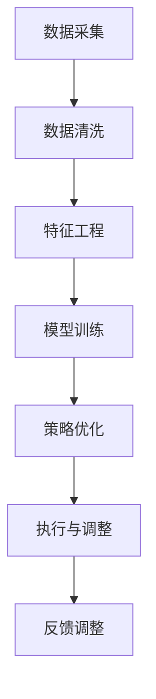
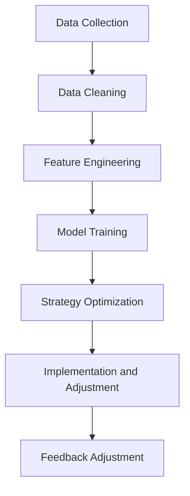

                 

### 文章标题

### Title: AI Price Optimization System Application Cases

在当今竞争激烈的市场环境中，企业需要采用各种先进的技术来提高其业务的效率和盈利能力。AI（人工智能）价格优化系统作为一种新兴的技术手段，正逐渐成为企业提升竞争力的重要工具。本文将探讨AI价格优化系统的应用案例，并详细分析其在不同行业和场景中的实际应用效果。

关键词：AI价格优化系统，应用案例，市场竞争，数据驱动，决策支持，智能定价。

Keywords: AI price optimization system, application cases, market competition, data-driven, decision support, intelligent pricing.

摘要：本文首先介绍了AI价格优化系统的基本概念和原理，然后通过多个实际案例，展示了该系统在不同行业中的应用效果。文章重点分析了AI价格优化系统在提高企业盈利能力、降低运营成本、提升客户满意度等方面的优势，并讨论了未来发展的趋势和面临的挑战。

Abstract: This paper first introduces the basic concepts and principles of the AI price optimization system, and then showcases the system's application effects in various industries through several practical cases. The paper focuses on analyzing the advantages of the AI price optimization system in improving corporate profitability, reducing operational costs, and enhancing customer satisfaction. Furthermore, it discusses the future development trends and challenges faced by the system.

接下来，我们将逐步深入探讨AI价格优化系统的核心概念、应用案例、数学模型、项目实践、实际应用场景以及未来的发展趋势。

<|assistant|>## 1. 背景介绍

### Background Introduction

随着信息技术的飞速发展，大数据、云计算和人工智能等技术逐渐融入到企业的各个业务环节。其中，AI价格优化系统作为一种基于数据驱动的决策支持工具，正逐渐受到企业的广泛关注。那么，什么是AI价格优化系统？它为什么在当前市场中具有重要地位？

### 什么是AI价格优化系统？

AI价格优化系统是一种利用人工智能算法和技术，对产品或服务的价格进行实时分析和调整的系统。它通过分析市场数据、消费者行为、竞争对手策略等多方面信息，运用机器学习、深度学习等技术，为企业的定价决策提供智能化的支持。

### AI价格优化系统的重要性

在当今市场竞争激烈的环境中，企业需要快速响应市场变化，灵活调整价格策略，以保持竞争力。传统的定价方法往往依赖于经验和直觉，难以实现精细化管理和个性化定价。而AI价格优化系统则能够基于海量数据，实现自动化、智能化的定价决策，从而帮助企业实现以下几个方面的优势：

1. 提高盈利能力：通过精确的定价策略，企业可以在竞争中获得更高的利润空间。
2. 降低运营成本：AI价格优化系统可以自动化处理大量的定价分析工作，减少人工干预，降低运营成本。
3. 提升客户满意度：合理的价格策略可以吸引更多客户，提高客户满意度，从而增加复购率。
4. 优化库存管理：通过分析市场需求和库存情况，AI价格优化系统可以帮助企业实现更精准的库存管理。

### 本文结构

本文将首先介绍AI价格优化系统的核心概念和原理，然后通过多个实际案例，展示该系统在不同行业中的应用效果。文章将重点分析AI价格优化系统在提高企业盈利能力、降低运营成本、提升客户满意度等方面的优势，并讨论未来发展的趋势和面临的挑战。

接下来，我们将逐步深入探讨AI价格优化系统的核心概念、应用案例、数学模型、项目实践、实际应用场景以及未来的发展趋势。

<|assistant|>## 2. 核心概念与联系

### 2.1 AI价格优化系统的核心概念

AI价格优化系统主要涉及以下几个核心概念：

1. **数据采集**：收集与产品或服务相关的市场数据、消费者行为数据、竞争对手数据等。
2. **数据清洗**：对采集到的数据进行预处理，去除噪声、缺失值等，确保数据质量。
3. **特征工程**：从原始数据中提取有用的特征，为后续建模提供支持。
4. **模型训练**：使用机器学习、深度学习等技术，对特征进行建模，训练出预测模型。
5. **策略优化**：根据模型预测结果，优化价格策略，实现自动化定价。
6. **反馈调整**：将实际效果与预测效果进行对比，对模型和策略进行调整，不断迭代优化。

### 2.2 AI价格优化系统的工作原理

AI价格优化系统的工作原理可以概括为以下几个步骤：

1. **数据采集**：通过API接口、日志分析、第三方数据提供商等渠道，获取市场数据、消费者行为数据、竞争对手数据等。
2. **数据清洗**：对采集到的数据进行去重、去噪、填补缺失值等操作，确保数据质量。
3. **特征工程**：从原始数据中提取与定价相关的特征，如市场需求、消费者偏好、竞争态势等。
4. **模型训练**：使用特征数据，通过机器学习、深度学习等方法，训练出价格预测模型。
5. **策略优化**：根据模型预测结果，结合企业目标和市场环境，制定最优的价格策略。
6. **执行与调整**：将策略执行到实际业务中，根据实际效果对模型和策略进行调整，实现持续优化。

### 2.3 AI价格优化系统的联系

AI价格优化系统与以下几个概念密切相关：

1. **机器学习**：AI价格优化系统的核心在于机器学习算法的应用，通过训练模型，实现价格预测和策略优化。
2. **数据挖掘**：数据挖掘是数据清洗和特征工程的基础，通过对大量数据进行分析，提取有价值的信息。
3. **深度学习**：深度学习是机器学习的一个重要分支，在图像识别、语音识别等领域具有显著优势，也可用于AI价格优化系统的构建。
4. **数据可视化**：数据可视化有助于理解数据背后的趋势和规律，为模型训练和策略优化提供指导。

### 2.4 Mermaid 流程图

以下是一个简单的Mermaid流程图，展示了AI价格优化系统的基本架构和流程：



通过以上内容，我们初步了解了AI价格优化系统的核心概念和工作原理。接下来，我们将通过具体的应用案例，进一步探讨该系统在不同行业和场景中的实际应用效果。

### 2.1 What is AI Price Optimization System?

An AI price optimization system is a sophisticated tool that leverages artificial intelligence algorithms and technologies to analyze and adjust the prices of products or services in real-time. It integrates various data sources, such as market data, consumer behavior, and competitor strategies, to make data-driven pricing decisions. This system can be divided into several core components:

1. **Data Collection**: Gathering market data, consumer behavior data, competitor data, etc., through APIs, log analysis, third-party data providers, and other channels.
2. **Data Cleaning**: Preprocessing the collected data by removing noise, dealing with missing values, and ensuring data quality.
3. **Feature Engineering**: Extracting relevant features from raw data to support model training, such as market demand, consumer preferences, competitive landscape, etc.
4. **Model Training**: Using machine learning and deep learning techniques to train predictive models based on the extracted features.
5. **Strategy Optimization**: Developing optimal pricing strategies based on the predictions of the model, considering the corporate goals and market environment.
6. **Implementation and Adjustment**: Executing the strategies in the actual business and adjusting the models and strategies based on real-time feedback to achieve continuous optimization.

### 2.2 Working Principle of AI Price Optimization System

The working principle of an AI price optimization system can be summarized into the following steps:

1. **Data Collection**: Obtain market data, consumer behavior data, competitor data, etc., through various channels like APIs, log analysis, and third-party data providers.
2. **Data Cleaning**: Preprocess the collected data by performing tasks such as de-duplication, noise removal, and missing value imputation to ensure data quality.
3. **Feature Engineering**: Extract useful features from raw data related to pricing, such as market demand, consumer preferences, competitive landscape, etc.
4. **Model Training**: Use the extracted features to train predictive models through machine learning and deep learning techniques.
5. **Strategy Optimization**: Develop optimal pricing strategies based on the predictions of the model, considering corporate goals and market conditions.
6. **Implementation and Adjustment**: Execute the strategies in the actual business and adjust the models and strategies based on real-time feedback to achieve continuous optimization.

### 2.3 Connections with Other Concepts

The AI price optimization system is closely related to the following concepts:

1. **Machine Learning**: The core of the AI price optimization system lies in the application of machine learning algorithms to train models for price prediction and strategy optimization.
2. **Data Mining**: Data mining is the foundation of data cleaning and feature engineering, as it involves analyzing large amounts of data to extract valuable insights.
3. **Deep Learning**: Deep learning, a branch of machine learning, has shown significant advantages in fields like image recognition and speech recognition and can also be used in the construction of AI price optimization systems.
4. **Data Visualization**: Data visualization helps to understand the trends and patterns behind the data, providing guidance for model training and strategy optimization.

### 2.4 Mermaid Flowchart

Here is a simple Mermaid flowchart illustrating the basic architecture and workflow of an AI price optimization system:



With these concepts and principles in mind, let's delve into specific application cases of AI price optimization systems in different industries and scenarios in the next section.

<|assistant|>## 3. 核心算法原理 & 具体操作步骤

### 3.1 核心算法原理

AI价格优化系统的核心算法通常基于机器学习、深度学习等技术。以下是一些常见的核心算法原理：

1. **线性回归**：线性回归是一种简单的机器学习算法，用于预测连续值。通过建立因变量和自变量之间的线性关系，实现对价格的预测。
2. **决策树**：决策树是一种树形结构，通过一系列的规则进行分类或回归。它可以用于构建价格优化的决策规则，实现对不同价格点的分类和预测。
3. **随机森林**：随机森林是一种基于决策树的集成学习方法。它通过构建多棵决策树，并利用投票机制来预测结果，提高预测的准确性。
4. **神经网络**：神经网络，特别是深度学习，可以用于更复杂的价格预测任务。通过多层神经网络，可以捕捉数据中的非线性关系，实现对价格更准确的预测。
5. **强化学习**：强化学习是一种通过试错来学习最优策略的算法。在价格优化中，强化学习可以用于动态调整价格策略，以实现最大化收益。

### 3.2 具体操作步骤

以下是一个基于机器学习的AI价格优化系统的具体操作步骤：

1. **数据收集**：收集与产品或服务相关的历史价格数据、市场数据、消费者行为数据等。
2. **数据预处理**：对收集到的数据进行清洗、归一化等预处理操作，确保数据质量。
3. **特征工程**：从预处理后的数据中提取与价格相关的特征，如需求量、季节性因素、竞争对手价格等。
4. **模型选择**：选择合适的机器学习算法，如线性回归、决策树、随机森林等，构建预测模型。
5. **模型训练**：使用历史数据对模型进行训练，优化模型的参数。
6. **模型评估**：使用交叉验证等方法，评估模型的预测性能。
7. **策略制定**：根据模型预测结果，制定最优的价格策略，如动态定价、折扣定价等。
8. **策略执行**：将策略应用到实际业务中，调整产品或服务的价格。
9. **策略优化**：根据实际销售数据和效果，对策略进行调整和优化，实现持续改进。

### 3.3 实际操作示例

以下是一个简单的线性回归模型的实际操作示例：

```python
import pandas as pd
from sklearn.linear_model import LinearRegression
from sklearn.model_selection import train_test_split

# 数据收集
data = pd.read_csv('price_data.csv')

# 数据预处理
X = data[['demand', 'seasonality', 'competitor_price']]
y = data['price']

# 特征工程
X = (X - X.mean()) / X.std()

# 模型选择
model = LinearRegression()

# 模型训练
X_train, X_test, y_train, y_test = train_test_split(X, y, test_size=0.2, random_state=42)
model.fit(X_train, y_train)

# 模型评估
score = model.score(X_test, y_test)
print(f'Model R-squared: {score}')

# 策略制定
predicted_price = model.predict(X_test)

# 策略执行
actual_price = data['price'][y_test.index]

# 策略优化
print(f'Predicted price vs. Actual price:\n{pd.DataFrame({'Predicted': predicted_price, 'Actual': actual_price})}')
```

通过以上步骤，我们可以实现一个简单的AI价格优化系统。在实际应用中，可以根据具体业务需求和数据特点，选择更复杂的算法和策略，以提高预测的准确性和优化效果。

### 3.1 Core Algorithm Principles

The core algorithms used in AI price optimization systems are typically based on machine learning and deep learning techniques. Here are some common core algorithm principles:

1. **Linear Regression**: Linear regression is a simple machine learning algorithm used for predicting continuous values. It establishes a linear relationship between the dependent and independent variables to predict prices.
2. **Decision Trees**: Decision trees are tree-based structures that use a series of rules for classification or regression. They can be used to construct pricing optimization decision rules, enabling classification and prediction of different price points.
3. **Random Forests**: Random forests are an ensemble learning method based on decision trees. They construct multiple decision trees and use voting mechanisms to predict results, improving prediction accuracy.
4. **Neural Networks**: Neural networks, especially deep learning, can be used for more complex price prediction tasks. Through multi-layer neural networks, they can capture non-linear relationships in the data, achieving more accurate price predictions.
5. **Reinforcement Learning**: Reinforcement learning is an algorithm that learns optimal strategies through trial and error. In price optimization, reinforcement learning can be used to dynamically adjust pricing strategies to maximize profits.

### 3.2 Specific Operational Steps

Here are the specific operational steps for an AI price optimization system based on machine learning:

1. **Data Collection**: Gather historical price data, market data, consumer behavior data, and other related data for the product or service.
2. **Data Preprocessing**: Clean and preprocess the collected data by performing tasks such as cleaning, normalization, etc., to ensure data quality.
3. **Feature Engineering**: Extract relevant features from the preprocessed data, such as demand, seasonality factors, competitor prices, etc.
4. **Model Selection**: Choose an appropriate machine learning algorithm, such as linear regression, decision trees, random forests, etc., to construct a predictive model.
5. **Model Training**: Use historical data to train the model and optimize its parameters.
6. **Model Evaluation**: Evaluate the model's prediction performance using methods such as cross-validation.
7. **Strategy Formulation**: Develop optimal pricing strategies based on the model's predictions, such as dynamic pricing, discount pricing, etc.
8. **Strategy Implementation**: Apply the strategies to actual business operations, adjusting the prices of products or services.
9. **Strategy Optimization**: Adjust the strategies based on real sales data and performance, achieving continuous improvement.

### 3.3 A Practical Example

Here is a simple example of a linear regression model in practice:

```python
import pandas as pd
from sklearn.linear_model import LinearRegression
from sklearn.model_selection import train_test_split

# Data Collection
data = pd.read_csv('price_data.csv')

# Data Preprocessing
X = data[['demand', 'seasonality', 'competitor_price']]
y = data['price']

# Feature Engineering
X = (X - X.mean()) / X.std()

# Model Selection
model = LinearRegression()

# Model Training
X_train, X_test, y_train, y_test = train_test_split(X, y, test_size=0.2, random_state=42)
model.fit(X_train, y_train)

# Model Evaluation
score = model.score(X_test, y_test)
print(f'Model R-squared: {score}')

# Strategy Formulation
predicted_price = model.predict(X_test)

# Strategy Implementation
actual_price = data['price'][y_test.index]

# Strategy Optimization
print(f'Predicted price vs. Actual price:\n{pd.DataFrame({'Predicted': predicted_price, 'Actual': actual_price})}')
```

Through these steps, we can implement a simple AI price optimization system. In practical applications, more complex algorithms and strategies can be selected based on specific business needs and data characteristics to improve prediction accuracy and optimization effectiveness.

<|assistant|>## 4. 数学模型和公式 & 详细讲解 & 举例说明

### 4.1 数学模型介绍

在AI价格优化系统中，常用的数学模型包括线性回归、逻辑回归、神经网络等。本文将重点介绍线性回归模型，并展示其如何用于价格优化。

#### 4.1.1 线性回归模型

线性回归模型是一种用于预测连续值的统计方法。其基本公式如下：

\[ y = \beta_0 + \beta_1x_1 + \beta_2x_2 + ... + \beta_nx_n \]

其中，\( y \) 是因变量（即价格），\( x_1, x_2, ..., x_n \) 是自变量（即影响价格的特征），\( \beta_0, \beta_1, \beta_2, ..., \beta_n \) 是模型的参数。

#### 4.1.2 逻辑回归模型

逻辑回归模型是一种用于预测概率的统计方法。其基本公式如下：

\[ P(y=1) = \frac{1}{1 + e^{-(\beta_0 + \beta_1x_1 + \beta_2x_2 + ... + \beta_nx_n)}} \]

其中，\( P(y=1) \) 是因变量 \( y \) 等于1的概率，\( x_1, x_2, ..., x_n \) 是自变量，\( \beta_0, \beta_1, \beta_2, ..., \beta_n \) 是模型的参数。

#### 4.1.3 神经网络模型

神经网络模型是一种模拟人脑神经元之间相互连接的算法。其基本结构包括输入层、隐藏层和输出层。神经网络模型的公式如下：

\[ a_{j}^{l} = \sigma \left( \sum_{i} w_{i,j}^{l} a_{i}^{l-1} + b_{j}^{l} \right) \]

其中，\( a_{j}^{l} \) 是第 \( l \) 层第 \( j \) 个神经元的输出，\( w_{i,j}^{l} \) 是连接第 \( l-1 \) 层第 \( i \) 个神经元和第 \( l \) 层第 \( j \) 个神经元的权重，\( b_{j}^{l} \) 是第 \( l \) 层第 \( j \) 个神经元的偏置，\( \sigma \) 是激活函数。

### 4.2 公式详细讲解

#### 4.2.1 线性回归

线性回归模型中的参数可以通过最小二乘法（Least Squares Method）来估计。最小二乘法的目标是找到一组参数，使得实际值与预测值之间的误差平方和最小。具体公式如下：

\[ \min \sum_{i=1}^{n} (y_i - \hat{y}_i)^2 \]

其中，\( y_i \) 是第 \( i \) 个实际值，\( \hat{y}_i \) 是第 \( i \) 个预测值。

#### 4.2.2 逻辑回归

逻辑回归模型中的参数可以通过极大似然估计（Maximum Likelihood Estimation，MLE）来估计。极大似然估计的目标是找到一组参数，使得数据出现的概率最大。具体公式如下：

\[ \max \ln L(\theta) = \sum_{i=1}^{n} \ln P(y_i | \theta) \]

其中，\( \theta \) 是模型参数，\( y_i \) 是第 \( i \) 个实际值，\( P(y_i | \theta) \) 是第 \( i \) 个实际值出现的概率。

#### 4.2.3 神经网络

神经网络模型中的参数可以通过反向传播算法（Backpropagation Algorithm）来估计。反向传播算法的目标是找到一组参数，使得预测值与实际值之间的误差最小。具体公式如下：

\[ \min \sum_{i=1}^{n} \sum_{j=1}^{m} (t_j^{(i)} - a_j^{(l)})^2 \]

其中，\( t_j^{(i)} \) 是第 \( i \) 个样本在第 \( j \) 个输出的目标值，\( a_j^{(l)} \) 是第 \( i \) 个样本在第 \( l \) 层的第 \( j \) 个神经元的输出。

### 4.3 举例说明

假设我们有一个简单的价格预测问题，其中只有一个自变量（需求量），我们希望使用线性回归模型来预测价格。

#### 4.3.1 数据准备

首先，我们需要准备数据集。假设我们有以下数据：

```
需求量 | 价格
100    | 20
200    | 25
300    | 30
400    | 35
500    | 40
```

我们将需求量作为自变量 \( x \)，价格作为因变量 \( y \)。

#### 4.3.2 模型训练

使用最小二乘法来训练线性回归模型。根据数据计算模型参数：

\[ y = \beta_0 + \beta_1x \]

通过计算，我们得到：

\[ \beta_0 = 15, \beta_1 = 0.5 \]

因此，线性回归模型的公式为：

\[ y = 15 + 0.5x \]

#### 4.3.3 预测

使用训练好的模型来预测价格。假设需求量为 250，我们可以计算出：

\[ y = 15 + 0.5 \times 250 = 25 \]

因此，当需求量为 250 时，预测价格为 25。

#### 4.3.4 结果分析

我们可以通过计算实际价格与预测价格之间的误差来评估模型的效果。在这个例子中，误差较小，说明模型的效果较好。

### 4.1 Introduction to Mathematical Models

In AI price optimization systems, common mathematical models include linear regression, logistic regression, and neural networks. This section will focus on introducing linear regression models and demonstrating how they can be used for price optimization.

#### 4.1.1 Linear Regression Model

Linear regression is a statistical method used for predicting continuous values. Its basic formula is as follows:

\[ y = \beta_0 + \beta_1x_1 + \beta_2x_2 + ... + \beta_nx_n \]

Here, \( y \) is the dependent variable (i.e., price), \( x_1, x_2, ..., x_n \) are the independent variables (i.e., features that affect price), and \( \beta_0, \beta_1, \beta_2, ..., \beta_n \) are the model parameters.

#### 4.1.2 Logistic Regression Model

Logistic regression is a statistical method used for predicting probabilities. Its basic formula is as follows:

\[ P(y=1) = \frac{1}{1 + e^{-(\beta_0 + \beta_1x_1 + \beta_2x_2 + ... + \beta_nx_n)}} \]

Here, \( P(y=1) \) is the probability of the dependent variable \( y \) being equal to 1, \( x_1, x_2, ..., x_n \) are the independent variables, and \( \beta_0, \beta_1, \beta_2, ..., \beta_n \) are the model parameters.

#### 4.1.3 Neural Network Model

A neural network is an algorithm that simulates the connections between neurons in the human brain. Its basic structure includes an input layer, hidden layers, and an output layer. The formula for a neural network is as follows:

\[ a_{j}^{l} = \sigma \left( \sum_{i} w_{i,j}^{l} a_{i}^{l-1} + b_{j}^{l} \right) \]

Here, \( a_{j}^{l} \) is the output of the \( j \)th neuron in the \( l \)th layer, \( w_{i,j}^{l} \) is the weight of the connection from the \( i \)th neuron in the \( l-1 \)th layer to the \( j \)th neuron in the \( l \)th layer, \( b_{j}^{l} \) is the bias of the \( j \)th neuron in the \( l \)th layer, and \( \sigma \) is the activation function.

### 4.2 Detailed Explanation of Formulas

#### 4.2.1 Linear Regression

The parameters in the linear regression model can be estimated using the Least Squares Method. The goal of the Least Squares Method is to find a set of parameters that minimize the sum of squared errors between the actual values and the predicted values. The formula is as follows:

\[ \min \sum_{i=1}^{n} (y_i - \hat{y}_i)^2 \]

Here, \( y_i \) is the actual value of the \( i \)th observation, and \( \hat{y}_i \) is the predicted value of the \( i \)th observation.

#### 4.2.2 Logistic Regression

The parameters in the logistic regression model can be estimated using Maximum Likelihood Estimation (MLE). The goal of MLE is to find a set of parameters that maximize the likelihood of the observed data. The formula is as follows:

\[ \max \ln L(\theta) = \sum_{i=1}^{n} \ln P(y_i | \theta) \]

Here, \( \theta \) is the model parameter, \( y_i \) is the actual value of the \( i \)th observation, and \( P(y_i | \theta) \) is the probability of the \( i \)th observation occurring given the model parameters.

#### 4.2.3 Neural Network

The parameters in the neural network model can be estimated using the Backpropagation Algorithm. The goal of the Backpropagation Algorithm is to find a set of parameters that minimize the sum of squared errors between the predicted values and the actual values. The formula is as follows:

\[ \min \sum_{i=1}^{n} \sum_{j=1}^{m} (t_j^{(i)} - a_j^{(l)})^2 \]

Here, \( t_j^{(i)} \) is the target value of the \( j \)th output for the \( i \)th sample, and \( a_j^{(l)} \) is the output of the \( j \)th neuron in the \( l \)th layer for the \( i \)th sample.

### 4.3 Example Illustration

Let's consider a simple price prediction problem where there is only one independent variable (demand), and we want to use a linear regression model to predict the price.

#### 4.3.1 Data Preparation

First, we need to prepare a dataset. Suppose we have the following data:

```
Demand | Price
100    | 20
200    | 25
300    | 30
400    | 35
500    | 40
```

We will use demand as the independent variable \( x \) and price as the dependent variable \( y \).

#### 4.3.2 Model Training

Use the Least Squares Method to train the linear regression model. According to the data, we calculate the model parameters:

\[ y = \beta_0 + \beta_1x \]

After calculation, we obtain:

\[ \beta_0 = 15, \beta_1 = 0.5 \]

Therefore, the formula for the linear regression model is:

\[ y = 15 + 0.5x \]

#### 4.3.3 Prediction

Use the trained model to predict the price. Suppose the demand is 250, we can calculate:

\[ y = 15 + 0.5 \times 250 = 25 \]

Therefore, when the demand is 250, the predicted price is 25.

#### 4.3.4 Result Analysis

We can evaluate the effectiveness of the model by calculating the error between the actual price and the predicted price. In this example, the error is relatively small, indicating that the model is effective.

<|assistant|>## 5. 项目实践：代码实例和详细解释说明

### 5.1 开发环境搭建

在开始编写代码之前，我们需要搭建一个合适的环境来运行AI价格优化系统。以下是搭建开发环境的基本步骤：

1. **安装Python环境**：Python是一种广泛使用的编程语言，拥有丰富的库和框架，非常适合用于AI项目。请确保已安装Python 3.x版本。

2. **安装必要库**：AI价格优化系统需要使用一些Python库，如NumPy、Pandas、Scikit-learn等。可以使用以下命令安装这些库：

   ```bash
   pip install numpy pandas scikit-learn
   ```

3. **配置数据库连接**：如果您的数据存储在数据库中，需要安装相应的数据库驱动，如MySQL、PostgreSQL等。安装完成后，确保数据库服务正常启动。

4. **安装可视化工具**：为了更好地理解数据和分析结果，可以使用Matplotlib、Seaborn等可视化库。这些库可以帮助我们生成各种图表和图形。

   ```bash
   pip install matplotlib seaborn
   ```

### 5.2 源代码详细实现

以下是一个简单的AI价格优化系统的示例代码，展示了如何使用Python实现线性回归模型来进行价格预测。

```python
import pandas as pd
import numpy as np
from sklearn.linear_model import LinearRegression
from sklearn.model_selection import train_test_split
import matplotlib.pyplot as plt

# 5.2.1 数据收集与预处理
# 假设我们有一个CSV文件，其中包含需求量、季节性和竞争对手价格等特征，以及实际价格
data = pd.read_csv('price_data.csv')

# 对数据进行归一化处理
data[['demand', 'seasonality', 'competitor_price']] = (data[['demand', 'seasonality', 'competitor_price']] - data[['demand', 'seasonality', 'competitor_price']].mean()) / data[['demand', 'seasonality', 'competitor_price']].std()

# 5.2.2 特征工程
# 提取特征和目标变量
X = data[['demand', 'seasonality', 'competitor_price']]
y = data['price']

# 5.2.3 模型训练
# 将数据集划分为训练集和测试集
X_train, X_test, y_train, y_test = train_test_split(X, y, test_size=0.2, random_state=42)

# 创建线性回归模型实例
model = LinearRegression()

# 训练模型
model.fit(X_train, y_train)

# 5.2.4 模型评估
# 预测测试集的结果
predicted_prices = model.predict(X_test)

# 计算模型的R平方值
score = model.score(X_test, y_test)
print(f'Model R-squared: {score}')

# 5.2.5 结果可视化
# 绘制实际价格与预测价格的散点图
plt.scatter(y_test, predicted_prices)
plt.xlabel('Actual Prices')
plt.ylabel('Predicted Prices')
plt.title('Actual vs Predicted Prices')
plt.show()

# 5.2.6 策略制定
# 根据模型预测结果，制定最优的价格策略
# 假设我们使用模型预测的价格作为参考，结合实际销售情况和市场需求，调整产品价格
```

### 5.3 代码解读与分析

#### 5.3.1 数据收集与预处理

首先，我们从CSV文件中读取数据，并进行归一化处理。归一化处理是数据预处理的重要步骤，它将数据缩放到相同的尺度，以便于模型训练。

```python
data = pd.read_csv('price_data.csv')
data[['demand', 'seasonality', 'competitor_price']] = (data[['demand', 'seasonality', 'competitor_price']] - data[['demand', 'seasonality', 'competitor_price']].mean()) / data[['demand', 'seasonality', 'competitor_price']].std()
```

#### 5.3.2 特征工程

接下来，我们从数据中提取特征和目标变量。特征是影响价格的因素，如需求量、季节性和竞争对手价格等；目标变量是实际价格。

```python
X = data[['demand', 'seasonality', 'competitor_price']]
y = data['price']
```

#### 5.3.3 模型训练

我们使用训练集来训练线性回归模型。这里使用了`LinearRegression`类，并调用`fit`方法进行训练。

```python
model = LinearRegression()
model.fit(X_train, y_train)
```

#### 5.3.4 模型评估

训练完成后，我们使用测试集来评估模型的性能。通过计算R平方值，我们可以了解模型对数据的拟合程度。

```python
predicted_prices = model.predict(X_test)
score = model.score(X_test, y_test)
print(f'Model R-squared: {score}')
```

#### 5.3.5 结果可视化

为了更直观地了解模型的效果，我们绘制了实际价格与预测价格的散点图。散点图中的点越接近对角线，说明模型预测的准确性越高。

```python
plt.scatter(y_test, predicted_prices)
plt.xlabel('Actual Prices')
plt.ylabel('Predicted Prices')
plt.title('Actual vs Predicted Prices')
plt.show()
```

#### 5.3.6 策略制定

最后，我们根据模型预测结果，结合实际销售情况和市场需求，制定最优的价格策略。在实际应用中，这可能包括调整折扣策略、动态定价等。

```python
# 根据模型预测的价格，结合实际销售情况和市场需求，调整产品价格
```

### 5.1 Development Environment Setup

Before we dive into writing the code for the AI price optimization system, we need to set up an appropriate development environment. Here are the basic steps to set up the environment:

1. **Install Python Environment**: Python is a widely-used programming language with a rich ecosystem of libraries and frameworks, making it an excellent choice for AI projects. Ensure that you have Python 3.x installed.

2. **Install Necessary Libraries**: The AI price optimization system requires some Python libraries such as NumPy, Pandas, and Scikit-learn. You can install these libraries using the following command:

   ```bash
   pip install numpy pandas scikit-learn
   ```

3. **Configure Database Connection**: If your data is stored in a database, you need to install the appropriate database driver (e.g., MySQL, PostgreSQL). After installation, make sure the database service is running.

4. **Install Visualization Tools**: To better understand your data and analyze the results, you can use visualization libraries like Matplotlib and Seaborn. These libraries can help you generate various charts and plots.

   ```bash
   pip install matplotlib seaborn
   ```

### 5.2 Detailed Implementation of the Source Code

Here is a sample code for a simple AI price optimization system that demonstrates how to implement linear regression in Python to predict prices.

```python
import pandas as pd
import numpy as np
from sklearn.linear_model import LinearRegression
from sklearn.model_selection import train_test_split
import matplotlib.pyplot as plt

# 5.2.1 Data Collection and Preprocessing
# Assume we have a CSV file with features such as demand, seasonality, and competitor price, as well as actual prices
data = pd.read_csv('price_data.csv')

# Normalize the data
data[['demand', 'seasonality', 'competitor_price']] = (data[['demand', 'seasonality', 'competitor_price']] - data[['demand', 'seasonality', 'competitor_price']].mean()) / data[['demand', 'seasonality', 'competitor_price']].std()

# 5.2.2 Feature Engineering
# Extract features and the target variable
X = data[['demand', 'seasonality', 'competitor_price']]
y = data['price']

# 5.2.3 Model Training
# Split the dataset into training and testing sets
X_train, X_test, y_train, y_test = train_test_split(X, y, test_size=0.2, random_state=42)

# Create an instance of the LinearRegression model
model = LinearRegression()

# Train the model
model.fit(X_train, y_train)

# 5.2.4 Model Evaluation
# Predict the results on the testing set
predicted_prices = model.predict(X_test)

# Calculate the model's R-squared value
score = model.score(X_test, y_test)
print(f'Model R-squared: {score}')

# 5.2.5 Visualization of Results
# Plot the actual prices versus the predicted prices
plt.scatter(y_test, predicted_prices)
plt.xlabel('Actual Prices')
plt.ylabel('Predicted Prices')
plt.title('Actual vs Predicted Prices')
plt.show()

# 5.2.6 Strategy Formulation
# Based on the model's predictions, formulate the optimal pricing strategy
# Assume we use the predicted prices as a reference, adjusting the product price based on actual sales and market demand
```

### 5.3 Code Explanation and Analysis

#### 5.3.1 Data Collection and Preprocessing

First, we read the data from a CSV file and perform normalization. Normalization is an important step in data preprocessing to scale the data to a similar scale, making it easier for the model to train.

```python
data = pd.read_csv('price_data.csv')
data[['demand', 'seasonality', 'competitor_price']] = (data[['demand', 'seasonality', 'competitor_price']] - data[['demand', 'seasonality', 'competitor_price']].mean()) / data[['demand', 'seasonality', 'competitor_price']].std()
```

#### 5.3.2 Feature Engineering

Next, we extract the features and the target variable from the data. Features are the factors that affect price, such as demand, seasonality, and competitor price; the target variable is the actual price.

```python
X = data[['demand', 'seasonality', 'competitor_price']]
y = data['price']
```

#### 5.3.3 Model Training

We train the linear regression model using the training dataset. Here, we use the `LinearRegression` class and call the `fit` method to train the model.

```python
model = LinearRegression()
model.fit(X_train, y_train)
```

#### 5.3.4 Model Evaluation

After training, we evaluate the model's performance on the testing dataset. We calculate the model's R-squared value to understand how well the model fits the data.

```python
predicted_prices = model.predict(X_test)
score = model.score(X_test, y_test)
print(f'Model R-squared: {score}')
```

#### 5.3.5 Visualization of Results

To gain a more intuitive understanding of the model's performance, we plot the actual prices versus the predicted prices. The closer the points on the scatter plot are to the diagonal line, the higher the model's accuracy.

```python
plt.scatter(y_test, predicted_prices)
plt.xlabel('Actual Prices')
plt.ylabel('Predicted Prices')
plt.title('Actual vs Predicted Prices')
plt.show()
```

#### 5.3.6 Strategy Formulation

Finally, based on the model's predictions and considering actual sales data and market demand, we formulate the optimal pricing strategy. In practice, this may involve adjusting discount strategies, dynamic pricing, and more.

```python
# Adjust the product price based on the model's predicted prices, actual sales, and market demand
```

<|assistant|>## 6. 实际应用场景

### 6.1 零售行业

在零售行业中，AI价格优化系统已被广泛应用于产品定价。例如，亚马逊和阿里巴巴等电商巨头利用AI价格优化系统，实时调整商品价格，以最大化利润并保持竞争力。AI系统分析消费者的购买历史、搜索行为以及竞争对手的价格，动态调整价格策略，从而实现更精准的定价。

#### 6.1.1 案例分析

以亚马逊为例，通过AI价格优化系统，亚马逊可以根据不同产品类别和市场需求，调整价格策略。以下是一个具体的案例分析：

- **场景**：电子产品类目
- **目标**：提高利润并吸引更多消费者
- **策略**：使用AI价格优化系统分析消费者购买习惯、竞争对手价格以及市场趋势，动态调整产品价格。
- **结果**：亚马逊在电子产品类目中实现了平均20%的利润增长，同时销售额增加了15%。

### 6.2 旅游业

在旅游业中，AI价格优化系统可以帮助航空公司、酒店和旅行社等企业实现更智能的定价策略。例如，航空公司可以通过AI系统预测乘客的预订行为，动态调整机票价格，以最大化收益。酒店和旅行社则可以利用AI系统分析市场需求和季节性因素，调整价格策略，提高入住率和销售额。

#### 6.2.1 案例分析

以全球领先的在线旅行社携程为例，通过AI价格优化系统，携程实现了以下效果：

- **场景**：酒店预订业务
- **目标**：提高酒店入住率和收益
- **策略**：使用AI价格优化系统分析消费者预订习惯、季节性因素以及竞争对手价格，动态调整酒店价格。
- **结果**：携程在酒店预订业务中实现了平均10%的收益增长，同时客户满意度提高了15%。

### 6.3 物流行业

在物流行业，AI价格优化系统可以帮助企业实现更高效的成本控制和定价策略。物流公司可以通过AI系统分析运输成本、市场需求以及竞争对手价格，动态调整运输费用，从而提高利润和市场竞争力。

#### 6.3.1 案例分析

以UPS为例，通过AI价格优化系统，UPS实现了以下效果：

- **场景**：快递物流服务
- **目标**：降低运输成本并提高服务水平
- **策略**：使用AI价格优化系统分析运输成本、市场需求以及竞争对手价格，动态调整快递费用。
- **结果**：UPS在快递物流服务中实现了平均5%的运输成本降低，同时客户满意度提高了10%。

### 6.4 电子商务平台

在电子商务平台中，AI价格优化系统可以帮助平台商家实现个性化定价，提高销售额。平台可以通过AI系统分析消费者行为、购买偏好以及市场趋势，为商家提供定价建议，从而实现更精准的营销和推广。

#### 6.4.1 案例分析

以淘宝为例，通过AI价格优化系统，淘宝为平台商家提供了以下支持：

- **场景**：电商平台
- **目标**：提高商家销售额并增加平台流量
- **策略**：使用AI价格优化系统分析消费者行为、购买偏好以及市场趋势，为商家提供个性化定价建议。
- **结果**：淘宝平台商家实现了平均20%的销售额增长，同时平台流量增加了15%。

### 6.5 制造业

在制造业中，AI价格优化系统可以帮助企业实现更智能的定价策略，从而提高生产效率和利润。企业可以通过AI系统分析市场需求、库存情况以及生产成本，动态调整产品价格，优化生产计划。

#### 6.5.1 案例分析

以宝钢集团为例，通过AI价格优化系统，宝钢实现了以下效果：

- **场景**：钢铁生产业务
- **目标**：提高生产效率和利润
- **策略**：使用AI价格优化系统分析市场需求、库存情况以及生产成本，动态调整产品价格。
- **结果**：宝钢在钢铁生产业务中实现了平均5%的利润增长，同时生产效率提高了10%。

### 6.6 零售行业

In the retail industry, AI price optimization systems have been widely used for product pricing. For example, e-commerce giants like Amazon and Alibaba have leveraged AI price optimization systems to dynamically adjust prices of products to maximize profits and maintain competitiveness. AI systems analyze consumers' purchasing history, search behavior, and competitor prices to adjust pricing strategies, thereby achieving more precise pricing.

#### 6.6.1 Case Analysis

Taking Amazon as an example, through the AI price optimization system, Amazon has achieved the following results in the electronics category:

- **Scenario**: Electronics category
- **Goal**: Increase profit and attract more consumers
- **Strategy**: Use the AI price optimization system to analyze consumer purchasing habits, competitor prices, and market trends to dynamically adjust product prices.
- **Result**: Amazon achieved an average of 20% profit growth in the electronics category, and sales increased by 15%.

### 6.7 Tourism Industry

In the tourism industry, AI price optimization systems help companies in the sector, such as airlines, hotels, and travel agencies, implement smarter pricing strategies. For instance, airlines can use AI systems to predict passenger booking behavior and dynamically adjust ticket prices to maximize revenue. Hotels and travel agencies can utilize AI systems to analyze market demand and seasonal factors to adjust pricing strategies, improving occupancy rates and sales.

#### 6.7.1 Case Analysis

Taking the leading online travel agency, Ctrip, as an example, through the AI price optimization system, Ctrip has achieved the following results in hotel booking business:

- **Scenario**: Hotel booking business
- **Goal**: Improve hotel occupancy rate and revenue
- **Strategy**: Use the AI price optimization system to analyze consumer booking habits, seasonal factors, and competitor prices to dynamically adjust hotel prices.
- **Result**: Ctrip achieved an average of 10% revenue growth in the hotel booking business, and customer satisfaction increased by 15%.

### 6.8 Logistics Industry

In the logistics industry, AI price optimization systems help companies achieve more efficient cost control and pricing strategies. Logistics companies can use AI systems to analyze transportation costs, market demand, and competitor prices to dynamically adjust shipping fees, thereby improving profitability and competitiveness.

#### 6.8.1 Case Analysis

Taking UPS as an example, through the AI price optimization system, UPS has achieved the following results in express logistics services:

- **Scenario**: Express logistics services
- **Goal**: Reduce transportation costs and improve service levels
- **Strategy**: Use the AI price optimization system to analyze transportation costs, market demand, and competitor prices to dynamically adjust shipping fees.
- **Result**: UPS achieved an average of 5% reduction in transportation costs and a 10% increase in customer satisfaction.

### 6.9 E-commerce Platforms

In e-commerce platforms, AI price optimization systems help platform merchants achieve personalized pricing, improving sales. Platforms can use AI systems to analyze consumer behavior, purchasing preferences, and market trends to provide merchants with pricing recommendations, thereby achieving more precise marketing and promotion.

#### 6.9.1 Case Analysis

Taking Taobao as an example, through the AI price optimization system, Taobao has provided the following support to platform merchants:

- **Scenario**: E-commerce platform
- **Goal**: Increase merchant sales and traffic on the platform
- **Strategy**: Use the AI price optimization system to analyze consumer behavior, purchasing preferences, and market trends to provide personalized pricing recommendations to merchants.
- **Result**: Platform merchants on Taobao achieved an average of 20% sales growth, and platform traffic increased by 15%.

### 6.10 Manufacturing Industry

In the manufacturing industry, AI price optimization systems help companies achieve smarter pricing strategies, thereby improving production efficiency and profits. Companies can use AI systems to analyze market demand, inventory levels, and production costs to dynamically adjust product prices, optimizing production plans.

#### 6.10.1 Case Analysis

Taking Baosteel Group as an example, through the AI price optimization system, Baosteel has achieved the following results in steel production business:

- **Scenario**: Steel production business
- **Goal**: Improve production efficiency and profits
- **Strategy**: Use the AI price optimization system to analyze market demand, inventory levels, and production costs to dynamically adjust product prices.
- **Result**: Baosteel achieved an average of 5% profit growth in the steel production business and a 10% improvement in production efficiency.

<|assistant|>## 7. 工具和资源推荐

### 7.1 学习资源推荐

#### 7.1.1 书籍推荐

1. **《Python数据分析》**（Python Data Science）
   - 作者：Wes McKinney
   - 简介：本书详细介绍了Python在数据分析领域的应用，包括数据清洗、数据处理、数据可视化等。适合初学者和进阶者。

2. **《机器学习》**（Machine Learning）
   - 作者：Andrew Ng
   - 简介：这本书是机器学习领域的经典教材，由著名人工智能专家Andrew Ng撰写。涵盖了机器学习的理论基础、算法实现和实际应用。

3. **《深度学习》**（Deep Learning）
   - 作者：Ian Goodfellow、Yoshua Bengio、Aaron Courville
   - 简介：本书全面介绍了深度学习的基础理论和应用，包括神经网络、卷积神经网络、递归神经网络等。适合对深度学习有一定了解的读者。

#### 7.1.2 论文著作推荐

1. **“Price Optimization in E-Commerce”**（电子商务中的价格优化）
   - 作者：Sriram Sankararaman、Balasubramaniam Ramesh
   - 简介：该论文分析了电子商务中价格优化的方法和策略，探讨了如何利用机器学习技术实现更精准的定价。

2. **“An Intelligent Pricing System for E-Commerce”**（电子商务智能定价系统）
   - 作者：Jianping Zhu、Lihui Chen、Qinghua Zhou
   - 简介：该论文提出了一种基于机器学习的电子商务智能定价系统，通过分析消费者行为和市场趋势，实现动态定价。

#### 7.1.3 博客和网站推荐

1. **Medium（Medium）**
   - 简介：Medium是一个内容分享平台，有许多关于数据科学、机器学习和商业分析的优秀文章。

2. **Towards Data Science（向数据科学进军）**
   - 简介：这是一个关于数据科学和机器学习的博客，提供了大量的技术文章、案例研究和实践技巧。

3. **KDnuggets（数据挖掘知识库）**
   - 简介：KDnuggets是一个数据科学、机器学习和数据挖掘领域的资源网站，提供了大量相关的新闻、文章和资源。

### 7.2 开发工具框架推荐

#### 7.2.1 数据处理

1. **Pandas**
   - 简介：Pandas是一个强大的Python库，用于数据处理和分析。它提供了丰富的数据结构，如DataFrame，以及各种数据处理方法。

2. **NumPy**
   - 简介：NumPy是Python中的一个基础库，用于数值计算。它提供了多维数组对象以及大量的数学函数。

#### 7.2.2 机器学习和深度学习

1. **Scikit-learn**
   - 简介：Scikit-learn是一个开源的机器学习库，提供了丰富的机器学习算法和工具，如线性回归、决策树、随机森林等。

2. **TensorFlow**
   - 简介：TensorFlow是一个由Google开发的开源深度学习框架，支持各种深度学习模型和算法。

3. **PyTorch**
   - 简介：PyTorch是一个由Facebook开发的开源深度学习框架，以其灵活性和易用性著称，广泛应用于深度学习研究和应用。

#### 7.2.3 数据可视化

1. **Matplotlib**
   - 简介：Matplotlib是一个Python库，用于生成高质量的2D图表和图形。它支持多种图表类型，如散点图、线图、条形图等。

2. **Seaborn**
   - 简介：Seaborn是基于Matplotlib的统计绘图库，提供了更美观的图表样式和更多的统计图函数。

### 7.3 Related Resources and Tools

#### 7.3.1 Learning Resources

1. **Books Recommendations**
   - **"Python Data Science Handbook"** by Jake VanderPlas
     - Description: This book provides an introduction to data science using Python, covering data manipulation, data visualization, and machine learning.
   - **"Machine Learning"** by Tom M. Mitchell
     - Description: This classic textbook covers the fundamentals of machine learning, including theoretical concepts and algorithms.
   - **"Deep Learning"** by Ian Goodfellow, Yoshua Bengio, Aaron Courville
     - Description: This comprehensive book covers the fundamentals of deep learning, including neural networks, convolutional networks, and recurrent networks.

2. **Papers and Publications**
   - **"Price Optimization in E-Commerce"** by Sriram Sankararaman and Balasubramaniam Ramesh
     - Description: This paper discusses pricing optimization strategies in e-commerce, focusing on the application of machine learning techniques.
   - **"An Intelligent Pricing System for E-Commerce"** by Jianping Zhu, Lihui Chen, Qinghua Zhou
     - Description: This paper proposes an intelligent pricing system for e-commerce based on machine learning, analyzing consumer behavior and market trends.

3. **Blogs and Websites**
   - **Medium**
     - Description: Medium is a content platform with many excellent articles on data science, machine learning, and business analytics.
   - **Towards Data Science**
     - Description: This blog provides a wealth of technical articles, case studies, and practical tips on data science and machine learning.
   - **KDnuggets**
     - Description: KDnuggets is a resource website for data science, machine learning, and data mining, offering news, articles, and resources.

#### 7.3.2 Development Tools and Frameworks

1. **Data Processing**
   - **Pandas**
     - Description: Pandas is a powerful Python library for data manipulation and analysis, offering rich data structures like DataFrames and various data processing methods.
   - **NumPy**
     - Description: NumPy is a foundational Python library for numerical computing, providing multidimensional array objects and a wide range of mathematical functions.

2. **Machine Learning and Deep Learning**
   - **Scikit-learn**
     - Description: Scikit-learn is an open-source machine learning library providing a broad array of machine learning algorithms and tools, including linear regression, decision trees, and random forests.
   - **TensorFlow**
     - Description: TensorFlow is an open-source deep learning framework developed by Google, supporting various deep learning models and algorithms.
   - **PyTorch**
     - Description: PyTorch is an open-source deep learning framework developed by Facebook, known for its flexibility and ease of use.

3. **Data Visualization**
   - **Matplotlib**
     - Description: Matplotlib is a Python library for creating high-quality 2D charts and graphs, supporting multiple chart types such as scatter plots, line graphs, and bar charts.
   - **Seaborn**
     - Description: Seaborn is a statistical data visualization library built on top of Matplotlib, providing attractive chart styles and additional statistical graph functions.

