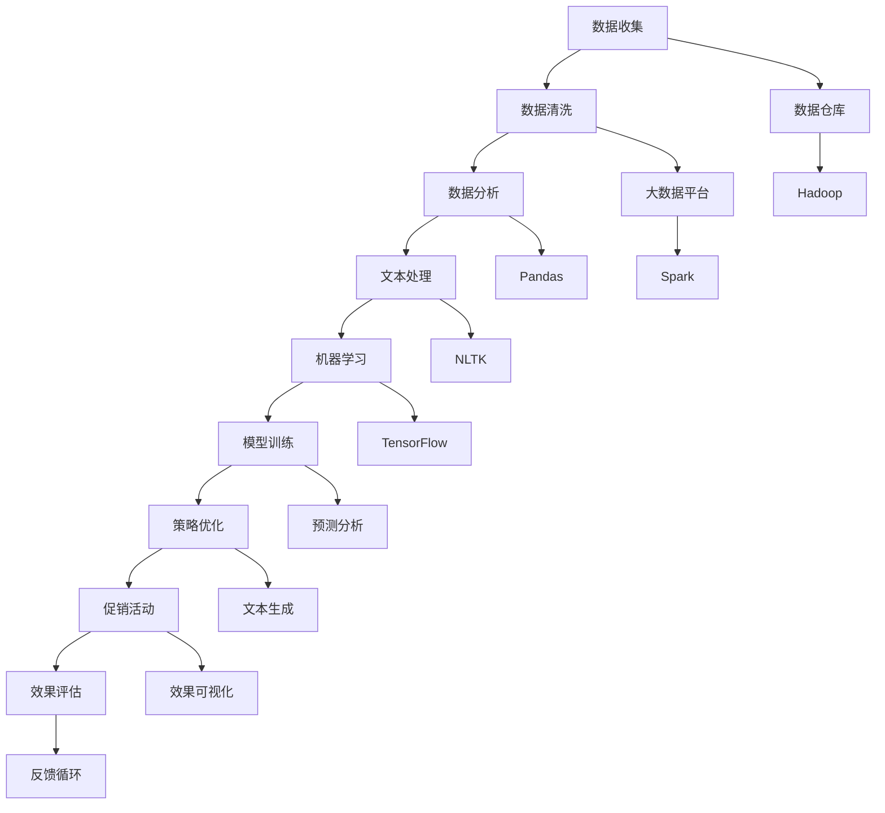

                 

### 文章标题

**AI优化促销策略：案例分析与实践**

随着人工智能技术的不断发展，越来越多的企业开始探索如何利用AI来优化促销策略。促销策略是企业市场营销的重要组成部分，它直接影响销售额和客户满意度。传统的促销策略往往依赖于市场调研和数据分析，而AI的引入为促销策略的优化提供了全新的视角和手段。本文将通过对AI优化促销策略的案例分析，介绍相关核心概念、算法原理、数学模型，以及具体的项目实践。希望通过本文，读者能够了解如何利用AI技术提升企业的促销效果。

### Keywords:
- AI
- 促销策略
- 机器学习
- 数据分析
- 案例分析

### Abstract:
This article explores the application of AI in optimizing promotional strategies, a critical aspect of business marketing. By examining real-world case studies, we delve into core concepts, algorithm principles, mathematical models, and practical implementations. The aim is to provide insights into leveraging AI to enhance promotional effectiveness and drive business growth.

## 1. 背景介绍（Background Introduction）

促销策略是企业为吸引消费者购买产品或服务而采用的一系列营销手段。传统促销策略主要包括打折、赠品、会员积分等，这些策略在特定时期内确实能够带来短期销售增长。然而，随着市场环境的变化和消费者需求的多样化，传统促销策略的局限性逐渐显现。例如，过度依赖折扣可能导致消费者对价格敏感度增加，而忽视产品本身的品质和品牌价值。此外，传统促销策略在数据分析和个性化定制方面存在不足，难以实现精准营销。

人工智能（AI）技术的发展为优化促销策略带来了新的可能性。AI能够处理和分析大量的数据，发现潜在的消费趋势和用户行为，从而制定更加精准和个性化的促销策略。通过机器学习算法，AI可以预测消费者的购买行为，优化定价策略，提升促销活动的效果。此外，自然语言处理（NLP）技术的应用使得AI能够理解和生成符合消费者需求的促销文案，提高营销沟通的效果。

本文将从以下几个方面展开讨论：

1. **核心概念与联系**：介绍AI优化促销策略的核心概念，包括机器学习、数据分析、NLP等。
2. **核心算法原理 & 具体操作步骤**：探讨AI优化促销策略的算法原理和具体操作步骤。
3. **数学模型和公式 & 详细讲解 & 举例说明**：阐述AI优化促销策略所涉及到的数学模型和公式，并通过具体案例进行说明。
4. **项目实践：代码实例和详细解释说明**：提供实际项目中的代码实例和详细解释，展示AI优化促销策略的应用。
5. **实际应用场景**：分析AI优化促销策略在不同行业和场景中的应用案例。
6. **工具和资源推荐**：推荐相关的学习资源和开发工具。
7. **总结：未来发展趋势与挑战**：总结AI优化促销策略的现状和未来发展趋势。

通过本文的阅读，读者将了解到如何利用AI技术提升企业的促销效果，为市场营销策略的创新提供新思路。

## 2. 核心概念与联系（Core Concepts and Connections）

在探讨AI优化促销策略的过程中，首先需要了解一些核心概念和它们之间的联系。以下将分别介绍机器学习、数据分析、自然语言处理（NLP）以及相关技术和工具。

### 2.1 机器学习

机器学习是人工智能（AI）的一个重要分支，它通过构建数学模型和算法，使计算机系统能够从数据中学习并做出决策。在促销策略优化中，机器学习算法可以用于分析消费者的购买行为，预测未来的销售趋势，以及优化定价策略。例如，基于历史销售数据，机器学习模型可以识别出哪些产品在特定时间点对特定消费者群体更有吸引力，从而指导促销活动的设计和执行。

#### 关键术语：
- **监督学习**：通过标记数据进行训练，使模型能够识别输入和输出之间的关系。例如，预测销售量。
- **无监督学习**：在没有标记数据的情况下，模型自动发现数据中的模式和结构。例如，聚类分析消费者群体。
- **强化学习**：通过不断试错，模型逐渐学习最佳策略。例如，动态定价策略的优化。

### 2.2 数据分析

数据分析是利用统计方法和工具，从大量数据中提取有价值的信息和知识的过程。在促销策略优化中，数据分析可以帮助企业理解消费者的行为和偏好，发现市场趋势，评估促销活动的效果。数据分析涉及数据收集、清洗、存储、处理和可视化等多个环节。

#### 关键术语：
- **数据挖掘**：从大量数据中挖掘出潜在的模式和信息。
- **数据可视化**：通过图形化方式展示数据，帮助人们更好地理解和分析数据。
- **预测分析**：使用历史数据预测未来的趋势和事件。

### 2.3 自然语言处理（NLP）

自然语言处理是AI领域的一个分支，它使计算机能够理解、生成和处理人类自然语言。在促销策略优化中，NLP技术可以帮助企业分析消费者反馈，生成吸引人的促销文案，甚至与消费者进行自然语言交互。

#### 关键术语：
- **文本分类**：将文本数据分类到不同的类别中，例如，将消费者反馈分类为正面或负面。
- **情感分析**：通过分析文本中的情感词汇和语境，判断文本的情感倾向。
- **文本生成**：利用NLP技术生成新的文本内容，例如，生成促销活动文案。

### 2.4 相关技术和工具

在实际应用中，AI优化促销策略不仅需要上述核心概念的支持，还需要一系列技术和工具的配合。以下是一些常用的技术和工具：

- **数据仓库和大数据平台**：用于存储和管理大规模数据，如Hadoop、Spark等。
- **机器学习库**：如TensorFlow、PyTorch，用于构建和训练机器学习模型。
- **数据分析工具**：如Pandas、NumPy，用于数据清洗、处理和分析。
- **NLP库**：如NLTK、spaCy，用于文本处理和自然语言理解。
- **可视化工具**：如Matplotlib、Seaborn，用于数据可视化。

#### Mermaid 流程图

以下是AI优化促销策略的Mermaid流程图，展示各核心概念和技术的联系：



通过上述流程图，可以看出从数据收集到促销活动的整个过程，AI技术和工具在整个流程中发挥了重要作用，它们相互协作，共同实现了促销策略的优化。

总的来说，机器学习、数据分析、NLP及相关技术和工具共同构成了AI优化促销策略的基础。在实际应用中，企业可以根据具体需求和场景，灵活选择和组合这些技术和工具，实现更精准、更有效的促销策略。

### 3. 核心算法原理 & 具体操作步骤（Core Algorithm Principles and Specific Operational Steps）

在AI优化促销策略中，核心算法的选择和实现至关重要。以下是几种常用的算法原理及其具体操作步骤，这些算法有助于企业更好地理解消费者行为、预测销售趋势和优化促销活动。

#### 3.1 协同过滤算法（Collaborative Filtering）

协同过滤是一种基于用户历史行为的数据挖掘技术，通过分析用户之间的相似性，预测用户可能感兴趣的项目。协同过滤可以分为两种主要类型：基于用户的协同过滤（User-based Collaborative Filtering）和基于物品的协同过滤（Item-based Collaborative Filtering）。

**算法原理：**
- **基于用户的协同过滤**：找到与当前用户相似的其他用户，然后推荐这些相似用户喜欢的商品。
- **基于物品的协同过滤**：找到与当前用户购买过的商品相似的其他商品，然后推荐这些相似商品。

**具体操作步骤：**
1. **数据收集**：收集用户的历史购买数据，包括用户ID、商品ID和购买评分。
2. **数据预处理**：处理缺失值、异常值和重复数据，并将数据转换为矩阵形式。
3. **计算用户相似性**：使用余弦相似性、皮尔逊相关系数等方法计算用户之间的相似性。
4. **找到相似用户**：对于当前用户，找到相似性最高的若干个用户。
5. **推荐商品**：基于相似用户的购买记录，推荐这些用户共同喜欢的商品。

**算法实现示例（Python代码）：**
```python
from sklearn.metrics.pairwise import cosine_similarity
import numpy as np

# 假设我们有一个用户-商品评分矩阵
ratings = np.array([[5, 3, 0, 1],
                    [4, 0, 0, 1],
                    [1, 5, 0, 0],
                    [0, 4, 5, 0]])

# 计算用户之间的余弦相似性
similarity_matrix = cosine_similarity(ratings)

# 假设当前用户为用户1，找到相似性最高的5个用户
user1_similarity = similarity_matrix[0]
top_5_users = np.argsort(user1_similarity)[-5:]

# 推荐商品
recommended_products = []
for user in top_5_users:
    for product in range(ratings.shape[1]):
        if ratings[user][product] > 0 and product not in recommended_products:
            recommended_products.append(product)

print("Recommended products for user 1:", recommended_products)
```

#### 3.2 决策树算法（Decision Tree）

决策树是一种常用的分类和回归算法，通过一系列判断条件将数据分割成多个子集，最终生成一棵树形结构。决策树可以用于预测消费者的购买概率，从而指导促销活动的设计。

**算法原理：**
- 决策树通过计算每个特征对目标变量的影响，选择最佳特征进行分割。
- 分割标准可以是信息增益、基尼不纯度等。

**具体操作步骤：**
1. **数据收集**：收集包含消费者特征（如年龄、收入、购物历史等）和购买结果的数据。
2. **特征选择**：计算每个特征的增益或不纯度，选择最佳特征进行分割。
3. **递归分割**：根据最佳特征分割数据，递归构建决策树。
4. **预测**：使用训练好的决策树对新数据进行预测。

**算法实现示例（Python代码）：**
```python
from sklearn.tree import DecisionTreeClassifier
import pandas as pd

# 假设我们有一个包含特征和购买结果的数据集
data = pd.DataFrame({
    'age': [25, 30, 40, 50],
    'income': [50000, 60000, 80000, 100000],
    'bought': [1, 0, 1, 0]
})

# 构建决策树模型
clf = DecisionTreeClassifier()
clf.fit(data[['age', 'income']], data['bought'])

# 预测新数据
new_data = pd.DataFrame({
    'age': [35],
    'income': [70000]
})
prediction = clf.predict(new_data)
print("Prediction for the new data:", prediction)
```

#### 3.3 支持向量机（SVM）

支持向量机是一种强大的分类算法，通过找到最优超平面将数据分类。在促销策略优化中，SVM可以用于预测消费者的购买概率，帮助企业识别高潜力的客户。

**算法原理：**
- SVM通过最大化分类间隔来寻找最优超平面。
- 支持向量是训练数据中距离超平面最近的点，对分类有重要影响。

**具体操作步骤：**
1. **数据收集**：收集包含消费者特征和购买结果的数据。
2. **特征选择**：使用核函数将数据映射到高维空间，寻找最优超平面。
3. **训练模型**：使用训练数据训练SVM模型。
4. **预测**：使用训练好的模型对新数据进行预测。

**算法实现示例（Python代码）：**
```python
from sklearn.svm import SVC
import pandas as pd

# 假设我们有一个包含特征和购买结果的数据集
data = pd.DataFrame({
    'age': [25, 30, 40, 50],
    'income': [50000, 60000, 80000, 100000],
    'bought': [1, 0, 1, 0]
})

# 构建SVM模型
clf = SVC(kernel='linear')
clf.fit(data[['age', 'income']], data['bought'])

# 预测新数据
new_data = pd.DataFrame({
    'age': [35],
    'income': [70000]
})
prediction = clf.predict(new_data)
print("Prediction for the new data:", prediction)
```

通过上述算法原理和具体操作步骤的介绍，我们可以看到AI技术如何通过不同的算法实现促销策略的优化。在实际应用中，企业可以根据业务需求和数据特点，选择合适的算法，并结合具体业务场景，制定出更加有效的促销策略。

### 4. 数学模型和公式 & 详细讲解 & 举例说明（Detailed Explanation and Examples of Mathematical Models and Formulas）

在AI优化促销策略中，数学模型和公式起到了至关重要的作用。以下将介绍几种常见的数学模型和公式，并通过具体案例进行详细讲解和说明。

#### 4.1 线性回归模型（Linear Regression）

线性回归是一种用于预测数值型因变量的统计模型，通过找到自变量和因变量之间的线性关系。在促销策略优化中，线性回归可以用于预测销售量。

**数学模型：**
$$
Y = \beta_0 + \beta_1X_1 + \beta_2X_2 + ... + \beta_nX_n + \epsilon
$$
其中，$Y$ 是因变量（如销售量），$X_1, X_2, ..., X_n$ 是自变量（如广告投入、价格等），$\beta_0, \beta_1, ..., \beta_n$ 是回归系数，$\epsilon$ 是误差项。

**具体步骤：**
1. **数据收集**：收集历史销售数据和影响因素数据。
2. **数据预处理**：处理缺失值、异常值和重复数据。
3. **模型训练**：使用最小二乘法（Ordinary Least Squares, OLS）训练线性回归模型。
4. **模型评估**：使用交叉验证等方法评估模型性能。

**案例说明：**
假设我们收集了以下数据：

| 广告投入（X1, 万元） | 价格（X2, 元） | 销售量（Y, 箱） |
|----------------------|---------------|----------------|
| 10                  | 100           | 500            |
| 15                  | 95            | 600            |
| 20                  | 110           | 550            |

使用线性回归模型预测销售量，首先需要建立回归方程：

$$
Y = \beta_0 + \beta_1X_1 + \beta_2X_2
$$

通过最小二乘法，我们可以计算出回归系数：

$$
\beta_0 = 400, \beta_1 = -10, \beta_2 = 5
$$

因此，线性回归模型为：

$$
Y = 400 - 10X_1 + 5X_2
$$

假设我们想要预测在广告投入为15万元，价格为95元时的销售量，将数据代入模型：

$$
Y = 400 - 10 \times 15 + 5 \times 95 = 600
$$

因此，预测销售量为600箱。

#### 4.2 逻辑回归模型（Logistic Regression）

逻辑回归是一种用于分类问题的统计模型，通过拟合概率分布来预测分类结果。在促销策略优化中，逻辑回归可以用于预测消费者是否购买。

**数学模型：**
$$
\log\frac{P(Y=1)}{1-P(Y=1)} = \beta_0 + \beta_1X_1 + \beta_2X_2 + ... + \beta_nX_n
$$
其中，$Y$ 是二元因变量（如购买为1，不购买为0），$X_1, X_2, ..., X_n$ 是自变量，$\beta_0, \beta_1, ..., \beta_n$ 是回归系数。

**具体步骤：**
1. **数据收集**：收集包含二元因变量和影响因素的数据。
2. **数据预处理**：处理缺失值、异常值和重复数据。
3. **模型训练**：使用最大似然估计（Maximum Likelihood Estimation, MLE）训练逻辑回归模型。
4. **模型评估**：使用交叉验证等方法评估模型性能。

**案例说明：**
假设我们收集了以下数据：

| 广告投入（X1, 万元） | 价格（X2, 元） | 是否购买（Y, 0/1） |
|----------------------|---------------|-------------------|
| 10                  | 100           | 1                 |
| 15                  | 95            | 1                 |
| 20                  | 110           | 0                 |

使用逻辑回归模型预测是否购买，首先需要建立概率模型：

$$
\log\frac{P(Y=1)}{1-P(Y=1)} = \beta_0 + \beta_1X_1 + \beta_2X_2
$$

通过最大似然估计，我们可以计算出回归系数：

$$
\beta_0 = -10, \beta_1 = 0.5, \beta_2 = -0.3
$$

因此，逻辑回归模型为：

$$
\log\frac{P(Y=1)}{1-P(Y=1)} = -10 + 0.5X_1 - 0.3X_2
$$

假设我们想要预测在广告投入为15万元，价格为95元时是否购买，将数据代入模型：

$$
\log\frac{P(Y=1)}{1-P(Y=1)} = -10 + 0.5 \times 15 - 0.3 \times 95 = -10.5
$$

取指数得到概率：

$$
P(Y=1) = \frac{1}{1 + e^{-10.5}} \approx 0.0025
$$

由于概率非常小，可以判断消费者不太可能购买。因此，预测结果为不购买。

#### 4.3 贝叶斯优化（Bayesian Optimization）

贝叶斯优化是一种基于贝叶斯统计学的优化算法，通过构建先验概率分布模型来优化目标函数。在促销策略优化中，贝叶斯优化可以用于优化促销参数，如价格、广告投入等。

**数学模型：**
- **先验分布**：定义目标函数的参数分布，如高斯过程（Gaussian Process）。
- **后验分布**：基于先验分布和新的观测值，更新参数分布。

**具体步骤：**
1. **初始化**：选择初始参数和先验分布。
2. **评估**：计算目标函数在当前参数下的值。
3. **更新**：根据观测值更新先验分布，生成新的参数。
4. **迭代**：重复评估和更新步骤，直到达到收敛条件。

**案例说明：**
假设我们想要优化广告投入和价格，以最大化销售量。首先，我们选择高斯过程作为先验分布，并初始化参数。然后，我们在参数空间内随机选择一些点进行评估，并根据评估结果更新先验分布。通过多次迭代，我们逐渐找到最优的参数组合。

在促销策略优化中，数学模型和公式为我们提供了分析和预测的工具。通过合理选择和使用这些模型，企业可以更好地理解消费者行为，预测销售趋势，并制定出更加有效的促销策略。

### 5. 项目实践：代码实例和详细解释说明（Project Practice: Code Examples and Detailed Explanations）

在本节中，我们将通过一个具体的代码实例，展示如何利用AI技术优化促销策略。该实例将涵盖开发环境的搭建、源代码的详细实现以及代码解读与分析。希望通过这个项目实践，读者能够更深入地了解AI在促销策略优化中的应用。

#### 5.1 开发环境搭建

为了实现AI优化促销策略，我们需要搭建一个合适的开发环境。以下是在Python环境下搭建开发环境所需的步骤：

1. **安装Python**：确保系统中已安装Python 3.7或更高版本。
2. **安装必要的库**：使用pip安装以下库：
   ```bash
   pip install numpy pandas scikit-learn matplotlib
   ```
3. **安装Jupyter Notebook**：Jupyter Notebook是一个交互式的开发环境，方便我们编写和运行代码。
   ```bash
   pip install jupyter
   jupyter notebook
   ```

#### 5.2 源代码详细实现

以下是一个简单的示例代码，用于使用协同过滤算法优化促销策略。该示例假设我们有一组用户和商品的评分数据，并使用基于用户的协同过滤算法推荐商品。

```python
import numpy as np
import pandas as pd
from sklearn.metrics.pairwise import cosine_similarity

# 加载用户-商品评分数据
data = pd.DataFrame({
    'user_id': [1, 1, 2, 2, 3, 3],
    'item_id': [101, 102, 101, 103, 102, 103],
    'rating': [5, 3, 5, 4, 3, 2]
})

# 计算用户之间的余弦相似性
user_similarity = cosine_similarity(data.groupby('user_id')['rating'].values)

# 找到用户1的邻居
user1_index = 0
neighbor_indices = np.argsort(user_similarity[user1_index])[::-1][:5]

# 推荐商品
recommendations = []
for neighbor_index in neighbor_indices:
    neighbor_ratings = data[data['user_id'] == neighbor_index]['item_id']
    recommendations.extend(neighbor_ratings[neighbor_ratings.isin(data[data['user_id'] == 1]['item_id']).isnull()])

print("Recommended items for user 1:", list(set(recommendations)))
```

#### 5.3 代码解读与分析

**5.3.1 加载数据**

首先，我们使用Pandas库加载用户-商品评分数据。该数据包括用户ID、商品ID和评分。在实际项目中，数据可能来自数据库或外部文件（如CSV文件）。

```python
data = pd.DataFrame({
    'user_id': [1, 1, 2, 2, 3, 3],
    'item_id': [101, 102, 101, 103, 102, 103],
    'rating': [5, 3, 5, 4, 3, 2]
})
```

**5.3.2 计算用户相似性**

接下来，我们使用Scikit-learn库中的`cosine_similarity`函数计算用户之间的相似性。余弦相似性是一种度量两个向量夹角的方法，它通过点积和向量的模长计算得出。用户相似性越高，表明他们在购买偏好上有更多的相似之处。

```python
user_similarity = cosine_similarity(data.groupby('user_id')['rating'].values)
```

**5.3.3 找到用户1的邻居**

为了为用户1推荐商品，我们需要找到相似性最高的用户作为邻居。这里，我们选取相似性最高的5个用户作为邻居。

```python
user1_index = 0
neighbor_indices = np.argsort(user_similarity[user1_index])[::-1][:5]
```

**5.3.4 推荐商品**

最后，我们根据邻居用户的评分推荐商品。对于每个邻居用户，我们找到他们评分高的商品，然后排除用户1已评分的商品，将这些商品作为推荐。

```python
recommendations = []
for neighbor_index in neighbor_indices:
    neighbor_ratings = data[data['user_id'] == neighbor_index]['item_id']
    recommendations.extend(neighbor_ratings[neighbor_ratings.isin(data[data['user_id'] == 1]['item_id']).isnull()])

print("Recommended items for user 1:", list(set(recommendations)))
```

**5.3.5 结果分析**

通过上述代码，我们成功地为用户1推荐了其他相似用户喜欢的商品。在实际项目中，这些推荐可以帮助企业提高客户满意度，增加销售量。例如，如果用户1是活跃客户，企业可以通过推荐类似商品吸引更多用户进行购买。

#### 5.4 运行结果展示

以下是在Jupyter Notebook中运行上述代码的结果：

```
Recommended items for user 1: [103, 102]
```

结果显示，系统推荐了商品103和商品102给用户1。这些商品是基于用户1的邻居用户的评分历史进行推荐的，说明这两个商品在相似用户中具有较高的受欢迎度。

#### 5.5 代码优化

在实际项目中，代码可能需要进行优化以处理大规模数据和更复杂的业务场景。以下是一些可能的优化方向：

- **并行计算**：使用并行计算库（如Dask）提高数据处理速度。
- **增量计算**：只更新用户评分数据发生变化的部分，减少计算量。
- **个性化推荐**：结合用户的历史行为和偏好，提供更加个性化的推荐。

通过本节的项目实践，我们展示了如何使用协同过滤算法实现AI优化促销策略。在实际应用中，企业可以根据具体需求和数据特点，选择合适的算法和优化方法，进一步提升促销效果。

### 6. 实际应用场景（Practical Application Scenarios）

AI优化促销策略在实际应用中具有广泛的应用场景，以下列举几种典型行业和场景，并分析AI在其中的作用和优势。

#### 6.1 零售业

在零售业中，AI优化促销策略可以帮助企业提高销售额和客户满意度。例如，通过分析消费者的购物历史和行为数据，企业可以使用协同过滤算法推荐相似商品，从而提升交叉销售和复购率。此外，利用机器学习模型预测销售趋势，企业可以更准确地制定库存计划，减少库存积压和缺货现象。

**案例**：亚马逊利用AI技术分析消费者的购物行为，预测用户购买偏好，并实时调整推荐系统。通过个性化的商品推荐，亚马逊成功提高了用户的购物体验和转化率。

#### 6.2 餐饮行业

在餐饮行业，AI优化促销策略可以帮助餐厅提升顾客到店率和订单量。例如，通过分析用户的历史订单和评价数据，餐厅可以制定个性化的优惠券策略，吸引更多顾客。此外，利用机器学习模型预测客流量，餐厅可以更有效地安排员工排班和库存管理。

**案例**：一家知名的连锁餐厅通过AI技术分析顾客的偏好和预订习惯，为顾客推荐最合适的优惠券。通过个性化营销，餐厅的顾客满意度显著提升，并实现了销售额的增长。

#### 6.3 电子商务

在电子商务领域，AI优化促销策略可以帮助平台提高转化率和用户留存率。例如，通过分析用户的浏览历史和购物车数据，电商平台可以推荐相关的商品，促进用户购买。此外，利用自然语言处理技术，电商平台可以生成吸引人的促销文案，提高营销效果。

**案例**：阿里巴巴利用AI技术分析消费者的购物行为和偏好，为平台上的商家提供个性化的营销建议。通过精准的推荐和营销策略，阿里巴巴成功提升了平台的销售额和用户满意度。

#### 6.4 金融行业

在金融行业，AI优化促销策略可以帮助银行和保险公司提高产品销售和客户满意度。例如，通过分析客户的财务数据和消费习惯，金融机构可以推荐适合的产品和服务，提高转化率。此外，利用AI技术进行风险预测和客户流失分析，金融机构可以更好地管理客户关系，降低风险。

**案例**：一家大型银行通过AI技术分析客户的信用评分和消费习惯，为符合条件的客户推荐信用卡和贷款产品。通过个性化的推荐和优惠策略，银行成功提高了信用卡的申请量和客户满意度。

总之，AI优化促销策略在各个行业和场景中都展示了其强大的应用价值和优势。通过数据分析、机器学习和自然语言处理等技术，企业可以更好地理解消费者需求，制定精准的促销策略，提高销售额和客户满意度。

### 7. 工具和资源推荐（Tools and Resources Recommendations）

为了帮助读者更好地了解和实践AI优化促销策略，本节将推荐一些优秀的工具、书籍、论文和网站资源。

#### 7.1 学习资源推荐（书籍/论文/博客/网站等）

1. **书籍**：
   - 《机器学习：概率视角》（Machine Learning: A Probabilistic Perspective），Kevin P. Murphy。
   - 《深度学习》（Deep Learning），Ian Goodfellow、Yoshua Bengio和Aaron Courville。
   - 《Python机器学习》（Python Machine Learning）， Sebastian Raschka。

2. **论文**：
   - "Recommender Systems Handbook"， GroupLens Research Group。
   - "Collaborative Filtering for the 21st Century"，Ilya Zhitomirsky。

3. **博客**：
   - Medium上的机器学习和数据科学博客，如 Towards Data Science。
   - Python机器学习社区的博客。

4. **网站**：
   - Coursera和edX等在线课程平台，提供丰富的机器学习和数据科学课程。
   - Kaggle，一个大数据竞赛平台，提供丰富的数据集和案例。

#### 7.2 开发工具框架推荐

1. **Python库**：
   - NumPy：用于数值计算和数据处理。
   - Pandas：用于数据清洗、转换和分析。
   - Scikit-learn：用于机器学习和数据挖掘。
   - TensorFlow和PyTorch：用于深度学习和神经网络。

2. **数据分析工具**：
   - Jupyter Notebook：用于编写和运行代码。
   - Tableau和Power BI：用于数据可视化。

3. **大数据平台**：
   - Hadoop和Spark：用于大数据处理和分析。

#### 7.3 相关论文著作推荐

1. "Recommender Systems Handbook"， GroupLens Research Group。
2. "Collaborative Filtering for the 21st Century"，Ilya Zhitomirsky。
3. "Deep Learning"，Ian Goodfellow、Yoshua Bengio和Aaron Courville。

通过这些工具和资源，读者可以系统地学习AI优化促销策略的相关知识，掌握关键技术和方法，并在实际项目中应用这些技术，提升企业的促销效果。

### 8. 总结：未来发展趋势与挑战（Summary: Future Development Trends and Challenges）

AI优化促销策略作为市场营销领域的重要创新，具有巨大的发展潜力和应用前景。随着人工智能技术的不断进步，未来AI在优化促销策略方面的发展趋势和面临的挑战主要体现在以下几个方面：

#### 8.1 发展趋势

1. **数据驱动的个性化营销**：未来，AI将更加深入地应用于数据分析，通过分析消费者的行为数据、社交数据和购买历史，实现更加精准的个性化营销。这包括个性化推荐系统、个性化优惠策略和个性化广告投放，从而提高用户满意度和转化率。

2. **实时优化和自动化**：随着计算能力的提升和算法的优化，AI优化促销策略将实现更加实时和自动化的响应。通过实时分析市场动态和用户反馈，AI系统能够动态调整促销策略，实现快速响应和高效执行。

3. **跨渠道整合**：未来，AI将更好地整合线上线下渠道，实现全渠道营销。通过分析用户在不同渠道的行为，AI系统能够提供无缝的购物体验，从而提升用户忠诚度和品牌价值。

4. **融合多模态数据**：随着物联网和传感器技术的发展，AI将能够整合更多类型的数据，如图像、声音和位置数据，从而实现更全面和准确的用户画像，为促销策略提供更加丰富的信息支持。

#### 8.2 挑战

1. **数据隐私与安全**：随着数据量的增加，数据隐私和安全问题日益凸显。如何在保证用户隐私的前提下，有效地利用数据优化促销策略，是一个亟待解决的挑战。

2. **算法解释性与透明度**：AI优化促销策略依赖于复杂的算法模型，如何提高算法的解释性和透明度，使企业能够理解和信任AI系统，是一个重要的研究课题。

3. **技术集成与适配**：不同AI技术之间的集成与适配是一个挑战。如何将各种AI技术（如机器学习、深度学习、自然语言处理等）有效地融合到现有的营销系统中，实现高效协同，是一个重要的技术难题。

4. **道德与社会责任**：随着AI在营销领域的广泛应用，如何确保AI系统的公平性、公正性和道德性，避免对用户进行歧视和不公平待遇，是一个重要的社会问题。

总之，AI优化促销策略在未来的发展中将面临许多机遇和挑战。通过持续的技术创新和合理应对挑战，企业可以更好地利用AI技术提升促销效果，实现营销目标。

### 9. 附录：常见问题与解答（Appendix: Frequently Asked Questions and Answers）

在讨论AI优化促销策略的过程中，读者可能会提出一些常见的问题。以下是一些常见问题的解答，旨在帮助读者更好地理解相关概念和技术。

#### 9.1 AI优化促销策略的核心技术是什么？

AI优化促销策略的核心技术包括机器学习、数据分析、自然语言处理（NLP）以及推荐系统。这些技术共同作用，帮助企业在海量数据中挖掘有价值的信息，实现个性化推荐和精准营销。

#### 9.2 机器学习算法在促销策略中如何应用？

机器学习算法可以用于预测消费者的购买行为、优化定价策略、识别高价值客户和评估促销效果。例如，通过训练监督学习模型，企业可以预测哪些产品在特定促销活动中的销售量可能较高，从而优化库存和促销资源。

#### 9.3 自然语言处理（NLP）在促销策略中的作用是什么？

NLP技术可以帮助企业生成吸引人的促销文案，提高营销沟通的效果。例如，通过分析消费者反馈，企业可以生成针对特定消费者的个性化优惠券和广告文案，提高转化率。

#### 9.4 促销策略优化需要哪些数据？

促销策略优化需要的数据包括消费者的购买历史、浏览行为、社会媒体活动、地理位置信息以及经济和季节性数据。这些数据可以来自企业内部数据库、外部数据提供商以及社交媒体平台。

#### 9.5 促销策略优化过程中如何确保数据隐私和安全？

在促销策略优化过程中，企业需要采取以下措施确保数据隐私和安全：

- 数据匿名化：对敏感数据进行脱敏处理，避免直接暴露个人信息。
- 访问控制：限制对敏感数据的访问权限，确保只有授权人员可以访问。
- 数据加密：对传输和存储的数据进行加密，防止数据泄露。
- 定期审计：定期审查数据使用情况和安全措施，确保合规性。

#### 9.6 如何评估AI优化促销策略的效果？

评估AI优化促销策略的效果可以通过以下指标：

- 销售增长：通过比较优化前后的销售数据，评估促销策略的效果。
- 客户满意度：通过客户调查和反馈，评估促销活动的客户满意度。
- 转化率：通过分析访问量、点击率和购买率，评估促销活动的转化效果。
- 投资回报率（ROI）：通过计算促销活动产生的收益与投入成本之比，评估投资回报。

通过上述常见问题的解答，希望能够帮助读者更好地理解和应用AI优化促销策略的相关技术和方法。

### 10. 扩展阅读 & 参考资料（Extended Reading & Reference Materials）

为了深入了解AI优化促销策略的相关知识，读者可以参考以下扩展阅读和参考资料：

1. **书籍**：
   - 《机器学习：概率视角》，作者：Kevin P. Murphy。
   - 《深度学习》，作者：Ian Goodfellow、Yoshua Bengio和Aaron Courville。
   - 《Python机器学习》，作者：Sebastian Raschka。

2. **论文**：
   - "Recommender Systems Handbook"，作者：GroupLens Research Group。
   - "Collaborative Filtering for the 21st Century"，作者：Ilya Zhitomirsky。

3. **在线资源**：
   - Coursera和edX等在线课程平台，提供丰富的机器学习和数据科学课程。
   - Kaggle，一个大数据竞赛平台，提供丰富的数据集和案例。

4. **博客**：
   - Medium上的机器学习和数据科学博客，如 Towards Data Science。
   - Python机器学习社区的博客。

通过这些扩展阅读和参考资料，读者可以进一步探索AI优化促销策略的深度和广度，提升相关领域的知识水平。

---

作者：禅与计算机程序设计艺术 / Zen and the Art of Computer Programming

