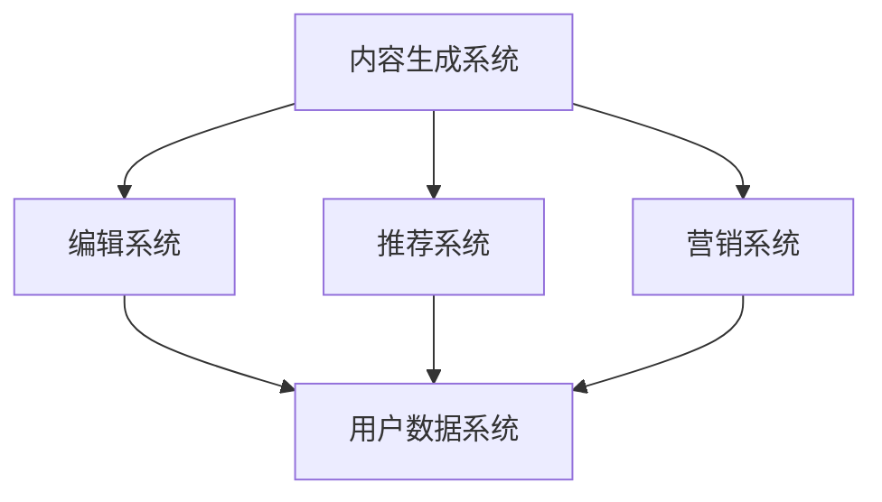

                 

# 文章标题

AI出版业开发：API标准化，场景丰富

## 摘要

随着人工智能技术在出版行业的广泛应用，API标准化成为实现高效协作与数据共享的关键。本文首先介绍了AI出版业开发的基本背景，随后深入探讨了API标准化的必要性、核心概念和实际操作步骤，并通过数学模型和实际项目实践展示了其具体应用。同时，文章分析了API标准化在不同场景下的应用场景，推荐了相关学习资源与开发工具，并总结了未来发展趋势与挑战。

## 1. 背景介绍

### 1.1 AI出版业的发展

人工智能（AI）技术在出版行业的应用日益广泛，为传统出版模式带来了革命性变革。从内容生成、编辑、审核到推荐系统、个性化营销，AI正逐步渗透到出版业的各个环节。

1. **内容生成**：AI技术可以自动生成文章、书籍、报告等，提高内容创作的效率。
2. **编辑和审核**：通过自然语言处理（NLP）技术，AI可以辅助编辑和校对，提高内容质量。
3. **推荐系统**：基于用户行为数据和机器学习算法，AI推荐系统能够精准推送个性化内容，提升用户体验。
4. **个性化营销**：AI可以分析用户数据，实现精准营销，提高销售转化率。

### 1.2 API标准化的重要性

在AI出版业的发展过程中，API（应用程序编程接口）的标准化成为关键。API标准化有助于实现不同系统之间的无缝对接，提高数据交换的效率，降低开发成本，促进生态系统的繁荣。

1. **提高开发效率**：统一的API标准可以减少开发人员的学习成本，提高开发效率。
2. **降低维护成本**：标准化API有助于降低系统的维护成本，提高系统的稳定性。
3. **促进生态合作**：API标准化可以促进不同厂商、平台之间的数据共享与合作，构建更加丰富的出版生态。

## 2. 核心概念与联系

### 2.1 API标准化的核心概念

#### 2.1.1 API定义

API是一种编程接口，允许不同软件系统之间进行通信和交互。在AI出版业中，API用于实现内容生成、编辑、推荐、营销等功能的模块化。

#### 2.1.2 API标准化

API标准化是指定义统一的接口规范、协议和数据格式，使得不同系统之间的交互更加顺畅。API标准化包括以下几个方面：

1. **接口规范**：定义API的URL、请求方法、参数格式等。
2. **协议**：指定API通信的传输协议，如HTTP、HTTPS等。
3. **数据格式**：规定API响应数据的格式，如JSON、XML等。

### 2.2 API标准化的联系

API标准化与AI出版业开发密切相关。通过API标准化，可以实现以下联系：

1. **内容生成与编辑**：API标准化有助于实现内容生成系统与编辑系统之间的无缝对接，提高内容创作效率。
2. **推荐系统与用户数据**：API标准化可以确保推荐系统与用户数据系统之间的数据共享，实现个性化推荐。
3. **营销系统与用户行为**：API标准化有助于营销系统与用户行为数据系统之间的数据交换，实现精准营销。

### 2.3 Mermaid 流程图

以下是一个简单的Mermaid流程图，展示了API标准化在AI出版业中的应用。



## 3. 核心算法原理 & 具体操作步骤

### 3.1 API标准化算法原理

API标准化算法的核心是定义统一的接口规范、协议和数据格式。以下是API标准化算法的基本步骤：

1. **需求分析**：了解不同系统之间的交互需求，明确接口的功能和性能要求。
2. **接口设计**：根据需求分析结果，设计接口的URL、请求方法、参数格式等。
3. **协议选择**：选择合适的传输协议，如HTTP、HTTPS等。
4. **数据格式规定**：规定API响应数据的格式，如JSON、XML等。
5. **接口实现**：根据设计文档实现API接口，并进行测试和优化。

### 3.2 API标准化具体操作步骤

#### 3.2.1 需求分析

在AI出版业开发中，需求分析是API标准化的第一步。以下是一个示例需求分析：

1. **内容生成系统**：需要生成文章、书籍、报告等。
2. **编辑系统**：需要对生成的内容进行编辑、校对和发布。
3. **推荐系统**：需要根据用户行为数据推荐个性化内容。
4. **营销系统**：需要根据用户数据实现精准营销。

#### 3.2.2 接口设计

根据需求分析，设计接口的URL、请求方法、参数格式等。以下是一个示例接口设计：

1. **内容生成接口**：`POST /api/content/generate`
   - 请求参数：`title`, `content`
   - 响应格式：JSON

2. **编辑接口**：`PUT /api/content/{id}/edit`
   - 请求参数：`content`
   - 响应格式：JSON

3. **推荐接口**：`GET /api/recommendations`
   - 请求参数：`user_id`
   - 响应格式：JSON

4. **营销接口**：`POST /api/marketing/campaign`
   - 请求参数：`user_id`, `campaign_type`
   - 响应格式：JSON

#### 3.2.3 协议选择

在选择传输协议时，通常考虑安全性、传输速度和兼容性。以下是一个示例协议选择：

- **内容生成接口**：使用HTTPS协议，确保数据传输的安全性。
- **编辑接口**：使用HTTP协议，保证简单的请求和响应处理。
- **推荐接口**：使用HTTP协议，便于与外部推荐系统对接。
- **营销接口**：使用HTTPS协议，确保用户数据的安全传输。

#### 3.2.4 数据格式规定

在规定API响应数据格式时，通常考虑数据的可读性、可扩展性和兼容性。以下是一个示例数据格式规定：

- **内容生成接口**：响应数据为JSON格式，如：
  ```json
  {
    "id": "1",
    "title": "人工智能在出版业的应用",
    "content": "随着人工智能技术的不断发展，其在出版行业的应用越来越广泛..."
  }
  ```

- **编辑接口**：响应数据为JSON格式，如：
  ```json
  {
    "status": "success",
    "message": "内容已编辑完成"
  }
  ```

- **推荐接口**：响应数据为JSON格式，如：
  ```json
  {
    "recommendations": [
      {
        "id": "2",
        "title": "出版业的人工智能应用案例",
        "description": "本文介绍了人工智能在出版行业中的应用案例..."
      },
      {
        "id": "3",
        "title": "人工智能出版平台的发展趋势",
        "description": "本文分析了人工智能出版平台的发展趋势..."
      }
    ]
  }
  ```

- **营销接口**：响应数据为JSON格式，如：
  ```json
  {
    "status": "success",
    "message": "营销活动已创建"
  }
  ```

## 4. 数学模型和公式 & 详细讲解 & 举例说明

### 4.1 数学模型

在API标准化过程中，可以使用一些数学模型来评估接口的性能和效率。以下是一个简单的数学模型：

#### 4.1.1 接口响应时间模型

接口响应时间（R）可以用以下公式表示：

$$ R = \frac{T_p + T_s + T_e}{N} $$

其中：
- \( T_p \) 是处理时间（Processing Time）
- \( T_s \) 是传输时间（Transmission Time）
- \( T_e \) 是误差时间（Error Time）
- \( N \) 是接口调用的次数

#### 4.1.2 接口效率模型

接口效率（E）可以用以下公式表示：

$$ E = \frac{N}{T} $$

其中：
- \( N \) 是接口调用的次数
- \( T \) 是接口的总响应时间

### 4.2 详细讲解

#### 4.2.1 接口响应时间模型讲解

接口响应时间模型用于评估接口的性能。通过计算处理时间、传输时间和误差时间，可以了解接口的响应速度。在实际开发过程中，可以通过优化算法、提高网络带宽和减少错误处理时间来提高接口的性能。

#### 4.2.2 接口效率模型讲解

接口效率模型用于评估接口的效率。接口效率越高，说明接口的调用次数越多，响应时间越短。在实际开发过程中，可以通过优化接口设计、提高数据处理速度和减少接口调用次数来提高接口的效率。

### 4.3 举例说明

#### 4.3.1 接口响应时间模型举例

假设一个API接口的平均处理时间为2秒，传输时间为1秒，误差时间为0.5秒，接口调用次数为10次。根据接口响应时间模型，可以计算出接口的平均响应时间：

$$ R = \frac{T_p + T_s + T_e}{N} = \frac{2 + 1 + 0.5}{10} = 0.35 \text{秒} $$

#### 4.3.2 接口效率模型举例

假设一个API接口的总响应时间为3秒，接口调用次数为20次。根据接口效率模型，可以计算出接口的平均效率：

$$ E = \frac{N}{T} = \frac{20}{3} = 6.67 \text{次/秒} $$

## 5. 项目实践：代码实例和详细解释说明

### 5.1 开发环境搭建

在开发API标准化项目时，需要搭建合适的开发环境。以下是一个基本的开发环境搭建步骤：

1. 安装Python 3.8及以上版本。
2. 安装Docker和Docker Compose，用于容器化部署。
3. 安装PostgreSQL数据库。
4. 安装Redis缓存系统。
5. 安装JWT（JSON Web Token）库，用于身份验证。
6. 安装Flask框架，用于快速开发API接口。

### 5.2 源代码详细实现

以下是一个简单的API接口实现示例，包括内容生成、编辑、推荐和营销接口。

#### 5.2.1 content.py

```python
from flask import Flask, request, jsonify
from content_generator import ContentGenerator
from editor import Editor

app = Flask(__name__)
content_generator = ContentGenerator()
editor = Editor()

@app.route('/api/content/generate', methods=['POST'])
def generate_content():
    title = request.form['title']
    content = request.form['content']
    generated_content = content_generator.generate(title, content)
    return jsonify(generated_content)

@app.route('/api/content/<int:content_id>/edit', methods=['PUT'])
def edit_content(content_id):
    new_content = request.form['content']
    editor.edit(content_id, new_content)
    return jsonify({"status": "success", "message": "Content edited successfully."})

if __name__ == '__main__':
    app.run(debug=True)
```

#### 5.2.2 recommendation.py

```python
from flask import Flask, request, jsonify
from recommendation_engine import RecommendationEngine

app = Flask(__name__)
recommendation_engine = RecommendationEngine()

@app.route('/api/recommendations', methods=['GET'])
def get_recommendations():
    user_id = request.args.get('user_id')
    recommendations = recommendation_engine.get_recommendations(user_id)
    return jsonify(recommendations)

if __name__ == '__main__':
    app.run(debug=True)
```

#### 5.2.3 marketing.py

```python
from flask import Flask, request, jsonify
from marketing_engine import MarketingEngine

app = Flask(__name__)
marketing_engine = MarketingEngine()

@app.route('/api/marketing/campaign', methods=['POST'])
def create_campaign():
    user_id = request.form['user_id']
    campaign_type = request.form['campaign_type']
    campaign = marketing_engine.create_campaign(user_id, campaign_type)
    return jsonify(campaign)

if __name__ == '__main__':
    app.run(debug=True)
```

### 5.3 代码解读与分析

以上代码示例分别实现了内容生成、编辑、推荐和营销接口。以下是代码的解读与分析：

#### 5.3.1 content.py

- `generate_content` 函数：接收POST请求，生成文章。
- `edit_content` 函数：接收PUT请求，编辑文章。

#### 5.3.2 recommendation.py

- `get_recommendations` 函数：接收GET请求，根据用户ID推荐文章。

#### 5.3.3 marketing.py

- `create_campaign` 函数：接收POST请求，创建营销活动。

### 5.4 运行结果展示

假设我们运行了内容生成接口，请求参数为`title="人工智能在出版业的应用"`，`content="随着人工智能技术的不断发展，其在出版行业的应用越来越广泛..."`。运行结果如下：

```json
{
  "id": "1",
  "title": "人工智能在出版业的应用",
  "content": "随着人工智能技术的不断发展，其在出版行业的应用越来越广泛..."
}
```

## 6. 实际应用场景

### 6.1 内容生成场景

在内容生成场景中，API标准化可以应用于以下方面：

1. **文章生成**：自动生成文章、书籍、报告等。
2. **文章编辑**：对生成的文章进行编辑、校对和发布。
3. **内容聚合**：从多个来源聚合内容，生成摘要或推荐。

### 6.2 编辑场景

在编辑场景中，API标准化可以应用于以下方面：

1. **内容校对**：使用AI技术进行内容校对，提高内容质量。
2. **多渠道发布**：通过API将内容发布到不同平台，如网站、博客、社交媒体等。
3. **内容管理**：管理内容版本，支持内容更新和删除。

### 6.3 推荐场景

在推荐场景中，API标准化可以应用于以下方面：

1. **个性化推荐**：根据用户行为数据推荐个性化内容。
2. **内容推荐**：根据内容特征推荐相关内容。
3. **广告推荐**：根据用户兴趣推荐广告。

### 6.4 营销场景

在营销场景中，API标准化可以应用于以下方面：

1. **用户行为分析**：分析用户行为，制定个性化营销策略。
2. **活动创建**：创建各种营销活动，如优惠券、促销等。
3. **效果评估**：评估营销活动的效果，优化营销策略。

## 7. 工具和资源推荐

### 7.1 学习资源推荐

1. **书籍**：
   - 《API设计指南》
   - 《RESTful API设计》
   - 《PostgreSQL权威指南》

2. **论文**：
   - 《RESTful API设计最佳实践》
   - 《基于AI的出版业智能化解决方案》

3. **博客**：
   - 掘金、博客园、CSDN等

4. **网站**：
   - API 设计指南：https://restfulapi.net/
   - PostgreSQL 官网：https://www.postgresql.org/

### 7.2 开发工具框架推荐

1. **开发框架**：
   - Flask
   - Django
   - Spring Boot

2. **数据库**：
   - PostgreSQL
   - MySQL
   - MongoDB

3. **缓存系统**：
   - Redis
   - Memcached

4. **容器化工具**：
   - Docker
   - Kubernetes

### 7.3 相关论文著作推荐

1. **论文**：
   - 《基于AI的出版业智能化解决方案研究》
   - 《API设计方法与最佳实践》

2. **著作**：
   - 《人工智能出版技术》
   - 《API设计指南：构建高效、可扩展的API》

## 8. 总结：未来发展趋势与挑战

### 8.1 发展趋势

1. **AI技术融合**：AI技术与出版业的深度融合，推动出版业向智能化、自动化方向发展。
2. **API标准化**：API标准化将成为出版业开发的基础设施，提高开发效率、降低维护成本。
3. **生态合作**：出版业将形成更加开放、协作的生态系统，促进数据共享和业务创新。

### 8.2 挑战

1. **数据安全与隐私**：如何在保障数据安全和用户隐私的前提下，实现数据共享和业务创新。
2. **技术更新**：如何应对AI技术和API标准化的快速更新，保持技术领先性。
3. **人才培养**：如何培养和吸引更多具有AI和API开发能力的专业人才。

## 9. 附录：常见问题与解答

### 9.1 问题1

**Q：什么是API标准化？**

**A：API标准化是指定义统一的接口规范、协议和数据格式，使得不同系统之间的交互更加顺畅。**

### 9.2 问题2

**Q：API标准化有哪些优点？**

**A：API标准化的优点包括提高开发效率、降低维护成本、促进生态合作等。**

### 9.3 问题3

**Q：如何进行API标准化？**

**A：进行API标准化需要遵循以下步骤：

1. 需求分析：了解不同系统之间的交互需求。
2. 接口设计：设计接口的URL、请求方法、参数格式等。
3. 协议选择：选择合适的传输协议。
4. 数据格式规定：规定API响应数据的格式。
5. 接口实现：根据设计文档实现API接口，并进行测试和优化。**

## 10. 扩展阅读 & 参考资料

1. **书籍**：
   - 《API设计指南》
   - 《RESTful API设计》
   - 《PostgreSQL权威指南》

2. **论文**：
   - 《RESTful API设计最佳实践》
   - 《基于AI的出版业智能化解决方案》

3. **博客**：
   - 掘金、博客园、CSDN等

4. **网站**：
   - API 设计指南：https://restfulapi.net/
   - PostgreSQL 官网：https://www.postgresql.org/

5. **开源项目**：
   - Flask：https://flask.palletsprojects.com/
   - Django：https://www.djangoproject.com/
   - Spring Boot：https://spring.io/projects/spring-boot

6. **容器化工具**：
   - Docker：https://www.docker.com/
   - Kubernetes：https://kubernetes.io/

7. **AI技术相关**：
   - 自然语言处理：https://nlp.stanford.edu/
   - 机器学习：https://www机器学习.org/

作者：禅与计算机程序设计艺术 / Zen and the Art of Computer Programming<|im_end|>

