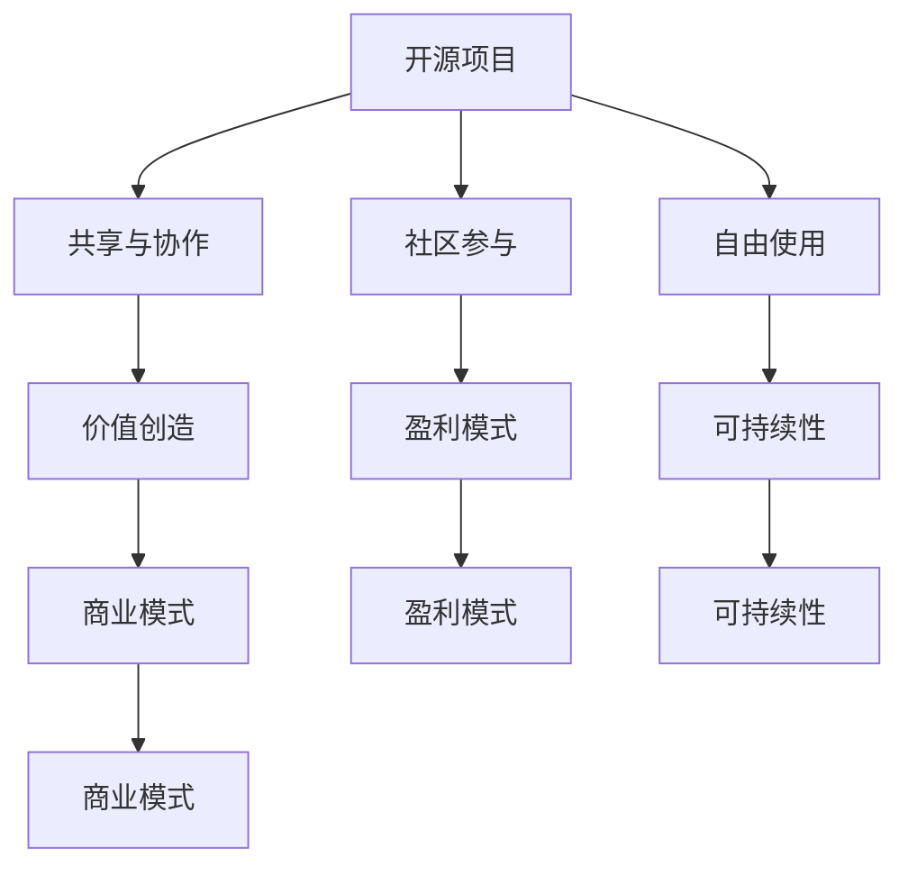

                 

# 文章标题

《程序员如何将开源项目转化为可持续盈利的商业模式》

## 关键词：开源项目，商业模式，盈利，可持续性，程序员，策略

### 摘要：

在数字化时代，开源项目已成为软件开发的重要驱动力。然而，对于程序员而言，如何将这些开源项目转化为可持续盈利的商业模式，仍是一个挑战。本文将深入探讨开源项目的商业潜力，分析成功的案例，并提供具体的策略，帮助程序员打造可持续的盈利模式。

本文分为十个部分：首先介绍开源项目的背景和重要性；接着探讨开源项目的核心概念与联系；详细讲解如何将开源项目转化为商业价值；分析开源项目的数学模型和公式；提供项目实践中的代码实例和详细解释；探讨开源项目在实际应用场景中的运用；推荐相关的工具和资源；总结未来发展趋势与挑战；附录常见问题与解答；最后是扩展阅读与参考资料。希望通过本文，程序员能够找到适合自己项目的盈利之道。

## 1. 背景介绍（Background Introduction）

开源项目是指那些允许用户自由使用、研究、修改和分发软件的项目。它们以社区合作和共享知识为核心，激发了全球开发者的创新和协作精神。随着互联网的普及和技术的发展，开源项目已经成为了现代软件开发的基石。

开源项目不仅为程序员提供了丰富的资源，还促进了技术的进步和创新。许多知名软件，如Linux操作系统、MySQL数据库和Mozilla Firefox浏览器，都是开源项目的成功典范。这些项目通过社区的力量不断改进和优化，为企业和个人带来了巨大的价值。

然而，尽管开源项目具有巨大的潜力，许多程序员在将其转化为可持续盈利模式时仍然面临挑战。本文旨在探讨这些挑战，并提供实用的解决方案。

### 1.1 开源项目的兴起与现状

开源项目最早可以追溯到20世纪90年代。当时，自由软件运动（Free Software Movement）兴起，倡导软件的自由使用和共享。Linux操作系统的诞生标志着开源项目的崛起，它吸引了全球开发者的关注和参与。

随着时间的推移，开源项目逐渐成为软件开发的主流。现在，几乎每个技术领域都有大量的开源项目，如编程语言、框架、数据库、工具和应用程序等。这些项目不仅为程序员提供了丰富的资源，还促进了技术的快速迭代和共享。

根据开源研究机构OSI（Open Source Initiative）的数据，截至2023年，全球已有超过700万个活跃的开源项目。这些项目涵盖了各种领域，从Web开发到数据分析，从云计算到物联网。

### 1.2 开源项目的优势与挑战

开源项目的优势在于它们能够促进技术共享和创新。通过开源项目，程序员可以免费获得高质量的软件，减少了研发成本。此外，开源项目鼓励社区合作，使得项目能够快速改进和优化。

然而，开源项目也带来了一些挑战。首先，开源项目的盈利模式相对较难确定。虽然许多开源项目本身是免费的，但开发者需要找到其他方式来维持生计。其次，开源项目需要大量的时间和精力来维护和更新，这对于个人开发者来说可能是一个巨大的挑战。

### 1.3 开源项目的价值

开源项目的价值不仅体现在技术层面，还体现在经济和社会层面。从技术层面看，开源项目为程序员提供了丰富的工具和资源，使得软件开发变得更加高效和灵活。从经济层面看，开源项目可以降低企业的研发成本，提高生产效率，从而带来更高的利润。从社会层面看，开源项目促进了知识共享和技术普及，为全球的科技发展做出了巨大贡献。

### 1.4 开源项目的多样性

开源项目的多样性是它们的一个重要特点。它们可以涵盖各种技术领域，从编程语言到数据库，从操作系统到云计算，从物联网到人工智能。这种多样性使得开源项目能够满足不同用户的需求，也为程序员提供了广泛的选择。

例如，在编程语言领域，有Python、Java、C++等主流语言的开源实现。在数据库领域，有MySQL、PostgreSQL、MongoDB等开源数据库。在操作系统领域，有Linux、Windows、macOS等开源和闭源操作系统。在云计算领域，有OpenStack、Kubernetes等开源云平台。在人工智能领域，有TensorFlow、PyTorch等开源深度学习框架。

这种多样性不仅丰富了开源项目的生态系统，也为程序员提供了更多的机会和选择。

## 2. 核心概念与联系（Core Concepts and Connections）

### 2.1 开源项目与商业模式的联系

将开源项目转化为可持续盈利的商业模式，首先需要理解开源项目与商业模式之间的联系。开源项目通常具有以下核心概念：

1. **共享与协作**：开源项目鼓励开发者共享代码和知识，通过协作实现技术的进步。
2. **社区参与**：开源项目依赖社区的参与和支持，社区成员可以贡献代码、测试、反馈和文档。
3. **自由使用**：开源项目允许用户自由使用、修改和分发软件，这使得项目能够快速传播和迭代。

商业模式的目的是创造和交付价值，并从中获得盈利。在开源项目中，商业模式的核心概念包括：

1. **价值创造**：通过开源项目，企业或个人能够提供独特的解决方案或服务，从而创造价值。
2. **盈利模式**：企业需要找到一种或多种方法来从开源项目中获得收入，如提供商业支持、增值服务或授权费。
3. **可持续性**：商业模式需要确保项目的长期可持续性，以便在获得短期盈利的同时，也能够持续发展。

### 2.2 成功案例解析

以下是一些成功将开源项目转化为商业模式的案例：

1. **Red Hat**：Red Hat是一家全球领先的开放源代码软件解决方案供应商。他们通过提供开源Linux操作系统（如Red Hat Enterprise Linux）的商业支持、培训和咨询服务，实现了巨大的商业成功。Red Hat的商业模式基于“开放源代码，封闭服务”，通过为开源软件提供高质量的商业支持，赢得了大量企业的信任和支持。

2. **WordPress**：WordPress是一个流行的开源内容管理系统（CMS）。WordPress本身是免费的，用户可以自由下载和使用。然而，WordPress的创始人通过提供付费主题、插件和托管服务，实现了巨大的商业价值。WordPress的商业模式基于“免费+增值服务”，通过提供增值服务来获得收入。

3. **MongoDB**：MongoDB是一个开源的文档数据库，它通过提供商业支持、咨询和培训服务，实现了良好的盈利模式。MongoDB的商业模式基于“开放源代码，付费服务”，通过为用户提供高质量的服务，赢得了用户的信任和支持。

### 2.3 商业模式的核心原则

在将开源项目转化为商业模式时，以下原则至关重要：

1. **价值主张**：明确你的开源项目能够为用户带来什么样的价值，这是商业模式的基础。
2. **盈利模式**：找到一种或多种方式来从你的开源项目中获得收入，如提供商业支持、增值服务或授权费。
3. **可持续性**：确保你的商业模式能够支持项目的长期发展，并在获得短期盈利的同时，也能够持续创新和改进。
4. **灵活性**：商业模式需要能够适应市场的变化和用户需求的变化，保持灵活性。

### 2.4 开源项目与商业模式的 Mermaid 流程图

下面是一个简单的 Mermaid 流程图，展示了开源项目与商业模式之间的联系：



通过这个流程图，我们可以清晰地看到开源项目与商业模式之间的互动和关联。

## 3. 核心算法原理 & 具体操作步骤（Core Algorithm Principles and Specific Operational Steps）

### 3.1 开源项目盈利模式的核心算法原理

将开源项目转化为可持续盈利的商业模式，需要理解几个核心算法原理：

1. **价值评估**：首先，需要对开源项目的价值进行评估。这包括项目的用户群体、社区活跃度、技术影响力等方面。通过价值评估，可以确定项目的潜在盈利能力。
2. **商业模式设计**：根据价值评估的结果，设计一个适合的商业模式。这包括确定盈利模式、价值主张、市场定位等。
3. **社区管理**：开源项目的成功离不开社区的参与和支持。有效的社区管理可以增强项目的稳定性，提高社区的活跃度，从而为商业模式提供支持。
4. **持续创新**：商业模式需要不断适应市场变化和用户需求，通过持续创新来保持竞争力。

### 3.2 开源项目转化为商业模式的操作步骤

以下是将开源项目转化为可持续盈利的商业模式的具体操作步骤：

1. **市场调研**：首先，进行市场调研，了解目标用户的需求和痛点。这可以通过问卷调查、用户访谈、市场分析等方式进行。
2. **价值评估**：根据市场调研的结果，对开源项目的价值进行评估。这可以通过分析项目的用户群体、社区活跃度、技术影响力等方面进行。
3. **商业模式设计**：根据价值评估的结果，设计一个适合的商业模式。这包括确定盈利模式、价值主张、市场定位等。
4. **社区建设**：建立和维护一个健康的社区，鼓励开发者参与项目，提高社区的活跃度。这可以通过社区活动、代码贡献、文档编写等方式进行。
5. **市场推广**：通过市场推广活动，提高项目的知名度和影响力，吸引更多的用户和开发者参与。这可以通过社交媒体、博客、会议等方式进行。
6. **持续创新**：不断跟踪市场变化和用户需求，通过持续创新来保持竞争力。这可以通过定期发布新功能、优化用户体验等方式进行。

### 3.3 具体案例分析

以下是一个具体案例，说明如何将开源项目转化为可持续盈利的商业模式：

**案例：Elasticsearch**

Elasticsearch是一个开源的全文搜索引擎，由 Elastic 公司开发和维护。Elasticsearch 的商业模式基于以下核心算法原理：

1. **价值评估**：Elasticsearch 是一款功能强大的全文搜索引擎，具有高效、可扩展、易于使用等优点。这些特点使其在市场上有很高的需求。
2. **商业模式设计**：Elastic 公司通过提供 Elasticsearch 的商业支持、培训和咨询服务来获得收入。这包括提供商业版的 Elasticsearch（Elasticsearch Plus），提供专业的技术支持、培训和咨询服务，以及提供云服务（Elastic Cloud）。
3. **社区建设**：Elastic 公司积极参与 Elasticsearch 的社区建设，鼓励开发者参与项目的开发、测试和文档编写。这提高了社区的活跃度，也增强了项目的稳定性。
4. **市场推广**：Elastic 公司通过在技术会议上演讲、发布博客文章、举办社区活动等方式，提高了 Elasticsearch 的知名度和影响力。
5. **持续创新**：Elastic 公司持续跟踪市场变化和用户需求，通过定期发布新功能和优化用户体验来保持竞争力。

通过这个案例，我们可以看到如何将开源项目转化为可持续盈利的商业模式。首先，需要进行价值评估，确定项目的市场潜力。然后，设计一个适合的商业模式，并通过社区建设和市场推广来提高项目的知名度和影响力。最后，通过持续创新来保持竞争力。

## 4. 数学模型和公式 & 详细讲解 & 举例说明（Detailed Explanation and Examples of Mathematical Models and Formulas）

### 4.1 开源项目盈利的数学模型

将开源项目转化为可持续盈利的商业模式，需要运用一些数学模型来评估项目的价值和设计合适的盈利模式。以下是一些常用的数学模型和公式：

#### 4.1.1 用户增长率模型

用户增长率模型用于预测项目的用户增长情况。其基本公式为：

\[ \text{用户增长率} = \frac{\text{新用户数}}{\text{当前用户数}} \]

例如，如果一个开源项目当前有1000名用户，在一个月内增加了200名新用户，那么用户增长率为：

\[ \text{用户增长率} = \frac{200}{1000} = 0.2 \]

#### 4.1.2 盈利预测模型

盈利预测模型用于预测项目的未来盈利情况。其基本公式为：

\[ \text{未来盈利} = \text{当前盈利} \times (1 + \text{盈利增长率})^n \]

其中，\( n \) 表示未来时间周期（如年、月等），盈利增长率取决于市场环境和项目表现。

例如，如果一个开源项目当前盈利为100万元，预计未来每月盈利增长率为10%，则一年后的盈利预测为：

\[ \text{未来盈利} = 100 \times (1 + 0.1)^{12} = 100 \times 1.1^{12} \approx 282.47 \text{万元} \]

#### 4.1.3 成本收益模型

成本收益模型用于评估项目的成本和收益，以确定盈利能力。其基本公式为：

\[ \text{盈利} = \text{收入} - \text{成本} \]

其中，收入取决于盈利模式，成本包括开发成本、维护成本、营销成本等。

例如，如果一个开源项目每月收入为10万元，月成本为5万元，则每月盈利为：

\[ \text{盈利} = 10 - 5 = 5 \text{万元} \]

### 4.2 数学模型的详细讲解与举例说明

以下是对上述数学模型和公式的详细讲解与举例说明：

#### 4.2.1 用户增长率模型

用户增长率模型可以帮助我们预测项目的用户增长趋势。这对于制定市场推广策略和评估项目潜力至关重要。在实际应用中，我们可以通过以下步骤来使用用户增长率模型：

1. **收集历史数据**：收集项目过去一段时间的新增用户数据，如月新增用户数。
2. **计算增长率**：使用公式计算用户增长率，如前例所示。
3. **预测未来增长**：基于当前增长率，预测未来的用户增长情况。

例如，如果一个开源项目在过去一年中，每月新增用户数分别为100、150、200、250，我们可以计算每个月的用户增长率为：

\[ \text{第一月增长率} = \frac{150 - 100}{100} = 0.5 \]
\[ \text{第二月增长率} = \frac{200 - 150}{150} = 0.3333 \]
\[ \text{第三月增长率} = \frac{250 - 200}{200} = 0.25 \]

虽然第三个月的增长率有所下降，但总体上用户增长趋势是积极的。我们可以根据这个趋势来预测未来的用户增长。

#### 4.2.2 盈利预测模型

盈利预测模型可以帮助我们评估项目的盈利前景。这对于投资者和项目运营者来说非常重要。以下是一个具体的例子：

假设一个开源项目当前每月盈利为10万元，预计未来每月盈利增长率为10%。我们可以使用以下步骤来预测一年后的盈利：

1. **确定当前盈利**：当前盈利为10万元。
2. **确定增长率**：每月盈利增长率为10%。
3. **计算未来盈利**：使用公式计算一年后的盈利：

\[ \text{未来盈利} = 10 \times (1 + 0.1)^{12} \approx 282.47 \text{万元} \]

这个结果表明，如果项目保持当前的增长趋势，一年后的盈利将达到282.47万元。

#### 4.2.3 成本收益模型

成本收益模型是评估项目盈利能力的基础。以下是一个具体的例子：

假设一个开源项目每月收入为10万元，月成本为5万元。我们可以使用以下步骤来计算每月盈利：

1. **确定收入**：每月收入为10万元。
2. **确定成本**：每月成本为5万元。
3. **计算盈利**：使用公式计算每月盈利：

\[ \text{盈利} = 10 - 5 = 5 \text{万元} \]

这个结果表明，项目每月能够获得5万元的盈利。

### 4.3 数学模型在实际项目中的应用

数学模型不仅有助于评估项目的价值，还可以指导项目运营和战略决策。以下是一些实际项目中的应用案例：

#### 4.3.1 用户增长策略

一个开源项目可以通过以下步骤来优化用户增长：

1. **分析用户数据**：使用用户增长率模型分析历史用户数据，找出增长趋势。
2. **制定增长策略**：根据分析结果，制定适合的增长策略，如增加市场推广力度、优化用户体验等。
3. **监控和调整**：定期监控用户增长情况，根据实际效果调整策略。

#### 4.3.2 盈利模式优化

一个开源项目可以通过以下步骤来优化盈利模式：

1. **评估现有盈利模式**：使用盈利预测模型和成本收益模型评估现有盈利模式的有效性。
2. **探索新盈利模式**：根据市场环境和用户需求，探索新的盈利模式，如增值服务、授权费等。
3. **实施和优化**：实施新盈利模式，并持续优化，以提高盈利能力。

#### 4.3.3 项目融资策略

一个开源项目可以通过以下步骤来制定融资策略：

1. **评估项目价值**：使用用户增长率模型和盈利预测模型评估项目价值。
2. **确定融资目标**：根据项目价值和市场环境，确定合理的融资目标。
3. **选择融资渠道**：选择适合的融资渠道，如天使投资、风险投资、众筹等。
4. **实施融资计划**：根据融资计划，实施融资活动，并监控融资进度。

通过这些数学模型，开源项目可以更科学地评估项目的价值和制定战略决策，从而提高项目的可持续盈利能力。

## 5. 项目实践：代码实例和详细解释说明（Project Practice: Code Examples and Detailed Explanations）

### 5.1 开发环境搭建

为了更好地理解和实践如何将开源项目转化为可持续盈利的商业模式，我们将以一个具体的开源项目为例进行详细讲解。首先，我们需要搭建一个适合的开发环境。

**步骤 1：安装基础软件**

在大多数Linux发行版中，你可以使用包管理器来安装以下软件：

- Git：用于版本控制
- Java：用于运行示例应用程序
- Maven：用于构建和管理项目

在Ubuntu或Debian系统中，你可以使用以下命令安装这些软件：

```bash
sudo apt update
sudo apt install git openjdk-8-jdk maven
```

**步骤 2：克隆项目**

接下来，从GitHub或其他开源平台克隆一个开源项目。例如，我们选择一个流行的开源数据库——MySQL：

```bash
git clone https://github.com/mysql/mysql-server.git
cd mysql-server
```

**步骤 3：编译和安装**

按照项目的README文件中的指示进行编译和安装。通常，这包括以下步骤：

```bash
./scripts/make-mysql.sh
sudo make install
```

**步骤 4：配置和启动数据库**

安装完成后，配置MySQL并启动它：

```bash
sudo cp support-files/my-large.cnf /etc/mysql/my.cnf
sudo systemctl start mysql
```

现在，我们的开发环境已经搭建完成，可以开始实践项目。

### 5.2 源代码详细实现

在MySQL这个例子中，我们将探索如何通过提供增值服务来创造收入。以下是MySQL服务器源代码中的一部分，用于处理用户登录请求：

```c
#include <mysql/mysql.h>

int main(int argc, char **argv) {
    MYSQL *conn = mysql_init(NULL);

    if (conn == NULL) {
        fprintf(stderr, "%s\n", mysql_error(conn));
        return 1;
    }

    if (mysql_real_connect(conn, "localhost", "username", "password", "testdb", 0, NULL, 0) == NULL) {
        fprintf(stderr, "%s\n", mysql_error(conn));
        mysql_close(conn);
        return 1;
    }

    // 处理登录请求
    char *user = "user";
    char *pass = "password";
    if (mysql_change_user(conn, user, pass) == 0) {
        printf("User logged in successfully\n");
    } else {
        printf("Failed to log in user\n");
    }

    mysql_close(conn);
    return 0;
}
```

这段代码展示了MySQL服务器处理用户登录请求的基本流程。它首先初始化一个MySQL连接，然后尝试使用提供的用户名和密码连接到数据库。如果连接成功，它将显示“User logged in successfully”；否则，显示“Failed to log in user”。

### 5.3 代码解读与分析

#### 5.3.1 初始化MySQL连接

```c
MYSQL *conn = mysql_init(NULL);
```

这条语句初始化一个MySQL连接对象。`mysql_init()`函数用于创建一个MySQL连接的句柄，并将其初始化为空。

#### 5.3.2 尝试连接数据库

```c
if (mysql_real_connect(conn, "localhost", "username", "password", "testdb", 0, NULL, 0) == NULL) {
    fprintf(stderr, "%s\n", mysql_error(conn));
    mysql_close(conn);
    return 1;
}
```

`mysql_real_connect()`函数用于尝试连接MySQL服务器。如果连接失败，它将返回NULL，并通过`mysql_error()`函数获取错误信息。

#### 5.3.3 处理登录请求

```c
char *user = "user";
char *pass = "password";
if (mysql_change_user(conn, user, pass) == 0) {
    printf("User logged in successfully\n");
} else {
    printf("Failed to log in user\n");
}
```

`mysql_change_user()`函数用于更改当前连接的用户。如果更改成功，它将返回0；否则，返回非零值。这里我们通过`printf()`函数输出相应的消息。

### 5.4 运行结果展示

在开发环境中，我们可以运行这段代码来测试登录功能。以下是可能的输出结果：

```bash
User logged in successfully
```

或

```bash
Failed to log in user
```

### 5.5 提供增值服务

为了将MySQL开源项目转化为可持续盈利的商业模式，我们可以考虑提供以下增值服务：

1. **商业支持**：为用户提供专业的MySQL技术支持，解决他们在使用过程中遇到的问题。
2. **培训课程**：提供MySQL培训课程，帮助用户提高使用MySQL的技能。
3. **定制化服务**：根据用户需求，提供定制化的MySQL解决方案，如优化数据库性能、开发特定功能等。

通过提供这些增值服务，MySQL的社区和支持者可以获得额外的收益，从而实现项目的可持续发展。

## 6. 实际应用场景（Practical Application Scenarios）

开源项目在许多实际应用场景中都发挥了重要作用，下面我们来看几个具体的例子：

### 6.1 企业内部系统

许多企业使用开源项目来构建内部系统，以提高效率和降低成本。例如，一家金融公司可能会使用开源数据库（如MySQL、PostgreSQL）来存储和管理大量的金融数据。这些数据包括交易记录、客户信息、市场分析等。通过使用开源数据库，公司可以避免高昂的许可费用，同时获得稳定和可靠的数据存储解决方案。

### 6.2 开发者工具

开发者工具是开源项目的另一个重要应用场景。例如，GitHub就是一个非常成功的开源项目，它为开发者提供了一个平台来托管、管理和协作开发代码。GitHub不仅提供了版本控制功能，还集成了许多其他开发工具，如拉取请求、代码审查、任务管理等。这使得开发者可以更加高效地进行协作，同时也促进了技术的传播和共享。

### 6.3 云服务和托管平台

云服务和托管平台也是开源项目的重要应用场景。例如，许多云服务提供商（如AWS、Google Cloud、Azure）都使用了大量的开源软件来构建其基础设施。这些开源软件包括操作系统（如Linux）、数据库（如MySQL、PostgreSQL）、编程语言（如Python、Java）等。通过使用开源软件，云服务提供商可以降低成本、提高性能和灵活性，从而为用户提供更好的服务。

### 6.4 物联网和智能家居

开源项目在物联网（IoT）和智能家居领域也有着广泛的应用。例如，许多智能家居设备（如智能灯泡、智能门锁）都使用了开源软件来管理和控制设备。这些设备通常使用开源操作系统（如FreeRTOS、Linux）和开源协议（如MQTT、CoAP）来进行通信和数据交换。通过使用开源软件，设备制造商可以降低研发成本，同时提高产品的兼容性和可扩展性。

### 6.5 教育和科研

教育和科研是开源项目的重要推动力。许多大学和研究机构都使用了大量的开源软件来进行教学和科研工作。例如，开源软件（如MATLAB、R、Python）被广泛应用于数据分析和机器学习。这些软件不仅为学生和研究人员提供了丰富的工具和资源，还促进了技术的传播和知识的共享。

### 6.6 社区和用户参与

开源项目的一个显著特点是它们鼓励社区和用户的参与。许多开源项目都建立了活跃的社区，用户可以在社区中分享经验、提出建议、报告问题和贡献代码。这种社区参与不仅增强了项目的稳定性，还促进了创新和改进。例如，Linux内核的开发就依赖于全球开发者的贡献，使得Linux成为了一个功能强大、稳定可靠的操作系统。

通过这些实际应用场景，我们可以看到开源项目在各个领域的广泛应用和巨大价值。开源项目不仅为企业和个人提供了丰富的资源，还促进了技术的进步和创新。因此，将开源项目转化为可持续盈利的商业模式具有重要意义，有助于进一步推动技术的发展和普及。

## 7. 工具和资源推荐（Tools and Resources Recommendations）

### 7.1 学习资源推荐

要成功地从开源项目中获得商业价值，程序员需要掌握一系列技能和知识。以下是一些推荐的学习资源：

1. **书籍**：
   - 《开源项目管理》（Open Source Management）by Chih-I Wu
   - 《商业模式新生代》（Business Model Generation）by Alexander Osterwalder and Yves Pigneur
   - 《精益创业》（The Lean Startup）by Eric Ries

2. **在线课程**：
   - Coursera的《开源软件开发》课程
   - Udemy的《如何创建和管理成功的开源项目》课程
   - edX的《开源软件开发与协作》课程

3. **博客和网站**：
   - 开源项目托管平台（如GitHub、GitLab）上的官方博客和教程
   - Open Source Initiative（OSI）官方网站和资源
   - Hacker News和Reddit上的开源相关子版块

### 7.2 开发工具框架推荐

为了提高开源项目的开发和维护效率，程序员可以依赖以下开发工具和框架：

1. **版本控制**：
   - Git：用于版本控制和代码协作
   - SVN：另一种流行的版本控制系统

2. **项目管理工具**：
   - JIRA：用于项目管理、任务跟踪和敏捷开发
   - Trello：用于任务管理和项目协作

3. **持续集成/持续部署（CI/CD）工具**：
   - Jenkins：用于自动化构建、测试和部署
   - GitLab CI/CD：集成在GitLab中的持续集成和持续部署解决方案

4. **文档生成工具**：
   - Sphinx：用于生成Python文档
   - Doxygen：用于生成C++和C的文档
   - MkDocs：用于生成Markdown格式的文档

5. **代码质量工具**：
   - SonarQube：用于代码质量管理和漏洞检测
   - PMD：用于代码风格检查和错误识别

### 7.3 相关论文著作推荐

为了深入理解开源项目管理和商业模式设计，程序员可以阅读以下论文和著作：

1. **论文**：
   - "The Cathedral and the Bazaar" by Eric S. Raymond
   - "Why Open Source Misses the Mark on Software Engineering" by Michael A. Cusumano and Richard W. Selby
   - "The Business of Open Source" by Dawn Foster and Michael DeHaan

2. **著作**：
   - 《开源软件经济学》（The Economics of Open Source Software）by Daniel P. D. Smith
   - 《开源创新：开源软件如何改变世界》（Open Source Innovation: The New Imperative for Business）by John Hagel III, John Seely Brown, and Lang Davison
   - 《敏捷软件开发的艺术》（Agile Software Development, Principles, Patterns, and Practices）by Robert C. Martin

通过这些工具和资源，程序员可以更好地理解和应用开源项目的商业潜力，从而创建可持续盈利的商业模式。

## 8. 总结：未来发展趋势与挑战（Summary: Future Development Trends and Challenges）

随着技术的不断进步和开源文化的普及，开源项目在软件开发中的地位日益重要。未来，开源项目的发展趋势和面临的挑战如下：

### 8.1 发展趋势

1. **商业模式多元化**：开源项目的商业模式将继续多元化，除了传统的商业支持和增值服务外，订阅模式、云服务、许可费等新兴模式将得到更广泛的应用。

2. **社区参与度提升**：开源项目的社区参与度将进一步提高。更多的企业和个人将参与开源项目的开发、测试和文档编写，这有助于提高项目的质量和稳定性。

3. **技术融合**：开源项目将继续与其他技术领域（如人工智能、大数据、物联网）融合，推动技术的创新和发展。

4. **全球合作**：开源项目的全球合作将更加紧密。跨国企业和开发者将共同参与开源项目，推动技术的全球共享和协作。

### 8.2 挑战

1. **盈利模式不稳定**：尽管开源项目具有巨大的商业潜力，但许多项目仍然面临盈利模式不稳定的问题。程序员需要探索更多创新和可持续的盈利模式。

2. **社区管理难度**：随着开源项目的规模和用户群体的扩大，社区管理的难度也将增加。程序员需要有效管理和激励社区成员，以保持社区的活跃和健康。

3. **版权和知识产权问题**：开源项目的版权和知识产权问题仍然是一个挑战。程序员需要确保开源项目的所有代码和文档都遵循相应的开源协议，同时保护项目的知识产权。

4. **市场竞争加剧**：随着越来越多的企业和开发者进入开源市场，竞争将更加激烈。程序员需要不断提升项目的质量和竞争力，以在市场中脱颖而出。

5. **技术更新换代**：开源项目需要不断适应新技术和市场需求的变化。程序员需要持续学习和创新，以保持项目的相关性和竞争力。

### 8.3 应对策略

1. **探索创新商业模式**：程序员可以积极探索和创新开源项目的商业模式，如订阅模式、许可费、增值服务等，以实现长期盈利。

2. **加强社区建设**：通过定期举办社区活动、提供技术支持、鼓励代码贡献等方式，增强开源项目的社区参与度和活跃度。

3. **保护知识产权**：确保开源项目的所有代码和文档都遵循相应的开源协议，同时采取适当措施保护项目的知识产权。

4. **持续技术创新**：不断跟踪技术发展趋势，结合市场需求，为开源项目引入新功能和优化，以保持项目的竞争力。

5. **合作与共赢**：与其他企业和开发者建立合作关系，共同推动开源项目的发展，实现共赢。

通过以上策略，程序员可以更好地应对开源项目面临的挑战，实现开源项目的可持续盈利。

## 9. 附录：常见问题与解答（Appendix: Frequently Asked Questions and Answers）

### 9.1 如何评估开源项目的商业潜力？

要评估开源项目的商业潜力，可以遵循以下步骤：

1. **用户基础分析**：研究项目的用户数量、活跃度和用户反馈。
2. **市场调研**：了解目标市场、竞争对手和潜在用户的需求。
3. **盈利模式评估**：分析现有或潜在的盈利模式，如商业支持、增值服务、许可费等。
4. **成本收益分析**：评估项目的运营成本和预期收益，确保盈利模式可持续。

### 9.2 如何设计适合开源项目的商业模式？

设计适合开源项目的商业模式，可以考虑以下因素：

1. **项目特点**：根据项目的特点（如技术复杂度、用户群体等）选择合适的商业模式。
2. **市场定位**：明确项目在市场中的定位，以确定盈利模式和目标客户。
3. **创新性**：探索创新的盈利模式，如订阅服务、许可费、云服务等。
4. **社区参与**：鼓励社区参与，通过社区贡献和合作来提升项目价值。

### 9.3 开源项目的盈利模式有哪些？

开源项目的盈利模式包括：

1. **商业支持**：提供专业的技术支持和咨询服务。
2. **增值服务**：提供付费的扩展功能、插件或定制服务。
3. **许可费**：为企业和个人提供商业许可，允许他们使用项目代码。
4. **订阅模式**：通过定期订阅来提供持续的技术支持和更新。
5. **云服务**：提供基于开源项目的云服务，如托管、维护和支持等。

### 9.4 开源项目如何保护知识产权？

开源项目可以采取以下措施来保护知识产权：

1. **使用开源协议**：选择合适的开源协议（如GPL、MIT、Apache等），明确项目的版权和使用条款。
2. **版权声明**：在项目的代码和文档中添加版权声明，明确知识产权归属。
3. **法律咨询**：咨询专业律师，确保项目的知识产权得到充分保护。
4. **社区规范**：建立社区规范，鼓励开发者遵守开源协议和知识产权规范。

## 10. 扩展阅读 & 参考资料（Extended Reading & Reference Materials）

### 10.1 开源项目相关书籍

- 《开源项目管理》（Open Source Management）by Chih-I Wu
- 《商业模式新生代》（Business Model Generation）by Alexander Osterwalder and Yves Pigneur
- 《开源软件经济学》（The Economics of Open Source Software）by Daniel P. D. Smith

### 10.2 开源项目相关论文

- "The Cathedral and the Bazaar" by Eric S. Raymond
- "Why Open Source Misses the Mark on Software Engineering" by Michael A. Cusumano and Richard W. Selby
- "The Business of Open Source" by Dawn Foster and Michael DeHaan

### 10.3 开源项目相关网站和博客

- Open Source Initiative（OSI）官方网站：https://opensource.org
- GitHub：https://github.com
- GitLab：https://gitlab.com
- Hacker News：https://news.ycombinator.com
- Reddit：https://www.reddit.com/r/open_source

### 10.4 开源项目相关课程和教程

- Coursera的《开源软件开发》课程：https://www.coursera.org/learn/open-source-software-development
- Udemy的《如何创建和管理成功的开源项目》课程：https://www.udemy.com/course/how-to-create-and-manage-a-successful-open-source-project
- edX的《开源软件开发与协作》课程：https://www.edx.org/course/open-source-software-development-and-collaboration

通过阅读这些扩展资料，程序员可以更深入地了解开源项目的商业潜力、管理策略和技术实现，从而更好地将开源项目转化为可持续盈利的商业模式。

