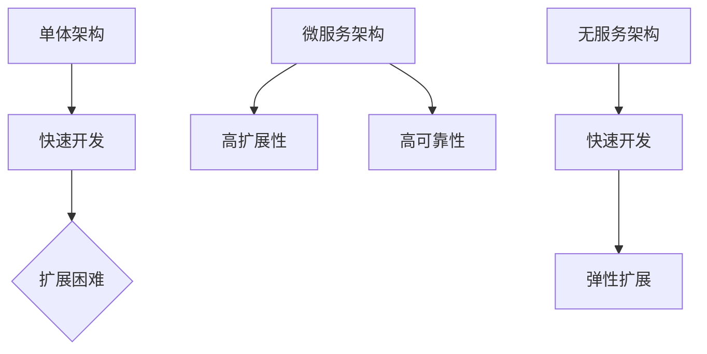

                 

# AI创业公司的技术架构演进：单体架构、微服务架构与无服务架构

> 关键词：AI创业公司、技术架构、单体架构、微服务架构、无服务架构

在当前快速发展的AI创业公司中，技术架构的选择显得尤为关键。本文将详细探讨单体架构、微服务架构与无服务架构这三种主流的技术架构，分析它们在不同场景下的适用性，并探讨如何根据公司的发展阶段和业务需求进行选择和演进。

## 1. 背景介绍（Background Introduction）

AI创业公司往往面临着快速迭代的研发需求、不断变化的业务模式以及日益增长的数据处理需求。这些因素使得技术架构的选择成为公司能否成功的关键因素之一。

### 单体架构（Monolithic Architecture）

单体架构是将所有的业务逻辑、数据库、前端和后端都集成在一个单一的代码库中。这种架构在初创阶段因其简单性和快速开发的优势而被广泛采用。

### 微服务架构（Microservices Architecture）

微服务架构将应用程序拆分为多个独立的、松耦合的服务。每个服务负责不同的业务功能，可以独立部署和扩展。这种架构适用于需要高扩展性和高可靠性的业务场景。

### 无服务架构（Serverless Architecture）

无服务架构将应用程序部署在第三方云服务提供商的基础设施上，无需管理底层硬件和服务器。这种架构适用于需要快速开发和弹性扩展的业务场景。

## 2. 核心概念与联系（Core Concepts and Connections）

### 单体架构（Monolithic Architecture）

**核心概念：** 单体架构将所有组件集成在一个单一的代码库中，开发简单，但扩展困难。

**联系：** 单体架构适用于初创公司，因为其快速开发和简单部署的优势。

### 微服务架构（Microservices Architecture）

**核心概念：** 微服务架构将应用程序拆分为多个独立的、松耦合的服务。

**联系：** 微服务架构适用于需要高扩展性和高可靠性的业务场景，如电子商务、金融科技等。

### 无服务架构（Serverless Architecture）

**核心概念：** 无服务架构将应用程序部署在第三方云服务提供商的基础设施上。

**联系：** 无服务架构适用于需要快速开发和弹性扩展的业务场景，如物联网、移动应用等。

### Mermaid 流程图



## 3. 核心算法原理 & 具体操作步骤（Core Algorithm Principles and Specific Operational Steps）

### 单体架构（Monolithic Architecture）

**核心算法原理：** 单体架构的核心算法是将所有业务逻辑集成在一个代码库中，通过编译和部署来完成整个应用程序。

**具体操作步骤：**
1. 设计应用程序的整体架构。
2. 开发前端、后端和数据库。
3. 编译和部署应用程序。

### 微服务架构（Microservices Architecture）

**核心算法原理：** 微服务架构的核心算法是将应用程序拆分为多个独立的、松耦合的服务，每个服务都有自己的数据库和业务逻辑。

**具体操作步骤：**
1. 分析业务需求，确定需要拆分的服务。
2. 设计每个服务的接口和数据库。
3. 开发和部署每个服务。
4. 使用API网关来统一访问所有服务。

### 无服务架构（Serverless Architecture）

**核心算法原理：** 无服务架构的核心算法是将应用程序部署在第三方云服务提供商的基础设施上，无需管理底层硬件和服务器。

**具体操作步骤：**
1. 选择合适的云服务提供商。
2. 设计应用程序的架构。
3. 开发和部署函数。
4. 使用API网关来统一访问函数。

## 4. 数学模型和公式 & 详细讲解 & 举例说明（Detailed Explanation and Examples of Mathematical Models and Formulas）

### 单体架构（Monolithic Architecture）

**数学模型和公式：** 单体架构没有特定的数学模型和公式，因为它主要关注于应用程序的整体架构。

**详细讲解：** 单体架构的核心在于将所有组件集成在一个代码库中，这样可以快速开发和部署应用程序。

**举例说明：** 假设一个电商平台，可以使用单体架构将其前端、后端和数据库集成在一起，快速开发并上线。

### 微服务架构（Microservices Architecture）

**数学模型和公式：** 微服务架构没有特定的数学模型和公式，因为它主要关注于应用程序的拆分和服务管理。

**详细讲解：** 微服务架构的核心在于将应用程序拆分为多个独立的、松耦合的服务，这样可以提高扩展性和可靠性。

**举例说明：** 假设一个电商平台，可以使用微服务架构将其拆分为用户服务、商品服务、订单服务等，每个服务都有独立的数据库和业务逻辑。

### 无服务架构（Serverless Architecture）

**数学模型和公式：** 无服务架构没有特定的数学模型和公式，因为它主要关注于应用程序的部署和管理。

**详细讲解：** 无服务架构的核心在于将应用程序部署在第三方云服务提供商的基础设施上，无需管理底层硬件和服务器。

**举例说明：** 假设一个电商平台，可以使用无服务架构将其订单处理函数部署在AWS Lambda上，实现快速开发和弹性扩展。

## 5. 项目实践：代码实例和详细解释说明（Project Practice: Code Examples and Detailed Explanations）

### 单体架构（Monolithic Architecture）

**代码实例：** 假设一个简单的用户注册功能。

```java
public class UserController {
    private UserService userService;

    public UserController(UserService userService) {
        this.userService = userService;
    }

    public ResponseEntity<User> register(User user) {
        userService.save(user);
        return ResponseEntity.ok().body(user);
    }
}
```

**详细解释：** 这个例子展示了如何在一个单体架构中实现用户注册功能。`UserController` 负责处理用户注册的HTTP请求，并将其传递给 `UserService` 进行保存。

### 微服务架构（Microservices Architecture）

**代码实例：** 假设一个用户服务。

```java
public class UserService {
    private UserRepository userRepository;

    public User findByUsername(String username) {
        return userRepository.findByUsername(username);
    }

    public void save(User user) {
        userRepository.save(user);
    }
}
```

**详细解释：** 这个例子展示了如何在一个微服务架构中实现用户服务。`UserService` 负责处理用户相关的业务逻辑，如查找用户和保存用户。

### 无服务架构（Serverless Architecture）

**代码实例：** 假设一个订单处理函数。

```python
def handle_order(event, context):
    order = json.loads(event['body'])
    order_id = order['orderId']
    # 处理订单逻辑
    return {
        'statusCode': 200,
        'body': json.dumps('Order processed successfully')
    }
```

**详细解释：** 这个例子展示了如何在一个无服务架构中实现订单处理函数。`handle_order` 函数负责处理来自API网关的订单处理请求，并返回处理结果。

## 6. 实际应用场景（Practical Application Scenarios）

### 单体架构（Monolithic Architecture）

- 适用场景：初创公司、小型项目、内部工具。
- 优点：开发简单、快速部署。
- 缺点：扩展困难、维护成本高。

### 微服务架构（Microservices Architecture）

- 适用场景：大型项目、需要高扩展性和高可靠性的业务场景。
- 优点：高扩展性、高可靠性。
- 缺点：开发复杂、维护成本高。

### 无服务架构（Serverless Architecture）

- 适用场景：快速迭代、需要弹性扩展的业务场景。
- 优点：快速开发、弹性扩展。
- 缺点：成本高、技术依赖强。

## 7. 工具和资源推荐（Tools and Resources Recommendations）

### 7.1 学习资源推荐（书籍/论文/博客/网站等）

- 《微服务设计》：详细介绍了微服务架构的设计原则和实践。
- 《Serverless 架构》：介绍了无服务架构的概念、优点和实施方法。
- 云服务提供商的官方文档：如AWS、Azure、Google Cloud等。

### 7.2 开发工具框架推荐

- Spring Boot：用于开发单体架构的应用程序。
- Spring Cloud：用于开发微服务架构的应用程序。
- AWS Lambda、Azure Functions、Google Cloud Functions：用于开发无服务架构的应用程序。

### 7.3 相关论文著作推荐

- Martin Fowler：《微服务：设计、开发与部署》
- James Lewis & Martin Fowler：《无服务架构：探索后端即服务》

## 8. 总结：未来发展趋势与挑战（Summary: Future Development Trends and Challenges）

随着技术的不断进步，AI创业公司的技术架构也在不断演进。未来，单体架构将继续适用于小型项目和内部工具，微服务架构将继续适用于大型项目和需要高扩展性的业务场景，而无服务架构将因其快速开发和弹性扩展的优势而在更多场景中得到应用。

然而，这三种架构也面临着各自的挑战。单体架构的扩展困难、维护成本高，微服务架构的开发复杂、维护成本高，而无服务架构的成本高、技术依赖强。

因此，AI创业公司在选择技术架构时需要根据自身的发展阶段、业务需求和资源状况进行综合考虑，并不断演进和优化技术架构，以实现持续的业务创新和增长。

## 9. 附录：常见问题与解答（Appendix: Frequently Asked Questions and Answers）

### 9.1 单体架构与微服务架构的区别是什么？

单体架构将所有业务逻辑集成在一个单一的代码库中，而微服务架构将应用程序拆分为多个独立的、松耦合的服务。单体架构适用于初创公司和小型项目，而微服务架构适用于大型项目和需要高扩展性的业务场景。

### 9.2 无服务架构与微服务架构的区别是什么？

无服务架构将应用程序部署在第三方云服务提供商的基础设施上，无需管理底层硬件和服务器，而微服务架构将应用程序拆分为多个独立的、松耦合的服务，并可以在不同的环境中部署和扩展。无服务架构适用于快速开发和弹性扩展的业务场景，而微服务架构适用于需要高扩展性和高可靠性的业务场景。

### 9.3 选择技术架构时应该考虑哪些因素？

选择技术架构时应该考虑以下因素：

- 业务需求：业务需求决定了选择哪种架构更合适。
- 扩展性：业务规模是否需要高扩展性。
- 可靠性：业务是否需要高可靠性。
- 维护成本：维护成本是否在预算范围内。
- 技术团队：技术团队能否熟练掌握所选架构。

## 10. 扩展阅读 & 参考资料（Extended Reading & Reference Materials）

- 《微服务设计》：Martin Fowler
- 《Serverless 架构》：James Lewis & Martin Fowler
- AWS 官方文档
- Azure 官方文档
- Google Cloud 官方文档

### 作者署名

作者：禅与计算机程序设计艺术 / Zen and the Art of Computer Programming

