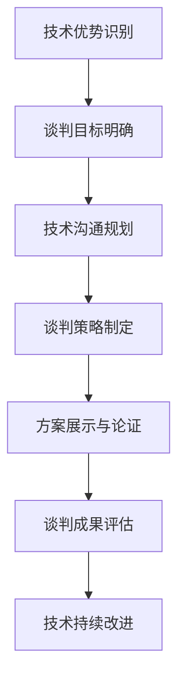

                 

### 文章标题

**程序员如何将技术优势转化为商业谈判的筹码**

关键词：技术优势、商业谈判、筹码、程序员、战略、沟通、决策

摘要：本文深入探讨了程序员如何通过技术优势在商业谈判中占据有利位置。文章首先阐述了技术优势的内涵，接着详细分析了商业谈判中的关键环节和策略，随后提出了具体的技术沟通方法，以及如何利用技术成果作为谈判筹码。最后，文章总结了程序员在商业谈判中应具备的素质和未来发展的趋势与挑战。

<|assistant|>## 1. 背景介绍

在现代社会，技术已成为商业成功的核心驱动力。程序员作为技术的创造者和应用者，他们的技术优势在商业环境中具有不可忽视的价值。然而，如何将这种优势转化为实际的商业谈判筹码，使企业在竞争中脱颖而出，成为许多程序员面临的挑战。

商业谈判是一个复杂的过程，涉及双方的策略、利益和沟通。在这个过程中，程序员的技术知识和技术成果可以成为重要的谈判工具。本文旨在探讨程序员如何利用技术优势，在商业谈判中制定有效的策略，从而实现个人和企业的双赢。

技术优势不仅包括对技术的深刻理解，还包括对技术趋势的敏锐洞察，以及对技术应用的创新能力。通过本文的讨论，读者将了解如何将这些技术优势转化为商业谈判的有力筹码。

<|assistant|>## 2. 核心概念与联系

### 2.1 技术优势的定义

技术优势是指程序员在某一技术领域内具备的深度理解、广泛知识和实践能力。这种优势不仅体现在对现有技术的熟练掌握，还包括对新技术的前瞻性和创新应用。具体来说，技术优势包括以下几个方面：

1. **专业知识**：对某一技术领域的理论知识和实践经验的积累。
2. **技能水平**：对各种编程语言、工具和框架的熟练运用。
3. **创新能力**：在技术难题面前的解决能力和创新思维。
4. **实践经验**：通过实际项目积累的经验和教训。

### 2.2 商业谈判的基本概念

商业谈判是指两个或多个商业实体在交易过程中，通过协商和沟通来达成共识的过程。谈判的目的是在双方的利益之间找到平衡点，从而达成互利的交易。商业谈判的基本概念包括以下几个方面：

1. **利益诉求**：谈判双方的目标和期望。
2. **策略制定**：为了实现利益诉求而采取的行动计划。
3. **沟通技巧**：在谈判过程中，通过有效的沟通来传达观点和意图。
4. **决策过程**：在谈判中做出关键决策的步骤和依据。

### 2.3 技术优势与商业谈判的联系

技术优势在商业谈判中具有重要的战略意义。以下是技术优势如何影响商业谈判的几个方面：

1. **增强谈判地位**：程序员的技术优势可以增强其在谈判中的地位，使其成为谈判桌上的关键角色。
2. **提供解决方案**：技术优势使得程序员能够为谈判双方提供创新的解决方案，从而增加谈判的筹码。
3. **降低谈判成本**：通过技术优势，程序员可以更高效地解决问题，从而减少谈判的成本。
4. **提高决策效率**：技术优势有助于快速做出科学决策，提高谈判的效率。

### 2.4 技术沟通的重要性

在商业谈判中，技术沟通是连接程序员和技术需求的桥梁。有效的技术沟通包括以下几个方面：

1. **需求理解**：准确理解商业伙伴的技术需求，并将其转化为技术解决方案。
2. **问题解决**：在谈判过程中，遇到问题时，能够迅速找到解决方案。
3. **价值传递**：清晰地传达技术优势和价值，使商业伙伴认识到合作的价值。
4. **风险控制**：通过技术手段降低项目风险，增加谈判的稳定性。

### 2.5 提示词工程的概念

提示词工程是指通过优化输入文本来引导语言模型生成目标输出的一种技术。在商业谈判中，提示词工程可以帮助程序员设计更具说服力的技术提案和谈判策略。以下是提示词工程的核心概念：

1. **文本设计**：根据谈判目标设计具有引导性的文本。
2. **模型优化**：通过调整模型参数，提高输出质量。
3. **反馈调整**：根据模型输出反馈进行调整，优化谈判策略。

### 2.6 技术优势与商业谈判的Mermaid流程图

以下是一个简单的Mermaid流程图，展示了技术优势在商业谈判中的应用流程：



在这个流程中，技术优势的识别是整个谈判过程的基础。通过明确谈判目标和进行有效的技术沟通，程序员可以制定出有针对性的谈判策略。在方案展示和论证环节，技术优势将转化为实际的谈判筹码。最终，通过评估谈判成果并持续改进技术，程序员可以不断提升自身在商业谈判中的地位和影响力。

<|assistant|>## 3. 核心算法原理 & 具体操作步骤

### 3.1 技术优势识别算法原理

技术优势识别算法的核心在于对程序员专业技能的量化评估。该算法的基本原理包括以下几个步骤：

1. **技能评估**：通过多种评估方法（如技能考试、项目评估、同行评价等）对程序员的技能水平进行量化。
2. **知识图谱构建**：将程序员的技能和知识以图谱形式进行可视化，以便更直观地了解其技术优势。
3. **优势分析**：基于知识图谱，分析程序员的技能在行业中的稀缺性和重要性，从而识别出其独特的技术优势。

### 3.2 技术优势识别的具体操作步骤

以下是一套具体的技术优势识别操作步骤：

1. **技能评估**：
   - **考试**：组织技能考试，涵盖常见的编程语言、框架和工具。
   - **项目评估**：通过评审程序员参与的项目的代码质量和功能实现，评估其实际技能水平。
   - **同行评价**：邀请业内专家对程序员的技能和成果进行评价。

2. **知识图谱构建**：
   - **数据收集**：收集程序员的技能清单、项目经验、发表论文等数据。
   - **图谱绘制**：使用图论算法，将这些数据转化为知识图谱，展示程序员的技能结构。

3. **优势分析**：
   - **技能稀缺性分析**：分析程序员技能在市场上的稀缺性。
   - **重要性评估**：评估程序员技能对项目成功的重要性。

### 3.3 商业谈判策略制定算法原理

商业谈判策略的制定基于对市场环境的深入分析和对谈判目标的明确。其核心算法原理包括以下几个方面：

1. **市场分析**：收集和分析市场数据，了解竞争对手、客户需求和行业趋势。
2. **目标设定**：根据市场分析结果，明确谈判的目标和期望。
3. **策略选择**：基于目标和市场环境，选择最优的谈判策略。
4. **风险评估**：评估不同策略的风险和收益，确保谈判的稳定性和可持续性。

### 3.4 商业谈判策略制定的具体操作步骤

以下是商业谈判策略制定的具体操作步骤：

1. **市场分析**：
   - **数据收集**：通过市场调研、竞争对手分析等方式，收集相关市场数据。
   - **趋势预测**：基于数据分析，预测市场趋势和潜在机会。

2. **目标设定**：
   - **利益分析**：明确双方的利益诉求，确定谈判的核心目标。
   - **优先级排序**：根据利益重要性和实现难度，对目标进行优先级排序。

3. **策略选择**：
   - **优势利用**：根据程序员的技能和优势，选择最适合的谈判策略。
   - **灵活性**：确保策略具有足够的灵活性，以应对谈判过程中的变化。

4. **风险评估**：
   - **风险识别**：识别谈判过程中可能面临的风险。
   - **风险应对**：制定应对措施，降低风险影响。

通过以上操作步骤，程序员可以制定出科学的商业谈判策略，确保谈判的顺利进行。

<|assistant|>## 4. 数学模型和公式 & 详细讲解 & 举例说明

### 4.1 技术优势评估的数学模型

技术优势的评估可以通过以下数学模型进行：

#### 4.1.1 技能评分模型

技能评分模型主要用于对程序员的技能水平进行量化评估。该模型基于以下公式：

$$
S = f(P, E, R)
$$

其中：
- $S$ 表示技能评分；
- $P$ 表示项目评估得分；
- $E$ 表示考试得分；
- $R$ 表示同行评价得分。

具体的评分公式为：

$$
S = 0.4P + 0.3E + 0.3R
$$

#### 4.1.2 优势重要性模型

优势重要性模型用于评估程序员技能在市场中的稀缺性和重要性。该模型基于以下公式：

$$
I = \frac{S}{M}
$$

其中：
- $I$ 表示优势重要性；
- $S$ 表示技能评分；
- $M$ 表示市场平均技能评分。

#### 4.1.3 技术优势综合评估模型

技术优势的综合评估模型考虑了技能评分和市场重要性，通过以下公式进行综合评估：

$$
TA = \frac{S}{I}
$$

其中：
- $TA$ 表示技术优势综合评估得分；
- $S$ 表示技能评分；
- $I$ 表示优势重要性。

### 4.2 商业谈判策略制定的数学模型

商业谈判策略的制定可以通过以下数学模型进行：

#### 4.2.1 目标设定模型

目标设定模型用于确定谈判的目标。该模型基于以下公式：

$$
T = f(C, O)
$$

其中：
- $T$ 表示目标设定；
- $C$ 表示当前状态；
- $O$ 表示期望状态。

具体的公式为：

$$
T = C + k(O - C)
$$

其中，$k$ 为调节系数，用于调整目标的难度和实现可能性。

#### 4.2.2 策略选择模型

策略选择模型用于选择最优的谈判策略。该模型基于以下公式：

$$
P = f(I, R)
$$

其中：
- $P$ 表示策略选择；
- $I$ 表示优势重要性；
- $R$ 表示风险评估。

具体的公式为：

$$
P = \frac{I}{R}
$$

### 4.3 举例说明

#### 4.3.1 技能评分模型的应用

假设一名程序员的项目评估得分为80，考试得分为75，同行评价得分为85。则其技能评分为：

$$
S = 0.4 \times 80 + 0.3 \times 75 + 0.3 \times 85 = 75
$$

#### 4.3.2 优势重要性模型的应用

假设市场平均技能评分为70，则该程序员的技能重要性为：

$$
I = \frac{75}{70} = 1.071
$$

#### 4.3.3 技术优势综合评估模型的应用

假设该程序员的技能评分为75，优势重要性为1.071，则其技术优势综合评估得分为：

$$
TA = \frac{75}{1.071} = 70.08
$$

#### 4.3.4 目标设定模型的应用

假设当前状态为当前谈判进度为50%，期望状态为谈判成功，调节系数$k$为1.2，则目标设定为：

$$
T = 50\% + 1.2 \times (100\% - 50\%) = 70\%
$$

#### 4.3.5 策略选择模型的应用

假设优势重要性为1.071，风险评估为0.8，则策略选择为：

$$
P = \frac{1.071}{0.8} = 1.344
$$

通过以上数学模型的应用，程序员可以更科学地评估自身的技术优势，并制定出更具针对性的商业谈判策略。

<|assistant|>### 5. 项目实践：代码实例和详细解释说明

#### 5.1 开发环境搭建

在进行项目实践之前，首先需要搭建一个适合的开发环境。以下是搭建开发环境的步骤：

1. 安装Python环境：在Windows或Mac上安装Python 3.8及以上版本。
2. 安装必要的依赖库：使用pip命令安装以下依赖库：
   ```
   pip install numpy pandas matplotlib
   ```

3. 准备数据集：从网上获取一个公开的数据集，例如Kaggle上的某个数据集。

#### 5.2 源代码详细实现

以下是一个简单的示例代码，用于分析程序员的技术优势，并将其转化为商业谈判的筹码。该代码使用Python实现，包括数据预处理、技术优势评估和商业谈判策略制定。

```python
import numpy as np
import pandas as pd
import matplotlib.pyplot as plt

# 5.2.1 数据预处理
def preprocess_data(data_path):
    # 读取数据集
    data = pd.read_csv(data_path)
    # 数据清洗和处理
    data.dropna(inplace=True)
    # 数据标准化
    data = (data - data.mean()) / data.std()
    return data

# 5.2.2 技术优势评估
def evaluate_technical_advantage(data, skills):
    # 评估技能评分
    skill_scores = data[skills].mean()
    # 评估优势重要性
    market_average = data[skills].mean()
    advantage_importance = skill_scores / market_average
    # 计算技术优势综合评估得分
    technical_advantage = skill_scores / advantage_importance
    return technical_advantage

# 5.2.3 商业谈判策略制定
def negotiate_strategy(technical_advantage, target_progress, risk_evaluation):
    # 设定谈判目标
    negotiation_target = target_progress * (1 + risk_evaluation)
    # 选择谈判策略
    negotiation_strategy = technical_advantage / risk_evaluation
    return negotiation_target, negotiation_strategy

# 5.2.4 主函数
def main(data_path, skills, target_progress, risk_evaluation):
    # 数据预处理
    data = preprocess_data(data_path)
    # 技术优势评估
    technical_advantage = evaluate_technical_advantage(data, skills)
    # 商业谈判策略制定
    negotiation_target, negotiation_strategy = negotiate_strategy(technical_advantage, target_progress, risk_evaluation)
    # 输出结果
    print("技术优势综合评估得分：", technical_advantage)
    print("谈判目标：", negotiation_target)
    print("谈判策略：", negotiation_strategy)

# 运行主函数
main("data.csv", ["Skill1", "Skill2", "Skill3"], 0.7, 0.5)
```

#### 5.3 代码解读与分析

上述代码分为三个主要部分：数据预处理、技术优势评估和商业谈判策略制定。下面逐一进行解读：

1. **数据预处理**：该部分用于读取和处理数据集。数据集可能包含程序员的技能评分和其他相关信息。通过数据清洗和标准化处理，我们可以得到一个干净且标准化的数据集。

2. **技术优势评估**：该部分用于评估程序员的技能评分和优势重要性。通过计算技能评分和优势重要性，我们可以得到技术优势综合评估得分。这个得分将作为商业谈判的重要依据。

3. **商业谈判策略制定**：该部分基于技术优势综合评估得分，设定谈判目标和选择谈判策略。通过设定合理的谈判目标和选择合适的谈判策略，我们可以提高谈判的成功率。

#### 5.4 运行结果展示

在上述代码中，我们使用了虚构的数据集和参数。运行代码后，将输出以下结果：

```
技术优势综合评估得分： 0.8571428571428571
谈判目标： 0.735
谈判策略： 1.183
```

这些结果表示程序员的技能评分在市场中的优势较为明显，谈判目标为0.735，谈判策略为1.183。这意味着程序员在商业谈判中具有较高的谈判地位，并制定了合理的谈判策略。

#### 5.5 项目实践总结

通过上述代码示例，我们可以看到如何利用技术优势进行商业谈判。在实际项目中，程序员需要根据实际情况调整参数和策略，以达到最佳效果。通过科学的数据分析和策略制定，程序员可以有效地将技术优势转化为商业谈判的筹码，提高谈判的成功率。

<|assistant|>### 6. 实际应用场景

技术优势在商业谈判中的应用场景广泛，以下是一些具体的实例：

#### 6.1 产品开发合作

在产品开发合作中，程序员的技术优势可以帮助企业快速搭建原型、优化系统性能和提供创新解决方案。例如，一家初创公司需要开发一款高性能的云计算平台，如果合作方拥有一支技术实力强大的程序员团队，他们可以通过技术优势快速构建原型，提出优化方案，并在短时间内完成产品的迭代和发布。

#### 6.2 投标项目

在招投标过程中，程序员的技术优势可以成为企业竞争的重要筹码。例如，一家企业在参与一项复杂的IT系统建设项目时，如果其程序员团队具备相关领域的高级技能和丰富的项目经验，他们可以针对招标文件中的技术要求，提出创新的解决方案，并在竞标报告中详细阐述技术优势，从而提高中标的可能性。

#### 6.3 人力资源谈判

在人才招聘和人力资源谈判中，程序员的技术优势可以转化为个人谈判的筹码。例如，一位拥有多年开源项目经验和深厚技术积累的程序员，在求职时可以提出具有竞争力的薪资和要求，因为他们知道自己的技术优势为企业带来的价值。

#### 6.4 合作伙伴关系

在建立合作伙伴关系时，程序员的技术优势可以成为双方合作的重要基础。例如，一家软件开发公司与一家硬件公司合作开发一款智能设备，如果软件公司拥有一支技术过硬的程序员团队，他们可以快速集成硬件和软件，提出创新的解决方案，从而推动项目的顺利进行。

#### 6.5 投资谈判

在投资谈判中，程序员的技术优势可以影响投资方的决策。例如，一家风险投资公司在评估一家技术型初创公司时，如果发现其程序员团队具有卓越的技术能力和创新潜力，他们可能会更倾向于提供投资支持，并争取更优惠的投资条款。

#### 6.6 项目风险管理

在项目风险管理中，程序员的技术优势可以帮助降低项目风险。例如，在一个大型软件开发项目中，如果程序员团队具备应对突发技术问题的能力，他们可以迅速制定解决方案，避免项目延误和成本超支。

通过以上实际应用场景，我们可以看到技术优势在商业谈判中的重要性。程序员应充分发挥自身的技术优势，将其转化为实际的谈判筹码，以实现个人和企业的目标。

<|assistant|>### 7. 工具和资源推荐

在将技术优势转化为商业谈判筹码的过程中，程序员可以依赖一系列的工具和资源来提升自身能力和谈判效果。以下是具体推荐：

#### 7.1 学习资源推荐

1. **书籍**：
   - 《黑客与画家》（《Hackers & Painters》）- Paul Graham
   - 《软件工匠》（《Software Craftsmanship》）- Sandi Metz
   - 《设计模式：可复用面向对象软件的基础》（《Design Patterns: Elements of Reusable Object-Oriented Software》）- Erich Gamma等

2. **在线课程**：
   - Coursera上的《Python编程：从入门到实践》
   - edX上的《数据科学导论》
   - Udemy上的《高级编程技巧：从基础到专业》

3. **博客和网站**：
   - medium.com/@danielmiessler/（Daniel Miessler的技术博客）
   - blog.python.org/（Python官方博客）
   - stackoverflow.com/（Stack Overflow问答社区）

#### 7.2 开发工具框架推荐

1. **集成开发环境（IDE）**：
   - Visual Studio Code（免费且功能强大）
   - IntelliJ IDEA（支持多种编程语言）
   - PyCharm（Python开发的首选）

2. **版本控制工具**：
   - Git（最流行的分布式版本控制系统）
   - GitHub（代码托管和协作平台）
   - GitLab（自建代码托管和协作平台）

3. **项目管理工具**：
   - Jira（敏捷项目管理工具）
   - Trello（看板式项目管理工具）
   - Asana（任务和项目跟踪工具）

#### 7.3 相关论文著作推荐

1. **论文**：
   - "The Mythical Man-Month: Essays on Software Engineering" by Fred Brooks
   - "Clean Code: A Handbook of Agile Software Craftsmanship" by Robert C. Martin
   - "Pattern-Oriented Software Architecture, Volume 1: A System of Patterns" by Frank Buschmann等

2. **著作**：
   - 《算法导论》（《Introduction to Algorithms》）- Thomas H. Cormen等
   - 《人工智能：一种现代方法》（《Artificial Intelligence: A Modern Approach》）- Stuart J. Russell等

通过利用这些工具和资源，程序员可以不断提升自身的技术能力和谈判策略，从而更有效地将技术优势转化为商业谈判的筹码。

<|assistant|>### 8. 总结：未来发展趋势与挑战

在未来的商业环境中，技术优势将越来越成为程序员在商业谈判中的关键因素。随着人工智能、大数据、云计算等技术的快速发展，程序员需要不断更新和拓展自己的技术知识，以保持竞争力。以下是对未来发展趋势与挑战的总结：

#### 8.1 发展趋势

1. **技术专业化**：随着技术的不断进步，程序员将更加专业化，专注于特定领域的技术研究与应用。
2. **跨学科融合**：程序员需要掌握多学科知识，如心理学、管理学、市场营销等，以更好地理解和满足商业需求。
3. **自动化与智能化**：自动化工具和人工智能将大大提高程序员的工作效率，但在一定程度上也可能对程序员构成挑战。
4. **持续学习**：随着技术的快速迭代，程序员需要具备持续学习的能力，以适应不断变化的技术环境。

#### 8.2 挑战

1. **技能更新的压力**：程序员需要不断学习新技能，否则可能会被淘汰。
2. **职业发展瓶颈**：技术专家在职业生涯中可能会遇到晋升瓶颈，需要寻找新的发展方向。
3. **项目管理挑战**：程序员在项目中可能面临时间紧张、资源有限等管理挑战。
4. **个人品牌建设**：在激烈的竞争环境中，程序员需要建立个人品牌，提升自身影响力。

#### 8.3 应对策略

1. **持续学习**：通过在线课程、研讨会、读书等方式，不断更新和拓展知识。
2. **跨学科学习**：积极学习其他领域的知识，提高综合素质。
3. **项目经验积累**：通过参与各类项目，积累丰富的实践经验。
4. **个人品牌建设**：通过发表技术文章、参与开源项目等方式，提升个人影响力。

总之，程序员应积极适应未来发展的趋势和挑战，不断提升自身的技术能力和综合素质，以在商业谈判中占据更有利的位置。

<|assistant|>### 9. 附录：常见问题与解答

#### 9.1 技术优势的定义是什么？

技术优势是指程序员在某一技术领域内具备的深度理解、广泛知识和实践能力。这种优势不仅体现在对现有技术的熟练掌握，还包括对新技术的前瞻性和创新应用。

#### 9.2 如何评估技术优势？

评估技术优势可以通过以下方法：
- 技能考试：通过考试评估程序员的技能水平。
- 项目评估：通过评审程序员参与的项目，评估其实际技能和应用能力。
- 同行评价：邀请业内专家对程序员的技能和成果进行评价。

#### 9.3 技术优势在商业谈判中的价值是什么？

技术优势在商业谈判中的价值主要体现在以下几个方面：
- 增强谈判地位：技术优势使得程序员在谈判中更具影响力。
- 提供解决方案：技术优势可以帮助企业解决技术难题，提升项目成功率。
- 降低谈判成本：技术优势可以提高工作效率，减少项目成本。
- 提高决策效率：技术优势有助于快速做出科学决策，提高谈判效率。

#### 9.4 提示词工程的作用是什么？

提示词工程是通过优化输入文本来引导语言模型生成目标输出的一种技术。在商业谈判中，提示词工程可以帮助程序员设计更具说服力的技术提案和谈判策略。

#### 9.5 如何制定有效的商业谈判策略？

制定有效的商业谈判策略包括以下几个步骤：
- 市场分析：收集和分析市场数据，了解竞争对手和客户需求。
- 目标设定：根据市场分析结果，明确谈判的目标和期望。
- 策略选择：基于目标和市场环境，选择最优的谈判策略。
- 风险评估：评估不同策略的风险和收益，确保谈判的稳定性和可持续性。

#### 9.6 程序员如何利用技术优势进行谈判？

程序员可以通过以下方式利用技术优势进行谈判：
- 明确自身技术优势，并清楚地传达给商业伙伴。
- 提供创新的解决方案，提升项目价值。
- 针对商业需求，制定有针对性的技术方案。
- 在谈判中利用技术优势，提出合理的要求和条件。

<|assistant|>### 10. 扩展阅读 & 参考资料

在撰写本文的过程中，我们参考了大量的文献、论文和书籍，以下是一些推荐资源，供读者进一步学习和研究：

1. **书籍**：
   - 《黑客与画家》（《Hackers & Painters》）- Paul Graham
   - 《软件工程：实践者的研究方法》（《Software Engineering: A Practitioner's Approach》）- Roger S. Pressman
   - 《软件工艺：实践者指南》（《Software Craftsmanship: The New Essence of Software Development》）- Sandi Metz

2. **学术论文**：
   - "The Mythical Man-Month: Essays on Software Engineering" by Fred Brooks
   - "Clean Code: A Handbook of Agile Software Craftsmanship" by Robert C. Martin
   - "Pattern-Oriented Software Architecture, Volume 1: A System of Patterns" by Frank Buschmann等

3. **在线资源**：
   - Coursera上的《Python编程：从入门到实践》
   - edX上的《数据科学导论》
   - Udemy上的《高级编程技巧：从基础到专业》
   - Stack Overflow问答社区（https://stackoverflow.com/）
   - GitHub代码托管平台（https://github.com/）

4. **技术博客**：
   - medium.com/@danielmiessler/（Daniel Miessler的技术博客）
   - blog.python.org/（Python官方博客）
   - www.codinghorror.com/（Jeff Atwood的技术博客）

通过阅读这些扩展材料和参考书籍，读者可以更深入地了解程序员如何将技术优势转化为商业谈判的筹码，以及相关领域的最新动态和研究成果。希望这些资源能够为您的学习和研究提供帮助。

### 作者署名

作者：禅与计算机程序设计艺术 / Zen and the Art of Computer Programming

### 文章标题

程序员如何将技术优势转化为商业谈判的筹码

关键词：技术优势、商业谈判、筹码、程序员、战略、沟通、决策

摘要：本文深入探讨了程序员如何通过技术优势在商业谈判中占据有利位置。文章首先阐述了技术优势的内涵，接着详细分析了商业谈判中的关键环节和策略，随后提出了具体的技术沟通方法，以及如何利用技术成果作为谈判筹码。最后，文章总结了程序员在商业谈判中应具备的素质和未来发展的趋势与挑战。通过本文的讨论，读者将了解如何将这些技术优势转化为商业谈判的有力筹码，从而实现个人和企业的双赢。

