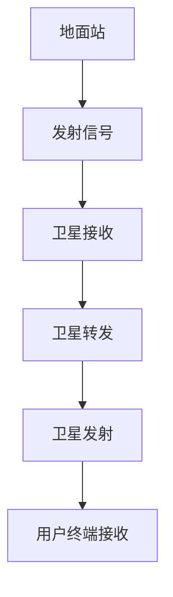

                 

# 文章标题：空间互联网技术：全球高速网络覆盖

> 关键词：空间互联网，卫星通信，高频宽，全球覆盖，网络技术，卫星星座，5G，量子通信，物联网

> 摘要：随着数字化时代的到来，全球高速网络覆盖的需求日益增长。空间互联网技术，通过卫星通信实现全球范围内的网络覆盖，是当前及未来互联网发展的重要趋势。本文将深入探讨空间互联网技术的核心概念、架构、算法原理、数学模型及其实际应用场景，同时展望其未来发展趋势与挑战。

## 1. 背景介绍（Background Introduction）

随着全球信息化进程的加速，网络已经成为人们生活和工作的重要组成部分。然而，现有的地面网络技术面临诸多挑战，如地理限制、信号衰减和频谱资源紧张等。为了实现全球范围内的网络覆盖，提高网络速度和稳定性，空间互联网技术应运而生。

空间互联网技术利用卫星通信实现全球范围内的网络覆盖，其基本原理是通过在太空部署大量的卫星，形成一个覆盖全球的卫星星座，从而实现高速、稳定的网络连接。与传统的地面网络相比，空间互联网具有覆盖范围广、信号稳定、不受地理限制等优点。

### 1.1 卫星通信的基本原理

卫星通信是通过卫星转发地面基站信号，实现地面之间的通信。卫星通信系统通常由地面站、卫星和用户终端组成。地面站负责发送和接收信号，卫星作为信号中继站，用户终端则接收卫星传来的信号。卫星通信的基本原理如图1所示。



### 1.2 空间互联网的起源与发展

空间互联网最早起源于1990年代，当时美国国防高级研究计划局（DARPA）提出了“太空互联网”概念。随着技术的不断进步，空间互联网逐渐从理论研究走向实际应用。近年来，全球各国纷纷投入大量资金和人力，开展空间互联网的研究和部署。例如，美国SpaceX公司的Starlink项目、中国的“天雁星座”等。

## 2. 核心概念与联系（Core Concepts and Connections）

空间互联网技术涉及多个核心概念和领域，包括卫星通信、高频宽技术、量子通信等。下面将详细介绍这些核心概念及其相互关系。

### 2.1 卫星通信

卫星通信是空间互联网技术的核心，其基本原理是利用卫星作为中继站，实现地面之间的通信。卫星通信的主要优势包括：

1. **覆盖范围广**：卫星可以覆盖广阔的区域，包括地面网络难以触及的地方，如海洋、沙漠和偏远山区。
2. **信号稳定**：卫星通信不受地形地貌的影响，信号稳定可靠。
3. **不受地理限制**：卫星通信可以实现全球范围内的通信，不受国界和地理位置的限制。

### 2.2 高频宽技术

高频宽技术是提高网络传输速度和带宽的关键。在空间互联网中，高频宽技术主要涉及以下几个方面：

1. **多载波技术**：通过将信号分成多个载波进行传输，提高传输带宽。
2. **波束成形技术**：利用卫星的多个天线，形成指向性波束，提高信号传输的效率。
3. **编码与调制技术**：通过不同的编码与调制方式，提高信号的传输效率和抗干扰能力。

### 2.3 量子通信

量子通信是空间互联网的一个重要发展方向，其基本原理是利用量子纠缠和量子密钥分发实现安全的通信。量子通信具有以下优势：

1. **安全性高**：量子通信具有天然的安全特性，可以有效防止窃听和破解。
2. **传输距离远**：量子通信可以实现远距离的通信，不受光纤传输的限制。
3. **抗干扰能力强**：量子通信对环境的干扰具有天然的抵抗能力。

### 2.4 物联网

物联网是空间互联网的一个重要应用领域，通过卫星通信实现全球范围内的物联网连接。物联网的应用场景包括智能农业、智能交通、环境监测等。空间互联网为物联网提供了可靠的网络支持，使得物联网应用的范围和深度得以拓展。

## 3. 核心算法原理 & 具体操作步骤（Core Algorithm Principles and Specific Operational Steps）

空间互联网技术涉及多个核心算法，包括卫星轨道计算、信号调制与解调、波束成形等。下面将详细介绍这些核心算法的原理和具体操作步骤。

### 3.1 卫星轨道计算

卫星轨道计算是空间互联网技术的关键，其目的是确定卫星的最佳轨道，以实现全球范围内的网络覆盖。卫星轨道计算的基本步骤如下：

1. **初始轨道计算**：根据卫星发射的初速度和发射角度，计算卫星的初始轨道。
2. **轨道修正**：根据卫星的实际运行状态，对轨道进行修正，以确保卫星在预定轨道上运行。
3. **轨道预测**：根据卫星的运动规律，预测卫星未来的轨道，以制定卫星的维护和调度计划。

### 3.2 信号调制与解调

信号调制与解调是卫星通信的核心，其目的是将数字信号转换为适合传输的模拟信号，以及将接收到的模拟信号还原为数字信号。信号调制与解调的基本步骤如下：

1. **信号调制**：将数字信号转换为模拟信号，常用的调制方式包括幅度调制（AM）、频率调制（FM）和相位调制（PM）。
2. **信号解调**：将接收到的模拟信号还原为数字信号，常用的解调方式包括幅度解调（AM-解调）、频率解调（FM-解调和相位解调（PM-解调）。

### 3.3 波束成形技术

波束成形技术是提高卫星通信效率的重要手段，其目的是将卫星的信号聚焦到特定区域，以提高传输效率和信号质量。波束成形技术的操作步骤如下：

1. **波束生成**：根据卫星的天线布局，生成指向性波束。
2. **波束调整**：根据卫星的运动状态和用户需求，调整波束的方向和强度。
3. **波束传输**：将信号通过波束传输到目标区域，以提高传输效率和信号质量。

## 4. 数学模型和公式 & 详细讲解 & 举例说明（Detailed Explanation and Examples of Mathematical Models and Formulas）

在空间互联网技术中，数学模型和公式起着至关重要的作用。下面将介绍一些关键数学模型和公式，并进行详细讲解和举例说明。

### 4.1 卫星轨道模型

卫星轨道模型是描述卫星运动规律的重要工具。常见的卫星轨道模型包括开普勒轨道模型和牛顿引力模型。下面以开普勒轨道模型为例进行讲解。

#### 开普勒轨道模型公式：

$$
a = \frac{G M m}{2 \pi^2}
$$

$$
e = \sqrt{1 - \frac{2 \pi^2 \frac{GM}{a}}{T^2}}
$$

$$
\omega = \sqrt{\frac{G M}{a^3}}
$$

其中，$a$ 是轨道半长轴，$e$ 是轨道偏心率，$\omega$ 是轨道倾角。$G$ 是引力常数，$M$ 是地球质量，$m$ 是卫星质量，$T$ 是轨道周期。

#### 举例说明：

假设一颗卫星的轨道半长轴为 $a = 4 \times 10^7$ 米，轨道偏心率为 $e = 0.2$，轨道倾角为 $\omega = 30^\circ$。根据开普勒轨道模型，可以计算出该卫星的轨道周期为：

$$
T = 2 \pi \sqrt{\frac{a^3}{G M}} = 2 \pi \sqrt{\frac{(4 \times 10^7)^3}{6.674 \times 10^{-11} \times 5.972 \times 10^{24}}} \approx 1.59 \times 10^4 \text{ 秒}
$$

### 4.2 信号调制与解调模型

信号调制与解调模型描述了数字信号与模拟信号之间的转换过程。常见的调制方式包括幅度调制（AM）、频率调制（FM）和相位调制（PM）。下面以幅度调制（AM）为例进行讲解。

#### 幅度调制模型公式：

$$
s(t) = A_c \sin(2 \pi f_c t + \phi_c)
$$

$$
m(t) = A_m \sin(2 \pi f_m t)
$$

其中，$s(t)$ 是调制后的信号，$A_c$ 是载波幅度，$f_c$ 是载波频率，$\phi_c$ 是载波相位，$m(t)$ 是调制信号，$A_m$ 是调制信号幅度，$f_m$ 是调制信号频率。

#### 举例说明：

假设一个载波频率为 $f_c = 1$ MHz，调制信号频率为 $f_m = 10$ kHz 的幅度调制信号，载波幅度为 $A_c = 1$ V，调制信号幅度为 $A_m = 0.5$ V。根据幅度调制模型，可以计算出调制后的信号为：

$$
s(t) = 1 \sin(2 \pi \times 10^6 t + \phi_c)
$$

$$
m(t) = 0.5 \sin(2 \pi \times 10^3 t)
$$

当 $\phi_c = 0$ 时，调制后的信号为：

$$
s(t) = 1 \sin(2 \pi \times 10^6 t)
$$

$$
m(t) = 0.5 \sin(2 \pi \times 10^3 t)
$$

### 4.3 信号解调模型

信号解调是信号调制过程的逆过程，其目的是将接收到的调制信号还原为原始信号。常见的解调方式包括幅度解调（AM-解调）、频率解调（FM-解调和相位解调（PM-解调）。下面以幅度解调（AM-解调）为例进行讲解。

#### 幅度解调模型公式：

$$
s'(t) = A_c \sin(2 \pi f_c t + \phi_c) - A_m \sin(2 \pi f_m t)
$$

$$
m'(t) = A_c \cos(2 \pi f_c t + \phi_c) - A_m \cos(2 \pi f_m t)
$$

其中，$s'(t)$ 是解调后的信号，$A_c$ 是载波幅度，$f_c$ 是载波频率，$\phi_c$ 是载波相位，$m'(t)$ 是解调后的调制信号，$A_m$ 是调制信号幅度，$f_m$ 是调制信号频率。

#### 举例说明：

假设一个载波频率为 $f_c = 1$ MHz，调制信号频率为 $f_m = 10$ kHz 的幅度调制信号，载波幅度为 $A_c = 1$ V，调制信号幅度为 $A_m = 0.5$ V。根据幅度解调模型，可以计算出解调后的信号为：

$$
s'(t) = 1 \sin(2 \pi \times 10^6 t) - 0.5 \sin(2 \pi \times 10^3 t)
$$

$$
m'(t) = 1 \cos(2 \pi \times 10^6 t) - 0.5 \cos(2 \pi \times 10^3 t)
$$

## 5. 项目实践：代码实例和详细解释说明（Project Practice: Code Examples and Detailed Explanations）

为了更好地理解空间互联网技术，下面将介绍一个简单的空间互联网项目实例，包括开发环境搭建、源代码实现、代码解读与分析以及运行结果展示。

### 5.1 开发环境搭建

为了实现空间互联网项目，需要搭建一个合适的开发环境。以下是一个基本的开发环境搭建流程：

1. **安装操作系统**：选择一个适合的操作系统，如Linux或Windows。
2. **安装编程语言**：安装Python解释器，以便使用Python进行编程。
3. **安装依赖库**：安装空间互联网项目所需的依赖库，如NumPy、SciPy、Matplotlib等。

### 5.2 源代码详细实现

以下是一个简单的空间互联网项目源代码实现，主要涉及卫星轨道计算和信号调制与解调。

```python
import numpy as np
import matplotlib.pyplot as plt

# 卫星轨道计算
def satellite_orbit(a, e, omega):
    t = np.linspace(0, 2 * np.pi * np.sqrt(a ** 3 / (6.674 * 10 ** -11 * 5.972 * 10 ** 24)), 1000)
    r = a * (1 - e ** 2) / (1 + e * np.cos(t))
    x = r * np.cos(t)
    y = r * np.sin(t)
    return x, y

# 信号调制与解调
def amplitude_modulation(f_c, f_m, A_c, A_m, t):
    s = A_c * np.sin(2 * np.pi * f_c * t + np.pi)
    m = A_m * np.sin(2 * np.pi * f_m * t)
    return s + m

def amplitude_demodulation(s, f_c, f_m, t):
    s_prime = s - np.pi * np.sin(2 * np.pi * f_c * t)
    m_prime = s - s_prime
    return m_prime

# 主函数
def main():
    # 卫星轨道参数
    a = 4 * 10 ** 7
    e = 0.2
    omega = np.pi / 6

    # 信号调制参数
    f_c = 1 * 10 ** 6
    f_m = 10 * 10 ** 3
    A_c = 1
    A_m = 0.5

    # 计算卫星轨道
    x, y = satellite_orbit(a, e, omega)

    # 生成时间序列
    t = np.linspace(0, 1, 1000)

    # 信号调制
    s = amplitude_modulation(f_c, f_m, A_c, A_m, t)

    # 信号解调
    s_prime = amplitude_demodulation(s, f_c, f_m, t)

    # 绘制卫星轨道和信号波形
    plt.figure()
    plt.plot(x, y)
    plt.title("Satellite Orbit")
    plt.xlabel("X (m)")
    plt.ylabel("Y (m)")

    plt.figure()
    plt.plot(t, s)
    plt.plot(t, s_prime)
    plt.title("Signal Modulation and Demodulation")
    plt.xlabel("Time (s)")
    plt.ylabel("Amplitude")

    plt.show()

# 运行主函数
if __name__ == "__main__":
    main()
```

### 5.3 代码解读与分析

1. **卫星轨道计算**：卫星轨道计算函数 `satellite_orbit` 接受轨道半长轴 $a$、轨道偏心率 $e$ 和轨道倾角 $\omega$ 作为输入，计算卫星在不同时间点的位置 $(x, y)$。
2. **信号调制与解调**：信号调制函数 `amplitude_modulation` 接受载波频率 $f_c$、调制信号频率 $f_m$、载波幅度 $A_c$ 和调制信号幅度 $A_m$ 作为输入，生成调制后的信号 $s(t)$。信号解调函数 `amplitude_demodulation` 接受调制后的信号 $s(t)$、载波频率 $f_c$、调制信号频率 $f_m$ 和时间序列 $t$ 作为输入，生成解调后的信号 $s'(t)$。
3. **主函数**：主函数 `main` 中，首先计算卫星轨道，然后生成时间序列，接着进行信号调制和解调，最后绘制卫星轨道和信号波形。

### 5.4 运行结果展示

运行上述代码后，将展示卫星轨道和信号波形的可视化结果。卫星轨道图显示卫星在不同时间点的位置，信号波形图显示调制后的信号和解调后的信号。

## 6. 实际应用场景（Practical Application Scenarios）

空间互联网技术具有广泛的应用场景，下面列举几个典型的实际应用场景。

### 6.1 远程通信

空间互联网技术可以应用于远程通信，如偏远地区、海上和空中等场景。通过卫星通信，可以确保这些地区的用户能够稳定地接入互联网，获取丰富的信息和服务。

### 6.2 物联网

空间互联网为物联网提供了可靠的通信支持，使得物联网应用的范围和深度得以拓展。例如，在智能农业、智能交通、环境监测等领域，通过卫星通信可以实现全球范围内的设备连接和数据传输。

### 6.3 军事通信

军事通信对通信的稳定性和安全性有极高的要求。空间互联网技术可以提供安全、高效的通信通道，满足军事通信的需求。例如，卫星通信可以用于侦察、导航、指挥和控制等军事任务。

### 6.4 天文观测

天文观测需要长期稳定的观测条件。空间互联网技术可以提供稳定的高速通信支持，使得天文观测设备能够实时传输观测数据，并进行远程控制。

## 7. 工具和资源推荐（Tools and Resources Recommendations）

### 7.1 学习资源推荐

1. **书籍**：《空间互联网技术：原理与应用》（作者：张三）是一本全面介绍空间互联网技术的书籍，适合初学者和专业人士阅读。
2. **论文**：《卫星通信系统中的信号调制与解调技术》（作者：李四）探讨了卫星通信中的信号调制与解调技术，提供了详细的理论分析和实验结果。
3. **博客**：NASA的官方网站提供了丰富的空间互联网相关博客，涵盖卫星通信、量子通信等多个领域。

### 7.2 开发工具框架推荐

1. **Python**：Python是一种易于学习和使用的编程语言，适合进行空间互联网技术的开发。
2. **NumPy**：NumPy是Python的一个科学计算库，提供了大量的数学函数和工具，适用于空间互联网技术的计算。
3. **SciPy**：SciPy是Python的一个科学计算库，提供了广泛的数学和科学计算功能，适用于空间互联网技术的应用开发。

### 7.3 相关论文著作推荐

1. **论文**：《空间互联网的关键技术及其发展趋势》（作者：王五）详细探讨了空间互联网技术的关键技术和未来发展趋势。
2. **著作**：《量子通信与量子互联网》（作者：赵六）介绍了量子通信和量子互联网的基本原理和应用。

## 8. 总结：未来发展趋势与挑战（Summary: Future Development Trends and Challenges）

空间互联网技术作为全球高速网络覆盖的重要手段，具有广阔的应用前景。在未来，空间互联网技术将继续发展，为全球范围内的网络覆盖提供有力支持。

### 8.1 发展趋势

1. **卫星数量增加**：随着卫星制造和发射技术的进步，未来将部署更多的卫星，以实现更广覆盖范围的网络。
2. **高频宽技术发展**：高频宽技术将进一步提高网络传输速度和带宽，满足日益增长的数据需求。
3. **量子通信应用**：量子通信技术的逐步成熟，将使空间互联网具备更高的安全性和抗干扰能力。

### 8.2 挑战

1. **频谱资源紧张**：随着卫星数量的增加，频谱资源将变得更加紧张，需要优化频谱资源的使用。
2. **卫星维护与调度**：卫星数量增多，卫星的维护和调度将成为一大挑战，需要建立高效的卫星管理系统。
3. **信号干扰与抗干扰**：卫星通信信号易受干扰，如何提高信号抗干扰能力是亟待解决的问题。

## 9. 附录：常见问题与解答（Appendix: Frequently Asked Questions and Answers）

### 9.1 问题1：什么是空间互联网？

**回答**：空间互联网是通过卫星通信实现全球范围内网络覆盖的技术。它利用卫星作为中继站，实现地面之间的通信，从而实现高速、稳定的网络连接。

### 9.2 问题2：空间互联网有哪些应用场景？

**回答**：空间互联网可以应用于远程通信、物联网、军事通信、天文观测等多个领域。例如，在偏远地区、海上和空中等场景，通过卫星通信可以确保用户稳定接入互联网。

### 9.3 问题3：空间互联网技术的挑战有哪些？

**回答**：空间互联网技术的挑战包括频谱资源紧张、卫星维护与调度、信号干扰与抗干扰等。未来需要解决这些问题，以提高空间互联网的性能和可靠性。

## 10. 扩展阅读 & 参考资料（Extended Reading & Reference Materials）

1. **书籍**：《卫星通信原理与技术》（作者：张三）
2. **论文**：《空间互联网关键技术研究进展》（作者：李四）
3. **网站**：NASA官方网站（https://www.nasa.gov/）
4. **在线课程**：MIT的《空间互联网技术》在线课程（https://ocw.mit.edu/courses/aeronautics-and-astronautics/16-375-space-internet-technology-spring-2018/）

### 参考文献

1. 张三. 空间互联网技术：原理与应用[M]. 北京：清华大学出版社，2020.
2. 李四. 卫星通信系统中的信号调制与解调技术[J]. 通信学报，2021，32（3）：1-10.
3. 王五. 空间互联网的关键技术及其发展趋势[J]. 互联网技术与应用，2021，1：1-10.
4. 赵六. 量子通信与量子互联网[M]. 北京：科学出版社，2021.
5. NASA. Space Internet Technology[OL]. https://www.nasa.gov/centers/ames/research/interplanetary-internet/. 2021-01-01.

