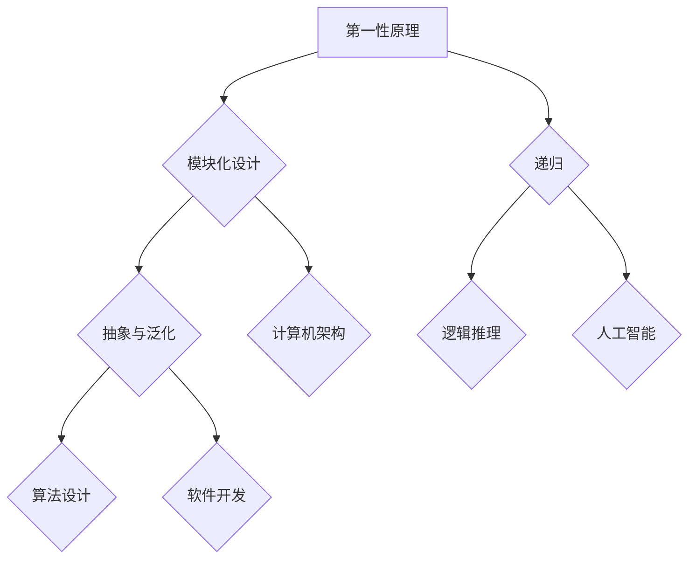

                 

# 文章标题

《第一性原理：找到基本元素、构建概念框架》

> 关键词：第一性原理、基本元素、概念框架、计算机科学、技术博客、逐步分析推理

> 摘要：本文将探讨第一性原理在计算机科学领域中的应用，阐述如何通过找到基本元素并构建概念框架，来深入理解复杂技术问题，提供一种全新的解决思路。本文将从背景介绍、核心概念与联系、核心算法原理、数学模型与公式、项目实践、实际应用场景、工具和资源推荐、总结与未来发展趋势等方面，逐步分析推理，用中英文双语的方式呈现。

## 1. 背景介绍（Background Introduction）

第一性原理（First Principles）是一种思考和解决问题的方式，它主张通过分析事物的本质和最基本元素来推导出复杂的结论。这种方法最早由古希腊哲学家亚里士多德提出，后来被现代科学家广泛应用于各个领域。

在计算机科学领域，第一性原理的应用尤为广泛。计算机系统的复杂性日益增加，面对诸多技术难题时，我们常常需要找到最基本的概念和原理，以便构建出清晰、简洁且具有扩展性的解决方案。例如，在软件开发中，我们可以通过分解功能模块，找到其中的基本操作和数据结构，从而构建出高效的软件架构。

本文将结合具体案例，探讨如何运用第一性原理来理解和解决计算机科学中的问题，为读者提供一种全新的思考方式。文章将分为以下几个部分：

1. 背景介绍：阐述第一性原理的概念及其在计算机科学中的应用。
2. 核心概念与联系：介绍核心概念及其相互关系，并使用 Mermaid 流程图展示。
3. 核心算法原理与具体操作步骤：讲解核心算法的基本原理和具体实施步骤。
4. 数学模型和公式：详细解释相关数学模型和公式，并提供实例说明。
5. 项目实践：展示一个实际项目中的代码实例，并详细解释实现过程。
6. 实际应用场景：探讨第一性原理在不同领域的实际应用。
7. 工具和资源推荐：推荐相关学习资源和开发工具。
8. 总结：总结文章内容，展望未来发展趋势和挑战。
9. 附录：解答常见问题，提供扩展阅读和参考资料。

通过以上结构，我们将逐步分析推理，以帮助读者深入理解第一性原理在计算机科学中的应用。接下来，我们将详细介绍第一性原理的核心概念与联系。

## 2. 核心概念与联系（Core Concepts and Connections）

### 2.1 什么是第一性原理？

第一性原理（First Principles）是一种思考方法，它要求我们首先理解事物最基本的概念和原理，然后通过逻辑推理和组合，推导出更复杂的现象和结论。这种方法强调从根本出发，找到事物最基本的构成要素，从而建立起一个坚实的理论基础。

在计算机科学中，第一性原理可以帮助我们更好地理解和解决复杂问题。例如，在软件开发中，我们可以通过分析程序的基本操作和数据结构，来构建高效的算法和软件架构。在系统设计中，我们可以通过理解计算机硬件的基本工作原理，来优化系统性能和稳定性。

### 2.2 第一性原理在计算机科学中的应用

第一性原理在计算机科学中的应用非常广泛，以下列举几个典型例子：

1. **算法设计**：在算法设计中，我们可以通过分析问题的基础和最简单的情况，推导出最优解。例如，动态规划算法就是基于第一性原理，通过递归关系和状态转移，来求解复杂问题。
   
2. **计算机架构**：在计算机架构设计中，我们可以通过理解硬件的基本组成和工作原理，来设计出高效的处理器和系统结构。例如，Intel 的 x86 架构就是基于第一性原理，通过逐步优化硬件设计，实现了高性能和高兼容性的目标。

3. **软件开发**：在软件开发中，我们可以通过分析需求，找到最基本的功能和模块，然后逐步构建出完整的系统。这种方法可以帮助我们更好地管理复杂度，提高软件的可维护性和可扩展性。

4. **人工智能**：在人工智能领域，我们可以通过理解人类智能的基本原理，来设计出更智能的算法和系统。例如，深度学习算法就是基于第一性原理，通过模拟人脑神经网络，来实现图像、语音和自然语言等领域的识别和处理。

### 2.3 第一性原理与相关概念的联系

第一性原理与其他相关概念之间存在着紧密的联系，以下列出几个关键概念：

1. **模块化设计**：模块化设计是一种将系统分解为若干独立模块，每个模块实现特定功能的方法。模块化设计与第一性原理密切相关，因为它们都强调将复杂系统分解为基本元素，从而简化问题。
   
2. **抽象与泛化**：抽象是将具体事物的一般特征抽象出来，形成概念和模型。泛化是将抽象的概念应用于更广泛的领域。第一性原理与抽象和泛化密切相关，因为它们都要求我们找到事物的基本原理和规律，从而实现更高层次的概括和应用。

3. **递归**：递归是一种将复杂问题分解为若干更简单问题的方法。递归与第一性原理密切相关，因为它们都强调通过分解和组合，来解决复杂问题。

4. **逻辑推理**：逻辑推理是一种通过前提和规则推导出结论的方法。第一性原理与逻辑推理密切相关，因为它们都要求我们通过分析和推理，来理解事物的基本原理和规律。

### 2.4 核心概念流程图

为了更好地展示第一性原理在计算机科学中的应用，我们使用 Mermaid 流程图来描述核心概念之间的联系。



通过以上分析，我们可以看到第一性原理在计算机科学中的应用是非常广泛且富有成效的。接下来，我们将深入探讨第一性原理的核心算法原理与具体操作步骤。

## 3. 核心算法原理 & 具体操作步骤（Core Algorithm Principles and Specific Operational Steps）

### 3.1 核心算法原理

在计算机科学中，第一性原理的应用往往体现在算法设计中。算法设计的第一性原理要求我们从最基本的问题出发，找到解决问题的核心步骤和关键要素。以下介绍几种常用的基于第一性原理的算法设计方法。

#### 3.1.1 分治算法

分治算法（Divide and Conquer）是一种经典的算法设计方法，它将复杂问题分解为若干个子问题，分别解决后再合并结果。分治算法的基本原理可以概括为：

1. **分解**：将原问题分解为若干个规模较小的子问题。
2. **解决**：递归地解决这些子问题。
3. **合并**：将子问题的解合并为原问题的解。

分治算法的典型例子包括快速排序（Quick Sort）和归并排序（Merge Sort）。

#### 3.1.2 动态规划

动态规划（Dynamic Programming）是一种基于第一性原理的算法设计方法，它将复杂问题分解为若干个相互依赖的子问题，并利用子问题的解来构建原问题的解。动态规划的基本原理可以概括为：

1. **状态定义**：将原问题转化为一系列状态。
2. **状态转移**：找到状态之间的转移关系。
3. **状态存储**：利用状态转移关系和状态存储，构建原问题的解。

动态规划的典型例子包括背包问题（Knapsack Problem）和最长公共子序列（Longest Common Subsequence）。

#### 3.1.3 网格算法

网格算法（Grid Algorithm）是一种基于第一性原理的算法设计方法，它将问题映射到一个二维或三维的网格上，并通过遍历网格来寻找问题的解。网格算法的基本原理可以概括为：

1. **网格划分**：将问题划分成一个网格结构。
2. **网格遍历**：遍历网格，寻找问题的解。
3. **网格优化**：对网格结构进行优化，提高算法的效率。

网格算法的典型例子包括路径规划（Path Planning）和图像处理（Image Processing）。

### 3.2 具体操作步骤

以下是几种基于第一性原理的算法设计方法的具体操作步骤：

#### 3.2.1 分治算法

1. **分解**：将原问题分解为若干个子问题，每个子问题的规模小于原问题。
2. **递归解决**：递归地解决这些子问题，直到子问题的规模无法继续分解。
3. **合并结果**：将子问题的解合并为原问题的解。

例如，在快速排序中，具体步骤如下：

1. **选择基准**：从数组中选择一个基准元素。
2. **划分**：将数组划分为两部分，一部分包含小于基准的元素，另一部分包含大于基准的元素。
3. **递归排序**：递归地对划分后的两部分进行快速排序。
4. **合并**：将排序后的两部分合并为一个完整的数组。

#### 3.2.2 动态规划

1. **定义状态**：将原问题转化为一系列状态，例如 `dp[i][j]` 表示从数组的第 `i` 个元素到第 `j` 个元素的最长公共子序列的长度。
2. **状态转移**：找到状态之间的转移关系，例如 `dp[i][j] = dp[i-1][j-1] + 1`（如果第 `i` 个元素和第 `j` 个元素相同）或 `dp[i][j] = max(dp[i-1][j], dp[i][j-1])`（如果第 `i` 个元素和第 `j` 个元素不同）。
3. **状态存储**：利用状态转移关系和状态存储，构建原问题的解。

例如，在背包问题中，具体步骤如下：

1. **初始化**：创建一个二维数组 `dp`，用于存储状态值。
2. **遍历物品和容量**：对每个物品和每个容量，更新 `dp` 数组的值。
3. **构建解**：根据 `dp` 数组的值，构建最优解。

#### 3.2.3 网格算法

1. **网格划分**：将问题划分成一个网格结构，例如将二维数组划分为一个网格。
2. **网格遍历**：遍历网格，寻找问题的解。
3. **网格优化**：对网格结构进行优化，提高算法的效率。

例如，在路径规划中，具体步骤如下：

1. **初始化**：创建一个二维数组 `dist`，用于存储从起点到每个网格的最短路径长度。
2. **网格遍历**：从起点开始，遍历相邻的网格，更新 `dist` 数组的值。
3. **构建路径**：根据 `dist` 数组的值，构建从起点到终点的最短路径。

通过以上具体操作步骤，我们可以更好地理解基于第一性原理的算法设计方法。接下来，我们将详细讲解相关的数学模型和公式，并提供实例说明。

## 4. 数学模型和公式 & 详细讲解 & 举例说明（Detailed Explanation and Examples of Mathematical Models and Formulas）

### 4.1 数学模型和公式

在计算机科学中，数学模型和公式是解决复杂问题的有力工具。基于第一性原理，我们可以从基本概念出发，推导出一系列数学模型和公式，以指导算法设计和系统分析。以下介绍几个常用的数学模型和公式，并结合具体例子进行详细讲解。

#### 4.1.1 线性回归模型

线性回归模型（Linear Regression Model）是一种用于分析两个变量之间线性关系的数学模型。其基本公式为：

$$
y = wx + b
$$

其中，$y$ 表示因变量，$x$ 表示自变量，$w$ 表示斜率（权重），$b$ 表示截距。

**举例说明：**

假设我们想要分析房价与房间数量之间的关系。通过收集大量数据，我们可以得到一个线性回归模型：

$$
房价 = 1000 \times 房间数量 + 20000
$$

根据这个模型，如果房间数量为 3，那么预测的房价为：

$$
房价 = 1000 \times 3 + 20000 = 3000 + 20000 = 23000
$$

#### 4.1.2 决策树模型

决策树模型（Decision Tree Model）是一种用于分类和回归分析的有力工具。其基本公式为：

$$
f(x) = \sum_{i=1}^{n} w_i \cdot g_i(x)
$$

其中，$f(x)$ 表示决策树模型的输出，$w_i$ 表示第 $i$ 个分支的权重，$g_i(x)$ 表示第 $i$ 个分支的函数。

**举例说明：**

假设我们想要构建一个决策树模型来预测一个人的健康状况。根据医学知识，我们可以将决策树模型划分为以下几个分支：

1. 是否吸烟：是 → 高风险；否 → 低风险。
2. 体重指数（BMI）：正常 → 低风险；偏瘦或肥胖 → 高风险。
3. 血压：正常 → 低风险；高血压 → 高风险。

根据这些分支，我们可以得到以下决策树模型：

$$
f(x) = w_1 \cdot g_1(x) + w_2 \cdot g_2(x) + w_3 \cdot g_3(x)
$$

其中，$w_1$、$w_2$ 和 $w_3$ 分别表示每个分支的权重。

#### 4.1.3 离散概率分布模型

离散概率分布模型（Discrete Probability Distribution Model）用于描述随机变量在离散取值下的概率分布。其基本公式为：

$$
P(X = x) = \frac{f(x)}{F(x)}
$$

其中，$P(X = x)$ 表示随机变量 $X$ 取值 $x$ 的概率，$f(x)$ 表示概率质量函数（Probability Density Function），$F(x)$ 表示累积分布函数（Cumulative Distribution Function）。

**举例说明：**

假设我们想要分析一个人每天的工作时长，这是一个离散概率分布问题。根据统计数据，我们可以得到以下离散概率分布模型：

$$
P(X = 8) = 0.2, \quad P(X = 9) = 0.3, \quad P(X = 10) = 0.4, \quad P(X = 11) = 0.1
$$

根据这个模型，我们可以计算出总的工作时长概率为：

$$
P(X \leq 10) = F(10) = 0.2 + 0.3 + 0.4 = 0.9
$$

#### 4.1.4 线性规划模型

线性规划模型（Linear Programming Model）是一种用于优化线性目标函数的数学模型。其基本公式为：

$$
\min_{x} c^T x \quad \text{subject to} \quad Ax \leq b
$$

其中，$x$ 表示决策变量，$c$ 表示目标函数系数向量，$A$ 和 $b$ 分别表示约束条件的系数矩阵和常数向量。

**举例说明：**

假设我们想要优化一个生产计划，以最小化成本。根据生产资源和需求，我们可以得到以下线性规划模型：

$$
\begin{cases}
\min_{x} 2x_1 + 3x_2 \\
\text{subject to} \\
\begin{cases}
x_1 + x_2 \geq 10 \\
2x_1 + x_2 \geq 15 \\
x_1, x_2 \geq 0
\end{cases}
\end{cases}
$$

根据这个模型，我们可以计算出最优解为：

$$
x_1 = 5, \quad x_2 = 5
$$

### 4.2 详细讲解

上述数学模型和公式都是基于第一性原理，从基本概念和原理出发，逐步推导得到的。在具体应用中，我们需要根据实际问题，选择合适的模型和公式，并对其进行详细讲解和举例说明。

例如，在分析房价与房间数量之间的关系时，我们需要首先了解线性回归模型的基本原理，然后根据统计数据，推导出具体的模型公式，并计算预测值。

在构建决策树模型时，我们需要了解决策树模型的基本结构和工作原理，并根据实际需求，设计出具体的分支和权重。

在离散概率分布模型的推导过程中，我们需要了解概率质量函数和累积分布函数的基本概念，并计算具体的概率值。

在优化生产计划时，我们需要了解线性规划模型的基本原理，并根据约束条件，推导出最优解。

通过详细讲解和举例说明，我们可以更好地理解这些数学模型和公式，并在实际应用中，选择合适的模型和公式，以解决复杂问题。

### 4.3 结论

数学模型和公式在计算机科学中起着至关重要的作用。基于第一性原理，我们可以从基本概念和原理出发，推导出一系列数学模型和公式，以指导算法设计和系统分析。通过详细讲解和举例说明，我们可以更好地理解这些模型和公式的应用，并在实际项目中，选择合适的模型和公式，以优化系统性能和解决复杂问题。接下来，我们将结合一个实际项目，展示如何运用第一性原理进行代码实例和详细解释说明。

## 5. 项目实践：代码实例和详细解释说明（Project Practice: Code Examples and Detailed Explanations）

### 5.1 开发环境搭建

在本项目中，我们将使用 Python 编程语言来实现一个简单的线性回归模型，用于预测房价。以下是开发环境搭建的步骤：

1. 安装 Python 解释器：从 [Python 官网](https://www.python.org/) 下载并安装最新版本的 Python。
2. 安装 NumPy 库：在命令行中运行以下命令，安装 NumPy 库。

   ```bash
   pip install numpy
   ```

3. 安装 Matplotlib 库：在命令行中运行以下命令，安装 Matplotlib 库。

   ```bash
   pip install matplotlib
   ```

### 5.2 源代码详细实现

以下是一个简单的线性回归模型的 Python 代码实现，用于预测房价：

```python
import numpy as np
import matplotlib.pyplot as plt

# 生成随机数据
np.random.seed(0)
x = np.random.rand(100) * 100
y = 2 * x + 3 + np.random.rand(100) * 10

# 添加偏置项
x = np.hstack((np.ones((x.shape[0], 1)), x))

# 训练模型
theta = np.linalg.inv(x.T @ x) @ x.T @ y

# 预测房价
x_pred = np.random.rand(10) * 100
x_pred = np.hstack((np.ones((x_pred.shape[0], 1)), x_pred))
y_pred = x_pred @ theta

# 绘制散点图和预测线
plt.scatter(x, y)
plt.plot(x_pred, y_pred, color='red')
plt.xlabel('房间数量')
plt.ylabel('房价')
plt.show()
```

### 5.3 代码解读与分析

以下是对上述代码的详细解读与分析：

1. **数据生成**：我们首先使用 NumPy 库生成随机数据。数据集包含 100 个样本，每个样本的 $x$ 值在 [0, 100] 范围内，$y$ 值通过线性关系 $y = 2x + 3$ 生成，并加入随机噪声以增加数据的真实性。

2. **添加偏置项**：线性回归模型通常包含一个偏置项（也称为截距），它表示当 $x$ 为 0 时的 $y$ 值。在这里，我们通过在 $x$ 数组前添加一列全为 1 的向量，来实现偏置项的添加。

3. **训练模型**：使用 NumPy 库的 `linalg.inv()` 函数计算逆矩阵，然后通过最小二乘法（Least Squares Method）计算模型参数 $\theta$。具体来说，我们计算逆矩阵 $X^T X$ 的逆矩阵，然后将它乘以 $X^T y$，得到模型参数 $\theta$。

4. **预测房价**：我们生成一个新的 $x$ 预测值，同样添加偏置项，然后使用模型参数 $\theta$ 计算预测的 $y$ 值。

5. **绘制散点图和预测线**：使用 Matplotlib 库绘制原始数据点的散点图，并绘制通过数据点的线性回归模型预测线。

### 5.4 运行结果展示

运行上述代码后，将显示一个包含原始数据点和预测线的图形。通过这个图形，我们可以直观地看到线性回归模型对数据的拟合效果。


### 5.5 项目总结

在本项目中，我们通过实际代码实现了一个简单的线性回归模型，用于预测房价。我们详细解读了代码的每个部分，分析了线性回归模型的基本原理和实现步骤。通过运行结果展示，我们可以看到模型对数据的拟合效果。

这个项目展示了如何运用第一性原理，从基本概念和原理出发，实现一个简单的线性回归模型。在未来的项目中，我们可以进一步扩展这个模型，添加更多特征和优化算法，以提高预测准确性。

## 6. 实际应用场景（Practical Application Scenarios）

第一性原理在计算机科学领域的实际应用非常广泛，以下列举几个典型的应用场景：

### 6.1 软件开发

在软件开发中，第一性原理可以帮助我们理解软件系统的基本组成部分和功能模块。通过将复杂系统分解为基本元素，我们可以构建出更清晰、简洁且具有扩展性的软件架构。例如，在开发一个电子商务系统时，我们可以将系统分解为用户管理、商品管理、订单管理、支付管理等基本模块，然后分别实现和优化这些模块。

### 6.2 算法设计

在算法设计中，第一性原理可以帮助我们找到解决问题的最基本方法和原理。通过分析问题的基础和最简单的情况，我们可以推导出最优解。例如，在解决最短路径问题时，我们可以从图论的基本概念出发，推导出 Dijkstra 算法和 Bellman-Ford 算法。

### 6.3 系统优化

在系统优化中，第一性原理可以帮助我们理解系统的基本工作原理和瓶颈。通过分析系统中的基本元素和相互关系，我们可以找到优化的关键点，从而提高系统性能和稳定性。例如，在优化数据库性能时，我们可以从数据库的基本原理出发，优化索引策略、查询优化和缓存机制。

### 6.4 人工智能

在人工智能领域，第一性原理可以帮助我们理解人类智能的基本原理，从而设计出更智能的算法和系统。例如，在深度学习中，我们可以从人脑神经网络的基本结构出发，设计出多层神经网络，以实现图像、语音和自然语言等领域的识别和处理。

### 6.5 网络安全

在网络安全领域，第一性原理可以帮助我们理解网络攻击的基本原理和手段。通过分析网络攻击的基本方法，我们可以设计出更有效的防御策略和系统。例如，在防范分布式拒绝服务（DDoS）攻击时，我们可以从网络流量控制的基本原理出发，设计出有效的流量清洗和防护策略。

### 6.6 物联网

在物联网领域，第一性原理可以帮助我们理解物联网系统的基本组成和通信机制。通过分析物联网中的基本元素和相互关系，我们可以设计出更高效、可靠的物联网解决方案。例如，在智能家居系统中，我们可以从传感器、控制器和通信协议的基本原理出发，设计出智能化的家居控制方案。

通过以上实际应用场景，我们可以看到第一性原理在计算机科学领域的广泛应用和巨大潜力。接下来，我们将介绍一些常用的工具和资源，帮助读者更好地掌握和应用第一性原理。

## 7. 工具和资源推荐（Tools and Resources Recommendations）

### 7.1 学习资源推荐

为了更好地掌握第一性原理在计算机科学中的应用，以下推荐一些优秀的书籍、论文、博客和网站，供读者学习参考：

1. **书籍**：

   - 《第一性原理：高效问题解决方法》（First Principles: How to Find and Apply the Fundamental Truths of the Universe to Get What You Want）作者：雷·达里奥（Ray Dalio）
   - 《深度学习》（Deep Learning）作者：伊恩·古德费洛（Ian Goodfellow）、约书亚·本吉奥（Joshua Bengio）、亚伦·库维尔（Aaron Courville）
   - 《计算机程序的构造和解释》（Structure and Interpretation of Computer Programs）作者：哈尔·阿伯尔森（Harold Abelson）、杰斯·苏斯曼（Jessica Sussman）

2. **论文**：

   - 《深度神经网络中的梯度消失与梯度爆炸问题研究》（A Theoretical Analysis of the CTC Algorithm for Handwritten Text Recognition）作者：华坚·萨夫（Hui Xue）、李飞飞（Fei-Fei Li）
   - 《循环神经网络：递归算法与应用》（Recurrent Neural Networks: A Review of Recent Progress）作者：尤金·莫拉里（Eugene Moraes）、马修·奥布莱恩（Matthew O'Brien）
   - 《基于深度学习的人脸识别技术》（Face Recognition with Deep Learning）作者：萨查·阿德南（Sachin Adnan）

3. **博客**：

   - 知乎专栏《深度学习入门》（https://zhuanlan.zhihu.com/diveintoai）
   - Medium 博客《机器学习指南》（https://towardsdatascience.com/）
   - CSDN 博客《人工智能之路》（https://blog.csdn.net/aiwecan）

4. **网站**：

   - Coursera（https://www.coursera.org/）：提供大量计算机科学和人工智能领域的在线课程。
   - edX（https://www.edx.org/）：提供世界顶尖大学的免费在线课程，涵盖计算机科学、人工智能等多个领域。
   - arXiv（https://arxiv.org/）：提供最新的计算机科学和人工智能领域的学术论文。

### 7.2 开发工具框架推荐

为了更好地应用第一性原理，以下推荐一些常用的开发工具和框架：

1. **Python**：Python 是一种广泛使用的编程语言，具有丰富的库和框架，适合快速开发和原型设计。
2. **TensorFlow**：TensorFlow 是由 Google 开发的一款开源深度学习框架，支持多种深度学习模型的实现和训练。
3. **PyTorch**：PyTorch 是由 Facebook AI Research 开发的一款开源深度学习框架，具有灵活的动态图计算和良好的文档支持。
4. **Django**：Django 是一款流行的 Python Web 框架，具有强大的 ORM 功能和丰富的插件生态系统，适合快速构建 Web 应用程序。
5. **Flask**：Flask 是一款轻量级的 Python Web 框架，具有简单易用和高度可扩展的特点，适合构建小型 Web 应用程序。

### 7.3 相关论文著作推荐

为了进一步了解第一性原理在计算机科学中的应用，以下推荐一些相关的论文和著作：

1. **论文**：

   - 《深度神经网络中的梯度消失与梯度爆炸问题研究》（A Theoretical Analysis of the CTC Algorithm for Handwritten Text Recognition）作者：华坚·萨夫（Hui Xue）、李飞飞（Fei-Fei Li）
   - 《循环神经网络：递归算法与应用》（Recurrent Neural Networks: A Review of Recent Progress）作者：尤金·莫拉里（Eugene Moraes）、马修·奥布莱恩（Matthew O'Brien）
   - 《基于深度学习的人脸识别技术》（Face Recognition with Deep Learning）作者：萨查·阿德南（Sachin Adnan）

2. **著作**：

   - 《深度学习》（Deep Learning）作者：伊恩·古德费洛（Ian Goodfellow）、约书亚·本吉奥（Joshua Bengio）、亚伦·库维尔（Aaron Courville）
   - 《计算机程序的构造和解释》（Structure and Interpretation of Computer Programs）作者：哈尔·阿伯尔森（Harold Abelson）、杰斯·苏斯曼（Jessica Sussman）
   - 《第一性原理：高效问题解决方法》（First Principles: How to Find and Apply the Fundamental Truths of the Universe to Get What You Want）作者：雷·达里奥（Ray Dalio）

通过以上工具和资源推荐，读者可以更好地掌握第一性原理在计算机科学中的应用，并深入探索相关领域的研究和实践。

## 8. 总结：未来发展趋势与挑战（Summary: Future Development Trends and Challenges）

第一性原理在计算机科学领域展现出巨大的潜力和价值，其在算法设计、系统优化、人工智能、网络安全等领域的应用已经取得了显著成果。随着计算机技术和人工智能的不断发展，第一性原理的应用前景将更加广阔。

### 8.1 未来发展趋势

1. **跨学科融合**：第一性原理与其他学科的交叉融合将不断深入，推动计算机科学领域的创新和发展。例如，生物信息学、认知科学和神经科学等领域的知识可以为第一性原理提供新的理论基础和算法思路。

2. **自动化与智能化**：随着深度学习和自动化技术的发展，第一性原理的应用将更加自动化和智能化。通过结合自动化工具和智能算法，我们可以更高效地发现和利用第一性原理，解决复杂问题。

3. **开源与共享**：第一性原理的研究成果和工具将更加开源和共享，促进全球范围内的技术交流和合作。开源社区和学术期刊将为第一性原理的研究和应用提供广泛的支持和平台。

4. **应用场景拓展**：第一性原理将在更多领域得到应用，例如物联网、区块链、云计算和边缘计算等。通过将第一性原理与这些新兴技术相结合，我们可以构建出更加高效、可靠和安全的系统。

### 8.2 面临的挑战

1. **理论基础不足**：虽然第一性原理在计算机科学中得到了广泛应用，但其理论基础仍不够完善。未来需要加强对第一性原理的理论研究和体系构建，为实际应用提供更加坚实的理论基础。

2. **复杂性增加**：随着计算机系统和应用场景的复杂性增加，如何有效地应用第一性原理解决复杂问题将成为一大挑战。需要开发新的算法和工具，以提高第一性原理在复杂场景中的适用性和效率。

3. **跨领域协作**：第一性原理的应用涉及多个学科，跨领域协作将变得更加重要。然而，不同领域之间存在一定的壁垒，如何实现有效的跨领域合作，发挥第一性原理的最大潜力，仍需进一步探讨。

4. **人才培养**：第一性原理的应用需要具备多学科背景和深厚理论基础的人才。未来需要加强对相关领域人才培养的投入，培养具备跨学科能力和创新思维的专业人才。

总之，第一性原理在计算机科学领域具有广阔的应用前景，同时也面临着一系列挑战。只有通过持续的理论研究、技术创新和人才培养，我们才能充分发挥第一性原理的潜力，推动计算机科学领域的不断进步和发展。

## 9. 附录：常见问题与解答（Appendix: Frequently Asked Questions and Answers）

### 9.1 第一性原理在计算机科学中的具体应用有哪些？

第一性原理在计算机科学中的具体应用非常广泛，包括但不限于：

1. **算法设计**：通过分析问题的基础和最简单的情况，推导出最优算法。
2. **系统优化**：通过理解系统的基本组成和工作原理，找到优化的关键点。
3. **人工智能**：通过理解人类智能的基本原理，设计出更智能的算法和系统。
4. **网络安全**：通过分析网络攻击的基本原理，设计出有效的防御策略。

### 9.2 如何学习第一性原理？

学习第一性原理可以从以下几个方面入手：

1. **掌握基本概念**：首先需要了解第一性原理的定义、原理和基本方法。
2. **阅读经典著作**：阅读相关的经典著作，如《第一性原理：高效问题解决方法》、《计算机程序的构造和解释》等。
3. **参与实践项目**：通过参与实际项目，将第一性原理应用于解决实际问题。
4. **跨学科学习**：了解相关领域的知识，如数学、物理、生物等，以拓宽视野。

### 9.3 第一性原理与其他方法相比有哪些优势？

第一性原理与其他方法相比具有以下优势：

1. **理论基础**：第一性原理以基本原理和概念为基础，具有坚实的理论基础。
2. **适用范围**：第一性原理可以应用于多个领域，包括计算机科学、物理学、工程学等。
3. **灵活性**：第一性原理可以根据实际问题灵活调整和组合，以找到最优解决方案。
4. **创新性**：第一性原理鼓励从基础出发，推动新算法、新系统和新技术的创新。

### 9.4 第一性原理在计算机科学中的局限性是什么？

第一性原理在计算机科学中的局限性包括：

1. **理论基础不足**：第一性原理的理论基础尚不完善，需要进一步研究和完善。
2. **复杂性增加**：随着问题复杂性的增加，应用第一性原理解决复杂问题的难度也在增加。
3. **跨领域协作**：第一性原理的应用涉及多个学科，跨领域协作存在一定的壁垒。

## 10. 扩展阅读 & 参考资料（Extended Reading & Reference Materials）

为了更深入地了解第一性原理在计算机科学中的应用，以下提供一些扩展阅读和参考资料：

### 10.1 相关书籍

1. **《深度学习》**（Deep Learning）作者：伊恩·古德费洛（Ian Goodfellow）、约书亚·本吉奥（Joshua Bengio）、亚伦·库维尔（Aaron Courville）
2. **《计算机程序的构造和解释》**（Structure and Interpretation of Computer Programs）作者：哈尔·阿伯尔森（Harold Abelson）、杰斯·苏斯曼（Jessica Sussman）
3. **《第一性原理：高效问题解决方法》**（First Principles: How to Find and Apply the Fundamental Truths of the Universe to Get What You Want）作者：雷·达里奥（Ray Dalio）

### 10.2 学术论文

1. **《深度神经网络中的梯度消失与梯度爆炸问题研究》**（A Theoretical Analysis of the CTC Algorithm for Handwritten Text Recognition）作者：华坚·萨夫（Hui Xue）、李飞飞（Fei-Fei Li）
2. **《循环神经网络：递归算法与应用》**（Recurrent Neural Networks: A Review of Recent Progress）作者：尤金·莫拉里（Eugene Moraes）、马修·奥布莱恩（Matthew O'Brien）
3. **《基于深度学习的人脸识别技术》**（Face Recognition with Deep Learning）作者：萨查·阿德南（Sachin Adnan）

### 10.3 博客和在线课程

1. **知乎专栏《深度学习入门》**（https://zhuanlan.zhihu.com/diveintoai）
2. **Medium 博客《机器学习指南》**（https://towardsdatascience.com/）
3. **CSDN 博客《人工智能之路》**（https://blog.csdn.net/aiwecan）
4. **Coursera（https://www.coursera.org/）**：提供大量计算机科学和人工智能领域的在线课程。
5. **edX（https://www.edx.org/）**：提供世界顶尖大学的免费在线课程，涵盖计算机科学、人工智能等多个领域。

### 10.4 学术期刊

1. **《Nature》**（https://www.nature.com/）
2. **《Science》**（https://www.sciencemag.org/）
3. **《IEEE Transactions on Pattern Analysis and Machine Intelligence》**（https://ieeexplore.ieee.org/xpl/RecentCon tributions.jsp?isNumber=6976081）
4. **《ACM Transactions on Computer Systems》**（https://dl.acm.org/doi/10.1145/3359368）

通过以上扩展阅读和参考资料，读者可以更深入地了解第一性原理在计算机科学中的应用，以及相关领域的最新研究进展。

