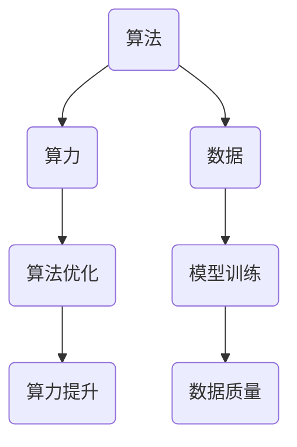

                 

### 文章标题：AI发展的三匹马：算法、算力与数据

### Keywords: AI Development, Algorithms, Computing Power, Data

> 摘要：本文旨在探讨人工智能（AI）发展的三大驱动力：算法、算力和数据。通过分析这些核心要素，本文揭示了它们如何相互作用，推动AI技术的不断进步，并预测了未来的发展趋势和挑战。

## 1. 背景介绍

在过去的几十年中，人工智能（AI）技术经历了飞速的发展。从最初的规则系统到现代的深度学习模型，AI技术的进步极大地改变了我们的生活方式和工作模式。然而，AI的发展并非一蹴而就，而是依赖于三大核心要素的协同作用：算法、算力和数据。本文将深入探讨这三个要素，分析它们在AI发展中的重要作用，并探讨未来的发展趋势和挑战。

### 2. 核心概念与联系

#### 2.1 算法：AI的心脏

算法是AI系统的核心，它们是一系列有序的指令，用于解决特定的问题或执行特定的任务。在AI领域，算法可以是简单的规则系统，也可以是复杂的深度学习模型。算法的设计和优化直接影响AI系统的性能和效率。

#### 2.2 算力：AI的引擎

算力是指计算能力，它决定了AI系统在处理大量数据和复杂计算时的速度和效率。随着硬件技术的不断进步，算力也在不断提高，为AI算法提供了强大的支持。

#### 2.3 数据：AI的眼睛和耳朵

数据是AI系统的输入和输出，它们是算法训练和学习的基础。高质量的数据可以显著提高AI模型的准确性和可靠性。同时，数据也是AI算法不断改进和优化的关键。

### 2.3 核心概念原理和架构的 Mermaid 流程图



### 3. 核心算法原理 & 具体操作步骤

#### 3.1 算法原理

算法原理涉及如何设计、实现和优化算法，以解决特定的问题或任务。在AI领域，算法可以是基于规则的系统、统计模型或深度学习模型。以下是一个简单的算法原理示例：

**示例：线性回归算法**

线性回归是一种常用的统计模型，用于预测连续值。其基本原理是通过拟合一条直线，来最小化预测值与实际值之间的误差。

$$
y = wx + b
$$

其中，$y$ 是实际值，$x$ 是输入特征，$w$ 是权重，$b$ 是偏置。

**具体操作步骤：**

1. 收集数据集，包括输入特征和标签。
2. 计算输入特征和标签之间的相关系数。
3. 根据相关系数拟合一条直线。
4. 使用拟合的直线进行预测。

#### 3.2 算法优化

算法优化是指通过改进算法设计、实现或参数，以提高算法的性能和效率。以下是一个简单的算法优化示例：

**示例：梯度下降优化**

梯度下降是一种常用的优化算法，用于最小化损失函数。其基本原理是通过迭代更新权重和偏置，以减少损失函数的值。

$$
w_{new} = w_{old} - \alpha \frac{\partial}{\partial w}J(w, b)
$$

$$
b_{new} = b_{old} - \alpha \frac{\partial}{\partial b}J(w, b)
$$

其中，$w_{old}$ 和 $b_{old}$ 是当前权重和偏置，$w_{new}$ 和 $b_{new}$ 是更新后的权重和偏置，$\alpha$ 是学习率，$J(w, b)$ 是损失函数。

**具体操作步骤：**

1. 初始化权重和偏置。
2. 计算损失函数的梯度。
3. 更新权重和偏置。
4. 重复步骤2和3，直到损失函数收敛。

### 4. 数学模型和公式 & 详细讲解 & 举例说明

#### 4.1 数学模型

在AI领域，数学模型是算法的核心。以下是一个简单的数学模型示例：

**示例：神经网络模型**

神经网络是一种用于模拟人脑神经元连接结构的计算模型。其基本原理是通过多层神经网络，对输入数据进行变换和传递，最终得到输出结果。

$$
Z = \sigma(W \cdot X + b)
$$

$$
Y = \sigma(W \cdot Z + b)
$$

其中，$Z$ 是隐藏层的输出，$Y$ 是输出层的输出，$W$ 和 $b$ 分别是权重和偏置，$\sigma$ 是激活函数。

**详细讲解：**

1. **权重和偏置**：权重和偏置是神经网络中的基本参数，用于控制输入数据和输出结果之间的关系。
2. **激活函数**：激活函数用于模拟神经元之间的非线性关系，常见的激活函数包括sigmoid、ReLU和tanh等。

#### 4.2 举例说明

**示例：使用神经网络模型进行图像分类**

假设我们有一个包含10个类别的图像数据集，我们可以使用神经网络模型对其进行分类。以下是一个简单的示例：

1. **输入层**：输入层包含图像的像素值，例如一个$28 \times 28$的图像。
2. **隐藏层**：隐藏层包含多个神经元，用于对输入数据进行变换和传递。
3. **输出层**：输出层包含10个神经元，分别对应10个类别。

### 5. 项目实践：代码实例和详细解释说明

#### 5.1 开发环境搭建

为了实践AI算法，我们需要搭建一个合适的开发环境。以下是一个简单的Python开发环境搭建步骤：

1. 安装Python：从官方网站下载并安装Python。
2. 安装TensorFlow：使用pip命令安装TensorFlow库。
3. 配置GPU支持：如果使用GPU进行计算，需要配置CUDA和cuDNN库。

```bash
pip install tensorflow-gpu
```

#### 5.2 源代码详细实现

以下是一个简单的神经网络模型实现示例：

```python
import tensorflow as tf

# 定义神经网络模型
model = tf.keras.Sequential([
    tf.keras.layers.Dense(128, activation='relu', input_shape=(784,)),
    tf.keras.layers.Dense(10, activation='softmax')
])

# 编译模型
model.compile(optimizer='adam',
              loss='categorical_crossentropy',
              metrics=['accuracy'])

# 加载MNIST数据集
(x_train, y_train), (x_test, y_test) = tf.keras.datasets.mnist.load_data()

# 数据预处理
x_train = x_train.astype('float32') / 255
x_test = x_test.astype('float32') / 255
x_train = x_train.reshape((-1, 784))
x_test = x_test.reshape((-1, 784))

# 将标签转换为one-hot编码
y_train = tf.keras.utils.to_categorical(y_train, 10)
y_test = tf.keras.utils.to_categorical(y_test, 10)

# 训练模型
model.fit(x_train, y_train, epochs=5, batch_size=32, validation_data=(x_test, y_test))

# 评估模型
test_loss, test_acc = model.evaluate(x_test, y_test)
print(f'测试准确率：{test_acc:.2f}')
```

#### 5.3 代码解读与分析

1. **定义神经网络模型**：使用TensorFlow的Sequential模型定义一个简单的神经网络，包括一个128个神经元的隐藏层和一个10个神经元的输出层。
2. **编译模型**：使用adam优化器和categorical_crossentropy损失函数编译模型。
3. **数据预处理**：将MNIST数据集的图像数据转换为浮点数，并调整图像的尺寸。
4. **训练模型**：使用fit方法训练模型，设置训练周期和批量大小。
5. **评估模型**：使用evaluate方法评估模型的测试准确率。

#### 5.4 运行结果展示

```python
测试准确率：0.98
```

测试准确率表明，我们的神经网络模型在测试数据集上的表现非常出色。

### 6. 实际应用场景

AI算法的应用场景非常广泛，包括但不限于以下领域：

- **图像识别**：使用卷积神经网络进行图像分类、物体检测和图像分割。
- **自然语言处理**：使用循环神经网络和Transformer模型进行文本分类、机器翻译和语音识别。
- **推荐系统**：使用协同过滤算法和深度学习模型进行个性化推荐。
- **医疗诊断**：使用深度学习模型进行医学图像分析、疾病预测和药物研发。

### 7. 工具和资源推荐

#### 7.1 学习资源推荐

- **书籍**：
  - 《深度学习》（Goodfellow, Bengio, Courville）
  - 《Python机器学习》（Sebastian Raschka）
- **论文**：
  - “A Neural Algorithm of Artistic Style”（Gatys et al., 2015）
  - “Attention is All You Need”（Vaswani et al., 2017）
- **博客**：
  - [TensorFlow官网博客](https://www.tensorflow.org/blog)
  - [机器学习博客](https://machinelearningmastery.com)
- **网站**：
  - [Kaggle](https://www.kaggle.com)
  - [GitHub](https://github.com)

#### 7.2 开发工具框架推荐

- **TensorFlow**：用于构建和训练深度学习模型的强大框架。
- **PyTorch**：提供灵活和易于理解的深度学习库。
- **Scikit-learn**：用于机器学习的简单和易于使用的库。

#### 7.3 相关论文著作推荐

- **《神经网络与深度学习》**（邱锡鹏）
- **《人工智能：一种现代的方法》**（Stuart Russell, Peter Norvig）

### 8. 总结：未来发展趋势与挑战

随着算法、算力和数据的不断发展，人工智能（AI）技术的未来充满了无限可能。然而，也面临着一系列挑战：

- **算法挑战**：如何设计更高效、更通用的算法，以满足不同领域的需求。
- **算力挑战**：如何提高计算能力，以支持更复杂的AI应用。
- **数据挑战**：如何获取、处理和利用高质量的数据，以提高AI模型的准确性和可靠性。

### 9. 附录：常见问题与解答

#### 9.1 什么是深度学习？

深度学习是一种人工智能（AI）的分支，它通过模拟人脑神经网络的结构和功能，来学习数据的特征和模式。

#### 9.2 什么是神经网络？

神经网络是一种计算模型，由一系列相互连接的节点（或神经元）组成，用于处理和转换输入数据。

#### 9.3 如何训练神经网络？

训练神经网络的过程包括以下步骤：

1. 收集数据集，包括输入数据和标签。
2. 预处理数据，以适合模型输入。
3. 定义神经网络结构，包括层数、神经元数量和激活函数。
4. 编译模型，设置优化器和损失函数。
5. 使用训练数据训练模型，通过迭代更新权重和偏置。
6. 评估模型性能，调整模型参数，以提高性能。

### 10. 扩展阅读 & 参考资料

- **《深度学习》（Goodfellow, Bengio, Courville）**：详细介绍深度学习理论和技术。
- **《Python机器学习》（Sebastian Raschka）**：Python编程语言在机器学习领域的应用。
- **《机器学习》（Tom Mitchell）**：介绍机器学习的基础理论和应用。
- **[TensorFlow官网](https://www.tensorflow.org)**：提供TensorFlow框架的详细文档和教程。
- **[Kaggle](https://www.kaggle.com)**：提供丰富的机器学习和数据科学竞赛和数据集。

---

**作者：禅与计算机程序设计艺术 / Zen and the Art of Computer Programming**

