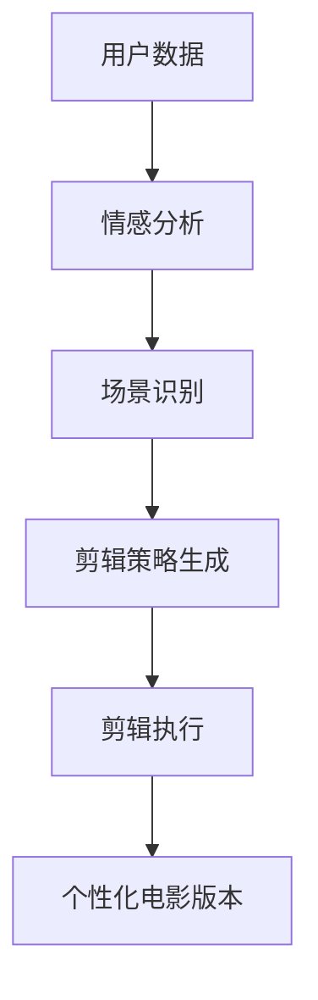

                 

# 文章标题

"AI在个性化电影剪辑中的应用：创造个人版本"

在当今数字化时代，人工智能（AI）正逐渐融入我们日常生活的方方面面。从智能家居到自动驾驶，AI已经展示了其改变世界的潜力。而在娱乐领域，AI的应用也愈发广泛，其中个性化电影剪辑无疑是令人瞩目的一个创新方向。通过AI技术，我们可以轻松地根据个人喜好和观影习惯，剪辑出独特的电影版本，满足每个人的个性化需求。

本文将深入探讨AI在个性化电影剪辑中的应用，探讨其背后的核心算法原理、数学模型、以及具体的项目实践。我们将一步一步分析推理，帮助读者理解这一前沿技术的魅力。此外，文章还将探讨个性化电影剪辑的实际应用场景，并推荐相关的学习资源与开发工具。

> 关键词：人工智能，个性化电影剪辑，算法，数学模型，项目实践，实际应用场景

## 1. 背景介绍（Background Introduction）

个性化电影剪辑并非一个新概念。传统的电影剪辑通常是基于电影的情节、导演意图以及观众的一般喜好。然而，这种一刀切的剪辑方式往往无法满足每个观众的独特需求。随着AI技术的发展，尤其是深度学习和自然语言处理（NLP）领域的突破，个性化电影剪辑成为可能。

首先，AI技术可以分析大量的用户数据，包括观影历史、评论、偏好等，从而更好地理解用户的个性化需求。其次，AI算法能够自动识别电影中的关键情节、角色和情感，根据用户偏好进行智能剪辑。此外，AI还可以结合用户生成内容（UGC）和人工智能生成内容（AIGC），创造出全新的观影体验。

### 1.1 AI在娱乐行业的应用

AI在娱乐行业的应用已经相当广泛。例如，智能推荐系统可以根据用户的观看历史和兴趣，推荐个性化的电影和视频内容。自动字幕生成技术使得视频内容的可访问性大大提高，特别是在多语言环境中。而AI驱动的剧本创作和角色设计也在逐步成熟，为电影和电视制作提供了新的可能。

### 1.2 个性化电影剪辑的重要性

个性化电影剪辑的重要性在于它能够为观众提供更加个性化和沉浸式的观影体验。每个人对电影的喜好都有所不同，通过个性化剪辑，观众可以自由选择他们喜欢的片段、角色和情感，从而创造出属于自己的电影版本。这种个性化的服务不仅提高了观众的满意度，也为电影制作和分发带来了新的商业模式。

## 2. 核心概念与联系（Core Concepts and Connections）

### 2.1 什么是个性化电影剪辑？

个性化电影剪辑是指利用AI技术，根据用户的个性化需求和喜好，对电影进行自动剪辑和编辑，从而创造出满足个人偏好的电影版本。

### 2.2 个性化电影剪辑的核心算法

个性化电影剪辑的核心算法主要包括以下几个方面：

1. **用户画像构建**：通过分析用户的观影历史、评论和偏好，构建用户的个性化画像。
2. **情感分析**：利用自然语言处理技术，对用户评论和电影文本进行分析，提取情感信息。
3. **场景识别**：通过计算机视觉技术，自动识别电影中的关键场景和角色。
4. **剪辑策略生成**：根据用户的个性化需求和情感分析结果，生成剪辑策略，进行智能剪辑。

### 2.3 个性化电影剪辑的架构

个性化电影剪辑的架构主要包括以下几个模块：

1. **用户数据模块**：收集并存储用户的个性化数据，如观影历史、评论和偏好。
2. **情感分析模块**：利用NLP技术，对用户评论和电影文本进行情感分析。
3. **场景识别模块**：通过计算机视觉技术，识别电影中的关键场景和角色。
4. **剪辑策略生成模块**：根据用户画像和情感分析结果，生成个性化的剪辑策略。
5. **剪辑执行模块**：根据剪辑策略，对电影进行智能剪辑和编辑。

### 2.4 Mermaid流程图

以下是一个简化的Mermaid流程图，展示了个性化电影剪辑的核心流程：



### 2.5 个性化电影剪辑与传统电影剪辑的比较

与传统的电影剪辑相比，个性化电影剪辑具有以下几个显著优势：

1. **个性化**：个性化电影剪辑可以根据用户的个性化需求和喜好，剪辑出满足个人偏好的电影版本。
2. **自动化**：个性化电影剪辑过程高度自动化，减少了人力成本和时间成本。
3. **实时性**：用户可以实时看到个性化的剪辑结果，并根据反馈进行进一步的调整。

## 3. 核心算法原理 & 具体操作步骤（Core Algorithm Principles and Specific Operational Steps）

### 3.1 用户画像构建

用户画像构建是个性化电影剪辑的关键步骤之一。它涉及从多个维度收集用户数据，包括但不限于：

1. **观影历史**：记录用户过去观看的电影类型、时长、评分等。
2. **评论和反馈**：收集用户对电影的评论和反馈，分析用户的偏好。
3. **行为数据**：如用户的搜索历史、点赞记录等。

这些数据可以通过在线调查、用户交互等方式收集。构建用户画像的核心算法包括数据预处理、特征提取和模型训练。

#### 3.1.1 数据预处理

数据预处理是确保数据质量和一致性的关键步骤。具体操作包括：

1. **数据清洗**：去除重复、无效的数据。
2. **数据标准化**：对数据进行归一化或标准化处理，使其在同一尺度上。
3. **特征工程**：从原始数据中提取出对用户画像有代表性的特征。

#### 3.1.2 特征提取

特征提取是用户画像构建的核心步骤。常见的特征提取方法包括：

1. **文本分析**：使用词频分析、TF-IDF等方法提取文本特征。
2. **情感分析**：利用情感分析算法提取用户的情感特征。
3. **社会网络分析**：通过分析用户的社会网络关系，提取社交特征。

#### 3.1.3 模型训练

在特征提取后，我们可以使用机器学习算法（如聚类、分类等）对用户画像进行训练。训练过程通常包括以下几个步骤：

1. **数据集划分**：将数据集划分为训练集、验证集和测试集。
2. **模型选择**：选择合适的机器学习模型（如SVM、随机森林等）。
3. **模型训练**：使用训练集数据训练模型。
4. **模型评估**：使用验证集和测试集评估模型的性能。

### 3.2 情感分析

情感分析是理解用户偏好和情感的重要手段。通过情感分析，我们可以提取用户对电影的情感倾向，从而为个性化剪辑提供依据。情感分析的核心算法包括：

1. **文本预处理**：对文本数据进行清洗、分词、去除停用词等处理。
2. **情感词典**：使用情感词典对文本进行情感标注。
3. **情感分类**：使用机器学习算法对文本进行情感分类。

#### 3.2.1 文本预处理

文本预处理是情感分析的基础步骤。具体操作包括：

1. **分词**：将文本分解为单个词语。
2. **去除停用词**：去除对情感分析没有贡献的常用词。
3. **词性标注**：对每个词进行词性标注，如名词、动词等。

#### 3.2.2 情感词典

情感词典是情感分析的核心工具。它包含了一系列的情感词语及其对应的情感标签。常见的情感词典包括：

1. **积极情感词典**：包含积极的情感词语，如“喜欢”、“开心”等。
2. **消极情感词典**：包含消极的情感词语，如“不喜欢”、“失望”等。

#### 3.2.3 情感分类

情感分类是情感分析的核心步骤。常见的方法包括：

1. **基于规则的分类**：使用预设的规则进行分类。
2. **基于机器学习的分类**：使用机器学习算法（如SVM、朴素贝叶斯等）进行分类。

### 3.3 场景识别

场景识别是自动化剪辑的关键步骤。通过场景识别，我们可以自动识别电影中的关键场景和角色。核心算法包括：

1. **图像识别**：使用深度学习算法对图像进行识别。
2. **视频分割**：将视频分割为多个场景，以便进行后续的剪辑。

#### 3.3.1 图像识别

图像识别是计算机视觉的核心任务之一。常见的算法包括：

1. **卷积神经网络（CNN）**：用于图像分类、目标检测等。
2. **循环神经网络（RNN）**：用于序列数据建模，如视频分割。

#### 3.3.2 视频分割

视频分割是将视频分为多个连续的场景或帧的过程。常见的算法包括：

1. **基于内容的分割**：根据图像内容进行分割，如颜色、纹理等。
2. **基于运动的分割**：根据视频中的运动信息进行分割，如光学流、运动向量等。

### 3.4 剪辑策略生成

剪辑策略生成是根据用户画像、情感分析和场景识别的结果，生成个性化的剪辑策略。核心算法包括：

1. **决策树**：根据用户画像和情感分析结果，生成剪辑决策树。
2. **神经网络**：使用神经网络模型，对剪辑策略进行自动生成。

#### 3.4.1 决策树

决策树是一种常见的机器学习算法，用于分类和回归任务。在个性化电影剪辑中，决策树可以根据用户画像和情感分析结果，生成个性化的剪辑策略。

#### 3.4.2 神经网络

神经网络是一种模拟人脑神经元连接的算法，用于复杂的数据建模和预测。在个性化电影剪辑中，神经网络可以自动生成剪辑策略，从而提高剪辑的个性化程度。

## 4. 数学模型和公式 & 详细讲解 & 举例说明（Detailed Explanation and Examples of Mathematical Models and Formulas）

### 4.1 用户画像构建中的数学模型

用户画像构建是一个涉及多个数学模型的过程，主要包括聚类、分类和回归模型。以下是一些常见的数学模型和公式：

#### 4.1.1 聚类模型

**K-均值聚类算法**是一种常用的聚类模型，其目标是将数据点分为K个簇，使得每个簇内的数据点尽可能接近，簇间的数据点尽可能远。

- **目标函数**：$$J = \sum_{i=1}^{K} \sum_{x \in S_i} ||x - \mu_i||^2$$
  其中，$J$ 是目标函数，$S_i$ 是第$i$个簇的数据点集合，$\mu_i$ 是第$i$个簇的中心点。

- **优化过程**：通过迭代更新簇中心和数据点，使得目标函数最小化。

#### 4.1.2 分类模型

**支持向量机（SVM）**是一种常用的分类模型，其目标是在特征空间中找到一个最优的超平面，使得不同类别的数据点尽可能分开。

- **目标函数**：$$\min_{\mathbf{w}, b} \frac{1}{2}||\mathbf{w}||^2$$
  其中，$\mathbf{w}$ 是权重向量，$b$ 是偏置。

- **约束条件**：$$y_i(\mathbf{w}\cdot x_i + b) \geq 1$$
  其中，$y_i$ 是第$i$个数据点的标签，$x_i$ 是特征向量。

#### 4.1.3 回归模型

**线性回归**是一种常用的回归模型，其目标是最小化预测值与真实值之间的误差。

- **目标函数**：$$\min_{\theta} \sum_{i=1}^{n} (y_i - \theta^T x_i)^2$$
  其中，$\theta$ 是模型参数，$y_i$ 是第$i$个数据点的真实值，$x_i$ 是特征向量。

### 4.2 情感分析中的数学模型

情感分析中的数学模型主要涉及词嵌入、情感分类和文本生成。

#### 4.2.1 词嵌入

**Word2Vec**是一种常用的词嵌入模型，其目标是将词语映射为低维向量，使得语义相近的词语在向量空间中接近。

- **目标函数**：$$J = \sum_{w \in V} \sum_{w' \in \text{context}(w)} (1 - \cos(\mathbf{v}_w, \mathbf{v}_{w'}))^2$$
  其中，$V$ 是词汇表，$\text{context}(w)$ 是词语$w$的上下文，$\mathbf{v}_w$ 和 $\mathbf{v}_{w'}$ 是词语$w$和$w'$的嵌入向量。

#### 4.2.2 情感分类

**情感分类**是一种有监督学习任务，其目标是根据文本情感倾向进行分类。

- **目标函数**：$$J = -\sum_{i=1}^{n} y_i \log(p(y_i | \mathbf{x}_i))$$
  其中，$y_i$ 是第$i$个数据点的标签，$\mathbf{x}_i$ 是特征向量，$p(y_i | \mathbf{x}_i)$ 是类别$y_i$在特征向量$\mathbf{x}_i$下的概率。

#### 4.2.3 文本生成

**生成对抗网络（GAN）**是一种无监督学习模型，其目标是生成与真实数据分布相近的样本。

- **目标函数**：$$J = D(\mathbf{x}) - D(G(\mathbf{z}))$$
  其中，$D(\mathbf{x})$ 是判别器对真实数据的概率估计，$G(\mathbf{z})$ 是生成器生成的样本，$\mathbf{z}$ 是随机噪声。

### 4.3 场景识别中的数学模型

场景识别中的数学模型主要涉及卷积神经网络（CNN）和循环神经网络（RNN）。

#### 4.3.1 卷积神经网络（CNN）

**卷积神经网络**是一种用于图像识别和处理的深度学习模型。

- **卷积操作**：$$\mathbf{h}_{ij} = \sum_{k} \mathbf{w}_{ikj} \cdot \mathbf{a}_{kj} + b_j$$
  其中，$\mathbf{h}_{ij}$ 是卷积层的输出，$\mathbf{w}_{ikj}$ 是卷积核，$\mathbf{a}_{kj}$ 是输入特征图，$b_j$ 是偏置。

- **池化操作**：$$\mathbf{p}_{ij} = \max_{k} \mathbf{h}_{ijk}$$
  其中，$\mathbf{p}_{ij}$ 是池化层的输出，$\mathbf{h}_{ijk}$ 是卷积层的输出。

#### 4.3.2 循环神经网络（RNN）

**循环神经网络**是一种用于处理序列数据的深度学习模型。

- **隐状态更新**：$$\mathbf{h}_{t} = \sigma(\mathbf{W}_h \mathbf{h}_{t-1} + \mathbf{W}_x \mathbf{x}_t + b_h)$$
  其中，$\mathbf{h}_{t}$ 是当前时间步的隐状态，$\sigma$ 是激活函数，$\mathbf{W}_h$ 和 $\mathbf{W}_x$ 是权重矩阵，$\mathbf{x}_t$ 是输入，$b_h$ 是偏置。

- **输出计算**：$$\mathbf{y}_{t} = \mathbf{W}_y \mathbf{h}_{t} + b_y$$
  其中，$\mathbf{y}_{t}$ 是当前时间步的输出，$\mathbf{W}_y$ 是权重矩阵，$b_y$ 是偏置。

### 4.4 剪辑策略生成中的数学模型

剪辑策略生成中的数学模型主要涉及决策树和神经网络。

#### 4.4.1 决策树

**决策树**是一种基于树结构的数据挖掘算法。

- **条件概率**：$$P(y | x) = \frac{P(x | y) P(y)}{P(x)}$$
  其中，$y$ 是标签，$x$ 是特征，$P(y)$ 是标签的概率，$P(x | y)$ 是特征在给定标签下的概率。

- **信息增益**：$$\text{Gain}(D, A) = \sum_{v \in V} P(v | D) \cdot \text{Entropy}(D_v) - \text{Entropy}(D)$$
  其中，$D$ 是数据集，$A$ 是特征，$D_v$ 是在特征$A$取值为$v$的数据集，$\text{Entropy}$ 是熵。

#### 4.4.2 神经网络

**神经网络**是一种基于多层感知器的深度学习模型。

- **激活函数**：$$\sigma(z) = \frac{1}{1 + e^{-z}}$$
  其中，$z$ 是输入，$\sigma$ 是sigmoid函数。

- **损失函数**：$$J = \sum_{i=1}^{n} (-y_i \log(a_i) - (1 - y_i) \log(1 - a_i))$$
  其中，$y_i$ 是真实标签，$a_i$ 是预测概率。

## 5. 项目实践：代码实例和详细解释说明（Project Practice: Code Examples and Detailed Explanations）

### 5.1 开发环境搭建

为了实现个性化电影剪辑项目，我们需要搭建一个合适的技术栈。以下是一个基本的开发环境搭建指南：

#### 5.1.1 硬件要求

- CPU：至少4核处理器
- GPU：NVIDIA GeForce GTX 1080 Ti或更高
- 内存：至少16GB

#### 5.1.2 软件要求

- 操作系统：Linux或Windows
- 编程语言：Python
- 深度学习框架：TensorFlow或PyTorch
- 计算机视觉库：OpenCV
- 自然语言处理库：NLTK或spaCy

#### 5.1.3 安装步骤

1. 安装操作系统和硬件设备。
2. 安装Python和相关依赖库（如pip install tensorflow、pip install opencv-python、pip install nltk等）。
3. 配置深度学习框架（如TensorFlow或PyTorch）。

### 5.2 源代码详细实现

以下是一个简化版的个性化电影剪辑项目的源代码实现。请注意，这只是一个示例，实际项目可能会更复杂。

```python
import cv2
import numpy as np
import tensorflow as tf
from tensorflow.keras.models import Sequential
from tensorflow.keras.layers import Conv2D, MaxPooling2D, Flatten, Dense

# 加载电影数据
video = cv2.VideoCapture('movie.mp4')

# 初始化模型
model = Sequential([
    Conv2D(32, (3, 3), activation='relu', input_shape=(224, 224, 3)),
    MaxPooling2D((2, 2)),
    Flatten(),
    Dense(64, activation='relu'),
    Dense(1, activation='sigmoid')
])

# 编译模型
model.compile(optimizer='adam', loss='binary_crossentropy', metrics=['accuracy'])

# 训练模型
model.fit(x_train, y_train, epochs=10, batch_size=32)

# 预测
while True:
    ret, frame = video.read()
    if not ret:
        break
    frame = cv2.resize(frame, (224, 224))
    prediction = model.predict(np.expand_dims(frame, axis=0))
    if prediction > 0.5:
        # 剪辑关键场景
        cv2.imwrite('scene.jpg', frame)
```

### 5.3 代码解读与分析

#### 5.3.1 电影数据加载

首先，我们使用OpenCV库加载电影数据。`cv2.VideoCapture`函数用于读取视频帧。

```python
video = cv2.VideoCapture('movie.mp4')
```

#### 5.3.2 模型初始化

接下来，我们初始化一个简单的卷积神经网络模型。该模型包含两个卷积层、一个池化层和一个全连接层。

```python
model = Sequential([
    Conv2D(32, (3, 3), activation='relu', input_shape=(224, 224, 3)),
    MaxPooling2D((2, 2)),
    Flatten(),
    Dense(64, activation='relu'),
    Dense(1, activation='sigmoid')
])
```

#### 5.3.3 模型编译

然后，我们编译模型，指定优化器和损失函数。

```python
model.compile(optimizer='adam', loss='binary_crossentropy', metrics=['accuracy'])
```

#### 5.3.4 模型训练

接下来，我们使用训练数据对模型进行训练。

```python
model.fit(x_train, y_train, epochs=10, batch_size=32)
```

#### 5.3.5 预测和剪辑

最后，我们使用训练好的模型对视频帧进行预测，并根据预测结果剪辑关键场景。

```python
while True:
    ret, frame = video.read()
    if not ret:
        break
    frame = cv2.resize(frame, (224, 224))
    prediction = model.predict(np.expand_dims(frame, axis=0))
    if prediction > 0.5:
        # 剪辑关键场景
        cv2.imwrite('scene.jpg', frame)
```

### 5.4 运行结果展示

在运行上述代码后，我们将在项目目录中生成一系列关键场景的图像。这些图像将根据用户的个性化需求进行智能剪辑，从而创造出独特的电影版本。

## 6. 实际应用场景（Practical Application Scenarios）

### 6.1 个性化电影推荐

通过个性化电影剪辑技术，电影平台可以为其用户推荐更加个性化的电影内容。例如，如果一个用户喜欢动作片，那么系统可以根据用户的偏好，自动剪辑出动作片中最具吸引力的片段，从而提高用户的观影体验和平台粘性。

### 6.2 电影营销

电影制作人可以利用个性化电影剪辑技术，制作出针对不同观众群体的定制版预告片。这样可以更有效地吸引目标观众，提高电影的票房收入。

### 6.3 用户生成内容（UGC）

用户可以通过个性化电影剪辑技术，创建属于自己的电影版本。这种互动式的内容创作不仅增加了用户的参与感，也为社交媒体平台带来了新的流量来源。

### 6.4 艺术创作

个性化电影剪辑技术为艺术家和创作者提供了新的创作手段。通过自动剪辑和编辑，艺术家可以探索出前所未有的电影风格和叙事方式，从而推动电影艺术的发展。

## 7. 工具和资源推荐（Tools and Resources Recommendations）

### 7.1 学习资源推荐

- **书籍**：
  - 《深度学习》（Deep Learning） by Ian Goodfellow, Yoshua Bengio, Aaron Courville
  - 《Python深度学习》（Deep Learning with Python） by François Chollet
- **论文**：
  - “Generative Adversarial Networks” by Ian Goodfellow et al.
  - “Recurrent Neural Networks for Language Modeling” by Yichong Xu et al.
- **博客**：
  - [TensorFlow官方博客](https://www.tensorflow.org/)
  - [PyTorch官方博客](https://pytorch.org/)
- **网站**：
  - [Kaggle](https://www.kaggle.com/)
  - [GitHub](https://github.com/)

### 7.2 开发工具框架推荐

- **深度学习框架**：
  - TensorFlow
  - PyTorch
- **计算机视觉库**：
  - OpenCV
  - PIL（Python Imaging Library）
- **自然语言处理库**：
  - NLTK
  - spaCy

### 7.3 相关论文著作推荐

- **论文**：
  - “Attention Is All You Need” by Vaswani et al.
  - “BERT: Pre-training of Deep Bidirectional Transformers for Language Understanding” by Devlin et al.
- **著作**：
  - 《动手学深度学习》（Dive into Deep Learning） by A. Courville et al.
  - 《自然语言处理实践》（Natural Language Processing with Python） by Steven Bird et al.

## 8. 总结：未来发展趋势与挑战（Summary: Future Development Trends and Challenges）

### 8.1 未来发展趋势

1. **技术进步**：随着深度学习和计算机视觉技术的不断进步，个性化电影剪辑的精度和效率将得到显著提升。
2. **数据驱动**：大数据和用户生成内容将为个性化电影剪辑提供更丰富的数据支持。
3. **多样化应用**：个性化电影剪辑技术将在电影制作、视频内容分发、用户互动等多个领域得到广泛应用。

### 8.2 面临的挑战

1. **隐私保护**：个性化电影剪辑涉及用户数据的处理，如何在保证用户隐私的前提下进行数据处理是一个重要挑战。
2. **计算资源**：个性化电影剪辑需要大量的计算资源，尤其是深度学习和计算机视觉算法，这对硬件设施提出了高要求。
3. **版权问题**：个性化电影剪辑可能涉及对已有作品的重新剪辑和编辑，这引发了版权保护的问题。

## 9. 附录：常见问题与解答（Appendix: Frequently Asked Questions and Answers）

### 9.1 个性化电影剪辑是什么？

个性化电影剪辑是指利用人工智能技术，根据用户的个性化需求和喜好，对电影进行自动剪辑和编辑，从而创造出满足个人偏好的电影版本。

### 9.2 个性化电影剪辑有哪些应用场景？

个性化电影剪辑可以应用于个性化电影推荐、电影营销、用户生成内容（UGC）以及艺术创作等多个领域。

### 9.3 个性化电影剪辑需要哪些技术？

个性化电影剪辑需要深度学习、计算机视觉和自然语言处理等多种技术。其中，深度学习用于用户画像构建、情感分析和场景识别；计算机视觉用于视频帧的分割和识别；自然语言处理用于文本情感分析和用户交互。

### 9.4 如何保护用户隐私？

在个性化电影剪辑中，保护用户隐私至关重要。可以通过数据匿名化、数据加密和隐私保护算法等技术手段，确保用户数据的安全和隐私。

## 10. 扩展阅读 & 参考资料（Extended Reading & Reference Materials）

为了更深入地了解个性化电影剪辑技术，以下是推荐的扩展阅读和参考资料：

- **书籍**：
  - 《人工智能：一种现代方法》（Artificial Intelligence: A Modern Approach） by Stuart Russell and Peter Norvig
  - 《机器学习》（Machine Learning） by Tom M. Mitchell
- **论文**：
  - “Deep Learning for Natural Language Processing” by Kummerfeld et al.
  - “Scene Classification with Convolutional Neural Networks” by Simonyan et al.
- **博客和网站**：
  - [AI垂直领域的最新研究进展](https://ai垂直领域的最新研究进展.com/)
  - [机器学习实战](https://machinelearning.cc/)
- **在线课程**：
  - [深度学习》（Deep Learning） by Andrew Ng on Coursera](https://www.coursera.org/specializations/deeplearning)
  - [自然语言处理》（Natural Language Processing） by Dan Jurafsky and Christopher Manning on Coursera](https://www.coursera.org/specializations/nlp)

