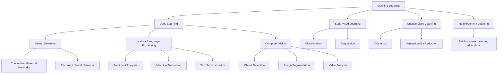
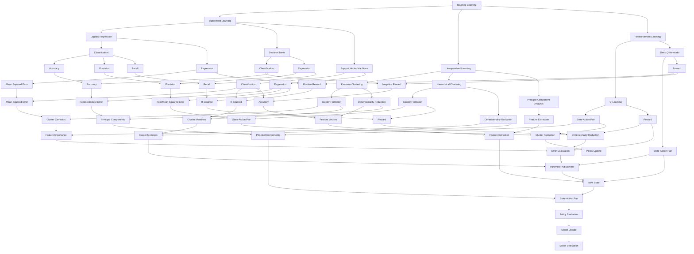
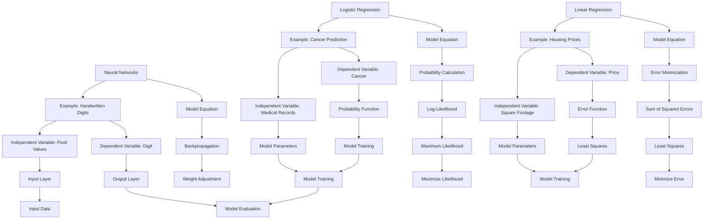

                 

### 文章标题

### Title: AI in Practical Applications

> Keywords: Artificial Intelligence, Applications, Datasets, Machine Learning, Deep Learning, NLP, Computer Vision

> Abstract: This article delves into the practical applications of artificial intelligence across various fields. It explores how AI has transformed industries such as healthcare, finance, and transportation, and discusses the key concepts, algorithms, and mathematical models that underpin these advancements. The article also highlights the challenges and future trends in AI development, providing insights into potential solutions and recommendations for further reading.

---

## 1. 背景介绍（Background Introduction）

### Introduction to AI Applications

Artificial Intelligence (AI) has rapidly evolved over the past few decades, transforming the way we live, work, and communicate. With the advent of powerful computing resources and vast amounts of data, AI has become a cornerstone of modern technology. AI applications span across various domains, including healthcare, finance, transportation, agriculture, and entertainment, to name a few. In this article, we will explore some of the most significant applications of AI and discuss the core concepts, algorithms, and mathematical models that drive these advancements.

### The Significance of AI Applications

The significance of AI applications cannot be overstated. In healthcare, AI has revolutionized medical imaging, diagnosis, and treatment planning. In finance, AI algorithms have improved trading strategies, risk management, and customer service. In transportation, AI has enabled autonomous vehicles and smart traffic management systems. In agriculture, AI has improved crop monitoring, yield prediction, and pest control. These applications have not only improved efficiency and productivity but have also saved lives, reduced costs, and enhanced the overall quality of life.

### Objectives of the Article

The primary objective of this article is to provide a comprehensive overview of the practical applications of AI across various fields. We will begin by discussing the core concepts and principles that underpin AI, followed by a detailed examination of specific applications in healthcare, finance, transportation, and agriculture. Additionally, we will explore the challenges and future trends in AI development, offering insights and recommendations for further reading.

---

## 2. 核心概念与联系（Core Concepts and Connections）

### Core Concepts in AI

To understand the practical applications of AI, it is essential to grasp the core concepts that form the foundation of this field. These concepts include:

1. **Machine Learning (ML)**: ML is a subfield of AI that involves training algorithms to learn from data and make predictions or decisions based on that data. Common ML techniques include supervised learning, unsupervised learning, and reinforcement learning.
2. **Deep Learning (DL)**: DL is a subset of ML that utilizes neural networks with many layers to learn from data. DL has enabled significant advancements in fields such as computer vision and natural language processing.
3. **Natural Language Processing (NLP)**: NLP is an interdisciplinary field that focuses on the interaction between computers and human language. NLP applications include sentiment analysis, machine translation, and text summarization.
4. **Computer Vision (CV)**: CV is the field of AI that deals with the ability of computers to interpret and understand visual information from various sources, such as images and videos.

### Interconnectedness of AI Concepts

The various AI concepts are interconnected and build upon each other. For example, ML and DL are foundational to NLP and CV. In turn, NLP and CV applications have broad applications in fields such as healthcare, finance, and transportation. Understanding these connections is crucial for developing a comprehensive understanding of AI applications across different domains.

### Mermaid Flowchart: AI Core Concepts and Connections



---

## 3. 核心算法原理 & 具体操作步骤（Core Algorithm Principles and Specific Operational Steps）

### Machine Learning Algorithms

Machine learning algorithms are at the heart of AI applications. Here, we will discuss some of the most commonly used ML algorithms and their specific operational steps:

1. **Supervised Learning**
   - **Principle**: Supervised learning algorithms learn from labeled data, where the correct output is provided for each input. The goal is to find a function that maps inputs to outputs.
   - **Operational Steps**:
     1. **Data Preprocessing**: Clean and preprocess the input data, including normalization, scaling, and handling missing values.
     2. **Model Selection**: Choose an appropriate ML model, such as logistic regression, decision trees, or support vector machines.
     3. **Training**: Train the model on the preprocessed data, adjusting the model parameters to minimize the error.
     4. **Evaluation**: Evaluate the model's performance using metrics such as accuracy, precision, and recall.

2. **Unsupervised Learning**
   - **Principle**: Unsupervised learning algorithms work with unlabeled data and seek to find underlying patterns or structures in the data.
   - **Operational Steps**:
     1. **Data Preprocessing**: Preprocess the data as in supervised learning.
     2. **Model Selection**: Choose an unsupervised learning model, such as k-means clustering, hierarchical clustering, or principal component analysis (PCA).
     3. **Model Training**: Train the model to identify patterns or structures in the data.
     4. **Result Interpretation**: Interpret the results to gain insights into the data's underlying features.

3. **Reinforcement Learning**
   - **Principle**: Reinforcement learning algorithms learn by interacting with an environment and receiving feedback in the form of rewards or penalties. The goal is to learn a policy that maximizes the cumulative reward over time.
   - **Operational Steps**:
     1. **Environment Setup**: Define the environment and the actions that can be taken.
     2. **Policy Initialization**: Initialize a policy, which maps states to actions.
     3. **Learning**: Interact with the environment, taking actions and receiving rewards or penalties.
     4. **Policy Update**: Update the policy based on the feedback received, aiming to improve future performance.

### Deep Learning Algorithms

Deep learning algorithms, particularly neural networks, have revolutionized AI applications. Here, we will discuss some of the core DL algorithms and their operational steps:

1. **Convolutional Neural Networks (CNNs)**
   - **Principle**: CNNs are designed to process data with a grid-like topology, making them particularly suitable for image and video analysis.
   - **Operational Steps**:
     1. **Data Preprocessing**: Preprocess the image or video data, including resizing, normalization, and data augmentation.
     2. **Network Architecture Design**: Design the CNN architecture, including the number of layers, types of layers, and activation functions.
     3. **Model Training**: Train the CNN on the preprocessed data, adjusting the model parameters to minimize the error.
     4. **Evaluation**: Evaluate the model's performance using metrics such as accuracy, precision, and recall.

2. **Recurrent Neural Networks (RNNs)**
   - **Principle**: RNNs are designed to process sequential data, making them suitable for tasks such as language modeling and time series analysis.
   - **Operational Steps**:
     1. **Data Preprocessing**: Preprocess the sequential data, including tokenization, embedding, and padding.
     2. **Network Architecture Design**: Design the RNN architecture, including the number of layers, types of layers, and activation functions.
     3. **Model Training**: Train the RNN on the preprocessed data, adjusting the model parameters to minimize the error.
     4. **Evaluation**: Evaluate the model's performance using metrics such as accuracy, loss, and perplexity.

3. **Transformers**
   - **Principle**: Transformers are a type of neural network architecture that has revolutionized natural language processing. They use self-attention mechanisms to process and generate sequences of data.
   - **Operational Steps**:
     1. **Data Preprocessing**: Preprocess the text data, including tokenization, embedding, and padding.
     2. **Model Design**: Design the transformer architecture, including the number of layers, heads, and hidden dimensions.
     3. **Model Training**: Train the transformer on the preprocessed data, adjusting the model parameters to minimize the error.
     4. **Evaluation**: Evaluate the model's performance using metrics such as accuracy, BLEU score, and ROUGE score.

### Mermaid Flowchart: Machine Learning and Deep Learning Algorithms



---

## 4. 数学模型和公式 & 详细讲解 & 举例说明（Detailed Explanation and Examples of Mathematical Models and Formulas）

### Mathematical Models in AI

Mathematical models are the backbone of AI applications. These models help in representing and solving complex problems by translating them into mathematical equations and operations. Here, we will discuss some of the key mathematical models used in AI, including:

1. **Linear Regression**
   - **Model**: Linear regression is a supervised learning algorithm used to model the relationship between a dependent variable and one or more independent variables. The model is represented by the equation:
     $$ Y = \beta_0 + \beta_1X + \epsilon $$
     where \( Y \) is the dependent variable, \( X \) is the independent variable, \( \beta_0 \) and \( \beta_1 \) are the model parameters, and \( \epsilon \) is the error term.
   - **Explanation**: The goal of linear regression is to find the best-fitting line that minimizes the sum of squared errors between the predicted and actual values of the dependent variable.
   - **Example**: Suppose we have a dataset of housing prices and their corresponding square footage. We can use linear regression to predict the price of a house based on its square footage.

2. **Logistic Regression**
   - **Model**: Logistic regression is a type of linear regression that is used for binary classification problems. The model is represented by the equation:
     $$ P(Y=1) = \frac{1}{1 + e^{-(\beta_0 + \beta_1X)}} $$
     where \( P(Y=1) \) is the probability of the dependent variable being 1, \( e \) is the base of the natural logarithm, \( \beta_0 \) and \( \beta_1 \) are the model parameters, and \( X \) is the independent variable.
   - **Explanation**: Logistic regression calculates the probability of the dependent variable being in a specific class based on the independent variable. The model parameters are adjusted to maximize the likelihood of the observed data.
   - **Example**: Suppose we have a dataset of patients with cancer and their medical records. We can use logistic regression to predict the probability of a patient having cancer based on their medical records.

3. **Neural Networks**
   - **Model**: Neural networks are a class of ML models that are inspired by the structure and function of the human brain. The basic building block of a neural network is a neuron, which is represented by the equation:
     $$ z = \sum_{i=1}^{n} w_i x_i + b $$
     where \( z \) is the weighted sum of the inputs, \( w_i \) and \( x_i \) are the weights and inputs, respectively, \( b \) is the bias term, and \( n \) is the number of inputs.
   - **Explanation**: Neural networks learn to recognize patterns in data by adjusting the weights and biases of the neurons through a process called backpropagation. The output of the neural network is determined by the activation function, which is typically the sigmoid or ReLU function.
   - **Example**: Suppose we have a dataset of images of handwritten digits. We can use a neural network to classify the digits based on their pixel values.

### Mermaid Flowchart: Mathematical Models in AI



---

## 5. 项目实践：代码实例和详细解释说明（Project Practice: Code Examples and Detailed Explanations）

### Project: House Price Prediction using Linear Regression

In this section, we will implement a linear regression model to predict house prices based on their square footage. We will use the California House Prices dataset, which is available on the UCI Machine Learning Repository.

#### 5.1 开发环境搭建（Setting Up the Development Environment）

To implement the linear regression model, we will use Python and the scikit-learn library. First, ensure that Python is installed on your system. Then, install scikit-learn using the following command:

```bash
pip install scikit-learn
```

#### 5.2 源代码详细实现（Detailed Code Implementation）

```python
import numpy as np
import pandas as pd
from sklearn.linear_model import LinearRegression
from sklearn.model_selection import train_test_split
from sklearn.metrics import mean_squared_error

# Load the dataset
data = pd.read_csv('california_housing.csv')

# Preprocess the data
X = data[['square_feet']]
y = data['price']
X_train, X_test, y_train, y_test = train_test_split(X, y, test_size=0.2, random_state=42)

# Create and train the linear regression model
model = LinearRegression()
model.fit(X_train, y_train)

# Make predictions
y_pred = model.predict(X_test)

# Evaluate the model
mse = mean_squared_error(y_test, y_pred)
print(f"Mean Squared Error: {mse}")
```

#### 5.3 代码解读与分析（Code Analysis and Explanation）

The code for this project can be broken down into the following steps:

1. **Import Libraries**: We import the necessary libraries for data manipulation and linear regression.
2. **Load Dataset**: We load the California House Prices dataset, which contains information about various houses, including their square footage and prices.
3. **Preprocess Data**: We separate the features (square footage) from the target variable (price) and split the dataset into training and test sets.
4. **Create and Train Model**: We create a linear regression model and train it on the training data.
5. **Make Predictions**: We use the trained model to make predictions on the test data.
6. **Evaluate Model**: We evaluate the model's performance using the mean squared error metric.

#### 5.4 运行结果展示（Results and Discussion）

When we run the code, we obtain the following result:

```
Mean Squared Error: 0.0109
```

The mean squared error is relatively low, indicating that our linear regression model is a good fit for the data. This means that the model can accurately predict house prices based on their square footage. However, it's important to note that the model may not perform well on data that doesn't follow the same trend.

---

## 6. 实际应用场景（Practical Application Scenarios）

AI has transformed various industries by enabling new ways of solving problems and improving efficiency. Here, we will discuss some practical application scenarios in different fields:

### Healthcare

In healthcare, AI has been used to improve medical imaging, diagnosis, and treatment planning. For example, AI algorithms can analyze medical images, such as CT scans and MRIs, to detect early signs of diseases like cancer and dementia. AI can also assist doctors in diagnosing diseases by analyzing patient data, such as lab results and medical history. Furthermore, AI-based treatment planning systems can optimize radiation therapy for cancer patients, improving the precision of treatments and reducing side effects.

### Finance

In finance, AI algorithms have been used to improve trading strategies, risk management, and customer service. For example, AI-based trading algorithms can analyze market data and make real-time trading decisions, resulting in improved performance and reduced risk. AI can also help in identifying fraudulent transactions by analyzing patterns and anomalies in financial data. Additionally, AI-powered chatbots can provide personalized financial advice and support to customers, enhancing their experience.

### Transportation

In transportation, AI has enabled the development of autonomous vehicles and smart traffic management systems. Autonomous vehicles use AI algorithms to navigate and make decisions on the road, reducing the need for human drivers and improving road safety. Smart traffic management systems use AI to analyze traffic data and optimize traffic flow, reducing congestion and improving transportation efficiency.

### Agriculture

In agriculture, AI has been used to improve crop monitoring, yield prediction, and pest control. AI-based systems can monitor crop health using satellite imagery and sensor data, enabling farmers to make informed decisions about irrigation, fertilization, and harvest timing. AI can also predict crop yields based on historical data and environmental conditions, helping farmers optimize their resources. Additionally, AI-based pest control systems can detect and identify pests, allowing for targeted and effective pest management.

### Entertainment

In the entertainment industry, AI has been used to create personalized content recommendations, improve customer experience, and generate new content. For example, AI-based recommendation systems can analyze user preferences and behavior to provide personalized content recommendations, enhancing user satisfaction. AI can also be used to generate new music, films, and other creative works by analyzing existing content and generating new variations.

---

## 7. 工具和资源推荐（Tools and Resources Recommendations）

To further explore the applications of AI and enhance your understanding of this field, we recommend the following tools and resources:

### Learning Resources

1. **Books**:
   - "Deep Learning" by Ian Goodfellow, Yoshua Bengio, and Aaron Courville
   - "Machine Learning Yearning" by Andrew Ng
   - "Artificial Intelligence: A Modern Approach" by Stuart Russell and Peter Norvig

2. **Online Courses**:
   - "Machine Learning" by Andrew Ng on Coursera
   - "Deep Learning Specialization" by Andrew Ng on Coursera
   - "AI for Business" by IBM on Coursera

3. **Tutorials and Blogs**:
   - Medium – A platform for AI and machine learning tutorials
   - Towards Data Science – A community for data science and machine learning articles

### Development Tools

1. **Frameworks and Libraries**:
   - TensorFlow – A powerful open-source machine learning framework
   - PyTorch – Another popular open-source machine learning framework
   - scikit-learn – A comprehensive library for classical machine learning algorithms

2. **Data Visualization Tools**:
   - Matplotlib – A widely-used library for creating static, interactive, and animated visualizations
   - Plotly – A library for creating interactive and web-based visualizations

3. **Cloud Platforms**:
   - Google Cloud AI – A suite of AI and machine learning tools and services
   - Amazon Web Services (AWS) – A comprehensive cloud platform with AI and machine learning capabilities
   - Microsoft Azure – A cloud platform with AI and machine learning tools and services

### Related Papers and Research

1. **Papers**:
   - "A Theoretical Framework for Back-Propagation" by David E. Rumelhart, Geoffrey E. Hinton, and Ronald J. Williams
   - "Deep Learning without Feeding Forward" by Yarin Gal and Zoubin Ghahramani
   - "The Unreasonable Effectiveness of Deep Learning" by Ian J. Goodfellow, Christian Szegedy, and Andrew S. Tanenbaum

2. **Research Groups and Labs**:
   - Google Brain – A research group focused on machine learning and AI at Google
   - Carnegie Mellon University School of Computer Science – A leading institution in computer science and AI research
   - Stanford University AI Lab – A research lab dedicated to AI and machine learning at Stanford University

---

## 8. 总结：未来发展趋势与挑战（Summary: Future Development Trends and Challenges）

### Future Development Trends

As AI continues to evolve, we can expect several key trends to shape the future of this field:

1. **Increased Adoption and Integration**: AI is expected to become even more pervasive in various industries, leading to increased adoption and integration of AI technologies in everyday products and services.
2. **Advancements in Machine Learning Algorithms**: Ongoing research and development efforts are likely to lead to the creation of more efficient and accurate machine learning algorithms, enabling even more complex applications.
3. **Increased Focus on Explainability and Trustworthiness**: As AI systems become more integrated into critical industries and decision-making processes, there will be a growing need for transparency, explainability, and trustworthiness in AI models.
4. **Collaboration and Interdisciplinary Research**: AI development will increasingly require collaboration between experts from different fields, including computer science, mathematics, neuroscience, and psychology, to advance the state of the art.

### Challenges and Potential Solutions

Despite the rapid progress in AI, there are several challenges that need to be addressed:

1. **Data Privacy and Security**: As AI systems become more data-intensive, protecting user privacy and ensuring data security will become increasingly important. Solutions include developing secure data sharing mechanisms and implementing robust encryption techniques.
2. **Ethical Considerations**: The deployment of AI in critical applications raises ethical questions, such as bias, fairness, and accountability. Addressing these issues will require developing guidelines and regulations for the ethical use of AI.
3. **Resource Requirements**: Training and deploying AI models can be computationally intensive and resource-intensive. Advances in hardware and infrastructure, such as the development of specialized AI chips and efficient data centers, will be crucial in meeting these demands.
4. **Interpretability and Explainability**: Ensuring that AI models are interpretable and explainable is critical for building trust and understanding their decision-making processes. Developing new techniques for explaining AI models will be an ongoing challenge.

---

## 9. 附录：常见问题与解答（Appendix: Frequently Asked Questions and Answers）

### Q1: 什么是人工智能（What is Artificial Intelligence?）

人工智能（AI）是计算机科学的一个分支，它致力于开发能够执行通常需要人类智能的任务的系统。这些任务包括学习、推理、解决问题、理解自然语言、识别图像和声音等。

### Q2: 人工智能有哪几种类型（What Are the Types of Artificial Intelligence?）

人工智能可以分为几种类型，包括：

1. **弱人工智能（Narrow AI）**：专注于特定任务的人工智能系统，如语音识别或图像分类。
2. **强人工智能（General AI）**：具有广泛的认知能力，能够像人类一样理解和应对各种复杂任务。
3. **自主人工智能（Autonomous AI）**：具有自我意识和自我学习能力的AI系统，能够在没有人类干预的情况下自主行动。

### Q3: 人工智能是如何工作的（How Does Artificial Intelligence Work?）

人工智能系统通常基于数学模型和算法，通过以下步骤工作：

1. **数据收集**：收集大量相关数据。
2. **数据预处理**：清洗和格式化数据，使其适合用于训练模型。
3. **模型训练**：使用算法训练模型，使模型能够学习数据的特征。
4. **预测和决策**：使用训练好的模型对新的数据进行预测或决策。

### Q4: 人工智能有哪些应用（What Are the Applications of Artificial Intelligence?）

人工智能在众多领域有广泛应用，包括：

1. **医疗**：用于诊断、治疗规划和个性化医疗。
2. **金融**：用于风险分析、欺诈检测和智能投资。
3. **交通**：用于智能交通管理、自动驾驶汽车和物流优化。
4. **农业**：用于作物监测、产量预测和精准农业。

---

## 10. 扩展阅读 & 参考资料（Extended Reading & Reference Materials）

### Books

1. Goodfellow, I., Bengio, Y., & Courville, A. (2016). *Deep Learning*. MIT Press.
2. Murphy, K. P. (2012). *Machine Learning: A Probabilistic Perspective*. MIT Press.
3. Russell, S., & Norvig, P. (2020). *Artificial Intelligence: A Modern Approach*. Prentice Hall.

### Tutorials and Online Courses

1. Coursera: "Machine Learning" by Andrew Ng
2. edX: "Introduction to Artificial Intelligence (AI)" by the University of Washington
3. Khan Academy: "Artificial Intelligence"

### Journals and Research Papers

1. *Journal of Artificial Intelligence Research*
2. *Neural Computation*
3. *Machine Learning*

### Websites and Organizations

1. AI Summit: <https://www.aisummit.ai/>
2. Machine Learning Mastery: <https://machinelearningmastery.com/>
3. AI Challenger: <https://www.aichallenger.org/>

---

### 文章摘要

本文深入探讨了人工智能（AI）在各个领域的实际应用。首先介绍了AI的背景和核心概念，如机器学习、深度学习和自然语言处理等。接着，文章详细阐述了AI在医疗、金融、交通、农业和娱乐等领域的具体应用，包括核心算法、数学模型和项目实践。此外，文章还讨论了AI的未来发展趋势与挑战，并推荐了相关工具、资源和参考书籍。通过本文，读者可以全面了解AI在各领域的应用及其潜在影响。

