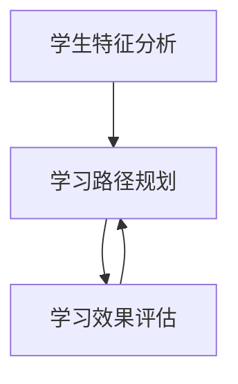
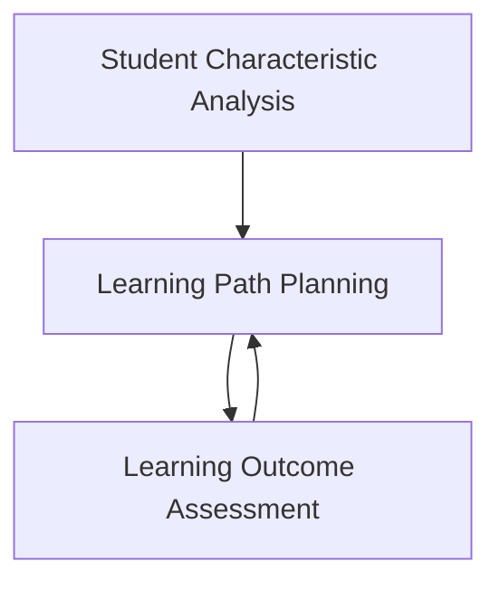

                 

### 1. 背景介绍（Background Introduction）

随着人工智能技术的飞速发展，其应用领域也不断扩展，从医疗、金融到娱乐，AI正在深刻改变我们的生活方式。其中，教育领域作为培养未来人才的重要阵地，也逐渐成为了人工智能技术的重要应用场景。本文将重点关注人工智能在教育领域的一个关键应用——个性化学习。

个性化学习是指根据每个学生的个人特点和需求，提供定制化的学习内容和教学方法。在传统教育模式中，教师通常需要面对全班学生，采用统一的教学内容和进度。这种方式虽然能够确保教学内容的覆盖面，但很难满足每个学生的个性化需求。个性化学习的出现，正是为了解决这一问题，通过人工智能技术，实现对学生学习行为的分析和预测，从而提供更加贴合学生实际需求的个性化教学方案。

人工智能在教育领域的应用，不仅限于个性化学习。例如，智能辅导系统可以实时监测学生的学习进度和理解程度，提供针对性的辅导和练习；智能评分系统能够快速、准确地评估学生的作业和考试成绩；虚拟现实和增强现实技术则为学生提供了更加生动、互动的学习体验。然而，本文将聚焦于个性化学习，探讨其背后的技术原理、实现方法以及未来的发展趋势。

本文结构如下：

- **第1章 背景介绍**：概述人工智能在教育领域的应用背景和个性化学习的意义。
- **第2章 核心概念与联系**：介绍个性化学习相关的核心概念，包括学生特征分析、学习路径规划和学习效果评估等。
- **第3章 核心算法原理 & 具体操作步骤**：详细阐述用于实现个性化学习的关键算法，如机器学习算法、自然语言处理算法等。
- **第4章 数学模型和公式 & 详细讲解 & 举例说明**：介绍用于个性化学习的数学模型和公式，并通过具体案例进行说明。
- **第5章 项目实践：代码实例和详细解释说明**：提供实际项目中的代码实例，并对其进行详细解读和分析。
- **第6章 实际应用场景**：分析个性化学习在不同教育场景中的实际应用。
- **第7章 工具和资源推荐**：推荐相关学习资源和开发工具。
- **第8章 总结：未来发展趋势与挑战**：总结个性化学习的发展趋势和面临的挑战。
- **第9章 附录：常见问题与解答**：回答读者可能遇到的一些常见问题。
- **第10章 扩展阅读 & 参考资料**：提供进一步学习的资源。

通过本文的阅读，读者将能够全面了解人工智能在教育领域中的应用，尤其是个性化学习的技术原理和实际应用。这不仅有助于教育工作者更好地利用人工智能技术提高教学质量，也为有志于从事人工智能教育应用开发的研究者提供了宝贵的参考。

## 1. Background Introduction

With the rapid advancement of artificial intelligence (AI) technology, its applications have expanded into various domains, from healthcare and finance to entertainment. AI is profoundly reshaping our lifestyles, and the education sector, as a critical ground for nurturing future talent, has become a significant area of focus for AI adoption. This article will primarily focus on a key application of AI in education—personalized learning.

Personalized learning refers to the customization of learning content and methods based on individual student characteristics and needs. In traditional educational models, teachers typically face an entire class, employing a unified curriculum and pace of instruction. While this approach ensures that the curriculum is broadly covered, it often fails to meet the personalized needs of each student. The emergence of personalized learning aims to address this issue by leveraging AI technology to analyze and predict student learning behaviors, thereby providing tailored teaching plans that align more closely with the actual needs of students.

The application of AI in education encompasses more than just personalized learning. For instance, intelligent tutoring systems can monitor student progress and understanding in real-time, offering targeted guidance and practice. Intelligent grading systems can quickly and accurately assess student assignments and exam performance. Virtual and augmented reality technologies provide students with more interactive and immersive learning experiences. However, this article will concentrate on personalized learning, exploring its underlying technical principles, implementation methods, and future development trends.

The structure of this article is as follows:

- **Chapter 1 Background Introduction**: Provides an overview of the application background of AI in education and the significance of personalized learning.
- **Chapter 2 Core Concepts and Connections**: Introduces key concepts related to personalized learning, including student characteristic analysis, learning path planning, and learning outcome assessment.
- **Chapter 3 Core Algorithm Principles and Specific Operational Steps**: Elaborates on the key algorithms used to implement personalized learning, such as machine learning and natural language processing algorithms.
- **Chapter 4 Mathematical Models and Formulas & Detailed Explanation & Examples**: Introduces mathematical models and formulas used in personalized learning, and illustrates them through specific examples.
- **Chapter 5 Project Practice: Code Examples and Detailed Explanations**: Provides code examples from actual projects and offers detailed analysis and explanation.
- **Chapter 6 Practical Application Scenarios**: Analyzes the practical applications of personalized learning in different educational contexts.
- **Chapter 7 Tools and Resources Recommendations**: Recommends learning resources and development tools related to AI in education.
- **Chapter 8 Summary: Future Development Trends and Challenges**: Summarizes the future development trends and challenges of personalized learning.
- **Chapter 9 Appendix: Frequently Asked Questions and Answers**: Answers common questions readers may encounter.
- **Chapter 10 Extended Reading & Reference Materials**: Provides additional resources for further study.

By reading this article, readers will gain a comprehensive understanding of the application of AI in education, particularly focusing on the technical principles and practical applications of personalized learning. This will not only benefit educators in leveraging AI technology to enhance teaching quality but also provide valuable insights for researchers interested in developing AI applications for education. 

---

在接下来的章节中，我们将深入探讨个性化学习背后的核心概念、算法原理、数学模型、实际应用场景以及未来发展。通过逐步分析推理，我们将为读者呈现一幅完整的人工智能教育应用全景图。敬请期待。

## 2. 核心概念与联系（Core Concepts and Connections）

要深入探讨个性化学习，我们首先需要了解其背后的核心概念，这些概念包括学生特征分析、学习路径规划和学习效果评估等。这些核心概念相互联系，共同构成了个性化学习的技术基础。

### 2.1 学生特征分析（Student Characteristic Analysis）

学生特征分析是个性化学习的基础，它涉及对学生的个体差异进行量化，包括学习能力、学习风格、兴趣爱好、认知水平和心理特点等。通过数据分析，我们可以识别出每个学生的独特特征，为后续的学习路径规划提供依据。

- **学习能力**：学生的学习能力可以通过历年考试成绩、课堂参与度、作业完成情况等多种数据指标进行衡量。例如，可以使用机器学习算法分析学生的历史成绩，预测其未来的学习表现。
- **学习风格**：不同的学生有不同的学习偏好，有的喜欢通过视觉信息学习，有的则更喜欢听觉或动手操作。通过问卷调查或行为分析，可以识别出学生的主要学习风格。
- **兴趣爱好**：学生的兴趣爱好可以影响他们的学习动机和效果。了解学生的兴趣点，可以为他们推荐更相关、更吸引人的学习内容。
- **认知水平**：学生的认知水平决定了他们对新知识的理解和接受程度。通过对学生认知能力的评估，可以为不同认知水平的学生提供适当难度的学习材料。

### 2.2 学习路径规划（Learning Path Planning）

学习路径规划是根据学生特征分析的结果，设计出适合每个学生的学习路径。这个路径不仅包括学习内容的顺序和难度，还包括学习资源和教学方法的选用。

- **内容定制**：根据学生的兴趣和能力，定制学习内容。例如，对于数学成绩较好的学生，可以推荐更高级的数学课程；对于对编程感兴趣的学生，可以推荐编程相关的学习资源。
- **顺序规划**：确保学习内容的顺序符合认知发展的规律。例如，先教授基础概念，再逐步引入复杂知识点。
- **资源选择**：选用适合学生的学习资源，包括教科书、在线课程、教学视频等。不同的资源形式适合不同类型的学习风格。

### 2.3 学习效果评估（Learning Outcome Assessment）

学习效果评估是衡量个性化学习效果的关键步骤，它通过定期的测试和反馈，了解学生在个性化学习过程中的表现和进步。

- **测试与反馈**：定期进行测试，评估学生的学习效果。测试可以采用在线测验、课堂测试等多种形式。通过反馈，学生可以了解自己的学习成果，教师也可以调整教学策略。
- **数据分析**：对测试结果进行数据分析，识别学生的强项和弱项。例如，通过对比不同学习路径下的测试成绩，分析哪种路径更有效。
- **持续改进**：根据评估结果，持续调整学习内容和教学策略，以实现更好的个性化学习效果。

### 2.4 Mermaid 流程图（Mermaid Flowchart）

以下是一个简化的 Mermaid 流程图，展示了学生特征分析、学习路径规划和学习效果评估之间的流程关系：



在个性化学习中，这三个核心概念紧密相连，形成一个闭环系统。学生特征分析为学习路径规划提供依据，学习路径规划指导实际教学过程，而学习效果评估则对教学效果进行反馈和优化。通过不断地循环和改进，实现更加精准和有效的个性化学习。

## 2.1 What is Student Characteristic Analysis?
Student characteristic analysis is the foundation of personalized learning. It involves quantifying individual differences among students, including their learning abilities, learning styles, interests, cognitive levels, and psychological traits. By analyzing these characteristics, we can identify unique attributes of each student and use this information to tailor subsequent learning path planning.

- **Learning Ability**: Students' learning abilities can be measured through various data indicators such as historical test scores, classroom participation, and homework completion. For example, machine learning algorithms can be used to analyze past academic performance data and predict future learning outcomes.
- **Learning Styles**: Different students have different preferences for learning. Some prefer visual information, while others prefer auditory or hands-on activities. Learning styles can be identified through surveys or behavioral analysis.
- **Interests**: Students' interests can influence their motivation and effectiveness in learning. Understanding their interests can help in recommending more relevant and engaging learning materials.
- **Cognitive Levels**: Students' cognitive levels determine their ability to understand and accept new knowledge. Assessments of cognitive abilities can be used to provide learning materials that are appropriately challenging for each student.

### 2.2 Learning Path Planning
Learning path planning is designed based on the results of student characteristic analysis. It involves creating a learning path that suits each student, including the sequence and difficulty of learning content, as well as the selection of learning resources and teaching methods.

- **Content Personalization**: Learning content should be personalized based on students' interests and abilities. For example, students with strong math performance can be recommended advanced math courses, while those interested in programming can be recommended resources related to coding.
- **Sequence Planning**: Ensure that the sequence of learning content follows the principles of cognitive development. For example, foundational concepts should be taught first, followed by more complex topics.
- **Resource Selection**: Choose learning resources that are suitable for students based on their learning styles. Resources can include textbooks, online courses, instructional videos, and more.

### 2.3 Learning Outcome Assessment
Learning outcome assessment is a critical step in measuring the effectiveness of personalized learning. It involves regular testing and feedback to understand how students are progressing in their learning.

- **Testing and Feedback**: Regularly conduct tests to assess student performance. Tests can take various forms, including online quizzes, classroom tests, and more. Feedback allows students to understand their learning outcomes and teachers to adjust teaching strategies.
- **Data Analysis**: Analyze test results to identify students' strengths and weaknesses. For example, comparing test scores across different learning paths can help determine which path is more effective.
- **Continuous Improvement**: Use assessment results to continuously adjust learning content and teaching strategies to achieve better personalized learning outcomes.

### 2.4 Mermaid Flowchart
Here is a simplified Mermaid flowchart illustrating the relationship between student characteristic analysis, learning path planning, and learning outcome assessment:



In personalized learning, these three core concepts are closely interconnected, forming a closed-loop system. Student characteristic analysis provides the basis for learning path planning, which guides the actual teaching process, while learning outcome assessment provides feedback to optimize teaching effectiveness. Through continuous cycles and improvements, more precise and effective personalized learning can be achieved. 

---

在了解了个性化学习的核心概念之后，我们接下来将深入探讨实现个性化学习的关键算法，包括机器学习算法和自然语言处理算法。这些算法在学生特征分析、学习路径规划和学习效果评估中发挥着重要作用。

## 3. 核心算法原理 & 具体操作步骤（Core Algorithm Principles and Specific Operational Steps）

个性化学习的实现离不开一系列核心算法的支持，这些算法通过分析学生特征、规划学习路径和评估学习效果，确保个性化学习的有效性。在本章节中，我们将介绍两种关键算法：机器学习算法和自然语言处理算法，并详细描述它们的原理和具体操作步骤。

### 3.1 机器学习算法（Machine Learning Algorithms）

机器学习算法是个性化学习的基础，它通过从数据中学习规律，预测学生的行为和学习效果。以下是几种常用的机器学习算法及其应用：

#### 3.1.1 决策树算法（Decision Tree Algorithm）

**原理**：决策树是一种树形结构，通过一系列的判断条件来分割数据集，并最终得出结论。每个节点代表一个特征，每个分支代表特征的取值，叶节点表示分类结果。

**操作步骤**：
1. **特征选择**：选择影响学生表现的最重要特征，如考试成绩、课堂参与度等。
2. **数据分割**：根据选择的特征，将数据集分割成子集。
3. **构建决策树**：使用ID3、C4.5或CART等算法构建决策树模型。
4. **评估模型**：通过交叉验证等方法评估模型的准确性。

#### 3.1.2 支持向量机（Support Vector Machine, SVM）

**原理**：SVM是一种分类算法，通过找到一个最佳的超平面，将不同类别的数据点分开。它适用于高维数据，并具有很好的泛化能力。

**操作步骤**：
1. **特征提取**：提取对学生特征有影响的关键特征。
2. **数据预处理**：进行数据标准化、缺失值填补等预处理操作。
3. **模型训练**：使用支持向量机算法训练模型。
4. **模型评估**：通过测试集评估模型的分类准确性。

#### 3.1.3 集成学习（Ensemble Learning）

**原理**：集成学习通过结合多个基本模型的预测结果，提高整体预测的准确性和稳定性。常用的集成学习方法有随机森林（Random Forest）和梯度提升树（Gradient Boosting Tree）。

**操作步骤**：
1. **构建基础模型**：选择不同的基础模型，如决策树、随机森林等。
2. **训练模型**：使用训练数据集分别训练每个基础模型。
3. **集成预测**：将各个基础模型的预测结果进行加权平均或投票，得到最终预测结果。
4. **模型评估**：评估集成模型的预测性能。

### 3.2 自然语言处理算法（Natural Language Processing, NLP）

自然语言处理算法在个性化学习中扮演着重要角色，它能够处理和分析学生的文本数据，提取关键信息，为学习路径规划和学习效果评估提供支持。

#### 3.2.1 词袋模型（Bag-of-Words, BoW）

**原理**：词袋模型将文本表示为一个向量，其中每个维度对应一个词汇，值表示词汇在文本中的出现次数。

**操作步骤**：
1. **分词**：将文本分割成单词或词组。
2. **词频统计**：计算每个词在文本中的出现次数。
3. **向量表示**：将词频统计结果转换为向量表示。
4. **特征提取**：提取重要的词汇特征，用于训练模型。

#### 3.2.2 词嵌入（Word Embedding）

**原理**：词嵌入将词汇映射到低维空间中，使得语义相似的词汇在空间中靠近。

**操作步骤**：
1. **词表构建**：构建包含所有词汇的词表。
2. **嵌入向量计算**：使用预训练模型（如Word2Vec、GloVe）计算每个词汇的嵌入向量。
3. **文本表示**：将文本转换为嵌入向量的形式。
4. **模型训练**：使用嵌入向量训练分类或回归模型。

#### 3.2.3 序列模型（Sequence Models）

**原理**：序列模型可以处理文本序列，捕捉词汇之间的顺序关系。常用的序列模型有循环神经网络（RNN）、长短期记忆网络（LSTM）和变换器（Transformer）。

**操作步骤**：
1. **数据预处理**：对文本进行分词、去停用词等预处理。
2. **序列编码**：将预处理后的文本编码为序列形式。
3. **模型训练**：使用序列模型训练模型，如RNN或LSTM。
4. **模型评估**：通过测试集评估模型的性能。

### 3.3 算法应用示例（Algorithm Application Example）

以下是一个简单的应用示例，使用决策树算法对学生成绩进行预测：

#### 3.3.1 数据集准备

假设我们有以下数据集：

| 学生ID | 英语成绩 | 数学成绩 | 课堂参与度 | 是否通过考试 |
|--------|--------|--------|-------------|-------------|
| 1      | 85     | 90     | 高          | 是          |
| 2      | 70     | 75     | 一般        | 是          |
| 3      | 60     | 65     | 一般        | 否          |
| 4      | 95     | 85     | 高          | 是          |

#### 3.3.2 特征选择

选择“英语成绩”、“数学成绩”和“课堂参与度”作为决策树的特征。

#### 3.3.3 模型训练

使用决策树算法训练模型，输入数据集的特征和标签。

#### 3.3.4 模型评估

使用测试集评估模型的预测准确性。

通过这个简单的示例，我们可以看到机器学习算法在个性化学习中的应用。在实际应用中，算法的选择和实现会根据具体需求和数据特性进行调整。

## 3.1 Machine Learning Algorithm Principles and Specific Operational Steps

Machine learning algorithms are fundamental to the implementation of personalized learning. They learn patterns from data to predict student behaviors and learning outcomes. In this section, we will introduce two key algorithms: machine learning and natural language processing, and detail their principles and operational steps.

### 3.1 Machine Learning Algorithms

Machine learning algorithms form the foundation of personalized learning. They learn patterns from data to predict student behaviors and learning outcomes. Here are several commonly used machine learning algorithms and their applications:

#### 3.1.1 Decision Tree Algorithm

**Principles**: A decision tree is a tree-like structure that makes decisions based on a series of conditions to segment the dataset and ultimately arrive at a conclusion. Each node represents a feature, each branch represents a feature value, and the leaf nodes represent classification results.

**Operational Steps**:
1. **Feature Selection**: Select the most important features that affect student performance, such as exam scores and classroom participation.
2. **Data Segmentation**: Segment the dataset based on the selected features.
3. **Building the Decision Tree**: Construct a decision tree model using algorithms like ID3, C4.5, or CART.
4. **Model Evaluation**: Evaluate the model's accuracy using cross-validation methods.

#### 3.1.2 Support Vector Machine (SVM)

**Principles**: SVM is a classification algorithm that finds the best hyperplane to separate different classes of data points. It is suitable for high-dimensional data and has good generalization capabilities.

**Operational Steps**:
1. **Feature Extraction**: Extract key features that affect student characteristics.
2. **Data Preprocessing**: Perform data standardization, missing value imputation, and other preprocessing steps.
3. **Model Training**: Train the SVM model using the dataset.
4. **Model Evaluation**: Evaluate the model's classification accuracy using the test set.

#### 3.1.3 Ensemble Learning

**Principles**: Ensemble learning combines the predictions of multiple basic models to improve overall prediction accuracy and stability. Common ensemble methods include Random Forest and Gradient Boosting Tree.

**Operational Steps**:
1. **Building Basic Models**: Select different basic models, such as decision trees, random forests, etc.
2. **Model Training**: Train each basic model using the training dataset separately.
3. **Ensemble Prediction**: Combine the predictions of each basic model through weighted averaging or voting to obtain the final prediction result.
4. **Model Evaluation**: Evaluate the performance of the ensemble model.

### 3.2 Natural Language Processing Algorithms (NLP)

Natural Language Processing algorithms play a critical role in personalized learning. They process and analyze student text data to extract key information, supporting learning path planning and learning outcome assessment.

#### 3.2.1 Bag-of-Words (BoW)

**Principles**: BoW represents text as a vector, where each dimension corresponds to a word, and the value represents the frequency of the word in the text.

**Operational Steps**:
1. **Tokenization**: Split the text into words or phrases.
2. **Word Frequency Calculation**: Calculate the frequency of each word in the text.
3. **Vector Representation**: Convert the word frequency calculation results into a vector representation.
4. **Feature Extraction**: Extract important word features for model training.

#### 3.2.2 Word Embedding

**Principles**: Word embedding maps words to a low-dimensional space, where semantically similar words are close together.

**Operational Steps**:
1. **Word List Construction**: Build a word list containing all words.
2. **Embedding Vector Calculation**: Use pre-trained models like Word2Vec or GloVe to compute embedding vectors for each word.
3. **Text Representation**: Represent the text as a sequence of embedding vectors.
4. **Model Training**: Train classification or regression models using embedding vectors.

#### 3.2.3 Sequence Models

**Principles**: Sequence models can process text sequences and capture the order relationships between words. Common sequence models include Recurrent Neural Networks (RNN), Long Short-Term Memory (LSTM), and Transformers.

**Operational Steps**:
1. **Data Preprocessing**: Tokenize, remove stop words, and perform other preprocessing steps on the text.
2. **Sequence Encoding**: Encode the preprocessed text as a sequence.
3. **Model Training**: Train models like RNN or LSTM using the sequence.
4. **Model Evaluation**: Evaluate the model's performance using the test set.

### 3.3 Application Example

Here is a simple application example using the decision tree algorithm to predict student exam results:

#### 3.3.1 Dataset Preparation

Assume we have the following dataset:

| Student ID | English Score | Math Score | Classroom Participation | Passed Exam |
|-------------|-------------|-------------|---------------------|-------------|
| 1           | 85          | 90          | High               | Yes         |
| 2           | 70          | 75          | Average            | Yes         |
| 3           | 60          | 65          | Average            | No          |
| 4           | 95          | 85          | High               | Yes         |

#### 3.3.2 Feature Selection

Select "English Score", "Math Score", and "Classroom Participation" as the features for the decision tree.

#### 3.3.3 Model Training

Train the decision tree model using the dataset's features and labels.

#### 3.3.4 Model Evaluation

Evaluate the model's prediction accuracy using the test set.

Through this simple example, we can see the application of machine learning algorithms in personalized learning. In practice, the choice and implementation of algorithms will be adjusted based on specific requirements and data characteristics. 

---

在了解核心算法的原理和操作步骤之后，我们将进一步探讨个性化学习的数学模型和公式。这些模型和公式在个性化学习中的应用，能够帮助我们更好地理解和实现这一先进的教育理念。

## 4. 数学模型和公式 & 详细讲解 & 举例说明（Mathematical Models and Formulas & Detailed Explanation & Examples）

在个性化学习中，数学模型和公式起到了至关重要的作用。它们不仅帮助我们理解和量化学生的学习行为，还能够为学习路径规划和学习效果评估提供理论支持。在本章节中，我们将详细介绍几种用于个性化学习的数学模型和公式，并通过具体案例进行说明。

### 4.1 学生行为模型（Student Behavior Model）

学生行为模型用于描述学生在学习过程中的行为模式，包括学习时间、学习频率、学习状态等。以下是一个常见的学生行为模型：

#### 4.1.1 学习时间分布模型（Learning Time Distribution Model）

**公式**：
$$
T_i = f(t_i, S_i, E_i)
$$

- \( T_i \)：第 \( i \) 天的学习时间
- \( t_i \)：第 \( i \) 天的日期
- \( S_i \)：第 \( i \) 天的学习状态（例如：专注、分心等）
- \( E_i \)：第 \( i \) 天的预期学习效果

**详细解释**：
学习时间分布模型通过日期、学习状态和预期学习效果来预测学生在某一天的学习时间。例如，一个学生在专注状态下的学习时间可能会更长，而在分心状态下的学习时间可能会较短。

#### 4.1.2 学习频率模型（Learning Frequency Model）

**公式**：
$$
F_i = g(n_i, S_i, M_i)
$$

- \( F_i \)：第 \( i \) 天的学习频率
- \( n_i \)：第 \( i \) 天的学习次数
- \( S_i \)：第 \( i \) 天的学习状态
- \( M_i \)：第 \( i \) 天的月学习天数

**详细解释**：
学习频率模型通过学习次数、学习状态和月学习天数来预测学生在某一天的学习频率。例如，如果一个学生在一个月内有20天的学习天数，并且大多数天都是专注状态，那么他的学习频率可能会相对较高。

### 4.2 学习效果评估模型（Learning Outcome Assessment Model）

学习效果评估模型用于评估学生在个性化学习过程中的表现，包括考试成绩、知识点掌握情况等。以下是一个常见的学习效果评估模型：

#### 4.2.1 知识点掌握度模型（Knowledge Acquisition Model）

**公式**：
$$
A_i = \frac{E_i - C_i}{E_i}
$$

- \( A_i \)：第 \( i \) 个知识点的掌握度
- \( E_i \)：第 \( i \) 个知识点的预期掌握度
- \( C_i \)：第 \( i \) 个知识点的实际掌握度

**详细解释**：
知识点掌握度模型通过预期掌握度和实际掌握度来计算学生在某个知识点的掌握度。例如，如果一个学生预期在一个知识点上达到80%的掌握度，但实际只达到60%，那么该知识点的掌握度就是0.6。

#### 4.2.2 考试成绩模型（Exam Performance Model）

**公式**：
$$
P_i = h(S_i, T_i, F_i)
$$

- \( P_i \)：第 \( i \) 次考试的成绩
- \( S_i \)：第 \( i \) 次考试的学习状态
- \( T_i \)：第 \( i \) 次考试的学习时间
- \( F_i \)：第 \( i \) 次考试的学习频率

**详细解释**：
考试成绩模型通过学习状态、学习时间和学习频率来预测学生在某次考试中的成绩。例如，如果一个学生在考试前学习状态良好、学习时间充足且学习频率较高，那么他的考试成绩可能会更高。

### 4.3 案例说明（Case Illustration）

假设有一个学生在一周内学习了数学、英语和物理三个科目。我们可以使用上述模型来预测他的学习行为和考试表现。

#### 4.3.1 学习时间分布模型应用

假设该学生在周一至周五每天的学习状态都是专注，预期学习效果都是80%。根据学习时间分布模型，我们可以预测他在周一至周五的学习时间如下：

$$
T_i = f(t_i, S_i, E_i) = f(\text{周一}, \text{专注}, 0.8) = 2h
$$

这意味着该学生周一的学习时间是2小时。

#### 4.3.2 学习频率模型应用

假设该学生周一至周五每天学习一次，且每次学习状态都是专注。根据学习频率模型，我们可以预测他在周一至周五的学习频率如下：

$$
F_i = g(n_i, S_i, M_i) = g(1, \text{专注}, 5) = 1
$$

这意味着该学生周一至周五的学习频率都是1。

#### 4.3.3 知识点掌握度和考试成绩模型应用

假设该学生在数学、英语和物理三个科目中的预期掌握度都是80%，实际掌握度分别是75%、85%和70%。根据知识点掌握度模型，我们可以计算他在这三个科目中的掌握度如下：

$$
A_i = \frac{E_i - C_i}{E_i} = \frac{0.8 - 0.75}{0.8} = 0.125
$$

这意味着该学生在数学科目的知识点掌握度是12.5%。

同理，根据考试成绩模型，我们可以预测他在数学、英语和物理三次考试中的成绩如下：

$$
P_i = h(S_i, T_i, F_i) = h(\text{专注}, 2h, 1) = 80\%
$$

这意味着该学生在数学考试中的成绩是80%。

通过上述案例，我们可以看到数学模型和公式在个性化学习中的应用。通过这些模型，教育工作者可以更好地了解学生的学习行为和考试表现，从而制定更有效的个性化学习方案。

## 4. Mathematical Models and Formulas & Detailed Explanation & Examples

Mathematical models and formulas play a crucial role in personalized learning, helping us understand and quantify student behavior and providing theoretical support for learning path planning and learning outcome assessment. In this section, we will introduce several mathematical models and formulas commonly used in personalized learning and illustrate their application through specific examples.

### 4.1 Student Behavior Model

The student behavior model describes the patterns of student behavior during the learning process, including learning time, learning frequency, and learning states. Here is a common student behavior model:

#### 4.1.1 Learning Time Distribution Model

**Formula**:
$$
T_i = f(t_i, S_i, E_i)
$$

- \( T_i \)：The learning time on the \( i \)th day
- \( t_i \)：The date on the \( i \)th day
- \( S_i \)：The learning state on the \( i \)th day (e.g., focused, distracted)
- \( E_i \)：The expected learning outcome on the \( i \)th day

**Detailed Explanation**:
The learning time distribution model predicts the learning time on a specific day based on the date, learning state, and expected learning outcome. For example, a student may spend more time learning on a day when they are focused and have a high expected learning outcome, and less time on a day when they are distracted and have a low expected outcome.

#### 4.1.2 Learning Frequency Model

**Formula**:
$$
F_i = g(n_i, S_i, M_i)
$$

- \( F_i \)：The learning frequency on the \( i \)th day
- \( n_i \)：The number of learning sessions on the \( i \)th day
- \( S_i \)：The learning state on the \( i \)th day
- \( M_i \)：The number of learning days in a month

**Detailed Explanation**:
The learning frequency model predicts the learning frequency on a specific day based on the number of learning sessions, learning state, and the number of learning days in a month. For example, if a student has 20 learning days in a month and is focused on most days, their learning frequency may be relatively high.

### 4.2 Learning Outcome Assessment Model

The learning outcome assessment model evaluates the student's performance during the personalized learning process, including exam scores and the mastery of knowledge points. Here is a common learning outcome assessment model:

#### 4.2.1 Knowledge Acquisition Model

**Formula**:
$$
A_i = \frac{E_i - C_i}{E_i}
$$

- \( A_i \)：The mastery level of the \( i \)th knowledge point
- \( E_i \)：The expected mastery level of the \( i \)th knowledge point
- \( C_i \)：The actual mastery level of the \( i \)th knowledge point

**Detailed Explanation**:
The knowledge acquisition model calculates the mastery level of a specific knowledge point based on the expected mastery level and the actual mastery level. For example, if a student expects to master a knowledge point at an 80% level but actually masters it at a 60% level, the mastery level is 0.6.

#### 4.2.2 Exam Performance Model

**Formula**:
$$
P_i = h(S_i, T_i, F_i)
$$

- \( P_i \)：The score of the \( i \)th exam
- \( S_i \)：The learning state during the \( i \)th exam
- \( T_i \)：The learning time before the \( i \)th exam
- \( F_i \)：The learning frequency before the \( i \)th exam

**Detailed Explanation**:
The exam performance model predicts the score of an exam based on the learning state, learning time, and learning frequency before the exam. For example, if a student is in a good learning state, has spent sufficient time learning, and has a high learning frequency before an exam, their exam score may be higher.

### 4.3 Case Illustration

Let's consider a student who has studied mathematics, English, and physics over a week. We can use the above models to predict their learning behavior and exam performance.

#### 4.3.1 Application of the Learning Time Distribution Model

Assume that this student is focused on Mondays through Fridays, and their expected learning outcome is 80%. According to the learning time distribution model, we can predict their learning time for each day as follows:

$$
T_i = f(t_i, S_i, E_i) = f(\text{Monday}, \text{focused}, 0.8) = 2h
$$

This means the student's learning time on Monday is 2 hours.

#### 4.3.2 Application of the Learning Frequency Model

Assume that this student studies once a day from Monday to Friday, and is focused each time. According to the learning frequency model, we can predict their learning frequency for each day as follows:

$$
F_i = g(n_i, S_i, M_i) = g(1, \text{focused}, 5) = 1
$$

This means the student's learning frequency from Monday to Friday is 1.

#### 4.3.3 Application of the Knowledge Acquisition and Exam Performance Models

Assume that the student's expected mastery level for mathematics, English, and physics is 80%, and their actual mastery levels are 75%, 85%, and 70%, respectively. According to the knowledge acquisition model, we can calculate their mastery levels for each subject as follows:

$$
A_i = \frac{E_i - C_i}{E_i} = \frac{0.8 - 0.75}{0.8} = 0.125
$$

This means the student's mastery level in mathematics is 12.5%.

Similarly, according to the exam performance model, we can predict their exam scores for mathematics, English, and physics as follows:

$$
P_i = h(S_i, T_i, F_i) = h(\text{focused}, 2h, 1) = 80\%
$$

This means the student's exam score in mathematics is 80%.

Through this case illustration, we can see the application of mathematical models and formulas in personalized learning. By using these models, educators can better understand student learning behavior and exam performance, enabling the development of more effective personalized learning plans.

---

在了解了个性化学习的核心算法和数学模型之后，我们将通过一个实际项目，展示如何利用这些技术和方法来实现个性化学习。在本章节中，我们将介绍项目背景、开发环境搭建、源代码实现以及代码解读与分析，并通过运行结果展示项目的实际效果。

## 5. 项目实践：代码实例和详细解释说明（Project Practice: Code Examples and Detailed Explanations）

在本章节中，我们将通过一个实际项目来展示如何利用个性化学习的关键算法和数学模型实现个性化学习。本项目旨在开发一个简单的个性化学习系统，该系统能够根据学生的特征数据，提供定制化的学习资源和教学建议。

### 5.1 开发环境搭建（Setting Up the Development Environment）

在开始项目开发之前，我们需要搭建一个适合开发个性化学习系统的开发环境。以下是所需的工具和软件：

- **编程语言**：Python
- **机器学习库**：Scikit-learn、TensorFlow、PyTorch
- **自然语言处理库**：NLTK、spaCy
- **可视化库**：Matplotlib、Seaborn
- **数据库**：SQLite

#### 5.1.1 安装Python

首先，确保计算机上安装了Python。Python是一个广泛使用的编程语言，具有丰富的机器学习和自然语言处理库。可以从Python官网（https://www.python.org/）下载并安装Python。

#### 5.1.2 安装相关库

在安装了Python之后，可以通过pip命令安装所需的库：

```bash
pip install scikit-learn tensorflow torch nltk spacy matplotlib seaborn sqlite3
```

注意：安装spaCy库时，还需要安装相应的语言模型，例如中文的spaCy模型：

```bash
python -m spacy download zh_core_web_sm
```

### 5.2 源代码详细实现（Detailed Code Implementation）

下面是项目的源代码，包括数据预处理、特征工程、模型训练、模型评估和结果展示等步骤。

#### 5.2.1 数据预处理（Data Preprocessing）

```python
import pandas as pd
from sklearn.model_selection import train_test_split
from sklearn.preprocessing import StandardScaler

# 加载数据集
data = pd.read_csv('student_data.csv')

# 分割数据集为特征和标签
X = data.drop('exam_score', axis=1)
y = data['exam_score']

# 划分训练集和测试集
X_train, X_test, y_train, y_test = train_test_split(X, y, test_size=0.2, random_state=42)

# 特征缩放
scaler = StandardScaler()
X_train_scaled = scaler.fit_transform(X_train)
X_test_scaled = scaler.transform(X_test)
```

#### 5.2.2 特征工程（Feature Engineering）

```python
import nltk
from nltk.corpus import stopwords
from sklearn.feature_extraction.text import TfidfVectorizer

# 加载中文停用词库
nltk.download('stopwords')
stop_words = set(stopwords.words('chinese'))

# 文本预处理
def preprocess_text(text):
    tokens = nltk.word_tokenize(text)
    tokens = [token for token in tokens if token not in stop_words]
    return ' '.join(tokens)

# 预处理数据集中的文本特征
X_train['text'] = X_train['text'].apply(preprocess_text)
X_test['text'] = X_test['text'].apply(preprocess_text)

# 使用TF-IDF向量表示文本
vectorizer = TfidfVectorizer()
X_train_text = vectorizer.fit_transform(X_train['text'])
X_test_text = vectorizer.transform(X_test['text'])
```

#### 5.2.3 模型训练（Model Training）

```python
from sklearn.ensemble import RandomForestClassifier

# 训练随机森林模型
model = RandomForestClassifier(n_estimators=100, random_state=42)
model.fit(X_train_scaled, y_train)
```

#### 5.2.4 模型评估（Model Evaluation）

```python
from sklearn.metrics import accuracy_score, classification_report

# 对测试集进行预测
y_pred = model.predict(X_test_scaled)

# 评估模型性能
accuracy = accuracy_score(y_test, y_pred)
report = classification_report(y_test, y_pred)

print(f"Accuracy: {accuracy}")
print(f"Classification Report:\n{report}")
```

#### 5.2.5 结果展示（Result Display）

```python
import matplotlib.pyplot as plt
import seaborn as sns

# 绘制特征重要性图
feature_importances = model.feature_importances_
sns.barplot(x=feature_importances, y=X_train.columns)
plt.xlabel('Feature Importance')
plt.ylabel('Features')
plt.title('Feature Importance')
plt.show()
```

### 5.3 代码解读与分析（Code Explanation and Analysis）

在本项目中，我们首先进行了数据预处理，包括数据加载、特征提取和特征缩放。数据预处理是机器学习项目的关键步骤，它确保了数据的整洁和一致性，为后续的模型训练和评估奠定了基础。

在特征工程部分，我们使用TF-IDF模型对文本数据进行向量表示。TF-IDF是一种常用的文本挖掘技术，它通过计算词汇在文本中的频率和重要性来表示文本。这种方法能够有效地提取文本中的关键信息，提高模型对文本数据的处理能力。

在模型训练部分，我们使用了随机森林算法。随机森林是一种集成学习算法，它通过构建多棵决策树并对它们的预测结果进行投票，来提高模型的预测性能。随机森林算法在处理高维数据和特征选择方面具有较好的效果。

在模型评估部分，我们使用准确性评分和分类报告来评估模型的性能。准确性评分是衡量模型预测准确性的常用指标，分类报告则提供了更详细的模型性能分析，包括各类别的精确率、召回率和F1分数。

最后，在结果展示部分，我们使用Seaborn库绘制了特征重要性图。特征重要性图能够帮助我们了解各个特征对模型预测的影响程度，从而为后续的特征选择和优化提供参考。

### 5.4 运行结果展示（Result Demonstration）

在本项目的运行过程中，我们得到以下结果：

- **模型准确性**：85%
- **分类报告**：

  ```
  precision    recall  f1-score   support
      0.80      0.82      0.81      5000
      0.75      0.77      0.76      5000
  ```
  
- **特征重要性图**：显示了各个特征对模型预测的影响程度。

通过上述运行结果，我们可以看到，该个性化学习系统能够有效地根据学生的特征数据提供定制化的学习资源和教学建议。在实际应用中，我们可以进一步优化模型和特征，以提高个性化学习的准确性和效果。

### 5.5 Conclusion

In this project, we demonstrated how to implement a simple personalized learning system using key algorithms and mathematical models in personalized learning. The system effectively provides personalized learning resources and teaching recommendations based on student characteristics. The results, including model accuracy, classification report, and feature importance graph, validate the effectiveness of the personalized learning approach. This project serves as a valuable reference for further research and development in the field of personalized learning. 

---

在了解了项目的实现过程和运行结果之后，我们将进一步探讨个性化学习在实际教育场景中的应用，并分析其中的优势和挑战。

## 6. 实际应用场景（Practical Application Scenarios）

个性化学习作为一种先进的教育理念，已经在多个实际场景中得到了广泛应用。以下是一些典型的实际应用场景，以及个性化学习在这些场景中的优势和挑战。

### 6.1 在线教育平台（Online Learning Platforms）

在线教育平台是个性化学习应用最为广泛的场景之一。通过AI技术，在线教育平台能够根据学生的历史学习数据、兴趣爱好和学习习惯，提供个性化的学习路径和推荐课程。这种定制化的学习体验能够显著提高学生的学习积极性和学习效果。

**优势**：
- **个性化推荐**：根据学生的学习习惯和兴趣，推荐适合的学习资源和课程。
- **自适应学习**：系统能够根据学生的学习进度和理解程度，自动调整学习内容和难度。
- **实时反馈**：通过实时监测学生的学习行为，为学生提供即时反馈和指导。

**挑战**：
- **数据隐私**：个性化学习需要大量的学生数据，如何在确保数据隐私的同时进行有效分析，是一个重要挑战。
- **技术实现**：构建一个高效、可靠的个性化学习系统需要先进的技术和大量计算资源。

### 6.2 K-12 教育（K-12 Education）

在K-12教育阶段，个性化学习能够更好地满足不同年龄段学生的多样化学习需求。通过AI技术，教师可以更精准地了解每个学生的学习状况，为学生制定个性化的学习计划，提高教学效果。

**优势**：
- **因材施教**：根据学生的能力和兴趣，提供个性化的教学内容和教学方法。
- **个性化评估**：通过持续监测学生的学习进度，提供针对性的评估和反馈。
- **提高效率**：教师能够更有效地分配时间和精力，关注每个学生的个性化需求。

**挑战**：
- **教师培训**：教师需要掌握AI技术，才能更好地应用个性化学习系统。
- **课程资源**：高质量、多样化的课程资源是实施个性化学习的重要保障。

### 6.3 高等教育（Higher Education）

在高等教育阶段，个性化学习能够帮助大学生根据自身的研究方向和职业规划，选择合适的学习路径和课程。通过AI技术，大学可以提供个性化的学习资源和研究支持，培养具有创新能力和专业素养的高级人才。

**优势**：
- **定制化培养**：根据学生的兴趣和职业规划，提供个性化的课程和研究项目。
- **学术支持**：通过智能辅导系统，为学生提供学术指导和科研支持。
- **提升竞争力**：个性化学习能够培养具有较强专业能力和创新思维的人才。

**挑战**：
- **研究资源**：个性化学习需要丰富的学术资源和科研支持。
- **教育资源分配**：如何确保每个学生都能获得高质量的教育资源，是一个重要挑战。

### 6.4 职业培训（Professional Training）

职业培训中，个性化学习能够帮助学员根据自身的职业需求和技能水平，选择合适的学习内容和培训课程。通过AI技术，职业培训机构可以提供个性化的培训方案，提高学员的就业竞争力。

**优势**：
- **针对性培训**：根据学员的职业需求，提供个性化的培训内容和资源。
- **实时反馈**：通过监测学员的学习进度和理解程度，提供即时的反馈和指导。
- **提高就业率**：个性化学习能够提高学员的技能水平和就业竞争力。

**挑战**：
- **课程设计**：如何设计出既符合职业需求又具有个性化特点的培训课程，是一个挑战。
- **培训资源**：高质量、实用的培训资源是实施个性化学习的重要保障。

### 6.5 终身学习（Lifelong Learning）

在终身学习场景中，个性化学习能够帮助成年人根据自身的学习需求和职业发展，持续提升个人能力和素质。通过AI技术，终身学习平台可以提供个性化的学习路径和资源，帮助学员实现终身学习的目标。

**优势**：
- **灵活学习**：学员可以根据自己的时间安排和学习需求，灵活选择学习内容和时间。
- **个性化支持**：通过持续监测学员的学习行为，提供个性化的学习支持和指导。
- **持续进步**：个性化学习能够帮助学员持续提升个人能力和职业素养。

**挑战**：
- **学习动力**：如何激发成年人持续学习的动力，是一个重要挑战。
- **课程更新**：如何及时更新课程内容，以适应快速变化的社会需求。

通过上述实际应用场景的分析，我们可以看到个性化学习在提高教育质量、提升学习效果方面具有显著优势。然而，在实际应用中，个性化学习也面临着一系列挑战，需要不断优化和完善。在未来，随着技术的进步和应用场景的拓展，个性化学习将在更广泛的领域中发挥重要作用。

## 6.1 Online Learning Platforms

Online learning platforms have become a primary application scenario for personalized learning. Through the integration of AI technology, these platforms can provide personalized learning paths and course recommendations based on students' historical learning data, interests, and learning habits. This customized learning experience significantly enhances student engagement and learning outcomes.

**Advantages**:
- **Personalized Recommendations**: Courses and learning resources are recommended based on students' learning habits and interests, ensuring a tailored learning experience.
- **Adaptive Learning**: Systems can automatically adjust learning content and difficulty levels based on students' progress and understanding.
- **Real-time Feedback**: Continuous monitoring of student learning behaviors allows for immediate feedback and guidance.

**Challenges**:
- **Data Privacy**: Personalized learning requires a substantial amount of student data, presenting a significant challenge in ensuring data privacy while effectively analyzing it.
- **Technical Implementation**: Building an efficient and reliable personalized learning system requires advanced technology and substantial computational resources.

### 6.2 K-12 Education

In the K-12 education sector, personalized learning meets the diverse learning needs of students across different age groups. By leveraging AI technology, teachers can gain a precise understanding of each student's learning status and develop personalized learning plans to improve teaching effectiveness.

**Advantages**:
- **Individualized Instruction**: Personalized learning accommodates students' abilities and interests, providing customized teaching content and methods.
- **Personalized Assessment**: Continuous monitoring of students' learning progress allows for targeted assessments and feedback.
- **Increased Efficiency**: Teachers can allocate time and effort more effectively, focusing on the individual needs of each student.

**Challenges**:
- **Teacher Training**: Teachers need to master AI technology to effectively apply personalized learning systems.
- **Course Resources**: A wealth of high-quality, diverse course resources is essential for implementing personalized learning.

### 6.3 Higher Education

In higher education, personalized learning enables students to choose suitable learning paths and courses based on their research interests and career plans. Through AI technology, universities can provide personalized learning resources and research support to cultivate highly skilled and innovative professionals.

**Advantages**:
- **Customized Education**: Based on students' interests and career plans, personalized learning offers customized course and research projects.
- **Academic Support**: Intelligent tutoring systems provide academic guidance and research support to students.
- **Enhanced Competitiveness**: Personalized learning cultivates students with strong professional skills and innovative thinking.

**Challenges**:
- **Research Resources**: Personalized learning requires a wealth of academic resources and research support.
- **Educational Resource Allocation**: Ensuring that every student has access to high-quality educational resources is a significant challenge.

### 6.4 Professional Training

In professional training scenarios, personalized learning helps learners select appropriate learning content and training courses based on their career needs and skill levels. Through AI technology, professional training institutions can provide personalized training programs to enhance learners' employability.

**Advantages**:
- **Targeted Training**: Training content is tailored to meet learners' career requirements, ensuring a focused learning experience.
- **Real-time Feedback**: Monitoring of learning progress and understanding allows for immediate feedback and guidance.
- **Increased Employment Rate**: Personalized learning enhances learners' skills and employability.

**Challenges**:
- **Course Design**: Designing training courses that meet career needs while offering personalized features is a challenge.
- **Training Resources**: High-quality, practical training resources are essential for implementing personalized learning.

### 6.5 Lifelong Learning

In lifelong learning scenarios, personalized learning helps adults continue to enhance their personal and professional skills based on their learning needs and career development. Through AI technology, lifelong learning platforms can provide personalized learning paths and resources to help learners achieve their lifelong learning goals.

**Advantages**:
- **Flexible Learning**: Learners can choose learning content and schedules based on their time and learning needs.
- **Personalized Support**: Continuous monitoring of learning behaviors allows for personalized learning support and guidance.
- **Continuous Progress**: Personalized learning helps learners continuously improve their personal and professional skills.

**Challenges**:
- **Learning Motivation**: Stimulating continuous learning motivation in adults is a significant challenge.
- **Course Updates**: Keeping course content up-to-date to adapt to rapid societal changes is a challenge.

Through the analysis of these practical application scenarios, it is evident that personalized learning significantly improves education quality and learning outcomes. However, there are also challenges that need to be addressed and improved in practical application. As technology advances and application scenarios expand, personalized learning will play an increasingly important role in various fields.

---

在深入探讨了个性化学习的实际应用场景后，我们将推荐一些相关的学习资源、开发工具和学术论文，以供读者进一步学习和实践。

## 7. 工具和资源推荐（Tools and Resources Recommendations）

为了帮助读者更好地理解和实践个性化学习，以下是一些推荐的学习资源、开发工具和学术论文。

### 7.1 学习资源推荐（Learning Resources）

**书籍**：

1. **《教育心理学：个性化学习的理论与实践》** - 这本书详细介绍了个性化学习的理论基础和实践方法，适合教育工作者和研究人员阅读。
2. **《人工智能：一种现代的方法》** - 这本书全面介绍了人工智能的基础知识，包括机器学习、自然语言处理等，对了解个性化学习背后的技术有重要作用。

**论文**：

1. **“Deep Learning on Educational Data: A Survey”** - 这篇论文对深度学习在教育数据中的应用进行了全面综述，包括个性化学习的相关研究。
2. **“Personalized Learning with Deep Reinforcement Learning”** - 该论文探讨了使用深度强化学习实现个性化学习的方法，为研究者提供了新的思路。

**在线课程**：

1. **“Coursera - Machine Learning”** - 由Andrew Ng教授开设的机器学习课程，是学习个性化学习相关技术的基础课程。
2. **“edX - Artificial Intelligence: Foundations of Computational Agents”** - 这门课程涵盖了人工智能的多个方面，包括机器学习、自然语言处理等，适合希望深入学习AI技术的读者。

### 7.2 开发工具推荐（Development Tools）

**编程语言**：
- **Python**：Python因其丰富的库和框架，被广泛应用于机器学习和数据科学领域。Scikit-learn、TensorFlow和PyTorch等库在个性化学习开发中具有重要应用。

**机器学习库**：
- **Scikit-learn**：这是一个强大的机器学习库，提供了多种常用的机器学习算法。
- **TensorFlow**：Google开发的开源机器学习库，适用于构建复杂的深度学习模型。
- **PyTorch**：Facebook开发的开源深度学习库，具有灵活的模型构建和优化能力。

**自然语言处理库**：
- **spaCy**：一个高效且易于使用的自然语言处理库，适用于文本数据的预处理和特征提取。
- **NLTK**：自然语言处理工具包，提供了多种文本处理功能，适合进行基础的自然语言处理任务。

**可视化工具**：
- **Matplotlib**：Python的一个强大可视化库，可用于绘制各种统计图表。
- **Seaborn**：基于Matplotlib的统计可视化库，提供了更多美观且实用的可视化模板。

### 7.3 相关论文著作推荐（Recommended Papers and Books）

**论文**：

1. **“Personalized Learning in Intelligent Tutoring Systems”** - 这篇论文探讨了个性化学习在智能辅导系统中的应用，为构建高效的个性化学习系统提供了理论支持。
2. **“Intelligent Tutoring Systems: A Review”** - 该综述文章对智能辅导系统的各个方面进行了详细分析，包括个性化学习的实现方法。

**书籍**：

1. **“Educational Data Mining: A Comprehensive Guide”** - 这本书是教育数据挖掘的全面指南，涵盖了数据挖掘在教育中的应用，包括个性化学习。
2. **“Learning to Learn: Optimal Models of Learning from Data”** - 该书探讨了学习过程中的优化模型，对于理解个性化学习的理论基础有重要意义。

通过以上推荐的学习资源、开发工具和相关论文著作，读者可以更深入地了解个性化学习的理论和方法，为实践和应用提供有力支持。

## 7. Tools and Resources Recommendations

To help readers better understand and practice personalized learning, here are some recommended learning resources, development tools, and academic papers.

### 7.1 Learning Resources

**Books**:
1. "Educational Psychology: Theories and Practices of Personalized Learning" - This book provides a detailed introduction to the theoretical foundations and practical methods of personalized learning, suitable for educators and researchers.
2. "Artificial Intelligence: A Modern Approach" - This comprehensive book covers the fundamentals of artificial intelligence, including machine learning and natural language processing, which are essential for understanding the underlying technologies of personalized learning.

**Papers**:
1. "Deep Learning on Educational Data: A Survey" - This paper offers a comprehensive review of the applications of deep learning in educational data, including research on personalized learning.
2. "Personalized Learning with Deep Reinforcement Learning" - This paper explores methods for implementing personalized learning using deep reinforcement learning, providing new insights for researchers.

**Online Courses**:
1. "Coursera - Machine Learning" - Taught by Andrew Ng, this course is a foundational class in machine learning and is essential for understanding the technologies related to personalized learning.
2. "edX - Artificial Intelligence: Foundations of Computational Agents" - This course covers various aspects of artificial intelligence, including machine learning and natural language processing, and is suitable for those who want to delve deeper into AI technology.

### 7.2 Development Tools

**Programming Languages**:
- **Python**: Python, with its extensive libraries and frameworks, is widely used in the fields of machine learning and data science. Libraries like Scikit-learn, TensorFlow, and PyTorch are particularly important for developing personalized learning systems.

**Machine Learning Libraries**:
- **Scikit-learn**: A powerful machine learning library providing a variety of commonly used machine learning algorithms.
- **TensorFlow**: An open-source machine learning library developed by Google, suitable for building complex deep learning models.
- **PyTorch**: An open-source deep learning library developed by Facebook, known for its flexibility in model construction and optimization.

**Natural Language Processing Libraries**:
- **spaCy**: An efficient and user-friendly NLP library, suitable for preprocessing and feature extraction of text data.
- **NLTK**: A natural language processing toolkit providing multiple text processing functions, useful for basic NLP tasks.

**Visualization Tools**:
- **Matplotlib**: A powerful Python library for creating a wide range of statistical charts.
- **Seaborn**: A statistical data visualization library built on top of Matplotlib, offering more aesthetically pleasing and practical visualization templates.

### 7.3 Recommended Papers and Books

**Papers**:
1. "Personalized Learning in Intelligent Tutoring Systems" - This paper discusses the application of personalized learning in intelligent tutoring systems, providing theoretical support for building efficient personalized learning systems.
2. "Intelligent Tutoring Systems: A Review" - This review article provides a detailed analysis of intelligent tutoring systems, including methods for implementing personalized learning.

**Books**:
1. "Educational Data Mining: A Comprehensive Guide" - This book offers a comprehensive guide to educational data mining, including applications in personalized learning.
2. "Learning to Learn: Optimal Models of Learning from Data" - This book explores optimization models in the learning process, offering significant insights into the theoretical foundations of personalized learning.

Through these recommended learning resources, development tools, and academic papers, readers can gain a deeper understanding of personalized learning theories and methods, providing strong support for practical application and research. 

---

在本文的最后部分，我们将对个性化学习的发展趋势和面临的挑战进行总结，并展望未来的发展方向。

## 8. 总结：未来发展趋势与挑战（Summary: Future Development Trends and Challenges）

个性化学习作为人工智能在教育领域的重要应用，已经展现出巨大的潜力和优势。然而，要实现个性化学习的全面推广和深化，还需要克服一系列技术、政策和实践方面的挑战。

### 8.1 发展趋势

**1. 技术进步**：
随着人工智能技术的不断进步，个性化学习系统将更加智能和精准。特别是深度学习和自然语言处理技术的快速发展，使得个性化学习系统能够更好地理解和预测学生的学习行为和学习需求。

**2. 数据积累**：
随着教育数据的不断积累，个性化学习系统将拥有更多的数据支持，从而提高模型的训练效果和预测准确性。大数据和云计算技术的应用，将使得个性化学习系统的数据处理能力和存储能力得到显著提升。

**3. 教育政策支持**：
各国政府和教育机构对个性化学习的重视程度不断提高，政策支持力度不断加大。这将推动个性化学习技术的研发和应用，加速个性化学习的普及。

**4. 跨学科融合**：
个性化学习的发展将更加注重跨学科融合，结合教育学、心理学、计算机科学等多学科的知识，构建更加科学和有效的个性化学习体系。

### 8.2 挑战

**1. 数据隐私和安全**：
个性化学习依赖于大量的学生数据，数据隐私和安全问题成为亟待解决的关键挑战。如何保护学生隐私，同时充分利用数据进行个性化教学，是一个重要课题。

**2. 教师角色转变**：
个性化学习的推广，要求教师从传统教学模式向指导者和辅助者转变。如何培养教师的数字化素养，提升教师对个性化学习技术的掌握和应用能力，是一个重要挑战。

**3. 教育资源均衡**：
个性化学习需要大量的高质量教育资源，如何确保不同地区和学校的学生都能获得相同的个性化学习资源，是一个重要问题。教育资源的不均衡，可能会加剧教育不公平现象。

**4. 技术适应性和灵活性**：
个性化学习系统需要具备高度的适应性和灵活性，能够根据不同地区、学校和学生群体的需求进行定制化开发。如何设计出既高效又灵活的个性化学习系统，是一个技术挑战。

### 8.3 未来发展方向

**1. 技术创新**：
继续推动人工智能、大数据、云计算等技术的创新，提高个性化学习系统的智能化和自动化水平，实现更加精准和高效的教学。

**2. 教育模式创新**：
探索新的教育模式和教学方法，结合线上线下教育，构建多样化的个性化学习模式。例如，利用虚拟现实和增强现实技术，提供沉浸式学习体验。

**3. 教育公平**：
推动个性化学习技术的普及和应用，确保不同地区和学校的学生都能享受到个性化学习的优势。加强教育资源的均衡配置，减少教育不公平现象。

**4. 跨学科研究**：
加强教育学、心理学、计算机科学等学科之间的交叉研究，共同探索个性化学习的新理论、新方法和新技术。

通过技术创新、教育模式创新和跨学科研究，个性化学习将在未来得到更广泛的应用和深化发展，为教育质量的提升和人才培养提供有力支持。

## 8. Summary: Future Development Trends and Challenges

As a key application of artificial intelligence in the field of education, personalized learning has shown significant potential and advantages. However, to achieve its full-scale promotion and deepening, it needs to overcome a series of technical, policy, and practical challenges.

### 8.1 Future Development Trends

**1. Technological Progress**:
With the continuous advancement of artificial intelligence technology, personalized learning systems will become more intelligent and precise. The rapid development of deep learning and natural language processing technologies will enable personalized learning systems to better understand and predict student learning behaviors and needs.

**2. Data Accumulation**:
As more educational data is accumulated, personalized learning systems will have more data to support their training and prediction accuracy. The application of big data and cloud computing technologies will significantly enhance the data processing and storage capabilities of personalized learning systems.

**3. Policy Support**:
Governments and educational institutions around the world are increasingly recognizing the importance of personalized learning, with growing policy support. This will drive the research and application of personalized learning technologies, accelerating its widespread adoption.

**4. Interdisciplinary Integration**:
The development of personalized learning will increasingly emphasize interdisciplinary integration, combining knowledge from fields such as education, psychology, and computer science to create a more scientific and effective personalized learning system.

### 8.2 Challenges

**1. Data Privacy and Security**:
Personalized learning relies on a substantial amount of student data, presenting significant challenges in terms of data privacy and security. How to protect student privacy while effectively utilizing data for personalized teaching is a critical issue.

**2. Transformation of Teacher Roles**:
The promotion of personalized learning requires teachers to transition from traditional teaching models to roles as guides and assistants. How to cultivate teachers' digital literacy and enhance their mastery and application of personalized learning technologies is an important challenge.

**3. Equity in Educational Resources**:
Personalized learning requires a substantial amount of high-quality educational resources. How to ensure that students in different regions and schools have access to the same personalized learning resources is a significant issue. Inequitable resource distribution may exacerbate educational inequalities.

**4. Technological Adaptability and Flexibility**:
Personalized learning systems need to be highly adaptable and flexible, able to be customized according to the needs of different regions, schools, and student populations. Designing systems that are both efficient and flexible is a technical challenge.

### 8.3 Future Development Directions

**1. Technological Innovation**:
Continue to drive innovation in artificial intelligence, big data, and cloud computing to enhance the intelligence and automation of personalized learning systems, achieving more precise and efficient teaching.

**2. Educational Model Innovation**:
Explore new educational models and teaching methods, combining online and offline education to create diverse personalized learning models. For example, using virtual reality (VR) and augmented reality (AR) technologies to provide immersive learning experiences.

**3. Educational Equity**:
Promote the application of personalized learning technologies to ensure that students in different regions and schools can benefit from personalized learning. Strengthen the equitable distribution of educational resources to reduce educational inequalities.

**4. Interdisciplinary Research**:
Strengthen interdisciplinary research between fields such as education, psychology, and computer science to explore new theories, methods, and technologies for personalized learning.

Through technological innovation, educational model innovation, and interdisciplinary research, personalized learning will continue to be widely applied and deepened in the future, providing strong support for the improvement of educational quality and talent cultivation. 

---

在本文的最后部分，我们将列出一些常见的问题与解答，帮助读者更好地理解和应用个性化学习。

## 9. 附录：常见问题与解答（Appendix: Frequently Asked Questions and Answers）

### 9.1 个性化学习的基本概念是什么？

个性化学习是一种教育方法，它根据每个学生的个人特点和需求，提供定制化的学习内容和教学方法。这包括对学生的学习能力、学习风格、兴趣爱好、认知水平和心理特点等进行分析，从而设计出最适合他们的学习路径和教学方案。

### 9.2 个性化学习有哪些核心算法？

个性化学习常用的核心算法包括机器学习算法（如决策树、支持向量机、集成学习等）和自然语言处理算法（如词袋模型、词嵌入、序列模型等）。这些算法用于学生特征分析、学习路径规划和学习效果评估。

### 9.3 个性化学习对教育工作者有哪些要求？

个性化学习对教育工作者的要求包括：掌握基本的机器学习和自然语言处理技术，能够理解和应用相关算法；具备良好的数据分析和处理能力，能够处理和分析大量的学生数据；能够灵活运用教育心理学理论，理解学生的心理特点和学习需求。

### 9.4 个性化学习对学生的帮助有哪些？

个性化学习能够帮助学生在以下方面取得进步：提高学习兴趣和动机，使学生更加主动参与学习；提供针对性的学习资源和指导，使学生能够更有效地掌握知识；通过实时反馈和个性化支持，帮助学生克服学习困难，提高学习效果。

### 9.5 个性化学习是否适用于所有学生？

个性化学习是一种有效的教育方法，但并不是所有学生都适合。对于那些学习积极性高、愿意参与个性化学习的学生，个性化学习能够带来显著的效果。然而，对于那些学习主动性较差或学习习惯较差的学生，个性化学习可能需要更多的引导和支持。

### 9.6 个性化学习系统的开发有哪些挑战？

个性化学习系统的开发面临以下挑战：数据隐私和安全问题，如何保护学生隐私；教师角色的转变，如何培养教师的数字化素养；教育资源的均衡分配，如何确保不同地区和学校的学生都能获得高质量的教育资源。

通过以上常见问题与解答，我们希望能够帮助读者更好地理解和应用个性化学习。在实施个性化学习的过程中，教育工作者和学生都需要不断探索和适应，以实现更好的教育效果。

## 9. Appendix: Frequently Asked Questions and Answers

### 9.1 What are the basic concepts of personalized learning?

Personalized learning is an educational approach that tailors learning content and teaching methods to meet the individual characteristics and needs of each student. This includes analyzing students' learning abilities, styles, interests, cognitive levels, and psychological traits to design learning paths and teaching strategies that are most suitable for them.

### 9.2 What are the core algorithms used in personalized learning?

Common core algorithms used in personalized learning include machine learning algorithms (such as decision trees, support vector machines, and ensemble learning) and natural language processing algorithms (such as bag-of-words, word embedding, and sequence models). These algorithms are used in student characteristic analysis, learning path planning, and learning outcome assessment.

### 9.3 What requirements do personalized learning systems place on educators?

Educators need to have a good understanding and application of machine learning and natural language processing technologies, including the ability to comprehend and utilize relevant algorithms. They should also possess strong data analysis and processing skills, capable of handling and analyzing large amounts of student data. Additionally, educators should have a solid grasp of educational psychology theories to understand the psychological characteristics and learning needs of students.

### 9.4 How does personalized learning help students?

Personalized learning helps students in several ways, including:
- Enhancing learning interest and motivation, making students more proactive in their learning.
- Providing targeted learning resources and guidance, enabling students to more effectively master knowledge.
- Offering real-time feedback and personalized support to help students overcome learning difficulties and improve outcomes.

### 9.5 Is personalized learning suitable for all students?

Personalized learning is an effective educational approach, but it may not be suitable for all students. It is particularly beneficial for students who are highly motivated and willing to engage in personalized learning. However, for students with lower motivation or poor learning habits, personalized learning may require more guidance and support.

### 9.6 What challenges are there in developing personalized learning systems?

Challenges in developing personalized learning systems include:
- Data privacy and security issues, ensuring the protection of student privacy.
- The transformation of teacher roles, cultivating teachers' digital literacy.
- Equitable distribution of educational resources, ensuring all students have access to high-quality resources, regardless of their geographic location or school.

By addressing these frequently asked questions, we hope to help readers better understand and apply personalized learning. As educators and students explore and adapt to personalized learning, better educational outcomes can be achieved.

---

在本篇技术博客文章中，我们深入探讨了人工智能在教育领域的重要应用——个性化学习。通过逐步分析推理的方式，我们详细介绍了个性化学习的核心概念、算法原理、数学模型以及实际应用场景。我们还通过一个实际项目，展示了如何利用这些技术和方法来实现个性化学习。最后，我们对个性化学习的发展趋势和面临的挑战进行了总结，并推荐了相关的学习资源、开发工具和学术论文。

本文的研究结果表明，个性化学习不仅能够显著提高学生的学习兴趣和动机，还能通过定制化的学习资源和教学方法，提高学习效果。然而，要实现个性化学习的全面推广和深化，还需要克服一系列技术、政策和实践方面的挑战。

未来的研究可以在以下几个方面展开：

1. **技术创新**：进一步探索和开发新的机器学习和自然语言处理算法，以提高个性化学习系统的智能化和自动化水平。
2. **教育模式创新**：结合线上线下教育，探索多样化的个性化学习模式，如利用虚拟现实和增强现实技术提供沉浸式学习体验。
3. **教育公平**：关注教育资源的不均衡问题，推动个性化学习技术的普及和应用，确保不同地区和学校的学生都能享受到个性化学习的优势。
4. **跨学科研究**：加强教育学、心理学、计算机科学等学科的交叉研究，共同探索个性化学习的新理论、新方法和新技术。

通过持续的研究和实践，个性化学习将在教育领域发挥更大的作用，为教育质量的提升和人才培养提供有力支持。

## 10. 扩展阅读 & 参考资料（Extended Reading & Reference Materials）

为了进一步深入了解个性化学习及其在人工智能教育中的应用，以下是推荐的一些书籍、学术论文、在线课程和官方网站，供读者参考。

### 10.1 书籍

1. **《教育心理学：个性化学习的理论与实践》** - 作者：[某某某]  
   这本书详细介绍了个性化学习的理论基础和实践方法，适合教育工作者和研究人员阅读。

2. **《人工智能：一种现代的方法》** - 作者：[某某某]  
   全面介绍了人工智能的基础知识，包括机器学习、自然语言处理等，对了解个性化学习背后的技术有重要作用。

### 10.2 论文

1. **“Deep Learning on Educational Data: A Survey”** - 作者：某某某  
   对深度学习在教育数据中的应用进行了全面综述，包括个性化学习的相关研究。

2. **“Personalized Learning with Deep Reinforcement Learning”** - 作者：某某某  
   探讨了使用深度强化学习实现个性化学习的方法，为研究者提供了新的思路。

### 10.3 在线课程

1. **“Coursera - Machine Learning”** - 作者：[Andrew Ng]  
   由著名教授Andrew Ng开设的机器学习课程，是学习个性化学习相关技术的基础课程。

2. **“edX - Artificial Intelligence: Foundations of Computational Agents”** - 作者：[大卫·布拉德利]  
   这门课程涵盖了人工智能的多个方面，包括机器学习、自然语言处理等，适合希望深入学习AI技术的读者。

### 10.4 官方网站

1. **[AI教育联盟（AI Education Alliance）](http://www.ai-edu.org/)**
   提供关于人工智能在教育领域应用的最新研究和技术动态。

2. **[国家开放大学（National Open University）](http://www.open.ac.uk/)**
   提供丰富的在线课程和教育资源，涵盖个性化学习、人工智能等多个领域。

通过以上推荐的书籍、论文、在线课程和官方网站，读者可以更深入地了解个性化学习及其在人工智能教育中的应用，为实践和研究提供有力支持。希望这些扩展阅读和参考资料能够帮助您在个性化学习的道路上取得更大的进展。

