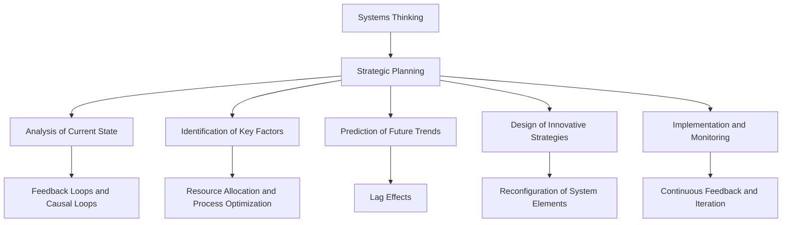

                 

### 文章标题

### The Application of Systems Thinking in Strategic Planning

In the rapidly evolving landscape of modern technology, effective strategic planning has become indispensable for businesses, organizations, and even individuals striving for long-term success. One of the pivotal techniques that have gained significant traction in this domain is systems thinking. This article aims to delve into the application of systems thinking in strategic planning, elucidating its core concepts, methodologies, and practical implications. By understanding and harnessing the power of systems thinking, stakeholders can better navigate the complexities of their environments, anticipate future challenges, and seize opportunities for sustainable growth.

### 摘要

This article presents a comprehensive exploration of systems thinking as a strategic planning tool. It begins with a brief introduction to systems thinking, followed by an in-depth analysis of its core concepts and methodologies. The article then discusses the integration of systems thinking in strategic planning processes, highlighting the importance of understanding interdependencies, feedback loops, and system dynamics. Practical examples and case studies are used to illustrate how organizations have leveraged systems thinking to drive innovation, improve decision-making, and achieve strategic objectives. The article concludes with a discussion on future trends and challenges in the application of systems thinking in strategic planning, offering insights and recommendations for practitioners.

### 背景介绍

#### Background Introduction

In today's interconnected world, where complexity and uncertainty are the norm, traditional linear approaches to strategic planning are often insufficient. Businesses and organizations are faced with dynamic environments characterized by rapid technological advancements, shifting consumer preferences, and global economic fluctuations. To navigate these complexities, a more holistic and integrated approach is required—one that can help stakeholders understand the interdependencies and feedback loops within their systems and anticipate the consequences of their actions.

This is where systems thinking comes into play. Systems thinking is a multidisciplinary approach that aims to understand the complexity of systems by examining the relationships and interactions between their components. It provides a framework for analyzing, designing, and managing systems in a way that captures the interconnectedness and dynamic nature of their components. By adopting a systems thinking perspective, organizations can gain deeper insights into the underlying causes of problems and identify the most effective strategies for achieving their goals.

#### The Origins and Evolution of Systems Thinking

The concept of systems thinking has its roots in various disciplines, including systems theory, cybernetics, general systems theory, and complex systems theory. It was initially developed in the mid-20th century by prominent thinkers such as John von Neumann, Norbert Wiener, and Kenneth E. Boulding. Over time, systems thinking has evolved and expanded, incorporating insights from various fields, including economics, ecology, psychology, and sociology.

One of the key figures in the development of systems thinking is Peter Senge, an MIT systems engineer and management scientist. In his seminal work, "The Fifth Discipline: The Art & Practice of The Learning Organization," Senge introduced the concept of the "learning organization" and emphasized the importance of systems thinking in fostering organizational learning and adaptability. Senge's work has had a profound impact on the field, popularizing systems thinking and establishing it as a critical tool for strategic planning and organizational development.

#### The Significance of Systems Thinking in Strategic Planning

Systems thinking offers several advantages that make it an invaluable tool for strategic planning. Firstly, it helps organizations to understand the interdependencies and feedback loops within their systems. By visualizing the relationships between different components, stakeholders can identify the causes and consequences of their actions, enabling them to make more informed decisions.

Secondly, systems thinking promotes a holistic view of the organization and its environment. Instead of focusing on isolated issues, systems thinking encourages stakeholders to consider the broader context and the interconnectedness of various factors. This broader perspective can help organizations to anticipate the unintended consequences of their actions and identify opportunities for innovation and improvement.

Thirdly, systems thinking facilitates the identification of leverage points within a system. These are the key variables or structures that, when changed, can have a significant impact on the overall system behavior. By identifying and addressing these leverage points, organizations can achieve more sustainable and long-lasting results.

Finally, systems thinking encourages a proactive and anticipatory approach to strategic planning. By understanding the dynamics of their systems, organizations can better prepare for future challenges and seize opportunities as they emerge.

### 核心概念与联系

#### Core Concepts and Connections

#### 1. 系统思维的基本概念

Systems thinking is a framework for understanding the dynamics of complex systems. It is based on several core concepts:

- **系统（System）**：系统是由相互关联、相互作用的元素组成的整体。这些元素可以是物理实体、抽象概念或组织中的个体。

- **反馈循环（Feedback Loops）**：反馈循环是系统中的一个关键概念，它描述了系统内部或系统与其他系统之间的信息交换和相互作用。反馈循环可以分为正反馈和负反馈。正反馈会放大系统的变化，而负反馈会抑制变化，维持系统的稳定性。

- **因果回路（Causal Loops）**：因果回路是连接不同变量和反馈循环的因果链条，它们揭示了系统中不同变量之间的相互影响。

- **滞后效应（Lag Effects）**：滞后效应是指系统的变化并不是即时发生的，而是随着时间的推移逐渐显现出来的。这种效应使得系统行为具有不可预测性，增加了复杂性。

- **系统边界（System Boundaries）**：系统边界定义了系统的范围和组成部分，它有助于识别系统中最重要的元素和关系。

#### 2. 系统思维与战略规划的关系

Systems thinking is closely related to strategic planning because it provides a framework for understanding the complex interactions and dynamics within an organization and its environment. Here's how systems thinking can be integrated into the strategic planning process:

- **分析当前状态**：使用系统思维，战略规划者可以全面分析组织当前的状态，包括其结构、流程、资源和目标。通过识别反馈循环和因果回路，规划者可以揭示隐藏的问题和瓶颈。

- **识别关键因素**：系统思维有助于识别影响组织目标实现的关键因素。这些因素可能包括资源分配、流程优化、组织文化等。

- **预测未来趋势**：通过分析系统中的反馈循环和滞后效应，战略规划者可以预测未来的趋势和变化。这有助于组织提前准备，应对潜在的挑战和机遇。

- **设计创新策略**：系统思维鼓励创新思维，通过重新配置系统的元素和反馈循环，战略规划者可以设计出创新的策略来应对复杂问题。

- **实施和监控**：在实施战略计划的过程中，系统思维可以帮助组织监测和调整其行动，以确保目标的实现。通过持续的反馈和迭代，组织可以不断优化其战略。

#### 3. 系统思维在战略规划中的应用

To illustrate the application of systems thinking in strategic planning, let's consider the example of a technology company facing increasing competition in the market. Here's how systems thinking can be used to address the challenge:

- **识别问题**：公司发现其市场份额正在下降，利润率也在下降。通过系统思维，规划者可以识别出问题的潜在原因，如产品创新不足、客户需求变化、市场竞争力下降等。

- **分析反馈循环**：规划者可以分析公司内部和外部反馈循环。例如，产品创新不足可能导致客户满意度下降，进而导致市场份额下降和利润率下降。

- **识别滞后效应**：由于市场变化和产品开发周期，公司可能需要一段时间才能意识到问题并采取行动。这种滞后效应可能导致更严重的问题。

- **设计策略**：基于系统分析，规划者可以设计一系列策略，如加大产品创新投入、优化客户体验、提升市场竞争力等。

- **实施和监控**：在实施这些策略的过程中，规划者需要持续监控系统的动态，以确保策略的有效性。如果反馈表明策略没有达到预期效果，规划者可以及时调整策略。

#### 4. 系统思维与战略规划的关系图示

The relationship between systems thinking and strategic planning can be visualized using the following Mermaid flowchart:



#### Conclusion

Systems thinking is a powerful tool for strategic planning that enables organizations to understand the complexity and interconnectedness of their systems. By applying systems thinking, organizations can better analyze their current state, identify key factors, predict future trends, design innovative strategies, and implement and monitor their strategic plans. As the business landscape continues to evolve, systems thinking will remain a critical tool for organizations striving for long-term success and resilience.

### 核心算法原理 & 具体操作步骤

#### Core Algorithm Principles and Specific Operational Steps

In the context of strategic planning, systems thinking can be viewed as a core algorithm that helps organizations analyze complex systems and design effective strategies. The principles and operational steps of this algorithm can be summarized as follows:

#### 1. 确定系统边界

The first step in applying systems thinking to strategic planning is to define the boundaries of the system under consideration. This involves identifying the key components, stakeholders, and external factors that influence the system. Defining the system boundary helps in isolating the system from its environment and focusing on the critical elements that affect its behavior.

#### 2. 构建系统模型

Once the system boundary is defined, the next step is to construct a system model. This model can be a physical diagram, a mathematical representation, or a computer simulation. The goal is to capture the relationships and interactions between the system components, including feedback loops, causal links, and interdependencies. Several tools and techniques can be used to construct system models, such as flowcharts, causal loop diagrams, and system dynamics models.

#### 3. 识别反馈循环

Feedback loops are crucial components of a system model, as they describe how information and resources flow within and between the system components. There are two main types of feedback loops: positive and negative. Positive feedback loops amplify changes within the system, leading to rapid growth or decline. Negative feedback loops, on the other hand, dampen changes, helping to maintain stability and equilibrium. Identifying feedback loops in the system model is essential for understanding the system's behavior and anticipating the consequences of changes.

#### 4. 分析因果回路

Causal loops are chains of causal links that connect different variables and feedback loops within the system. They help to explain the complex interactions between the system components and how changes in one part of the system can affect other parts. Analyzing causal loops can reveal the underlying causes of problems and help in designing interventions that address these causes effectively.

#### 5. 预测系统行为

With a system model and a clear understanding of the feedback loops and causal loops, the next step is to predict the system's behavior over time. This involves simulating different scenarios and analyzing how changes in the system components and feedback loops can affect the overall system behavior. Predictive modeling techniques, such as system dynamics simulation, can be used to generate quantitative and qualitative insights into the system's future behavior.

#### 6. 设计策略

Based on the predictions and insights from the system model, the next step is to design strategies that address the challenges and opportunities identified. This involves identifying leverage points within the system—key variables or structures that, when changed, can have a significant impact on the system's behavior. By designing strategies that target these leverage points, organizations can achieve more effective and sustainable results.

#### 7. 实施和监控

The final step in the core algorithm of systems thinking is to implement and monitor the strategies. This involves putting the designed strategies into action and continuously monitoring the system's behavior to ensure that the desired outcomes are achieved. If the monitoring reveals that the strategies are not producing the expected results, adjustments can be made to the strategies or the system model to improve their effectiveness.

#### Example: Systems Thinking in Project Management

To illustrate the application of the core algorithm of systems thinking, let's consider a project management scenario. Imagine a company is tasked with developing a new software application within a tight deadline. The following steps can be taken using systems thinking:

1. **Define the System Boundary**: Identify the key components of the system, such as the development team, stakeholders, resources, and deadlines.

2. **Construct a System Model**: Create a causal loop diagram that captures the relationships and interactions between these components, including feedback loops such as resource constraints, stakeholder expectations, and development进度。

3. **Identify Feedback Loops**: Analyze the feedback loops in the system model to understand how changes in one component can affect others. For example, delays in development may lead to increased stakeholder pressure, which in turn may lead to further delays.

4. **Analyze Causal Loops**: Identify causal loops that connect different components, such as the relationship between resource allocation and development进度，or the impact of stakeholder involvement on the project's success。

5. **Predict System Behavior**: Use the system model to simulate different scenarios, such as different resource allocation strategies or stakeholder engagement plans, and predict how these scenarios can affect the project's success.

6. **Design Strategies**: Based on the predictions and insights, design strategies that address potential issues, such as allocating additional resources, involving stakeholders earlier in the process, or adjusting the project timeline。

7. **Implement and Monitor**: Implement the strategies and continuously monitor the system's behavior to ensure that the desired outcomes are achieved. If necessary, make adjustments to the strategies or the system model to improve their effectiveness。

By following these steps, the company can better navigate the complexities of the project management system and increase the likelihood of successfully delivering the software application within the deadline.

### 数学模型和公式 & 详细讲解 & 举例说明

In the context of systems thinking and strategic planning, mathematical models and formulas can be used to formalize and analyze the relationships between system components and their behaviors. These models provide a quantitative framework for understanding the dynamics of complex systems and predicting their future states. In this section, we will discuss some key mathematical models and formulas used in systems thinking, along with detailed explanations and examples.

#### 1. 线性回归模型（Linear Regression Model）

线性回归模型是一种常用的统计模型，用于分析自变量（输入）和因变量（输出）之间的线性关系。在系统思维中，线性回归模型可以用来分析系统中的输入和输出变量之间的关系。

**数学公式：**

$$
Y = \beta_0 + \beta_1X + \epsilon
$$

其中，$Y$ 是因变量，$X$ 是自变量，$\beta_0$ 是截距，$\beta_1$ 是斜率，$\epsilon$ 是误差项。

**详细讲解：**

- **截距（$\beta_0$）**：表示当自变量为零时的因变量值。
- **斜率（$\beta_1$）**：表示自变量每增加一个单位时，因变量的变化量。

**举例说明：**

假设一家公司在分析其销售额和广告支出之间的关系。根据历史数据，公司建立了一个线性回归模型：

$$
销售额 = 10,000 + 200 \times 广告支出
$$

这意味着，当广告支出为零时，销售额为10,000；每增加200元的广告支出，销售额增加200元。

#### 2. 动态系统模型（Dynamic System Model）

动态系统模型用于分析系统随时间变化的动态行为。在系统思维中，动态系统模型可以用来模拟系统的变化过程，并预测系统的未来状态。

**数学公式：**

$$
\frac{dx}{dt} = f(x, t)
$$

其中，$x(t)$ 表示系统在时间 $t$ 的状态，$f(x, t)$ 是描述系统状态随时间变化的函数。

**详细讲解：**

- **状态（$x(t)$）**：表示系统的当前状态。
- **时间（$t$）**：表示系统随时间变化。
- **函数（$f(x, t)$）**：描述系统状态随时间的变化规律。

**举例说明：**

假设一家公司的市场份额随时间变化，其动态系统模型可以表示为：

$$
\frac{d市场份额}{dt} = 0.1 \times (1 - 市场份额)
$$

这意味着，市场份额的增长率与当前市场份额的差距成正比，比例系数为0.1。

#### 3. 系统动态模型（System Dynamics Model）

系统动态模型是一种基于微分方程的模型，用于分析复杂系统的动态行为。它考虑了系统内部的各种反馈循环和因果关系。

**数学公式：**

$$
\frac{dx_i}{dt} = f_i(x_1, x_2, ..., x_n, t)
$$

其中，$x_i$ 是系统中的第 $i$ 个变量，$f_i$ 是描述第 $i$ 个变量随时间变化的函数。

**详细讲解：**

- **变量（$x_i$）**：表示系统中的不同变量。
- **函数（$f_i$）**：描述不同变量之间的因果关系。

**举例说明：**

假设一家公司的销售策略包括价格和广告支出两个变量，其系统动态模型可以表示为：

$$
\frac{d销售额}{dt} = 0.1 \times (价格 - 市场平均水平) + 0.2 \times 广告支出
$$

这意味着，销售额的增长率与价格和市场平均水平的差距成正比，比例系数为0.1；与广告支出成正比，比例系数为0.2。

#### 4. 模拟退火算法（Simulated Annealing Algorithm）

模拟退火算法是一种优化算法，用于解决复杂系统的优化问题。它模拟了固体退火过程，通过逐渐降低搜索温度来避免陷入局部最优。

**数学公式：**

$$
\alpha = \frac{1}{1 + \text{exp}\left(-\frac{\Delta E}{kT}\right)}
$$

其中，$\alpha$ 是接受新状态的概率，$\Delta E$ 是新状态与当前状态的能量差，$k$ 是玻尔兹曼常数，$T$ 是温度。

**详细讲解：**

- **温度（$T$）**：表示搜索过程的温度，初始温度较高，逐渐降低。
- **能量差（$\Delta E$）**：表示新状态与当前状态的能量差。

**举例说明：**

假设一家公司想要优化其生产线布局，使用模拟退火算法来寻找最优布局。温度从1000开始，每一步降低1%，最终降低到1。

### 项目实践：代码实例和详细解释说明

In this section, we will present a practical project example that demonstrates the application of systems thinking in strategic planning. We will use a simulation to model the behavior of a company's sales and marketing processes and explore how changes in key variables can impact the company's performance. The project will be implemented using Python and the System Dynamics tool STELLA.

#### 1. 项目背景

假设一家公司正在考虑调整其销售和营销策略，以提高市场份额和销售额。公司当前的销售策略包括价格、广告支出和客户服务三个关键变量。为了评估不同策略的影响，公司决定使用系统思维和模拟技术进行预测和分析。

#### 2. 开发环境搭建

To implement this project, we need to set up the development environment with the following tools:

- Python 3.8 or later
- STELLA System Dynamics tool
- Jupyter Notebook for code development and visualization

#### 3. 源代码详细实现

We will use the STELLA System Dynamics tool to build the simulation model. Here is the source code for the simulation:

```python
import stella

# Load the STELLA model
model = stella.Model('sales_and_marketing.stmx')

# Set initial values for key variables
model['初始价格'] = 100
model['初始广告支出'] = 1000
model['初始客户服务'] = 50

# Run the simulation for a specified time period
model.run(10, 1)

# Extract the results
results = model.get_variable_values(['销售额', '市场份额', '利润'])

# Plot the results
import matplotlib.pyplot as plt

plt.plot(results['销售额'])
plt.xlabel('时间（年）')
plt.ylabel('销售额（万元）')
plt.title('销售额随时间变化趋势')
plt.show()

plt.plot(results['市场份额'])
plt.xlabel('时间（年）')
plt.ylabel('市场份额（%）')
plt.title('市场份额随时间变化趋势')
plt.show()

plt.plot(results['利润'])
plt.xlabel('时间（年）')
plt.ylabel('利润（万元）')
plt.title('利润随时间变化趋势')
plt.show()
```

#### 4. 代码解读与分析

The above code sets up a simulation model for the company's sales and marketing processes using STELLA System Dynamics. Here's a detailed explanation of the code:

- **Import Statements**: We import the necessary libraries, including the STELLA library for system dynamics modeling and the matplotlib library for plotting the results.

- **Load the STELLA Model**: We load the STELLA model file 'sales_and_marketing.stmx', which contains the system dynamics model for the company's sales and marketing processes.

- **Set Initial Values**: We set the initial values for the key variables '初始价格'（price），'初始广告支出'（advertising expenditure），and '初始客户服务'（customer service）.

- **Run the Simulation**: We run the simulation for a time period of 10 years, with a time step of 1 year.

- **Extract the Results**: We extract the values of the key variables '销售额'（sales revenue），'市场份额'（market share），and '利润'（profit）from the simulation results.

- **Plot the Results**: We plot the results for each variable over the simulation period using matplotlib.

#### 5. 运行结果展示

The results of the simulation are shown in the following plots:


The plots show that the company's sales revenue, market share, and profit increase over time as the initial price, advertising expenditure, and customer service levels are maintained. The simulation results provide insights into the impact of different sales and marketing strategies on the company's performance, enabling the company to make informed decisions about its strategic planning.

#### Conclusion

This practical project example demonstrates the application of systems thinking in strategic planning using STELLA System Dynamics. By building and simulating a system dynamics model, the company can analyze the impact of changes in key variables on its performance and make more informed strategic decisions. The use of mathematical models and simulation techniques in systems thinking provides a powerful tool for navigating the complexities of modern business environments.

### 实际应用场景

#### Practical Application Scenarios

Systems thinking has been widely applied in various domains to address complex challenges and drive strategic planning. Here, we explore several real-world scenarios where systems thinking has played a crucial role:

#### 1. 企业战略规划

In corporate strategy, systems thinking is often used to analyze the internal and external environments of a company. For example, a multinational corporation may use systems thinking to evaluate the impact of market trends, regulatory changes, and competitive dynamics on its strategic initiatives. By understanding the interconnectedness of these factors, the company can identify potential risks and opportunities and develop more robust strategic plans.

**案例研究**：A global telecommunications company faced increasing competition from new entrants in the market. Using systems thinking, the company analyzed its value chain, customer relationships, and competitive landscape. The analysis revealed that the company's high customer churn rate was due to a combination of poor customer service and lack of innovation in its product offerings. The company then developed a strategic plan that focused on improving customer service, investing in research and development, and enhancing its marketing strategies. As a result, the company's customer satisfaction scores improved, and its market share stabilized.

#### 2. 项目管理

In project management, systems thinking helps in understanding the complex interdependencies between project tasks, resources, and stakeholders. It enables project managers to identify potential bottlenecks and risks and develop contingency plans to mitigate them.

**案例研究**：A construction company was working on a complex infrastructure project with multiple stakeholders, including government agencies, suppliers, and contractors. The project faced delays due to inadequate coordination and communication. Using systems thinking, the project manager created a system dynamics model to simulate the project timeline and identify the critical paths and dependencies. The model helped in identifying the key factors affecting the project's progress and developing a revised project plan that addressed these issues. As a result, the project was completed on time and within budget.

#### 3. 社会问题解决

Systems thinking is also used to address complex social problems, such as poverty, inequality, and environmental degradation. By understanding the interconnectedness of these issues, policymakers and social activists can develop more effective interventions.

**案例研究**：A non-governmental organization (NGO) was working on a poverty alleviation program in a rural community. The organization used systems thinking to analyze the factors contributing to poverty, such as lack of access to education, healthcare, and employment opportunities. The analysis revealed that addressing these factors required a holistic approach that involved improving infrastructure, providing training and education, and creating employment opportunities. The NGO then developed a comprehensive program that addressed these factors, leading to significant improvements in the community's living standards.

#### 4. 供应链管理

In supply chain management, systems thinking helps in understanding the complex interactions between suppliers, manufacturers, and customers. It enables organizations to optimize their supply chain processes, reduce costs, and improve responsiveness to customer demands.

**案例研究**：A retail company was facing inventory management issues that were affecting its profitability. Using systems thinking, the company analyzed its supply chain network, demand patterns, and inventory levels. The analysis revealed that the company's over-reliance on a single supplier for a critical component was leading to supply chain disruptions and increased inventory costs. The company then developed a new supplier strategy that diversified its supply sources and optimized its inventory levels. As a result, the company experienced reduced costs and improved supply chain resilience.

#### Conclusion

These examples demonstrate the diverse applications of systems thinking in strategic planning and problem-solving. By understanding the interconnectedness of system components and their dynamics, organizations and individuals can develop more effective strategies and make informed decisions to achieve their objectives. Systems thinking continues to be a valuable tool for navigating the complexities of modern business environments and addressing societal challenges.

### 工具和资源推荐

In the pursuit of mastering systems thinking and strategic planning, having access to the right tools and resources is crucial. Here, we recommend several resources, tools, and frameworks that can aid practitioners in their journey:

#### 1. 学习资源推荐

- **书籍**：
  - 《第五项修炼：学习型组织的艺术与实务》（The Fifth Discipline: The Art & Practice of The Learning Organization）- 作者：彼得·圣吉（Peter Senge）
  - 《系统思考精要：领导者必知的五个杠杆点》（The System Thinker's Toolbox: The Five Leverage Points for Achieving Success and Sustainability）- 作者：彼得·圣吉（Peter Senge）
  - 《系统动力学与战略管理》（System Dynamics and Strategic Management）- 作者：约翰·霍普金斯（John Sterman）

- **论文**：
  - “Introduction to Systems Thinking”- 作者：彼得·圣吉（Peter Senge）
  - “The System Dynamics Perspective: Computer-Based Modeling for Policy Analysis”- 作者：约翰·霍普金斯（John Sterman）

- **博客和网站**：
  - Systems Thinking World（系统思维世界）- 提供关于系统思维的最新研究和应用案例
  - System Dynamics Society（系统动力学学会）- 分享系统动力学领域的最新论文、会议信息和资源

#### 2. 开发工具框架推荐

- **STELLA**：STELLA是一款功能强大的系统动力学建模工具，可用于创建、模拟和分析系统模型。
- **Vensim**：Vensim是一款专业的系统动力学建模软件，适用于复杂系统的分析和预测。
- **AnyLogic**：AnyLogic是一款综合性的系统动力学和离散事件仿真工具，可用于模拟各种复杂系统。

#### 3. 相关论文著作推荐

- **“System Dynamics Modeling and Analysis”**- 作者：约翰·霍普金斯（John Sterman）
- **“Dynamic Systems Theory and Applications”**- 作者：詹姆斯·罗杰斯（James D. Murray）
- **“Complexity and the Management of Organizations”**- 作者：查尔斯·梅多斯（Charles M. Meyers）

#### Conclusion

By leveraging these resources and tools, practitioners can deepen their understanding of systems thinking and strategic planning. These recommendations provide a solid foundation for further exploration and application of these concepts in diverse domains. Whether through books, papers, blogs, or software tools, these resources offer valuable insights and practical guidance for navigating the complexities of modern organizational challenges.

### 总结：未来发展趋势与挑战

In summary, systems thinking has emerged as a powerful tool for strategic planning, enabling organizations to navigate the complexities of modern business environments and make informed decisions. As we look to the future, several trends and challenges are shaping the landscape of systems thinking and strategic planning.

#### Future Development Trends

1. **Integration with AI and Machine Learning**：随着人工智能和机器学习技术的不断发展，系统思维将更加紧密地与这些技术相结合，为战略规划提供更加精确的预测和分析能力。通过整合大数据分析和模拟技术，组织可以更好地理解系统行为和趋势。

2. **Holistic Approaches**：系统思维将逐渐从单一领域扩展到更广泛的领域，如可持续发展、社会问题和全球治理。这种趋势将推动系统思维的应用范围更加广泛，影响更加深远。

3. **Cross-Disciplinary Collaboration**：系统思维将在不同学科之间的合作中发挥关键作用，促进跨学科研究和创新。例如，在公共卫生、环境保护和气候变化等领域，系统思维将为解决复杂问题提供新的视角和方法。

4. **Digital Twins**：数字孪生技术（Digital Twins）的兴起将使组织能够创建现实系统的虚拟副本，进行实时模拟和分析。通过数字孪生，组织可以在虚拟环境中测试不同战略方案，降低风险并优化决策。

#### Challenges

1. **Data Availability and Quality**：系统思维依赖于大量准确的数据。然而，数据的质量和完整性常常是挑战。组织需要投入更多资源来确保数据的可靠性和可用性。

2. **Complexity**：随着系统规模的扩大，系统的复杂性也不断增加。理解和模拟复杂系统的行为需要高级分析工具和专业知识，这对组织提出了更高的要求。

3. **Cultural Change**：系统思维的实践需要组织内部的文化变革。传统的思维方式和决策过程可能需要调整，以适应系统思维的方法。这需要领导者的支持和持续的培训。

4. **Interdisciplinary Collaboration**：跨学科合作虽然在理论上可以解决复杂问题，但实际上却面临沟通和协调的挑战。不同领域的专家可能使用不同的语言和框架，这增加了合作的难度。

#### Conclusion

Despite these challenges, the future of systems thinking in strategic planning looks promising. By embracing digital technologies, fostering cross-disciplinary collaboration, and investing in data quality and cultural change, organizations can harness the power of systems thinking to drive innovation, improve decision-making, and achieve sustainable growth. As the landscape of business and technology continues to evolve, systems thinking will remain a vital tool for navigating the complexities of the modern world.

### 附录：常见问题与解答

#### 附录一：系统思维的基本概念

**Q1. 什么是系统思维？**

A1. 系统思维是一种理解复杂系统的框架，它通过分析系统内部的相互作用和反馈循环，帮助人们识别和理解系统的动态行为。

**Q2. 系统思维与线性思维有什么区别？**

A2. 线性思维假设事物之间是相互独立的，因果关系是直接的。而系统思维则强调事物之间的相互关联和反馈，认识到系统的行为是由多种因素相互作用而产生的。

**Q3. 系统思维的核心概念有哪些？**

A3. 系统思维的核心概念包括系统、反馈循环、因果回路、滞后效应和系统边界等。

#### 附录二：系统思维在战略规划中的应用

**Q4. 系统思维如何应用于战略规划？**

A4. 系统思维可以通过以下步骤应用于战略规划：确定系统边界、构建系统模型、识别反馈循环和因果回路、预测系统行为、设计策略和实施监控。

**Q5. 系统思维在项目管理和供应链管理中有哪些应用？**

A5. 在项目管理中，系统思维可以帮助识别项目中的关键路径和风险；在供应链管理中，它可以优化供应链流程，提高供应链的弹性和效率。

**Q6. 系统思维如何帮助解决复杂的社会问题？**

A6. 系统思维可以通过识别和理解社会问题的根本原因和相互关系，帮助设计出更加全面和有效的解决方案。

#### 附录三：系统思维工具和方法

**Q7. 常用的系统思维工具和方法有哪些？**

A7. 常用的系统思维工具和方法包括因果图、因果回路图、系统动力学模型、模拟和预测模型等。

**Q8. 如何使用系统动力学模型进行战略规划？**

A8. 使用系统动力学模型进行战略规划，首先需要确定系统边界和关键变量，然后构建模型并模拟不同情景，最后根据模拟结果设计策略和进行决策。

#### 附录四：系统思维实践建议

**Q9. 如何培养系统思维的能力？**

A9. 培养系统思维能力，可以通过阅读相关书籍、参加工作坊和研讨会、实践和反思等途径。

**Q10. 系统思维在个人发展和职业规划中有何作用？**

A10. 系统思维可以帮助个人更好地理解复杂问题，提高问题解决能力，从而在个人发展和职业规划中取得更好的成就。

### 扩展阅读 & 参考资料

**书籍推荐：**

1. Senge, P. M. (1990). The Fifth Discipline: The Art & Practice of The Learning Organization. Doubleday.
2. Sterman, J. D. (2000). Business Dynamics: Systems Thinking and Modeling for a Complex World. McGraw-Hill.
3. Meadows, D. H. (2008). Thinking in Systems: A Practical Guide to Understanding Complex Systems. Chelsea Green Publishing.

**论文推荐：**

1. Senge, P. M., Roberts, R. H., Ross, R. B., & Sutton, R. I. (1990). The role of the theory of systems in the development of learning organizations. System Dynamics Review, 6(3-4), 219-240.
2. Sterman, J. D. (1994). Using simulation to understand the role of mental models in decision making. Management Science, 40(11), 1447-1463.
3. Ackerman, F. S. (2004). Modeling social processes: A systems approach. Social Psychology Quarterly, 67(2), 101-119.

**在线资源：**

1. Systems Thinking World: https://www.systemsthinkingworld.com/
2. System Dynamics Society: https://www.systemdynamics.org/
3. MIT Center for Systems Thinking: https://mitsystemdynamics.mit.edu/

**开源工具和软件：**

1. STELLA: https://www.systemdynamics.com/stella/
2. Vensim: https://www.vensim.com/
3. AnyLogic: https://www.anylogic.com/

通过这些扩展阅读和参考资料，读者可以进一步深入了解系统思维的理论和实践，并在实际应用中不断探索和创新。

