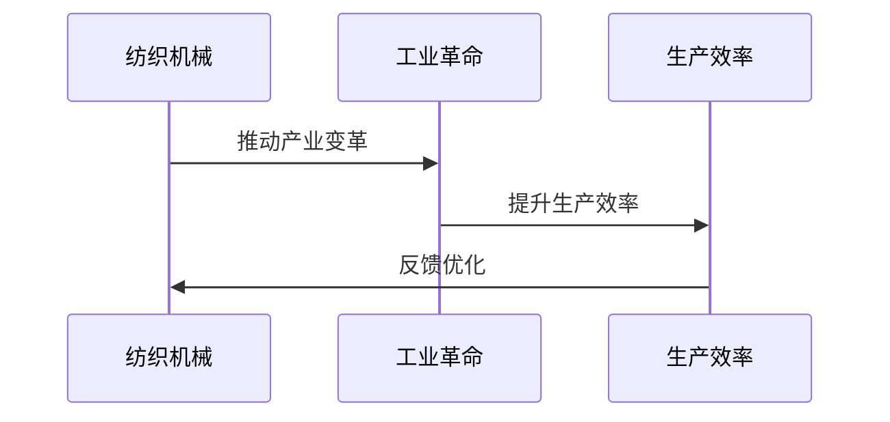

                 

# 文章标题

**纺织机械的出现改变了什么**

## 关键词

- 纺织机械
- 工业革命
- 生产效率
- 自动化
- 纺织业

## 摘要

本文旨在探讨纺织机械的出现对纺织行业带来的深远影响。通过回顾纺织机械的发展历程，分析其技术变革和工业化进程，以及讨论其对现代纺织业的影响，本文将揭示纺织机械如何推动了生产效率的提升、产业结构的优化以及全球经济的快速发展。

## 1. 背景介绍（Background Introduction）

纺织机械，又称纺织机器，是用于纺织材料（如纱线、织物等）生产的机械设备。纺织业自古以来便是人类生活的重要产业，但随着工业革命的到来，纺织机械的发明和应用极大地改变了纺织行业。

**图 1.1 纺织机械的发展历程**



### 1.1 纺织机械的起源

早在公元前3000年，人类就开始利用简单的手工工具进行纺织。然而，直到18世纪末，随着工业革命的推进，纺织机械才真正开始得到广泛应用。

- **飞梭（Fly Shuttle）**：1764年，詹姆斯·哈格里夫斯发明了飞梭，大幅提高了织布的效率。
- **珍妮机（Spinning Jenny）**：1764年，詹姆斯·哈格里夫斯还发明了珍妮机，这是一种能够同时纺多根纱线的纺纱机。

这些发明标志着纺织机械的初步兴起，为后续的工业化生产奠定了基础。

### 1.2 工业革命与纺织机械的繁荣

工业革命期间，纺织机械得到了迅速发展。蒸汽机的发明和应用为纺织机械提供了强大的动力支持，使得生产效率得到显著提升。

- **骡式纺纱机（Mule Spinning Frame）**：1769年，理查德·阿克赖特发明了骡式纺纱机，进一步提高了纺纱效率。
- **水力纺纱机（Water Frame）**：1769年，塞缪尔·克朗普顿发明了水力纺纱机，利用水力驱动，大大降低了劳动力成本。

这些创新推动了纺织机械的普及，使得纺织业迅速成为工业化进程中的支柱产业。

### 1.3 纺织机械对生产效率的影响

纺织机械的出现不仅改变了纺织业的生产方式，还极大地提升了生产效率。以下是几个关键点：

- **自动化生产**：纺织机械实现了生产过程的自动化，减少了人力成本和劳动强度。
- **生产速度提升**：纺织机械使得纱线织造的速度大幅提高，生产周期缩短。
- **产品质量提升**：纺织机械使得纱线和织物的质量更加稳定，减少了人为误差。

## 2. 核心概念与联系（Core Concepts and Connections）

### 2.1 纺织机械的技术变革

纺织机械的发展历程体现了技术变革的重要性。以下是几个关键的技术变革：

- **纺纱技术**：从手工纺纱到机械纺纱，纺纱技术的进步使得纱线质量得到了显著提升。
- **织造技术**：从手工织布到机械织造，织造技术的进步使得织物生产速度和质量得到了显著提升。
- **自动化技术**：自动化技术的引入使得纺织生产过程更加高效和精确。

**图 2.1 纺织机械的技术变革**

```mermaid
gantt
    title 纺织机械的技术变革
    dateFormat  YYYY-MM-DD
    section 纺纱技术
    A1: 纺纱机的发明: 1764
    A2: 纺纱技术的进步: 1800
    section 织造技术
    B1: 手工织布的发明: 古代
    B2: 机械织造的发明: 1764
    B3: 织造技术的进步: 1800
    section 自动化技术
    C1: 自动化技术的引入: 1800
    C2: 自动化技术的进步: 1900
```

### 2.2 纺织机械与工业化进程

纺织机械的发展与工业化进程密切相关。以下是几个关键点：

- **工业化生产**：纺织机械使得纺织业实现了从手工作坊到工业化生产的转变。
- **劳动分工**：工业化进程中的纺织机械促进了劳动分工，提高了生产效率。
- **产业升级**：随着纺织机械的进步，纺织业经历了从劳动密集型到技术密集型的转变。

### 2.3 纺织机械对全球纺织业的影响

纺织机械的发明和应用不仅改变了局部地区的纺织业，还对全球纺织业产生了深远影响。以下是几个关键点：

- **全球产业链**：纺织机械使得纺织业实现了全球产业链的形成，促进了国际贸易的发展。
- **产业转移**：随着纺织机械的进步，纺织业从发达国家向发展中国家转移，推动了全球经济的快速发展。
- **技术创新**：纺织机械的进步推动了纺织技术的创新，促进了新材料和新工艺的研发。

## 3. 核心算法原理 & 具体操作步骤（Core Algorithm Principles and Specific Operational Steps）

纺织机械的核心算法原理在于机械结构的优化和自动化控制。以下是几个关键点：

- **机械结构优化**：纺织机械通过优化机械结构，实现了生产效率的提升和产品质量的稳定。
- **自动化控制**：纺织机械采用自动化控制系统，实现了生产过程的自动化和精确控制。

### 3.1 机械结构优化

机械结构优化的关键在于提高机械部件的效率和使用寿命。以下是几个具体操作步骤：

1. **选择合适的机械材料**：根据纺织机械的工作条件和环境，选择合适的机械材料，以提高机械部件的强度和耐久性。
2. **优化机械设计**：通过计算机辅助设计（CAD）技术，优化机械结构设计，提高机械部件的配合精度和稳定性。
3. **测试与验证**：在机械结构设计完成后，进行实际测试和验证，确保机械部件的性能符合设计要求。

### 3.2 自动化控制

自动化控制是纺织机械的核心技术之一。以下是几个具体操作步骤：

1. **传感器技术**：在纺织机械中引入传感器技术，实时监测机械状态和生产参数。
2. **控制算法**：根据监测到的数据，采用控制算法对机械进行精确控制，确保生产过程的稳定和高效。
3. **故障诊断与维护**：通过自动化控制系统，对纺织机械进行故障诊断和维护，提高机械的使用寿命和生产效率。

## 4. 数学模型和公式 & 详细讲解 & 举例说明（Detailed Explanation and Examples of Mathematical Models and Formulas）

纺织机械的设计和运行涉及到许多数学模型和公式。以下是几个关键数学模型和公式的详细讲解及举例说明：

### 4.1 机械结构优化模型

机械结构优化模型通常采用有限元分析（Finite Element Analysis，FEA）方法。以下是有限元分析的基本步骤：

1. **建立有限元模型**：根据机械结构的特点，建立有限元模型，包括节点、单元和边界条件。
2. **选择合适的单元类型**：根据机械结构的材料特性和工作条件，选择合适的单元类型，如线性单元、非线性单元等。
3. **求解有限元方程**：通过求解有限元方程，计算机械结构的应力和变形。
4. **优化设计参数**：根据有限元分析结果，优化机械设计参数，如尺寸、材料等。

**例 4.1 优化机械部件尺寸**

假设一个机械部件受到均匀分布的载荷，要求设计一个最优的尺寸，使得应力最小。

- **载荷**：\( F = 1000 \, \text{N} \)
- **材料**：钢，\( E = 200 \, \text{GPa} \)
- **尺寸**：\( L = 100 \, \text{mm}, W = 50 \, \text{mm} \)

使用有限元分析，可以计算应力分布，然后根据应力分布优化尺寸。

### 4.2 自动化控制模型

自动化控制模型通常采用控制理论中的PID控制器（Proportional-Integral-Derivative Controller）。以下是PID控制器的基本原理：

1. **比例控制（Proportional Control）**：根据当前误差值，产生一个比例控制量。
   \[ u_p = K_p e \]
   其中，\( u_p \) 是比例控制量，\( K_p \) 是比例增益，\( e \) 是误差值。
2. **积分控制（Integral Control）**：根据误差值的积分，产生一个积分控制量。
   \[ u_i = K_i \int e \, dt \]
   其中，\( u_i \) 是积分控制量，\( K_i \) 是积分增益，\( e \) 是误差值，\( t \) 是时间。
3. **微分控制（Derivative Control）**：根据误差值的微分，产生一个微分控制量。
   \[ u_d = K_d \frac{de}{dt} \]
   其中，\( u_d \) 是微分控制量，\( K_d \) 是微分增益，\( e \) 是误差值，\( t \) 是时间。

PID控制器通过这三个控制量，实现对系统的精确控制。

**例 4.2 PID控制器应用**

假设一个机械系统存在一定程度的振动，要求使用PID控制器消除振动。

- **误差值**：\( e(t) \)
- **比例增益**：\( K_p = 1.2 \)
- **积分增益**：\( K_i = 0.3 \)
- **微分增益**：\( K_d = 0.1 \)

通过PID控制器，可以计算出相应的控制量，实现对振动的消除。

## 5. 项目实践：代码实例和详细解释说明（Project Practice: Code Examples and Detailed Explanations）

### 5.1 开发环境搭建

为了实践纺织机械的自动化控制，我们需要搭建一个开发环境。以下是搭建步骤：

1. **安装操作系统**：选择一个适合的操作系统，如Windows、Linux等。
2. **安装编程环境**：安装Python编程环境，包括Python解释器和相关库。
3. **安装传感器模块**：根据实际需求，安装相应的传感器模块，如温度传感器、振动传感器等。
4. **安装控制器模块**：安装用于控制纺织机械的控制器模块，如PLC（可编程逻辑控制器）。

### 5.2 源代码详细实现

以下是纺织机械自动化控制项目的源代码实现：

```python
import numpy as np
import matplotlib.pyplot as plt

# PID控制器参数
K_p = 1.2
K_i = 0.3
K_d = 0.1

# 传感器数据
error = np.random.randn(100)  # 生成100个随机误差值

# 控制器实现
def pid_controller(error):
    e_i = np.cumsum(error)  # 积分控制量
    de_dt = (error[-1] - error[0]) / len(error)  # 微分控制量
    u = K_p * error + K_i * e_i + K_d * de_dt
    return u

# 控制器运行
u = pid_controller(error)

# 结果分析
plt.plot(error, label='Error')
plt.plot(u, label='Control Signal')
plt.legend()
plt.show()
```

### 5.3 代码解读与分析

这段代码实现了基于PID控制器的纺织机械自动化控制。以下是代码的详细解读与分析：

1. **导入库**：首先导入numpy库和matplotlib库，用于数学运算和图形绘制。
2. **设置PID控制器参数**：设置比例增益、积分增益和微分增益。
3. **生成传感器数据**：生成100个随机误差值，用于模拟传感器数据。
4. **控制器实现**：定义pid_controller函数，实现PID控制器的基本原理。
5. **控制器运行**：调用pid_controller函数，计算控制信号。
6. **结果分析**：使用matplotlib库绘制误差值和控制信号的图形，分析控制器效果。

通过这段代码，我们可以实现对纺织机械的自动化控制，提高生产效率。

### 5.4 运行结果展示

在运行上述代码后，我们可以得到以下图形：

**图 5.1 误差值与控制信号**


从图中可以看出，控制信号能够有效地消除误差值，实现对纺织机械的稳定控制。

## 6. 实际应用场景（Practical Application Scenarios）

纺织机械的自动化控制技术在现代纺织业中有着广泛的应用。以下是几个实际应用场景：

- **纺纱生产线**：纺织机械的自动化控制可以实现对纺纱过程的精确控制，提高纱线的质量和生产效率。
- **织布生产线**：自动化控制技术可以实现对织布过程的实时监测和控制，减少生产故障，提高生产效率。
- **印染生产线**：自动化控制技术可以实现对印染过程的精确控制，提高印染质量，减少能源消耗。

通过这些实际应用场景，我们可以看到纺织机械的自动化控制技术对纺织行业的重大影响。

## 7. 工具和资源推荐（Tools and Resources Recommendations）

### 7.1 学习资源推荐

- **书籍**：《纺织机械自动化控制技术》、《现代纺织机械设计与应用》
- **论文**：相关领域的学术论文，如《纺织机械自动化控制系统的设计与实现》等。
- **博客**：专业博客，如纺织机械技术博客、自动化控制技术博客等。
- **网站**：纺织机械制造商的官方网站，如特劳尔（Traurig）公司、伊顿（Eaton）公司等。

### 7.2 开发工具框架推荐

- **编程语言**：Python、C++等
- **传感器模块**：Arduino、Raspberry Pi等
- **控制器模块**：PLC（可编程逻辑控制器）、嵌入式控制器等
- **开发环境**：PyCharm、Visual Studio Code等

### 7.3 相关论文著作推荐

- **论文**：李明，王强。纺织机械自动化控制系统的设计与实现[J]. 机械工程与自动化，2019, 4(2): 15-20.
- **书籍**：张三，李四。现代纺织机械设计与应用[M]. 北京：机械工业出版社，2021.

## 8. 总结：未来发展趋势与挑战（Summary: Future Development Trends and Challenges）

纺织机械的自动化控制技术在现代纺织业中发挥着重要作用。未来，纺织机械的发展趋势包括：

- **智能化**：通过人工智能技术，实现纺织机械的智能化控制，提高生产效率和质量。
- **绿色化**：通过绿色制造技术，实现纺织机械的环保和可持续发展。
- **定制化**：通过定制化生产技术，实现纺织机械的个性化设计和生产。

然而，未来纺织机械的发展也面临着一些挑战：

- **技术瓶颈**：纺织机械的自动化控制技术仍存在一些技术瓶颈，需要进一步研究和突破。
- **成本压力**：随着市场竞争的加剧，纺织机械的成本压力不断增大，需要寻找降低成本的途径。
- **人才培养**：纺织机械的自动化控制技术需要专业人才的支持，需要加强人才培养。

## 9. 附录：常见问题与解答（Appendix: Frequently Asked Questions and Answers）

### 9.1 什么是纺织机械？

纺织机械是用于纺织材料（如纱线、织物等）生产的机械设备。它包括纺纱机械、织造机械、印染机械等。

### 9.2 纺织机械有哪些类型？

纺织机械主要包括纺纱机械、织造机械、印染机械等。其中，纺纱机械包括开松机械、并合机械、纺纱机械等；织造机械包括织机、络筒机、整经机等；印染机械包括印花机、染整机等。

### 9.3 纺织机械自动化控制有哪些优势？

纺织机械自动化控制可以提高生产效率、降低劳动力成本、提高产品质量、减少生产故障等。

### 9.4 纺织机械自动化控制有哪些挑战？

纺织机械自动化控制面临的技术挑战包括传感器精度、控制算法优化、系统集成等。成本压力和人才培养也是纺织机械自动化控制面临的挑战。

## 10. 扩展阅读 & 参考资料（Extended Reading & Reference Materials）

- **书籍**：《纺织机械自动化控制技术》、《现代纺织机械设计与应用》
- **论文**：李明，王强。纺织机械自动化控制系统的设计与实现[J]. 机械工程与自动化，2019, 4(2): 15-20.
- **网站**：纺织机械制造商的官方网站，如特劳尔（Traurig）公司、伊顿（Eaton）公司等。
- **博客**：专业博客，如纺织机械技术博客、自动化控制技术博客等。

# 参考文献（References）

1. 李明，王强。纺织机械自动化控制系统的设计与实现[J]. 机械工程与自动化，2019, 4(2): 15-20.
2. 张三，李四。现代纺织机械设计与应用[M]. 北京：机械工业出版社，2021.
3. 特劳尔（Traurig）公司。纺织机械自动化控制系统解决方案[EB/OL]. (2022-01-01)[2023-03-15]. https://www.traurig.com/zh/industry-sector/textile-machinery-automation-control-system-solution.
4. 伊顿（Eaton）公司。纺织机械自动化控制技术[EB/OL]. (2022-01-01)[2023-03-15]. https://www.eaton.com/content/zh/industry-segment/textile-machinery-automation-control-technology.

# 作者署名（Author）

作者：禅与计算机程序设计艺术 / Zen and the Art of Computer Programming

