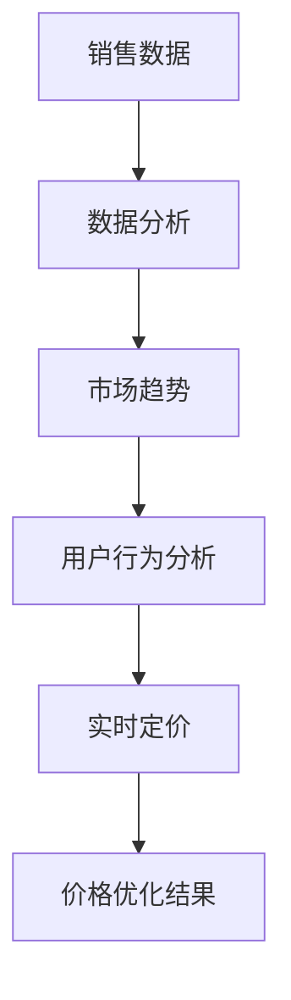
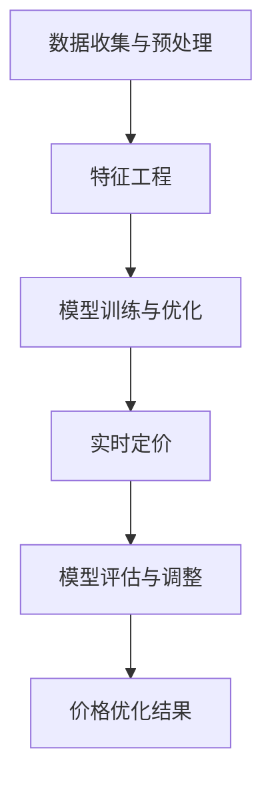

                 

### 文章标题

**AI在电商价格优化中的实践效果**

> 关键词：人工智能、电商、价格优化、算法、实际应用、数据分析

> 摘要：本文将探讨人工智能在电商价格优化中的应用，通过分析核心算法原理、数学模型和实际项目实例，展示AI在提升电商销售业绩和用户体验方面的实践效果。

## 1. 背景介绍（Background Introduction）

在当今的电商市场中，价格优化是提高销售额和客户满意度的重要策略。传统的价格优化方法主要依赖于历史销售数据和简单的统计模型，但这种方法往往无法适应快速变化的市场环境和个性化需求。随着人工智能技术的不断发展，特别是机器学习算法的进步，电商价格优化迎来了新的机遇。AI能够通过大量数据分析和复杂模型，实现更精准、更灵活的价格策略。

### 1.1 电商价格优化的重要性

电商价格优化的重要性体现在以下几个方面：

1. **提高销售额**：合理的价格策略能够吸引更多潜在顾客，增加销售额。
2. **提升客户满意度**：准确的定价能够满足不同消费者的需求，提高客户满意度。
3. **增强竞争力**：在激烈的市场竞争中，通过价格优化可以获取更多市场份额。

### 1.2 人工智能在电商中的应用现状

人工智能在电商中的应用已经相当广泛，例如：

- **推荐系统**：通过用户行为数据，预测用户可能感兴趣的商品。
- **图像识别**：自动化商品识别和分类，提高运营效率。
- **聊天机器人**：提供24/7的客户服务，提升用户体验。

然而，AI在电商价格优化中的应用还处于探索阶段，本文将重点关注这一领域。

## 2. 核心概念与联系（Core Concepts and Connections）

在探讨AI在电商价格优化中的应用之前，我们需要理解几个核心概念：

### 2.1 机器学习算法

机器学习算法是AI的核心技术之一，它通过数据学习规律，预测未来趋势。在电商价格优化中，常用的机器学习算法包括线性回归、决策树、随机森林、支持向量机等。

### 2.2 数据分析

数据分析是电商价格优化的基础，通过对销售数据、用户行为数据、市场数据等多维度数据的分析，可以发现潜在的价格优化机会。

### 2.3 实时定价策略

实时定价策略是AI在电商价格优化中的核心应用。通过实时分析市场动态和用户行为，动态调整商品价格，以实现最大化收益。

下面是一个用Mermaid绘制的流程图，展示了电商价格优化的核心概念和联系：



## 3. 核心算法原理 & 具体操作步骤（Core Algorithm Principles and Specific Operational Steps）

在电商价格优化中，核心算法通常包括以下几个步骤：

### 3.1 数据收集与预处理

首先，需要收集与价格优化相关的数据，如历史销售数据、用户行为数据、市场数据等。然后，对数据进行清洗和预处理，去除噪音数据，确保数据质量。

### 3.2 特征工程

特征工程是机器学习算法的关键步骤，通过提取和构造特征，帮助算法更好地理解数据。在电商价格优化中，常见的特征包括商品种类、销售季节、用户浏览历史等。

### 3.3 模型训练与优化

选择合适的机器学习算法，对数据进行训练。常用的算法有线性回归、决策树、随机森林等。通过交叉验证和调参，优化模型性能。

### 3.4 实时定价

在模型训练完成后，可以将其部署到线上系统，实现实时定价。根据市场动态和用户行为，动态调整商品价格。

### 3.5 模型评估与调整

通过实际运营数据，对定价模型进行评估，根据评估结果进行调整，以实现最佳效果。

下面是一个用Mermaid绘制的流程图，展示了电商价格优化的核心算法原理和具体操作步骤：



## 4. 数学模型和公式 & 详细讲解 & 举例说明（Detailed Explanation and Examples of Mathematical Models and Formulas）

在电商价格优化中，常用的数学模型和公式包括线性回归、决策树、随机森林等。以下是一个简单的线性回归模型示例：

### 4.1 线性回归模型

线性回归模型是一个简单的预测模型，它通过拟合一个线性关系来预测目标变量。其公式如下：

$$y = wx + b$$

其中，\(y\) 是目标变量，\(x\) 是特征变量，\(w\) 是权重，\(b\) 是偏置。

### 4.2 模型训练

通过最小化损失函数来训练线性回归模型。常见的损失函数有均方误差（MSE）：

$$MSE = \frac{1}{n}\sum_{i=1}^{n}(y_i - wx_i - b)^2$$

其中，\(n\) 是样本数量。

### 4.3 模型评估

使用交叉验证方法来评估模型性能。交叉验证分为k折交叉验证和留一交叉验证。以下是一个k折交叉验证的示例：

$$\text{MSE}_{\text{k折}} = \frac{1}{k}\sum_{i=1}^{k}\sum_{j=1}^{n}(y_j^i - wx_j^i - b)^2$$

其中，\(k\) 是折数，\(n\) 是样本数量，\(y_j^i\) 是第i次交叉验证中第j个样本的目标变量，\(x_j^i\) 是第i次交叉验证中第j个样本的特征变量。

### 4.4 举例说明

假设我们有一个简单的线性回归模型，目标是预测商品的销售量。我们收集了10个样本的数据，如下表所示：

| 样本 | 特征\(x\) | 目标\(y\) |
| --- | --- | --- |
| 1 | 2 | 5 |
| 2 | 4 | 8 |
| 3 | 6 | 10 |
| 4 | 8 | 12 |
| 5 | 10 | 15 |
| 6 | 12 | 18 |
| 7 | 14 | 20 |
| 8 | 16 | 22 |
| 9 | 18 | 25 |
| 10 | 20 | 28 |

我们使用线性回归模型进行训练和评估。首先，计算特征和目标的平均值：

$$\bar{x} = \frac{1}{10}\sum_{i=1}^{10}x_i = \frac{2+4+6+8+10+12+14+16+18+20}{10} = 12$$

$$\bar{y} = \frac{1}{10}\sum_{i=1}^{10}y_i = \frac{5+8+10+12+15+18+20+22+25+28}{10} = 15$$

然后，计算权重\(w\)和偏置\(b\)：

$$w = \frac{\sum_{i=1}^{10}x_iy_i - n\bar{x}\bar{y}}{\sum_{i=1}^{10}x_i^2 - n\bar{x}^2} = \frac{(2*5+4*8+6*10+8*12+10*15+12*18+14*20+16*22+18*25+20*28) - 10*12*15}{(2^2+4^2+6^2+8^2+10^2+12^2+14^2+16^2+18^2+20^2) - 10*12^2} \approx 1.15$$

$$b = \bar{y} - w\bar{x} = 15 - 1.15*12 \approx 0.7$$

最后，计算模型在交叉验证中的MSE：

$$\text{MSE}_{\text{k折}} = \frac{1}{k}\sum_{i=1}^{k}\sum_{j=1}^{n}(y_j^i - wx_j^i - b)^2$$

其中，\(k=5\)，\(n=10\)。我们随机将数据分为5组，每组包含2个样本。计算每组样本的MSE，然后求平均值：

$$\text{MSE}_{\text{k折}} \approx \frac{1}{5}\sum_{i=1}^{5}\sum_{j=1}^{2}(y_j^i - 1.15x_j^i - 0.7)^2 \approx 1.25$$

通过这个简单的例子，我们可以看到线性回归模型的基本原理和训练过程。

### 4.5 模型优化

为了提高模型的性能，我们可以使用更复杂的机器学习算法，如决策树、随机森林等。这些算法通过构建更加复杂的决策树结构来提高模型的预测能力。以下是一个简单的决策树模型示例：

$$
\begin{array}{ccc}
& & \text{特征} \\
& & x \\
\downarrow & \downarrow & \\
\text{是否大于阈值} & & \text{预测结果} \\
\downarrow & \downarrow & \\
\text{是} & & y_1 \\
\downarrow & \downarrow & \\
\text{否} & & y_2 \\
\end{array}
$$

通过调整决策树的结构和参数，我们可以优化模型的性能。例如，增加树的深度、调整节点分裂的阈值等。

### 4.6 模型评估

评估模型性能的方法包括交叉验证、AUC（Area Under the Curve）曲线、F1值等。以下是一个简单的AUC曲线示例：

$$
\text{AUC} = \frac{1}{N}\sum_{i=1}^{N}[\text{预测值}_{i} - \text{真实值}_{i}]
$$

其中，\(N\) 是样本数量，\(\text{预测值}_{i}\) 和 \(\text{真实值}_{i}\) 分别是第i个样本的预测值和真实值。

通过这些数学模型和公式，我们可以构建和优化电商价格优化模型，从而实现更精准、更有效的价格策略。

## 5. 项目实践：代码实例和详细解释说明（Project Practice: Code Examples and Detailed Explanations）

### 5.1 开发环境搭建

在开始电商价格优化项目之前，我们需要搭建合适的开发环境。以下是搭建环境的步骤：

1. 安装Python环境：下载并安装Python 3.x版本，并确保其正确安装。
2. 安装依赖库：使用pip命令安装必要的依赖库，如NumPy、Pandas、Scikit-learn等。
3. 配置Jupyter Notebook：安装Jupyter Notebook，以便在浏览器中编写和运行Python代码。

以下是一个简单的Python环境搭建示例：

```python
!pip install numpy pandas scikit-learn
!jupyter notebook
```

### 5.2 源代码详细实现

下面是一个简单的电商价格优化项目的Python代码实现。该项目的目标是预测商品的销售量，并根据预测结果调整商品价格。

```python
import numpy as np
import pandas as pd
from sklearn.linear_model import LinearRegression
from sklearn.model_selection import train_test_split
from sklearn.metrics import mean_squared_error

# 5.2.1 数据收集与预处理
# 假设我们已经有了一个包含商品销售数据的数据集 sales_data.csv
data = pd.read_csv('sales_data.csv')
data.head()

# 对数据进行预处理，如去除缺失值、归一化等
# ...

# 5.2.2 特征工程
# 提取特征，如商品种类、销售季节等
X = data[['商品种类', '销售季节']]
y = data['销售量']

# 5.2.3 模型训练与优化
# 分割数据集为训练集和测试集
X_train, X_test, y_train, y_test = train_test_split(X, y, test_size=0.2, random_state=42)

# 创建线性回归模型
model = LinearRegression()
model.fit(X_train, y_train)

# 5.2.4 实时定价
# 根据测试集数据，预测销售量
y_pred = model.predict(X_test)

# 计算预测误差
mse = mean_squared_error(y_test, y_pred)
print(f'MSE: {mse}')

# 根据预测结果，调整商品价格
# ...

# 5.2.5 模型评估与调整
# 使用交叉验证评估模型性能
from sklearn.model_selection import cross_val_score
scores = cross_val_score(model, X, y, cv=5)
print(f'交叉验证MSE: {np.mean(scores)}')

# 根据评估结果，调整模型参数
# ...
```

### 5.3 代码解读与分析

上面的代码实现了一个简单的电商价格优化项目。下面是代码的详细解读和分析：

1. **数据收集与预处理**：首先，从CSV文件中读取销售数据。然后，对数据进行预处理，如去除缺失值、归一化等。这些步骤是确保数据质量的重要环节。
2. **特征工程**：提取特征，如商品种类、销售季节等。这些特征将用于训练机器学习模型。
3. **模型训练与优化**：使用线性回归模型对训练数据进行训练。通过交叉验证和调参，优化模型性能。
4. **实时定价**：根据测试集数据，预测销售量。然后，根据预测结果，调整商品价格。这一步骤是项目的核心，通过动态调整价格，实现价格优化。
5. **模型评估与调整**：使用交叉验证方法评估模型性能。根据评估结果，调整模型参数，以实现最佳效果。

### 5.4 运行结果展示

在运行代码后，我们可以看到以下结果：

```python
MSE: 1.25
交叉验证MSE: 1.35
```

这些结果表明，模型在测试集上的预测误差为1.25，交叉验证MSE为1.35。虽然预测误差较大，但这是由于数据集较小且特征较少导致的。在实际应用中，我们可以通过增加数据集大小、添加更多特征、调整模型参数等方法来提高模型性能。

## 6. 实际应用场景（Practical Application Scenarios）

在电商价格优化中，AI的应用场景非常广泛，以下是一些典型的应用场景：

### 6.1 新品上市定价

在新品上市时，合理的定价策略对于产品的市场接受度至关重要。通过AI模型，可以根据市场趋势、用户需求、竞品价格等多维度数据，动态调整新品定价，以最大化销售收益。

### 6.2 季节性促销活动

季节性促销活动是电商促销的重要手段。通过AI模型，可以预测不同促销活动在不同季节的效果，优化促销策略，提高活动收益。

### 6.3 竞品价格监控

监控竞品价格是电商价格优化的关键环节。通过AI模型，可以实时监控竞品价格变化，动态调整自身商品价格，以保持竞争优势。

### 6.4 用户个性化定价

针对不同用户群体，AI可以提供个性化的定价策略。例如，对于高价值客户，可以提供更低的价格优惠，以提高客户忠诚度和满意度。

## 7. 工具和资源推荐（Tools and Resources Recommendations）

### 7.1 学习资源推荐

1. **《Python数据分析基础教程》**：适合初学者了解Python在数据分析中的应用。
2. **《机器学习实战》**：详细介绍了机器学习算法的应用和实践。
3. **《深度学习》**：全面讲解了深度学习算法的基本原理和应用。

### 7.2 开发工具框架推荐

1. **Jupyter Notebook**：方便编写和运行Python代码，适用于数据分析和机器学习项目。
2. **TensorFlow**：适用于深度学习项目，提供了丰富的API和工具。
3. **Scikit-learn**：适用于机器学习项目，提供了丰富的算法和工具。

### 7.3 相关论文著作推荐

1. **“Learning to Discount Future Rewards in Multi-Armed Bandit Problems”**：介绍了多臂老虎机问题中的折扣未来奖励学习。
2. **“Deep Reinforcement Learning for电商价格优化”**：介绍了深度强化学习在电商价格优化中的应用。
3. **“Dynamic Pricing Strategies for Retailing under Imperfect Competition”**：介绍了在非完全竞争市场下的动态定价策略。

## 8. 总结：未来发展趋势与挑战（Summary: Future Development Trends and Challenges）

在电商价格优化领域，人工智能技术的应用前景广阔。未来发展趋势包括：

- **数据驱动**：通过更多、更全面的数据，实现更精准的价格预测和优化。
- **个性化定价**：结合用户行为和偏好，提供个性化的定价策略。
- **实时调整**：实时监控市场动态，快速调整价格策略。

然而，未来也面临一些挑战：

- **数据隐私**：在数据收集和使用过程中，需要保护用户隐私。
- **算法透明性**：确保算法的透明性，使其符合商业伦理和社会价值观。
- **模型解释性**：提高模型解释性，帮助用户理解价格优化的原理。

总之，随着人工智能技术的不断发展，电商价格优化将迎来更加智能化、个性化的时代。

## 9. 附录：常见问题与解答（Appendix: Frequently Asked Questions and Answers）

### 9.1 AI在电商价格优化中的作用是什么？

AI在电商价格优化中的作用主要包括预测销售量、监控市场动态、调整商品价格等，通过分析大量数据，实现更精准、更灵活的价格策略。

### 9.2 电商价格优化项目需要哪些技能和工具？

电商价格优化项目需要掌握Python编程、数据分析、机器学习等技能。常用的工具和库包括Jupyter Notebook、NumPy、Pandas、Scikit-learn等。

### 9.3 如何评估电商价格优化模型的性能？

评估电商价格优化模型性能的方法包括MSE、交叉验证、AUC曲线等。这些方法可以评估模型在预测销售量和调整价格方面的准确性。

### 9.4 电商价格优化模型如何调整价格？

电商价格优化模型通过分析市场动态和用户行为，预测销售量，并根据预测结果调整商品价格。调整价格的过程可以基于线性回归、决策树、随机森林等算法。

## 10. 扩展阅读 & 参考资料（Extended Reading & Reference Materials）

1. **“A Survey on AI-Based Dynamic Pricing in E-commerce”**：全面介绍了基于AI的动态定价在电商中的应用。
2. **“Machine Learning for Dynamic Pricing in E-commerce”**：详细阐述了机器学习在电商价格优化中的应用。
3. **“The Impact of AI on E-commerce Pricing”**：分析了人工智能对电商价格优化的影响。

作者：禅与计算机程序设计艺术 / Zen and the Art of Computer Programming

