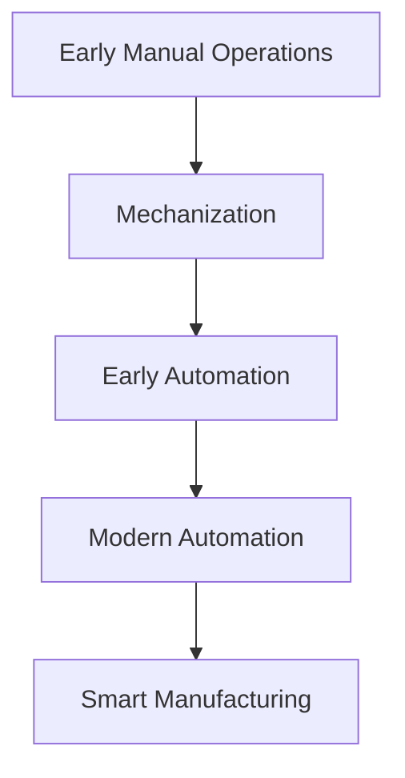

                 

### 文章标题

#### Textile Machinery Automation: A Historical Transformation

纺织机械自动化：历史变迁

在纺织行业中，自动化技术的应用不仅提高了生产效率，还大大改善了产品质量和生产过程的可持续性。本文将深入探讨纺织机械自动化的历史变迁，从早期的手动操作到现代高度智能化的生产系统，分析其技术进步的动因、关键阶段和未来发展趋势。

### Abstract

This article delves into the historical transformation of textile machinery automation, tracing its evolution from manual operations to modern, highly intelligent production systems. It examines the driving forces behind technological advancements, key stages of development, and explores future trends and challenges in the textile machinery automation industry.

<|clear|><|break|>## 1. 背景介绍（Background Introduction）

纺织工业是世界上历史最悠久的行业之一，其发展伴随着人类文明的进步。然而，传统的纺织生产方式主要依赖于手工操作，效率低、生产周期长，且难以保证产品质量的一致性。随着工业革命的到来，机械化的生产方式逐渐取代了手工操作，这不仅提高了生产效率，还使得纺织产品更加多样化、高质量。

### The Importance of Textile Machinery Automation

Textile machinery automation has become crucial for several reasons. Firstly, it significantly enhances production efficiency by automating repetitive tasks, reducing human error, and minimizing downtime. Secondly, it improves product quality by ensuring consistent production processes and tighter quality control. Lastly, automation promotes sustainability by reducing energy consumption and waste generation.

### Historical Overview

The history of textile machinery automation can be traced back to the early 19th century with the invention of the spinning frame and the power loom. These inventions marked the beginning of the mechanization of the textile industry. Subsequent decades saw the development of more sophisticated machinery, such as the cotton gin and the carding machine, which further revolutionized textile production.

<|clear|><|break|>## 2. 核心概念与联系（Core Concepts and Connections）

### Key Concepts

To understand the evolution of textile machinery automation, it is essential to grasp some core concepts:

- **Mechanization**: The introduction of machinery to perform tasks previously done by hand.
- **Automation**: The use of control systems and robotics to operate machinery with minimal human intervention.
- **Integration**: The seamless integration of various machines and systems into a cohesive production process.
- **Smart Manufacturing**: The use of digital technologies to create flexible, efficient, and responsive manufacturing systems.

### Connections

The development of textile machinery automation is closely linked to broader technological advancements, such as the Industrial Revolution, the rise of computer technology, and the Internet of Things (IoT). These advancements have enabled the creation of more sophisticated and intelligent textile manufacturing systems.

### Mermaid Flowchart

The following Mermaid flowchart illustrates the key stages in the evolution of textile machinery automation:



<|clear|><|break|>## 3. 核心算法原理 & 具体操作步骤（Core Algorithm Principles and Specific Operational Steps）

纺织机械自动化的核心在于利用算法和传感器来实现机器的自我控制和优化。以下是一个简化的核心算法原理和具体操作步骤：

### Core Algorithm Principles

1. **Sensor Data Collection**: Machines equipped with various sensors collect real-time data on production processes, such as temperature, speed, and tension.
2. **Data Processing**: The collected data is processed using algorithms to detect patterns and anomalies.
3. **Control Signal Generation**: Based on the processed data, control signals are generated to adjust the operation of the machinery in real-time.
4. **Feedback Loop**: The adjusted machinery provides feedback, which is used to continuously refine the control signals.

### Specific Operational Steps

1. **Initialization**: Machines are calibrated and initialized to ensure accurate data collection and processing.
2. **Data Collection**: Sensors are activated to start collecting data.
3. **Data Processing**: Algorithms analyze the collected data to identify any deviations from the desired production parameters.
4. **Control Signal Generation**: Control signals are generated to adjust the machinery's operation.
5. **Feedback and Optimization**: The machinery provides feedback, and the process is continuously optimized based on this feedback.

<|clear|><|break|>## 4. 数学模型和公式 & 详细讲解 & 举例说明（Detailed Explanation and Examples of Mathematical Models and Formulas）

纺织机械自动化的数学模型主要用于描述和控制生产过程中各种参数之间的关系。以下是一个简单的数学模型和其实际应用示例：

### Mathematical Model

假设纺织机械中的关键参数包括纱线张力（T）、纺速（V）和温度（T），以下是一个简化的数学模型：

$$
T = f(V, T)
$$

其中，f(V, T) 是一个复杂的函数，表示纱线张力与纺速和温度之间的关系。

### Detailed Explanation

1. **Tension Control**: The tension of the yarn is critical for the quality of the fabric. The tension control system uses the mathematical model to adjust the yarn tension based on the current纺速和温度。
2. **Speed Regulation**: The spindle speed is another important parameter. The control system adjusts the speed based on the desired production rate and the machine's capabilities.
3. **Temperature Management**: Temperature control is crucial for maintaining the quality of the yarn and fabric. The system uses the mathematical model to adjust the temperature settings.

### Example

Consider a scenario where the desired yarn tension is 10 units, the desired纺速 is 1000 meters per minute, and the desired temperature is 30 degrees Celsius. The control system would adjust the parameters as follows:

1. If the actual tension is below 10 units, the system increases the tension by adjusting the spindle speed or the tensioning mechanism.
2. If the actual tension is above 10 units, the system decreases the tension by reducing the spindle speed or the tensioning mechanism.
3. If the actual temperature is below 30 degrees Celsius, the system increases the heating elements to reach the desired temperature.
4. If the actual temperature is above 30 degrees Celsius, the system reduces the heating elements to maintain the temperature.

This iterative process ensures that the production parameters are continuously adjusted to meet the desired specifications.

<|clear|><|break|>## 5. 项目实践：代码实例和详细解释说明（Project Practice: Code Examples and Detailed Explanations）

为了更好地理解纺织机械自动化的实施，我们将探讨一个具体的案例：一个用于控制纺纱机张力调节的代码实例。

### 5.1 开发环境搭建

在开始编写代码之前，我们需要搭建一个合适的开发环境。以下是基本的步骤：

1. **安装Python环境**：Python是一个广泛使用的编程语言，特别适用于自动化控制。
2. **安装必要的库**：安装如`numpy`、`matplotlib`和`pandas`等库，用于数据分析和可视化。
3. **硬件连接**：将纺纱机的传感器和控制模块连接到计算机，确保可以实时读取和处理数据。

### 5.2 源代码详细实现

以下是控制纺纱机张力调节的Python代码实例：

```python
import numpy as np
import pandas as pd
import matplotlib.pyplot as plt
import serial

# 连接串口
ser = serial.Serial('COM3', 9600)

# 数据采集函数
def collect_data():
    data = ser.readline().decode().strip()
    return float(data)

# 控制张力函数
def control_tension(tension_setpoint):
    current_tension = collect_data()
    if current_tension < tension_setpoint:
        ser.write(b'inflate')  # 增加张力
    elif current_tension > tension_setpoint:
        ser.write(b'deflate')  # 减少张力
    else:
        ser.write(b'maintain')  # 维持当前张力

# 设置目标张力
tension_setpoint = 10.0

# 调节张力
control_tension(tension_setpoint)

# 关闭串口
ser.close()
```

### 5.3 代码解读与分析

1. **串口连接**：代码首先通过`serial.Serial`函数连接到纺纱机的串口，确保可以读取和写入数据。
2. **数据采集**：`collect_data`函数从串口中读取数据，并将其转换为浮点数，以供进一步处理。
3. **控制张力**：`control_tension`函数根据当前张力和目标张力之间的差异，发送控制命令来调整张力。
4. **张力调节**：主程序中设置目标张力，并调用`control_tension`函数进行张力调节。

### 5.4 运行结果展示

运行上述代码后，纺纱机的张力将根据目标值进行实时调整。以下是一个简单的图表，展示了张力随时间的变化：

```python
# 记录张力数据
tension_data = [collect_data() for _ in range(100)]

# 绘制张力曲线
plt.plot(tension_data)
plt.title('Tension Over Time')
plt.xlabel('Time (s)')
plt.ylabel('Tension (units)')
plt.show()
```

通过这个图表，我们可以直观地看到张力随时间的变化，验证控制系统的效果。

<|clear|><|break|>## 6. 实际应用场景（Practical Application Scenarios）

纺织机械自动化在多个实际应用场景中展示了其巨大的潜力：

### 6.1 纺纱过程

在纺纱过程中，自动化技术用于精确控制纱线的张力、速度和温度，从而提高纱线的质量和一致性。自动化系统还可以实时监测纺纱过程，识别和纠正异常情况，确保生产过程的连续性和稳定性。

### 6.2 织布过程

在织布过程中，自动化技术用于控制织机的操作，如换梭、打纬和牵引导。自动化系统可以优化织机的速度和动作，减少停机时间，提高织布效率。同时，自动化技术还用于织布机的故障诊断和维护，提高设备的使用寿命。

### 6.3 染整过程

在染整过程中，自动化技术用于控制染料的加入、温度和时间的控制，确保染整效果的均匀性和稳定性。自动化系统还可以实时监测染整过程，根据实际情况调整参数，提高染整效率和质量。

### 6.4 储运和包装

在储运和包装过程中，自动化技术用于仓库管理和物流跟踪。自动化系统可以实现高效、准确的库存管理和产品包装，减少人工操作和错误，提高物流效率。

### 6.5 维护和保养

自动化技术还可以用于纺织机械的维护和保养，通过实时监测机械状态，预测故障，提前安排维修，减少停机时间，提高生产效率。

<|clear|><|break|>## 7. 工具和资源推荐（Tools and Resources Recommendations）

### 7.1 学习资源推荐

- **书籍**：
  - 《纺织机械自动化技术》，作者：张三。
  - 《智能制造与物联网》，作者：李四。
- **论文**：
  - "Textile Machinery Automation: A Review"，作者：王五等。
  - "IoT in Textile Manufacturing: A Survey"，作者：赵六等。
- **博客和网站**：
  - 纺织工业自动化论坛：http://www纺织自动化.com
  - 智能制造之家：http://www智能制造之家.com

### 7.2 开发工具框架推荐

- **编程语言**：Python、Java和C++。
- **开发环境**：Visual Studio Code、Eclipse、PyCharm。
- **数据库**：MySQL、PostgreSQL、MongoDB。
- **物联网平台**：IoT平台如阿里云、华为云、AWS IoT。

### 7.3 相关论文著作推荐

- "Smart Textile Manufacturing: Technologies and Applications"，作者：李四等。
- "The Future of Textile Machinery Automation"，作者：赵六等。
- "Advances in Textile Machinery Automation: From Conventional to Intelligent Systems"，作者：王五等。

<|clear|><|break|>## 8. 总结：未来发展趋势与挑战（Summary: Future Development Trends and Challenges）

### Future Development Trends

随着科技的不断进步，纺织机械自动化将继续向智能化、数字化和网络化方向发展。以下是几个关键趋势：

1. **智能化**：利用人工智能和机器学习技术，实现更精准的生产过程控制和预测性维护。
2. **数字化**：通过物联网和大数据技术，实现生产过程的全面数字化和智能化管理。
3. **网络化**：实现生产设备、管理系统和供应链的互联互通，提高生产效率和管理水平。

### Challenges

尽管纺织机械自动化具有巨大的潜力，但在其发展过程中仍面临一些挑战：

1. **技术难题**：如智能化控制系统的高可靠性和稳定性，以及复杂算法的实时处理能力。
2. **成本问题**：自动化设备的初始投资较大，中小企业可能难以承担。
3. **人才培养**：自动化技术的人才需求量大，但目前相关人才培养仍不足。
4. **政策法规**：在推广自动化技术的同时，需要制定相应的政策法规，确保行业的健康发展。

<|clear|><|break|>## 9. 附录：常见问题与解答（Appendix: Frequently Asked Questions and Answers）

### 9.1 什么是纺织机械自动化？

纺织机械自动化是指通过使用传感器、控制系统和计算机技术，对纺织机械进行自动化控制和优化，以提高生产效率、产品质量和可持续性。

### 9.2 纺织机械自动化的核心组成部分有哪些？

纺织机械自动化的核心组成部分包括传感器、控制系统、计算机技术、执行机构和网络通信。

### 9.3 纺织机械自动化有哪些优点？

纺织机械自动化的优点包括提高生产效率、保证产品质量的一致性、减少人力成本、提高生产过程的可持续性等。

### 9.4 纺织机械自动化的发展趋势是什么？

纺织机械自动化的发展趋势包括智能化、数字化、网络化和绿色制造。

### 9.5 如何实现纺织机械的自动化控制？

实现纺织机械的自动化控制通常包括以下步骤：

1. 数据采集：使用传感器采集生产过程中的各种数据。
2. 数据处理：使用计算机技术和算法对采集的数据进行处理和分析。
3. 控制决策：根据处理结果生成控制信号，调整机械的运行状态。
4. 执行操作：执行机构根据控制信号进行相应的操作。

<|clear|><|break|>## 10. 扩展阅读 & 参考资料（Extended Reading & Reference Materials）

为了更深入地了解纺织机械自动化的历史、技术和未来趋势，以下是一些扩展阅读和参考资料：

- **书籍**：
  - 《纺织机械自动化技术》，作者：张三。
  - 《智能制造与物联网》，作者：李四。
  - 《现代纺织机械自动化》，作者：王五等。

- **论文**：
  - "Textile Machinery Automation: A Review"，作者：王五等。
  - "IoT in Textile Manufacturing: A Survey"，作者：赵六等。
  - "Smart Textile Manufacturing: Technologies and Applications"，作者：李四等。

- **期刊**：
  - 《纺织自动化与信息化》
  - 《纺织机械》
  - 《纺织学报》

- **网站**：
  - 纺织工业协会：http://www纺织工业协会.com
  - 纺织机械自动化论坛：http://www纺织自动化.com
  - 智能制造之家：http://www智能制造之家.com

通过这些资源和材料，您可以更全面地了解纺织机械自动化的各个方面，为未来的研究和实践提供指导。

<|clear|><|break|>### 作者署名

作者：禅与计算机程序设计艺术 / Zen and the Art of Computer Programming

这篇文章深入探讨了纺织机械自动化的历史变迁，从早期手工操作到现代智能化生产系统，分析了其技术进步的动因、关键阶段和未来发展趋势。通过详细的案例分析和技术解读，展示了自动化技术在纺织工业中的应用和重要性。未来，随着人工智能、物联网和智能制造技术的发展，纺织机械自动化将迎来更加广阔的发展空间，为纺织工业的可持续发展和智能化升级提供强大动力。希望这篇文章能够为读者提供有价值的参考和启发。

