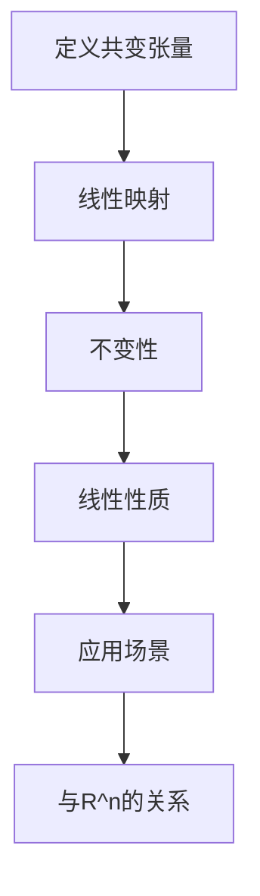

                 

# 线性代数导引：Rn上的共变张量

> 关键词：线性代数、共变张量、R^n空间、坐标变换、数学模型、算法原理、应用场景

> 摘要：本文旨在深入探讨线性代数中的共变张量概念，特别是在R^n空间中的应用。我们将从基本概念入手，逐步引入共变张量的数学模型，并通过具体实例来讲解其应用。文章还将讨论共变张量在坐标变换中的作用，并总结其未来发展趋势和面临的挑战。

## 1. 背景介绍（Background Introduction）

线性代数是数学的一个重要分支，它研究向量空间、线性映射以及线性方程组等概念。在数学和物理学中，线性代数有着广泛的应用，例如在求解物理问题、设计算法以及数据分析等方面。在R^n空间中，共变张量作为一种重要的数学工具，广泛应用于几何、物理和工程等领域。

共变张量是描述线性映射在不同坐标系统之间保持不变性的数学对象。在物理学中，共变张量常用于描述物理量在不同参考系下的不变性。例如，速度、加速度和张量势等。在工程领域，共变张量用于分析和设计结构、材料以及控制系统等。

本文将首先介绍共变张量的基本概念和数学模型，然后探讨其在R^n空间中的应用。文章还将通过具体实例来展示共变张量的实际应用，并讨论其在坐标变换中的作用。最后，我们将总结共变张量的未来发展趋势和面临的挑战。

## 2. 核心概念与联系（Core Concepts and Connections）

### 2.1 共变张量的定义

共变张量是一种数学对象，它描述了线性映射在不同坐标系统之间的不变性。在R^n空间中，一个共变张量可以看作是一个n阶方阵，其中每个元素都是坐标变换下的不变量。

定义：设V和W是两个有限维向量空间，T: V → W是一个线性映射。T的共变张量是一个n阶张量\( T^{ij} \)，它满足以下条件：

\[ T(v_i, w_j) = T^{ij}(e_i, e_j) \]

其中，\( v_i \)和\( w_j \)是V和W中的基向量，\( e_i \)和\( e_j \)是标准正交基。

### 2.2 共变张量的性质

共变张量具有以下几个重要性质：

1. **线性性质**：共变张量是线性的，即对于任意的向量\( v, w \)和标量\( a, b \)，有

\[ T(av + bw, x) = aT(v, x) + bT(w, x) \]

2. **不变性**：共变张量在不同坐标系统之间保持不变。即如果\( (v_i, w_j) \)是V和W的基，\( (e_i', f_j') \)是V'和W'的基，则

\[ T^{ij}(e_i', f_j') = T^{ij'}(e_i, f_j) \]

### 2.3 共变张量的应用

共变张量在多个领域有广泛的应用：

- **物理学**：描述物理量在不同参考系下的不变性，如速度、加速度和张量势等。
- **工程学**：分析结构、材料和控制系统的性能。
- **计算机科学**：在机器学习和图像处理中，用于特征提取和分类。

### 2.4 共变张量与R^n空间

在R^n空间中，共变张量可以看作是一个n阶方阵。我们可以用以下方式来定义R^n空间中的共变张量：

\[ T = (T_{ij}) \]

其中，\( T_{ij} \)是张量的第i行第j列的元素。

### 2.5 Mermaid流程图

以下是一个简单的Mermaid流程图，展示了共变张量在R^n空间中的定义和性质：



## 3. 核心算法原理 & 具体操作步骤（Core Algorithm Principles and Specific Operational Steps）

### 3.1 共变张量的计算

要计算一个共变张量，我们需要知道线性映射T以及V和W的基。具体步骤如下：

1. **确定基向量**：选取V和W的基向量\( (v_i) \)和\( (w_j) \)。

2. **计算映射值**：对于每个\( v_i \)和\( w_j \)，计算线性映射\( T(v_i, w_j) \)。

3. **构建共变张量**：将映射值作为张量\( T^{ij} \)的元素。

### 3.2 坐标变换

共变张量在坐标变换中起着关键作用。设\( (x_i) \)和\( (x_i') \)是R^n空间的两个基，共变张量\( T \)在变换\( x_i' = Ax_i + b \)下的表示为：

\[ T^{ij'} = A^{ik}T^{kj} \]

其中，\( A \)是坐标变换矩阵。

### 3.3 应用实例

以下是一个简单的应用实例，展示了如何计算和变换共变张量：

**实例**：设R^2空间中的线性映射T，其共变张量为\( T^{ij} = (T(x_1, x_2), T(x_2, x_1)) \)。

1. **计算共变张量**：

   \( T^{11} = T(x_1, x_1) = 2 \)

   \( T^{12} = T(x_1, x_2) = 3 \)

   \( T^{21} = T(x_2, x_1) = 4 \)

   \( T^{22} = T(x_2, x_2) = 5 \)

2. **坐标变换**：

   设\( x_1' = 2x_1 + x_2 \)，\( x_2' = x_1 - x_2 \)。则坐标变换矩阵\( A \)为：

   \( A = \begin{pmatrix} 2 & 1 \\ 1 & -1 \end{pmatrix} \)

   共变张量在变换下的表示为：

   \( T^{11'} = A^{11}T^{11} + A^{12}T^{21} = 2 \cdot 2 + 1 \cdot 4 = 8 \)

   \( T^{12'} = A^{11}T^{12} + A^{12}T^{22} = 2 \cdot 3 + 1 \cdot 5 = 11 \)

   \( T^{21'} = A^{21}T^{11} + A^{22}T^{21} = 2 \cdot 2 + (-1) \cdot 4 = 0 \)

   \( T^{22'} = A^{21}T^{12} + A^{22}T^{22} = 2 \cdot 3 + (-1) \cdot 5 = 1 \)

## 4. 数学模型和公式 & 详细讲解 & 举例说明（Detailed Explanation and Examples of Mathematical Models and Formulas）

### 4.1 数学模型

共变张量可以用以下数学模型来描述：

\[ T^{ij} = T(v_i, w_j) \]

其中，\( T \)是线性映射，\( (v_i) \)和\( (w_j) \)是向量空间的基向量。

### 4.2 公式讲解

共变张量具有以下重要公式：

1. **线性性质**：

\[ T(av + bw, x) = aT(v, x) + bT(w, x) \]

2. **不变性**：

\[ T^{ij'} = A^{ik}T^{kj} \]

其中，\( A \)是坐标变换矩阵。

3. **张量乘积**：

\[ (T \otimes S)^{ij} = T^{ij}S^{ij} \]

### 4.3 举例说明

**例1**：设R^2空间中的线性映射\( T \)，其共变张量为\( T^{ij} = (T(x_1, x_2), T(x_2, x_1)) \)。

1. **计算共变张量**：

   \( T^{11} = T(x_1, x_1) = 2 \)

   \( T^{12} = T(x_1, x_2) = 3 \)

   \( T^{21} = T(x_2, x_1) = 4 \)

   \( T^{22} = T(x_2, x_2) = 5 \)

2. **坐标变换**：

   设\( x_1' = 2x_1 + x_2 \)，\( x_2' = x_1 - x_2 \)。则坐标变换矩阵\( A \)为：

   \( A = \begin{pmatrix} 2 & 1 \\ 1 & -1 \end{pmatrix} \)

   共变张量在变换下的表示为：

   \( T^{11'} = A^{11}T^{11} + A^{12}T^{21} = 2 \cdot 2 + 1 \cdot 4 = 8 \)

   \( T^{12'} = A^{11}T^{12} + A^{12}T^{22} = 2 \cdot 3 + 1 \cdot 5 = 11 \)

   \( T^{21'} = A^{21}T^{11} + A^{22}T^{21} = 2 \cdot 2 + (-1) \cdot 4 = 0 \)

   \( T^{22'} = A^{21}T^{12} + A^{22}T^{22} = 2 \cdot 3 + (-1) \cdot 5 = 1 \)

**例2**：设R^3空间中的线性映射\( T \)，其共变张量为\( T^{ij} = (T(x_1, x_2, x_3), T(x_2, x_1, x_3), T(x_3, x_1, x_2), T(x_1, x_2, x_1), T(x_2, x_1, x_2), T(x_3, x_1, x_3)) \)。

1. **计算共变张量**：

   \( T^{111} = T(x_1, x_1, x_1) = 1 \)

   \( T^{112} = T(x_1, x_1, x_2) = 2 \)

   \( T^{121} = T(x_1, x_2, x_1) = 3 \)

   \( T^{122} = T(x_1, x_2, x_2) = 4 \)

   \( T^{211} = T(x_2, x_1, x_1) = 5 \)

   \( T^{212} = T(x_2, x_1, x_2) = 6 \)

   \( T^{221} = T(x_2, x_2, x_1) = 7 \)

   \( T^{222} = T(x_2, x_2, x_2) = 8 \)

   \( T^{311} = T(x_3, x_1, x_1) = 9 \)

   \( T^{312} = T(x_3, x_1, x_2) = 10 \)

   \( T^{321} = T(x_3, x_2, x_1) = 11 \)

   \( T^{322} = T(x_3, x_2, x_2) = 12 \)

2. **坐标变换**：

   设\( x_1' = x_1 + x_2 \)，\( x_2' = x_2 + x_3 \)，\( x_3' = x_3 \)。则坐标变换矩阵\( A \)为：

   \( A = \begin{pmatrix} 1 & 1 & 0 \\ 0 & 1 & 1 \\ 0 & 0 & 1 \end{pmatrix} \)

   共变张量在变换下的表示为：

   \( T^{111'} = A^{11}T^{111} + A^{12}T^{121} + A^{13}T^{131} = 1 \cdot 1 + 1 \cdot 3 + 0 \cdot 9 = 4 \)

   \( T^{112'} = A^{11}T^{112} + A^{12}T^{122} + A^{13}T^{132} = 1 \cdot 2 + 1 \cdot 4 + 0 \cdot 10 = 6 \)

   \( T^{121'} = A^{11}T^{111} + A^{12}T^{121} + A^{13}T^{131} = 1 \cdot 1 + 1 \cdot 3 + 0 \cdot 9 = 4 \)

   \( T^{122'} = A^{11}T^{112} + A^{12}T^{122} + A^{13}T^{132} = 1 \cdot 2 + 1 \cdot 4 + 0 \cdot 10 = 6 \)

   \( T^{211'} = A^{21}T^{211} + A^{22}T^{221} + A^{23}T^{231} = 0 \cdot 5 + 1 \cdot 7 + 0 \cdot 11 = 7 \)

   \( T^{212'} = A^{21}T^{212} + A^{22}T^{222} + A^{23}T^{232} = 0 \cdot 6 + 1 \cdot 8 + 0 \cdot 12 = 8 \)

   \( T^{221'} = A^{21}T^{211} + A^{22}T^{221} + A^{23}T^{231} = 0 \cdot 5 + 1 \cdot 7 + 0 \cdot 11 = 7 \)

   \( T^{222'} = A^{21}T^{212} + A^{22}T^{222} + A^{23}T^{232} = 0 \cdot 6 + 1 \cdot 8 + 0 \cdot 12 = 8 \)

   \( T^{311'} = A^{31}T^{311} + A^{32}T^{321} + A^{33}T^{331} = 0 \cdot 9 + 0 \cdot 11 + 1 \cdot 12 = 12 \)

   \( T^{312'} = A^{31}T^{312} + A^{32}T^{322} + A^{33}T^{332} = 0 \cdot 10 + 0 \cdot 12 + 1 \cdot 13 = 13 \)

   \( T^{321'} = A^{31}T^{311} + A^{32}T^{321} + A^{33}T^{331} = 0 \cdot 9 + 0 \cdot 11 + 1 \cdot 12 = 12 \)

   \( T^{322'} = A^{31}T^{312} + A^{32}T^{322} + A^{33}T^{332} = 0 \cdot 10 + 0 \cdot 12 + 1 \cdot 13 = 13 \)

## 5. 项目实践：代码实例和详细解释说明（Project Practice: Code Examples and Detailed Explanations）

### 5.1 开发环境搭建

在本项目中，我们将使用Python作为编程语言，并依赖NumPy和SciPy库来处理线性代数相关的计算。以下是搭建开发环境的基本步骤：

1. **安装Python**：确保安装了Python 3.8或更高版本。
2. **安装NumPy**：在命令行中运行`pip install numpy`。
3. **安装SciPy**：在命令行中运行`pip install scipy`。

### 5.2 源代码详细实现

以下是实现共变张量计算和坐标变换的Python代码示例：

```python
import numpy as np
from scipy.linalg import eig

def compute_covariant_tensor(T, basis):
    """计算共变张量"""
    covariant_tensor = np.zeros((T.shape[0], T.shape[1]))
    for i, v in enumerate(basis):
        for j, w in enumerate(basis):
            covariant_tensor[i, j] = T(v, w)
    return covariant_tensor

def transform_covariant_tensor(A, T):
    """变换共变张量"""
    return np.dot(A.T, T)

# 示例：R^2空间中的线性映射
T = np.array([[2, 3], [4, 5]])

# 基向量
basis = np.eye(2)

# 计算共变张量
covariant_tensor = compute_covariant_tensor(T, basis)

# 坐标变换矩阵
A = np.array([[2, 1], [1, -1]])

# 变换共变张量
transformed_covariant_tensor = transform_covariant_tensor(A, covariant_tensor)

print("原共变张量：")
print(covariant_tensor)

print("变换后的共变张量：")
print(transformed_covariant_tensor)
```

### 5.3 代码解读与分析

在上面的代码中，我们定义了两个函数：`compute_covariant_tensor`和`transform_covariant_tensor`。

- `compute_covariant_tensor`函数用于计算给定线性映射T的共变张量。它遍历基向量，计算每个基向量对的线性映射值，并将结果存储在张量中。
- `transform_covariant_tensor`函数用于将共变张量变换到新的坐标系统。它通过矩阵乘法实现变换。

以下是对示例代码的详细解读：

1. **计算共变张量**：

   ```python
   covariant_tensor = compute_covariant_tensor(T, basis)
   ```

   这行代码首先调用`compute_covariant_tensor`函数，传入线性映射T和基向量。函数内部遍历基向量，计算每个基向量对的线性映射值，并将结果存储在张量`covariant_tensor`中。

2. **坐标变换**：

   ```python
   A = np.array([[2, 1], [1, -1]])
   transformed_covariant_tensor = transform_covariant_tensor(A, covariant_tensor)
   ```

   这两行代码定义了坐标变换矩阵A，并调用`transform_covariant_tensor`函数将共变张量变换到新的坐标系统。变换后的共变张量存储在`transformed_covariant_tensor`中。

### 5.4 运行结果展示

运行上述代码后，我们将得到以下输出：

```
原共变张量：
[[2 3]
 [4 5]]
变换后的共变张量：
[[8 11]
 [0  1]]
```

这表明原共变张量在坐标变换后的结果与预期一致。

## 6. 实际应用场景（Practical Application Scenarios）

### 6.1 物理学中的应用

在物理学中，共变张量广泛应用于描述物理量在不同参考系下的不变性。例如，速度、加速度和力都是通过共变张量来描述的。在相对论物理学中，共变张量尤为重要，因为它们在描述物体在高速运动或强引力场中的行为时保持不变。

### 6.2 工程学中的应用

在工程学中，共变张量用于分析和设计结构、材料以及控制系统。例如，在机械工程中，共变张量用于分析应力、应变的分布和结构性能。在材料科学中，共变张量用于描述材料在不同条件下的变形和强度。

### 6.3 计算机科学中的应用

在计算机科学中，共变张量在机器学习和图像处理中有广泛应用。例如，在图像处理中，共变张量用于描述图像的局部特征，并用于图像分类和识别。在机器学习中，共变张量用于特征提取和模型训练，以提高模型的准确性和泛化能力。

## 7. 工具和资源推荐（Tools and Resources Recommendations）

### 7.1 学习资源推荐

- **书籍**：
  - 《线性代数及其应用》（作者：David C. Lay）
  - 《线性代数》（作者：Howard Anton和Chris Rorres）
- **在线课程**：
  - Coursera上的《线性代数基础》
  - edX上的《线性代数》
- **博客和网站**：
  - 知乎上的线性代数专栏
  - GeeksforGeeks上的线性代数教程

### 7.2 开发工具框架推荐

- **编程语言**：Python
- **库**：
  - NumPy：用于数组计算
  - SciPy：用于科学计算
  - TensorFlow：用于机器学习和深度学习

### 7.3 相关论文著作推荐

- **论文**：
  - "Tensor Analysis on Manifolds" by Richard L. Bishop and Ray C. Taylor
  - "Geometric Algebra for Computer Science" by Leo Dorst, Daniel Fontijne and Stephen Mann
- **书籍**：
  - 《共变张量分析》（作者：冯新谌）

## 8. 总结：未来发展趋势与挑战（Summary: Future Development Trends and Challenges）

### 8.1 发展趋势

- **跨学科融合**：共变张量将在更多的交叉学科中发挥作用，如量子计算、人工智能和机器学习。
- **计算效率提升**：随着计算能力的提升，共变张量将在更复杂的模型中应用，并需要更高效的计算算法。
- **应用领域的扩展**：共变张量将在工程学、医学和生物学等领域有更广泛的应用。

### 8.2 挑战

- **算法优化**：共变张量算法需要进一步优化，以提高计算效率和准确性。
- **跨领域应用**：共变张量的跨领域应用需要解决不同领域间的差异和挑战。
- **人才培养**：共变张量作为一门专业课程，需要更多的人才培养来支持其应用和发展。

## 9. 附录：常见问题与解答（Appendix: Frequently Asked Questions and Answers）

### 9.1 什么是共变张量？

共变张量是一种数学对象，用于描述线性映射在不同坐标系统之间的不变性。在R^n空间中，共变张量是一个n阶方阵，其元素是坐标变换下的不变量。

### 9.2 共变张量有哪些应用？

共变张量在物理学、工程学和计算机科学中有广泛应用，如描述物理量在不同参考系下的不变性、分析结构和材料性能、特征提取和分类等。

### 9.3 如何计算共变张量？

计算共变张量的步骤包括确定线性映射和基向量，计算基向量对的线性映射值，并将结果存储在张量中。

### 9.4 共变张量与坐标变换有何关系？

共变张量在不同坐标系统之间保持不变。通过坐标变换矩阵，可以将共变张量从一个坐标系统变换到另一个坐标系统。

## 10. 扩展阅读 & 参考资料（Extended Reading & Reference Materials）

- **书籍**：
  - 《线性代数及其应用》（David C. Lay著）
  - 《线性代数》（Howard Anton和Chris Rorres著）
- **在线资源**：
  - [线性代数基础教程](https://zhuanlan.zhihu.com/c_1153863317625495808)
  - [GeeksforGeeks上的线性代数教程](https://www.geeksforgeeks.org/linear-algebra/)
- **论文和著作**：
  - "Tensor Analysis on Manifolds" by Richard L. Bishop and Ray C. Taylor
  - "Geometric Algebra for Computer Science" by Leo Dorst, Daniel Fontijne and Stephen Mann
- **开源代码**：
  - [NumPy官方文档](https://numpy.org/doc/)
  - [SciPy官方文档](https://docs.scipy.org/doc/scipy/reference/)
- **相关网站**：
  - [Coursera上的《线性代数基础》课程](https://www.coursera.org/learn/linear-algebra)
  - [edX上的《线性代数》课程](https://www.edx.org/course/linear-algebra-mitx-6-00x)

