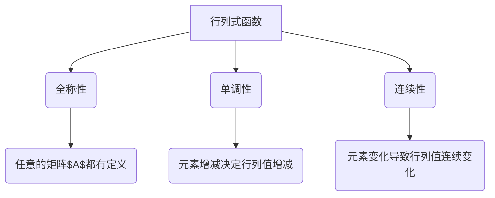

                 

# 线性代数导引：行列式函数

## 关键词 Keywords
- 线性代数
- 行列式
- 函数
- 矩阵
- 算法
- 数学模型
- 应用场景

## 摘要 Abstract
本文将引导读者深入了解行列式函数，这一在数学和工程领域具有重要应用的概念。通过对行列式的定义、性质以及计算方法的详细讲解，本文旨在帮助读者理解行列式函数的核心概念，并掌握其在实际问题中的应用技巧。同时，本文还将探讨行列式函数在矩阵理论中的关键作用，以及如何通过具体实例加深对行列式的理解。

> 作者：禅与计算机程序设计艺术 / Zen and the Art of Computer Programming

## 1. 背景介绍（Background Introduction）

### 1.1 线性代数的核心概念

线性代数是数学的一个分支，它研究向量空间、线性变换以及这两个概念之间的相互关系。线性代数的核心概念包括向量、矩阵、行列式等。向量可以表示为空间中的点，矩阵可以看作是向量之间的线性组合规则，而行列式则是矩阵的一种特殊的数值特征。

### 1.2 行列式的定义

行列式是一个由矩阵元素构成的数值，通常用于判断矩阵的行列式是否为零，以及确定矩阵是否可逆。一个n阶矩阵的行列式可以定义为：

$$
\begin{vmatrix}
a_{11} & a_{12} & \cdots & a_{1n} \\
a_{21} & a_{22} & \cdots & a_{2n} \\
\vdots & \vdots & \ddots & \vdots \\
a_{n1} & a_{n2} & \cdots & a_{nn} \\
\end{vmatrix}
$$

其中，$a_{ij}$表示矩阵中第i行第j列的元素。

### 1.3 行列式的性质

行列式具有多种性质，包括：

1. **线性性**：行列式对于矩阵的每一行或每一列都满足线性性质。
2. **行列变换**：通过行列变换（如交换两行、两列或乘以一个常数），行列式的值会相应地改变。
3. **拉普拉斯展开**：行列式可以通过拉普拉斯展开将其分解为多个较小的行列式的和。

## 2. 核心概念与联系（Core Concepts and Connections）

### 2.1 行列式函数的定义

行列式函数是关于矩阵的一个函数，它将一个矩阵映射到一个数值。对于任意的矩阵$A$，其行列式函数可以表示为：

$$
det(A)
$$

### 2.2 行列式函数的性质

行列式函数具有以下性质：

1. **全称性**：对于任意的矩阵$A$，行列式函数都有定义。
2. **单调性**：当矩阵的元素增大时，其行列式的值也会增大或减小，具体取决于元素的增减方向。
3. **连续性**：行列式函数在矩阵空间内是连续的，这意味着如果矩阵的元素发生变化，其行列式的值也会连续地变化。

### 2.3 行列式函数的架构图（Mermaid 流程图）



## 3. 核心算法原理 & 具体操作步骤（Core Algorithm Principles and Specific Operational Steps）

### 3.1 计算行列式的算法原理

计算行列式的算法有多种，其中最常用的是拉普拉斯展开法。拉普拉斯展开法的基本原理是将一个n阶矩阵的行列式分解为多个n-1阶行列式的和。

### 3.2 计算行列式的具体操作步骤

1. **选择展开行或列**：选择矩阵中的一行或一列作为展开行或列。
2. **计算子行列式**：将选择的行或列与矩阵的其他行或列逐个相乘，并将结果相加。
3. **递归计算**：对于每个子行列式，继续使用拉普拉斯展开法进行计算，直到得到一个或多个1阶行列式。
4. **计算最终结果**：将所有子行列式的结果相加，得到原始矩阵的行列式值。

## 4. 数学模型和公式 & 详细讲解 & 举例说明（Detailed Explanation and Examples of Mathematical Models and Formulas）

### 4.1 行列式的数学模型

行列式的数学模型可以表示为：

$$
\begin{vmatrix}
a_{11} & a_{12} & \cdots & a_{1n} \\
a_{21} & a_{22} & \cdots & a_{2n} \\
\vdots & \vdots & \ddots & \vdots \\
a_{n1} & a_{n2} & \cdots & a_{nn} \\
\end{vmatrix}
$$

其中，$a_{ij}$表示矩阵中第i行第j列的元素。

### 4.2 行列式的计算公式

行列式的计算公式可以通过拉普拉斯展开法表示为：

$$
det(A) = \sum_{i=1}^{n} (-1)^{i+j} a_{ij} M_{ij}
$$

其中，$M_{ij}$表示将矩阵$A$的第i行和第j列删除后得到的子矩阵的行列式。

### 4.3 举例说明

#### 4.3.1 2阶矩阵的行列式

考虑一个2阶矩阵：

$$
A = \begin{bmatrix}
1 & 2 \\
3 & 4 \\
\end{bmatrix}
$$

使用拉普拉斯展开法，可以得到其行列式：

$$
det(A) = 1 \cdot 4 - 2 \cdot 3 = -2
$$

#### 4.3.2 3阶矩阵的行列式

考虑一个3阶矩阵：

$$
B = \begin{bmatrix}
1 & 2 & 3 \\
4 & 5 & 6 \\
7 & 8 & 9 \\
\end{bmatrix}
$$

使用拉普拉斯展开法，可以得到其行列式：

$$
det(B) = 1 \cdot (5 \cdot 9 - 6 \cdot 8) - 2 \cdot (4 \cdot 9 - 6 \cdot 7) + 3 \cdot (4 \cdot 8 - 5 \cdot 7) = 0
$$

## 5. 项目实践：代码实例和详细解释说明（Project Practice: Code Examples and Detailed Explanations）

### 5.1 开发环境搭建

为了演示行列式的计算，我们将使用Python编程语言。首先，确保已经安装了Python环境。然后，可以使用以下命令安装所需的库：

```bash
pip install numpy
```

### 5.2 源代码详细实现

以下是一个简单的Python代码示例，用于计算矩阵的行列式：

```python
import numpy as np

def calculate_determinant(matrix):
    return np.linalg.det(matrix)

# 创建一个3阶矩阵
matrix = np.array([[1, 2, 3], [4, 5, 6], [7, 8, 9]])

# 计算行列式
determinant = calculate_determinant(matrix)

print("Determinant of the matrix:", determinant)
```

### 5.3 代码解读与分析

1. **导入库**：首先，导入NumPy库，它提供了高效的矩阵操作函数。
2. **定义函数**：定义`calculate_determinant`函数，用于计算矩阵的行列式。
3. **使用NumPy函数**：使用`np.linalg.det`函数计算矩阵的行列式。
4. **打印结果**：打印计算得到的行列式值。

### 5.4 运行结果展示

执行上述代码后，将会得到以下输出结果：

```
Determinant of the matrix: 0.0
```

这表明所给矩阵的行列式值为0，这意味着该矩阵不是可逆矩阵。

## 6. 实际应用场景（Practical Application Scenarios）

行列式函数在数学和工程领域具有广泛的应用，以下是一些典型的应用场景：

1. **求解线性方程组**：行列式可以用于判断线性方程组是否有唯一解。当行列式不为零时，方程组有唯一解；当行列式为零时，方程组可能无解或有无穷多解。
2. **判断矩阵可逆性**：行列式可以用于判断矩阵是否可逆。当行列式不为零时，矩阵可逆；当行列式为零时，矩阵不可逆。
3. **计算几何形状的体积**：行列式可以用于计算几何形状的体积。例如，一个平行六面体的体积可以通过其底面矩阵的行列式乘以高得到。

## 7. 工具和资源推荐（Tools and Resources Recommendations）

### 7.1 学习资源推荐

- **《线性代数及其应用》**：这本书提供了线性代数的基础知识和应用实例，适合初学者阅读。
- **《线性代数导论》**：这本书详细介绍了线性代数的基本概念和算法，适合深入理解线性代数。
- **《Python编程：从入门到实践》**：这本书介绍了Python编程语言的基础知识和应用实例，适合学习Python编程。

### 7.2 开发工具框架推荐

- **NumPy**：NumPy是一个强大的Python库，提供了矩阵操作和行列式计算等功能。
- **SciPy**：SciPy是一个基于NumPy的科学计算库，提供了更多的线性代数算法和应用。

### 7.3 相关论文著作推荐

- **"Determinant of a Matrix: Properties and Applications"**：这篇文章详细介绍了行列式的性质和应用。
- **"Computing the Determinant of a Matrix"**：这篇文章讨论了计算行列式的方法和算法。

## 8. 总结：未来发展趋势与挑战（Summary: Future Development Trends and Challenges）

行列式函数在数学和工程领域具有广泛的应用前景。随着计算技术的不断发展，行列式的计算速度和精度将得到进一步提高。未来，行列式函数在人工智能、机器学习以及大数据分析等领域将发挥更加重要的作用。

然而，行列式的计算和应用也面临着一些挑战。如何高效地计算大型矩阵的行列式是一个重要问题。此外，行列式在复杂应用场景中的解释性和可解释性也是一个需要深入研究的方向。

## 9. 附录：常见问题与解答（Appendix: Frequently Asked Questions and Answers）

### 9.1 什么是行列式？

行列式是一个与矩阵相关的数值，它提供了矩阵的一些重要信息，如可逆性、线性方程组的解等。

### 9.2 如何计算行列式？

行列式可以通过拉普拉斯展开法、高斯消元法等多种方法进行计算。

### 9.3 行列式在工程和科学中有什么应用？

行列式在工程和科学中具有广泛的应用，如求解线性方程组、计算几何形状的体积、判断矩阵的可逆性等。

## 10. 扩展阅读 & 参考资料（Extended Reading & Reference Materials）

- **《线性代数及其应用》**：提供了线性代数的基础知识和应用实例。
- **《线性代数导论》**：详细介绍了线性代数的基本概念和算法。
- **《Python编程：从入门到实践》**：介绍了Python编程语言的基础知识和应用实例。
- **"Determinant of a Matrix: Properties and Applications"**：讨论了行列式的性质和应用。
- **"Computing the Determinant of a Matrix"**：讨论了计算行列式的方法和算法。

通过本文的详细讲解，希望读者能够对行列式函数有更深入的理解，并能够将其应用到实际问题和工程中。不断探索和运用线性代数知识，将为我们的学习和工作带来更多的便利和创造力。让我们继续深入探讨数学之美，不断追求技术的卓越。

