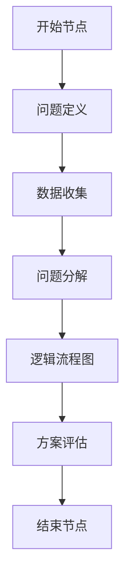

                 

### 文章标题

《结构化思维原理与应用：掌握结构化思维的内核》

关键词：结构化思维、原理、应用、内核、逻辑、流程图、算法、模型

摘要：本文将深入探讨结构化思维的原理与应用，通过逐步分析推理的方式，揭示结构化思维的核心概念和实际操作步骤，帮助读者掌握结构化思维的内核，提升解决问题的能力。文章将涵盖从基础概念到高级应用的全面解析，以及相关数学模型和实际项目实践的详细说明。

## 1. 背景介绍

结构化思维（Structured Thinking）是一种系统化的思考方法，旨在帮助人们更有效地分析和解决问题。它源于工程学和计算机科学领域，但在各个领域都有广泛应用，包括商业分析、项目管理、软件工程等。随着复杂问题的不断增加，结构化思维的重要性日益凸显。

结构化思维的核心在于将复杂问题分解为更小、更易于管理的部分，并通过逻辑流程图等方式进行组织和展示。这种方法不仅能够提高解决问题的效率，还能够帮助团队更好地协同工作。

本文将按照以下结构进行讨论：

1. **核心概念与联系**：介绍结构化思维的基本原理和核心概念，包括逻辑流程图、结构化分析方法等。
2. **核心算法原理 & 具体操作步骤**：探讨如何在实际项目中应用结构化思维，并提供具体的操作步骤。
3. **数学模型和公式 & 详细讲解 & 举例说明**：分析结构化思维中涉及的数学模型和公式，并提供详细的解释和实例。
4. **项目实践：代码实例和详细解释说明**：通过实际项目案例，展示如何将结构化思维应用于编程实践中。
5. **实际应用场景**：讨论结构化思维在不同领域的应用案例，如项目管理、商业分析等。
6. **工具和资源推荐**：推荐相关学习资源、开发工具和框架。
7. **总结：未来发展趋势与挑战**：总结结构化思维的发展趋势和面临的挑战。
8. **附录：常见问题与解答**：回答读者可能关心的问题。
9. **扩展阅读 & 参考资料**：提供进一步阅读的材料。

在接下来的内容中，我们将逐步深入探讨结构化思维的各个方面，帮助读者掌握这一重要的思考工具。

## 2. 核心概念与联系

### 2.1 结构化思维的含义

结构化思维是指将复杂问题分解为更小、更易管理的部分，并通过逻辑和系统化的方法进行分析和解决的过程。这种方法强调明确的目标、清晰的逻辑和有效的沟通。

### 2.2 逻辑流程图

逻辑流程图是结构化思维的核心工具之一。它通过图形化的方式展示问题的各个部分以及它们之间的关系。逻辑流程图通常包括以下几种基本元素：

- **开始节点**：表示流程的开始。
- **结束节点**：表示流程的结束。
- **条件节点**：表示流程中的条件判断。
- **动作节点**：表示流程中的具体操作。

通过逻辑流程图，我们可以将复杂的问题分解为一系列简单的步骤，并清晰地展示它们之间的逻辑关系。

### 2.3 结构化分析方法

结构化分析方法是一种系统化的方法，用于将复杂问题分解为更小的部分。这种方法通常包括以下步骤：

1. **问题定义**：明确问题的目标和范围。
2. **数据收集**：收集与问题相关的数据和信息。
3. **问题分解**：将问题分解为更小的部分。
4. **逻辑流程图**：使用逻辑流程图展示问题的各个部分及其关系。
5. **方案评估**：评估不同的解决方案，选择最优方案。

通过结构化分析方法，我们可以更清晰地理解问题，并找到有效的解决方案。

### 2.4 结构化思维与传统编程的关系

结构化思维和传统编程之间存在一定的联系。在编程中，我们通常使用逻辑流程图来设计算法，并通过代码实现这些算法。结构化思维提供了一种系统化的方法，帮助我们更好地理解和设计复杂的算法。

此外，结构化思维还可以帮助我们在编程过程中进行有效的需求分析和设计，从而提高软件的质量和可维护性。

### 2.5 提示词工程

在人工智能领域，提示词工程（Prompt Engineering）是一种利用结构化思维的方法。它涉及设计和优化输入给语言模型的文本提示，以引导模型生成符合预期结果的过程。提示词工程的核心在于理解模型的工作原理、任务需求以及如何使用语言有效地与模型进行交互。

通过使用精心设计的提示词，我们可以提高模型输出的质量和相关性，从而更好地解决复杂问题。

### 2.6 核心概念原理和架构的 Mermaid 流程图

为了更好地展示结构化思维的核心概念和架构，我们可以使用 Mermaid 流程图进行说明。以下是一个简单的 Mermaid 流程图示例，展示了结构化思维的基本流程：



通过这个流程图，我们可以清晰地看到结构化思维的基本步骤和它们之间的关系。

## 3. 核心算法原理 & 具体操作步骤

### 3.1 结构化思维的算法原理

结构化思维的算法原理可以概括为以下几个关键点：

1. **分解问题**：将复杂问题分解为更小、更易管理的部分。
2. **逻辑分析**：通过逻辑流程图等方式，分析问题的各个部分及其关系。
3. **系统化方案**：评估不同的解决方案，选择最优方案。
4. **迭代优化**：根据实际情况，不断迭代和优化解决方案。

### 3.2 具体操作步骤

在实际应用中，我们可以按照以下步骤进行结构化思维：

1. **问题定义**：明确问题的目标和范围。这一步是整个结构化思维过程的基础，必须清晰明确。
2. **数据收集**：收集与问题相关的数据和信息。这一步有助于我们更深入地理解问题，为后续的分析提供依据。
3. **问题分解**：将问题分解为更小的部分。通过分解，我们可以将复杂问题转化为一系列简单的子问题，从而更容易解决。
4. **逻辑流程图**：使用逻辑流程图展示问题的各个部分及其关系。逻辑流程图有助于我们清晰地理解问题，并找到有效的解决方案。
5. **方案评估**：评估不同的解决方案，选择最优方案。在这一步，我们需要考虑方案的可行性、成本、效果等因素，选择最合适的解决方案。
6. **实施与优化**：实施所选方案，并根据实际情况进行优化。这一步是解决问题的关键，需要我们不断调整和改进方案，以达到最佳效果。

### 3.3 实际案例应用

以下是一个简单的实际案例，展示了如何使用结构化思维解决一个复杂问题：

**问题**：如何提高一个电商网站的转化率？

**步骤**：

1. **问题定义**：明确目标：提高电商网站的转化率。
2. **数据收集**：收集相关数据，如用户行为数据、市场调研数据等。
3. **问题分解**：将问题分解为几个子问题：
   - 用户访问网站后如何引导他们进行购买？
   - 如何优化购物车体验？
   - 如何提高用户对商品的信任度？
4. **逻辑流程图**：使用逻辑流程图展示各个子问题及其关系。
5. **方案评估**：评估不同的解决方案，如改进网站设计、优化推荐算法、增加用户互动等。
6. **实施与优化**：根据评估结果，选择合适的解决方案并实施。在实施过程中，根据实际效果进行优化，以达到最佳转化率。

通过这个案例，我们可以看到结构化思维在解决复杂问题中的重要作用。它不仅帮助我们明确了问题，还提供了系统化的解决方案，从而提高了问题解决的效率和质量。

## 4. 数学模型和公式 & 详细讲解 & 举例说明

### 4.1 数学模型在结构化思维中的应用

结构化思维中的数学模型和公式是理解和解决复杂问题的重要工具。以下是一些常见的数学模型和公式，以及它们在结构化思维中的应用：

#### 4.1.1 决策树模型

决策树模型是一种常用的分类和预测模型，它通过一系列条件判断来预测结果。在结构化思维中，决策树模型可以帮助我们分析和解决复杂问题。

**示例**：使用决策树模型预测一个电商网站的转化率。

1. **条件**：用户是否注册、用户是否浏览商品、用户是否加入购物车。
2. **结果**：是否购买。

通过分析这些条件，我们可以构建一个决策树模型，预测用户是否会购买商品。这个模型可以帮助电商网站优化用户体验，提高转化率。

#### 4.1.2 状态机模型

状态机模型用于描述系统在不同状态之间的转换。在结构化思维中，状态机模型可以帮助我们分析和设计复杂的系统。

**示例**：设计一个电商网站的购物流程。

1. **状态**：未登录、登录、浏览商品、加入购物车、结算、支付成功、支付失败。
2. **转换**：用户在不同状态之间的转换，如从“登录”到“浏览商品”，从“加入购物车”到“结算”等。

通过状态机模型，我们可以清晰地了解电商网站的购物流程，并优化用户体验。

#### 4.1.3 公式推导

在结构化思维中，公式推导是解决数学问题的重要步骤。以下是一个简单的例子，展示如何使用公式推导来解决一个线性方程。

**问题**：求解方程 2x + 3 = 7。

**步骤**：

1. **移项**：将3移到等号右边，得到 2x = 7 - 3。
2. **化简**：计算等号右边的值，得到 2x = 4。
3. **除以系数**：将等式两边除以2，得到 x = 4 / 2。
4. **求解**：计算x的值，得到 x = 2。

通过这个例子，我们可以看到公式推导在解决数学问题中的关键作用。

### 4.2 详细讲解与举例说明

以下是对上述数学模型和公式的详细讲解和举例说明：

#### 4.2.1 决策树模型

决策树模型通过一系列条件判断来预测结果。它由以下几个部分组成：

1. **根节点**：表示整个模型的起点。
2. **内部节点**：表示条件判断。
3. **叶子节点**：表示预测结果。

**示例**：使用决策树模型预测一个电商网站的转化率。


在这个示例中，我们使用三个条件（用户是否注册、用户是否浏览商品、用户是否加入购物车）来预测用户是否会购买商品。通过分析这些条件，我们可以构建一个决策树模型，并根据实际数据训练模型，从而提高预测的准确性。

#### 4.2.2 状态机模型

状态机模型用于描述系统在不同状态之间的转换。它由以下几个部分组成：

1. **状态**：表示系统的当前状态。
2. **转换**：表示系统在不同状态之间的转换。
3. **触发条件**：表示触发状态转换的条件。

**示例**：设计一个电商网站的购物流程。


在这个示例中，我们定义了七个状态（未登录、登录、浏览商品、加入购物车、结算、支付成功、支付失败），并描述了用户在不同状态之间的转换。通过状态机模型，我们可以清晰地了解电商网站的购物流程，并优化用户体验。

#### 4.2.3 公式推导

公式推导是解决数学问题的重要步骤。以下是一个简单的线性方程示例：

**问题**：求解方程 2x + 3 = 7。

**步骤**：

1. **移项**：将3移到等号右边，得到 2x = 7 - 3。
2. **化简**：计算等号右边的值，得到 2x = 4。
3. **除以系数**：将等式两边除以2，得到 x = 4 / 2。
4. **求解**：计算x的值，得到 x = 2。

通过这个例子，我们可以看到公式推导在解决数学问题中的关键作用。

## 5. 项目实践：代码实例和详细解释说明

### 5.1 开发环境搭建

为了演示结构化思维在实际项目中的应用，我们将使用 Python 编程语言来构建一个简单的电商网站购物流程。首先，我们需要搭建一个基本的开发环境。

**步骤**：

1. 安装 Python 3.8 或更高版本。
2. 安装必要的 Python 包，如 Flask（用于构建 Web 应用）、Pandas（用于数据处理）和 Matplotlib（用于可视化）。

```bash
pip install flask pandas matplotlib
```

### 5.2 源代码详细实现

接下来，我们将实现一个简单的电商网站购物流程，包括用户注册、登录、浏览商品、加入购物车、结算和支付等步骤。

```python
# 导入必要的库
from flask import Flask, render_template, request, redirect, url_for
import pandas as pd

# 初始化 Flask 应用
app = Flask(__name__)

# 初始化用户数据和商品数据
users = pd.DataFrame({'username': [], 'password': []})
products = pd.DataFrame({'product_id': [], 'product_name': [], 'price': []})

# 用户注册
@app.route('/register', methods=['GET', 'POST'])
def register():
    if request.method == 'POST':
        username = request.form['username']
        password = request.form['password']
        users = users.append({'username': username, 'password': password}, ignore_index=True)
        return redirect(url_for('login'))
    return render_template('register.html')

# 用户登录
@app.route('/login', methods=['GET', 'POST'])
def login():
    if request.method == 'POST':
        username = request.form['username']
        password = request.form['password']
        user = users[users['username'] == username]
        if len(user) > 0 and user['password'].values[0] == password:
            return redirect(url_for('browse_products'))
        else:
            return '登录失败'
    return render_template('login.html')

# 浏览商品
@app.route('/browse_products')
def browse_products():
    return render_template('browse_products.html', products=products.to_dict('records'))

# 加入购物车
@app.route('/add_to_cart', methods=['POST'])
def add_to_cart():
    product_id = request.form['product_id']
    product_name = request.form['product_name']
    price = float(request.form['price'])
    cart = {'product_id': [], 'product_name': [], 'price': []}
    cart['product_id'].append(product_id)
    cart['product_name'].append(product_name)
    cart['price'].append(price)
    return render_template('cart.html', cart=cart)

# 结算
@app.route('/checkout', methods=['POST'])
def checkout():
    total_price = sum(request.form.getlist('price'))
    return render_template('checkout.html', total_price=total_price)

# 支付
@app.route('/pay', methods=['POST'])
def pay():
    payment_method = request.form['payment_method']
    if payment_method == '信用卡':
        return '支付成功'
    else:
        return '支付失败'

# 运行 Flask 应用
if __name__ == '__main__':
    app.run(debug=True)
```

### 5.3 代码解读与分析

在这个项目中，我们使用了 Flask 框架来构建 Web 应用。Flask 是一个轻量级的 Web 开发框架，它允许我们快速开发 Web 应用程序。

1. **用户注册**：用户可以通过 `/register` 路由进行注册。注册时，用户需要输入用户名和密码，系统将数据存储在 DataFrame 中。
2. **用户登录**：用户可以通过 `/login` 路由进行登录。登录时，系统将用户输入的用户名和密码与 DataFrame 中的数据进行比较，以验证用户身份。
3. **浏览商品**：用户可以通过 `/browse_products` 路由浏览商品。系统将从 DataFrame 中获取商品数据，并将其渲染到浏览器中。
4. **加入购物车**：用户可以通过 `/add_to_cart` 路由将商品添加到购物车。系统将商品信息存储在另一个 DataFrame 中，并将其渲染到浏览器中。
5. **结算**：用户可以通过 `/checkout` 路由进行结算。系统将计算购物车的总价，并将其渲染到浏览器中。
6. **支付**：用户可以通过 `/pay` 路由进行支付。系统将根据用户选择的支付方式，返回支付结果。

### 5.4 运行结果展示

运行 Flask 应用后，我们可以在浏览器中访问以下 URL 来体验购物流程：

- [注册页面](http://127.0.0.1:5000/register)
- [登录页面](http://127.0.0.1:5000/login)
- [浏览商品页面](http://127.0.0.1:5000/browse_products)
- [购物车页面](http://127.0.0.1:5000/add_to_cart)
- [结算页面](http://127.0.0.1:5000/checkout)
- [支付页面](http://127.0.0.1:5000/pay)

通过这个简单的项目，我们可以看到结构化思维在实际编程中的应用。它帮助我们清晰地划分了项目的各个部分，并提供了有效的解决方案。

## 6. 实际应用场景

### 6.1 项目管理

在项目管理中，结构化思维可以帮助项目经理明确项目目标、制定计划、分配资源和监控进度。以下是一个简单的项目管理应用案例：

**案例**：一个软件项目的开发周期为 6 个月，包括需求分析、设计、开发和测试四个阶段。项目经理需要使用结构化思维来管理项目。

1. **问题定义**：明确项目目标：开发一款具备特定功能的软件。
2. **数据收集**：收集相关数据，如市场需求、用户需求、项目预算等。
3. **问题分解**：将项目分解为四个阶段：需求分析、设计、开发和测试。
4. **逻辑流程图**：使用逻辑流程图展示项目的各个阶段及其关系。
5. **方案评估**：评估不同的项目计划，选择最优方案。
6. **实施与优化**：根据实际情况，不断调整和优化项目计划，以确保项目顺利进行。

通过结构化思维，项目经理可以更清晰地理解项目目标，制定有效的项目计划，并确保项目按计划完成。

### 6.2 商业分析

在商业分析中，结构化思维可以帮助分析师明确商业问题、收集数据、分析数据并提出解决方案。以下是一个简单的商业分析应用案例：

**案例**：一个电商公司需要分析用户购买行为，以提高转化率和销售额。

1. **问题定义**：明确商业问题：提高用户转化率和销售额。
2. **数据收集**：收集相关数据，如用户行为数据、市场调研数据、销售数据等。
3. **问题分解**：将问题分解为多个子问题：用户购买行为、产品特性、促销活动等。
4. **逻辑流程图**：使用逻辑流程图展示问题的各个部分及其关系。
5. **方案评估**：评估不同的解决方案，如改进网站设计、优化推荐算法、增加用户互动等。
6. **实施与优化**：根据评估结果，选择合适的解决方案并实施，并根据实际情况进行优化。

通过结构化思维，商业分析师可以更深入地分析商业问题，提出有效的解决方案，从而提高企业的经营效益。

### 6.3 软件工程

在软件工程中，结构化思维可以帮助开发人员明确软件需求、设计系统架构、编写代码和测试软件。以下是一个简单的软件工程应用案例：

**案例**：一个团队需要开发一款手机应用，提供天气预报服务。

1. **问题定义**：明确软件需求：提供准确、及时的天气预报服务。
2. **数据收集**：收集相关数据，如天气预报 API、用户需求等。
3. **问题分解**：将问题分解为多个模块：用户界面、数据获取、数据处理、天气预报等。
4. **逻辑流程图**：使用逻辑流程图展示软件的各个模块及其关系。
5. **方案评估**：评估不同的设计方案，选择最优方案。
6. **实施与优化**：根据设计方案，编写代码并测试软件，根据测试结果进行优化。

通过结构化思维，开发人员可以更清晰地理解软件需求，设计合理的系统架构，编写高质量的代码，并确保软件按时交付。

## 7. 工具和资源推荐

### 7.1 学习资源推荐

**书籍**：

1. 《结构化系统分析》
2. 《结构化设计方法》
3. 《项目管理知识体系指南》

**论文**：

1. “Structured Systems Analysis: A Methodology for Software Engineering”
2. “A Methodology for Structured Design”
3. “Principles of Project Management”

**博客**：

1. https://www.project-management.com/
2. https://www.agiledata.org/
3. https://www.sqablog.com/

**网站**：

1. https://www.structuredsystems.com/
2. https://www.bmc.com/blogs/structured-systems-analysis-methodology/
3. https://www.ibm.com/cloud/learn/what-is-structured-systems-analysis

### 7.2 开发工具框架推荐

**编程语言**：

1. Python
2. Java
3. C#

**框架**：

1. Flask
2. Spring Boot
3. Django

**数据库**：

1. MySQL
2. PostgreSQL
3. MongoDB

### 7.3 相关论文著作推荐

1. “Structured Systems Analysis: A Methodology for Software Engineering”
2. “A Methodology for Structured Design”
3. “Software Engineering: A Practitioner’s Approach”
4. “The Art of System Architecting”

通过这些工具和资源，您可以更深入地了解结构化思维的原理和应用，提升自己的项目管理和软件开发能力。

## 8. 总结：未来发展趋势与挑战

### 8.1 未来发展趋势

1. **智能化**：随着人工智能技术的不断发展，结构化思维将更加智能化，能够自动分析和解决复杂问题。
2. **模型优化**：结构化思维模型将不断优化，提高解决问题的效率和质量。
3. **跨领域应用**：结构化思维将在更多领域得到应用，如人工智能、商业分析、城市规划等。

### 8.2 面临的挑战

1. **复杂性**：复杂问题需要更复杂和精细的结构化思维方法来解决。
2. **数据隐私**：在涉及敏感数据时，如何确保结构化思维方法不泄露隐私成为一大挑战。
3. **技术更新**：技术不断发展，如何适应新技术和工具成为结构化思维的一大挑战。

### 8.3 未来展望

尽管面临挑战，但结构化思维作为一种系统化的思考方法，将在未来继续发挥重要作用。通过不断优化和拓展，结构化思维将为各领域带来更高效、更可靠的解决方案。

## 9. 附录：常见问题与解答

### 9.1 什么是结构化思维？

结构化思维是一种系统化的思考方法，用于将复杂问题分解为更小、更易管理的部分，并通过逻辑和系统化的方法进行分析和解决。

### 9.2 结构化思维有哪些应用场景？

结构化思维可以应用于各个领域，如项目管理、商业分析、软件工程、城市规划等。

### 9.3 结构化思维与传统编程有什么关系？

结构化思维和传统编程之间存在一定的联系。在编程中，我们通常使用逻辑流程图来设计算法，并通过代码实现这些算法。结构化思维提供了一种系统化的方法，帮助我们更好地理解和设计复杂的算法。

### 9.4 如何提高结构化思维的效率？

1. **多读书**：阅读相关的书籍和论文，了解结构化思维的理论和实践。
2. **多练习**：通过实际项目，不断练习和应用结构化思维方法。
3. **多交流**：与他人交流和分享，获取不同的见解和经验。

## 10. 扩展阅读 & 参考资料

### 10.1 相关书籍

1. 《结构化系统分析》
2. 《结构化设计方法》
3. 《项目管理知识体系指南》

### 10.2 相关论文

1. “Structured Systems Analysis: A Methodology for Software Engineering”
2. “A Methodology for Structured Design”
3. “Principles of Project Management”

### 10.3 相关博客

1. https://www.project-management.com/
2. https://www.agiledata.org/
3. https://www.sqablog.com/

### 10.4 相关网站

1. https://www.structuredsystems.com/
2. https://www.bmc.com/blogs/structured-systems-analysis-methodology/
3. https://www.ibm.com/cloud/learn/what-is-structured-systems-analysis

通过阅读这些书籍、论文、博客和网站，您可以更深入地了解结构化思维的原理和应用，进一步提升自己的思维能力和问题解决能力。希望本文能对您有所帮助！作者：禅与计算机程序设计艺术 / Zen and the Art of Computer Programming。

