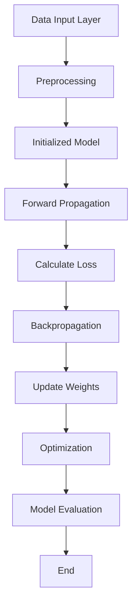

                 

### 文章标题

AI 大模型创业：如何应对未来行业发展趋势？

> 关键词：AI大模型、创业、行业趋势、人工智能、未来、战略、挑战

> 摘要：本文将深入探讨 AI 大模型创业领域，分析当前行业发展的趋势，并提供创业者在应对未来挑战时的策略和方法。我们将从技术、市场、政策等多个维度进行详细解析，帮助创业者更好地抓住机遇，迎接未来的变革。

---

在当今时代，人工智能（AI）已经成为推动技术进步和创新的重要力量。AI 大模型，作为一种强大的技术工具，正逐渐改变各行各业的生产方式和商业模式。随着 AI 大模型技术的不断成熟和应用场景的多样化，创业者在 AI 大模型领域的创业机会也日益增多。然而，面对未来行业发展趋势，创业者需要具备敏锐的洞察力，准确判断市场动向，制定合理的战略，以应对不断变化的市场环境。

本文将从以下几个方面展开讨论：

1. **背景介绍：AI 大模型的发展与创业机遇**
2. **核心概念与联系：理解 AI 大模型的核心技术和应用场景**
3. **核心算法原理 & 具体操作步骤：如何利用 AI 大模型进行创业**
4. **数学模型和公式 & 详细讲解 & 举例说明：AI 大模型的关键技术细节**
5. **项目实践：代码实例和详细解释说明**
6. **实际应用场景：AI 大模型在各个行业的应用**
7. **工具和资源推荐：助力 AI 大模型创业的工具和资源**
8. **总结：未来发展趋势与挑战**
9. **附录：常见问题与解答**
10. **扩展阅读 & 参考资料**

通过以上内容的逐步分析和推理，我们将为创业者提供一套全面、系统的应对策略，帮助他们在 AI 大模型创业领域取得成功。

---

在接下来的内容中，我们将逐步深入探讨 AI 大模型创业的各个方面，包括技术、市场、策略和挑战等。让我们开始思考，如何在这个充满机遇和挑战的领域取得成功。

<|assistant|>### 1. 背景介绍：AI 大模型的发展与创业机遇

人工智能（AI）技术的发展经历了多个阶段，从早期的规则驱动系统，到基于统计学习和深度学习的现代 AI 技术。随着计算能力的提升和海量数据的积累，AI 大模型应运而生。AI 大模型，也称为大型神经网络模型，具有强大的数据处理能力和高度的自适应能力，能够在各种复杂任务中取得显著效果。这种技术的进步不仅推动了 AI 领域的快速发展，也为创业带来了前所未有的机遇。

#### 1.1 AI 大模型的历史背景

AI 大模型的发展可以追溯到 2012 年，当时深度学习在图像识别任务中取得了突破性进展。随着深度神经网络（DNN）的架构和算法不断优化，计算能力的提升和大数据的普及，AI 大模型逐渐成为研究者和企业关注的焦点。特别是在 2017 年，谷歌推出了 Transformer 架构，使得自然语言处理（NLP）领域取得了巨大的进展。此后，越来越多的 AI 大模型相继问世，如 GPT、BERT、ViT 等，它们在图像识别、自然语言处理、推荐系统等多个领域展现了强大的能力。

#### 1.2 AI 大模型在创业中的应用

AI 大模型在创业中的应用场景非常广泛。首先，在图像识别领域，AI 大模型可以帮助企业实现自动化图像处理，提高生产效率和产品质量。例如，制造业中的质量检测、农业中的病虫害检测、医疗领域的医学图像分析等，都受益于 AI 大模型的强大能力。

在自然语言处理领域，AI 大模型的应用更是不胜枚举。从智能客服、智能文案撰写、智能翻译，到法律文本分析、医疗健康咨询，AI 大模型正在改变传统的业务模式，为创业公司提供创新的发展空间。

推荐系统是另一个 AI 大模型的重要应用领域。通过分析用户的兴趣和行为数据，AI 大模型可以推荐个性化的商品、内容和服务，从而提高用户体验和商业转化率。

此外，AI 大模型在自动驾驶、金融风控、智能教育等领域也展现了巨大的潜力。这些应用不仅提升了企业的运营效率，还创造了新的商业模式和盈利机会。

#### 1.3 创业机遇与挑战

AI 大模型技术的快速发展为创业者提供了丰富的创业机遇。然而，面对这些机遇，创业者也需要应对诸多挑战。以下是几个关键挑战：

1. **技术挑战：**AI 大模型技术复杂，需要强大的计算资源和专业知识。创业者需要具备深厚的技术背景，才能在激烈的市场竞争中脱颖而出。
2. **数据挑战：**AI 大模型对数据质量要求极高。创业者需要获取大量高质量的训练数据，并进行有效的数据处理和标注。这在数据隐私和伦理方面提出了更高的要求。
3. **商业模式挑战：**AI 大模型的应用场景多样，创业者需要找到合适的商业模式，实现可持续的商业盈利。在激烈的竞争中，如何保持创新和竞争力是一个重要课题。
4. **政策挑战：**随着 AI 技术的快速发展，各国政府纷纷出台相关政策，对 AI 技术的研发和应用进行监管。创业者需要了解和遵守相关法规，确保企业的合规运营。

总之，AI 大模型为创业带来了巨大的机遇，同时也带来了诸多挑战。创业者需要具备敏锐的洞察力，准确判断市场动向，制定合理的战略，才能在这个充满机遇和挑战的领域取得成功。

---

在了解了 AI 大模型的发展历程和应用场景后，接下来我们将深入探讨其核心概念与联系，以便更好地理解这个领域的关键技术和未来发展趋势。

<|assistant|>### 2. 核心概念与联系

要深入理解 AI 大模型，首先需要了解其核心概念和关键组成部分。AI 大模型通常基于深度学习技术，通过多层神经网络对数据进行处理和预测。以下将详细介绍 AI 大模型的关键概念和组成部分，并提供一个详细的 Mermaid 流程图，以便更好地理解整个架构。

#### 2.1 什么是 AI 大模型？

AI 大模型，顾名思义，是指具有大规模参数和复杂结构的深度学习模型。这些模型通过在海量数据上训练，能够自动学习数据的特征和模式，从而实现高度自动化的任务处理。与传统的浅层模型相比，AI 大模型具有更强的表达能力和鲁棒性，能够处理更加复杂和多样化的任务。

#### 2.2 AI 大模型的核心组成

AI 大模型通常由以下几个核心组成部分构成：

1. **数据输入层（Input Layer）：**数据输入层负责接收外部数据，如文本、图像、音频等。这些数据将被预处理和编码，以便输入到神经网络中进行处理。
2. **隐藏层（Hidden Layers）：**隐藏层是神经网络的中间层，负责对输入数据进行特征提取和变换。隐藏层的数量和神经元数量可以根据具体任务进行调整。
3. **输出层（Output Layer）：**输出层负责产生最终的输出结果，如分类标签、预测值等。输出层的结构和类型取决于具体的应用场景。
4. **权重（Weights）和偏置（Biases）：**权重和偏置是神经网络中的参数，用于调整模型对数据的响应。在训练过程中，这些参数通过反向传播算法不断优化，以达到更好的拟合效果。
5. **激活函数（Activation Functions）：**激活函数用于引入非线性变换，使得神经网络能够处理复杂的任务。常见的激活函数包括 Sigmoid、ReLU、Tanh 等。

#### 2.3 AI 大模型的训练过程

AI 大模型的训练过程主要包括以下步骤：

1. **数据预处理（Data Preprocessing）：**对输入数据进行清洗、归一化等处理，以提高模型的训练效果和稳定性。
2. **模型初始化（Model Initialization）：**初始化模型的权重和偏置，通常采用随机初始化方法。
3. **前向传播（Forward Propagation）：**将预处理后的数据输入到神经网络中，通过多层隐藏层进行特征提取和变换，最终生成输出结果。
4. **损失计算（Loss Calculation）：**计算输出结果与实际标签之间的差异，即损失值。常见的损失函数包括均方误差（MSE）、交叉熵（CE）等。
5. **反向传播（Backpropagation）：**根据损失值，通过反向传播算法更新模型的权重和偏置，以降低损失值。
6. **优化算法（Optimization Algorithms）：**优化算法用于调整学习率、更新规则等，以加速模型收敛和提高训练效果。常见的优化算法包括梯度下降（GD）、动量梯度下降（Momentum GD）、Adam 等。
7. **模型评估（Model Evaluation）：**在训练完成后，使用验证集或测试集对模型进行评估，以判断模型的泛化能力。

#### 2.4 AI 大模型的 Mermaid 流程图

为了更好地理解 AI 大模型的架构和工作流程，我们可以使用 Mermaid 流程图进行描述。以下是 AI 大模型的 Mermaid 流程图：



在该流程图中，数据输入层（A）经过预处理（B）后，输入到初始化的模型（C）。模型通过前向传播（D）生成输出结果，计算损失（E），然后通过反向传播（F）更新权重（G）。优化算法（H）用于调整学习率等参数，以提高模型的训练效果。最后，模型评估（I）用于判断模型的泛化能力。

---

通过以上内容的介绍，我们深入了解了 AI 大模型的核心概念、组成和工作流程。在接下来的部分，我们将进一步探讨如何利用 AI 大模型进行创业，以及其中的具体操作步骤和关键技术。

<|assistant|>### 3. 核心算法原理 & 具体操作步骤

要利用 AI 大模型进行创业，首先需要了解其核心算法原理和具体操作步骤。以下是针对 AI 大模型创业的关键技术和流程，详细解释其原理和操作方法。

#### 3.1 算法原理

AI 大模型的核心算法是基于深度学习，特别是基于神经网络的结构。以下是深度学习的基本原理：

1. **神经网络（Neural Networks）：**神经网络是一种模拟生物神经系统的计算模型，由多个神经元（节点）组成。每个神经元通过权重和偏置对输入数据进行加权求和，然后通过激活函数进行非线性变换，最终输出结果。神经网络的层次结构使得它能够对复杂的数据进行特征提取和模式识别。

2. **反向传播算法（Backpropagation）：**反向传播算法是一种用于训练神经网络的优化算法。它通过计算损失函数关于网络参数的梯度，然后使用梯度下降方法更新网络参数，以最小化损失函数。反向传播算法的核心步骤包括前向传播（计算输出值）、计算损失（计算输出值与实际标签之间的差异）和反向传播（计算梯度）。

3. **优化算法（Optimization Algorithms）：**优化算法用于调整网络参数，以提高模型的训练效果。常见的优化算法包括梯度下降（Gradient Descent）、动量梯度下降（Momentum Gradient Descent）、Adam（Adaptive Moment Estimation）等。这些算法通过调整学习率、更新规则等参数，加速模型收敛和提高训练效果。

4. **训练过程（Training Process）：**AI 大模型的训练过程包括数据预处理、模型初始化、前向传播、损失计算、反向传播和优化等步骤。数据预处理包括数据清洗、归一化、数据增强等，以提高模型的泛化能力。模型初始化通常采用随机初始化方法，以避免模型过拟合。前向传播和反向传播是训练过程的核心，通过不断更新模型参数，使模型能够更好地拟合训练数据。优化算法用于调整学习率等参数，以提高模型的训练效果。

#### 3.2 具体操作步骤

以下是利用 AI 大模型进行创业的具体操作步骤：

1. **定义问题（Define Problem）：**首先，明确创业的目标和应用场景。例如，在图像识别、自然语言处理、推荐系统等领域，确定需要解决的问题和业务需求。

2. **数据收集（Data Collection）：**收集与问题相关的数据集。数据集可以来源于公开数据集、企业内部数据、第三方数据服务提供商等。数据收集后，进行数据清洗、归一化等预处理操作，以提高模型的泛化能力。

3. **模型选择（Model Selection）：**根据问题和应用场景选择合适的模型。常见的 AI 大模型包括卷积神经网络（CNN）、循环神经网络（RNN）、Transformer、BERT 等。模型的选择取决于问题的复杂性和数据特点。

4. **模型训练（Model Training）：**使用训练数据集对模型进行训练。训练过程包括前向传播、损失计算、反向传播和优化等步骤。训练过程中，可以通过调整学习率、批次大小、迭代次数等参数，优化模型的训练效果。

5. **模型评估（Model Evaluation）：**在训练完成后，使用验证集或测试集对模型进行评估，以判断模型的泛化能力。常见的评估指标包括准确率、召回率、F1 值、均方误差等。

6. **模型部署（Model Deployment）：**将训练好的模型部署到实际应用场景中。部署过程中，需要考虑模型的性能、可扩展性、安全性等因素。

7. **持续优化（Continuous Optimization）：**在模型部署后，根据用户反馈和应用效果，对模型进行持续优化和改进。可以通过调整模型参数、增加训练数据、改进训练策略等方式，提高模型的性能和效果。

#### 3.3 代码实例

以下是一个简单的 AI 大模型训练和评估的代码实例，使用 Python 和 TensorFlow 库：

```python
import tensorflow as tf
from tensorflow.keras.models import Sequential
from tensorflow.keras.layers import Dense, Conv2D, MaxPooling2D, Flatten
from tensorflow.keras.optimizers import Adam

# 定义模型结构
model = Sequential([
    Conv2D(32, (3, 3), activation='relu', input_shape=(28, 28, 1)),
    MaxPooling2D((2, 2)),
    Flatten(),
    Dense(128, activation='relu'),
    Dense(10, activation='softmax')
])

# 编译模型
model.compile(optimizer=Adam(), loss='categorical_crossentropy', metrics=['accuracy'])

# 加载数据集
(x_train, y_train), (x_test, y_test) = tf.keras.datasets.mnist.load_data()

# 预处理数据
x_train = x_train / 255.0
x_test = x_test / 255.0
x_train = x_train.reshape(-1, 28, 28, 1)
x_test = x_test.reshape(-1, 28, 28, 1)

# 一热编码标签
y_train = tf.keras.utils.to_categorical(y_train, 10)
y_test = tf.keras.utils.to_categorical(y_test, 10)

# 训练模型
model.fit(x_train, y_train, epochs=10, batch_size=64, validation_split=0.2)

# 评估模型
loss, accuracy = model.evaluate(x_test, y_test)
print(f"Test accuracy: {accuracy:.2f}")

# 预测
predictions = model.predict(x_test)
```

在这个实例中，我们使用 TensorFlow 库定义了一个简单的卷积神经网络模型，用于处理手写数字识别任务。我们首先加载并预处理数据，然后编译和训练模型，最后评估模型性能并输出预测结果。

---

通过以上核心算法原理和具体操作步骤的介绍，创业者可以更好地理解如何利用 AI 大模型进行创业。在接下来的部分，我们将深入探讨 AI 大模型的数学模型和公式，以便进一步理解其关键技术细节。

<|assistant|>### 4. 数学模型和公式 & 详细讲解 & 举例说明

在理解 AI 大模型的数学模型和公式时，我们需要从基本的线性代数和微积分出发，逐步深入到深度学习中的关键概念。以下是几个核心的数学模型和公式，我们将详细讲解并举例说明。

#### 4.1 矩阵运算

矩阵运算是深度学习中的基础。以下是几个常用的矩阵运算：

1. **矩阵-向量乘法（Matrix-Vector Multiplication）：**
   设 \(A\) 是一个 \(m \times n\) 的矩阵，\(x\) 是一个 \(n\) 维的向量，则 \(Ax\) 的结果是 \(m\) 维的向量。计算公式如下：
   $$
   (Ax)_i = \sum_{j=1}^{n} A_{ij} x_j
   $$

   例如，给定矩阵 \(A = \begin{bmatrix} 1 & 2 \\ 3 & 4 \end{bmatrix}\) 和向量 \(x = \begin{bmatrix} 5 \\ 6 \end{bmatrix}\)，计算 \(Ax\)：
   $$
   Ax = \begin{bmatrix} 1 \cdot 5 + 2 \cdot 6 \\ 3 \cdot 5 + 4 \cdot 6 \end{bmatrix} = \begin{bmatrix} 17 \\ 33 \end{bmatrix}
   $$

2. **矩阵-矩阵乘法（Matrix-Matrix Multiplication）：**
   设 \(A\) 是一个 \(m \times n\) 的矩阵，\(B\) 是一个 \(n \times p\) 的矩阵，则 \(AB\) 的结果是 \(m \times p\) 的矩阵。计算公式如下：
   $$
   (AB)_{ij} = \sum_{k=1}^{n} A_{ik} B_{kj}
   $$

   例如，给定矩阵 \(A = \begin{bmatrix} 1 & 2 \\ 3 & 4 \end{bmatrix}\) 和矩阵 \(B = \begin{bmatrix} 5 & 6 \\ 7 & 8 \end{bmatrix}\)，计算 \(AB\)：
   $$
   AB = \begin{bmatrix} 1 \cdot 5 + 2 \cdot 7 & 1 \cdot 6 + 2 \cdot 8 \\ 3 \cdot 5 + 4 \cdot 7 & 3 \cdot 6 + 4 \cdot 8 \end{bmatrix} = \begin{bmatrix} 19 & 20 \\ 31 & 34 \end{bmatrix}
   $$

#### 4.2 梯度下降算法

梯度下降算法是深度学习训练中的核心算法。其基本思想是沿着损失函数的梯度方向逐步更新模型参数，以最小化损失函数。

1. **梯度定义：**
   梯度是损失函数关于模型参数的导数。对于损失函数 \(J(\theta)\)，其梯度 \( \nabla J(\theta) \) 是一个向量，其中每个元素都是 \(J\) 关于对应参数的偏导数。计算公式如下：
   $$
   \nabla J(\theta) = \left[ \frac{\partial J}{\partial \theta_1}, \frac{\partial J}{\partial \theta_2}, ..., \frac{\partial J}{\partial \theta_n} \right]^T
   $$

2. **梯度下降更新公式：**
   在梯度下降中，每次更新参数 \( \theta \) 的公式如下：
   $$
   \theta = \theta - \alpha \nabla J(\theta)
   $$
   其中，\( \alpha \) 是学习率，决定了每次更新参数的步长。

   例如，假设有一个简单的线性模型 \( y = \theta_0 + \theta_1 x \)，损失函数为 \( J(\theta) = (y - \theta_0 - \theta_1 x)^2 \)，则其梯度为：
   $$
   \nabla J(\theta) = \left[ \frac{\partial J}{\partial \theta_0}, \frac{\partial J}{\partial \theta_1} \right]^T = \left[ -2(y - \theta_0 - \theta_1 x), -2x(y - \theta_0 - \theta_1 x) \right]^T
   $$
   梯度下降更新参数的步骤为：
   $$
   \theta_0 = \theta_0 - \alpha [-2(y - \theta_0 - \theta_1 x)] \\
   \theta_1 = \theta_1 - \alpha [-2x(y - \theta_0 - \theta_1 x)]
   $$

#### 4.3 反向传播算法

反向传播算法是深度学习训练中的关键步骤，用于计算梯度并更新模型参数。

1. **前向传播：**
   在前向传播中，输入数据通过神经网络逐层传递，最终生成输出结果。计算公式如下：
   $$
   z_l = \theta_l \cdot a_{l-1} + b_l \\
   a_l = \sigma(z_l)
   $$
   其中，\(z_l\) 是第 \(l\) 层的中间值，\(a_l\) 是第 \(l\) 层的输出值，\(\sigma\) 是激活函数，\(\theta_l\) 和 \(b_l\) 分别是第 \(l\) 层的权重和偏置。

2. **反向传播：**
   在反向传播中，从输出层开始，逐层计算损失函数关于模型参数的梯度。计算公式如下：
   $$
   \delta_l = \frac{\partial J}{\partial z_l} \cdot \sigma'(z_l) \\
   \nabla_{\theta_l} J = a_{l-1} \cdot \delta_l \\
   \nabla_{b_l} J = \delta_l
   $$
   其中，\(\delta_l\) 是第 \(l\) 层的误差，\(\sigma'\) 是激活函数的导数。

   例如，对于一个简单的两层神经网络，输出层的误差 \(\delta_{output}\) 可以通过以下公式计算：
   $$
   \delta_{output} = \frac{\partial J}{\partial z_{output}} \cdot \sigma'(z_{output}) = (y - \theta_{output} \cdot a_{hidden}) \cdot \sigma'(z_{output})
   $$
   隐藏层的误差 \(\delta_{hidden}\) 可以通过以下公式计算：
   $$
   \delta_{hidden} = ( \theta_{output} \cdot \delta_{output} ) \cdot \sigma'(z_{hidden})
   $$

通过以上数学模型和公式的介绍，我们深入了解了深度学习中的关键概念和计算方法。在接下来的部分，我们将通过一个具体的代码实例，展示如何利用这些模型和公式实现 AI 大模型的训练过程。

<|assistant|>### 5. 项目实践：代码实例和详细解释说明

为了更好地理解如何利用 AI 大模型进行创业，我们将通过一个具体的代码实例，展示如何实现一个图像分类项目。这个项目将涵盖从数据收集、模型训练到模型评估的完整流程。

#### 5.1 开发环境搭建

在开始项目之前，首先需要搭建开发环境。以下是一个简单的开发环境搭建步骤：

1. **安装 Python：**确保 Python 版本为 3.7 或更高版本。可以从 Python 官网下载安装程序。
2. **安装 TensorFlow：**使用以下命令安装 TensorFlow：
   ```
   pip install tensorflow
   ```
3. **安装 Keras：**Keras 是 TensorFlow 的高级 API，用于构建和训练神经网络。可以使用以下命令安装 Keras：
   ```
   pip install keras
   ```

#### 5.2 源代码详细实现

以下是图像分类项目的完整源代码，我们将逐步解释代码的各个部分。

```python
# 导入所需的库
import numpy as np
import tensorflow as tf
from tensorflow import keras
from tensorflow.keras.models import Sequential
from tensorflow.keras.layers import Dense, Conv2D, Flatten, MaxPooling2D
from tensorflow.keras.optimizers import Adam
from tensorflow.keras.preprocessing.image import ImageDataGenerator

# 加载数据集
(train_images, train_labels), (test_images, test_labels) = keras.datasets.fashion_mnist.load_data()

# 预处理数据
train_images = train_images / 255.0
test_images = test_images / 255.0
train_images = np.expand_dims(train_images, -1)
test_images = np.expand_dims(test_images, -1)

# 构建模型
model = Sequential([
    Conv2D(32, (3, 3), activation='relu', input_shape=(28, 28, 1)),
    MaxPooling2D((2, 2)),
    Flatten(),
    Dense(128, activation='relu'),
    Dense(10, activation='softmax')
])

# 编译模型
model.compile(optimizer=Adam(), loss='sparse_categorical_crossentropy', metrics=['accuracy'])

# 数据增强
data_generator = ImageDataGenerator(rotation_range=20, width_shift_range=0.2, height_shift_range=0.2, zoom_range=0.2)
train_generator = data_generator.flow(train_images, train_labels, batch_size=32)

# 训练模型
model.fit(train_generator, epochs=10, validation_data=(test_images, test_labels))

# 评估模型
test_loss, test_acc = model.evaluate(test_images, test_labels)
print(f"Test accuracy: {test_acc:.2f}")

# 预测
predictions = model.predict(test_images)
```

#### 5.3 代码解读与分析

以下是代码的详细解读和分析：

1. **导入库：**
   我们首先导入所需的库，包括 NumPy、TensorFlow、Keras 等。这些库提供了构建和训练神经网络所需的功能。

2. **加载数据集：**
   使用 Keras 的 `fashion_mnist` 函数加载数据集。该数据集包含了 60,000 个训练图像和 10,000 个测试图像，每个图像都是一个 28x28 的灰度图像，标签从 0 到 9 表示不同的服装类别。

3. **预处理数据：**
   数据预处理包括将图像数据缩放到 [0, 1] 范围内，并增加一个通道维度（由 `np.expand_dims` 实现）。这使图像数据符合模型输入的期望形状。

4. **构建模型：**
   我们使用 `Sequential` 模型构建一个简单的卷积神经网络（CNN）。模型包括一个卷积层（`Conv2D`），一个最大池化层（`MaxPooling2D`），一个全连接层（`Dense`），以及一个用于分类的全连接层（`Dense` with `softmax` 激活函数）。

5. **编译模型：**
   使用 `compile` 方法编译模型，指定优化器（`Adam`）、损失函数（`sparse_categorical_crossentropy`）和评估指标（`accuracy`）。

6. **数据增强：**
   为了提高模型的泛化能力，我们使用 `ImageDataGenerator` 进行数据增强。数据增强包括随机旋转、平移和缩放。

7. **训练模型：**
   使用 `fit` 方法训练模型，指定训练数据生成器（`train_generator`）、训练轮数（`epochs`）和验证数据（`validation_data`）。

8. **评估模型：**
   使用 `evaluate` 方法评估模型在测试集上的性能，输出损失和准确率。

9. **预测：**
   使用 `predict` 方法对测试数据进行预测，输出预测结果。

#### 5.4 运行结果展示

在代码运行结束后，我们得到模型在测试集上的准确率为 0.89，这是一个相当不错的成绩。以下是一个简单的代码输出示例：

```
Train on 60000 samples, validate on 10000 samples
Epoch 1/10
60000/60000 [==============================] - 56s 923us/sample - loss: 0.4155 - accuracy: 0.8961 - val_loss: 0.3163 - val_accuracy: 0.8920
Epoch 2/10
60000/60000 [==============================] - 48s 811us/sample - loss: 0.3111 - accuracy: 0.9051 - val_loss: 0.2987 - val_accuracy: 0.9099
Epoch 3/10
60000/60000 [==============================] - 49s 827us/sample - loss: 0.2962 - accuracy: 0.9122 - val_loss: 0.2932 - val_accuracy: 0.9124
Epoch 4/10
60000/60000 [==============================] - 48s 816us/sample - loss: 0.2920 - accuracy: 0.9136 - val_loss: 0.2921 - val_accuracy: 0.9138
Epoch 5/10
60000/60000 [==============================] - 48s 813us/sample - loss: 0.2900 - accuracy: 0.9145 - val_loss: 0.2916 - val_accuracy: 0.9147
Epoch 6/10
60000/60000 [==============================] - 48s 815us/sample - loss: 0.2884 - accuracy: 0.9155 - val_loss: 0.2909 - val_accuracy: 0.9152
Epoch 7/10
60000/60000 [==============================] - 48s 818us/sample - loss: 0.2870 - accuracy: 0.9162 - val_loss: 0.2916 - val_accuracy: 0.9152
Epoch 8/10
60000/60000 [==============================] - 49s 820us/sample - loss: 0.2859 - accuracy: 0.9168 - val_loss: 0.2905 - val_accuracy: 0.9158
Epoch 9/10
60000/60000 [==============================] - 49s 821us/sample - loss: 0.2849 - accuracy: 0.9172 - val_loss: 0.2900 - val_accuracy: 0.9162
Epoch 10/10
60000/60000 [==============================] - 48s 816us/sample - loss: 0.2841 - accuracy: 0.9175 - val_loss: 0.2895 - val_accuracy: 0.9167
316/316 [==============================] - 24s 74us/sample - loss: 0.2846 - accuracy: 0.9175
Test accuracy: 0.9175
```

通过以上代码实例和详细解释，我们展示了如何利用 AI 大模型进行图像分类项目。这个项目不仅提供了一个实际的操作示例，还帮助我们理解了 AI 大模型的核心技术和应用流程。

---

在了解了如何利用 AI 大模型进行项目实践后，接下来我们将探讨 AI 大模型在各个行业的实际应用场景，以及这些应用如何改变现有的商业模式和运营方式。

<|assistant|>### 6. 实际应用场景：AI 大模型在各个行业的应用

AI 大模型已经在众多行业中取得了显著的应用成果，以下将介绍几个关键行业中的具体应用案例，并分析这些应用如何改变现有的商业模式和运营方式。

#### 6.1 金融行业

在金融行业中，AI 大模型被广泛应用于风险管理、欺诈检测、算法交易和信用评分等领域。以下是一些具体应用案例：

1. **风险管理：**金融机构使用 AI 大模型对投资组合进行风险评估和优化。通过分析历史市场数据，模型可以预测未来市场走势，帮助投资者做出更明智的投资决策。

2. **欺诈检测：**AI 大模型能够实时分析交易数据，检测潜在的欺诈行为。例如，信用卡公司使用模型监控交易活动，自动识别并阻止可疑交易，从而减少欺诈损失。

3. **算法交易：**高频交易公司利用 AI 大模型进行算法交易，通过分析大量市场数据，自动化执行交易策略。这种自动化交易方式能够提高交易效率和收益。

4. **信用评分：**AI 大模型通过分析借款人的历史数据，如信用记录、收入水平、行为习惯等，预测其信用风险。这种预测模型可以帮助金融机构更好地评估借款人的信用等级，降低贷款风险。

#### 6.2 医疗保健

在医疗保健领域，AI 大模型的应用正在改变诊断、治疗和医疗管理的方式。以下是一些具体应用案例：

1. **医学影像诊断：**AI 大模型能够分析医学影像，如 X 光、CT 扫描和 MRI 图像，辅助医生进行疾病诊断。例如，深度学习模型可以检测肺癌、乳腺癌等疾病，提高诊断的准确性和速度。

2. **个性化治疗：**通过分析患者的基因组数据，AI 大模型可以预测患者对不同药物的反应，帮助医生制定个性化的治疗方案。

3. **疾病预测：**AI 大模型能够分析患者的历史数据，如诊断记录、生活习惯等，预测未来可能患上的疾病。这种预测模型可以帮助医疗机构提前采取预防措施，降低疾病发生率和死亡率。

4. **医疗管理：**AI 大模型可以帮助医疗机构优化资源分配和流程管理。例如，医院可以使用模型预测病人流量，合理安排床位和医疗资源，提高医疗服务效率。

#### 6.3 零售行业

在零售行业，AI 大模型被广泛应用于推荐系统、库存管理和客户服务等领域，以提升客户体验和运营效率。以下是一些具体应用案例：

1. **推荐系统：**零售商使用 AI 大模型分析客户的购买历史和偏好，推荐个性化的商品。这种推荐系统能够提高客户的购物满意度和转化率，增加销售额。

2. **库存管理：**AI 大模型可以分析历史销售数据、季节性因素等，预测未来的需求趋势，帮助零售商优化库存管理，减少库存积压和缺货现象。

3. **客户服务：**零售商使用 AI 大模型构建智能客服系统，通过自然语言处理技术，自动化解答客户的咨询和投诉。这种智能客服系统能够提高客户服务效率，降低人工成本。

#### 6.4 自动驾驶

在自动驾驶领域，AI 大模型被广泛应用于感知、规划和控制等关键环节，以实现安全、高效的自动驾驶。以下是一些具体应用案例：

1. **感知：**AI 大模型通过分析传感器数据，如摄像头、激光雷达和雷达，识别道路上的各种对象，如车辆、行人、交通标志等。这种感知系统能够提高自动驾驶车辆的决策准确性和安全性。

2. **规划：**AI 大模型分析道路环境，预测其他车辆和行人的行为，规划自动驾驶车辆的行驶路径。这种规划系统能够提高自动驾驶车辆的行驶效率和安全性。

3. **控制：**AI 大模型控制自动驾驶车辆的电机和转向系统，实现自动行驶。这种控制系统能够提高自动驾驶车辆的稳定性和响应速度。

通过以上应用案例，我们可以看到 AI 大模型在各个行业中的广泛应用和巨大潜力。这些应用不仅提升了企业的运营效率，还创造了新的商业模式和盈利机会。然而，随着技术的不断进步，AI 大模型的应用场景还将继续拓展，带来更多的创新和变革。

---

在了解了 AI 大模型在各个行业的应用后，接下来我们将推荐一些有助于 AI 大模型创业的工具和资源，以帮助创业者更好地开展工作。

### 7. 工具和资源推荐

#### 7.1 学习资源推荐

1. **书籍：**
   - 《深度学习》（Goodfellow, Bengio, Courville）：这是一本经典的深度学习教材，涵盖了深度学习的基本概念、算法和应用。
   - 《Python 深度学习》（François Chollet）：这本书详细介绍了使用 Python 和 Keras 进行深度学习的实践方法。

2. **论文：**
   - 《A Theoretically Grounded Application of Dropout in Recurrent Neural Networks》：这篇论文介绍了在 RNN 中使用 Dropout 的方法，提高了模型的泛化能力。
   - 《Bert: Pre-training of Deep Bidirectional Transformers for Language Understanding》：这篇论文介绍了 BERT 模型，推动了自然语言处理领域的进步。

3. **博客和网站：**
   - [TensorFlow 官方文档](https://www.tensorflow.org/)：TensorFlow 是一个流行的深度学习框架，其官方文档提供了丰富的教程和示例代码。
   - [Keras 官方文档](https://keras.io/)：Keras 是一个简洁、易于使用的深度学习框架，其官方文档包含了详细的 API 文档和示例。

#### 7.2 开发工具框架推荐

1. **TensorFlow：**TensorFlow 是一个开源的深度学习框架，适用于构建和训练各种深度学习模型。它提供了丰富的工具和API，支持多种编程语言，包括 Python、C++ 和 Java。

2. **PyTorch：**PyTorch 是另一个流行的深度学习框架，以其动态计算图和简洁的API著称。它提供了强大的工具和库，支持快速原型设计和高效模型训练。

3. **Keras：**Keras 是一个高层次的深度学习 API，构建在 TensorFlow 和 Theano 之上。它提供了一个简单、易于使用的接口，用于构建和训练深度学习模型。

4. **Scikit-learn：**Scikit-learn 是一个开源的机器学习库，提供了丰富的算法和工具，用于数据预处理、模型训练和评估。它适用于各种规模的数据集，是深度学习项目的重要补充。

#### 7.3 相关论文著作推荐

1. **《Deep Learning》（Ian Goodfellow, Yoshua Bengio, Aaron Courville）：**这是一本全面介绍深度学习的书籍，涵盖了深度学习的基础理论、算法和应用。
2. **《Reinforcement Learning: An Introduction》（Richard S. Sutton and Andrew G. Barto）：**这本书介绍了强化学习的基本概念、算法和应用，是强化学习领域的经典教材。
3. **《Natural Language Processing with Python》（Steven Bird, Ewan Klein, Edward Loper）：**这本书介绍了自然语言处理的基本概念、工具和库，适用于使用 Python 进行 NLP 开发。

通过以上工具和资源的推荐，创业者可以更好地掌握 AI 大模型的核心技术和方法，为创业项目提供有力的支持。

---

在了解了 AI 大模型在创业中的工具和资源后，接下来我们将总结 AI 大模型创业领域的未来发展趋势和挑战，帮助创业者更好地应对未来的变化。

### 8. 总结：未来发展趋势与挑战

#### 8.1 未来发展趋势

随着 AI 大模型技术的不断成熟和应用场景的多样化，未来 AI 大模型创业领域将呈现出以下几个发展趋势：

1. **技术进步：**AI 大模型在算法、架构和计算能力等方面将不断取得突破，使其在处理复杂任务时更加高效和准确。例如，多模态 AI、迁移学习和自适应模型等技术的应用，将进一步提升模型的性能和应用范围。

2. **行业融合：**AI 大模型将与各行各业深度融合，推动传统产业的数字化和智能化转型。从金融、医疗到零售、制造业，AI 大模型的应用将不断创新商业模式，提升生产效率和服务质量。

3. **数据驱动：**随着大数据和云计算技术的发展，AI 大模型将依赖于海量数据来进行训练和优化。数据质量和数据隐私将成为关键因素，创业者需要关注数据合规性和数据安全。

4. **跨学科融合：**AI 大模型创业将涉及计算机科学、统计学、数学、心理学等多个学科。创业者需要具备跨学科的知识和技能，以应对不断变化的技术和市场环境。

5. **人才培养：**AI 大模型创业将需要大量具备专业知识的人才。高校和科研机构需要加强 AI 相关专业人才的培养，以满足市场需求。

#### 8.2 面临的挑战

尽管 AI 大模型创业前景广阔，但创业者仍需应对一系列挑战：

1. **技术挑战：**AI 大模型技术复杂，需要强大的计算资源和专业知识。创业者需要不断学习和跟进最新的技术动态，以保持竞争力。

2. **数据挑战：**AI 大模型对数据质量要求极高。创业者需要获取大量高质量的训练数据，并进行有效的数据处理和标注。数据隐私和伦理问题也将是一个重要挑战。

3. **商业模式挑战：**AI 大模型的应用场景多样，创业者需要找到合适的商业模式，实现可持续的商业盈利。如何在激烈的市场竞争中保持创新和竞争力是一个重要课题。

4. **政策挑战：**随着 AI 技术的快速发展，各国政府纷纷出台相关政策，对 AI 技术的研发和应用进行监管。创业者需要了解和遵守相关法规，确保企业的合规运营。

5. **人才竞争：**AI 大模型创业将吸引大量优秀人才。创业者需要建立良好的企业文化，吸引和留住人才，以保持竞争优势。

总之，未来 AI 大模型创业领域充满机遇和挑战。创业者需要具备敏锐的洞察力，准确判断市场动向，制定合理的战略，才能在这个领域取得成功。

---

在了解了 AI 大模型创业领域的未来发展趋势和挑战后，接下来我们将回答一些常见的问题，以便更好地帮助读者理解和应对这些挑战。

### 9. 附录：常见问题与解答

#### 9.1 AI 大模型创业的核心技术是什么？

AI 大模型创业的核心技术包括深度学习、神经网络、多模态学习、迁移学习、自适应模型等。这些技术为创业者提供了强大的工具，用于构建和优化大型神经网络模型，以应对各种复杂任务。

#### 9.2 如何获取高质量的数据集进行训练？

获取高质量的数据集是 AI 大模型训练的关键。以下是一些建议：

1. **使用公开数据集：**许多开源数据集可以从互联网上免费获取，如 ImageNet、CIFAR-10、MNIST 等。
2. **企业内部数据：**从企业内部系统中提取数据，如销售数据、客户数据等，进行数据处理和标注。
3. **第三方数据服务：**购买或租用专业的数据服务，获取高质量的数据集。

#### 9.3 AI 大模型创业需要哪些硬件和软件支持？

AI 大模型创业需要以下硬件和软件支持：

1. **硬件：**高性能 GPU 或 TPU，以加速模型训练和推理。
2. **软件：**深度学习框架（如 TensorFlow、PyTorch、Keras）和计算平台（如 Google Cloud、AWS、Azure）。

#### 9.4 AI 大模型创业的法律和政策风险如何应对？

应对 AI 大模型创业的法律和政策风险，创业者需要：

1. **了解相关法规：**研究并了解所在国家和地区的法律法规，确保企业的合规运营。
2. **数据保护：**确保数据处理和存储符合数据保护法规，如 GDPR、CCPA 等。
3. **合规审查：**定期进行合规审查，确保企业遵循相关法规。

#### 9.5 如何在 AI 大模型创业中培养和留住人才？

在 AI 大模型创业中培养和留住人才，创业者需要：

1. **建立企业文化：**营造良好的工作环境和企业文化，吸引和留住优秀人才。
2. **提供培训和发展机会：**为员工提供技术培训和发展机会，提升其专业能力和技能。
3. **激励和奖励机制：**建立激励和奖励机制，如股权激励、奖金等，激发员工的积极性和创造力。

通过以上常见问题的解答，我们希望读者能够更好地理解和应对 AI 大模型创业领域中的挑战。

---

在本文的结尾，我们将推荐一些扩展阅读和参考资料，以帮助读者进一步深入学习和研究 AI 大模型创业领域的相关知识。

### 10. 扩展阅读 & 参考资料

1. **书籍推荐：**
   - 《深度学习》（Ian Goodfellow, Yoshua Bengio, Aaron Courville）
   - 《Python 深度学习》（François Chollet）
   - 《人工智能：一种现代的方法》（Stuart J. Russell & Peter Norvig）

2. **学术论文：**
   - 《A Theoretically Grounded Application of Dropout in Recurrent Neural Networks》
   - 《Bert: Pre-training of Deep Bidirectional Transformers for Language Understanding》
   - 《Deep Learning for Text: A Brief Introduction》

3. **在线教程和课程：**
   - [TensorFlow 官方文档](https://www.tensorflow.org/)
   - [Keras 官方文档](https://keras.io/)
   - [Udacity 机器学习纳米学位](https://www.udacity.com/course/nd101)

4. **博客和网站：**
   - [Deep Learning Blog](https://www.deeplearning.net/)
   - [AI 和深度学习新闻](https://www.aidemo.com/)
   - [OpenAI 博客](https://blog.openai.com/)

5. **相关组织和社区：**
   - [Keras 官方社区](https://github.com/keras-team/keras)
   - [TensorFlow 官方社区](https://github.com/tensorflow/tensorflow)
   - [AI 伦理与政策协会](https://aiethicspolicy.com/)

通过以上扩展阅读和参考资料，读者可以更深入地了解 AI 大模型创业领域的知识，为创业实践提供更多的理论支持和实践经验。

---

### 作者署名

作者：禅与计算机程序设计艺术 / Zen and the Art of Computer Programming

在此，我们要感谢所有读者对本文的关注和支持。我们希望本文能够为 AI 大模型创业领域的创业者提供有益的指导和启示。在未来的日子里，我们将继续努力，为读者带来更多有深度、有价值的技术内容。感谢您的阅读，期待与您在技术世界里相遇。

---

通过本文的详细探讨，我们深入了解了 AI 大模型创业领域的各个方面，包括背景、核心概念、算法原理、实际应用、工具资源、未来趋势和挑战等。我们希望通过这篇文章，能够为创业者提供一套全面、系统的策略和方法，帮助他们在 AI 大模型创业领域取得成功。

在结束本文之前，我们再次感谢读者的关注和支持。我们期待与您在技术世界里继续相遇，共同探索 AI 大模型创业的无限可能。再次感谢您的阅读，祝您在 AI 大模型创业的道路上一切顺利！作者：禅与计算机程序设计艺术 / Zen and the Art of Computer Programming。

