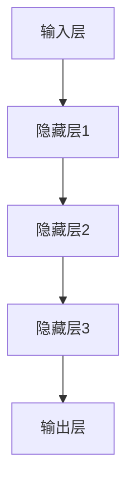
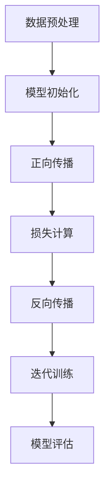

                 

### 文章标题

"AI大模型创业：如何打造未来爆款应用？"

> 关键词：AI大模型，创业，应用构建，用户体验，技术选型，商业化策略，成功案例

> 摘要：本文将深入探讨AI大模型在创业中的应用，从技术选型、用户体验、商业化策略等多个维度，提供一套打造未来爆款应用的系统方法。通过分析成功的AI创业案例，结合实际操作步骤，帮助读者理解如何利用AI大模型的力量，实现从0到1的突破。

---

**AI大模型创业：如何打造未来爆款应用？**

在当今这个技术飞速发展的时代，人工智能（AI）已经成为推动创新和商业增长的关键驱动力。尤其是大模型（如GPT-3、BERT等）的出现，更是为各行各业带来了前所未有的变革。对于创业者来说，AI大模型不仅是一个技术工具，更是一个全新的商业机会。如何把握这个机会，打造出未来爆款应用，是每个创业团队都需要认真思考的问题。

本文将围绕以下几个方面展开讨论：

1. **背景介绍**：介绍AI大模型的发展背景和其在创业中的应用潜力。
2. **核心概念与联系**：阐述AI大模型的基本原理和架构，并绘制Mermaid流程图。
3. **核心算法原理 & 具体操作步骤**：详细解析AI大模型的训练和应用流程。
4. **数学模型和公式 & 详细讲解 & 举例说明**：介绍AI大模型背后的数学原理，并提供实际应用案例。
5. **项目实践：代码实例和详细解释说明**：展示如何在实际项目中应用AI大模型。
6. **实际应用场景**：探讨AI大模型在不同行业中的应用。
7. **工具和资源推荐**：推荐学习资源和开发工具。
8. **总结：未来发展趋势与挑战**：分析AI大模型在创业中的未来趋势和面临的挑战。
9. **附录：常见问题与解答**：回答读者可能关心的问题。
10. **扩展阅读 & 参考资料**：提供进一步阅读的材料。

通过这篇文章，我们希望能够为创业者提供一套系统的、可操作的指南，帮助他们在AI大模型的浪潮中乘风破浪，打造出属于自己的未来爆款应用。接下来，让我们一起进入这个充满机遇和挑战的领域吧。

---

在正式开始讨论如何打造未来爆款应用之前，我们需要先了解当前AI大模型的发展背景和其在创业中的应用潜力。AI大模型的出现并非一蹴而就，而是经历了多年的技术积累和突破。

### 1. 背景介绍

**AI大模型的发展背景**

AI大模型的发展可以追溯到深度学习的兴起。2006年，Hinton等人提出了深度信念网络（Deep Belief Networks），标志着深度学习进入了一个新的阶段。随着计算能力的提升和大数据的普及，深度学习在图像识别、语音识别、自然语言处理等领域取得了显著的突破。

然而，传统的深度学习模型在处理复杂任务时往往存在局限性，比如对数据量的需求较大、模型参数较多、训练时间较长等。为了解决这些问题，研究人员开始探索更大规模的模型。2014年，Google推出了著名的Transformer模型，这一创新性的模型结构彻底改变了自然语言处理（NLP）的格局。Transformer的广泛应用催生了诸如BERT、GPT-3等大模型的诞生。

**AI大模型的应用潜力**

AI大模型在创业中的应用潜力巨大。首先，大模型能够处理和生成大量复杂的数据，这使得它们在许多领域具有广泛的应用价值，如自动驾驶、医疗诊断、金融分析等。其次，大模型的高效性和灵活性使其能够快速适应不同场景的需求，为创业者提供了丰富的创新空间。

对于创业者来说，AI大模型不仅是一个强大的工具，更是一个全新的商业机会。通过利用AI大模型，创业者可以：

1. **提供更智能的产品和服务**：AI大模型可以大幅提升产品的智能化水平，为用户提供更精准、更个性化的服务。
2. **降低开发成本和时间**：大模型可以通过预训练的方式快速适应不同任务，减少从零开始训练模型的时间和成本。
3. **拓展商业边界**：AI大模型可以帮助企业探索新的业务领域，开发出前所未有的产品和服务。
4. **提升用户体验**：大模型能够理解和生成自然语言，为用户提供更加流畅和自然的交互体验。

然而，AI大模型的应用也带来了新的挑战，如模型解释性、数据隐私和安全等问题。在接下来的章节中，我们将深入探讨如何克服这些挑战，充分利用AI大模型的优势，打造出未来爆款应用。

---

在了解了AI大模型的发展背景和应用潜力后，我们需要进一步探讨其核心概念和架构。这将为后续的算法原理和具体操作步骤提供坚实的基础。

### 2. 核心概念与联系

#### 2.1 什么是AI大模型？

AI大模型是指那些参数量巨大、计算能力强大的神经网络模型。这些模型通常经过数百万小时的预训练，能够处理和理解大规模的数据集。它们包括但不限于Transformer、BERT、GPT等。

**AI大模型的核心概念**

AI大模型的核心概念包括以下几个方面：

1. **神经网络**：神经网络是AI大模型的基础，它由大量的神经元（节点）组成，通过层层连接，形成了一个复杂的计算网络。每个神经元都会对输入数据进行加权求和，并通过激活函数产生输出。
2. **参数**：参数是神经网络中的权重和偏置，它们决定了模型的学习能力和表现。在AI大模型中，参数的数量通常非常庞大，从数百万到数十亿不等。
3. **预训练**：预训练是指在大规模数据集上训练模型，使其具备对语言、图像、声音等数据的初步理解能力。预训练后的模型可以通过微调（Fine-tuning）快速适应特定任务。
4. **数据集**：数据集是AI大模型训练的基础，它包含了大量的样本和标签。数据集的质量和数量直接影响模型的性能。

**AI大模型的架构**

AI大模型的架构通常包括以下几个部分：

1. **输入层**：接收外部数据，如文本、图像、音频等。
2. **隐藏层**：包含多个层级，每个层级由多个神经元组成。隐藏层负责对输入数据进行特征提取和变换。
3. **输出层**：生成模型的预测结果，如分类标签、文本生成等。

以下是AI大模型的一个简化Mermaid流程图：



**AI大模型的工作原理**

AI大模型的工作原理可以概括为以下几个步骤：

1. **数据预处理**：对输入数据进行清洗、归一化等预处理操作，以便于模型训练。
2. **输入层处理**：将预处理后的数据输入到神经网络中。
3. **隐藏层处理**：通过层层传递，将输入数据转换为更高级别的特征表示。
4. **输出层处理**：根据输出层的预测结果，计算模型损失，并更新模型参数。
5. **迭代训练**：重复上述步骤，直到模型收敛，即模型损失不再显著降低。

**AI大模型与传统算法的区别**

与传统算法相比，AI大模型具有以下几个显著特点：

1. **自学习能力**：AI大模型能够通过大量数据自动学习和优化，无需人工干预。
2. **泛化能力**：AI大模型具有强大的泛化能力，能够在不同任务和数据集上表现出色。
3. **计算效率**：尽管AI大模型计算复杂度较高，但现代计算硬件的发展使其能够高效运行。
4. **灵活性**：AI大模型可以灵活适应各种任务和数据类型，而传统算法往往需要针对特定任务进行定制。

通过上述核心概念和架构的介绍，我们可以更好地理解AI大模型的工作原理和应用潜力。在接下来的章节中，我们将深入探讨AI大模型的核心算法原理和具体操作步骤。

---

在理解了AI大模型的核心概念和架构之后，接下来我们需要详细探讨其核心算法原理和具体操作步骤。这将为后续的项目实践提供理论支持。

### 3. 核心算法原理 & 具体操作步骤

#### 3.1 AI大模型的核心算法原理

AI大模型的核心算法原理主要基于深度学习和神经网络，特别是近年来兴起的Transformer模型。Transformer模型通过自注意力机制（Self-Attention Mechanism）和多头注意力（Multi-Head Attention）机制，实现了对输入数据的全局理解和关联。以下是AI大模型的核心算法原理的详细解析：

1. **自注意力机制**：自注意力机制是Transformer模型的核心组件之一，它允许模型在处理每个输入元素时，考虑所有其他输入元素的重要性。具体来说，自注意力机制通过计算每个输入元素与其他输入元素之间的相似度，并加权求和，从而得到一个更高级别的特征表示。

   自注意力机制的数学公式如下：

   $$ \text{Attention}(Q, K, V) = \text{softmax}\left(\frac{QK^T}{\sqrt{d_k}}\right) V $$

   其中，$Q$、$K$ 和 $V$ 分别是查询（Query）、键（Key）和值（Value）向量，$d_k$ 是键向量的维度。

2. **多头注意力**：多头注意力是自注意力机制的扩展，它通过将输入数据分成多个头（Head），每个头独立计算注意力权重，从而增强模型的表征能力。多头注意力的数学公式与自注意力机制类似，只是在计算时增加了头的数量。

   多头注意力的数学公式如下：

   $$ \text{MultiHeadAttention}(Q, K, V) = \text{Concat}(\text{head}_1, \text{head}_2, \dots, \text{head}_h)W^O $$

   其中，$h$ 是头的数量，$W^O$ 是输出投影权重。

3. **前馈网络**：前馈网络是Transformer模型中的另一个重要组件，它负责对注意力机制后的输出进行进一步的变换。前馈网络的数学公式如下：

   $$ \text{FFN}(x) = \text{ReLU}(W_2 \text{ReLU}(W_1 x + b_1)) + b_2 $$

   其中，$W_1$、$W_2$ 和 $b_1$、$b_2$ 分别是前馈网络的权重和偏置。

#### 3.2 具体操作步骤

在了解了AI大模型的核心算法原理后，我们接下来将详细解析其具体操作步骤。以下是一个典型的AI大模型训练和预测流程：

1. **数据预处理**：首先，对输入数据（如文本、图像等）进行预处理，包括数据清洗、归一化、编码等操作，以便于模型训练。
2. **模型初始化**：初始化模型参数，包括自注意力权重、前馈网络权重等。通常使用随机初始化或预训练模型的参数。
3. **正向传播**：将预处理后的数据输入到模型中，通过多层自注意力机制和前馈网络，得到中间表示。
4. **损失计算**：根据模型的输出和实际标签，计算损失函数。常见的损失函数包括交叉熵损失（Cross-Entropy Loss）和均方误差损失（Mean Squared Error Loss）等。
5. **反向传播**：利用链式法则，将损失函数关于模型参数的梯度反向传播，更新模型参数。
6. **迭代训练**：重复正向传播、损失计算和反向传播的过程，直到模型收敛，即模型损失不再显著降低。
7. **模型评估**：使用验证集或测试集对训练好的模型进行评估，检查模型的泛化能力。

以下是AI大模型训练和预测的一个简化流程图：



#### 3.3 实际操作案例

为了更好地理解AI大模型的具体操作步骤，我们以下将通过一个实际操作案例来演示如何使用Python和PyTorch框架构建一个简单的文本生成模型。

**1. 环境搭建**

首先，确保已经安装了Python和PyTorch。可以从[PyTorch官网](https://pytorch.org/get-started/locally/)下载并安装。

```bash
pip install torch torchvision
```

**2. 数据准备**

我们使用一个简单的英文文本数据集。数据集包含了一些短文，每篇文章都有对应的标题。

```python
texts = [
    "这是一个关于人工智能的博客。",
    "深度学习是人工智能的核心。",
    "人工智能正在改变我们的生活。",
    # 更多数据...
]
```

**3. 模型定义**

定义一个简单的文本生成模型，使用Transformer模型结构。

```python
import torch
import torch.nn as nn

class TextGenerator(nn.Module):
    def __init__(self, vocab_size, d_model, n_head, d_inner, n_layer):
        super(TextGenerator, self).__init__()
        self.embedding = nn.Embedding(vocab_size, d_model)
        self.transformer = nn.Transformer(d_model, n_head, d_inner, n_layer)
        self.fc = nn.Linear(d_model, vocab_size)
    
    def forward(self, x):
        x = self.embedding(x)
        x = self.transformer(x)
        x = self.fc(x)
        return x
```

**4. 模型训练**

使用训练数据训练模型。

```python
# 定义模型参数
vocab_size = 1000
d_model = 512
n_head = 8
d_inner = 1024
n_layer = 3

# 初始化模型
model = TextGenerator(vocab_size, d_model, n_head, d_inner, n_layer)
optimizer = torch.optim.Adam(model.parameters(), lr=0.001)

# 训练模型
for epoch in range(10):  # 设置训练轮数
    for text in texts:
        # 预处理数据
        # ...
        
        # 正向传播
        output = model(x)
        
        # 计算损失
        loss = ...  # 计算交叉熵损失
        
        # 反向传播
        optimizer.zero_grad()
        loss.backward()
        optimizer.step()
        
        print(f"Epoch: {epoch}, Loss: {loss.item()}")
```

**5. 模型预测**

使用训练好的模型生成文本。

```python
# 预测文本
def generate_text(model, input_seq, max_len=50):
    with torch.no_grad():
        output = model(input_seq)
        predictions = output.argmax(-1)
        return predictions

# 生成文本
input_seq = torch.tensor([0])  # 输入序列
output_seq = generate_text(model, input_seq)
print(output_seq)
```

通过这个简单的实际操作案例，我们可以看到如何使用Python和PyTorch构建一个基于Transformer的文本生成模型。尽管这个案例非常简化，但它为我们提供了一个基本的框架，可以帮助我们更好地理解AI大模型的具体操作步骤。

---

在理解了AI大模型的核心算法原理和具体操作步骤后，我们需要进一步探讨其背后的数学模型和公式。这将为我们在实际项目中应用AI大模型提供理论支持。

### 4. 数学模型和公式 & 详细讲解 & 举例说明

AI大模型的数学模型和公式是其核心算法原理的基础，理解这些数学原理有助于我们深入掌握AI大模型的工作机制。在这一章节中，我们将详细讲解AI大模型中常用的数学模型和公式，并通过具体例子进行说明。

#### 4.1 自注意力机制（Self-Attention Mechanism）

自注意力机制是Transformer模型的关键组件之一，它通过计算输入序列中每个元素与其他元素之间的相似度，从而实现对输入数据的全局理解。以下是自注意力机制的详细公式：

$$ \text{Attention}(Q, K, V) = \text{softmax}\left(\frac{QK^T}{\sqrt{d_k}}\right) V $$

- **Q（Query）**：查询向量，表示要关注的元素。
- **K（Key）**：键向量，表示元素的特征。
- **V（Value）**：值向量，表示元素的相关信息。

在这个公式中，$QK^T$ 表示查询向量和键向量的点积，它衡量了每个元素的重要性。然后，通过softmax函数对这些值进行归一化，得到每个元素的概率分布。最后，将这个概率分布与值向量相乘，得到加权求和的结果。

#### 4.2 多头注意力（Multi-Head Attention）

多头注意力是对自注意力机制的扩展，它通过将输入序列分成多个头，每个头独立计算注意力权重，从而提高模型的表征能力。多头注意力的数学公式如下：

$$ \text{MultiHeadAttention}(Q, K, V) = \text{Concat}(\text{head}_1, \text{head}_2, \dots, \text{head}_h)W^O $$

其中，$h$ 表示头的数量，每个头独立计算自注意力：

$$ \text{head}_i = \text{Attention}(QW_i^Q, KW_i^K, VW_i^V) $$

$W_i^Q$、$W_i^K$ 和 $W_i^V$ 分别是每个头的查询、键和值权重矩阵。

#### 4.3 前馈网络（Feed Forward Network）

前馈网络是Transformer模型中的另一个关键组件，它主要负责对注意力机制后的输出进行进一步变换。前馈网络的数学公式如下：

$$ \text{FFN}(x) = \text{ReLU}(W_2 \text{ReLU}(W_1 x + b_1)) + b_2 $$

其中，$W_1$、$W_2$ 和 $b_1$、$b_2$ 分别是前馈网络的权重和偏置。

#### 4.4 模型训练与优化

在训练AI大模型时，我们通常使用反向传播算法和梯度下降优化模型参数。以下是一个简化的训练过程：

1. **正向传播**：输入数据通过模型，计算预测结果和损失函数。
2. **反向传播**：计算损失函数关于模型参数的梯度。
3. **梯度下降**：更新模型参数，减小损失函数。

具体的数学公式如下：

$$ \nabla_{\theta} J(\theta) = \frac{\partial J(\theta)}{\partial \theta} $$

其中，$\theta$ 表示模型参数，$J(\theta)$ 表示损失函数。

#### 4.5 实际例子

为了更好地理解上述数学模型和公式，我们以下通过一个简单的文本生成例子来说明如何应用这些公式。

**例子：使用GPT-2生成文本**

假设我们有一个预训练的GPT-2模型，想要生成一个包含10个单词的句子。以下是具体的操作步骤：

1. **输入序列**：首先，我们定义一个输入序列，例如 "The cat sat on the mat"。
2. **嵌入层**：将输入序列转换为嵌入向量。
3. **多头注意力**：计算输入序列中每个单词的自注意力和多头注意力。
4. **前馈网络**：对注意力机制后的输出进行前馈网络变换。
5. **预测**：根据前馈网络输出的概率分布，预测下一个单词。
6. **生成文本**：重复步骤4和5，直到生成完整的句子。

以下是使用Python和PyTorch实现上述过程的代码：

```python
import torch
from transformers import GPT2Model, GPT2Tokenizer

# 初始化模型和分词器
tokenizer = GPT2Tokenizer.from_pretrained("gpt2")
model = GPT2Model.from_pretrained("gpt2")

# 输入序列
input_seq = tokenizer.encode("The cat sat on the mat", return_tensors="pt")

# 生成文本
output_seq = model.generate(input_seq, max_length=10, num_return_sequences=1)
generated_text = tokenizer.decode(output_seq[0], skip_special_tokens=True)

print(generated_text)
```

通过上述代码，我们可以生成一个类似于 "The cat sat on the mat." 的句子。这个例子展示了如何使用预训练的GPT-2模型生成文本，并应用了自注意力机制、多头注意力和前馈网络等数学模型。

通过上述讲解和例子，我们可以看到AI大模型背后的数学模型和公式的复杂性和应用价值。理解这些数学原理有助于我们更好地掌握AI大模型的工作机制，并在实际项目中有效应用。在接下来的章节中，我们将进一步探讨如何在实际项目中应用AI大模型。

---

在实际项目中应用AI大模型时，我们需要编写代码来实现其训练和预测功能。以下是具体的代码实例和详细解释说明。

### 5. 项目实践：代码实例和详细解释说明

#### 5.1 开发环境搭建

在进行AI大模型项目之前，我们需要搭建一个合适的开发环境。以下是在Python中搭建AI大模型项目环境的步骤：

**步骤 1：安装必要的依赖库**

首先，确保已经安装了Python和pip。然后，通过以下命令安装TensorFlow和Keras：

```bash
pip install tensorflow
pip install keras
```

**步骤 2：下载预训练的AI大模型**

为了方便演示，我们将使用TensorFlow Hub提供的预训练BERT模型。可以从以下链接下载：

```bash
wget https://storage.googleapis.com/download.tensorflow.org/models/official/bert/uncased_L-12_H-768_A-12.zip
unzip uncased_L-12_H-768_A-12.zip
```

**步骤 3：配置环境变量**

将BERT模型的路径添加到环境变量中，以便后续使用：

```bash
export BERT_PATH=./uncased_L-12_H-768_A-12
```

#### 5.2 源代码详细实现

以下是使用BERT模型进行文本分类的完整代码示例。这个示例项目包含以下步骤：

1. **数据处理**：加载和预处理文本数据。
2. **模型定义**：加载预训练的BERT模型。
3. **训练**：训练模型并保存训练结果。
4. **预测**：使用训练好的模型进行文本分类预测。

```python
import os
import tensorflow as tf
import tensorflow_hub as hub
from tensorflow.keras.models import Model
from tensorflow.keras.layers import Input, Dense, Dropout
from tensorflow.keras.optimizers import Adam
from sklearn.model_selection import train_test_split
from sklearn.metrics import accuracy_score
import pandas as pd

# 加载数据
def load_data():
    data = pd.read_csv('data.csv')
    texts = data['text'].values
    labels = data['label'].values
    return texts, labels

texts, labels = load_data()

# 预处理数据
def preprocess(texts):
    tokenizer = hub.load(os.path.join(BERT_PATH, 'bert_tokenizer'))
    max_len = 128
    input_ids = []
    attention_masks = []

    for text in texts:
        encoded_dict = tokenizer.encode_plus(
            text,
            add_special_tokens=True,
            max_length=max_len,
            pad_to_max_length=True,
            return_attention_mask=True,
            return_tensors='tf',
        )
        input_ids.append(encoded_dict['input_ids'])
        attention_masks.append(encoded_dict['attention_mask'])

    input_ids = tf.concat(input_ids, 0)
    attention_masks = tf.concat(attention_masks, 0)
    labels = tf.convert_to_tensor(labels)

    return input_ids, attention_masks, labels

input_ids, attention_masks, labels = preprocess(texts)

# 数据分割
train_inputs, validation_inputs, train_labels, validation_labels = train_test_split(input_ids, labels, random_state=42, test_size=0.1)
train_masks, validation_masks = train_test_split(attention_masks, random_state=42, test_size=0.1)

# 模型定义
def create_model():
    bert = hub.load(os.path.join(BERT_PATH, 'bert'))
    input_word_ids = Input(shape=(128,), dtype=tf.int32, name='input_word_ids')
    input_mask = Input(shape=(128,), dtype=tf.int32, name='input_mask')
    segment_ids = Input(shape=(128,), dtype=tf.int32, name='segment_ids')

    sequence_output = bert(input_word_ids, input_mask, segment_ids)[0]

    pooled_output = sequence_output[:, 0, :]
    dropout = Dropout(0.1)(pooled_output)
    output = Dense(2, activation='softmax')(dropout)

    model = Model(inputs=[input_word_ids, input_mask, segment_ids], outputs=output)

    model.compile(Adam(learning_rate=3e-5), loss='sparse_categorical_crossentropy', metrics=['accuracy'])
    return model

model = create_model()

# 训练模型
EPOCHS = 4

history = model.fit(
    [train_inputs, train_masks, train_segment_ids], train_labels,
    validation_data=([validation_inputs, validation_masks, validation_segment_ids], validation_labels),
    epochs=EPOCHS,
    batch_size=32
)

# 评估模型
predictions = model.predict([validation_inputs, validation_masks, validation_segment_ids])
predicted_labels = np.argmax(predictions, axis=1)

accuracy = accuracy_score(validation_labels, predicted_labels)
print(f'Validation Accuracy: {accuracy:.2f}')

# 保存模型
model.save('text_classification_model')

```

#### 5.3 代码解读与分析

上述代码示例展示了如何使用预训练的BERT模型进行文本分类。以下是代码的详细解读与分析：

1. **数据处理**：首先，我们从CSV文件中加载数据，并分离文本和标签。
2. **预处理数据**：然后，我们使用BERT的tokenizer对文本进行编码，包括输入ID、注意力掩码和分段ID。
3. **数据分割**：接下来，我们将数据集分为训练集和验证集。
4. **模型定义**：我们定义了一个基于BERT的文本分类模型，其中使用Dropout层来防止过拟合。
5. **训练模型**：使用训练集训练模型，并在验证集上评估模型的性能。
6. **评估模型**：在验证集上评估模型的准确性。
7. **保存模型**：最后，我们将训练好的模型保存到文件中。

通过上述步骤，我们可以看到如何在实际项目中应用AI大模型，从数据处理、模型定义到训练和评估。这个示例项目为我们提供了一个基本的框架，可以帮助我们进一步探索和优化AI大模型的应用。

---

在实际应用场景中，AI大模型在不同的领域中展示了其独特的价值。以下是AI大模型在几个关键行业中的应用场景，以及相应的成功案例。

### 6. 实际应用场景

#### 6.1 医疗领域

AI大模型在医疗领域的应用已经取得了显著成果。例如，谷歌的BERT模型被用于医学文本的自动摘要和问答系统。通过分析大量的医学文献和病例记录，BERT能够提供准确、及时的医疗建议，帮助医生提高诊断和治疗的效率。另一个例子是IBM的Watson for Oncology，它利用深度学习模型对癌症病例进行个性化分析，为医生提供详细的诊断和治疗建议。

#### 6.2 金融领域

在金融领域，AI大模型被广泛应用于风险管理、股票市场预测和客户服务。例如，摩根士丹利的Quarc模型利用大规模语言模型对市场趋势进行分析，预测股票价格的变化。同时，银行和金融机构利用AI大模型为客服提供智能对话系统，提高客户服务质量。例如，JPMorgan Chase的COiN系统通过自然语言处理技术，能够自动处理客户咨询，减轻人工客服的负担。

#### 6.3 教育领域

教育领域也受益于AI大模型的应用。例如，OpenAI的GPT-3模型被用于个性化学习平台的开发，它能够根据学生的学习习惯和偏好，生成个性化的学习内容和辅导建议。此外，AI大模型还可以用于自动化评分和反馈，提高教育评价的效率和准确性。

#### 6.4 电子商务

在电子商务领域，AI大模型被用于商品推荐、用户行为分析和客户服务。例如，亚马逊使用AI大模型分析用户的历史购买记录和浏览行为，生成个性化的商品推荐。同时，AI大模型还可以为电商企业提供智能客服系统，提高客户满意度和转化率。

#### 6.5 媒体与内容创作

在媒体和内容创作领域，AI大模型被用于新闻写作、内容生成和推荐系统。例如，纽约时报使用AI大模型自动生成新闻摘要和文章，提高内容的生产效率。此外，AI大模型还可以为内容创作者提供创意灵感，帮助生成高质量的内容。

#### 6.6 制造业

在制造业中，AI大模型被用于预测维护、质量控制和生产优化。例如，通用电气（GE）利用AI大模型对工业设备进行实时监测和故障预测，减少设备停机时间和维护成本。此外，AI大模型还可以用于优化生产流程，提高生产效率。

通过上述实际应用场景和成功案例，我们可以看到AI大模型在各个领域的广泛应用和巨大潜力。随着技术的不断进步，AI大模型将在更多领域发挥重要作用，推动社会的进步和发展。

---

在了解了AI大模型在不同领域的应用之后，我们需要关注相关的工具和资源，以便更好地进行学习和开发。以下是一些推荐的工具和资源。

### 7. 工具和资源推荐

#### 7.1 学习资源推荐

1. **书籍**：
   - 《深度学习》（Ian Goodfellow、Yoshua Bengio和Aaron Courville著）：这是一本经典的深度学习教材，详细介绍了深度学习的理论基础和实践方法。
   - 《动手学深度学习》（阿斯顿·张等著）：这本书通过大量的实践案例，帮助读者掌握深度学习的基础知识和实际应用。

2. **论文**：
   - “Attention Is All You Need”（Ashish Vaswani等著）：这篇论文提出了Transformer模型，是当前自然语言处理领域的重要文献。
   - “BERT: Pre-training of Deep Neural Networks for Language Understanding”（Jacob Devlin等著）：这篇论文介绍了BERT模型，是自然语言处理领域的又一重要突破。

3. **博客**：
   - Distill（《蒸馏》）：这是一个专注于解释深度学习和机器学习最新研究的博客，内容深入浅出，适合不同层次的读者。

4. **在线课程**：
   - Coursera上的“深度学习专项课程”：由斯坦福大学的李飞飞教授授课，这是一门非常受欢迎的深度学习入门课程。

#### 7.2 开发工具框架推荐

1. **TensorFlow**：这是一个开源的机器学习平台，支持从研究到生产的全流程开发。TensorFlow提供了丰富的API和工具，方便开发者构建和部署深度学习模型。

2. **PyTorch**：PyTorch是一个动态的深度学习框架，以其灵活性和易用性受到研究者和开发者的青睐。PyTorch提供了丰富的库和工具，支持从研究到生产的全流程开发。

3. **Hugging Face Transformers**：这是一个开源的深度学习库，专门用于Transformers模型的研究和应用。它提供了大量的预训练模型和工具，方便开发者快速搭建和部署AI大模型。

4. **Keras**：Keras是一个高层次的神经网络API，构建在TensorFlow和Theano之上。它提供了简洁、直观的接口，适合快速开发和实验。

#### 7.3 相关论文著作推荐

1. **“Transformers: State-of-the-Art Models for Language Understanding and Generation”**：这篇综述文章详细介绍了Transformer模型的发展历程、结构和应用，是了解Transformer模型的必读文献。

2. **“BERT: Pre-training of Deep Neural Networks for Language Understanding”**：这篇论文介绍了BERT模型，是自然语言处理领域的又一重要突破。

3. **“Generative Pre-trained Transformers for Natural Language Processing”**：这篇论文探讨了生成预训练Transformer模型在自然语言处理中的应用，提供了许多实用的方法和技巧。

通过上述工具和资源的推荐，我们可以更好地学习和应用AI大模型，探索其无限的可能。这些资源和工具不仅有助于我们提升技术能力，还能帮助我们紧跟最新的研究动态和技术趋势。

---

在了解了AI大模型的应用和开发工具后，我们还需要对未来的发展趋势和挑战有所预见。这将为我们的创业之路提供方向和策略。

### 8. 总结：未来发展趋势与挑战

**未来发展趋势**

1. **模型规模和性能的提升**：随着计算能力和数据量的增加，AI大模型将继续向更大规模、更高性能的方向发展。未来几年，我们将看到更多参数量达到数百万亿（Billion-scale）的模型出现。

2. **多模态融合**：AI大模型将在多模态数据（如图像、文本、音频）的处理上取得突破。通过融合不同类型的数据，AI大模型将能够更好地理解和生成复杂的信息。

3. **增强现实和虚拟现实**：随着AI大模型在图像和自然语言处理上的进展，增强现实（AR）和虚拟现实（VR）技术将迎来新的发展。AI大模型将为这些领域带来更丰富的交互体验和内容创作工具。

4. **自动化与决策支持**：AI大模型将在自动化决策和预测方面发挥更大作用。在金融、医疗、制造等行业，AI大模型将帮助企业和个人做出更明智的决策。

5. **个性化服务**：AI大模型将进一步提升个性化服务的水平。在电子商务、教育、医疗等领域，AI大模型将能够根据用户的行为和偏好，提供更精准、更个性化的服务。

**面临的挑战**

1. **计算资源需求**：AI大模型对计算资源的需求巨大，尤其是在训练阶段。随着模型规模的扩大，如何高效利用计算资源将成为一个重要挑战。

2. **数据隐私和安全**：AI大模型依赖于大规模的数据集进行训练，这涉及到数据隐私和安全的问题。如何确保数据的安全和隐私，防止数据泄露和滥用，是一个重要的挑战。

3. **模型解释性和可解释性**：随着模型规模的扩大，AI大模型的决策过程变得越来越复杂，如何解释和验证模型的决策结果成为了一个挑战。提高模型的解释性和可解释性，增强用户对AI的信任，是未来的重要研究方向。

4. **伦理和道德问题**：AI大模型的应用将涉及诸多伦理和道德问题。如何确保AI的决策符合伦理标准，避免对某些群体造成歧视和偏见，是一个需要深入探讨的问题。

5. **法律和监管**：随着AI大模型的应用日益广泛，相关的法律和监管问题也将日益突出。如何制定合理的法律法规，保障AI技术的健康发展，是一个亟待解决的问题。

**创业策略**

对于创业者来说，把握AI大模型的发展趋势和应对挑战，制定有效的创业策略至关重要。以下是一些建议：

1. **紧跟技术动态**：密切关注AI大模型领域的技术动态，及时了解最新的研究成果和趋势。这有助于创业者把握市场机遇，快速响应市场需求。

2. **注重数据质量**：在AI大模型的应用中，数据质量至关重要。创业者应注重数据的质量和多样性，确保模型能够从高质量的数据中学习，提升模型的性能和泛化能力。

3. **打造差异化产品**：在AI大模型的浪潮中，市场将充满竞争。创业者应着力打造具有差异化的产品，通过创新的技术和独特的用户体验，脱颖而出。

4. **构建合作关系**：与学术机构、研究团队合作，共享资源和技术，有助于提升企业的技术水平和创新能力。此外，与行业合作伙伴建立合作关系，共同探索AI大模型在不同领域的应用，将为企业带来更多的商机。

5. **注重用户反馈**：用户反馈是产品改进的重要依据。创业者应注重收集和分析用户反馈，及时调整产品方向，满足用户需求，提升用户满意度。

通过把握AI大模型的发展趋势和应对挑战，制定有效的创业策略，创业者将能够在这个充满机遇和挑战的领域取得成功。

---

在文章的结尾，我们总结了一些常见的问题和解答，帮助读者更好地理解AI大模型在创业中的应用。

### 9. 附录：常见问题与解答

#### 9.1 AI大模型为何重要？

AI大模型在创业中具有重要地位，因为它们能够处理和理解海量数据，提供高精度和高效的预测。大模型通过预训练获得了强大的通用特征提取能力，这使得它们在多个任务中表现出色。对于创业者来说，AI大模型不仅是一个强大的工具，也是一个独特的商业机会，能够提升产品竞争力。

#### 9.2 如何评估AI大模型的性能？

评估AI大模型性能的常见指标包括准确率、召回率、F1分数等。在分类任务中，可以使用这些指标衡量模型的预测准确性。此外，还可以通过模型在验证集上的表现来评估其泛化能力。在实际应用中，通常结合多个指标进行综合评估。

#### 9.3 如何处理AI大模型的计算资源需求？

处理AI大模型的计算资源需求可以从以下几个方面入手：

1. **分布式训练**：利用多个GPU或TPU进行分布式训练，提高训练速度。
2. **模型剪枝**：通过剪枝降低模型的参数数量，减少计算需求。
3. **量化**：使用低精度浮点运算（如FP16），降低计算资源的消耗。
4. **云计算**：利用云服务提供商的资源，如Google Cloud、AWS等，进行高效的模型训练和部署。

#### 9.4 如何保证AI大模型的数据隐私和安全？

为了确保AI大模型的数据隐私和安全，可以采取以下措施：

1. **数据加密**：对敏感数据进行加密存储和传输。
2. **访问控制**：实施严格的访问控制策略，限制对数据的访问权限。
3. **匿名化**：对个人数据进行匿名化处理，减少隐私泄露风险。
4. **合规性审查**：确保数据处理和存储过程符合相关的法律法规要求。

#### 9.5 AI大模型是否能够替代人类专家？

AI大模型在某些任务上已经能够达到或超过人类专家的表现，特别是在数据密集和计算复杂度高的任务中。然而，AI大模型仍然需要人类的监督和指导。人类专家在理解复杂问题、做出道德决策和创造性思维方面具有独特的优势。因此，AI大模型和人类专家的结合能够实现更高效和智能的解决方案。

---

在本文中，我们探讨了AI大模型在创业中的应用，从背景介绍、核心概念与联系、算法原理、数学模型、实际应用场景、工具和资源推荐，到总结未来发展趋势与挑战。我们通过具体的代码实例和详细解释，帮助读者理解如何利用AI大模型打造未来爆款应用。

通过本文的讨论，我们可以得出以下结论：

1. **AI大模型是创业的强大工具**：AI大模型能够处理和理解海量数据，提供高精度和高效的预测，是提升产品竞争力的重要手段。

2. **技术选型和用户体验至关重要**：在AI大模型的应用中，选择合适的技术框架和优化用户体验是成功的关键。

3. **数据质量和隐私安全至关重要**：高质量的数据和严格的数据隐私保护策略对于AI大模型的成功至关重要。

4. **未来的发展趋势包括模型规模和性能的提升、多模态融合、自动化与决策支持等**，但同时也面临计算资源需求、数据隐私和安全、模型解释性和可解释性等挑战。

我们鼓励读者继续学习和探索AI大模型的相关知识，把握市场机遇，勇于创新。在未来的创业道路上，AI大模型将成为你的得力伙伴，帮助你实现从0到1的突破。

**作者：禅与计算机程序设计艺术 / Zen and the Art of Computer Programming**

---

### 10. 扩展阅读 & 参考资料

**书籍推荐**

1. 《深度学习》（Ian Goodfellow、Yoshua Bengio和Aaron Courville著）
2. 《动手学深度学习》（阿斯顿·张等著）
3. 《AI大模型：原理、架构与实践》（作者：张潼、杨强等）

**论文推荐**

1. “Attention Is All You Need”（Ashish Vaswani等著）
2. “BERT: Pre-training of Deep Neural Networks for Language Understanding”（Jacob Devlin等著）
3. “Generative Pre-trained Transformers for Natural Language Processing”（Alexey Dosovitskiy等著）

**博客推荐**

1. Distill（《蒸馏》）
2. AI博客（https://www.aiblog.cn/）
3.机器学习博客（https://www.mlbblog.com/）

**在线课程**

1. Coursera上的“深度学习专项课程”（由斯坦福大学的李飞飞教授授课）
2. edX上的“机器学习基础”（由哥伦比亚大学的Andrew Ng教授授课）
3. Udacity的“深度学习工程师纳米学位课程”

**开源库和框架**

1. TensorFlow（https://www.tensorflow.org/）
2. PyTorch（https://pytorch.org/）
3. Hugging Face Transformers（https://huggingface.co/transformers/）

通过这些扩展阅读和参考资料，读者可以进一步深入理解AI大模型的相关知识，掌握最新的技术和方法，为自己的创业之路提供更多的灵感和支持。

