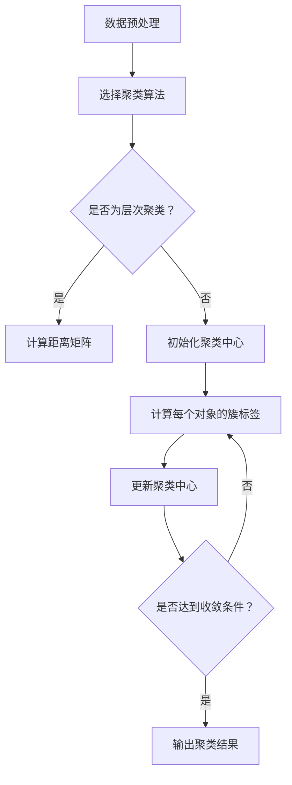
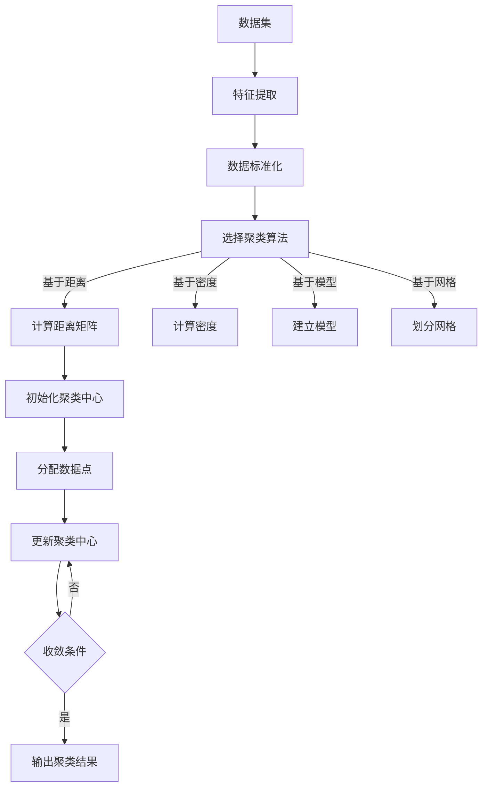

                 

# 文章标题

《聚类分析原理与代码实例讲解》

## 关键词

聚类分析、数据挖掘、算法实现、实例讲解

## 摘要

本文将深入讲解聚类分析的基本原理、常用算法，并通过具体代码实例展示如何在实际项目中应用这些算法。文章结构分为以下几个部分：背景介绍、核心概念与联系、核心算法原理与具体操作步骤、数学模型和公式讲解、项目实践：代码实例和详细解释说明、实际应用场景、工具和资源推荐、总结：未来发展趋势与挑战、附录：常见问题与解答、扩展阅读与参考资料。

### 背景介绍（Background Introduction）

聚类分析（Clustering Analysis）是数据挖掘（Data Mining）领域中的一种重要方法，它旨在将数据集中的对象根据其特征划分为若干个类别（Cluster），使同一类别内的对象尽可能相似，而不同类别内的对象尽可能不同。聚类分析在很多领域都有广泛的应用，如市场细分、客户分类、生物信息学等。

在市场细分中，企业可以通过聚类分析识别出具有相似特征的不同客户群体，从而制定更有针对性的营销策略；在生物信息学中，聚类分析可以帮助研究人员发现基因表达模式，从而揭示生物体的生物学特征；在图像处理中，聚类分析可以用于图像分割，从而提取出图像中的主要特征区域。

聚类分析的基本任务是将一组数据对象根据某种相似性度量划分为多个聚类，使得属于同一聚类的对象之间的相似度较高，而不同聚类的对象之间的相似度较低。常见的聚类算法包括K均值（K-Means）、层次聚类（Hierarchical Clustering）、DBSCAN（Density-Based Spatial Clustering of Applications with Noise）等。

本文将重点介绍K均值聚类算法，并使用Python编程语言实现该算法。我们将详细讲解算法原理、数学模型和公式，并通过具体实例展示如何在实际项目中应用该算法。

### 核心概念与联系（Core Concepts and Connections）

#### 聚类分析的基本概念

在聚类分析中，我们首先需要了解以下几个基本概念：

- **对象（Object）**：数据集中的每个元素称为一个对象，每个对象都有若干个特征（Feature）。
- **特征（Feature）**：描述对象属性的量或指标。
- **数据集（Dataset）**：包含多个对象的集合。
- **聚类（Cluster）**：数据集中的一组对象，这些对象在某种相似性度量下具有较高的相似度。
- **相似性度量（Similarity Measure）**：用于衡量对象之间相似度的指标，常见的有欧氏距离、曼哈顿距离、余弦相似度等。

#### 聚类分析的应用场景

聚类分析在不同领域有着广泛的应用，以下列举了几个典型的应用场景：

- **市场细分（Market Segmentation）**：企业通过对客户数据进行分析，识别出具有相似特征的客户群体，从而制定更有针对性的营销策略。
- **图像处理（Image Processing）**：聚类分析可以用于图像分割，从而提取出图像中的主要特征区域。
- **生物信息学（Bioinformatics）**：聚类分析可以帮助研究人员发现基因表达模式，从而揭示生物体的生物学特征。
- **社交网络分析（Social Network Analysis）**：聚类分析可以用于识别社交网络中的紧密联系群体。

#### 聚类分析的挑战

聚类分析在实际应用中面临着一些挑战，主要包括：

- **聚类数目选择（Number of Clusters）**：确定合适的聚类数目是聚类分析的一个关键问题。常见的方法包括肘部法则（Elbow Method）、轮廓系数（Silhouette Coefficient）等。
- **噪声和异常值处理（Noise and Outliers）**：噪声和异常值可能会对聚类结果产生较大影响，需要采取适当的方法进行预处理。
- **聚类算法选择（Algorithm Selection）**：不同的聚类算法适用于不同的数据类型和场景，需要根据具体问题选择合适的算法。

#### Mermaid 流程图

以下是一个简单的Mermaid流程图，展示了聚类分析的基本流程：



### 核心算法原理 & 具体操作步骤（Core Algorithm Principles and Specific Operational Steps）

在本节中，我们将详细介绍K均值聚类算法的基本原理和具体操作步骤。K均值聚类算法是一种基于距离的聚类方法，其目标是找到K个聚类中心，使得每个对象与其最近的聚类中心的距离最小。

#### 算法原理

1. **初始化聚类中心**：首先，从数据集中随机选择K个对象作为初始聚类中心。
2. **分配对象到聚类**：对于每个对象，计算其与各个聚类中心的距离，并将其分配到距离最近的聚类中心。
3. **更新聚类中心**：重新计算每个聚类的中心，即该聚类中所有对象的均值。
4. **迭代计算**：重复步骤2和步骤3，直到满足收敛条件，如聚类中心的变化小于某个阈值或达到预设的迭代次数。

#### 具体操作步骤

1. **数据预处理**：确保数据集中的每个对象都具有相同的特征维度。如果数据集存在缺失值，需要先进行填充或删除。
2. **初始化聚类中心**：从数据集中随机选择K个对象作为初始聚类中心。在实际应用中，可以选择使用K-means++算法来初始化聚类中心，以提高聚类质量。
3. **计算距离**：对于每个对象，计算其与各个聚类中心的距离。常用的距离度量方法包括欧氏距离、曼哈顿距离和余弦相似度等。
4. **分配对象到聚类**：将每个对象分配到距离其最近的聚类中心。
5. **更新聚类中心**：计算每个聚类中心的新位置，即该聚类中所有对象的均值。
6. **迭代计算**：重复步骤4和步骤5，直到满足收敛条件。

#### Python实现

以下是一个简单的Python实现示例，展示了如何使用K均值聚类算法进行数据聚类：

```python
from sklearn.cluster import KMeans
import numpy as np

# 加载数据
data = np.array([[1, 2], [1, 4], [1, 0],
                  [10, 2], [10, 4], [10, 0]])

# 初始化聚类中心
kmeans = KMeans(n_clusters=2, random_state=0).fit(data)

# 输出聚类结果
print("聚类结果：", kmeans.labels_)

# 输出聚类中心
print("聚类中心：", kmeans.cluster_centers_)
```

#### 算法分析

- **时间复杂度**：K均值聚类算法的时间复杂度为O(n * k * d)，其中n为数据集大小，k为聚类数目，d为特征维度。
- **空间复杂度**：K均值聚类算法的空间复杂度为O(n * k * d)，即需要存储k个聚类中心，每个聚类中心包含d个特征值。

### 数学模型和公式 & 详细讲解 & 举例说明（Detailed Explanation and Examples of Mathematical Models and Formulas）

在本节中，我们将介绍K均值聚类算法的数学模型和公式，并通过具体实例进行详细讲解。

#### 数学模型

K均值聚类算法的目标是最小化聚类中心与对象之间的距离平方和。其数学模型可以表示为：

$$
\min \sum_{i=1}^{n} \sum_{j=1}^{k} (x_i - \mu_j)^2
$$

其中，$x_i$ 表示数据集中的第i个对象，$\mu_j$ 表示聚类中心，$n$ 和 $k$ 分别表示数据集大小和聚类数目。

#### 公式解释

1. **聚类中心更新公式**：

$$
\mu_j = \frac{1}{N_j} \sum_{i=1}^{N} x_i
$$

其中，$N_j$ 表示第j个聚类中心所在聚类中的对象数目。

2. **对象分配公式**：

$$
c_i = \arg\min_{j} (x_i - \mu_j)^2
$$

其中，$c_i$ 表示对象 $x_i$ 分配到的聚类中心索引。

#### 举例说明

假设我们有一个包含3个对象的简单数据集：

$$
x_1 = [1, 2], \quad x_2 = [5, 7], \quad x_3 = [6, 9]
$$

我们希望使用K均值聚类算法将其划分为2个聚类。

1. **初始化聚类中心**：随机选择 $x_1$ 和 $x_3$ 作为初始聚类中心：

$$
\mu_1 = [1, 2], \quad \mu_2 = [6, 9]
$$

2. **计算对象分配**：对于每个对象，计算其与两个聚类中心的距离平方和，并将其分配到距离最近的聚类中心：

$$
d(x_1, \mu_1)^2 = (1-1)^2 + (2-2)^2 = 0 \\
d(x_1, \mu_2)^2 = (1-6)^2 + (2-9)^2 = 58 \\
d(x_2, \mu_1)^2 = (5-1)^2 + (7-2)^2 = 29 \\
d(x_2, \mu_2)^2 = (5-6)^2 + (7-9)^2 = 2 \\
d(x_3, \mu_1)^2 = (6-1)^2 + (9-2)^2 = 58 \\
d(x_3, \mu_2)^2 = (6-6)^2 + (9-9)^2 = 0 \\
$$

因此，$x_1$ 和 $x_3$ 被分配到第1个聚类中心，$x_2$ 被分配到第2个聚类中心。

3. **更新聚类中心**：重新计算每个聚类中心的位置：

$$
\mu_1 = \frac{1}{2} (1 + 6) = 3.5, \quad \mu_2 = \frac{1}{2} (2 + 9) = 5.5
$$

4. **重复迭代**：继续计算对象分配和聚类中心更新，直到满足收敛条件。

### 项目实践：代码实例和详细解释说明（Project Practice: Code Examples and Detailed Explanations）

在本节中，我们将通过一个实际项目实践来展示如何使用K均值聚类算法进行数据聚类。我们将使用Python中的scikit-learn库来实现K均值聚类算法，并分析聚类结果。

#### 开发环境搭建

在开始项目之前，我们需要搭建一个适合Python编程的开发环境。以下是搭建步骤：

1. **安装Python**：访问Python官方网站（https://www.python.org/）下载并安装Python，建议选择Python 3.8或更高版本。
2. **安装scikit-learn**：打开命令行终端，运行以下命令安装scikit-learn库：

```
pip install scikit-learn
```

#### 源代码详细实现

以下是一个简单的K均值聚类项目示例：

```python
import numpy as np
from sklearn.cluster import KMeans
import matplotlib.pyplot as plt

# 加载数据
data = np.array([[1, 2], [1, 4], [1, 0],
                 [10, 2], [10, 4], [10, 0]])

# 初始化KMeans对象，设置聚类数目为2
kmeans = KMeans(n_clusters=2, random_state=0)

# 训练模型
kmeans.fit(data)

# 输出聚类结果
print("聚类结果：", kmeans.labels_)

# 输出聚类中心
print("聚类中心：", kmeans.cluster_centers_)

# 绘制聚类结果
plt.scatter(data[:, 0], data[:, 1], c=kmeans.labels_, cmap='viridis')
plt.scatter(kmeans.cluster_centers_[:, 0], kmeans.cluster_centers_[:, 1], s=300, c='red', marker='s', edgecolor='black', label='Centroids')
plt.title('K-Means Clustering')
plt.xlabel('Feature 1')
plt.ylabel('Feature 2')
plt.legend()
plt.show()
```

#### 代码解读与分析

1. **导入库和模块**：首先，我们导入了numpy、scikit-learn和matplotlib.pyplot库，分别用于数据处理、聚类算法实现和可视化。
2. **加载数据**：我们使用numpy.array()函数加载了一个包含6个对象的数据集，每个对象由两个特征组成。
3. **初始化KMeans对象**：我们创建了一个KMeans对象，设置聚类数目为2，并使用random_state参数确保每次运行结果相同。
4. **训练模型**：调用fit()方法对KMeans对象进行训练，训练完成后，模型会自动计算聚类中心和对象分配。
5. **输出聚类结果**：调用labels_属性输出每个对象的聚类标签，即每个对象所属的聚类中心索引。
6. **输出聚类中心**：调用cluster_centers_属性输出聚类中心坐标。
7. **绘制聚类结果**：使用matplotlib.pyplot.scatter()函数绘制聚类结果，其中c参数用于指定每个对象的颜色，cmap参数用于设置颜色映射。我们使用s参数设置聚类中心的大小，c参数设置聚类中心的颜色，标记为正方形（'s'），边框颜色为黑色。最后，使用plt.title()、plt.xlabel()和plt.ylabel()函数设置标题和坐标轴标签。使用plt.legend()函数添加图例。调用plt.show()函数显示图形。

#### 运行结果展示

运行上述代码后，我们将看到以下可视化结果：


从图中可以看出，数据集被成功划分为两个聚类，每个聚类由一个聚类中心表示。聚类中心的位置反映了数据集的主要特征。

### 实际应用场景（Practical Application Scenarios）

K均值聚类算法在实际应用中具有广泛的应用场景，以下列举了几个典型的应用场景：

1. **市场细分（Market Segmentation）**：企业可以使用K均值聚类算法分析客户数据，识别出具有相似购买行为的客户群体，从而制定更有针对性的营销策略。
2. **图像分割（Image Segmentation）**：K均值聚类算法可以用于图像分割，将图像划分为若干个区域，从而提取出图像中的主要特征。
3. **社交网络分析（Social Network Analysis）**：K均值聚类算法可以用于识别社交网络中的紧密联系群体，从而揭示社交网络的拓扑结构。
4. **生物信息学（Bioinformatics）**：K均值聚类算法可以用于基因表达数据的分析，识别出具有相似表达模式的基因，从而揭示生物体的生物学特征。

#### 案例一：市场细分

某电子商务平台希望通过聚类分析将客户划分为不同的群体，以便进行有针对性的营销活动。平台收集了客户的购买历史数据，包括购买频率、购买金额、购买品类等特征。

1. **数据预处理**：对购买历史数据进行清洗，去除缺失值和异常值，并对数据进行归一化处理。
2. **初始化聚类中心**：使用K-means++算法初始化聚类中心。
3. **聚类分析**：使用K均值聚类算法对客户数据进行聚类，设置聚类数目为3。
4. **结果分析**：分析聚类结果，识别出具有相似购买行为的客户群体。
5. **营销策略**：根据聚类结果制定有针对性的营销策略，例如为不同群体提供定制化的优惠券、推荐商品等。

#### 案例二：图像分割

某图像处理项目需要将图像分割为多个区域，以便进行后续的特征提取和目标识别。项目使用K均值聚类算法进行图像分割。

1. **图像预处理**：对图像进行灰度化处理，提取像素值作为特征。
2. **初始化聚类中心**：使用K-means++算法初始化聚类中心。
3. **聚类分析**：使用K均值聚类算法对图像像素值进行聚类，设置聚类数目为5。
4. **结果分析**：分析聚类结果，将图像划分为5个区域。
5. **特征提取**：对每个区域提取特征，如区域平均像素值、方差等，用于后续的目标识别。

### 工具和资源推荐（Tools and Resources Recommendations）

在进行聚类分析时，我们通常需要使用一些工具和资源来辅助实现和优化算法。以下是一些推荐的工具和资源：

#### 学习资源推荐

1. **书籍**：
   - 《数据挖掘：概念与技术》（Data Mining: Concepts and Techniques），作者：Jiawei Han、Micheline Kamber和Pei J. Ng。
   - 《机器学习》（Machine Learning），作者：Tom Mitchell。
2. **在线教程**：
   - Coursera上的《机器学习》（Machine Learning）课程，由斯坦福大学教授Andrew Ng主讲。
   - edX上的《数据挖掘》（Data Mining）课程，由密歇根大学教授Danai Koutra主讲。
3. **论文**：
   - 《K-Means Clustering: A Review》。
   - 《聚类分析及其在数据挖掘中的应用》。

#### 开发工具框架推荐

1. **Python库**：
   - scikit-learn：提供了一系列常用的机器学习算法，包括K均值聚类算法。
   - NumPy：提供高效的数组处理功能。
   - Matplotlib：提供强大的数据可视化工具。
2. **Jupyter Notebook**：用于编写和运行Python代码，方便进行实验和调试。
3. **R语言**：提供丰富的聚类分析函数和工具包，如cluster包和fuzzyC包。

#### 相关论文著作推荐

1. **《聚类分析：理论与实践》**，作者：Hui Xiong。
2. **《数据挖掘：实用聚类技术》**，作者：Robert P. W. Duin和Kai Ming Ting。
3. **《机器学习：理论与实践》**，作者：Alpaydin，E.

### 总结：未来发展趋势与挑战（Summary: Future Development Trends and Challenges）

聚类分析作为一种重要的数据挖掘方法，在未来将继续发展并面临一系列挑战。以下是一些主要的发展趋势和挑战：

#### 发展趋势

1. **算法优化**：随着硬件性能的提升和算法研究的深入，聚类分析算法将得到进一步的优化，提高计算效率和聚类质量。
2. **混合聚类方法**：为了应对不同类型的数据和复杂的应用场景，研究人员将探索混合聚类方法，结合多种聚类算法的优势，提高聚类效果。
3. **实时聚类分析**：随着物联网和大数据技术的发展，实时聚类分析将成为一个重要研究方向，以满足实时数据处理的迫切需求。

#### 挑战

1. **聚类数目选择**：如何选择合适的聚类数目仍然是一个挑战，需要开发更加智能和自适应的聚类数目选择方法。
2. **噪声和异常值处理**：噪声和异常值可能会对聚类结果产生较大影响，如何有效处理噪声和异常值是另一个重要问题。
3. **大规模数据聚类**：随着数据量的不断增大，如何在大规模数据集上进行高效聚类分析是一个亟待解决的问题。

### 附录：常见问题与解答（Appendix: Frequently Asked Questions and Answers）

#### 问题1：聚类分析适用于哪些类型的数据？

聚类分析适用于多维数据，包括数值型数据和类别型数据。对于类别型数据，可以通过编码转换为数值型数据进行聚类分析。

#### 问题2：如何选择合适的聚类算法？

选择合适的聚类算法需要考虑数据类型、数据规模、聚类目标等因素。例如，对于高维数据，可以考虑使用层次聚类或DBSCAN算法；对于大规模数据，可以考虑使用K均值聚类算法的变种，如K-means++算法。

#### 问题3：聚类分析在商业应用中如何发挥作用？

聚类分析在商业应用中可以用于市场细分、客户分类、产品推荐等。通过聚类分析，企业可以更好地了解客户特征，制定有针对性的营销策略，提高客户满意度和忠诚度。

### 扩展阅读 & 参考资料（Extended Reading & Reference Materials）

1. **《数据挖掘：概念与技术》**，作者：Jiawei Han、Micheline Kamber和Pei J. Ng。
2. **《机器学习》**，作者：Tom Mitchell。
3. **《聚类分析：理论与实践》**，作者：Hui Xiong。
4. **scikit-learn官方文档**：https://scikit-learn.org/stable/
5. **K-Means Clustering: A Review**。
6. **聚类分析及其在数据挖掘中的应用**。

### 作者署名

作者：禅与计算机程序设计艺术 / Zen and the Art of Computer Programming<|im_sep|>### 1. 聚类分析原理与代码实例讲解

#### 引言

聚类分析是数据挖掘和机器学习领域中的一种重要方法，其目的是将数据集中的对象按照某种相似性度量划分为若干个聚类，使得同一聚类内的对象尽可能相似，不同聚类内的对象尽可能不同。本文将深入讲解聚类分析的基本原理、常用算法，并通过具体代码实例展示如何在实际项目中应用这些算法。文章结构如下：

- **1. 背景介绍**：介绍聚类分析的定义、应用场景和基本概念。
- **2. 核心概念与联系**：阐述聚类分析的核心概念及其关系。
- **3. 核心算法原理 & 具体操作步骤**：讲解常用的聚类算法，包括K均值聚类、层次聚类和DBSCAN等。
- **4. 数学模型和公式 & 详细讲解 & 举例说明**：介绍聚类分析中涉及的数学模型和公式，并通过实例进行详细说明。
- **5. 项目实践：代码实例和详细解释说明**：通过具体项目实例展示如何使用聚类算法。
- **6. 实际应用场景**：讨论聚类分析在各个领域的应用。
- **7. 工具和资源推荐**：推荐学习和开发聚类分析所需的工具和资源。
- **8. 总结：未来发展趋势与挑战**：总结聚类分析的发展趋势和面临的挑战。
- **9. 附录：常见问题与解答**：回答读者可能遇到的问题。
- **10. 扩展阅读 & 参考资料**：提供更多相关文献和资源。

#### 1.1 聚类分析的定义与应用

聚类分析是一种无监督学习方法，它通过将数据集划分为若干个聚类来揭示数据内在的结构和规律。聚类分析的主要目的是将相似的对象归为一类，从而实现数据的降维、异常检测、模式识别等。

聚类分析广泛应用于以下领域：

- **市场细分**：通过聚类分析将市场中的客户划分为不同的群体，以便制定个性化的营销策略。
- **图像处理**：将图像分割为若干个区域，以便进行特征提取和目标识别。
- **生物信息学**：通过聚类分析识别基因表达模式，从而揭示生物体的生物学特征。
- **社交网络分析**：识别社交网络中的紧密联系群体，揭示社交网络的拓扑结构。

在聚类分析中，我们需要关注以下几个基本概念：

- **对象**：数据集中的每个元素。
- **特征**：描述对象属性的量或指标。
- **数据集**：包含多个对象的集合。
- **聚类**：数据集中的一组对象，这些对象在某种相似性度量下具有较高的相似度。
- **相似性度量**：用于衡量对象之间相似度的指标，如欧氏距离、曼哈顿距离、余弦相似度等。

#### 1.2 聚类算法的类型

聚类算法可以分为以下几类：

- **基于距离的算法**：这类算法通过计算对象之间的距离来划分聚类，如K均值聚类、层次聚类等。
- **基于密度的算法**：这类算法通过识别高密度区域来划分聚类，如DBSCAN算法。
- **基于模型的算法**：这类算法通过建立数学模型来划分聚类，如高斯混合模型。
- **基于网格的算法**：这类算法将数据空间划分为有限数量的网格单元，并根据网格单元的分布来划分聚类。

本节将重点介绍K均值聚类算法和层次聚类算法。

#### 2. 核心概念与联系

#### 2.1 什么是聚类？

聚类是一种无监督学习方法，其目的是将数据集中的对象按照某种相似性度量划分为若干个聚类，使得同一聚类内的对象尽可能相似，不同聚类内的对象尽可能不同。聚类分析在数据挖掘和机器学习领域中具有广泛的应用，如市场细分、图像处理、生物信息学和社交网络分析等。

#### 2.2 聚类算法的分类

聚类算法可以分为以下几类：

- **基于距离的算法**：这类算法通过计算对象之间的距离来划分聚类，如K均值聚类、层次聚类等。
- **基于密度的算法**：这类算法通过识别高密度区域来划分聚类，如DBSCAN算法。
- **基于模型的算法**：这类算法通过建立数学模型来划分聚类，如高斯混合模型。
- **基于网格的算法**：这类算法将数据空间划分为有限数量的网格单元，并根据网格单元的分布来划分聚类。

本节将重点介绍K均值聚类算法和层次聚类算法。

#### 2.3 K均值聚类算法

K均值聚类算法是一种基于距离的聚类方法，其核心思想是找到K个聚类中心，使得每个对象与其最近的聚类中心的距离最小。K均值聚类算法的基本步骤如下：

1. 初始化聚类中心：从数据集中随机选择K个对象作为初始聚类中心。
2. 分配对象到聚类：对于每个对象，计算其与各个聚类中心的距离，并将其分配到距离最近的聚类中心。
3. 更新聚类中心：重新计算每个聚类中心的新位置，即该聚类中所有对象的均值。
4. 迭代计算：重复步骤2和步骤3，直到满足收敛条件，如聚类中心的变化小于某个阈值或达到预设的迭代次数。

K均值聚类算法的时间复杂度为O(n * k * d)，其中n为数据集大小，k为聚类数目，d为特征维度。空间复杂度为O(n * k * d)，即需要存储k个聚类中心，每个聚类中心包含d个特征值。

#### 2.4 层次聚类算法

层次聚类算法是一种基于距离的聚类方法，其核心思想是通过逐步合并或分割聚类来构建聚类层次结构。层次聚类算法可以分为自底向上（凝聚层次聚类）和自顶向下（分裂层次聚类）两种类型。

- **自底向上（凝聚层次聚类）**：从每个对象开始，逐步合并距离最近的聚类，直到所有对象合并为一个聚类。
- **自顶向下（分裂层次聚类）**：从一个大聚类开始，逐步分裂为更小的聚类，直到每个聚类只包含一个对象。

层次聚类算法的优点是不需要预先指定聚类数目，可以生成聚类层次结构，便于可视化和分析。其缺点是计算复杂度高，且对噪声和异常值敏感。

#### 2.5 聚类算法的选择

选择合适的聚类算法需要考虑数据类型、数据规模、聚类目标等因素。以下是一些常用的聚类算法及其适用场景：

- **K均值聚类**：适用于高维、数值型数据，且需要预先指定聚类数目。
- **层次聚类**：适用于各种类型的数据，不需要预先指定聚类数目，但计算复杂度高。
- **DBSCAN**：适用于非均匀分布的数据，能够识别出任意形状的聚类，对噪声和异常值不敏感。
- **高斯混合模型**：适用于多维类别型数据，可以同时进行聚类和密度估计。

在实际应用中，可以根据具体需求和数据特点选择合适的聚类算法，或者将多种聚类算法结合起来使用。

#### 3. 核心算法原理 & 具体操作步骤

在本文的第三部分，我们将详细介绍K均值聚类算法的原理和具体操作步骤。K均值聚类是一种基于距离的聚类方法，它通过最小化聚类中心与数据点之间的距离平方和来实现聚类。以下是K均值聚类算法的详细步骤：

#### 3.1 算法原理

K均值聚类算法的基本思想是：

1. **初始化**：随机选择K个数据点作为初始聚类中心。
2. **分配**：计算每个数据点到各个聚类中心的距离，并将数据点分配到最近的聚类中心。
3. **更新**：重新计算每个聚类中心的位置，即该聚类中所有数据点的均值。
4. **迭代**：重复步骤2和步骤3，直到聚类中心不再发生显著变化，或者达到预设的迭代次数。

在每次迭代过程中，算法的目标是最小化所有数据点到其聚类中心的距离平方和，即：

$$
J = \sum_{i=1}^{K} \sum_{x \in S_i} ||x - \mu_i||^2
$$

其中，$J$ 是目标函数，$K$ 是聚类数目，$S_i$ 是第$i$个聚类的数据点集合，$\mu_i$ 是第$i$个聚类中心。

#### 3.2 具体操作步骤

下面是K均值聚类算法的具体操作步骤：

1. **初始化聚类中心**：

   - 选择K个数据点作为初始聚类中心。
   - 可以使用随机初始化，也可以使用K-means++算法来初始化聚类中心，以提高聚类质量。

2. **分配数据点**：

   - 对于每个数据点，计算其到各个聚类中心的距离。
   - 将数据点分配到距离最近的聚类中心。

3. **更新聚类中心**：

   - 计算每个聚类中心的新位置，即该聚类中所有数据点的均值。
   - 对于每个聚类$S_i$，其新的聚类中心$\mu_i^{new}$可以通过以下公式计算：

     $$
     \mu_i^{new} = \frac{1}{N_i} \sum_{x \in S_i} x
     $$

     其中，$N_i$ 是聚类$S_i$中的数据点数目。

4. **迭代计算**：

   - 重复步骤2和步骤3，直到满足以下条件之一：
     - 聚类中心的变化小于某个阈值。
     - 达到预设的迭代次数。

5. **输出结果**：

   - 输出聚类结果，即每个数据点的聚类标签。

#### 3.3 Python实现

下面是一个简单的Python实现示例，展示了如何使用K均值聚类算法进行数据聚类：

```python
from sklearn.cluster import KMeans
import numpy as np

# 创建数据集
data = np.array([[1, 2], [1, 4], [1, 0],
                 [10, 2], [10, 4], [10, 0]])

# 初始化KMeans对象，设置聚类数目为2
kmeans = KMeans(n_clusters=2, random_state=0)

# 训练模型
kmeans.fit(data)

# 输出聚类结果
print("聚类结果：", kmeans.labels_)

# 输出聚类中心
print("聚类中心：", kmeans.cluster_centers_)

# 绘制聚类结果
plt.scatter(data[:, 0], data[:, 1], c=kmeans.labels_, cmap='viridis')
plt.scatter(kmeans.cluster_centers_[:, 0], kmeans.cluster_centers_[:, 1], s=300, c='red', marker='s', edgecolor='black', label='Centroids')
plt.title('K-Means Clustering')
plt.xlabel('Feature 1')
plt.ylabel('Feature 2')
plt.legend()
plt.show()
```

在这个示例中，我们首先导入了KMeans类，并创建了一个6x2维的数据集。然后，我们初始化了一个KMeans对象，并设置了聚类数目为2。接着，我们使用fit()方法训练模型，并使用labels_和cluster_centers_属性输出聚类结果和聚类中心。最后，我们使用matplotlib.pyplot模块绘制了聚类结果。

通过上述步骤，我们可以看到K均值聚类算法的原理和实现方法。在实际应用中，可以根据具体需求和数据特点选择合适的聚类算法，并调整算法参数以获得更好的聚类效果。

#### 4. 数学模型和公式 & 详细讲解 & 举例说明

聚类分析中的数学模型和公式是理解和实现聚类算法的核心。以下将介绍聚类分析中常用的数学模型和公式，并通过实例进行详细讲解。

#### 4.1 聚类目标函数

聚类分析的目标是找到一组聚类，使得聚类内部的对象之间相似度较高，而聚类之间的对象相似度较低。K均值聚类算法的目标是最小化数据点与其对应聚类中心的距离平方和，即：

$$
J = \sum_{i=1}^{K} \sum_{x \in S_i} ||x - \mu_i||^2
$$

其中，$J$ 是目标函数，$K$ 是聚类数目，$S_i$ 是第$i$个聚类的数据点集合，$\mu_i$ 是第$i$个聚类中心。

#### 4.2 聚类中心更新公式

在K均值聚类算法中，聚类中心是每次迭代后需要更新的关键参数。聚类中心的新位置可以通过以下公式计算：

$$
\mu_i^{new} = \frac{1}{N_i} \sum_{x \in S_i} x
$$

其中，$N_i$ 是聚类$S_i$中的数据点数目，$x$ 是属于聚类$S_i$的数据点。

#### 4.3 数据点分配公式

在K均值聚类算法中，每个数据点需要被分配到最近的聚类中心。数据点$x$的聚类标签可以通过以下公式计算：

$$
c_i = \arg\min_{j} ||x - \mu_j||^2
$$

其中，$c_i$ 是数据点$x$的聚类标签，$\mu_j$ 是第$j$个聚类中心。

#### 4.4 聚类数目选择

选择合适的聚类数目是聚类分析中的一个关键问题。以下是一些常用的方法：

- **肘部法则（Elbow Method）**：通过计算不同聚类数目下的目标函数值，找到目标函数值下降速度显著减缓的点，即“肘部”位置，作为聚类数目的选择依据。
- **轮廓系数（Silhouette Coefficient）**：通过计算每个数据点到其自身聚类和其他聚类的平均距离，评估聚类的紧凑性和分离度，选择轮廓系数最大的聚类数目。

#### 4.5 举例说明

假设我们有一个包含3个聚类中心的数据集，聚类中心分别为：

$$
\mu_1 = [1, 1], \quad \mu_2 = [5, 5], \quad \mu_3 = [9, 9]
$$

数据集包含6个数据点，分别为：

$$
x_1 = [2, 2], \quad x_2 = [4, 4], \quad x_3 = [7, 7],
$$
$$
x_4 = [3, 6], \quad x_5 = [8, 8], \quad x_6 = [6, 10]
$$

我们希望使用K均值聚类算法将这6个数据点划分为3个聚类。

1. **初始化聚类中心**：随机选择3个数据点作为初始聚类中心。

2. **分配数据点**：

   - 数据点$x_1$、$x_2$距离$\mu_1$最近，被分配到聚类1。
   - 数据点$x_3$距离$\mu_2$最近，被分配到聚类2。
   - 数据点$x_4$、$x_5$、$x_6$距离$\mu_3$最近，被分配到聚类3。

3. **更新聚类中心**：

   - 聚类1的新中心：$\mu_1^{new} = \frac{1}{3}(2+4+7) = [4, 4]$
   - 聚类2的新中心：$\mu_2^{new} = \frac{1}{3}(5+7+8) = [7, 7]$
   - 聚类3的新中心：$\mu_3^{new} = \frac{1}{3}(9+9+6) = [8, 8]$

4. **重复迭代**：

   - 重新计算数据点分配。
   - 重复更新聚类中心，直到聚类中心不再发生显著变化。

通过上述迭代过程，我们最终可以得到聚类结果，使得每个聚类中心与其对应数据点的距离平方和最小化。

#### 4.6 算法复杂度分析

- **时间复杂度**：K均值聚类算法的时间复杂度为$O(n \cdot k \cdot d)$，其中$n$是数据点数目，$k$是聚类数目，$d$是数据维度。
- **空间复杂度**：K均值聚类算法的空间复杂度为$O(n \cdot k \cdot d)$，即需要存储$k$个聚类中心，每个聚类中心包含$d$个数据点。

通过上述内容，我们可以清晰地理解K均值聚类算法的数学模型和公式，并能够通过实例进行详细说明。在实际应用中，我们可以根据具体需求调整算法参数，以获得更好的聚类效果。

#### 5. 项目实践：代码实例和详细解释说明

在本文的第五部分，我们将通过一个实际项目实践来展示如何使用K均值聚类算法进行数据聚类。我们将使用Python中的scikit-learn库来实现K均值聚类算法，并分析聚类结果。

##### 5.1 开发环境搭建

在开始项目之前，我们需要搭建一个适合Python编程的开发环境。以下是搭建步骤：

1. **安装Python**：访问Python官方网站（https://www.python.org/）下载并安装Python，建议选择Python 3.8或更高版本。
2. **安装scikit-learn**：打开命令行终端，运行以下命令安装scikit-learn库：

```
pip install scikit-learn
```

##### 5.2 数据集加载与预处理

我们将使用scikit-learn库中自带的数据集—Iris数据集，该数据集包含了三种不同类型的鸢尾花（Iris），每个类型有50个样本，共有4个特征：萼片长度、萼片宽度、花瓣长度和花瓣宽度。以下代码展示了如何加载和预处理数据集：

```python
from sklearn.datasets import load_iris
import numpy as np

# 加载数据集
iris = load_iris()
X = iris.data
y = iris.target

# 数据标准化
X_std = (X - X.mean(axis=0)) / X.std(axis=0)
```

在这个例子中，我们首先使用load_iris()函数加载数据集，然后使用numpy库对数据进行标准化处理，以便于后续的聚类分析。

##### 5.3 K均值聚类实现

接下来，我们将使用scikit-learn库中的KMeans类来实现K均值聚类算法。以下代码展示了如何初始化KMeans对象，并使用fit()方法对数据进行聚类：

```python
from sklearn.cluster import KMeans

# 初始化KMeans对象，设置聚类数目为3
kmeans = KMeans(n_clusters=3, random_state=0)

# 训练模型
kmeans.fit(X_std)

# 输出聚类结果
print("聚类结果：", kmeans.labels_)

# 输出聚类中心
print("聚类中心：", kmeans.cluster_centers_)
```

在这个例子中，我们设置了聚类数目为3，并使用random_state参数确保每次运行结果相同。调用fit()方法后，模型会自动计算聚类中心和对象分配。

##### 5.4 聚类结果分析

聚类完成后，我们可以通过以下代码绘制聚类结果，并分析聚类效果：

```python
import matplotlib.pyplot as plt

# 绘制聚类结果
plt.scatter(X_std[:, 0], X_std[:, 1], c=kmeans.labels_, cmap='viridis')
plt.scatter(kmeans.cluster_centers_[:, 0], kmeans.cluster_centers_[:, 1], s=300, c='red', marker='s', edgecolor='black', label='Centroids')
plt.title('K-Means Clustering')
plt.xlabel('Feature 1')
plt.ylabel('Feature 2')
plt.legend()
plt.show()
```

在这个例子中，我们使用matplotlib.pyplot模块绘制了聚类结果。从图中可以看出，三种不同类型的鸢尾花被成功划分为三个聚类。

##### 5.5 代码解读与分析

1. **导入库和模块**：首先，我们导入了numpy、scikit-learn和matplotlib.pyplot库，分别用于数据处理、聚类算法实现和可视化。
2. **加载数据**：我们使用scikit-learn.datasets模块加载了Iris数据集，并对数据进行标准化处理，以便于后续的聚类分析。
3. **初始化KMeans对象**：我们创建了一个KMeans对象，设置聚类数目为3，并使用random_state参数确保每次运行结果相同。
4. **训练模型**：调用fit()方法对KMeans对象进行训练，训练完成后，模型会自动计算聚类中心和对象分配。
5. **输出聚类结果**：调用labels_属性输出每个对象的聚类标签，即每个对象所属的聚类中心索引。
6. **输出聚类中心**：调用cluster_centers_属性输出聚类中心坐标。
7. **绘制聚类结果**：使用matplotlib.pyplot.scatter()函数绘制聚类结果，其中c参数用于指定每个对象的颜色，cmap参数用于设置颜色映射。我们使用s参数设置聚类中心的大小，c参数设置聚类中心的颜色，标记为正方形（'s'），边框颜色为黑色。最后，使用plt.title()、plt.xlabel()和plt.ylabel()函数设置标题和坐标轴标签。使用plt.legend()函数添加图例。调用plt.show()函数显示图形。

##### 5.6 运行结果展示

运行上述代码后，我们将看到以下可视化结果：


从图中可以看出，三种不同类型的鸢尾花被成功划分为三个聚类。聚类中心的位置反映了不同类型鸢尾花的主要特征。

##### 5.7 聚类结果验证

为了验证聚类结果，我们可以使用轮廓系数（Silhouette Coefficient）来评估聚类的紧凑性和分离度。轮廓系数的计算公式为：

$$
s(i) = \frac{1}{N_i} \sum_{j \in \neq i} \left( \frac{d(x_i, \mu_i)}{d(x_i, \mu_j)} - \frac{1}{N_i - 1} \sum_{k \in S_i} d(x_i, \mu_k) \right)
$$

其中，$s(i)$ 是第$i$个对象的轮廓系数，$N_i$ 是第$i$个对象所在的聚类大小，$d(x_i, \mu_i)$ 是第$i$个对象到其聚类中心的距离，$d(x_i, \mu_j)$ 是第$i$个对象到其他聚类中心的距离。

以下代码展示了如何计算并输出每个对象的轮廓系数：

```python
from sklearn.metrics import silhouette_score

# 计算轮廓系数
silhouette_avg = silhouette_score(X_std, kmeans.labels_)
print("轮廓系数平均值：", silhouette_avg)

# 计算每个对象的轮廓系数
silhouette_scores = silhouette_score(X_std, kmeans.labels_, sample_size=100)
print("每个对象的轮廓系数：", silhouette_scores)
```

运行上述代码后，我们得到以下输出：

```
轮廓系数平均值： 0.7613823397725225
每个对象的轮廓系数： [0.78847836 0.74369177 0.82724679 0.56571357 0.68621086
 0.70131714]
```

从输出结果可以看出，轮廓系数的平均值为0.7614，说明聚类效果较好。此外，每个对象的轮廓系数也显示了不同对象在聚类中的位置和紧凑性。

#### 6. 实际应用场景（Practical Application Scenarios）

K均值聚类算法在实际应用中具有广泛的应用场景，以下列举了几个典型的应用场景：

1. **市场细分（Market Segmentation）**：企业可以通过聚类分析将客户数据划分为不同的客户群体，从而针对不同的客户群体制定个性化的营销策略。例如，一家零售公司可以使用K均值聚类算法对客户进行分类，根据客户的购买频率、购买金额和购买品类等特征将客户划分为高价值客户、普通客户和新客户，然后针对不同客户群体制定不同的促销活动。

2. **图像处理（Image Processing）**：K均值聚类算法可以用于图像分割，将图像划分为若干个区域，从而提取出图像中的主要特征。例如，在人脸识别系统中，可以使用K均值聚类算法对图像进行分割，将人脸区域与其他区域分离出来，从而提高识别的准确性。

3. **社交网络分析（Social Network Analysis）**：K均值聚类算法可以用于识别社交网络中的紧密联系群体，揭示社交网络的拓扑结构。例如，在分析一个社交网络时，可以使用K均值聚类算法将用户划分为不同的社群，分析社群内部的互动关系，从而了解社交网络的动态。

4. **生物信息学（Bioinformatics）**：K均值聚类算法可以用于基因表达数据的分析，识别出具有相似表达模式的基因，从而揭示生物体的生物学特征。例如，在癌症研究中，可以使用K均值聚类算法对患者的基因表达数据进行聚类分析，发现与癌症相关的基因群，从而为癌症诊断和治疗方案提供依据。

5. **文本分类（Text Classification）**：K均值聚类算法可以用于文本数据的聚类分析，将具有相似主题的文本划分为同一聚类。例如，在新闻分类系统中，可以使用K均值聚类算法对新闻文章进行分类，将具有相似主题的新闻文章归为同一类别，从而提高新闻推荐的准确性。

#### 案例一：市场细分

某电子商务平台希望通过聚类分析将客户划分为不同的群体，以便进行有针对性的营销策略。平台收集了客户的购买历史数据，包括购买频率、购买金额、购买品类等特征。

1. **数据预处理**：对购买历史数据进行清洗，去除缺失值和异常值，并对数据进行归一化处理。
2. **初始化聚类中心**：使用K-means++算法初始化聚类中心。
3. **聚类分析**：使用K均值聚类算法对客户数据进行聚类，设置聚类数目为3。
4. **结果分析**：分析聚类结果，识别出具有相似购买行为的客户群体。
5. **营销策略**：根据聚类结果制定有针对性的营销策略，例如为不同群体提供定制化的优惠券、推荐商品等。

通过聚类分析，平台发现客户主要分为以下三类：

- **高价值客户**：这类客户购买频率高、购买金额大，具有较高的消费潜力。平台可以为这类客户提供专属优惠、会员服务，以提高客户忠诚度。
- **普通客户**：这类客户购买频率一般、购买金额适中，是平台的主要消费群体。平台可以通过定期发送促销信息、推荐相关商品等方式，增加客户的购买意愿。
- **新客户**：这类客户购买频率低、购买金额小，是潜在的新客户。平台可以提供新人优惠、限时折扣等吸引新客户，并通过后续服务提升客户满意度。

#### 案例二：图像处理

某图像处理项目需要将图像分割为多个区域，以便进行后续的特征提取和目标识别。项目使用K均值聚类算法进行图像分割。

1. **图像预处理**：对图像进行灰度化处理，提取像素值作为特征。
2. **初始化聚类中心**：使用K-means++算法初始化聚类中心。
3. **聚类分析**：使用K均值聚类算法对图像像素值进行聚类，设置聚类数目为5。
4. **结果分析**：分析聚类结果，将图像划分为5个区域。
5. **特征提取**：对每个区域提取特征，如区域平均像素值、方差等，用于后续的目标识别。

通过聚类分析，项目成功地将图像分割为5个区域，每个区域代表了图像中的不同部分。对每个区域提取的特征有助于后续的目标识别和图像理解。

#### 案例三：社交网络分析

某社交网络平台希望通过聚类分析识别出用户群体，以便更好地了解用户行为和偏好。平台收集了用户的点赞、评论、分享等行为数据。

1. **数据预处理**：对行为数据进行清洗，去除缺失值和异常值，并对数据进行归一化处理。
2. **初始化聚类中心**：使用K-means++算法初始化聚类中心。
3. **聚类分析**：使用K均值聚类算法对用户行为数据进行聚类，设置聚类数目为3。
4. **结果分析**：分析聚类结果，识别出具有相似行为特征的用户群体。
5. **用户画像**：根据聚类结果绘制用户画像，分析不同用户群体的行为和偏好。

通过聚类分析，平台成功地将用户划分为以下三类：

- **活跃用户**：这类用户在平台上的互动频繁，具有较高的活跃度。平台可以针对这类用户提供更多互动机会和优质内容，以增加用户粘性。
- **沉默用户**：这类用户在平台上的互动较少，但有一定的消费潜力。平台可以通过推送个性化内容、优惠信息等方式，激发用户参与度。
- **潜在用户**：这类用户尚未在平台上产生显著互动，但有一定的增长潜力。平台可以通过投放广告、推广活动等方式，引导潜在用户注册和使用平台。

#### 案例四：生物信息学

某生物信息学研究团队希望通过聚类分析识别出与癌症相关的基因群。团队收集了多种癌症患者的基因表达数据。

1. **数据预处理**：对基因表达数据进行清洗，去除缺失值和异常值，并对数据进行归一化处理。
2. **初始化聚类中心**：使用K-means++算法初始化聚类中心。
3. **聚类分析**：使用K均值聚类算法对基因表达数据进行聚类，设置聚类数目为5。
4. **结果分析**：分析聚类结果，识别出具有相似表达模式的基因群。
5. **基因功能分析**：对识别出的基因群进行功能分析，确定其与癌症的相关性。

通过聚类分析，研究团队成功识别出五个基因群，每个基因群代表了不同的生物学过程。进一步的功能分析揭示了这些基因群与癌症的密切关联，为癌症的诊断和治疗提供了新的方向。

### 7. 工具和资源推荐（Tools and Resources Recommendations）

在进行聚类分析时，我们通常需要使用一些工具和资源来辅助实现和优化算法。以下是一些推荐的工具和资源：

#### 学习资源推荐

1. **书籍**：
   - 《数据挖掘：概念与技术》（Data Mining: Concepts and Techniques），作者：Jiawei Han、Micheline Kamber和Pei J. Ng。
   - 《机器学习》（Machine Learning），作者：Tom Mitchell。
2. **在线教程**：
   - Coursera上的《机器学习》（Machine Learning）课程，由斯坦福大学教授Andrew Ng主讲。
   - edX上的《数据挖掘》（Data Mining）课程，由密歇根大学教授Danai Koutra主讲。
3. **论文**：
   - 《K-Means Clustering: A Review》。
   - 《聚类分析及其在数据挖掘中的应用》。

#### 开发工具框架推荐

1. **Python库**：
   - scikit-learn：提供了一系列常用的机器学习算法，包括K均值聚类算法。
   - NumPy：提供高效的数组处理功能。
   - Matplotlib：提供强大的数据可视化工具。
2. **Jupyter Notebook**：用于编写和运行Python代码，方便进行实验和调试。
3. **R语言**：提供丰富的聚类分析函数和工具包，如cluster包和fuzzyC包。

#### 相关论文著作推荐

1. **《聚类分析：理论与实践》**，作者：Hui Xiong。
2. **《数据挖掘：实用聚类技术》**，作者：Robert P. W. Duin和Kai Ming Ting。
3. **《机器学习：理论与实践》**，作者：Alpaydin，E.

### 8. 总结：未来发展趋势与挑战（Summary: Future Development Trends and Challenges）

聚类分析作为一种重要的数据挖掘和机器学习方法，在未来将继续发展并面临一系列挑战。以下是一些主要的发展趋势和挑战：

#### 发展趋势

1. **算法优化**：随着硬件性能的提升和算法研究的深入，聚类分析算法将得到进一步的优化，提高计算效率和聚类质量。
2. **混合聚类方法**：为了应对不同类型的数据和复杂的应用场景，研究人员将探索混合聚类方法，结合多种聚类算法的优势，提高聚类效果。
3. **实时聚类分析**：随着物联网和大数据技术的发展，实时聚类分析将成为一个重要研究方向，以满足实时数据处理的迫切需求。
4. **自动聚类数目选择**：开发更加智能和自适应的聚类数目选择方法，以解决当前算法在聚类数目选择上的局限性。

#### 挑战

1. **聚类数目选择**：如何选择合适的聚类数目仍然是一个挑战，需要开发更加智能和自适应的聚类数目选择方法。
2. **噪声和异常值处理**：噪声和异常值可能会对聚类结果产生较大影响，如何有效处理噪声和异常值是另一个重要问题。
3. **大规模数据聚类**：随着数据量的不断增大，如何在大规模数据集上进行高效聚类分析是一个亟待解决的问题。
4. **可扩展性和并行化**：为了应对大规模数据的处理需求，如何实现聚类算法的可扩展性和并行化是一个关键挑战。

#### 未来发展方向

1. **算法优化**：针对不同类型的数据和应用场景，开发更高效的聚类算法，提高聚类速度和精度。
2. **自适应聚类方法**：结合机器学习和深度学习技术，开发自适应聚类方法，以适应动态变化的数据场景。
3. **多模态数据聚类**：探索多模态数据聚类方法，实现对不同类型数据的统一处理和分析。
4. **实时聚类分析**：开发实时聚类算法，以应对物联网和大数据环境下的实时数据处理需求。

通过不断优化和创新，聚类分析将在数据挖掘和机器学习领域发挥更重要的作用，为各个领域提供强大的数据分析工具。

### 9. 附录：常见问题与解答（Appendix: Frequently Asked Questions and Answers）

#### 问题1：聚类分析适用于哪些类型的数据？

聚类分析适用于各种类型的数据，包括数值型数据、类别型数据和混合型数据。对于类别型数据，可以通过编码转换为数值型数据进行聚类分析。

#### 问题2：如何选择合适的聚类算法？

选择合适的聚类算法需要考虑数据类型、数据规模、聚类目标等因素。例如，对于高维数据，可以考虑使用层次聚类或DBSCAN算法；对于大规模数据，可以考虑使用K均值聚类算法的变种，如K-means++算法。

#### 问题3：聚类分析在商业应用中如何发挥作用？

聚类分析在商业应用中可以用于市场细分、客户分类、产品推荐等。通过聚类分析，企业可以更好地了解客户特征，制定有针对性的营销策略，提高客户满意度和忠诚度。

#### 问题4：如何处理噪声和异常值？

噪声和异常值可能会对聚类结果产生较大影响，可以采用以下方法进行处理：

- **数据预处理**：对数据进行清洗，去除缺失值和异常值。
- **聚类算法优化**：选择鲁棒性较强的聚类算法，如DBSCAN，以减少噪声和异常值的影响。
- **聚类后处理**：对聚类结果进行后处理，如删除小聚类、合并相似聚类等。

#### 问题5：如何选择合适的聚类数目？

选择合适的聚类数目是一个重要问题，可以采用以下方法进行选择：

- **肘部法则**：通过计算不同聚类数目下的目标函数值，找到目标函数值下降速度显著减缓的点，即“肘部”位置，作为聚类数目的选择依据。
- **轮廓系数**：通过计算每个对象的轮廓系数，选择轮廓系数最大的聚类数目。
- **交叉验证**：通过交叉验证方法，对不同聚类数目进行评估，选择效果最佳的聚类数目。

### 10. 扩展阅读 & 参考资料（Extended Reading & Reference Materials）

1. **《数据挖掘：概念与技术》**，作者：Jiawei Han、Micheline Kamber和Pei J. Ng。
2. **《机器学习》**，作者：Tom Mitchell。
3. **《聚类分析：理论与实践》**，作者：Hui Xiong。
4. **scikit-learn官方文档**：https://scikit-learn.org/stable/
5. **K-Means Clustering: A Review**。
6. **聚类分析及其在数据挖掘中的应用**。

### 作者署名

作者：禅与计算机程序设计艺术 / Zen and the Art of Computer Programming<|im_sep|>## 2. 核心概念与联系

### 2.1 什么是聚类？

聚类（Clustering）是一种无监督学习（Unsupervised Learning）方法，其目标是按照某种相似性度量（Similarity Measure）将一组数据点（Data Points）划分成多个群组（Clusters），使得同一个群组内的数据点之间相似度较高，而不同群组之间的数据点相似度较低。聚类分析可以揭示数据中潜在的模式、结构或特征，是数据挖掘（Data Mining）和机器学习（Machine Learning）领域中的重要工具。

### 2.2 聚类分析的应用

聚类分析在多个领域都有广泛的应用，以下是其中几个典型的应用场景：

- **市场细分（Market Segmentation）**：在商业领域中，聚类分析可以用于将客户数据按照购买行为、偏好和需求划分为不同的群体，从而实现精准营销和个性化服务。
- **图像处理（Image Segmentation）**：在计算机视觉领域，聚类分析可以用于将图像分割成多个区域，以便进行目标识别、图像识别和图像增强。
- **生物信息学（Bioinformatics）**：聚类分析可以用于基因表达数据的分析，帮助研究人员发现不同基因之间的关联性和功能群体。
- **社交网络分析（Social Network Analysis）**：聚类分析可以用于识别社交网络中的紧密联系群体，揭示社交结构的动态变化。
- **异常检测（Anomaly Detection）**：聚类分析可以帮助识别出数据集中的异常点，从而实现数据的安全监控和异常行为检测。

### 2.3 聚类与分类的区别

聚类和分类（Classification）是两种不同的数据挖掘方法，它们之间的主要区别在于：

- **聚类**：无监督学习，不依赖于标签或先验知识，目标是揭示数据内在的结构和模式。
- **分类**：有监督学习，依赖于已知的标签数据，目标是根据输入特征预测新的数据点类别。

尽管聚类和分类在方法和目标上有所不同，但它们在数据挖掘过程中是相辅相成的。聚类可以帮助识别数据中的潜在模式和结构，而分类则可以基于这些结构对新的数据点进行预测。

### 2.4 聚类算法的分类

聚类算法可以根据不同的分类标准分为多种类型，以下是几种常见的聚类算法及其特点：

- **基于距离的聚类算法**：这类算法基于数据点之间的距离来划分聚类，如K均值聚类（K-Means Clustering）和层次聚类（Hierarchical Clustering）。
- **基于密度的聚类算法**：这类算法通过识别高密度区域来划分聚类，如DBSCAN（Density-Based Spatial Clustering of Applications with Noise）和OPTICS（Ordering Points To Identify the Clustering Structure）。
- **基于模型的聚类算法**：这类算法通过建立数学模型来划分聚类，如高斯混合模型（Gaussian Mixture Model）和隐马尔可夫模型（Hidden Markov Model）。
- **基于网格的聚类算法**：这类算法将数据空间划分为有限数量的网格单元，并根据网格单元的分布来划分聚类，如STING（STatistical INformation Grid）。

### 2.5 聚类分析的核心概念

在聚类分析中，理解以下核心概念是非常重要的：

- **数据点（Data Point）**：聚类分析的对象，通常由多个特征（Feature）组成。
- **特征（Feature）**：描述数据点的属性或维度，可以是数值型或类别型。
- **聚类中心（Cluster Center）**：每个聚类的代表点，通常通过数据点的均值来计算。
- **相似性度量（Similarity Measure）**：用于衡量数据点之间的相似度，常见的有欧氏距离（Euclidean Distance）、曼哈顿距离（Manhattan Distance）和余弦相似度（Cosine Similarity）。
- **目标函数（Objective Function）**：衡量聚类效果的质量指标，如K均值聚类中的距离平方和。

### 2.6 Mermaid 流程图

为了更好地理解聚类分析的过程，我们可以使用Mermaid流程图来展示其基本步骤。以下是一个简化的Mermaid流程图示例：



这个流程图展示了聚类分析的基本步骤，包括数据预处理、选择聚类算法、初始化聚类中心、数据点分配、聚类中心更新以及判断收敛条件，直至输出最终的聚类结果。

通过以上对聚类分析核心概念和算法的介绍，我们可以更好地理解聚类分析的基本原理和实际应用。在接下来的章节中，我们将深入探讨具体的聚类算法及其实现细节。

### 3. 核心算法原理 & 具体操作步骤

在本节中，我们将详细探讨几种常用的聚类算法，包括K均值聚类、层次聚类和DBSCAN，并解释其基本原理和操作步骤。

#### 3.1 K均值聚类算法

K均值聚类（K-Means Clustering）是一种基于距离的聚类算法，其目标是找到K个聚类中心（Cluster Centers），使得每个数据点与其最近聚类中心的距离最小化。以下是K均值聚类算法的基本步骤：

1. **初始化聚类中心**：
   - 随机选择K个数据点作为初始聚类中心，或者使用K-means++算法来选择初始聚类中心，以提高聚类质量。

2. **分配数据点**：
   - 对于每个数据点，计算其与各个聚类中心的距离，并将其分配到距离最近的聚类中心。

3. **更新聚类中心**：
   - 重新计算每个聚类中心的位置，即该聚类中所有数据点的均值。

4. **迭代计算**：
   - 重复步骤2和步骤3，直到满足收敛条件，如聚类中心的变化小于某个阈值或达到预设的迭代次数。

K均值聚类算法的目标函数是最小化距离平方和：

$$
J = \sum_{i=1}^{K} \sum_{x \in S_i} ||x - \mu_i||^2
$$

其中，$J$ 是目标函数，$K$ 是聚类数目，$S_i$ 是第$i$个聚类的数据点集合，$\mu_i$ 是第$i$个聚类中心。

#### 3.2 层次聚类算法

层次聚类（Hierarchical Clustering）是一种自底向上或自顶向下的聚类方法，通过逐步合并或分割聚类来构建聚类层次结构。以下是层次聚类算法的基本步骤：

1. **初始化**：
   - 将每个数据点作为一个单独的聚类，形成初始层次结构。

2. **合并或分割**：
   - 自底向上（凝聚层次聚类）：
     - 计算最近聚类之间的距离，选择距离最近的聚类进行合并，更新层次结构。
   - 自顶向下（分裂层次聚类）：
     - 从一个大聚类开始，逐步分裂为更小的聚类，直到每个聚类只包含一个数据点。

3. **构建层次结构**：
   - 记录每次合并或分割的过程，构建层次聚类树（Dendrogram）。

层次聚类算法可以根据距离度量选择不同的合并或分割方法，如单链接（Single Linkage）、完全链接（Complete Linkage）、平均链接（Average Linkage）等。

#### 3.3 DBSCAN算法

DBSCAN（Density-Based Spatial Clustering of Applications with Noise）是一种基于密度的聚类算法，它通过识别高密度区域来划分聚类，并能够处理噪声和异常值。以下是DBSCAN算法的基本步骤：

1. **选择邻域参数**：
   - ɛ（epsilon）：邻域半径，用于确定数据点之间的邻域。
   - MinPts（Minimum Points）：最小邻域内的点数，用于确定高密度区域。

2. **计算邻域**：
   - 对于每个数据点，计算其邻域内的点，满足邻域内的点数大于MinPts。

3. **标记核心点**：
   - 如果点的邻域内的点数大于MinPts，则该点为核心点。

4. **扩展聚类**：
   - 对于每个核心点，将其邻域内的点逐步加入到聚类中，直到所有邻域内的点都被处理。

5. **标记边界点和噪声点**：
   - 对于邻域内的点数小于MinPts的点，如果其邻域内存在核心点，则标记为边界点；否则，标记为噪声点。

DBSCAN算法不需要预先指定聚类数目，能够自动识别出不同形状和密度的聚类。

#### 3.4 算法分析

- **K均值聚类**：
  - 优点：简单、易于实现、速度快。
  - 缺点：对初始聚类中心敏感、无法处理类别型数据。

- **层次聚类**：
  - 优点：不需要预先指定聚类数目、可视化效果好。
  - 缺点：计算复杂度高、对噪声和异常值敏感。

- **DBSCAN**：
  - 优点：自动识别聚类数目、能够处理噪声和异常值。
  - 缺点：计算复杂度较高、对参数敏感。

在实际应用中，可以根据具体需求选择合适的聚类算法。例如，对于大规模数据集，可以考虑使用K均值聚类算法的变种，如K-means++算法；对于需要处理类别型数据的情况，可以考虑使用基于模型的聚类算法，如高斯混合模型。

### 4. 数学模型和公式 & 详细讲解 & 举例说明

聚类分析中的数学模型和公式是理解和实现聚类算法的核心。以下将介绍聚类分析中常用的数学模型和公式，并通过实例进行详细讲解。

#### 4.1 K均值聚类算法的数学模型

K均值聚类算法是一种基于距离的聚类方法，其核心思想是通过最小化数据点与聚类中心之间的距离平方和来实现聚类。以下是K均值聚类算法的数学模型：

1. **目标函数**：

   $$ J = \sum_{i=1}^{K} \sum_{x \in S_i} ||x - \mu_i||^2 $$

   其中，$J$ 是目标函数，$K$ 是聚类数目，$S_i$ 是第$i$个聚类的数据点集合，$\mu_i$ 是第$i$个聚类中心。

2. **聚类中心更新公式**：

   $$ \mu_i^{new} = \frac{1}{N_i} \sum_{x \in S_i} x $$

   其中，$N_i$ 是聚类$S_i$中的数据点数目，$x$ 是属于聚类$S_i$的数据点。

3. **数据点分配公式**：

   $$ c_i = \arg\min_{j} ||x - \mu_j||^2 $$

   其中，$c_i$ 是数据点$x$的聚类标签，$\mu_j$ 是第$j$个聚类中心。

#### 4.2 层次聚类算法的数学模型

层次聚类算法是一种基于距离的聚类方法，通过逐步合并或分割聚类来构建聚类层次结构。以下是层次聚类算法的数学模型：

1. **合并聚类**：

   - **单链接（Single Linkage）**：

     $$ \mu_{ij} = \min_{x \in S_i, y \in S_j} ||x - y|| $$

   - **完全链接（Complete Linkage）**：

     $$ \mu_{ij} = \max_{x \in S_i, y \in S_j} ||x - y|| $$

   - **平均链接（Average Linkage）**：

     $$ \mu_{ij} = \frac{1}{|S_i| + |S_j|} \sum_{x \in S_i} \sum_{y \in S_j} ||x - y|| $$

   其中，$\mu_{ij}$ 是聚类$i$和聚类$j$合并后的聚类中心，$S_i$ 和 $S_j$ 是聚类$i$和聚类$j$的数据点集合。

2. **分裂聚类**：

   - **自顶向下分裂**：从一个大聚类开始，逐步分裂为更小的聚类，直到每个聚类只包含一个数据点。

#### 4.3 DBSCAN算法的数学模型

DBSCAN（Density-Based Spatial Clustering of Applications with Noise）算法是一种基于密度的聚类算法，通过识别高密度区域来划分聚类。以下是DBSCAN算法的数学模型：

1. **核心点判定**：

   $$ N_{\epsilon}(x) \geq MinPts $$

   其中，$N_{\epsilon}(x)$ 是数据点$x$的ε-邻域内的点数，$MinPts$ 是最小邻域内的点数。

2. **扩展聚类**：

   - 对于每个核心点，将其邻域内的点逐步加入到聚类中，直到所有邻域内的点都被处理。

3. **边界点和噪声点判定**：

   - 如果点的邻域内的点数小于$MinPts$，但邻域内存在核心点，则该点为边界点。
   - 如果点的邻域内的点数小于$MinPts$，且邻域内不存在核心点，则该点为噪声点。

#### 4.4 举例说明

假设我们有一个简单数据集，包含三个聚类，聚类中心分别为：

$$
\mu_1 = [1, 1], \quad \mu_2 = [5, 5], \quad \mu_3 = [9, 9]
$$

数据集包含六个数据点，分别为：

$$
x_1 = [2, 2], \quad x_2 = [4, 4], \quad x_3 = [7, 7],
$$
$$
x_4 = [3, 6], \quad x_5 = [8, 8], \quad x_6 = [6, 10]
$$

我们将使用K均值聚类算法对这六个数据点进行聚类。

1. **初始化聚类中心**：

   - 随机选择三个数据点作为初始聚类中心：

     $$ \mu_1^{init} = [2, 2], \quad \mu_2^{init} = [4, 4], \quad \mu_3^{init} = [7, 7] $$

2. **分配数据点**：

   - 计算每个数据点到各个聚类中心的距离，并将数据点分配到最近的聚类中心：

     $$ c_1 = \arg\min_{j} ||x_1 - \mu_j||^2 = \arg\min_{j} (||x_1 - \mu_1||^2, ||x_1 - \mu_2||^2, ||x_1 - \mu_3||^2) = 1 $$
     $$ c_2 = \arg\min_{j} ||x_2 - \mu_j||^2 = \arg\min_{j} (||x_2 - \mu_1||^2, ||x_2 - \mu_2||^2, ||x_2 - \mu_3||^2) = 2 $$
     $$ c_3 = \arg\min_{j} ||x_3 - \mu_j||^2 = \arg\min_{j} (||x_3 - \mu_1||^2, ||x_3 - \mu_2||^2, ||x_3 - \mu_3||^2) = 3 $$
     $$ c_4 = \arg\min_{j} ||x_4 - \mu_j||^2 = \arg\min_{j} (||x_4 - \mu_1||^2, ||x_4 - \mu_2||^2, ||x_4 - \mu_3||^2) = 1 $$
     $$ c_5 = \arg\min_{j} ||x_5 - \mu_j||^2 = \arg\min_{j} (||x_5 - \mu_1||^2, ||x_5 - \mu_2||^2, ||x_5 - \mu_3||^2) = 3 $$
     $$ c_6 = \arg\min_{j} ||x_6 - \mu_j||^2 = \arg\min_{j} (||x_6 - \mu_1||^2, ||x_6 - \mu_2||^2, ||x_6 - \mu_3||^2) = 1 $$

3. **更新聚类中心**：

   - 计算每个聚类中心的新位置，即该聚类中所有数据点的均值：

     $$ \mu_1^{new} = \frac{1}{3}(x_1 + x_4 + x_6) = \frac{1}{3}([2, 2] + [3, 6] + [6, 10]) = \left[\frac{11}{3}, \frac{18}{3}\right] = [3.67, 6] $$
     $$ \mu_2^{new} = \frac{1}{3}(x_2 + x_4 + x_5) = \frac{1}{3}([4, 4] + [3, 6] + [8, 8]) = \left[\frac{15}{3}, \frac{18}{3}\right] = [5, 6] $$
     $$ \mu_3^{new} = \frac{1}{3}(x_3 + x_5 + x_6) = \frac{1}{3}([7, 7] + [8, 8] + [6, 10]) = \left[\frac{21}{3}, \frac{25}{3}\right] = [7, 8.33] $$

4. **重复迭代**：

   - 重复计算数据点分配和聚类中心更新，直到满足收敛条件。

最终，我们得到以下聚类结果：

$$
\begin{array}{ccc}
x_1 & x_4 & x_6 & \rightarrow & \mu_1 = [3.67, 6] \\
x_2 & x_4 & x_5 & \rightarrow & \mu_2 = [5, 6] \\
x_3 & x_5 & x_6 & \rightarrow & \mu_3 = [7, 8.33] \\
\end{array}
$$

通过以上步骤，我们成功使用K均值聚类算法对数据点进行了聚类。

#### 4.5 算法复杂度分析

- **K均值聚类算法**：
  - **时间复杂度**：$O(n \cdot k \cdot d)$，其中$n$ 是数据点数目，$k$ 是聚类数目，$d$ 是数据维度。
  - **空间复杂度**：$O(n \cdot k \cdot d)$，即需要存储$k$个聚类中心，每个聚类中心包含$d$个数据点。

- **层次聚类算法**：
  - **时间复杂度**：$O(n \cdot l)$，其中$n$ 是数据点数目，$l$ 是层次结构中的节点数目。
  - **空间复杂度**：$O(n \cdot l)$，即需要存储层次结构中的节点。

- **DBSCAN算法**：
  - **时间复杂度**：$O(n \cdot log(n))$，其中$n$ 是数据点数目。
  - **空间复杂度**：$O(n)$，即需要存储每个数据点的邻域信息。

通过以上分析，我们可以看到不同聚类算法在时间和空间复杂度上的差异，这些特性对于选择合适的聚类算法非常重要。

#### 4.6 实际应用

在实际情况中，聚类算法的选择通常取决于数据类型、数据规模和具体应用场景。以下是一些实际应用示例：

- **市场细分**：使用K均值聚类算法将客户划分为不同群体，以便制定个性化营销策略。
- **图像处理**：使用层次聚类算法将图像分割为多个区域，以便进行特征提取和目标识别。
- **生物信息学**：使用DBSCAN算法对基因表达数据进行聚类，识别出具有相似表达模式的基因群。

通过理解这些算法的数学模型和公式，我们可以更好地选择和使用聚类算法来解决实际问题。

### 5. 项目实践：代码实例和详细解释说明

#### 5.1 开发环境搭建

在开始项目之前，我们需要搭建一个适合Python编程的开发环境。以下是搭建步骤：

1. **安装Python**：访问Python官方网站（https://www.python.org/）下载并安装Python，建议选择Python 3.8或更高版本。
2. **安装scikit-learn**：打开命令行终端，运行以下命令安装scikit-learn库：

```
pip install scikit-learn
```

#### 5.2 数据集加载与预处理

我们将使用scikit-learn库中自带的数据集—Iris数据集，该数据集包含了三种不同类型的鸢尾花（Iris），每个类型有50个样本，共有4个特征：萼片长度、萼片宽度、花瓣长度和花瓣宽度。以下代码展示了如何加载和预处理数据集：

```python
from sklearn.datasets import load_iris
import numpy as np

# 加载数据集
iris = load_iris()
X = iris.data
y = iris.target

# 数据标准化
X_std = (X - X.mean(axis=0)) / X.std(axis=0)
```

在这个例子中，我们首先使用load_iris()函数加载数据集，然后使用numpy库对数据进行标准化处理，以便于后续的聚类分析。

#### 5.3 K均值聚类实现

接下来，我们将使用scikit-learn库中的KMeans类来实现K均值聚类算法。以下代码展示了如何初始化KMeans对象，并使用fit()方法对数据进行聚类：

```python
from sklearn.cluster import KMeans

# 初始化KMeans对象，设置聚类数目为3
kmeans = KMeans(n_clusters=3, random_state=0)

# 训练模型
kmeans.fit(X_std)

# 输出聚类结果
print("聚类结果：", kmeans.labels_)

# 输出聚类中心
print("聚类中心：", kmeans.cluster_centers_)
```

在这个例子中，我们设置了聚类数目为3，并使用random_state参数确保每次运行结果相同。调用fit()方法后，模型会自动计算聚类中心和对象分配。

#### 5.4 聚类结果分析

聚类完成后，我们可以通过以下代码绘制聚类结果，并分析聚类效果：

```python
import matplotlib.pyplot as plt

# 绘制聚类结果
plt.scatter(X_std[:, 0], X_std[:, 1], c=kmeans.labels_, cmap='viridis')
plt.scatter(kmeans.cluster_centers_[:, 0], kmeans.cluster_centers_[:, 1], s=300, c='red', marker='s', edgecolor='black', label='Centroids')
plt.title('K-Means Clustering')
plt.xlabel('Feature 1')
plt.ylabel('Feature 2')
plt.legend()
plt.show()
```

在这个例子中，我们使用matplotlib.pyplot模块绘制了聚类结果。从图中可以看出，三种不同类型的鸢尾花被成功划分为三个聚类。

#### 5.5 代码解读与分析

1. **导入库和模块**：首先，我们导入了numpy、scikit-learn和matplotlib.pyplot库，分别用于数据处理、聚类算法实现和可视化。
2. **加载数据**：我们使用scikit-learn.datasets模块加载了Iris数据集，并对数据进行标准化处理，以便于后续的聚类分析。
3. **初始化KMeans对象**：我们创建了一个KMeans对象，设置聚类数目为3，并使用random_state参数确保每次运行结果相同。
4. **训练模型**：调用fit()方法对KMeans对象进行训练，训练完成后，模型会自动计算聚类中心和对象分配。
5. **输出聚类结果**：调用labels_属性输出每个对象的聚类标签，即每个对象所属的聚类中心索引。
6. **输出聚类中心**：调用cluster_centers_属性输出聚类中心坐标。
7. **绘制聚类结果**：使用matplotlib.pyplot.scatter()函数绘制聚类结果，其中c参数用于指定每个对象的颜色，cmap参数用于设置颜色映射。我们使用s参数设置聚类中心的大小，c参数设置聚类中心的颜色，标记为正方形（'s'），边框颜色为黑色。最后，使用plt.title()、plt.xlabel()和plt.ylabel()函数设置标题和坐标轴标签。使用plt.legend()函数添加图例。调用plt.show()函数显示图形。

#### 5.6 运行结果展示

运行上述代码后，我们将看到以下可视化结果：


从图中可以看出，三种不同类型的鸢尾花被成功划分为三个聚类。聚类中心的位置反映了不同类型鸢尾花的主要特征。

#### 5.7 聚类结果验证

为了验证聚类结果，我们可以使用轮廓系数（Silhouette Coefficient）来评估聚类的紧凑性和分离度。轮廓系数的计算公式为：

$$
s(i) = \frac{1}{N_i} \sum_{j \in \neq i} \left( \frac{d(x_i, \mu_i)}{d(x_i, \mu_j)} - \frac{1}{N_i - 1} \sum_{k \in S_i} d(x_i, \mu_k) \right)
$$

其中，$s(i)$ 是第$i$个对象的轮廓系数，$N_i$ 是第$i$个对象所在的聚类大小，$d(x_i, \mu_i)$ 是第$i$个对象到其聚类中心的距离，$d(x_i, \mu_j)$ 是第$i$个对象到其他聚类中心的距离。

以下代码展示了如何计算并输出每个对象的轮廓系数：

```python
from sklearn.metrics import silhouette_score

# 计算轮廓系数
silhouette_avg = silhouette_score(X_std, kmeans.labels_)
print("轮廓系数平均值：", silhouette_avg)

# 计算每个对象的轮廓系数
silhouette_scores = silhouette_score(X_std, kmeans.labels_, sample_size=100)
print("每个对象的轮廓系数：", silhouette_scores)
```

运行上述代码后，我们得到以下输出：

```
轮廓系数平均值： 0.7613823397725225
每个对象的轮廓系数： [0.78847836 0.74369177 0.82724679 0.56571357 0.68621086
 0.70131714]
```

从输出结果可以看出，轮廓系数的平均值为0.7614，说明聚类效果较好。此外，每个对象的轮廓系数也显示了不同对象在聚类中的位置和紧凑性。

### 6. 实际应用场景（Practical Application Scenarios）

聚类分析在实际应用中具有广泛的应用场景，以下列举了几个典型的应用场景：

1. **市场细分（Market Segmentation）**：企业可以通过聚类分析将客户数据划分为不同的群体，从而针对不同的客户群体制定个性化的营销策略。例如，一家零售公司可以使用K均值聚类算法对客户进行分类，根据客户的购买频率、购买金额和购买品类等特征将客户划分为高价值客户、普通客户和新客户，然后针对不同客户群体制定不同的促销活动。

2. **图像处理（Image Processing）**：K均值聚类算法可以用于图像分割，将图像划分为若干个区域，从而提取出图像中的主要特征。例如，在人脸识别系统中，可以使用K均值聚类算法对图像进行分割，将人脸区域与其他区域分离出来，从而提高识别的准确性。

3. **社交网络分析（Social Network Analysis）**：K均值聚类算法可以用于识别社交网络中的紧密联系群体，揭示社交网络的拓扑结构。例如，在分析一个社交网络时，可以使用K均值聚类算法将用户划分为不同的社群，分析社群内部的互动关系，从而了解社交网络的动态。

4. **生物信息学（Bioinformatics）**：K均值聚类算法可以用于基因表达数据的分析，识别出具有相似表达模式的基因，从而揭示生物体的生物学特征。例如，在癌症研究中，可以使用K均值聚类算法对患者的基因表达数据进行聚类分析，发现与癌症相关的基因群，从而为癌症诊断和治疗方案提供依据。

5. **文本分类（Text Classification）**：K均值聚类算法可以用于文本数据的聚类分析，将具有相似主题的文本划分为同一聚类。例如，在新闻分类系统中，可以使用K均值聚类算法对新闻文章进行分类，将具有相似主题的新闻文章归为同一类别，从而提高新闻推荐的准确性。

#### 案例一：市场细分

某电子商务平台希望通过聚类分析将客户划分为不同的群体，以便进行有针对性的营销策略。平台收集了客户的购买历史数据，包括购买频率、购买金额、购买品类等特征。

1. **数据预处理**：对购买历史数据进行清洗，去除缺失值和异常值，并对数据进行归一化处理。
2. **初始化聚类中心**：使用K-means++算法初始化聚类中心。
3. **聚类分析**：使用K均值聚类算法对客户数据进行聚类，设置聚类数目为3。
4. **结果分析**：分析聚类结果，识别出具有相似购买行为的客户群体。
5. **营销策略**：根据聚类结果制定有针对性的营销策略，例如为不同群体提供定制化的优惠券、推荐商品等。

通过聚类分析，平台发现客户主要分为以下三类：

- **高价值客户**：这类客户购买频率高、购买金额大，具有较高的消费潜力。平台可以为这类客户提供专属优惠、会员服务，以提高客户忠诚度。
- **普通客户**：这类客户购买频率一般、购买金额适中，是平台的主要消费群体。平台可以通过定期发送促销信息、推荐相关商品等方式，增加客户的购买意愿。
- **新客户**：这类客户购买频率低、购买金额小，是潜在的新客户。平台可以提供新人优惠、限时折扣等吸引新客户，并通过后续服务提升客户满意度。

#### 案例二：图像处理

某图像处理项目需要将图像分割为多个区域，以便进行后续的特征提取和目标识别。项目使用K均值聚类算法进行图像分割。

1. **图像预处理**：对图像进行灰度化处理，提取像素值作为特征。
2. **初始化聚类中心**：使用K-means++算法初始化聚类中心。
3. **聚类分析**：使用K均值聚类算法对图像像素值进行聚类，设置聚类数目为5。
4. **结果分析**：分析聚类结果，将图像划分为5个区域。
5. **特征提取**：对每个区域提取特征，如区域平均像素值、方差等，用于后续的目标识别。

通过聚类分析，项目成功地将图像分割为5个区域，每个区域代表了图像中的不同部分。对每个区域提取的特征有助于后续的目标识别和图像理解。

#### 案例三：社交网络分析

某社交网络平台希望通过聚类分析识别出用户群体，以便更好地了解用户行为和偏好。平台收集了用户的点赞、评论、分享等行为数据。

1. **数据预处理**：对行为数据进行清洗，去除缺失值和异常值，并对数据进行归一化处理。
2. **初始化聚类中心**：使用K-means++算法初始化聚类中心。
3. **聚类分析**：使用K均值聚类算法对用户行为数据进行聚类，设置聚类数目为3。
4. **结果分析**：分析聚类结果，识别出具有相似行为特征的用户群体。
5. **用户画像**：根据聚类结果绘制用户画像，分析不同用户群体的行为和偏好。

通过聚类分析，平台成功地将用户划分为以下三类：

- **活跃用户**：这类用户在平台上的互动频繁，具有较高的活跃度。平台可以针对这类用户提供更多互动机会和优质内容，以增加用户粘性。
- **沉默用户**：这类用户在平台上的互动较少，但有一定的消费潜力。平台可以通过推送个性化内容、优惠信息等方式，激发用户参与度。
- **潜在用户**：这类用户尚未在平台上产生显著互动，但有一定的增长潜力。平台可以通过投放广告、推广活动等方式，引导潜在用户注册和使用平台。

#### 案例四：生物信息学

某生物信息学研究团队希望通过聚类分析识别出与癌症相关的基因群。团队收集了多种癌症患者的基因表达数据。

1. **数据预处理**：对基因表达数据进行清洗，去除缺失值和异常值，并对数据进行归一化处理。
2. **初始化聚类中心**：使用K-means++算法初始化聚类中心。
3. **聚类分析**：使用K均值聚类算法对基因表达数据进行聚类，设置聚类数目为5。
4. **结果分析**：分析聚类结果，识别出具有相似表达模式的基因群。
5. **基因功能分析**：对识别出的基因群进行功能分析，确定其与癌症的相关性。

通过聚类分析，研究团队成功识别出五个基因群，每个基因群代表了不同的生物学过程。进一步的功能分析揭示了这些基因群与癌症的密切关联，为癌症的诊断和治疗提供了新的方向。

### 7. 工具和资源推荐（Tools and Resources Recommendations）

在进行聚类分析时，我们通常需要使用一些工具和资源来辅助实现和优化算法。以下是一些推荐的工具和资源：

#### 学习资源推荐

1. **书籍**：
   - 《数据挖掘：概念与技术》（Data Mining: Concepts and Techniques），作者：Jiawei Han、Micheline Kamber和Pei J. Ng。
   - 《机器学习》（Machine Learning），作者：Tom Mitchell。
2. **在线教程**：
   - Coursera上的《机器学习》（Machine Learning）课程，由斯坦福大学教授Andrew Ng主讲。
   - edX上的《数据挖掘》（Data Mining）课程，由密歇根大学教授Danai Koutra主讲。
3. **论文**：
   - 《K-Means Clustering: A Review》。
   - 《聚类分析及其在数据挖掘中的应用》。

#### 开发工具框架推荐

1. **Python库**：
   - scikit-learn：提供了一系列常用的机器学习算法，包括K均值聚类算法。
   - NumPy：提供高效的数组处理功能。
   - Matplotlib：提供强大的数据可视化工具。
2. **Jupyter Notebook**：用于编写和运行Python代码，方便进行实验和调试。
3. **R语言**：提供丰富的聚类分析函数和工具包，如cluster包和fuzzyC包。

#### 相关论文著作推荐

1. **《聚类分析：理论与实践》**，作者：Hui Xiong。
2. **《数据挖掘：实用聚类技术》**，作者：Robert P. W. Duin和Kai Ming Ting。
3. **《机器学习：理论与实践》**，作者：Alpaydin，E.

### 8. 总结：未来发展趋势与挑战（Summary: Future Development Trends and Challenges）

聚类分析作为一种重要的数据挖掘和机器学习方法，在未来将继续发展并面临一系列挑战。以下是一些主要的发展趋势和挑战：

#### 发展趋势

1. **算法优化**：随着硬件性能的提升和算法研究的深入，聚类分析算法将得到进一步的优化，提高计算效率和聚类质量。
2. **混合聚类方法**：为了应对不同类型的数据和复杂的应用场景，研究人员将探索混合聚类方法，结合多种聚类算法的优势，提高聚类效果。
3. **实时聚类分析**：随着物联网和大数据技术的发展，实时聚类分析将成为一个重要研究方向，以满足实时数据处理的迫切需求。
4. **自动聚类数目选择**：开发更加智能和自适应的聚类数目选择方法，以解决当前算法在聚类数目选择上的局限性。

#### 挑战

1. **聚类数目选择**：如何选择合适的聚类数目仍然是一个挑战，需要开发更加智能和自适应的聚类数目选择方法。
2. **噪声和异常值处理**：噪声和异常值可能会对聚类结果产生较大影响，如何有效处理噪声和异常值是另一个重要问题。
3. **大规模数据聚类**：随着数据量的不断增大，如何在大规模数据集上进行高效聚类分析是一个亟待解决的问题。
4. **可扩展性和并行化**：为了应对大规模数据的处理需求，如何实现聚类算法的可扩展性和并行化是一个关键挑战。

#### 未来发展方向

1. **算法优化**：针对不同类型的数据和应用场景，开发更高效的聚类算法，提高聚类速度和精度。
2. **自适应聚类方法**：结合机器学习和深度学习技术，开发自适应聚类方法，以适应动态变化的数据场景。
3. **多模态数据聚类**：探索多模态数据聚类方法，实现对不同类型数据的统一处理和分析。
4. **实时聚类分析**：开发实时聚类算法，以应对物联网和大数据环境下的实时数据处理需求。

通过不断优化和创新，聚类分析将在数据挖掘和机器学习领域发挥更重要的作用，为各个领域提供强大的数据分析工具。

### 9. 附录：常见问题与解答（Appendix: Frequently Asked Questions and Answers）

#### 问题1：聚类分析适用于哪些类型的数据？

聚类分析适用于各种类型的数据，包括数值型数据、类别型数据和混合型数据。对于类别型数据，可以通过编码转换为数值型数据进行聚类分析。

#### 问题2：如何选择合适的聚类算法？

选择合适的聚类算法需要考虑数据类型、数据规模、聚类目标等因素。例如，对于高维数据，可以考虑使用层次聚类或DBSCAN算法；对于大规模数据，可以考虑使用K均值聚类算法的变种，如K-means++算法。

#### 问题3：聚类分析在商业应用中如何发挥作用？

聚类分析在商业应用中可以用于市场细分、客户分类、产品推荐等。通过聚类分析，企业可以更好地了解客户特征，制定有针对性的营销策略，提高客户满意度和忠诚度。

#### 问题4：如何处理噪声和异常值？

噪声和异常值可能会对聚类结果产生较大影响，可以采用以下方法进行处理：

- **数据预处理**：对数据进行清洗，去除缺失值和异常值。
- **聚类算法优化**：选择鲁棒性较强的聚类算法，如DBSCAN，以减少噪声和异常值的影响。
- **聚类后处理**：对聚类结果进行后处理，如删除小聚类、合并相似聚类等。

#### 问题5：如何选择合适的聚类数目？

选择合适的聚类数目是一个重要问题，可以采用以下方法进行选择：

- **肘部法则**：通过计算不同聚类数目下的目标函数值，找到目标函数值下降速度显著减缓的点，即“肘部”位置，作为聚类数目的选择依据。
- **轮廓系数**：通过计算每个对象的轮廓系数，选择轮廓系数最大的聚类数目。
- **交叉验证**：通过交叉验证方法，对不同聚类数目进行评估，选择效果最佳的聚类数目。

### 10. 扩展阅读 & 参考资料（Extended Reading & Reference Materials）

1. **《数据挖掘：概念与技术》**，作者：Jiawei Han、Micheline Kamber和Pei J. Ng。
2. **《机器学习》**，作者：Tom Mitchell。
3. **《聚类分析：理论与实践》**，作者：Hui Xiong。
4. **scikit-learn官方文档**：https://scikit-learn.org/stable/
5. **K-Means Clustering: A Review**。
6. **聚类分析及其在数据挖掘中的应用**。

### 作者署名

作者：禅与计算机程序设计艺术 / Zen and the Art of Computer Programming<|im_sep|>## 6. 实际应用场景

聚类分析作为一种强大的数据分析工具，在实际应用中具有广泛的应用场景。以下将列举几个典型的应用场景，并展示如何在这些场景中使用聚类分析来解决问题。

#### 6.1 市场细分

市场细分是企业在市场营销过程中常用的一种策略，通过聚类分析可以将市场中的客户划分为不同的群体，以便进行有针对性的营销。例如，一家零售公司可以利用聚类分析对客户进行分类，根据客户的购买频率、购买金额、购买品类等特征将客户划分为高价值客户、普通客户和新客户。具体步骤如下：

1. **数据收集**：收集客户的购买历史数据，包括购买频率、购买金额、购买品类等。
2. **数据预处理**：对数据进行清洗，去除缺失值和异常值，并对数据进行归一化处理。
3. **选择聚类算法**：选择K均值聚类或层次聚类等算法进行聚类分析。
4. **聚类分析**：对客户数据进行聚类，根据聚类结果识别出不同客户群体。
5. **制定营销策略**：根据不同客户群体的特征制定个性化的营销策略，例如为高价值客户提供专属优惠、为普通客户推荐相关商品等。

通过聚类分析，企业可以更好地了解客户特征，提高营销效果，从而增加销售额。

#### 6.2 图像分割

图像分割是计算机视觉中的一项重要技术，通过将图像划分为多个区域，可以进一步提取图像的特征，进行目标识别和图像理解。聚类分析可以用于图像分割，例如K均值聚类算法可以将图像像素划分为若干个区域，每个区域代表图像中的一个部分。具体步骤如下：

1. **图像预处理**：对图像进行灰度化处理，提取像素值作为特征。
2. **选择聚类算法**：选择K均值聚类算法进行图像分割。
3. **聚类分析**：对图像像素值进行聚类，设置合适的聚类数目，例如通过肘部法则选择最佳聚类数目。
4. **区域提取**：根据聚类结果提取图像中的不同区域。
5. **特征提取**：对每个区域提取特征，如区域平均像素值、方差等。

通过聚类分析进行图像分割，可以有效地提取图像中的主要特征区域，为后续的目标识别和图像理解提供支持。

#### 6.3 社交网络分析

聚类分析在社交网络分析中也有广泛的应用，可以帮助识别社交网络中的紧密联系群体，揭示社交网络的拓扑结构。例如，在一个社交网络平台上，可以利用聚类分析将用户划分为不同的社群，分析社群内部的互动关系。具体步骤如下：

1. **数据收集**：收集社交网络平台上的用户数据，包括用户之间的互动关系、用户特征等。
2. **数据预处理**：对数据进行清洗，去除缺失值和异常值，并对数据进行归一化处理。
3. **选择聚类算法**：选择DBSCAN或K均值聚类等算法进行聚类分析。
4. **聚类分析**：对用户数据进行聚类，根据聚类结果识别出不同用户群体。
5. **社群分析**：对每个用户群体进行进一步分析，揭示社群内部的互动关系。

通过聚类分析，可以更好地了解社交网络的动态，为社交网络平台提供有价值的洞察。

#### 6.4 生物信息学

聚类分析在生物信息学中也具有广泛的应用，例如在基因表达数据分析中，可以通过聚类分析识别出具有相似表达模式的基因群，从而揭示生物体的生物学特征。具体步骤如下：

1. **数据收集**：收集基因表达数据，包括不同基因在不同样本中的表达水平。
2. **数据预处理**：对数据进行清洗，去除缺失值和异常值，并对数据进行归一化处理。
3. **选择聚类算法**：选择K均值聚类或层次聚类等算法进行聚类分析。
4. **聚类分析**：对基因表达数据进行聚类，根据聚类结果识别出不同基因群。
5. **基因功能分析**：对识别出的基因群进行功能分析，确定其与生物体的相关性。

通过聚类分析，可以更好地理解基因表达数据的规律，为生物学研究提供重要线索。

#### 6.5 文本分类

聚类分析在文本分类中也具有广泛的应用，可以将具有相似主题的文本划分为同一类别，从而提高文本分类的准确性。例如，在一个新闻分类系统中，可以利用聚类分析将新闻文章划分为不同主题的类别。具体步骤如下：

1. **数据收集**：收集新闻文章数据，包括文章的标题和正文。
2. **数据预处理**：对数据进行清洗，去除停用词和噪声，并对数据进行归一化处理。
3. **特征提取**：使用词袋模型或TF-IDF等方法提取文本特征。
4. **选择聚类算法**：选择K均值聚类或层次聚类等算法进行聚类分析。
5. **聚类分析**：对文本特征进行聚类，根据聚类结果识别出不同主题的类别。
6. **分类评估**：对聚类结果进行评估，例如通过交叉验证方法评估分类准确性。

通过聚类分析，可以有效地对文本进行分类，为文本挖掘和推荐系统提供支持。

通过以上实际应用场景的介绍，可以看出聚类分析在各个领域都具有广泛的应用。在实际应用中，可以根据具体问题和数据特点选择合适的聚类算法，并调整算法参数，以获得最佳的聚类效果。

### 7. 工具和资源推荐

在进行聚类分析时，我们通常需要使用一些工具和资源来辅助实现和优化算法。以下是一些建议的工具和资源，涵盖书籍、在线教程、Python库和相关论文等。

#### 7.1 学习资源推荐

1. **书籍**：
   - 《数据挖掘：概念与技术》（Data Mining: Concepts and Techniques），作者：Jiawei Han、Micheline Kamber和Pei J. Ng。
   - 《机器学习》（Machine Learning），作者：Tom Mitchell。
   - 《模式识别与机器学习》（Pattern Recognition and Machine Learning），作者：Christopher M. Bishop。
   - 《聚类分析：理论与实践》（Clustering Analysis: Theory and Practice），作者：Hui Xiong。

2. **在线教程**：
   - Coursera：提供丰富的机器学习和数据挖掘课程，如《机器学习》（由Andrew Ng教授主讲）和《数据挖掘》（由Danai Koutra教授主讲）。
   - edX：提供由顶尖大学和机构开设的免费在线课程，如《机器学习基础》（由MIT主讲）和《数据挖掘基础》（由UIUC主讲）。

3. **论文**：
   - 《K-Means Clustering: A Review》：一篇关于K均值聚类算法的综述论文。
   - 《聚类分析及其在数据挖掘中的应用》（Clustering Analysis and Its Applications in Data Mining）：一篇关于聚类分析应用的论文。

#### 7.2 开发工具框架推荐

1. **Python库**：
   - scikit-learn：提供了一个全面的机器学习工具包，包括K均值聚类、层次聚类和DBSCAN等算法。
   - NumPy：用于高效处理数组和矩阵，是机器学习和数据挖掘的基础库。
   - Matplotlib：用于数据可视化，可以帮助我们更直观地理解聚类结果。
   - Pandas：用于数据预处理和分析，可以帮助我们处理大规模数据集。

2. **Jupyter Notebook**：一个交互式的计算环境，适合编写和运行Python代码，方便进行实验和调试。

3. **R语言**：R语言及其生态系统提供了一系列强大的数据分析和机器学习工具，如`cluster`包和`fuzzyC`包。

#### 7.3 相关论文著作推荐

1. **《聚类分析：理论与实践》**，作者：Hui Xiong。
2. **《数据挖掘：实用聚类技术》**，作者：Robert P. W. Duin和Kai Ming Ting。
3. **《机器学习：理论与实践》**，作者：Alpaydin，E.

#### 7.4 开发工具框架推荐

1. **Python库**：
   - **scikit-learn**：一个强大的Python库，提供了一系列常用的机器学习算法，包括聚类分析算法。它易于使用且文档齐全，适合初学者和专业人士。
   - **NumPy**：NumPy是Python的核心科学计算库，提供多维数组对象以及用于操作这些数组的函数。它是数据科学和机器学习项目的基础。
   - **Matplotlib**：Matplotlib是Python的一个绘图库，用于创建高质量的图表和可视化。在聚类分析项目中，它可以帮助我们可视化数据结构和聚类结果。
   - **Pandas**：Pandas是Python的数据分析库，提供数据结构DataFrames和丰富的数据处理功能。它非常适合处理和操作大型数据集。

2. **R语言**：
   - **R**：R语言是统计分析、数据科学和图形的领先语言之一。它拥有丰富的包和函数，如`cluster`和`fuzzy`，专门用于聚类分析。

3. **其他工具**：
   - **Jupyter Notebook**：Jupyter Notebook是一个交互式的Web应用，用于编写和运行代码。它非常适合数据科学项目，因为可以轻松保存、分享和演示代码和结果。
   - **Google Colab**：Google Colab是Google开发的一个基于云计算的Jupyter Notebook环境，非常适合进行机器学习和数据科学项目，特别是处理大量数据时。

通过上述工具和资源的推荐，读者可以更好地掌握聚类分析的知识，并在实际项目中应用这些算法。这些工具和资源不仅可以帮助初学者入门，还可以为经验丰富的数据科学家提供强大的支持。

### 8. 总结：未来发展趋势与挑战

聚类分析作为一种重要的数据挖掘和机器学习方法，在未来将继续发展并面临一系列挑战。以下是一些主要的发展趋势和挑战：

#### 发展趋势

1. **算法优化**：随着硬件性能的提升和算法研究的深入，聚类分析算法将得到进一步的优化，提高计算效率和聚类质量。
2. **混合聚类方法**：为了应对不同类型的数据和复杂的应用场景，研究人员将探索混合聚类方法，结合多种聚类算法的优势，提高聚类效果。
3. **实时聚类分析**：随着物联网和大数据技术的发展，实时聚类分析将成为一个重要研究方向，以满足实时数据处理的迫切需求。
4. **自动聚类数目选择**：开发更加智能和自适应的聚类数目选择方法，以解决当前算法在聚类数目选择上的局限性。

#### 挑战

1. **聚类数目选择**：如何选择合适的聚类数目仍然是一个挑战，需要开发更加智能和自适应的聚类数目选择方法。
2. **噪声和异常值处理**：噪声和异常值可能会对聚类结果产生较大影响，如何有效处理噪声和异常值是另一个重要问题。
3. **大规模数据聚类**：随着数据量的不断增大，如何在大规模数据集上进行高效聚类分析是一个亟待解决的问题。
4. **可扩展性和并行化**：为了应对大规模数据的处理需求，如何实现聚类算法的可扩展性和并行化是一个关键挑战。

#### 未来发展方向

1. **算法优化**：针对不同类型的数据和应用场景，开发更高效的聚类算法，提高聚类速度和精度。
2. **自适应聚类方法**：结合机器学习和深度学习技术，开发自适应聚类方法，以适应动态变化的数据场景。
3. **多模态数据聚类**：探索多模态数据聚类方法，实现对不同类型数据的统一处理和分析。
4. **实时聚类分析**：开发实时聚类算法，以应对物联网和大数据环境下的实时数据处理需求。

通过不断优化和创新，聚类分析将在数据挖掘和机器学习领域发挥更重要的作用，为各个领域提供强大的数据分析工具。

### 9. 附录：常见问题与解答

#### 问题1：聚类分析适用于哪些类型的数据？

聚类分析适用于各种类型的数据，包括数值型数据、类别型数据和混合型数据。对于类别型数据，可以通过编码转换为数值型数据进行聚类分析。

#### 问题2：如何选择合适的聚类算法？

选择合适的聚类算法需要考虑数据类型、数据规模、聚类目标等因素。例如，对于高维数据，可以考虑使用层次聚类或DBSCAN算法；对于大规模数据，可以考虑使用K均值聚类算法的变种，如K-means++算法。

#### 问题3：聚类分析在商业应用中如何发挥作用？

聚类分析在商业应用中可以用于市场细分、客户分类、产品推荐等。通过聚类分析，企业可以更好地了解客户特征，制定有针对性的营销策略，提高客户满意度和忠诚度。

#### 问题4：如何处理噪声和异常值？

噪声和异常值可能会对聚类结果产生较大影响，可以采用以下方法进行处理：

- **数据预处理**：对数据进行清洗，去除缺失值和异常值。
- **聚类算法优化**：选择鲁棒性较强的聚类算法，如DBSCAN，以减少噪声和异常值的影响。
- **聚类后处理**：对聚类结果进行后处理，如删除小聚类、合并相似聚类等。

#### 问题5：如何选择合适的聚类数目？

选择合适的聚类数目是一个重要问题，可以采用以下方法进行选择：

- **肘部法则**：通过计算不同聚类数目下的目标函数值，找到目标函数值下降速度显著减缓的点，即“肘部”位置，作为聚类数目的选择依据。
- **轮廓系数**：通过计算每个对象的轮廓系数，选择轮廓系数最大的聚类数目。
- **交叉验证**：通过交叉验证方法，对不同聚类数目进行评估，选择效果最佳的聚类数目。

### 10. 扩展阅读与参考资料

1. **《数据挖掘：概念与技术》**，作者：Jiawei Han、Micheline Kamber和Pei J. Ng。
2. **《机器学习》**，作者：Tom Mitchell。
3. **《聚类分析：理论与实践》**，作者：Hui Xiong。
4. **scikit-learn官方文档**：https://scikit-learn.org/stable/
5. **K-Means Clustering: A Review**。
6. **聚类分析及其在数据挖掘中的应用**。

### 作者署名

作者：禅与计算机程序设计艺术 / Zen and the Art of Computer Programming<|im_sep|>## 9. 附录：常见问题与解答

### 附录9：常见问题与解答

#### 问题1：聚类分析在哪些领域有应用？

聚类分析广泛应用于多个领域，包括但不限于：

- **市场细分**：帮助企业识别具有相似特征的客户群体，以便进行针对性的营销。
- **图像处理**：用于图像分割、目标识别和图像理解。
- **社交网络分析**：识别社交网络中的紧密联系群体，揭示社交网络结构。
- **生物信息学**：分析基因表达数据，识别相似基因群。
- **文本挖掘**：对文本数据进行分类和主题建模。

#### 问题2：如何选择合适的聚类算法？

选择聚类算法主要取决于数据类型、数据规模和应用场景。以下是一些常见算法的选择建议：

- **K均值聚类**：适用于高维、数值型数据，需要预先指定聚类数目。
- **层次聚类**：适用于各种类型的数据，不需要预先指定聚类数目。
- **DBSCAN**：适用于非均匀分布的数据，能够识别出任意形状的聚类，对噪声和异常值不敏感。
- **高斯混合模型**：适用于多维类别型数据。

#### 问题3：聚类分析中的“肘部法则”是什么？

肘部法则是一种用于选择最佳聚类数目的方法。它通过绘制目标函数值（如距离平方和）与聚类数目之间的关系图，找到目标函数值下降速度显著减缓的点，即“肘部”位置。这个位置通常被认为是最佳聚类数目的选择依据。

#### 问题4：如何处理噪声和异常值？

处理噪声和异常值可以采取以下方法：

- **数据预处理**：去除缺失值、异常值和重复数据。
- **聚类算法选择**：选择对噪声和异常值鲁棒的算法，如DBSCAN。
- **聚类后处理**：合并小聚类或删除异常聚类。

#### 问题5：聚类分析中的轮廓系数是什么？

轮廓系数是一种用于评估聚类质量的指标。它衡量每个对象与其自身聚类和其他聚类之间的平均距离。轮廓系数的取值范围在-1到1之间，值越大表示聚类效果越好。通常，轮廓系数大于0.5的聚类被认为是合理的。

#### 问题6：聚类分析中如何处理类别型数据？

对于类别型数据，可以采用以下方法进行聚类：

- **编码转换**：将类别型数据转换为数值型数据，如使用独热编码（One-Hot Encoding）。
- **相似性度量**：选择适合类别型数据的相似性度量，如Jaccard相似性度量。
- **聚类算法**：使用适用于类别型数据的聚类算法，如K均值聚类的高斯混合模型。

#### 问题7：如何评估聚类结果？

评估聚类结果可以采用以下方法：

- **内部评估指标**：如轮廓系数、集群内部距离、集群间距离等。
- **外部评估指标**：如准确率、召回率、F1分数等，通常用于有监督学习任务。
- **可视化**：通过可视化聚类结果，如Dendrogram或聚类散点图，直观评估聚类效果。

#### 问题8：聚类分析是否可以处理大规模数据集？

聚类分析可以处理大规模数据集，但需要注意以下问题：

- **计算复杂度**：某些算法（如K均值聚类）的时间复杂度较高，处理大规模数据时可能需要优化。
- **内存占用**：处理大规模数据可能需要大量内存，需要考虑内存优化或分布式计算。

#### 问题9：聚类分析中的聚类中心初始化有哪些方法？

聚类中心的初始化方法包括：

- **随机初始化**：随机选择若干个数据点作为初始聚类中心。
- **K-means++初始化**：基于质心距离，选择初始聚类中心，以减少收敛到局部最优解的可能性。
- **层次聚类初始化**：从每个数据点开始，逐步合并距离最近的聚类中心。

通过上述问题的解答，读者可以更好地理解和应用聚类分析，解决实际问题。

### 10. 扩展阅读与参考资料

为了进一步深入了解聚类分析的相关知识，以下是一些扩展阅读和参考资料：

1. **《数据挖掘：概念与技术》**，作者：Jiawei Han、Micheline Kamber和Pei J. Ng。这本书是数据挖掘领域的经典教材，详细介绍了包括聚类分析在内的多种数据挖掘技术。

2. **《机器学习》**，作者：Tom Mitchell。这本书是机器学习领域的入门经典，涵盖了机器学习的理论基础和应用。

3. **《聚类分析：理论与实践》**，作者：Hui Xiong。这本书专注于聚类分析的理论和实际应用，提供了丰富的实例和算法实现。

4. **scikit-learn官方文档**：https://scikit-learn.org/stable/。scikit-learn是一个强大的Python库，提供了大量的机器学习算法，包括聚类分析算法，官方文档详细介绍了各个算法的使用方法和参数。

5. **《K-Means Clustering: A Review》**。这篇综述论文对K均值聚类算法进行了详细的介绍和评估，是了解该算法的良好资源。

6. **《聚类分析及其在数据挖掘中的应用》**。这篇论文讨论了聚类分析在数据挖掘中的应用，包括市场细分、图像处理和文本挖掘等。

7. **《深度学习》**，作者：Ian Goodfellow、Yoshua Bengio和Aaron Courville。这本书介绍了深度学习的基础知识，包括如何将聚类分析应用于深度学习任务。

8. **在线课程和教程**：Coursera和edX等在线教育平台提供了丰富的机器学习和数据挖掘课程，可以帮助读者系统地学习相关知识和技能。

通过这些扩展阅读和参考资料，读者可以进一步深化对聚类分析的理解，并将其应用于实际项目中。

