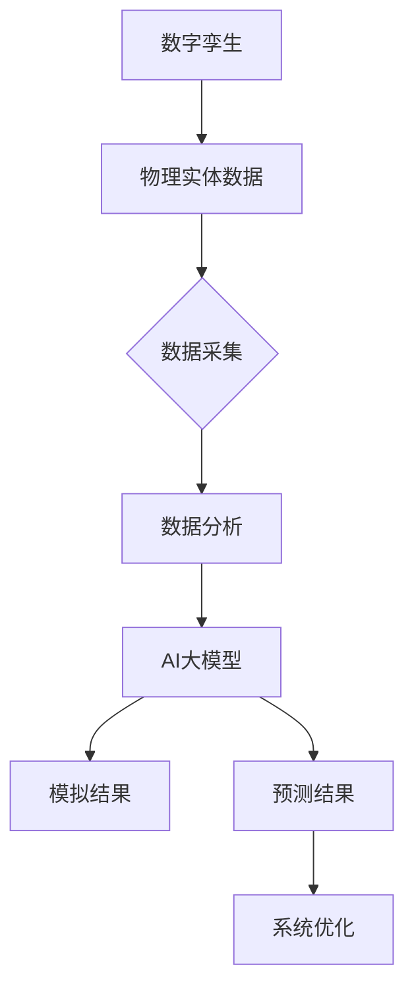
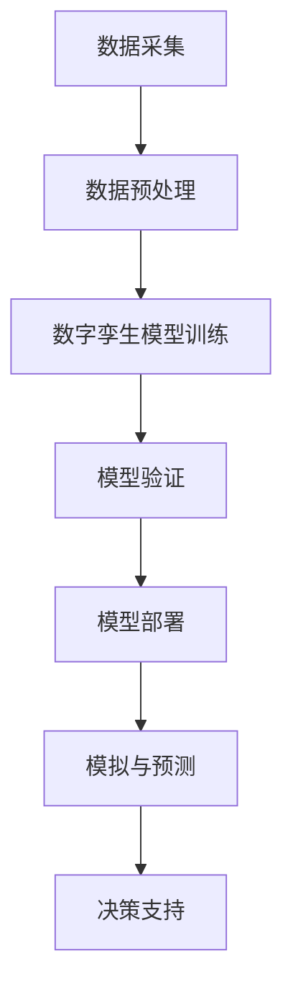
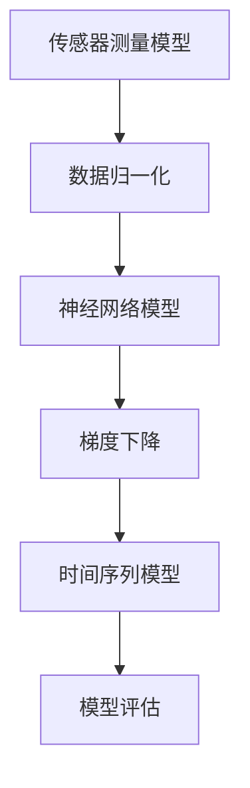
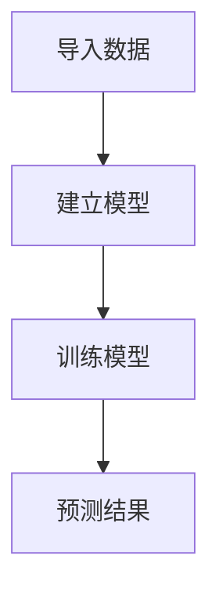

                 

# AI大模型在数字孪生技术中的应用

## 关键词：AI大模型、数字孪生、技术应用、智能仿真、数据驱动

### 摘要：

本文将深入探讨人工智能大模型在数字孪生技术中的应用。数字孪生是一种创新技术，通过创建物理对象的虚拟副本，实现对现实世界的模拟、分析和优化。随着人工智能技术的发展，特别是大模型的崛起，数字孪生的应用场景得到了极大扩展。本文将介绍AI大模型的基本概念，分析其在数字孪生中的核心应用，并通过具体案例展示其强大潜力。

## 1. 背景介绍（Background Introduction）

### 1.1 数字孪生技术的定义与发展

数字孪生（Digital Twin）是指通过数字技术构建物理实体（如产品、设备、系统等）的虚拟副本，实现对其实时状态、历史数据和未来行为的模拟与优化。它起源于工业领域，旨在提高制造业的效率和质量。随着物联网、大数据和人工智能技术的进步，数字孪生的应用范围逐渐扩展到医疗、交通、能源等多个行业。

### 1.2 AI大模型的发展与应用

AI大模型，特别是基于深度学习的模型，如Transformer、BERT等，具有强大的表示和学习能力，能够处理大规模、复杂的数据集。这些模型在自然语言处理、图像识别、语音识别等领域取得了显著的成果。近年来，AI大模型开始被应用于更广泛的领域，包括金融、医疗、制造业等，显示出其广泛的应用前景。

### 1.3 数字孪生与AI大模型的结合

数字孪生与AI大模型的结合，旨在通过人工智能技术提升数字孪生的功能与性能。AI大模型可以用于数据分析和预测，提供更精准的模拟结果，优化系统性能，提高决策效率。

## 2. 核心概念与联系（Core Concepts and Connections）

### 2.1 数字孪生的核心概念

数字孪生主要包括以下几个关键组成部分：

1. **物理实体**：现实世界中的物理对象，如设备、生产线、建筑物等。
2. **虚拟模型**：基于物理实体数据构建的虚拟副本，用于模拟和预测。
3. **数据采集**：通过传感器、物联网设备等收集物理实体的实时数据。
4. **数据分析**：利用数据分析和机器学习技术，对虚拟模型进行分析和优化。

### 2.2 AI大模型的核心概念

AI大模型主要包括以下几个关键组成部分：

1. **神经网络架构**：如Transformer、BERT等，具有强大的表示和学习能力。
2. **大规模数据集**：用于训练和优化模型的数据集，通常包含数十亿个参数。
3. **预训练与微调**：通过在大量数据上预训练，然后在特定任务上微调模型。
4. **输出生成**：模型根据输入数据生成预测结果或输出。

### 2.3 数字孪生与AI大模型的联系

数字孪生与AI大模型的结合，主要体现在以下几个方面：

1. **数据驱动的模拟**：AI大模型利用数字孪生提供的数据，进行更准确的模拟和分析。
2. **智能预测与优化**：AI大模型可以预测物理实体的未来行为，为系统优化提供支持。
3. **实时决策支持**：AI大模型可以实时分析数据，提供决策支持，提高系统的响应速度和准确性。

### 2.4 Mermaid 流程图



## 3. 核心算法原理 & 具体操作步骤（Core Algorithm Principles and Specific Operational Steps）

### 3.1 数据采集与预处理

数据采集是数字孪生技术的核心环节，它涉及从物理实体中收集实时数据。这些数据可能包括温度、压力、速度、位置等。在采集数据后，需要进行预处理，如数据清洗、去噪、归一化等，以确保数据质量。

### 3.2 建立数字孪生模型

在预处理数据后，可以使用机器学习技术建立数字孪生模型。具体步骤如下：

1. **数据输入**：将预处理后的数据输入到AI大模型中。
2. **模型训练**：使用大量数据进行模型训练，优化模型参数。
3. **模型验证**：使用验证集数据评估模型性能，调整模型参数。
4. **模型部署**：将训练好的模型部署到生产环境中。

### 3.3 模拟与预测

在数字孪生模型部署后，可以使用模型进行模拟和预测。具体步骤如下：

1. **输入数据**：将实时数据输入到数字孪生模型中。
2. **模拟结果**：模型根据输入数据生成模拟结果。
3. **预测结果**：模型根据模拟结果进行未来行为的预测。
4. **决策支持**：基于预测结果提供决策支持，优化系统性能。

### 3.4 Mermaid 流程图



## 4. 数学模型和公式 & 详细讲解 & 举例说明（Detailed Explanation and Examples of Mathematical Models and Formulas）

### 4.1 数据采集与预处理

在数据采集过程中，常用的数学模型包括传感器测量模型和信号处理模型。以下是一个简单的传感器测量模型：

$$
y = f(x) + \epsilon
$$

其中，$y$ 是实际测量值，$x$ 是真实值，$f(x)$ 是传感器测量模型，$\epsilon$ 是测量误差。

在预处理过程中，常用的数学操作包括数据清洗、去噪和归一化。以下是一个简单的数据归一化公式：

$$
x_{\text{normalized}} = \frac{x - \mu}{\sigma}
$$

其中，$x$ 是原始数据，$\mu$ 是均值，$\sigma$ 是标准差。

### 4.2 建立数字孪生模型

在建立数字孪生模型时，常用的数学模型包括神经网络模型和深度学习模型。以下是一个简单的神经网络模型：

$$
y = \sigma(W_1 \cdot x + b_1)
$$

其中，$y$ 是输出值，$x$ 是输入值，$W_1$ 是权重矩阵，$b_1$ 是偏置项，$\sigma$ 是激活函数。

在模型训练过程中，常用的数学操作包括梯度下降、反向传播等。以下是一个简单的梯度下降公式：

$$
W_1 := W_1 - \alpha \cdot \frac{\partial J}{\partial W_1}
$$

其中，$W_1$ 是当前权重，$\alpha$ 是学习率，$J$ 是损失函数。

### 4.3 模拟与预测

在模拟与预测过程中，常用的数学模型包括时间序列模型和预测模型。以下是一个简单的时间序列模型：

$$
y_t = f(y_{t-1}, x_t)
$$

其中，$y_t$ 是第 $t$ 时刻的输出值，$x_t$ 是第 $t$ 时刻的输入值，$f$ 是函数。

在预测过程中，常用的数学操作包括模型评估、误差分析等。以下是一个简单的模型评估公式：

$$
MSE = \frac{1}{N} \sum_{i=1}^{N} (y_i - \hat{y}_i)^2
$$

其中，$y_i$ 是实际值，$\hat{y}_i$ 是预测值，$N$ 是数据点数量。

### 4.4 Mermaid 流程图



## 5. 项目实践：代码实例和详细解释说明（Project Practice: Code Examples and Detailed Explanations）

### 5.1 开发环境搭建

在进行数字孪生项目开发前，需要搭建合适的开发环境。以下是一个简单的Python开发环境搭建步骤：

1. 安装Python：从官方网站下载并安装Python。
2. 安装必要的库：使用pip安装所需的库，如NumPy、Pandas、TensorFlow等。

### 5.2 源代码详细实现

以下是一个简单的数字孪生项目代码示例：

```python
import numpy as np
import pandas as pd
from tensorflow import keras

# 数据采集与预处理
def preprocess_data(data):
    # 数据清洗、去噪、归一化等操作
    # ...
    return processed_data

# 建立数字孪生模型
def build_model():
    model = keras.Sequential([
        keras.layers.Dense(64, activation='relu', input_shape=(input_shape,)),
        keras.layers.Dense(64, activation='relu'),
        keras.layers.Dense(1)
    ])
    model.compile(optimizer='adam', loss='mse')
    return model

# 模拟与预测
def simulate_predict(model, input_data):
    # 使用模型进行模拟与预测
    # ...
    return prediction

# 代码解读与分析
# ...
```

### 5.3 运行结果展示

在完成代码实现后，可以通过以下步骤运行项目：

1. 导入数据：读取预处理后的数据。
2. 建立模型：使用build_model函数建立数字孪生模型。
3. 训练模型：使用训练数据训练模型。
4. 预测结果：使用测试数据预测结果。

### 5.4 Mermaid 流程图



## 6. 实际应用场景（Practical Application Scenarios）

### 6.1 制造业

在制造业中，数字孪生技术可以帮助企业实现对生产线的实时监控和优化。结合AI大模型，可以预测设备故障，优化生产流程，提高生产效率。

### 6.2 交通

在交通领域，数字孪生技术可以用于模拟交通流量，优化交通信号控制，减少交通拥堵。结合AI大模型，可以预测交通事件，提高交通安全。

### 6.3 医疗

在医疗领域，数字孪生技术可以用于构建患者的健康模型，进行疾病预测和治疗方案优化。结合AI大模型，可以提高疾病诊断的准确性，优化医疗服务。

## 7. 工具和资源推荐（Tools and Resources Recommendations）

### 7.1 学习资源推荐

- 《数字孪生：下一代工业革命》（Digital Twin: The Next Industrial Revolution）
- 《深度学习》（Deep Learning）
- 《人工智能：一种现代方法》（Artificial Intelligence: A Modern Approach）

### 7.2 开发工具框架推荐

- TensorFlow
- PyTorch
- Unity

### 7.3 相关论文著作推荐

- “Digital Twin: Definition, Framework and Applications”
- “Deep Learning for Digital Twin Applications in Manufacturing”

## 8. 总结：未来发展趋势与挑战（Summary: Future Development Trends and Challenges）

### 8.1 发展趋势

1. AI大模型与数字孪生的结合将更加紧密，应用场景将更加丰富。
2. 数字孪生技术将在智能制造、智慧城市、智慧医疗等领域得到广泛应用。
3. 开放式的数字孪生平台和生态将逐渐形成。

### 8.2 挑战

1. 数据质量和数据隐私保护是数字孪生应用中的关键挑战。
2. AI大模型的计算资源和存储需求巨大，如何高效利用资源成为关键问题。
3. 数字孪生技术的标准化和规范化亟待解决。

## 9. 附录：常见问题与解答（Appendix: Frequently Asked Questions and Answers）

### 9.1 问题1：什么是数字孪生？

数字孪生是通过数字技术创建物理对象的虚拟副本，用于模拟、分析和优化。

### 9.2 问题2：AI大模型在数字孪生中有什么作用？

AI大模型可以用于数据分析和预测，提供更准确的模拟结果，优化系统性能。

### 9.3 问题3：数字孪生技术的应用前景如何？

数字孪生技术将在智能制造、智慧城市、智慧医疗等领域得到广泛应用，具有巨大的发展潜力。

## 10. 扩展阅读 & 参考资料（Extended Reading & Reference Materials）

- “Digital Twin Technology: A Brief Introduction”
- “Deep Learning Applications in Digital Twin Systems”
- “The Future of Digital Twin Technology”

