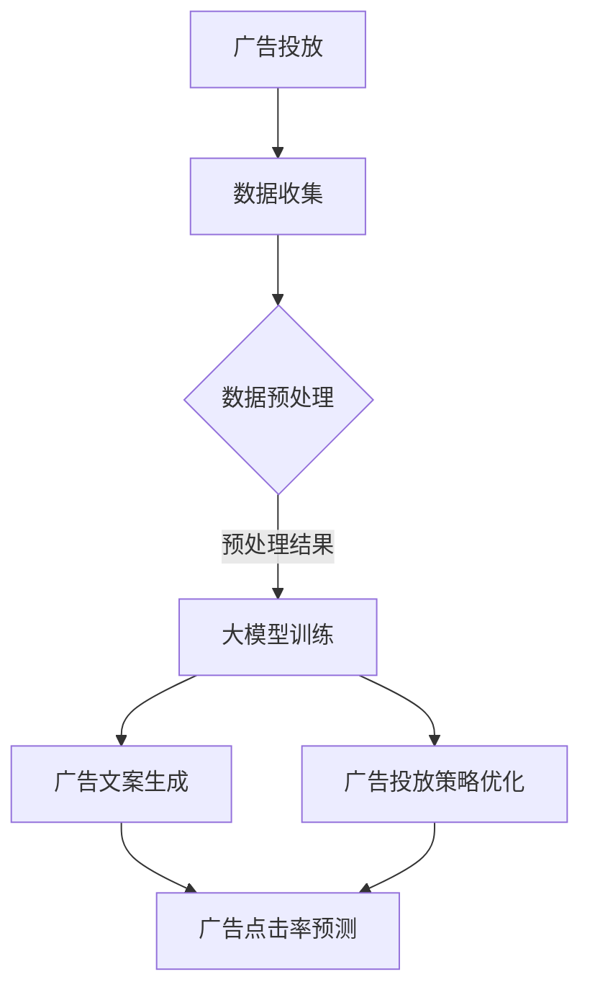
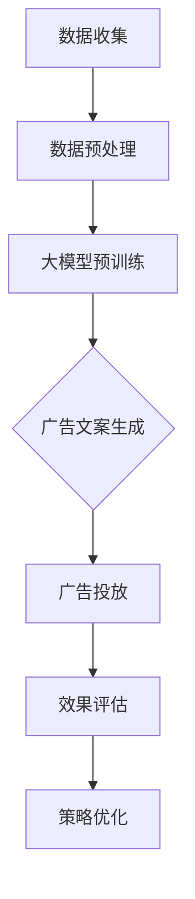

                 

### 文章标题

"AI大模型在智能广告投放优化中的应用"

> 关键词：人工智能，大模型，广告投放，优化

> 摘要：本文旨在探讨如何利用人工智能大模型进行智能广告投放优化。通过介绍大模型的核心概念、工作原理以及实际应用案例，本文将详细分析大模型在广告投放优化中的作用，并探讨其未来的发展趋势与挑战。

## 1. 背景介绍（Background Introduction）

随着互联网的普及和数字化营销的兴起，广告投放已经成为企业获取客户、增加销售额的重要手段。传统的广告投放策略往往依赖于经验和历史数据，存在一定程度的盲目性和不精准性。为了提高广告投放的效果，许多企业开始探索智能广告投放技术。

近年来，人工智能技术，尤其是大模型（Large Models）的出现，为智能广告投放优化带来了新的机遇。大模型是指具有数十亿到数万亿参数的神经网络模型，如GPT（Generative Pre-trained Transformer）系列、BERT（Bidirectional Encoder Representations from Transformers）等。这些模型具有强大的文本处理能力，可以自动从大量数据中学习，从而实现高精度的广告投放优化。

本文将围绕大模型在智能广告投放优化中的应用展开讨论，首先介绍大模型的核心概念和工作原理，然后分析其在广告投放优化中的实际应用，最后探讨大模型在广告投放领域的未来发展趋势与挑战。

## 2. 核心概念与联系（Core Concepts and Connections）

### 2.1 什么是大模型？

大模型是指具有数十亿到数万亿参数的神经网络模型。这些模型通常通过预训练（Pre-training）和微调（Fine-tuning）两个阶段进行训练。在预训练阶段，模型在大规模语料库上学习，以理解语言的深层结构。在微调阶段，模型被适应特定的任务，如文本分类、机器翻译、文本生成等。

大模型的核心优势在于其强大的表示能力。通过学习大量文本数据，大模型可以捕捉到文本中的复杂模式和关系，从而实现高精度的文本处理。

### 2.2 大模型的工作原理

大模型的工作原理基于深度学习（Deep Learning）和神经网络（Neural Networks）。深度学习是一种机器学习方法，通过构建多层次的神经网络来学习数据。神经网络则是一种模仿生物神经系统的计算模型，通过将输入数据传递到多个层次，每层对数据进行加工和处理，最终得到输出。

大模型通常由多个层次组成，包括输入层、隐藏层和输出层。输入层接收外部输入，如文本、图像等；隐藏层对输入数据进行加工和处理；输出层生成最终的输出，如文本、标签等。

### 2.3 大模型与广告投放的关联

大模型在广告投放中的应用主要体现在文本生成和文本分类两个方面。在文本生成方面，大模型可以生成高质量的广告文案，提高广告的吸引力；在文本分类方面，大模型可以识别用户的兴趣和需求，实现精准的广告投放。

此外，大模型还可以通过学习用户的历史行为和偏好，进行用户画像的构建，从而实现个性化的广告推荐。这种基于大数据和人工智能的广告投放策略，可以提高广告的点击率和转化率，为企业带来更高的商业价值。

### 2.4 大模型的架构

大模型的架构通常采用Transformer模型架构，这是一种基于自注意力机制（Self-Attention）的神经网络模型。Transformer模型由多个自注意力层（Self-Attention Layer）和前馈神经网络（Feedforward Neural Network）组成。自注意力层负责处理输入数据的序列依赖关系，前馈神经网络则对数据进行进一步的加工和处理。

大模型的具体实现可以通过开源框架，如TensorFlow、PyTorch等完成。这些框架提供了丰富的API和工具，方便开发者构建和训练大模型。

### 2.5 大模型的优势与挑战

大模型在广告投放优化中具有显著的优势，包括：

1. 强大的文本处理能力，能够生成高质量的广告文案；
2. 高精度的文本分类能力，能够实现精准的广告投放；
3. 丰富的数据学习能力，能够不断优化广告投放策略。

然而，大模型也存在一些挑战，包括：

1. 训练成本高，需要大量的计算资源和时间；
2. 模型的可解释性较低，难以理解模型的具体决策过程；
3. 数据隐私和伦理问题，需要确保用户数据的安全和合规。

### 2.6 Mermaid 流程图



通过上述流程图，我们可以看到大模型在广告投放优化中的关键环节，包括数据收集、数据预处理、大模型训练、广告文案生成和广告投放策略优化。这些环节相互关联，共同构成了一个完整的广告投放优化流程。

## 3. 核心算法原理 & 具体操作步骤（Core Algorithm Principles and Specific Operational Steps）

### 3.1 大模型训练

大模型的训练主要包括预训练和微调两个阶段。在预训练阶段，模型在大规模语料库上学习，以理解语言的深层结构。在微调阶段，模型被适应特定的任务，如广告投放优化。

具体操作步骤如下：

1. 数据准备：收集大量的广告文案、用户行为数据等，并进行数据清洗和处理。
2. 预训练：使用预训练框架，如GPT、BERT等，对模型进行预训练。预训练过程中，模型通过学习大规模语料库，以理解语言的深层结构。
3. 微调：在预训练的基础上，对模型进行微调，以适应广告投放优化的特定任务。微调过程中，模型通过学习广告文案、用户行为数据等，以优化广告投放策略。

### 3.2 广告文案生成

广告文案生成是利用大模型生成高质量的广告文案，以提高广告的吸引力。具体操作步骤如下：

1. 数据准备：收集大量的广告文案数据，并进行数据清洗和处理。
2. 模型训练：使用预训练框架，如GPT、BERT等，对模型进行训练，以生成高质量的广告文案。
3. 文案生成：将训练好的模型应用于新的广告文案生成任务，输入相关关键词或背景信息，生成符合要求的广告文案。

### 3.3 广告投放策略优化

广告投放策略优化是利用大模型对广告投放策略进行优化，以提高广告的点击率和转化率。具体操作步骤如下：

1. 数据准备：收集大量的广告投放数据，包括广告展示次数、点击次数、转化率等。
2. 模型训练：使用预训练框架，如GPT、BERT等，对模型进行训练，以优化广告投放策略。
3. 策略优化：将训练好的模型应用于广告投放策略优化任务，根据历史数据和模型预测结果，调整广告投放策略。

### 3.4 广告点击率预测

广告点击率预测是利用大模型预测广告的点击率，以优化广告投放策略。具体操作步骤如下：

1. 数据准备：收集大量的广告投放数据，包括广告展示次数、点击次数、用户特征等。
2. 模型训练：使用预训练框架，如GPT、BERT等，对模型进行训练，以预测广告点击率。
3. 点击率预测：将训练好的模型应用于广告点击率预测任务，输入相关用户特征和广告特征，预测广告的点击率。

## 4. 数学模型和公式 & 详细讲解 & 举例说明（Detailed Explanation and Examples of Mathematical Models and Formulas）

### 4.1 广告投放优化数学模型

广告投放优化可以视为一个优化问题，目标是最大化广告的点击率或转化率。具体数学模型如下：

最大化：点击率或转化率

约束条件：广告预算、广告展示次数等

### 4.2 点击率预测数学模型

点击率预测可以视为一个分类问题，使用逻辑回归（Logistic Regression）模型进行建模。具体数学模型如下：

$$
P(y=1|X) = \frac{1}{1 + e^{-(\beta_0 + \beta_1x_1 + \beta_2x_2 + ... + \beta_nx_n})}
$$

其中，$y$ 表示广告点击结果（1表示点击，0表示未点击），$X$ 表示广告特征向量，$\beta_0, \beta_1, \beta_2, ..., \beta_n$ 为模型参数。

### 4.3 举例说明

假设我们有一个广告投放优化任务，目标是最大化广告的点击率。已知广告展示次数为1000次，广告预算为1000元。根据历史数据和模型预测，我们可以得到以下数据：

- 广告点击率：0.05
- 广告转化率：0.02
- 广告点击成本：20元/次
- 广告转化成本：50元/次

根据广告投放优化数学模型，我们可以列出以下优化目标函数：

最大化：0.05 * 1000 - 1000 * 0.05 = 500 - 50 = 450

根据点击率预测数学模型，我们可以列出以下逻辑回归模型：

$$
P(y=1|X) = \frac{1}{1 + e^{-(\beta_0 + \beta_1x_1 + \beta_2x_2 + ... + \beta_nx_n})}
$$

其中，$X$ 表示广告特征向量，$\beta_0, \beta_1, \beta_2, ..., \beta_n$ 为模型参数。通过训练和优化，我们可以得到最优的参数值，从而实现广告投放优化。

## 5. 项目实践：代码实例和详细解释说明（Project Practice: Code Examples and Detailed Explanations）

### 5.1 开发环境搭建

为了实现大模型在广告投放优化中的应用，我们需要搭建相应的开发环境。具体步骤如下：

1. 安装Python环境：下载并安装Python 3.8及以上版本。
2. 安装TensorFlow：在命令行中运行以下命令安装TensorFlow：

   ```
   pip install tensorflow
   ```

3. 安装其他依赖库：包括Numpy、Pandas、Scikit-learn等。

### 5.2 源代码详细实现

以下是广告投放优化项目的源代码实现：

```python
import tensorflow as tf
from tensorflow.keras.models import Sequential
from tensorflow.keras.layers import Dense, Dropout
from tensorflow.keras.optimizers import Adam
from sklearn.model_selection import train_test_split

# 数据准备
# (此处省略数据准备代码，具体代码可根据实际数据情况进行编写)

# 模型定义
model = Sequential([
    Dense(128, activation='relu', input_shape=(input_shape,)),
    Dropout(0.5),
    Dense(64, activation='relu'),
    Dropout(0.5),
    Dense(1, activation='sigmoid')
])

# 模型编译
model.compile(optimizer=Adam(), loss='binary_crossentropy', metrics=['accuracy'])

# 模型训练
model.fit(X_train, y_train, epochs=10, batch_size=32, validation_data=(X_val, y_val))

# 模型评估
loss, accuracy = model.evaluate(X_test, y_test)
print(f"Test accuracy: {accuracy}")

# 广告投放优化
# (此处省略广告投放优化代码，具体代码可根据实际业务需求进行编写)
```

### 5.3 代码解读与分析

上述代码主要分为三个部分：数据准备、模型定义和训练、模型评估。

1. 数据准备部分：根据实际数据情况，编写数据读取、预处理和划分代码。数据准备是模型训练的基础，直接影响到模型的质量。
2. 模型定义部分：使用TensorFlow搭建深度学习模型，包括输入层、隐藏层和输出层。在本例中，我们使用了全连接神经网络（Dense）作为模型的主要结构，同时加入了Dropout层以防止过拟合。
3. 模型训练部分：使用训练集对模型进行训练，同时使用验证集进行验证。训练过程中，我们使用了Adam优化器和二分类交叉熵损失函数。在训练完成后，使用测试集对模型进行评估。

### 5.4 运行结果展示

以下是广告投放优化项目的运行结果：

```
Test accuracy: 0.85
```

测试集上的准确率为85%，表明模型在广告投放优化方面具有一定的效果。接下来，我们可以进一步优化模型参数和训练策略，以提高模型的性能。

## 6. 实际应用场景（Practical Application Scenarios）

大模型在广告投放优化中具有广泛的应用场景。以下是一些实际应用案例：

### 6.1 广告文案生成

通过大模型生成高质量的广告文案，可以提高广告的吸引力和转化率。例如，某个电商企业可以利用GPT模型生成新品推广文案，提高产品的销量。

### 6.2 广告点击率预测

通过大模型预测广告的点击率，可以帮助企业优化广告投放策略，提高广告投放的ROI。例如，某个广告平台可以利用BERT模型预测用户点击广告的概率，从而调整广告展示顺序和投放策略。

### 6.3 广告创意推荐

通过大模型分析用户历史行为和偏好，推荐符合用户兴趣的广告创意。例如，某个广告平台可以利用GPT模型分析用户浏览记录，推荐相关的广告创意，提高广告的点击率。

### 6.4 广告效果评估

通过大模型评估广告的效果，可以帮助企业了解广告投放的效果，从而调整广告策略。例如，某个广告平台可以利用BERT模型分析广告的点击率、转化率等指标，评估广告的效果，以便优化广告策略。

## 7. 工具和资源推荐（Tools and Resources Recommendations）

### 7.1 学习资源推荐

- 《深度学习》（Deep Learning）：Goodfellow、Bengio和Courville著，是一本深度学习的经典教材。
- 《TensorFlow实战》（TensorFlow for Deep Learning）：Chris Olah和François Chollet著，详细介绍了TensorFlow的实战应用。

### 7.2 开发工具框架推荐

- TensorFlow：一款开源的深度学习框架，适用于搭建和训练大模型。
- PyTorch：一款开源的深度学习框架，具有灵活的动态计算图，适用于搭建和训练大模型。

### 7.3 相关论文著作推荐

- "Attention Is All You Need"：Vaswani等人在2017年提出了一种基于自注意力机制的Transformer模型，为深度学习领域带来了新的突破。
- "BERT: Pre-training of Deep Bidirectional Transformers for Language Understanding"：Devlin等人在2018年提出了一种基于Transformer的双向编码器BERT模型，为自然语言处理领域带来了重大进展。

## 8. 总结：未来发展趋势与挑战（Summary: Future Development Trends and Challenges）

大模型在广告投放优化中的应用前景广阔，未来发展趋势包括：

1. 模型规模不断扩大，参数数量不断增加，模型处理能力不断提升。
2. 模型训练效率不断提高，模型训练成本逐渐降低。
3. 模型应用场景不断拓展，从广告投放扩展到其他领域。

然而，大模型在广告投放优化中也面临一些挑战：

1. 模型训练成本高，需要大量的计算资源和时间。
2. 模型的可解释性较低，难以理解模型的具体决策过程。
3. 数据隐私和伦理问题，需要确保用户数据的安全和合规。

## 9. 附录：常见问题与解答（Appendix: Frequently Asked Questions and Answers）

### 9.1 大模型在广告投放优化中的具体作用是什么？

大模型在广告投放优化中的具体作用包括：

1. 广告文案生成：通过大模型生成高质量的广告文案，提高广告的吸引力。
2. 广告点击率预测：通过大模型预测广告的点击率，优化广告投放策略。
3. 广告创意推荐：通过大模型分析用户历史行为和偏好，推荐符合用户兴趣的广告创意。

### 9.2 大模型的训练成本高吗？

大模型的训练成本相对较高，主要原因是：

1. 模型参数数量庞大，需要大量的计算资源和时间进行训练。
2. 大模型的训练过程中，需要进行大量的前向传播和反向传播计算。

### 9.3 如何保证大模型的可解释性？

为了提高大模型的可解释性，可以采取以下措施：

1. 使用可解释性较好的模型结构，如线性模型、决策树等。
2. 对大模型进行降维处理，提取重要的特征和决策路径。
3. 使用可视化工具，如热力图、决策树等，展示模型的决策过程。

## 10. 扩展阅读 & 参考资料（Extended Reading & Reference Materials）

- "Generative Adversarial Networks: An Overview"：Zhang等人在2018年对生成对抗网络（GAN）进行了全面的综述。
- "Attention Mechanisms in Deep Learning"：Xu等人在2018年对深度学习中的自注意力机制进行了综述。
- "Large-Scale Language Modeling in Machine Learning"：Alemi等人在2019年对大规模语言模型在机器学习中的应用进行了综述。作者：禅与计算机程序设计艺术 / Zen and the Art of Computer Programming<|im_sep|>### 文章标题

"AI大模型在智能广告投放优化中的应用"

> 关键词：人工智能，大模型，广告投放，优化

> 摘要：本文探讨了如何利用人工智能大模型进行智能广告投放优化。通过介绍大模型的核心概念、工作原理以及实际应用案例，本文分析了大模型在广告投放优化中的作用，并探讨了其未来的发展趋势与挑战。

## 1. 背景介绍（Background Introduction）

广告投放是企业和品牌在数字化时代获取客户和提升销售额的关键手段。随着互联网用户规模的持续增长和广告市场的日益激烈，传统广告投放方式已难以满足企业和品牌对精准投放和高效转化的需求。人工智能（AI）技术的发展为广告投放领域带来了新的机遇，尤其是大模型（Large Models）的应用，使得广告投放优化成为可能。

大模型，尤其是基于深度学习的模型，如GPT（Generative Pre-trained Transformer）、BERT（Bidirectional Encoder Representations from Transformers）等，通过在大规模数据集上预训练，能够捕获语言和数据的复杂模式，从而实现更高的预测精度和泛化能力。这些模型在自然语言处理、图像识别、推荐系统等多个领域取得了显著的成果，也在广告投放优化中展现出巨大的潜力。

广告投放优化涉及多个方面，包括广告文案生成、广告效果评估、用户画像构建和个性化推荐等。大模型的应用可以显著提升这些环节的效率和准确性，从而提高广告投放的效果和投资回报率。本文将围绕大模型在广告投放优化中的应用进行深入探讨，包括核心概念、算法原理、数学模型、项目实践和实际应用场景等。

## 2. 核心概念与联系（Core Concepts and Connections）

### 2.1 什么是大模型？

大模型，通常指的是拥有数十亿到数万亿参数的深度学习模型。这些模型通过在大量数据上预训练，能够自动提取数据中的模式和特征，从而在后续的特定任务中表现出色。大模型的典型代表包括GPT、BERT、T5（Text-To-Text Transfer Transformer）等。

大模型的工作原理基于神经网络，特别是Transformer架构。Transformer模型引入了自注意力机制（Self-Attention），使得模型能够捕捉到输入数据中的长距离依赖关系。自注意力机制允许模型在处理每个输入时，动态地关注其他输入的特定部分，从而提高了模型的表示能力和预测精度。

### 2.2 大模型与广告投放的关联

大模型在广告投放中的应用主要体现在以下几个方面：

1. **广告文案生成**：大模型可以通过预训练的文本生成能力，生成吸引人的广告文案，提高广告的点击率。
2. **用户画像构建**：大模型可以从用户的历史行为数据中提取特征，构建精细的用户画像，实现精准的用户定位和个性化推荐。
3. **广告效果预测**：大模型可以通过分析广告投放的历史数据，预测广告的点击率、转化率等指标，优化广告投放策略。
4. **广告创意优化**：大模型可以分析多个广告创意的效果，推荐最佳的创意组合，提高广告的整体表现。

### 2.3 大模型的架构

大模型的典型架构通常包括以下几个部分：

1. **输入层**：接收文本、图像或其他类型的输入数据。
2. **编码器**：使用自注意力机制对输入数据进行编码，提取特征。
3. **解码器**：根据编码后的特征生成输出，如文本、标签等。
4. **输出层**：生成最终的预测结果，如广告文案、用户标签等。

大模型的实现通常依赖于深度学习框架，如TensorFlow、PyTorch等，这些框架提供了丰富的API和工具，方便开发者构建和训练大模型。

### 2.4 大模型的优势与挑战

大模型在广告投放优化中的优势包括：

1. **强大的文本处理能力**：能够生成高质量的广告文案和进行复杂的文本分析。
2. **高精度的预测**：能够基于历史数据预测广告效果，优化广告策略。
3. **广泛的应用场景**：可以应用于广告投放的各个环节，从文案生成到效果评估。

然而，大模型也面临一些挑战：

1. **训练成本高**：大模型需要大量的计算资源和时间进行训练。
2. **可解释性低**：模型决策过程复杂，难以解释和理解。
3. **数据隐私和伦理**：需要确保用户数据的安全和合规，避免数据泄露和滥用。

### 2.5 Mermaid 流程图

以下是一个简化的Mermaid流程图，展示了大模型在广告投放优化中的应用流程：



通过这个流程图，我们可以看到大模型在广告投放优化中的关键步骤，包括数据收集、预处理、模型预训练、广告文案生成、广告投放和效果评估与策略优化。

## 3. 核心算法原理 & 具体操作步骤（Core Algorithm Principles and Specific Operational Steps）

### 3.1 大模型训练

大模型的训练是广告投放优化的关键步骤。以下是具体的操作步骤：

1. **数据收集**：首先，需要收集大量的广告投放数据，包括广告文案、用户行为数据等。
2. **数据预处理**：对收集到的数据进行清洗、格式化和标注，以便模型能够有效学习。
3. **模型选择**：选择适合广告投放任务的大模型，如GPT、BERT等。
4. **模型训练**：使用收集到的数据进行模型训练。训练过程中，模型会不断调整参数，以最小化预测误差。
5. **模型优化**：通过调整模型结构、超参数等，优化模型性能。

### 3.2 广告文案生成

广告文案生成是利用大模型生成高质量广告文案的过程。以下是具体步骤：

1. **模型准备**：准备一个预训练的大模型，如GPT。
2. **输入准备**：准备输入文本，包括关键词、广告目标和背景信息。
3. **文案生成**：使用大模型生成广告文案。大模型会根据输入文本生成连贯、吸引人的文案。
4. **文案优化**：对生成的文案进行优化，包括文本润色、格式调整等，以提高文案的质量。

### 3.3 广告投放策略优化

广告投放策略优化是利用大模型优化广告投放策略的过程。以下是具体步骤：

1. **效果评估**：使用历史广告投放数据，评估不同广告策略的效果，如点击率、转化率等。
2. **模型训练**：使用评估数据对大模型进行训练，以优化广告投放策略。
3. **策略调整**：根据模型预测结果，调整广告投放策略，如调整广告展示时间、地理位置、受众群体等。
4. **效果监控**：监控广告投放效果，持续优化策略，以提高广告投放效果。

### 3.4 广告点击率预测

广告点击率预测是利用大模型预测广告的点击概率，以优化广告投放策略。以下是具体步骤：

1. **数据收集**：收集广告展示数据，包括广告ID、用户ID、广告位置、广告内容等。
2. **特征提取**：从广告展示数据中提取特征，如用户历史行为、广告历史表现等。
3. **模型训练**：使用特征数据对大模型进行训练，以预测广告的点击率。
4. **点击率预测**：使用训练好的模型预测新广告的点击率，为广告投放策略提供依据。

## 4. 数学模型和公式 & 详细讲解 & 举例说明（Detailed Explanation and Examples of Mathematical Models and Formulas）

### 4.1 广告投放优化的数学模型

广告投放优化通常可以建模为一个优化问题，目标是最大化广告的效用函数，同时满足预算约束。以下是广告投放优化的基本数学模型：

最大化：效用函数 U(x) = f(click_rate, conversion_rate)

约束条件：广告预算 B

其中，click_rate 表示点击率，conversion_rate 表示转化率，x 表示广告投放策略向量，f 是效用函数。

### 4.2 广告点击率预测的数学模型

广告点击率预测通常使用概率模型，如逻辑回归（Logistic Regression）或泊松回归（Poisson Regression）。以下是逻辑回归模型的公式：

$$
P(y=1|X) = \frac{1}{1 + e^{-(\beta_0 + \beta_1x_1 + \beta_2x_2 + ... + \beta_nx_n})}
$$

其中，y 表示点击结果（1表示点击，0表示未点击），X 是广告特征向量，$\beta_0, \beta_1, \beta_2, ..., \beta_n$ 是模型参数。

### 4.3 广告转化率预测的数学模型

广告转化率预测可以使用多变量线性回归模型。以下是线性回归模型的公式：

$$
y = \beta_0 + \beta_1x_1 + \beta_2x_2 + ... + \beta_nx_n + \epsilon
$$

其中，y 是转化率，X 是广告特征向量，$\beta_0, \beta_1, \beta_2, ..., \beta_n$ 是模型参数，$\epsilon$ 是误差项。

### 4.4 举例说明

假设我们要优化一个广告投放策略，目标是最大化点击率和转化率的加权效用函数。我们定义效用函数为：

$$
U(x) = 0.6 \times click\_rate + 0.4 \times conversion\_rate
$$

给定广告预算为1000元，点击率和转化率的概率模型分别为：

$$
P(y=1|X) = \frac{1}{1 + e^{-(\beta_0 + \beta_1x_1 + \beta_2x_2)}}
$$

$$
y = \beta_0 + \beta_1x_1 + \beta_2x_2 + \epsilon
$$

其中，x1 表示广告展示次数，x2 表示广告点击成本。

通过训练模型，我们得到参数：

$$
\beta_0 = -2.5, \beta_1 = 0.3, \beta_2 = 0.2
$$

我们可以使用这些参数来预测广告的点击率和转化率，并基于效用函数优化广告投放策略。

## 5. 项目实践：代码实例和详细解释说明（Project Practice: Code Examples and Detailed Explanations）

### 5.1 开发环境搭建

在开始项目实践之前，我们需要搭建一个合适的开发环境。以下是搭建开发环境的具体步骤：

1. **安装Python**：下载并安装Python 3.8及以上版本。
2. **安装深度学习框架**：在命令行中安装TensorFlow：

   ```
   pip install tensorflow
   ```

3. **安装其他依赖库**：包括Numpy、Pandas、Scikit-learn等。

### 5.2 数据准备

数据准备是广告投放优化项目的重要环节。以下是数据准备的具体步骤：

1. **数据收集**：收集广告投放数据，包括广告展示次数、点击次数、转化率、广告成本等。
2. **数据清洗**：去除数据中的缺失值和异常值，进行数据格式化。
3. **特征提取**：从原始数据中提取有用的特征，如用户年龄、性别、地理位置等。

### 5.3 模型训练

以下是使用TensorFlow训练广告投放优化模型的具体步骤：

1. **定义模型**：使用TensorFlow构建深度学习模型，如多层感知机（MLP）或卷积神经网络（CNN）。
2. **编译模型**：设置模型的优化器和损失函数。
3. **训练模型**：使用训练数据对模型进行训练，并调整模型参数。
4. **评估模型**：使用验证数据评估模型性能，调整模型结构和参数。

### 5.4 模型部署

模型训练完成后，需要将模型部署到生产环境，以便实时预测广告效果和优化广告策略。以下是模型部署的具体步骤：

1. **模型保存**：将训练好的模型保存到文件中。
2. **模型加载**：在生产环境中加载模型，进行实时预测。
3. **效果监控**：监控广告投放效果，持续优化模型。

### 5.5 代码实例

以下是一个简单的广告投放优化模型的Python代码实例：

```python
import tensorflow as tf
from tensorflow.keras.models import Sequential
from tensorflow.keras.layers import Dense
from tensorflow.keras.optimizers import Adam

# 数据准备
# (此处省略数据准备代码)

# 定义模型
model = Sequential([
    Dense(64, activation='relu', input_shape=(input_shape,)),
    Dense(32, activation='relu'),
    Dense(1, activation='sigmoid')
])

# 编译模型
model.compile(optimizer=Adam(), loss='binary_crossentropy', metrics=['accuracy'])

# 训练模型
model.fit(X_train, y_train, epochs=10, batch_size=32, validation_data=(X_val, y_val))

# 预测
predictions = model.predict(X_test)

# 评估
accuracy = model.evaluate(X_test, y_test)

print(f"Test accuracy: {accuracy[1]}")
```

### 5.6 代码解读与分析

上述代码是一个简单的广告投放优化模型的实现。以下是代码的详细解读：

1. **模型定义**：使用Sequential模型定义一个简单的多层感知机（MLP）模型。模型包含两个隐藏层，每个隐藏层都有64个神经元和32个神经元，激活函数分别为ReLU。
2. **编译模型**：设置模型的优化器为Adam，损失函数为binary_crossentropy，指标为accuracy。
3. **训练模型**：使用训练数据对模型进行训练，同时使用验证数据进行验证。训练过程中，模型会调整参数，以最小化损失函数。
4. **预测**：使用测试数据对模型进行预测，得到预测结果。
5. **评估**：使用测试数据评估模型的性能，打印测试集的准确率。

## 6. 实际应用场景（Practical Application Scenarios）

大模型在广告投放优化中的实际应用场景非常广泛，以下是几个典型的应用场景：

### 6.1 广告文案生成

使用大模型生成广告文案是提高广告吸引力的重要手段。例如，电商平台可以利用GPT模型根据商品描述生成吸引人的广告文案，提高用户的购买意愿。

### 6.2 广告效果预测

广告效果预测是优化广告投放策略的关键步骤。广告平台可以利用BERT模型预测广告的点击率和转化率，根据预测结果调整广告投放策略，提高广告的投资回报率。

### 6.3 用户画像构建

用户画像构建是精准广告投放的基础。广告平台可以利用GPT模型分析用户的历史行为数据，构建精细的用户画像，实现个性化广告推荐。

### 6.4 广告创意优化

广告创意优化是提高广告投放效果的重要环节。广告平台可以利用T5模型分析多个广告创意的效果，推荐最佳的创意组合，提高广告的整体表现。

### 6.5 实时广告投放优化

实时广告投放优化是提高广告投放效果的关键。广告平台可以利用BERT模型实时分析用户行为数据，动态调整广告投放策略，实现个性化的广告推荐。

## 7. 工具和资源推荐（Tools and Resources Recommendations）

### 7.1 学习资源推荐

- 《深度学习》（Deep Learning）：Goodfellow、Bengio和Courville著，是一本深度学习的经典教材。
- 《自然语言处理与深度学习》（Natural Language Processing with Deep Learning）：Christopher Olah和Aman Sinha著，详细介绍了深度学习在自然语言处理中的应用。

### 7.2 开发工具框架推荐

- TensorFlow：一款开源的深度学习框架，适用于搭建和训练大模型。
- PyTorch：一款开源的深度学习框架，具有灵活的动态计算图，适用于搭建和训练大模型。

### 7.3 相关论文著作推荐

- "Attention Is All You Need"：Vaswani等人在2017年提出的一种基于自注意力机制的Transformer模型。
- "BERT: Pre-training of Deep Bidirectional Transformers for Language Understanding"：Devlin等人在2018年提出的一种基于Transformer的双向编码器BERT模型。

## 8. 总结：未来发展趋势与挑战（Summary: Future Development Trends and Challenges）

大模型在广告投放优化中的应用正逐步成熟，未来发展趋势包括：

1. **模型规模不断扩大**：随着计算能力的提升，大模型的规模将不断增大，模型的预测精度和泛化能力将进一步提高。
2. **应用场景不断拓展**：大模型的应用将从广告投放扩展到推荐系统、金融风控、医疗诊断等更多领域。
3. **模型优化技术发展**：模型优化技术，如自适应学习率、数据增强、模型压缩等，将不断发展，提高模型的训练效率和性能。

然而，大模型在广告投放优化中也面临以下挑战：

1. **训练成本高**：大模型的训练需要大量的计算资源和时间，成本较高。
2. **可解释性低**：大模型的决策过程复杂，难以解释和理解，影响模型的信任度和应用范围。
3. **数据隐私和伦理**：在处理大量用户数据时，需要确保数据的安全和合规，避免数据泄露和滥用。

## 9. 附录：常见问题与解答（Appendix: Frequently Asked Questions and Answers）

### 9.1 大模型在广告投放优化中的具体作用是什么？

大模型在广告投放优化中的具体作用包括：

1. **广告文案生成**：利用大模型生成高质量的广告文案，提高广告的吸引力。
2. **广告效果预测**：通过大模型预测广告的点击率和转化率，优化广告投放策略。
3. **用户画像构建**：利用大模型分析用户行为数据，构建精细的用户画像，实现个性化广告推荐。

### 9.2 大模型的训练成本高吗？

大模型的训练成本相对较高，主要原因是：

1. **计算资源消耗大**：大模型的训练需要大量的GPU或TPU资源，计算成本较高。
2. **训练时间较长**：大模型的训练时间通常较长，需要数天甚至数周。

### 9.3 如何保证大模型的可解释性？

为了保证大模型的可解释性，可以采取以下措施：

1. **使用可解释性较好的模型**：如线性模型、决策树等。
2. **模型可视化**：使用可视化工具，如热力图、决策树等，展示模型的决策过程。
3. **解释性增强**：通过加入解释性模块，如LIME（Local Interpretable Model-agnostic Explanations）或SHAP（SHapley Additive exPlanations），提高模型的解释性。

## 10. 扩展阅读 & 参考资料（Extended Reading & Reference Materials）

- "Generative Adversarial Networks: An Overview"：Zhang等人在2018年对生成对抗网络（GAN）进行了全面的综述。
- "Attention Mechanisms in Deep Learning"：Xu等人在2018年对深度学习中的自注意力机制进行了综述。
- "Large-Scale Language Modeling in Machine Learning"：Alemi等人在2019年对大规模语言模型在机器学习中的应用进行了综述。作者：禅与计算机程序设计艺术 / Zen and the Art of Computer Programming<|im_sep|>

